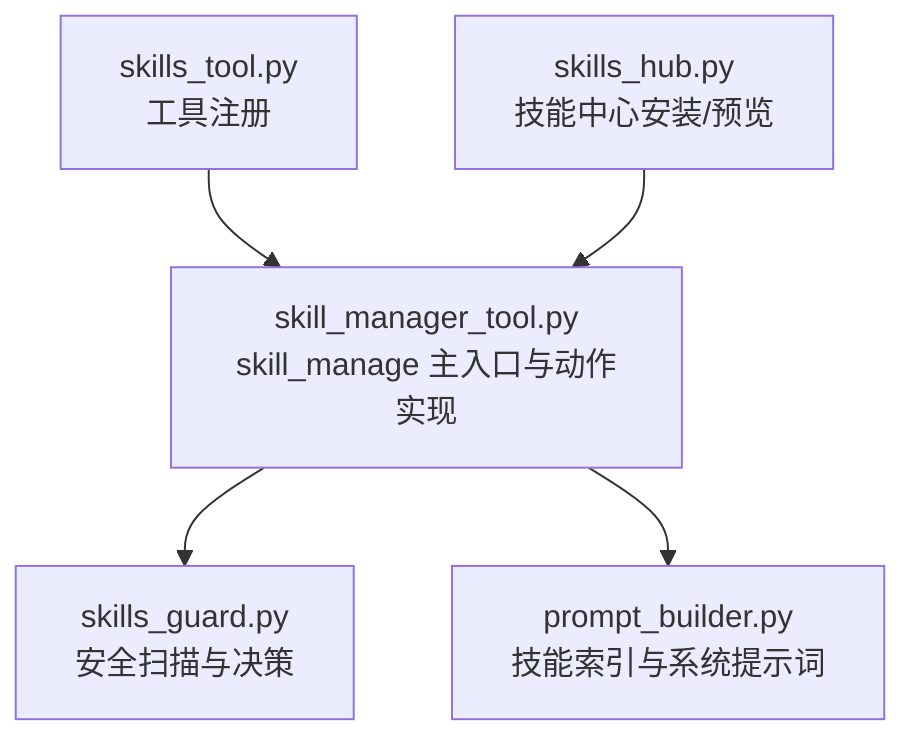
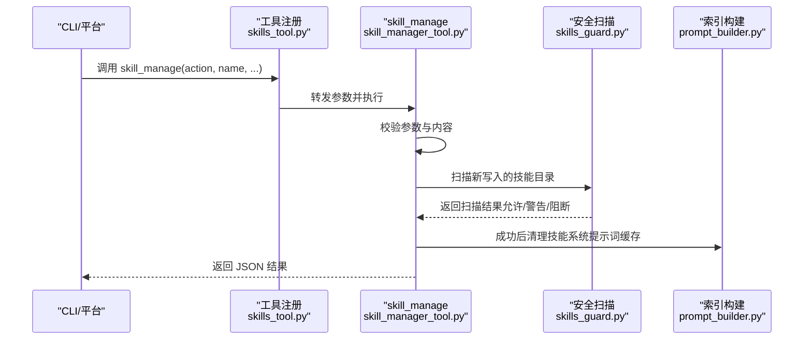
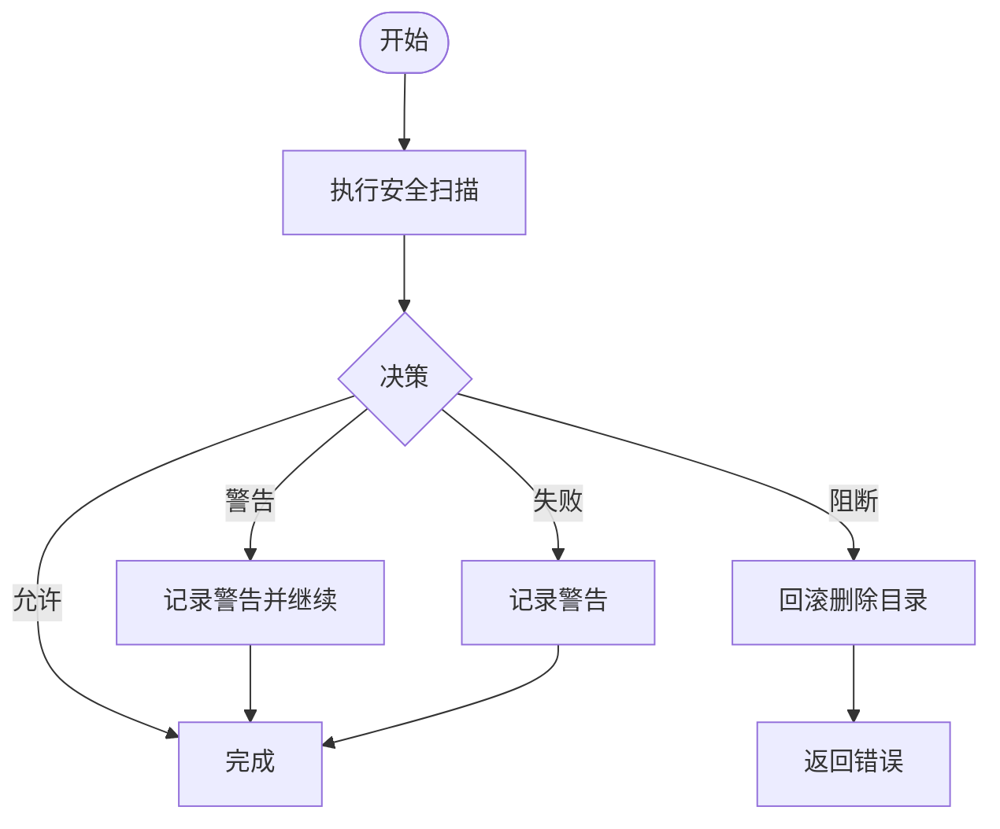
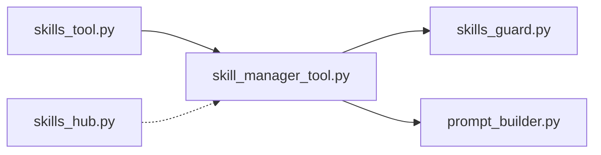

# 技能创建

<cite>
**本文引用的文件**
- [skill_manager_tool.py](file://tools/skill_manager_tool.py)
- [skills_guard.py](file://tools/skills_guard.py)
- [skills_hub.py](file://hermes_cli/skills_hub.py)
- [skills_tool.py](file://tools/skills_tool.py)
- [prompt_builder.py](file://agent/prompt_builder.py)
- [test_skill_manager_tool.py](file://tests/tools/test_skill_manager_tool.py)
- [test_skills_guard.py](file://tests/tools/test_skills_guard.py)
- [skills.md](file://website/docs/user-guide/features/skills.md)
- [SKILL.md 示例：blockchain/base](file://optional-skills/blockchain/base/SKILL.md)
- [SKILL.md 示例：dogfood](file://skills/dogfood/SKILL.md)
</cite>

## 目录
1. [简介](#简介)
2. [项目结构](#项目结构)
3. [核心组件](#核心组件)
4. [架构总览](#架构总览)
5. [详细组件分析](#详细组件分析)
6. [依赖分析](#依赖分析)
7. [性能考虑](#性能考虑)
8. [故障排查指南](#故障排查指南)
9. [结论](#结论)
10. [附录](#附录)

## 简介
本章节面向希望使用 Hermes Agent 的 skill_manage 工具创建“用户自定义技能”的工程师与使用者，系统讲解以下内容：
- 如何通过 create 动作创建新技能，包括参数配置与调用方式
- SKILL.md 文件格式与 YAML 前言元数据规范
- 技能命名规则（小写字母、数字、连字符、点号、下划线，最大64字符）
- 分类目录结构（可选 category 参数）
- 内容验证机制：前言元数据检查、描述长度限制、内容大小限制（约10万字符）
- 完整的代码示例路径：基础技能与带分类技能
- 原子写入机制与安全扫描流程

## 项目结构
技能创建能力由工具层实现，并与前端注册、安全扫描、索引构建等模块协同工作：
- 工具层：tools/skill_manager_tool.py 提供 skill_manage 主入口与各动作处理逻辑
- 安全扫描：tools/skills_guard.py 提供扫描与决策接口
- 前端注册：tools/skills_tool.py 将 skill_manage 注册为可用工具
- 索引构建：agent/prompt_builder.py 读取 SKILL.md 并构建系统提示词中的技能索引
- 文档与示例：website/docs/user-guide/features/skills.md 与 optional-skills/skills 下的 SKILL.md 示例

图表来源
- [skill_manager_tool.py:569-742](file://tools/skill_manager_tool.py#L569-L742)
- [skills_guard.py:664-1105](file://tools/skills_guard.py#L664-L1105)
- [skills_tool.py:1341-1376](file://tools/skills_tool.py#L1341-L1376)
- [prompt_builder.py:505-639](file://agent/prompt_builder.py#L505-L639)
- [skills_hub.py:1222-1262](file://hermes_cli/skills_hub.py#L1222-L1262)

章节来源
- [skill_manager_tool.py:1-33](file://tools/skill_manager_tool.py#L1-L33)
- [skills_tool.py:1341-1376](file://tools/skills_tool.py#L1341-L1376)
- [prompt_builder.py:505-639](file://agent/prompt_builder.py#L505-L639)

## 核心组件
- skill_manage 函数：统一调度 create、edit、patch、delete、write_file、remove_file 等动作，返回 JSON 结果
- 前言元数据校验：确保 SKILL.md 使用 YAML frontmatter，包含 name 与 description，且描述长度不超过限制
- 名称与分类校验：名称与分类仅允许小写、数字、连字符、点号、下划线，且名称最长64字符
- 内容大小限制：单个 SKILL.md 最大约10万字符；支持文件 write_file 单文件最大约1MB
- 原子写入：使用临时文件 + os.replace 实现崩溃安全写入
- 安全扫描：对 agent 创建的技能执行扫描，根据结果决定允许、警告或阻断

章节来源
- [skill_manager_tool.py:569-742](file://tools/skill_manager_tool.py#L569-L742)
- [skill_manager_tool.py:138-190](file://tools/skill_manager_tool.py#L138-L190)
- [skill_manager_tool.py:243-273](file://tools/skill_manager_tool.py#L243-L273)
- [skill_manager_tool.py:56-74](file://tools/skill_manager_tool.py#L56-L74)

## 架构总览
下面的序列图展示了 skill_manage 的典型调用链：从工具注册到动作执行、安全扫描与缓存清理。

图表来源
- [skills_tool.py:1341-1376](file://tools/skills_tool.py#L1341-L1376)
- [skill_manager_tool.py:569-742](file://tools/skill_manager_tool.py#L569-L742)
- [skills_guard.py:664-1105](file://tools/skills_guard.py#L664-L1105)
- [prompt_builder.py:505-639](file://agent/prompt_builder.py#L505-L639)

## 详细组件分析

### skill_manage 主流程与参数
- 支持动作：create、edit、patch、delete、write_file、remove_file
- 关键参数：
  - action：动作类型
  - name：技能名（必填），命名规则见下节
  - content：完整 SKILL.md 内容（用于 create/edit）
  - category：可选分类目录（仅 create 生效）
  - file_path / file_content：write_file 的目标路径与内容
  - old_string / new_string / replace_all：patch 的查找替换参数
- 返回：JSON 字符串，包含 success、message 或 error 字段

章节来源
- [skill_manager_tool.py:634-721](file://tools/skill_manager_tool.py#L634-L721)
- [skill_manager_tool.py:569-627](file://tools/skill_manager_tool.py#L569-L627)

### 命名规则与分类目录
- 技能名称规则（小写、数字、连字符、点号、下划线，最大64字符，必须以字母或数字开头）
- 可选分类（category）：单级目录名，同样遵循上述字符集与长度限制，且不能包含路径分隔符
- 目录布局：
  - 无分类：~/.hermes/skills/<name>/SKILL.md
  - 有分类：~/.hermes/skills/<category>/<name>/SKILL.md

章节来源
- [skill_manager_tool.py:88-92](file://tools/skill_manager_tool.py#L88-L92)
- [skill_manager_tool.py:113-135](file://tools/skill_manager_tool.py#L113-L135)
- [skill_manager_tool.py:192-196](file://tools/skill_manager_tool.py#L192-L196)

### SKILL.md 格式与 YAML 前言元数据规范
- 必须以 YAML frontmatter 开头与结尾（三横线包裹）
- 必备字段：name、description
- 描述长度限制：超过上限将被拒绝
- 正文不能为空：frontmatter 后必须有正文内容
- 其他字段（如 version、author、license、metadata.hermes.tags 等）为可选扩展

章节来源
- [skill_manager_tool.py:138-174](file://tools/skill_manager_tool.py#L138-L174)
- [SKILL.md 示例：blockchain/base:1-232](file://optional-skills/blockchain/base/SKILL.md#L1-L232)
- [SKILL.md 示例：dogfood:1-162](file://skills/dogfood/SKILL.md#L1-L162)

### 内容大小限制与支持文件
- SKILL.md 总字符数上限：约10万字符
- 支持文件（references/templates/scripts/assets 下）单文件字节数上限：约1MB
- 若超出限制，会返回错误信息并阻止写入

章节来源
- [skill_manager_tool.py:83-86](file://tools/skill_manager_tool.py#L83-L86)
- [skill_manager_tool.py:475-522](file://tools/skill_manager_tool.py#L475-L522)

### 原子写入机制
- 使用临时文件 + os.replace，避免部分写入导致的数据损坏
- 在写入前确保父目录存在，失败时清理临时文件并抛出异常

章节来源
- [skill_manager_tool.py:243-273](file://tools/skill_manager_tool.py#L243-L273)

### 安全扫描流程
- 对 agent 创建的技能目录执行扫描
- 允许：直接通过
- 警告：记录但允许，同时在日志中给出警告
- 阻断：回滚目录删除并返回错误
- 失败：记录警告并继续（不阻断）

图表来源
- [skill_manager_tool.py:56-74](file://tools/skill_manager_tool.py#L56-L74)
- [skills_guard.py:664-1105](file://tools/skills_guard.py#L664-L1105)

### 动作行为详解

#### create：创建新技能
- 校验名称与分类
- 校验 SKILL.md 前言与正文
- 检查名称冲突（跨目录搜索）
- 原子写入 SKILL.md
- 安全扫描：若阻断则删除目录并报错
- 清理技能系统提示词缓存

章节来源
- [skill_manager_tool.py:279-333](file://tools/skill_manager_tool.py#L279-L333)

#### edit：全量替换 SKILL.md
- 校验前言与大小
- 查找现有技能并备份原内容
- 原子写入并触发安全扫描
- 失败时回滚原内容

章节来源
- [skill_manager_tool.py:336-366](file://tools/skill_manager_tool.py#L336-L366)

#### patch：精准查找替换
- 默认作用于 SKILL.md；可通过 file_path 指定支持文件
- 使用模糊匹配引擎，容忍空白与转义差异
- 可选择 replace_all 以批量替换
- 替换后校验大小与前言完整性
- 触发安全扫描，失败时回滚

章节来源
- [skill_manager_tool.py:369-452](file://tools/skill_manager_tool.py#L369-L452)

#### delete：删除技能
- 查找技能并删除目录
- 清理空分类目录（保留根目录）

章节来源
- [skill_manager_tool.py:455-472](file://tools/skill_manager_tool.py#L455-L472)

#### write_file/remove_file：管理支持文件
- 校验 file_path 不允许路径穿越，必须位于 references/templates/scripts/assets 子目录内
- 支持文件大小与内容长度限制
- 原子写入与安全扫描；失败时回滚或删除新建文件

章节来源
- [skill_manager_tool.py:217-241](file://tools/skill_manager_tool.py#L217-L241)
- [skill_manager_tool.py:475-522](file://tools/skill_manager_tool.py#L475-L522)
- [skill_manager_tool.py:525-562](file://tools/skill_manager_tool.py#L525-L562)

### 前端注册与调用
- 工具注册：tools/skills_tool.py 中将 skill_manage 注册为工具集“skills”的可用工具
- 调用方式：通过工具分发器调用，参数与 schema 与 skill_manager_tool.py 中定义一致

章节来源
- [skills_tool.py:1341-1376](file://tools/skills_tool.py#L1341-L1376)
- [skill_manager_tool.py:634-721](file://tools/skill_manager_tool.py#L634-L721)

### 技能索引与系统提示词
- agent/prompt_builder.py 会扫描 SKILL.md 并构建技能索引快照，用于系统提示词
- 新建/更新技能后，skill_manage 会尝试清理相关缓存，确保索引及时刷新

章节来源
- [prompt_builder.py:505-639](file://agent/prompt_builder.py#L505-L639)
- [skill_manager_tool.py:620-627](file://tools/skill_manager_tool.py#L620-L627)

## 依赖分析
- 工具注册依赖：tools/skills_tool.py 依赖 tools/skill_manager_tool.py 的导出
- 安全扫描依赖：tools/skill_manager_tool.py 依赖 tools/skills_guard.py 的扫描与决策接口
- 索引构建依赖：agent/prompt_builder.py 依赖 SKILL.md 的存在与解析
- 文档与示例：website/docs/user-guide/features/skills.md 与 optional-skills/skills 下的 SKILL.md 示例作为规范参考

图表来源
- [skills_tool.py:1341-1376](file://tools/skills_tool.py#L1341-L1376)
- [skill_manager_tool.py:569-742](file://tools/skill_manager_tool.py#L569-L742)
- [skills_guard.py:664-1105](file://tools/skills_guard.py#L664-L1105)
- [prompt_builder.py:505-639](file://agent/prompt_builder.py#L505-L639)
- [skills_hub.py:1222-1262](file://hermes_cli/skills_hub.py#L1222-L1262)

## 性能考虑
- 原子写入避免磁盘碎片与部分写入，提升可靠性
- 缓存清理在成功后进行，减少后续索引构建开销
- 模糊匹配在 patch 中使用，降低因格式差异导致的重复尝试成本
- 大文件限制与字符数限制有助于控制内存与 I/O 峰值

## 故障排查指南
- 常见错误与定位
  - 前言缺失或未闭合：检查 SKILL.md 是否以三横线包裹的 YAML frontmatter 开头与结尾
  - 缺少 name/description：确认 frontmatter 包含必需字段
  - 描述过长：缩短 description 至上限以内
  - 内容过大：拆分为多个支持文件（references/templates/scripts/assets）或精简正文
  - 名称非法：仅使用小写、数字、连字符、点号、下划线，且不超过64字符
  - 分类非法：分类必须是单级目录名，不含路径分隔符
  - 路径穿越：write_file 的 file_path 必须位于允许的子目录内，且不得包含 “..”
  - 安全扫描阻断：根据扫描报告调整内容或使用强制模式（如适用）
- 测试参考
  - 单元测试覆盖了名称、分类、前言、文件路径、创建/编辑/补丁等场景
  - 安全扫描报告格式化与危险级别判定的测试

章节来源
- [test_skill_manager_tool.py:65-155](file://tests/tools/test_skill_manager_tool.py#L65-L155)
- [test_skill_manager_tool.py:190-200](file://tests/tools/test_skill_manager_tool.py#L190-L200)
- [test_skills_guard.py:391-418](file://tests/tools/test_skills_guard.py#L391-L418)

## 结论
skill_manage 为 Hermes Agent 提供了安全、可靠、可审计的技能创建与维护能力。通过严格的命名与格式校验、原子写入与安全扫描，以及与索引构建的协同，确保技能知识库的质量与稳定性。建议在创建复杂技能时优先采用 patch 进行增量更新，并合理拆分支持文件以满足大小限制。

## 附录

### 使用示例（路径指引）
- 基础技能创建（create）
  - 调用路径：tools/skill_manager_tool.py 中的 skill_manage(action="create", name=..., content=...)
  - 参考测试：tests/tools/test_skill_manager_tool.py 中的 test_full_create_via_dispatcher
- 带分类技能创建（create + category）
  - 调用路径：同上，增加 category 参数
  - 参考测试：tests/tools/test_skill_manager_tool.py 中的 test_create_with_category
- 前言元数据与正文规范
  - 参考示例：optional-skills/blockchain/base/SKILL.md 与 skills/dogfood/SKILL.md
- 行为与参数说明
  - 参考文档：website/docs/user-guide/features/skills.md 中的 Actions 表格

章节来源
- [test_skill_manager_tool.py:421-425](file://tests/tools/test_skill_manager_tool.py#L421-L425)
- [test_skill_manager_tool.py:197-200](file://tests/tools/test_skill_manager_tool.py#L197-L200)
- [skills.md:244-257](file://website/docs/user-guide/features/skills.md#L244-L257)
- [SKILL.md 示例：blockchain/base:1-232](file://optional-skills/blockchain/base/SKILL.md#L1-L232)
- [SKILL.md 示例：dogfood:1-162](file://skills/dogfood/SKILL.md#L1-L162)