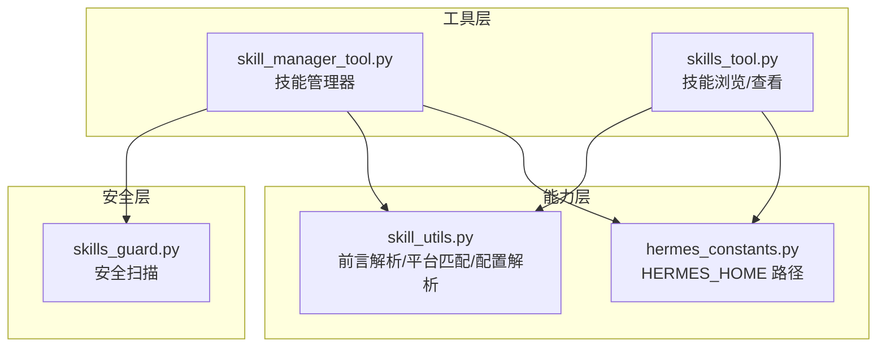
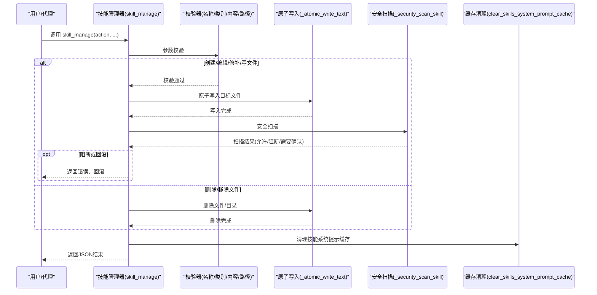
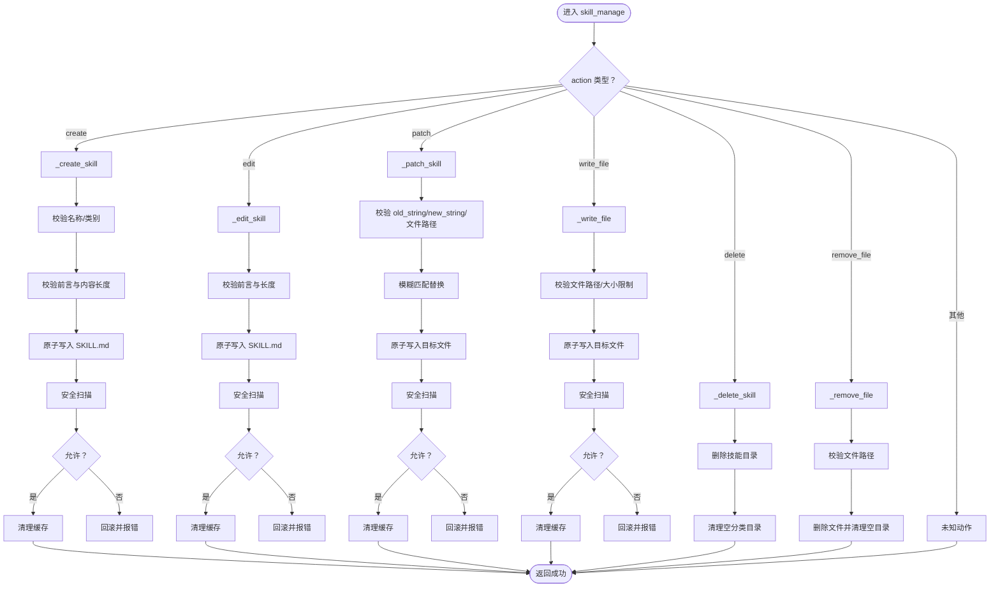
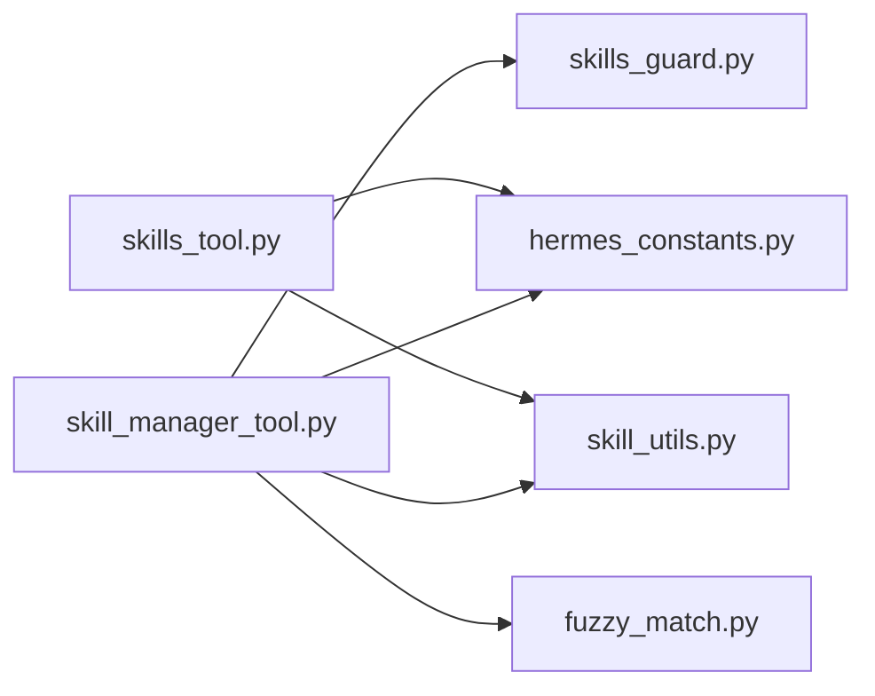

# 技能创建与管理

<cite>
**本文档引用的文件**
- [skill_manager_tool.py](file://tools/skill_manager_tool.py)
- [skills_tool.py](file://tools/skills_tool.py)
- [skills_guard.py](file://tools/skills_guard.py)
- [skill_utils.py](file://agent/skill_utils.py)
- [hermes_constants.py](file://hermes_constants.py)
- [test_skill_manager_tool.py](file://tests/tools/test_skill_manager_tool.py)
- [SKILL.md](file://skills/dogfood/SKILL.md)
</cite>

## 目录
1. [简介](#简介)
2. [项目结构](#项目结构)
3. [核心组件](#核心组件)
4. [架构总览](#架构总览)
5. [详细组件分析](#详细组件分析)
6. [依赖关系分析](#依赖关系分析)
7. [性能考量](#性能考量)
8. [故障排查指南](#故障排查指南)
9. [结论](#结论)
10. [附录](#附录)

## 简介
本文件系统性阐述 Hermes Agent 的“技能创建与管理”能力，覆盖技能生命周期（创建、编辑、修补、删除）、技能目录结构与组织方式、管理工具 API 使用方法、验证规则、安全扫描机制以及原子写入操作。文档同时提供可直接参考的代码路径与示例，帮助开发者与使用者高效地构建、维护与扩展技能体系。

## 项目结构
技能相关的核心实现集中在 tools 与 agent 子模块：
- 工具层：提供面向用户的技能管理 API（创建、编辑、修补、删除、写文件、删文件）与技能浏览/查看工具。
- 安全层：对用户创建或外部安装的技能进行安全扫描与信任策略判定。
- 能力层：解析 SKILL.md 前言元数据、平台兼容性判断、配置变量提取与注入等。

图表来源
- [skill_manager_tool.py:1-743](file://tools/skill_manager_tool.py#L1-L743)
- [skills_tool.py:1-1376](file://tools/skills_tool.py#L1-L1376)
- [skills_guard.py:1-800](file://tools/skills_guard.py#L1-L800)
- [skill_utils.py:1-443](file://agent/skill_utils.py#L1-L443)
- [hermes_constants.py:11-31](file://hermes_constants.py#L11-L31)

章节来源
- [skill_manager_tool.py:1-743](file://tools/skill_manager_tool.py#L1-L743)
- [skills_tool.py:1-1376](file://tools/skills_tool.py#L1-L1376)
- [skills_guard.py:1-800](file://tools/skills_guard.py#L1-L800)
- [skill_utils.py:1-443](file://agent/skill_utils.py#L1-L443)
- [hermes_constants.py:11-31](file://hermes_constants.py#L11-L31)

## 核心组件
- 技能管理器（skill_manager_tool.py）
  - 提供 skill_manage(action, ...) 主入口，支持 create、edit、patch、delete、write_file、remove_file 六类动作。
  - 内置名称/类别/内容/文件路径等多维校验，确保输入合法与安全。
  - 所有文件写入采用原子写入，失败自动回滚。
  - 写入后执行安全扫描，必要时回滚并拒绝安装。
- 技能浏览/查看（skills_tool.py）
  - skills_list：按需返回技能清单（最小元信息），避免大文本传输。
  - skill_view：按需加载完整技能内容与链接文件，支持按文件路径读取子文件。
- 安全扫描（skills_guard.py）
  - 静态正则扫描威胁模式（凭据泄露、提示词注入、破坏性命令、持久化、网络隧道、编码混淆等）。
  - 结构检查（文件数量、总大小、单文件大小、二进制文件、符号链接合法性）。
  - 信任策略（builtin/trusted/community/agent-created）决定允许/阻断/需要确认。
- 能力工具（skill_utils.py）
  - 解析 SKILL.md 前言元数据，提取描述、平台要求、条件字段、配置变量声明等。
  - 判断技能在当前平台是否可用，收集所有启用技能的配置变量并解析当前值。

章节来源
- [skill_manager_tool.py:569-742](file://tools/skill_manager_tool.py#L569-L742)
- [skills_tool.py:719-817](file://tools/skills_tool.py#L719-L817)
- [skills_guard.py:595-713](file://tools/skills_guard.py#L595-L713)
- [skill_utils.py:52-86](file://agent/skill_utils.py#L52-L86)

## 架构总览
技能管理从“工具调用”到“文件落盘”，再到“安全扫描”的端到端流程如下：

图表来源
- [skill_manager_tool.py:569-627](file://tools/skill_manager_tool.py#L569-L627)
- [skill_manager_tool.py:243-273](file://tools/skill_manager_tool.py#L243-L273)
- [skill_manager_tool.py:56-74](file://tools/skill_manager_tool.py#L56-L74)

## 详细组件分析

### 组件A：技能管理器（skill_manage）
- 功能职责
  - 分发不同动作：创建、编辑、修补、删除、写文件、删文件。
  - 对外暴露统一的 OpenAI 函数调用 Schema，便于模型自动选择与调用。
- 关键行为
  - 名称与类别校验：仅允许小写字母、数字、点与短横线，且必须以字母或数字开头；类别必须为单级目录名。
  - 内容校验：SKILL.md 必须包含闭合的 YAML 前言，且包含 name 与 description 字段；正文不可为空。
  - 文件路径校验：仅允许 references、templates、scripts、assets 四个子目录；禁止路径穿越；必须是具体文件而非目录。
  - 原子写入：使用临时文件 + os.replace 实现，保证写入过程崩溃不产生半成品。
  - 安全扫描：写入后对技能目录进行扫描，若被阻断则回滚。
  - 缓存清理：成功后清理技能系统提示缓存，确保最新变更生效。
- 返回值
  - 成功：success=True，携带消息、路径等信息。
  - 失败：success=False，携带错误原因；某些场景会返回可用文件列表以便自修正。

图表来源
- [skill_manager_tool.py:569-627](file://tools/skill_manager_tool.py#L569-L627)
- [skill_manager_tool.py:279-522](file://tools/skill_manager_tool.py#L279-L522)
- [skill_manager_tool.py:525-562](file://tools/skill_manager_tool.py#L525-L562)

章节来源
- [skill_manager_tool.py:569-742](file://tools/skill_manager_tool.py#L569-L742)
- [skill_manager_tool.py:279-522](file://tools/skill_manager_tool.py#L279-L522)
- [skill_manager_tool.py:525-562](file://tools/skill_manager_tool.py#L525-L562)

### 组件B：技能浏览与查看（skills_list/skill_view）
- skills_list
  - 仅返回技能名称与简要描述，避免大文本传输。
  - 支持按类别过滤，返回分类统计与提示信息。
- skill_view
  - 可加载主 SKILL.md 或指定子文件（如 references、templates、scripts、assets 下的文件）。
  - 自动合并本地与外部技能目录，优先本地目录。
  - 返回技能内容与元信息，便于后续注入配置或条件判断。

章节来源
- [skills_tool.py:719-817](file://tools/skills_tool.py#L719-L817)
- [skills_tool.py:787-817](file://tools/skills_tool.py#L787-L817)

### 组件C：安全扫描（scan_skill/should_allow_install）
- 扫描范围
  - 结构检查：文件数、总大小、单文件大小、二进制文件、符号链接合法性。
  - 正则扫描：凭据泄露、提示词注入、破坏性命令、持久化、网络隧道、编码混淆、路径穿越、供应链风险等。
  - 不可见字符检测：零宽字符、方向控制符等隐藏注入。
- 信任策略
  - builtin：内置技能，永远允许。
  - trusted：官方仓库（如 openai/skills、anthropics/skills），谨慎发现仍允许。
  - community：社区来源，任何发现均阻断。
  - agent-created：代理创建的技能，谨慎发现允许但记录警告。
- 决策输出
  - allow：直接允许。
  - block：直接阻断。
  - ask：需要用户确认（返回 None 表示需要交互确认）。

章节来源
- [skills_guard.py:595-713](file://tools/skills_guard.py#L595-L713)
- [skills_guard.py:82-484](file://tools/skills_guard.py#L82-L484)

### 组件D：能力工具（前言解析/平台匹配/配置解析）
- 前言解析：支持 YAML 前言与回退解析，提取 name、description、platforms、metadata.herme 等字段。
- 平台匹配：根据 platforms 字段判断技能在当前操作系统是否可用。
- 配置解析：提取 metadata.herme.config 声明的配置项，解析 config.yaml 中的存储值并展开路径。

章节来源
- [skill_utils.py:52-86](file://agent/skill_utils.py#L52-L86)
- [skill_utils.py:92-115](file://agent/skill_utils.py#L92-L115)
- [skill_utils.py:260-316](file://agent/skill_utils.py#L260-L316)
- [skill_utils.py:376-411](file://agent/skill_utils.py#L376-L411)

## 依赖关系分析
- 技能管理器依赖
  - hermes_constants：获取 HERMES_HOME，确定 ~/.hermes/skills/ 作为技能根目录。
  - skills_guard：安全扫描与信任策略。
  - skill_utils：平台匹配、禁用列表、外部技能目录、前言解析等。
  - fuzzy_match：修补时的模糊匹配替换。
- 技能浏览工具依赖
  - skill_utils：遍历技能索引文件、解析前言、平台匹配。
  - hermes_constants：定位技能目录。

图表来源
- [skill_manager_tool.py:42-53](file://tools/skill_manager_tool.py#L42-L53)
- [skills_tool.py:800-806](file://tools/skills_tool.py#L800-L806)
- [hermes_constants.py:11-31](file://hermes_constants.py#L11-L31)

章节来源
- [skill_manager_tool.py:42-53](file://tools/skill_manager_tool.py#L42-L53)
- [skills_tool.py:800-806](file://tools/skills_tool.py#L800-L806)
- [hermes_constants.py:11-31](file://hermes_constants.py#L11-L31)

## 性能考量
- 进度披露（skills_list/skill_view）
  - 仅在需要时加载完整内容，减少 Token 消耗与网络传输。
- 前言解析与平台匹配
  - 使用懒加载 YAML 解析器，避免重复导入重型依赖。
- 文件遍历与索引
  - 仅遍历 SKILL.md 文件，排除 .git/.github/.hub 等目录，降低 IO 开销。
- 原子写入
  - 临时文件 + os.replace，避免部分写入导致的磁盘碎片与一致性问题。

[本节为通用指导，无需特定文件引用]

## 故障排查指南
- 常见错误与处理
  - 名称非法：确保仅含小写字母、数字、点与短横线，且以字母或数字开头。
  - 类别非法：类别必须为单级目录名，不允许路径穿越或绝对路径。
  - 前言缺失或格式错误：SKILL.md 必须以闭合 YAML 前言开头，包含 name 与 description。
  - 文件路径非法：仅允许 references/templates/scripts/assets 子目录，禁止路径穿越与目录写入。
  - 内容过大：SKILL.md 与支持文件均有大小限制，超限需拆分。
  - 安全扫描阻断：扫描发现高危/中危/危险模式时会被阻断或需要确认。
- 回滚机制
  - 写入失败或扫描阻断时，会回滚到原始状态，确保一致性。
- 缓存清理
  - 成功修改后会清理技能系统提示缓存，避免旧提示影响后续推理。

章节来源
- [skill_manager_tool.py:99-190](file://tools/skill_manager_tool.py#L99-L190)
- [skill_manager_tool.py:243-273](file://tools/skill_manager_tool.py#L243-L273)
- [skill_manager_tool.py:56-74](file://tools/skill_manager_tool.py#L56-L74)

## 结论
Hermes Agent 的技能创建与管理以“安全、可靠、易用”为核心设计原则：通过严格的输入校验、原子写入与安全扫描，保障技能质量与系统安全；通过进度披露与平台匹配，优化性能与可用性；通过统一的 API 与 Schema，使模型能够自动化地进行技能管理。该体系既适合新手快速上手，也能满足高级用户的复杂定制需求。

[本节为总结性内容，无需特定文件引用]

## 附录

### 技能目录结构与组织方式
- 目录布局
  - ~/.hermes/skills/<技能名>/SKILL.md
  - 可选分类目录：~/.hermes/skills/<分类>/<技能名>/SKILL.md
  - 支持文件：references/、templates/、scripts/、assets/
- 示例（来自仓库）
  - 参考技能示例：[SKILL.md:1-162](file://skills/dogfood/SKILL.md#L1-L162)

章节来源
- [skill_manager_tool.py:22-33](file://tools/skill_manager_tool.py#L22-L33)
- [SKILL.md:1-162](file://skills/dogfood/SKILL.md#L1-L162)

### 技能管理工具 API 使用方法
- skill_manage(action, name, content=None, category=None, file_path=None, file_content=None, old_string=None, new_string=None, replace_all=False)
  - action：必填，取值 create、edit、patch、delete、write_file、remove_file
  - name：必填，技能名称
  - content：创建/编辑时必填，完整的 SKILL.md 文本（含前言与正文）
  - category：可选，技能分类（仅 create 生效）
  - file_path：可选，支持文件路径（write_file/remove_file/patch）
  - file_content：可选，写入内容（write_file 必填）
  - old_string/new_string：可选，修补时的查找与替换文本
  - replace_all：可选，修补时是否替换全部匹配项
  - 返回：JSON 字符串，包含 success、message/error、path 等字段
- 示例（参考测试）
  - 创建技能：[test_skill_manager_tool.py:421-426](file://tests/tools/test_skill_manager_tool.py#L421-L426)
  - 编辑技能：[test_skill_manager_tool.py:247-270](file://tests/tools/test_skill_manager_tool.py#L247-L270)
  - 修补技能：[test_skill_manager_tool.py:272-332](file://tests/tools/test_skill_manager_tool.py#L272-L332)
  - 写文件：[test_skill_manager_tool.py:359-377](file://tests/tools/test_skill_manager_tool.py#L359-L377)
  - 删文件：[test_skill_manager_tool.py:379-393](file://tests/tools/test_skill_manager_tool.py#L379-L393)

章节来源
- [skill_manager_tool.py:569-742](file://tools/skill_manager_tool.py#L569-L742)
- [test_skill_manager_tool.py:190-245](file://tests/tools/test_skill_manager_tool.py#L190-L245)
- [test_skill_manager_tool.py:247-270](file://tests/tools/test_skill_manager_tool.py#L247-L270)
- [test_skill_manager_tool.py:272-332](file://tests/tools/test_skill_manager_tool.py#L272-L332)
- [test_skill_manager_tool.py:359-377](file://tests/tools/test_skill_manager_tool.py#L359-L377)
- [test_skill_manager_tool.py:379-393](file://tests/tools/test_skill_manager_tool.py#L379-L393)

### 技能验证规则与安全扫描机制
- 验证规则
  - 名称：长度限制、字符集限制、首字符限制
  - 类别：单级目录名、禁止路径穿越
  - 前言：必须闭合 YAML、包含 name/description、描述长度限制
  - 内容：正文不可为空、大小限制
  - 文件路径：仅允许四个子目录、禁止路径穿越、必须是文件
  - 文件大小：支持文件默认 1MiB 限制
- 安全扫描
  - 结构检查：文件数、总大小、单文件大小、二进制文件、符号链接合法性
  - 正则扫描：凭据泄露、提示词注入、破坏性命令、持久化、网络隧道、编码混淆、路径穿越、供应链风险等
  - 信任策略：builtin/trusted/community/agent-created
  - 决策：allow/block/ask（需要用户确认）

章节来源
- [skill_manager_tool.py:99-190](file://tools/skill_manager_tool.py#L99-L190)
- [skills_guard.py:595-713](file://tools/skills_guard.py#L595-L713)
- [skills_guard.py:82-484](file://tools/skills_guard.py#L82-L484)

### 原子写入操作
- 实现要点
  - 在同一目录下创建临时文件，写入完成后使用 os.replace 替换目标文件
  - 异常时清理临时文件，避免残留
  - 适用于 SKILL.md 与支持文件的写入与修补
- 回滚机制
  - 若扫描阻断或异常，回滚到原始内容或删除新建文件

章节来源
- [skill_manager_tool.py:243-273](file://tools/skill_manager_tool.py#L243-L273)
- [skill_manager_tool.py:352-360](file://tools/skill_manager_tool.py#L352-L360)
- [skill_manager_tool.py:512-516](file://tools/skill_manager_tool.py#L512-L516)