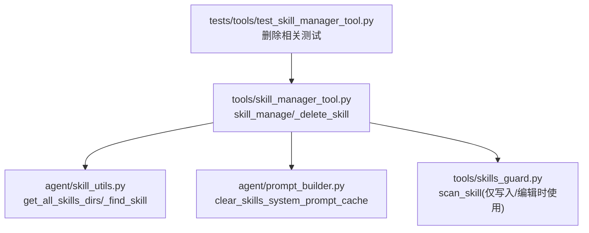
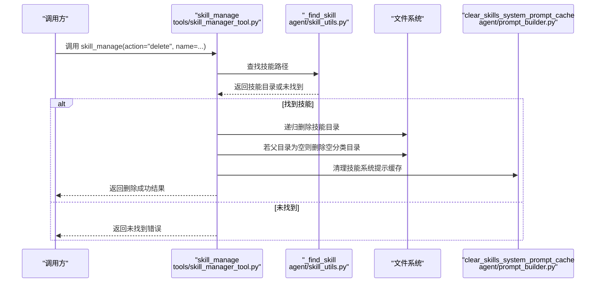
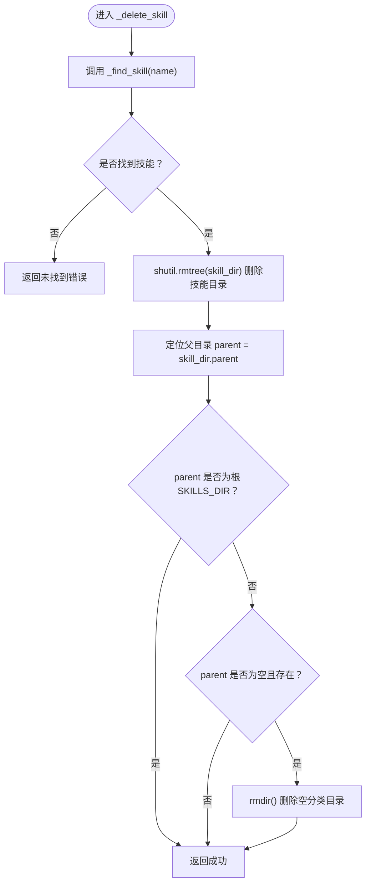
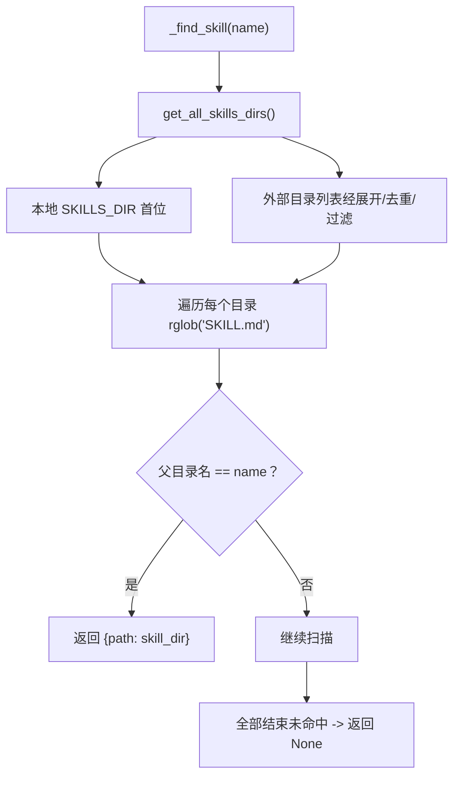
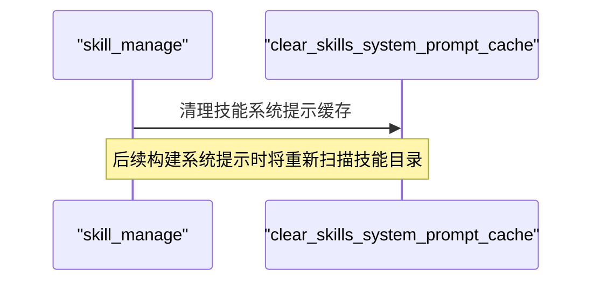
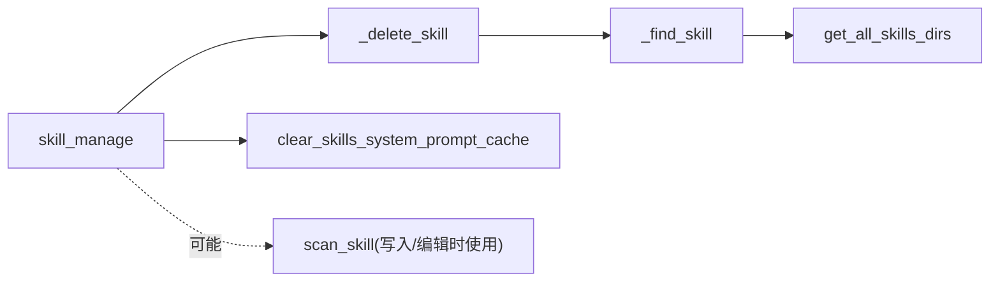

# 技能删除

<cite>
**本文引用的文件**
- [tools/skill_manager_tool.py](file://tools/skill_manager_tool.py)
- [agent/skill_utils.py](file://agent/skill_utils.py)
- [agent/prompt_builder.py](file://agent/prompt_builder.py)
- [tools/skills_guard.py](file://tools/skills_guard.py)
- [tests/tools/test_skill_manager_tool.py](file://tests/tools/test_skill_manager_tool.py)
</cite>

## 目录
1. [简介](#简介)
2. [项目结构](#项目结构)
3. [核心组件](#核心组件)
4. [架构总览](#架构总览)
5. [详细组件分析](#详细组件分析)
6. [依赖分析](#依赖分析)
7. [性能考量](#性能考量)
8. [故障排查指南](#故障排查指南)
9. [结论](#结论)

## 简介
本文件面向Hermes Agent的“技能删除”能力，聚焦于通过skill_manage函数的delete动作永久移除用户技能。文档覆盖以下关键点：
- 如何调用skill_manage(action="delete", name=...)完成删除
- 删除过程中的路径查找机制：在本地与外部技能目录中定位技能
- 删除操作的清理机制：彻底移除技能目录、自动清理空分类目录
- 安全考虑与不可逆性说明
- 删除后的系统缓存清理（技能系统提示缓存）
- 实际使用建议与错误处理要点

## 项目结构
与技能删除直接相关的核心文件与职责如下：
- tools/skill_manager_tool.py：提供skill_manage入口与各动作实现，其中包含_delete_skill
- agent/skill_utils.py：提供技能目录扫描与路径解析能力（含外部目录）
- agent/prompt_builder.py：提供技能系统提示缓存清理能力
- tools/skills_guard.py：提供安全扫描能力（用于写入/编辑等场景，删除流程不涉及扫描）
- tests/tools/test_skill_manager_tool.py：验证删除等行为的单元测试

**图表来源**
- [tools/skill_manager_tool.py:455-473](file://tools/skill_manager_tool.py#L455-L473)
- [agent/skill_utils.py:226-234](file://agent/skill_utils.py#L226-L234)
- [agent/prompt_builder.py:349-358](file://agent/prompt_builder.py#L349-L358)
- [tools/skills_guard.py:595-640](file://tools/skills_guard.py#L595-L640)
- [tests/tools/test_skill_manager_tool.py:1-200](file://tests/tools/test_skill_manager_tool.py#L1-L200)

**章节来源**
- [tools/skill_manager_tool.py:455-473](file://tools/skill_manager_tool.py#L455-L473)
- [agent/skill_utils.py:226-234](file://agent/skill_utils.py#L226-L234)
- [agent/prompt_builder.py:349-358](file://agent/prompt_builder.py#L349-L358)
- [tools/skills_guard.py:595-640](file://tools/skills_guard.py#L595-L640)
- [tests/tools/test_skill_manager_tool.py:1-200](file://tests/tools/test_skill_manager_tool.py#L1-L200)

## 核心组件
- skill_manage：对外暴露的统一入口，根据action分派到具体动作处理器。当action为delete时，调用_delete_skill
- _delete_skill：执行删除的核心逻辑，先定位技能，再递归删除技能目录；随后尝试清理空的分类目录
- _find_skill：在所有已知技能目录（本地优先、外部可选）中查找指定名称的技能
- clear_skills_system_prompt_cache：删除成功后清理技能系统提示缓存，确保后续会话看到最新状态

**章节来源**
- [tools/skill_manager_tool.py:569-627](file://tools/skill_manager_tool.py#L569-L627)
- [tools/skill_manager_tool.py:455-473](file://tools/skill_manager_tool.py#L455-L473)
- [agent/skill_utils.py:199-214](file://agent/skill_utils.py#L199-L214)
- [agent/prompt_builder.py:349-358](file://agent/prompt_builder.py#L349-L358)

## 架构总览
下图展示了删除流程从入口到落地的端到端交互。

**图表来源**
- [tools/skill_manager_tool.py:569-627](file://tools/skill_manager_tool.py#L569-L627)
- [tools/skill_manager_tool.py:455-473](file://tools/skill_manager_tool.py#L455-L473)
- [agent/skill_utils.py:199-214](file://agent/skill_utils.py#L199-L214)
- [agent/prompt_builder.py:349-358](file://agent/prompt_builder.py#L349-L358)

## 详细组件分析

### 删除动作：_delete_skill
_delete_skill负责：
- 使用_find_skill在所有技能目录中定位目标技能
- 若存在，则递归删除该技能目录
- 若父目录（即分类目录）为空且非根目录，则一并删除
- 返回标准结果对象

**图表来源**
- [tools/skill_manager_tool.py:455-473](file://tools/skill_manager_tool.py#L455-L473)

**章节来源**
- [tools/skill_manager_tool.py:455-473](file://tools/skill_manager_tool.py#L455-L473)

### 路径查找机制：_find_skill 与 get_all_skills_dirs
_find_skill通过get_all_skills_dirs提供的目录列表进行全局扫描：
- 本地技能目录总是优先（即使不存在也会被纳入）
- 外部技能目录来自配置项skills.external_dirs，经展开与去重校验后加入
- 在每个目录中递归查找SKILL.md，匹配父目录名即视为命中

**图表来源**
- [agent/skill_utils.py:226-234](file://agent/skill_utils.py#L226-L234)
- [agent/skill_utils.py:173-223](file://agent/skill_utils.py#L173-L223)
- [tools/skill_manager_tool.py:199-214](file://tools/skill_manager_tool.py#L199-L214)

**章节来源**
- [agent/skill_utils.py:173-234](file://agent/skill_utils.py#L173-L234)
- [tools/skill_manager_tool.py:199-214](file://tools/skill_manager_tool.py#L199-L214)

### 删除后的清理与缓存更新
- 删除成功后，skill_manage会调用clear_skills_system_prompt_cache，清空进程内缓存；若传入clear_snapshot=True，还会删除磁盘快照文件
- 这样可以保证后续构建系统提示时，不再包含已被删除的技能条目

**图表来源**
- [tools/skill_manager_tool.py:620-627](file://tools/skill_manager_tool.py#L620-L627)
- [agent/prompt_builder.py:349-358](file://agent/prompt_builder.py#L349-L358)

**章节来源**
- [tools/skill_manager_tool.py:620-627](file://tools/skill_manager_tool.py#L620-L627)
- [agent/prompt_builder.py:349-358](file://agent/prompt_builder.py#L349-L358)

### 安全考虑与不可逆性
- 删除操作为永久性：使用shutil.rmtree直接移除整个技能目录，无法通过常规手段恢复
- 删除前应确认技能名称与所在目录，避免误删
- 删除后会清理空的分类目录，防止遗留空壳目录
- 删除不会触发安全扫描（与写入/编辑不同），但系统提示缓存会被清理，确保后续不会显示已删除技能

**章节来源**
- [tools/skill_manager_tool.py:455-473](file://tools/skill_manager_tool.py#L455-L473)
- [tools/skill_manager_tool.py:620-627](file://tools/skill_manager_tool.py#L620-L627)

### 实战使用与错误处理
- 入口调用：调用skill_manage(action="delete", name=...)即可删除指定技能
- 错误处理：
  - 当技能不存在时，返回未找到错误
  - 删除成功后，系统会清理技能系统提示缓存，确保后续会话立即生效
- 测试参考：单元测试覆盖了入口参数校验、未知动作、以及删除流程的基本行为

**章节来源**
- [tools/skill_manager_tool.py:569-627](file://tools/skill_manager_tool.py#L569-L627)
- [tests/tools/test_skill_manager_tool.py:1-200](file://tests/tools/test_skill_manager_tool.py#L1-L200)

## 依赖分析
- skill_manage依赖_find_skill进行路径解析
- _find_skill依赖get_all_skills_dirs与外部配置
- 删除成功后依赖clear_skills_system_prompt_cache清理缓存
- 写入/编辑流程还可能触发安全扫描（删除不涉及）

**图表来源**
- [tools/skill_manager_tool.py:569-627](file://tools/skill_manager_tool.py#L569-L627)
- [tools/skill_manager_tool.py:455-473](file://tools/skill_manager_tool.py#L455-L473)
- [agent/skill_utils.py:226-234](file://agent/skill_utils.py#L226-L234)
- [agent/prompt_builder.py:349-358](file://agent/prompt_builder.py#L349-L358)
- [tools/skills_guard.py:595-640](file://tools/skills_guard.py#L595-L640)

**章节来源**
- [tools/skill_manager_tool.py:569-627](file://tools/skill_manager_tool.py#L569-L627)
- [agent/skill_utils.py:226-234](file://agent/skill_utils.py#L226-L234)
- [agent/prompt_builder.py:349-358](file://agent/prompt_builder.py#L349-L358)
- [tools/skills_guard.py:595-640](file://tools/skills_guard.py#L595-L640)

## 性能考量
- 删除操作的时间复杂度主要取决于目标技能目录的大小与层级深度，属于O(n)级别（n为文件/目录数量）
- 清理空分类目录仅在父目录为空时发生，通常为常数级开销
- 缓存清理为内存操作，影响极小
- 对于大量外部技能目录的场景，_find_skill会遍历所有目录，建议合理配置skills.external_dirs以减少扫描范围

[本节为通用指导，无需特定文件引用]

## 故障排查指南
- 报错“技能未找到”
  - 检查name是否正确（区分大小写、连字符/下划线）
  - 确认技能存在于本地或任一外部目录
  - 参考测试用例中对未找到场景的断言
- 删除后仍能看到技能
  - 确认删除成功后再发起下一次请求
  - 系统提示缓存会在删除后清理，若仍可见，检查是否存在多进程/多会话共享缓存的情况
- 分类目录未被清理
  - 仅在父目录为空时才会删除；若仍有其他子技能或隐藏文件，不会被删除
- 安全扫描相关
  - 删除不触发安全扫描；如需扫描，请在写入/编辑流程中关注相应逻辑

**章节来源**
- [tests/tools/test_skill_manager_tool.py:1-200](file://tests/tools/test_skill_manager_tool.py#L1-L200)
- [tools/skill_manager_tool.py:455-473](file://tools/skill_manager_tool.py#L455-L473)
- [agent/prompt_builder.py:349-358](file://agent/prompt_builder.py#L349-L358)

## 结论
Hermes Agent的技能删除通过skill_manage(action="delete")实现，具备明确的路径查找与清理机制。删除为不可逆操作，系统会在成功后清理技能系统提示缓存，确保后续会话立即反映最新状态。建议在执行删除前确认技能名称与所在目录，并理解删除对分类目录的影响。