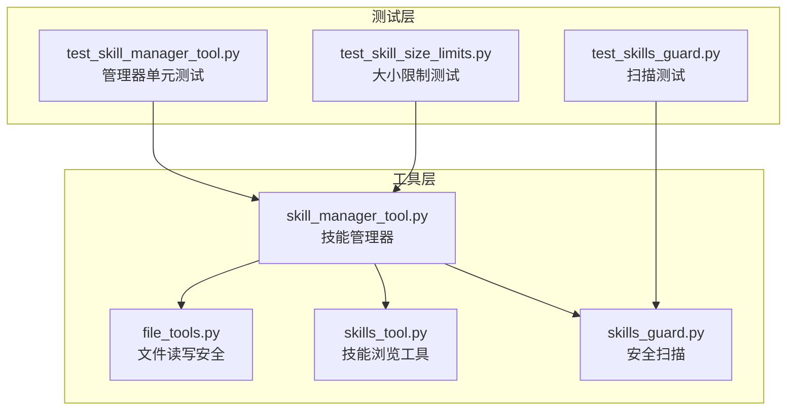
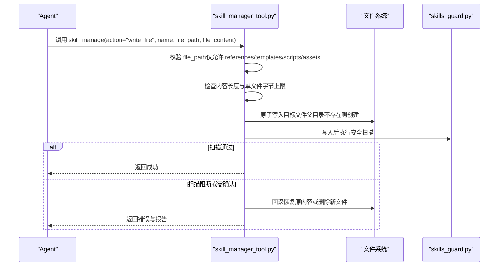
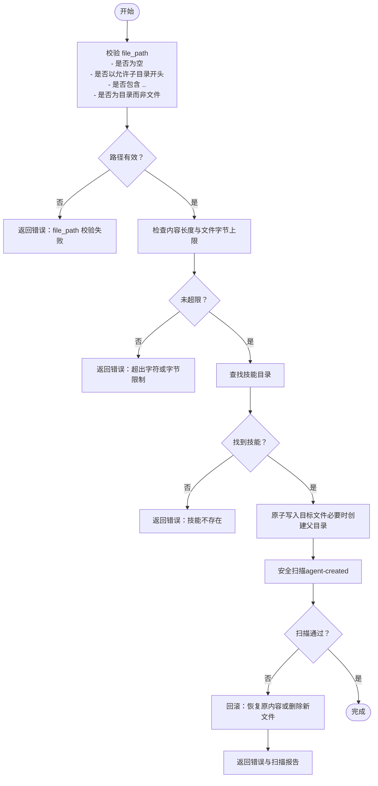
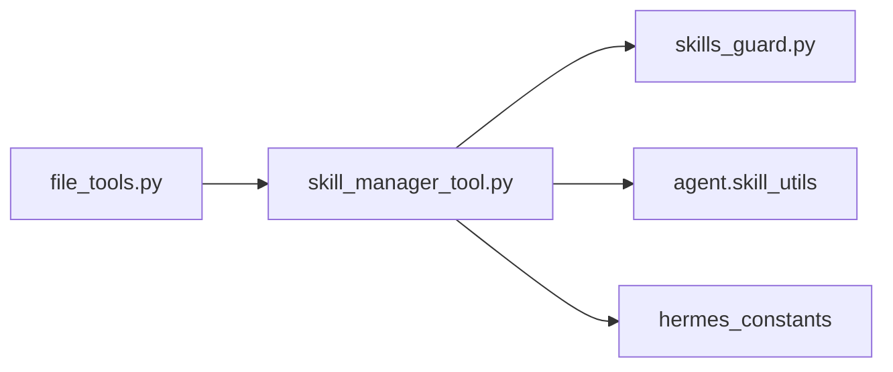

# 技能文件管理

<cite>
**本文引用的文件**
- [skill_manager_tool.py](file://tools/skill_manager_tool.py)
- [skills_tool.py](file://tools/skills_tool.py)
- [skills_guard.py](file://tools/skills_guard.py)
- [file_tools.py](file://tools/file_tools.py)
- [test_skill_manager_tool.py](file://tests/tools/test_skill_manager_tool.py)
- [test_skill_size_limits.py](file://tests/tools/test_skill_size_limits.py)
- [test_skills_guard.py](file://tests/tools/test_skills_guard.py)
</cite>

## 目录
1. [简介](#简介)
2. [项目结构](#项目结构)
3. [核心组件](#核心组件)
4. [架构总览](#架构总览)
5. [详细组件分析](#详细组件分析)
6. [依赖分析](#依赖分析)
7. [性能考虑](#性能考虑)
8. [故障排查指南](#故障排查指南)
9. [结论](#结论)

## 简介
本文档面向Hermes Agent的“技能文件管理”能力，聚焦于通过write_file与remove_file动作对技能支持文件进行增删操作。内容覆盖：
- 支持文件的子目录结构：references/、templates/、scripts/、assets/
- 文件路径校验规则：防路径穿越与非法路径访问
- 内容大小限制：技能内容字符上限与单个支持文件字节上限
- 安全扫描：在文件写入后执行的安全评估与回滚机制
- 删除清理：空目录自动清理策略
- 实际用法示例：如何添加参考文档、模板、脚本与资源文件

## 项目结构
技能文件管理位于tools模块中，核心实现集中在skill_manager_tool.py；配套的文件读写安全与扫描由file_tools.py与skills_guard.py提供。

图表来源
- [skill_manager_tool.py:1-743](file://tools/skill_manager_tool.py#L1-L743)
- [skills_tool.py:1-800](file://tools/skills_tool.py#L1-L800)
- [skills_guard.py:1-800](file://tools/skills_guard.py#L1-L800)
- [file_tools.py:1-200](file://tools/file_tools.py#L1-L200)
- [test_skill_manager_tool.py:1-426](file://tests/tools/test_skill_manager_tool.py#L1-L426)
- [test_skill_size_limits.py:1-216](file://tests/tools/test_skill_size_limits.py#L1-L216)
- [test_skills_guard.py:254-286](file://tests/tools/test_skills_guard.py#L254-L286)

章节来源
- [skill_manager_tool.py:22-33](file://tools/skill_manager_tool.py#L22-L33)
- [skills_tool.py:14-27](file://tools/skills_tool.py#L14-L27)

## 核心组件
- 技能管理器（skill_manager_tool.py）
  - 提供create、edit、patch、delete、write_file、remove_file等动作
  - 负责路径校验、大小限制、原子写入、安全扫描与回滚
- 技能浏览工具（skills_tool.py）
  - 列出与查看技能，组织references/templates/scripts/assets等支持文件
- 安全扫描（skills_guard.py）
  - 对技能目录进行结构检查、正则模式匹配与不可见字符检测
  - 基于信任级别与扫描结果决定是否允许安装或需要确认
- 文件读写安全（file_tools.py）
  - 阻止写入敏感系统路径，提供读取字符数上限与设备路径阻断
  - 为通用文件操作提供安全基线

章节来源
- [skill_manager_tool.py:47-75](file://tools/skill_manager_tool.py#L47-L75)
- [skills_tool.py:14-27](file://tools/skills_tool.py#L14-L27)
- [skills_guard.py:39-47](file://tools/skills_guard.py#L39-L47)
- [file_tools.py:92-115](file://tools/file_tools.py#L92-L115)

## 架构总览
技能文件管理的关键流程如下：

图表来源
- [skill_manager_tool.py:475-522](file://tools/skill_manager_tool.py#L475-L522)
- [skills_guard.py:595-640](file://tools/skills_guard.py#L595-L640)

章节来源
- [skill_manager_tool.py:475-522](file://tools/skill_manager_tool.py#L475-L522)
- [skills_guard.py:595-640](file://tools/skills_guard.py#L595-L640)

## 详细组件分析

### 允许的子目录结构与文件组织
- references/：参考文档与外部资料链接
- templates/：可复用的输出模板
- scripts/：运行时脚本（如训练、部署、清理）
- assets/：补充资源（图片、配置样例等）

这些目录是write_file/remove_file动作的唯一合法作用域，任何其他路径均会被拒绝。

章节来源
- [skill_manager_tool.py:92](file://tools/skill_manager_tool.py#L92)
- [skills_tool.py:18-26](file://tools/skills_tool.py#L18-L26)

### 路径验证规则与安全防护
- 必须以允许的子目录开头（references/templates/scripts/assets）
- 不允许出现路径穿越片段（..）
- 必须是具体文件路径，不能仅为目录名
- 不允许直接写入根级文件（必须在上述子目录内）

章节来源
- [skill_manager_tool.py:217-241](file://tools/skill_manager_tool.py#L217-L241)
- [test_skill_manager_tool.py:155-183](file://tests/tools/test_skill_manager_tool.py#L155-L183)

### 文件内容大小限制
- 技能内容字符上限：100,000字符
- 单个支持文件字节上限：1 MiB（1,048,576字节）
- 限制在create/edit/patch/write_file阶段生效
- 手工放置或从Hub安装的技能不强制此上限（但仍会触发扫描）

章节来源
- [skill_manager_tool.py:85-86](file://tools/skill_manager_tool.py#L85-L86)
- [test_skill_size_limits.py:46-64](file://tests/tools/test_skill_size_limits.py#L46-L64)
- [test_skill_size_limits.py:170-197](file://tests/tools/test_skill_size_limits.py#L170-L197)
- [test_skill_size_limits.py:200-216](file://tests/tools/test_skill_size_limits.py#L200-L216)

### 原子写入与回滚
- 使用临时文件+替换的方式确保写入过程崩溃不会留下半写文件
- 写入前备份原内容，若安全扫描失败则回滚到原内容或删除新建文件
- 成功后刷新系统提示缓存，保证后续加载最新技能

章节来源
- [skill_manager_tool.py:243-273](file://tools/skill_manager_tool.py#L243-L273)
- [skill_manager_tool.py:505-516](file://tools/skill_manager_tool.py#L505-L516)
- [skill_manager_tool.py:620-627](file://tools/skill_manager_tool.py#L620-L627)

### 安全扫描与回滚机制
- 写入后立即对技能目录执行扫描，包括结构检查、正则威胁模式与不可见字符检测
- 基于信任级别（agent-created）与扫描结果决定是否允许
- 若扫描阻断，返回错误并回滚；若需确认，记录警告但不阻断
- 可通过LLM审计进一步提升识别精度（在静态扫描基础上）

章节来源
- [skill_manager_tool.py:56-74](file://tools/skill_manager_tool.py#L56-L74)
- [skills_guard.py:595-640](file://tools/skills_guard.py#L595-L640)
- [skills_guard.py:642-677](file://tools/skills_guard.py#L642-L677)
- [skills_guard.py:897-911](file://tools/skills_guard.py#L897-L911)

### 文件删除后的清理机制
- 删除支持文件后，若其所在子目录为空，则自动删除该子目录
- 删除技能时，若其所在分类目录为空，也会被自动清理

章节来源
- [skill_manager_tool.py:554-558](file://tools/skill_manager_tool.py#L554-L558)
- [skill_manager_tool.py:464-468](file://tools/skill_manager_tool.py#L464-L468)

### 实际用法示例（路径指引）
以下示例展示如何使用write_file与remove_file添加/移除不同类型的技能支持文件。请根据实际路径与内容替换参数。

- 添加参考文档（references/）
  - 动作：write_file
  - 参数：name、file_path（形如references/api.md）、file_content
  - 示例调用路径：[skill_manage调用示例:359-366](file://tests/tools/test_skill_manager_tool.py#L359-L366)

- 添加模板文件（templates/）
  - 动作：write_file
  - 参数：name、file_path（形如templates/config.yaml）、file_content
  - 示例调用路径：[路径校验与示例:155-160](file://tests/tools/test_skill_manager_tool.py#L155-L160)

- 添加脚本文件（scripts/）
  - 动作：write_file
  - 参数：name、file_path（形如scripts/train.py）、file_content
  - 示例调用路径：[路径校验与示例:155-160](file://tests/tools/test_skill_manager_tool.py#L155-L160)

- 添加资源文件（assets/）
  - 动作：write_file
  - 参数：name、file_path（形如assets/image.png）、file_content
  - 示例调用路径：[路径校验与示例:155-160](file://tests/tools/test_skill_manager_tool.py#L155-L160)

- 移除支持文件
  - 动作：remove_file
  - 参数：name、file_path（形如references/api.md）
  - 示例调用路径：[移除现有文件示例:380-387](file://tests/tools/test_skill_manager_tool.py#L380-L387)

- 移除不存在的文件
  - 动作：remove_file
  - 返回：包含可用文件列表的错误信息，便于模型修正路径
  - 示例调用路径：[不存在文件示例:388-393](file://tests/tools/test_skill_manager_tool.py#L388-L393)

章节来源
- [test_skill_manager_tool.py:359-393](file://tests/tools/test_skill_manager_tool.py#L359-L393)

### 复杂逻辑流程图（路径校验与写入）

图表来源
- [skill_manager_tool.py:217-241](file://tools/skill_manager_tool.py#L217-L241)
- [skill_manager_tool.py:475-522](file://tools/skill_manager_tool.py#L475-L522)
- [skills_guard.py:595-640](file://tools/skills_guard.py#L595-L640)

章节来源
- [skill_manager_tool.py:217-241](file://tools/skill_manager_tool.py#L217-L241)
- [skill_manager_tool.py:475-522](file://tools/skill_manager_tool.py#L475-L522)
- [skills_guard.py:595-640](file://tools/skills_guard.py#L595-L640)

## 依赖分析
- skill_manager_tool依赖
  - skills_guard：用于写入后的安全扫描与决策
  - agent.skill_utils：技能目录发现与平台匹配
  - hermes_constants：获取HERMES_HOME确定技能根目录
- file_tools提供通用文件操作安全基线（敏感路径阻断、读取字符上限）
- 测试覆盖路径校验、大小限制、扫描策略与删除清理

图表来源
- [skill_manager_tool.py:47-54](file://tools/skill_manager_tool.py#L47-L54)
- [file_tools.py:92-115](file://tools/file_tools.py#L92-L115)

章节来源
- [skill_manager_tool.py:47-54](file://tools/skill_manager_tool.py#L47-L54)
- [file_tools.py:92-115](file://tools/file_tools.py#L92-L115)

## 性能考虑
- 写入采用原子替换，避免部分写导致的锁竞争与数据损坏
- 扫描范围按文本扩展名过滤，减少对二进制文件的处理开销
- 结构检查快速判定异常（文件数量、总大小、单文件过大、符号链接逃逸）
- 读取侧有字符上限与设备路径阻断，避免大文件与阻塞设备带来的上下文窗口压力

## 故障排查指南
- 路径错误
  - 现象：返回“file_path is required.”或“Path traversal (...) is not allowed.”或“File must be under one of: ...”
  - 排查：确认file_path以references/templates/scripts/assets之一开头，不含..，且为具体文件路径
  - 参考：[路径校验测试:155-183](file://tests/tools/test_skill_manager_tool.py#L155-L183)

- 超出大小限制
  - 现象：返回“content is X characters (limit: 100,000)”或“File content is X bytes (limit: 1,048,576 bytes / 1 MiB)”
  - 排查：拆分内容为多个小文件，或将长内容放入references/templates/assets
  - 参考：[大小限制测试:46-64](file://tests/tools/test_skill_size_limits.py#L46-L64)

- 安全扫描阻断
  - 现象：返回“Security scan blocked this skill (...)”，并附带扫描报告
  - 排查：检查文件内容是否存在敏感模式（如外发凭据、破坏性命令、反安全指令等）
  - 参考：[扫描测试:267-286](file://tests/tools/test_skills_guard.py#L267-L286)

- 删除后目录未清理
  - 现象：删除文件后子目录仍存在
  - 排查：确认删除的是支持文件且父目录已为空；若非空则保留
  - 参考：[删除清理逻辑:554-558](file://tools/skill_manager_tool.py#L554-L558)

- 写入失败但无残留临时文件
  - 现象：写入异常后磁盘无遗留.tmp文件
  - 排查：原子写入会在异常时清理临时文件，确保一致性
  - 参考：[原子写入实现:243-273](file://tools/skill_manager_tool.py#L243-L273)

章节来源
- [test_skill_manager_tool.py:155-183](file://tests/tools/test_skill_manager_tool.py#L155-L183)
- [test_skill_size_limits.py:46-64](file://tests/tools/test_skill_size_limits.py#L46-L64)
- [test_skills_guard.py:267-286](file://tests/tools/test_skills_guard.py#L267-L286)
- [skill_manager_tool.py:554-558](file://tools/skill_manager_tool.py#L554-L558)
- [skill_manager_tool.py:243-273](file://tools/skill_manager_tool.py#L243-L273)

## 结论
Hermes Agent的技能文件管理通过严格的路径校验、大小限制与安全扫描，确保用户在编写与维护技能支持文件时的安全与可靠。write_file与remove_file动作配合原子写入与回滚机制，既提升了易用性，也降低了风险。遵循本文档的目录结构与规则，即可高效地为技能添加参考、模板、脚本与资源文件，并在删除后自动清理空目录，保持技能仓库整洁有序。