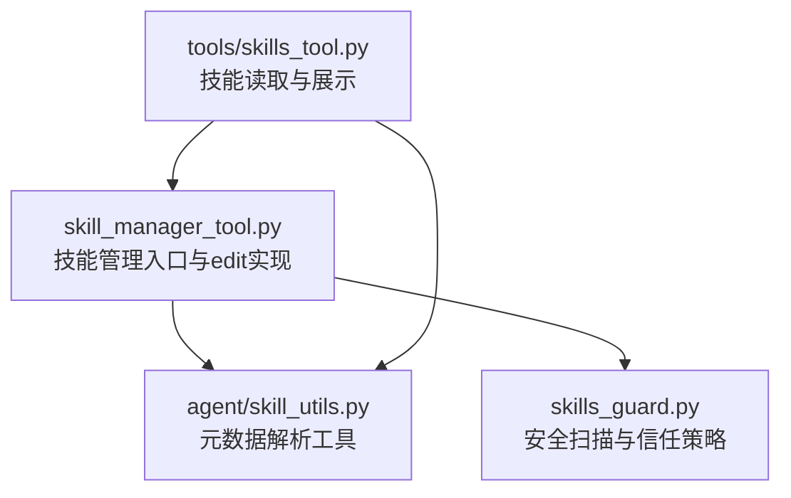
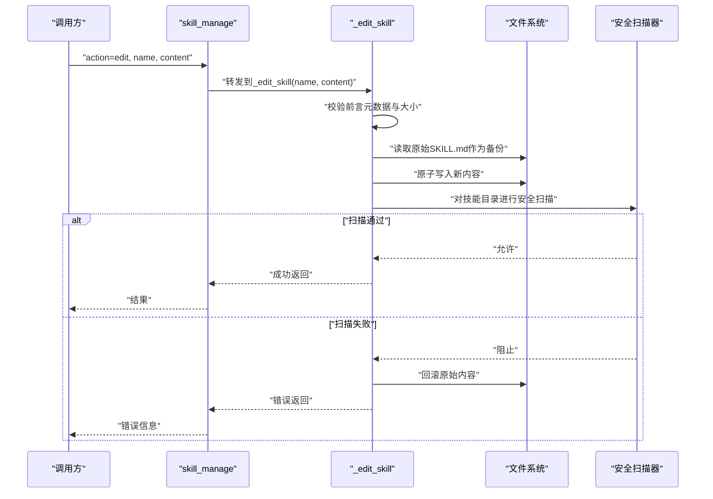
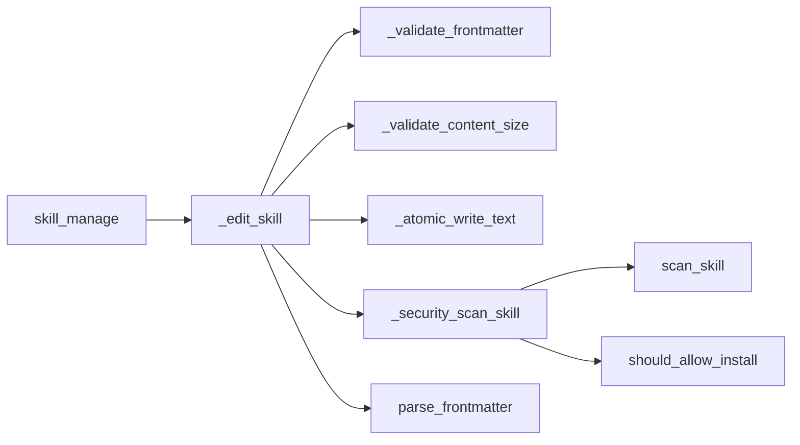

# 技能编辑

<cite>
**本文引用的文件**
- [tools/skill_manager_tool.py](file://tools/skill_manager_tool.py)
- [tools/skills_guard.py](file://tools/skills_guard.py)
- [agent/skill_utils.py](file://agent/skill_utils.py)
- [tools/skills_tool.py](file://tools/skills_tool.py)
- [tests/tools/test_skill_manager_tool.py](file://tests/tools/test_skill_manager_tool.py)
- [tests/tools/test_skills_guard.py](file://tests/tools/test_skills_guard.py)
</cite>

## 目录
1. [简介](#简介)
2. [项目结构](#项目结构)
3. [核心组件](#核心组件)
4. [架构总览](#架构总览)
5. [详细组件分析](#详细组件分析)
6. [依赖关系分析](#依赖关系分析)
7. [性能考量](#性能考量)
8. [故障排查指南](#故障排查指南)
9. [结论](#结论)
10. [附录](#附录)

## 简介
本文件面向Hermes Agent的“技能编辑”能力，聚焦于skill_manage工具的edit动作，系统性说明如何以“全文重写”的方式更新现有技能的SKILL.md内容。文档覆盖以下关键主题：
- 使用edit动作更新技能的完整流程与注意事项
- 内容验证流程：前言元数据完整性检查、正文内容校验、大小限制
- 编辑过程中的备份与回滚机制：在安全扫描失败时自动恢复原始内容
- 与patch动作的区别：何时应选择edit而非patch
- 实战示例路径：如何先读取现有技能内容，再将修改后的完整SKILL.md写回

## 项目结构
围绕技能编辑的核心代码主要位于tools目录下的skill_manager_tool.py，配套的安全扫描逻辑在skills_guard.py中，前端展示与读取逻辑在skills_tool.py中，解析元数据的工具在agent/skill_utils.py中。

图表来源
- [tools/skill_manager_tool.py:568-636](file://tools/skill_manager_tool.py#L568-L636)
- [tools/skills_guard.py:595-640](file://tools/skills_guard.py#L595-L640)
- [agent/skill_utils.py:52-80](file://agent/skill_utils.py#L52-L80)
- [tools/skills_tool.py:800-999](file://tools/skills_tool.py#L800-L999)

章节来源
- [tools/skill_manager_tool.py:1-200](file://tools/skill_manager_tool.py#L1-L200)
- [tools/skill_manager_tool.py:336-366](file://tools/skill_manager_tool.py#L336-L366)
- [tools/skills_guard.py:595-640](file://tools/skills_guard.py#L595-L640)
- [agent/skill_utils.py:52-80](file://agent/skill_utils.py#L52-L80)
- [tools/skills_tool.py:800-999](file://tools/skills_tool.py#L800-L999)

## 核心组件
- skill_manage函数（dispatch）：根据action分发到具体处理逻辑，edit分支负责全文重写。
- _edit_skill函数：执行前言元数据校验、内容大小限制、原子写入、安全扫描与回滚。
- 安全扫描器：scan_skill与should_allow_install，决定是否允许安装/更新。
- 元数据解析：parse_frontmatter，确保YAML前言正确且包含必要字段。
- 技能读取工具：skills_tool的skill_view等函数，用于读取现有技能内容以便编辑。

章节来源
- [tools/skill_manager_tool.py:568-636](file://tools/skill_manager_tool.py#L568-L636)
- [tools/skill_manager_tool.py:336-366](file://tools/skill_manager_tool.py#L336-L366)
- [tools/skills_guard.py:595-640](file://tools/skills_guard.py#L595-L640)
- [agent/skill_utils.py:52-80](file://agent/skill_utils.py#L52-L80)
- [tools/skills_tool.py:800-999](file://tools/skills_tool.py#L800-L999)

## 架构总览
下图展示了edit动作从调用到落盘的端到端流程，包括验证、备份、原子写入与安全扫描回滚。

图表来源
- [tools/skill_manager_tool.py:568-636](file://tools/skill_manager_tool.py#L568-L636)
- [tools/skill_manager_tool.py:336-366](file://tools/skill_manager_tool.py#L336-L366)
- [tools/skills_guard.py:595-640](file://tools/skills_guard.py#L595-L640)

## 详细组件分析

### edit动作与全文重写机制
- 输入要求：必须提供完整的新版SKILL.md文本（含YAML前言与正文），否则返回错误提示。
- 前言元数据完整性检查：必须以三短划线起始与结束，包含name与description字段，description长度受限；正文不能为空。
- 内容大小限制：单次写入字符数上限约10万字符；支持文件（如脚本、模板）单文件最大约1MiB。
- 原子写入：使用临时文件+替换的方式，避免部分写入导致损坏。
- 备份与回滚：写入前读取原始内容，若安全扫描失败则立即回滚至原始内容。
- 成功后清理缓存：触发系统提示词缓存清理，确保后续推理使用最新技能。

章节来源
- [tools/skill_manager_tool.py:568-636](file://tools/skill_manager_tool.py#L568-L636)
- [tools/skill_manager_tool.py:336-366](file://tools/skill_manager_tool.py#L336-L366)
- [tools/skill_manager_tool.py:138-189](file://tools/skill_manager_tool.py#L138-L189)
- [tools/skill_manager_tool.py:243-273](file://tools/skill_manager_tool.py#L243-L273)

### 内容验证流程
- 前言校验：三短划线闭合、YAML可解析、映射类型、必需字段存在且描述长度合规。
- 正文校验：三短划线闭合后必须有正文内容。
- 大小限制：字符数超过上限时给出拆分建议（拆分到references/templates等子文件）。

章节来源
- [tools/skill_manager_tool.py:138-189](file://tools/skill_manager_tool.py#L138-L189)

### 备份与回滚机制
- 写入前备份：读取原始SKILL.md内容，保存为original_content。
- 回滚条件：安全扫描返回阻止时，使用原子写入将original_content写回原位。
- 异常处理：临时文件清理、日志记录，保证一致性与可观测性。

章节来源
- [tools/skill_manager_tool.py:355-360](file://tools/skill_manager_tool.py#L355-L360)
- [tools/skill_manager_tool.py:243-273](file://tools/skill_manager_tool.py#L243-L273)

### 安全扫描与信任策略
- 扫描范围：结构检查（文件数量、总大小、二进制、符号链接）、正则模式匹配、不可见Unicode检测。
- 信任级别：内置/受信/社区/代理创建，不同级别采用不同的安装策略。
- 结果判定：safe/caution/dangerous；dangerous直接阻止；ask需用户确认。
- LLM审计：对静态扫描遗漏的威胁进行二次审计（仅在safe/caution时触发）。

章节来源
- [tools/skills_guard.py:595-640](file://tools/skills_guard.py#L595-L640)
- [tools/skills_guard.py:642-664](file://tools/skills_guard.py#L642-L664)
- [tools/skills_guard.py:897-948](file://tools/skills_guard.py#L897-L948)

### 元数据解析与兼容性
- parse_frontmatter：解析YAML前言，支持嵌套结构与回退解析；返回字典与剩余正文。
- 技能描述提取：用于索引与展示，长度截断并保留上下文。

章节来源
- [agent/skill_utils.py:52-80](file://agent/skill_utils.py#L52-L80)

### 与patch动作的区别与适用场景
- edit：适用于“重大改写”，需要提供完整的SKILL.md文本；适合重构、补充章节、统一风格等。
- patch：适用于“局部修复”，基于旧字符串与新字符串进行精确替换；适合修正错别字、调整步骤顺序等。
- 选择建议：编辑范围大、涉及结构变化用edit；只改动少量文字用patch。

章节来源
- [tools/skill_manager_tool.py:568-636](file://tools/skill_manager_tool.py#L568-L636)
- [tools/skill_manager_tool.py:369-400](file://tools/skill_manager_tool.py#L369-L400)

### 实际使用示例（路径指引）
以下示例均以“代码片段路径”形式给出，便于定位实现细节与参考用法：

- 读取现有技能内容（用于编辑前预览与对比）
  - [tools/skills_tool.py:865-875](file://tools/skills_tool.py#L865-L875)
  - [tools/skills_tool.py:947-999](file://tools/skills_tool.py#L947-L999)

- 提交编辑请求（提供完整SKILL.md）
  - [tools/skill_manager_tool.py:568-636](file://tools/skill_manager_tool.py#L568-L636)
  - [tools/skill_manager_tool.py:336-366](file://tools/skill_manager_tool.py#L336-L366)

- 验证与大小限制
  - [tools/skill_manager_tool.py:138-189](file://tools/skill_manager_tool.py#L138-L189)

- 原子写入与回滚
  - [tools/skill_manager_tool.py:243-273](file://tools/skill_manager_tool.py#L243-L273)
  - [tools/skill_manager_tool.py:355-360](file://tools/skill_manager_tool.py#L355-L360)

- 安全扫描与信任策略
  - [tools/skills_guard.py:595-640](file://tools/skills_guard.py#L595-L640)
  - [tools/skills_guard.py:642-664](file://tools/skills_guard.py#L642-L664)

- 测试用例参考（行为验证）
  - [tests/tools/test_skill_manager_tool.py:421-426](file://tests/tools/test_skill_manager_tool.py#L421-L426)
  - [tests/tools/test_skills_guard.py:267-286](file://tests/tools/test_skills_guard.py#L267-L286)

## 依赖关系分析
- skill_manage依赖：
  - _edit_skill：核心业务逻辑
  - _validate_frontmatter/_validate_content_size：输入校验
  - _atomic_write_text：原子写入
  - _security_scan_skill：安全扫描
- 安全扫描依赖：
  - scan_skill：结构+模式+不可见字符扫描
  - should_allow_install：基于信任级别与扫描结果的决策
- 元数据解析依赖：
  - parse_frontmatter：YAML解析与回退策略

图表来源
- [tools/skill_manager_tool.py:568-636](file://tools/skill_manager_tool.py#L568-L636)
- [tools/skill_manager_tool.py:336-366](file://tools/skill_manager_tool.py#L336-L366)
- [tools/skill_manager_tool.py:243-273](file://tools/skill_manager_tool.py#L243-L273)
- [tools/skills_guard.py:595-640](file://tools/skills_guard.py#L595-L640)
- [agent/skill_utils.py:52-80](file://agent/skill_utils.py#L52-L80)

章节来源
- [tools/skill_manager_tool.py:568-636](file://tools/skill_manager_tool.py#L568-L636)
- [tools/skill_manager_tool.py:336-366](file://tools/skill_manager_tool.py#L336-L366)
- [tools/skills_guard.py:595-640](file://tools/skills_guard.py#L595-L640)
- [agent/skill_utils.py:52-80](file://agent/skill_utils.py#L52-L80)

## 性能考量
- 原子写入：使用临时文件+替换，避免部分写入与并发竞争带来的不一致。
- 扫描范围控制：支持按扩展名过滤可扫描文件，避免对二进制或无关文件进行扫描。
- LLM审计截断：对超长内容进行截断，避免超出模型上下文长度限制。
- 缓存清理：编辑成功后清理系统提示词缓存，确保后续推理使用最新技能。

章节来源
- [tools/skill_manager_tool.py:243-273](file://tools/skill_manager_tool.py#L243-L273)
- [tools/skills_guard.py:917-948](file://tools/skills_guard.py#L917-L948)
- [tools/skill_manager_tool.py:620-626](file://tools/skill_manager_tool.py#L620-L626)

## 故障排查指南
- 常见错误与处理
  - 缺少content参数：edit需要提供完整SKILL.md文本。
  - 前言不合法：检查三短划线闭合、YAML可解析、必需字段齐全。
  - 内容过大：超过字符上限时，建议拆分为references/templates等子文件。
  - 安全扫描失败：扫描器会返回阻断原因与报告，必要时回滚原始内容。
- 参考测试用例
  - 创建与编辑成功的行为验证
  - 安全扫描结果与信任级别的判定

章节来源
- [tools/skill_manager_tool.py:568-636](file://tools/skill_manager_tool.py#L568-L636)
- [tests/tools/test_skill_manager_tool.py:421-426](file://tests/tools/test_skill_manager_tool.py#L421-L426)
- [tests/tools/test_skills_guard.py:267-286](file://tests/tools/test_skills_guard.py#L267-L286)

## 结论
- edit动作适合“重大改写”，强调完整性与一致性，配合严格的前言校验、大小限制与安全扫描回滚机制，确保技能更新的安全与可靠。
- 对于局部修复，优先考虑patch动作，提升效率与可控性。
- 在实际使用中，建议先通过skill_view读取并审阅现有内容，再提交edit，以获得更清晰的变更轨迹与更高的成功率。

## 附录
- 相关实现路径（供查阅）
  - [tools/skill_manager_tool.py:336-366](file://tools/skill_manager_tool.py#L336-L366)
  - [tools/skill_manager_tool.py:138-189](file://tools/skill_manager_tool.py#L138-L189)
  - [tools/skill_manager_tool.py:243-273](file://tools/skill_manager_tool.py#L243-L273)
  - [tools/skills_guard.py:595-640](file://tools/skills_guard.py#L595-L640)
  - [agent/skill_utils.py:52-80](file://agent/skill_utils.py#L52-L80)
  - [tools/skills_tool.py:865-875](file://tools/skills_tool.py#L865-L875)