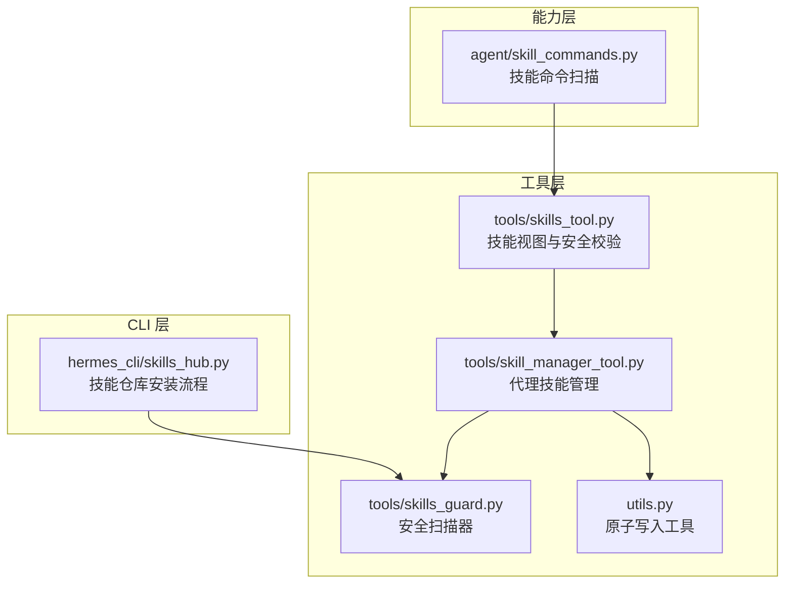
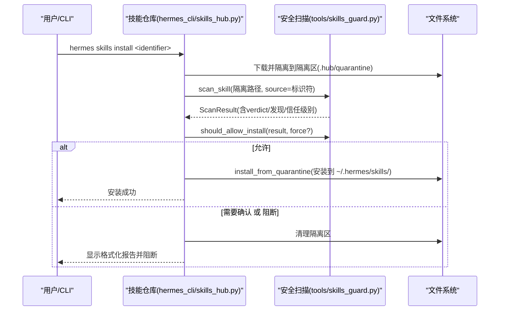
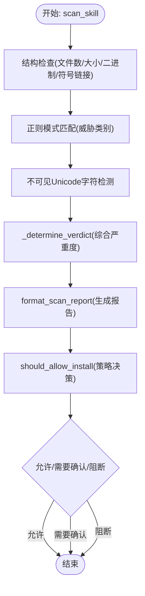
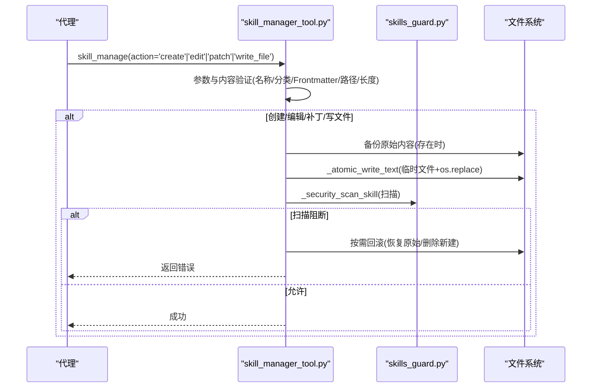
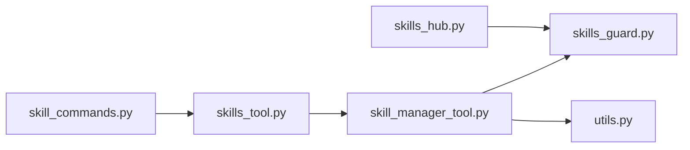

# 技能验证与安全

<cite>
**本文引用的文件**
- [skills_guard.py](file://tools/skills_guard.py)
- [skills_hub.py](file://hermes_cli/skills_hub.py)
- [skill_manager_tool.py](file://tools/skill_manager_tool.py)
- [utils.py](file://utils.py)
- [skills_tool.py](file://tools/skills_tool.py)
- [skill_commands.py](file://agent/skill_commands.py)
</cite>

## 目录
1. [简介](#简介)
2. [项目结构](#项目结构)
3. [核心组件](#核心组件)
4. [架构总览](#架构总览)
5. [详细组件分析](#详细组件分析)
6. [依赖关系分析](#依赖关系分析)
7. [性能考量](#性能考量)
8. [故障排查指南](#故障排查指南)
9. [结论](#结论)

## 简介
本文件系统化梳理 Hermes Agent 的“技能验证与安全”机制，覆盖以下关键主题：
- 技能创建与修改过程中的多重验证：名称验证、内容验证（Frontmatter、正文）、文件路径验证
- 安全扫描机制：scan_skill 函数的调用、should_allow_install 的决策逻辑、format_scan_report 的报告格式
- 原子写入操作：临时文件的使用与 os.replace() 的原子性保障
- 错误处理与回滚机制：原始内容备份与异常恢复流程
- 实际代码示例：验证失败与安全扫描阻断的处理方式

## 项目结构
围绕技能验证与安全的关键模块如下：
- 工具层
  - tools/skills_guard.py：安全扫描器，负责正则匹配、结构检查、信任级别解析、安装策略判定与报告格式化
  - tools/skill_manager_tool.py：面向代理的技能管理工具，提供创建/编辑/补丁/删除/写文件/删文件等能力，并在写入后进行安全扫描与回滚
  - utils.py：通用原子写入工具（JSON/YAML），用于配置与状态持久化的安全落盘
- CLI 层
  - hermes_cli/skills_hub.py：技能仓库安装流程，包含下载、隔离、扫描、确认与安装
- 能力层
  - agent/skill_commands.py：技能命令扫描与规范化，确保命令名与技能目录一致
  - tools/skills_tool.py：技能视图与安全路径校验，防止路径逃逸

图表来源
- [skills_guard.py:595-640](file://tools/skills_guard.py#L595-L640)
- [skills_hub.py:307-447](file://hermes_cli/skills_hub.py#L307-L447)
- [skill_manager_tool.py:243-273](file://tools/skill_manager_tool.py#L243-L273)
- [utils.py:31-79](file://utils.py#L31-L79)
- [skills_tool.py:948-975](file://tools/skills_tool.py#L948-L975)
- [skill_commands.py:200-262](file://agent/skill_commands.py#L200-L262)

章节来源
- [skills_guard.py:595-640](file://tools/skills_guard.py#L595-L640)
- [skills_hub.py:307-447](file://hermes_cli/skills_hub.py#L307-L447)
- [skill_manager_tool.py:243-273](file://tools/skill_manager_tool.py#L243-L273)
- [utils.py:31-79](file://utils.py#L31-L79)
- [skills_tool.py:948-975](file://tools/skills_tool.py#L948-L975)
- [skill_commands.py:200-262](file://agent/skill_commands.py#L200-L262)

## 核心组件
- 安全扫描器（tools/skills_guard.py）
  - scan_skill：对技能目录或单文件执行结构检查、正则模式匹配与不可见字符检测，输出 ScanResult
  - should_allow_install：基于信任级别与扫描结果的安装策略决策
  - format_scan_report：生成人类可读的扫描报告
  - 结构检查：文件数量、总大小、二进制/可执行文件、符号链接合法性、单文件大小限制
  - 正则模式：覆盖 exfiltration、injection、destructive、persistence、network、obfuscation、execution、traversal、crypto_mining、supply_chain、privilege_escalation、agent_config_persistence、credential_exposure 等威胁类别
- 代理技能管理（tools/skill_manager_tool.py）
  - 多重验证：名称、分类、Frontmatter、内容长度、支持文件路径
  - 原子写入：_atomic_write_text 使用临时文件 + os.replace() 保证落盘原子性
  - 安全扫描：写入后调用 _security_scan_skill 执行 scan_skill + should_allow_install，阻断时回滚
  - 回滚：创建/编辑/补丁/写文件均在写入前备份原始内容，扫描阻断时按需恢复
- 原子写入工具（utils.py）
  - atomic_json_write / atomic_yaml_write：临时文件 + flush + fsync + os.replace，避免部分写入
- 技能仓库安装（hermes_cli/skills_hub.py）
  - 下载 → 隔离 → 安全扫描 → 用户确认 → 安装；扫描阻断时清理隔离区并记录审计日志
- 技能视图与安全校验（tools/skills_tool.py）
  - 路径遍历防护：禁止 .. 并校验解析后的路径仍在技能目录内
- 技能命令扫描（agent/skill_commands.py）
  - 将技能名称规范化为命令键，确保命令名与技能目录一致

章节来源
- [skills_guard.py:595-640](file://tools/skills_guard.py#L595-L640)
- [skills_guard.py:642-712](file://tools/skills_guard.py#L642-L712)
- [skills_guard.py:734-848](file://tools/skills_guard.py#L734-L848)
- [skill_manager_tool.py:217-241](file://tools/skill_manager_tool.py#L217-L241)
- [skill_manager_tool.py:243-273](file://tools/skill_manager_tool.py#L243-L273)
- [skill_manager_tool.py:315-319](file://tools/skill_manager_tool.py#L315-L319)
- [utils.py:31-79](file://utils.py#L31-L79)
- [skills_hub.py:367-383](file://hermes_cli/skills_hub.py#L367-L383)
- [skills_tool.py:948-975](file://tools/skills_tool.py#L948-L975)
- [skill_commands.py:200-262](file://agent/skill_commands.py#L200-L262)

## 架构总览
技能从外部仓库到本地可用的完整流程如下：

图表来源
- [skills_hub.py:307-447](file://hermes_cli/skills_hub.py#L307-L447)
- [skills_guard.py:595-640](file://tools/skills_guard.py#L595-L640)
- [skills_guard.py:642-676](file://tools/skills_guard.py#L642-L676)
- [skills_guard.py:679-712](file://tools/skills_guard.py#L679-L712)

章节来源
- [skills_hub.py:307-447](file://hermes_cli/skills_hub.py#L307-L447)
- [skills_guard.py:595-640](file://tools/skills_guard.py#L595-L640)
- [skills_guard.py:642-676](file://tools/skills_guard.py#L642-L676)
- [skills_guard.py:679-712](file://tools/skills_guard.py#L679-L712)

## 详细组件分析

### 组件一：安全扫描器（tools/skills_guard.py）
- 功能要点
  - scan_skill：结构检查 + 正则匹配 + 不可见字符检测，返回 ScanResult
  - should_allow_install：根据 INSTALL_POLICY（信任级别）与 VERDICT_INDEX（安全等级）决定是否允许安装，支持 force 覆盖
  - format_scan_report：按严重度排序输出报告，包含决策结论
  - 结构检查：文件数上限、总大小上限、单文件大小上限、二进制/可执行文件、符号链接合法性、目录遍历风险
  - 正则模式：覆盖多种威胁类别，如 exfiltration、injection、destructive、persistence、network、obfuscation、execution、traversal、crypto_mining、supply_chain、privilege_escalation、agent_config_persistence、credential_exposure
- 决策流程

图表来源
- [skills_guard.py:595-640](file://tools/skills_guard.py#L595-L640)
- [skills_guard.py:642-712](file://tools/skills_guard.py#L642-L712)
- [skills_guard.py:734-848](file://tools/skills_guard.py#L734-L848)

章节来源
- [skills_guard.py:595-640](file://tools/skills_guard.py#L595-L640)
- [skills_guard.py:642-712](file://tools/skills_guard.py#L642-L712)
- [skills_guard.py:734-848](file://tools/skills_guard.py#L734-L848)

### 组件二：代理技能管理（tools/skill_manager_tool.py）
- 名称与内容验证
  - 名称：长度限制、字符集限制（字母数字与点/下划线/连字符，且以字母或数字开头）
  - 分类：单段目录名，不允许斜杠，字符集同上
  - Frontmatter：必须以 YAML 前言开头与闭合，包含 name 与 description，描述长度限制，正文非空
  - 内容长度：SKILL.md 与支持文件内容长度限制
- 文件路径验证
  - 支持目录限定：references、templates、scripts、assets
  - 禁止路径穿越：不允许出现 .. 组
  - 必须有文件名：不能仅传入目录路径
- 原子写入与回滚
  - 写入前备份：创建/编辑/补丁/写文件均在写入前读取目标内容
  - 原子写入：_atomic_write_text 使用临时文件 + os.replace()，避免部分写入
  - 安全扫描：写入后调用 _security_scan_skill，若阻断则按需回滚（恢复原始内容或删除新建文件）
- 关键流程

图表来源
- [skill_manager_tool.py:279-333](file://tools/skill_manager_tool.py#L279-L333)
- [skill_manager_tool.py:336-366](file://tools/skill_manager_tool.py#L336-L366)
- [skill_manager_tool.py:369-452](file://tools/skill_manager_tool.py#L369-L452)
- [skill_manager_tool.py:475-522](file://tools/skill_manager_tool.py#L475-L522)
- [skill_manager_tool.py:56-74](file://tools/skill_manager_tool.py#L56-L74)
- [skills_guard.py:595-640](file://tools/skills_guard.py#L595-L640)
- [skills_guard.py:642-676](file://tools/skills_guard.py#L642-L676)

章节来源
- [skill_manager_tool.py:99-135](file://tools/skill_manager_tool.py#L99-L135)
- [skill_manager_tool.py:138-174](file://tools/skill_manager_tool.py#L138-L174)
- [skill_manager_tool.py:217-241](file://tools/skill_manager_tool.py#L217-L241)
- [skill_manager_tool.py:243-273](file://tools/skill_manager_tool.py#L243-L273)
- [skill_manager_tool.py:315-319](file://tools/skill_manager_tool.py#L315-L319)
- [skill_manager_tool.py:351-360](file://tools/skill_manager_tool.py#L351-L360)
- [skill_manager_tool.py:440-447](file://tools/skill_manager_tool.py#L440-L447)
- [skill_manager_tool.py:505-516](file://tools/skill_manager_tool.py#L505-L516)
- [skills_guard.py:595-640](file://tools/skills_guard.py#L595-L640)
- [skills_guard.py:642-676](file://tools/skills_guard.py#L642-L676)

### 组件三：原子写入工具（utils.py）
- atomic_json_write / atomic_yaml_write
  - 使用临时文件 + flush + fsync + os.replace，确保落盘原子性
  - 异常时清理临时文件，避免残留
- 使用场景
  - 配置文件、缓存快照等关键数据的持久化

章节来源
- [utils.py:31-79](file://utils.py#L31-L79)
- [utils.py:81-127](file://utils.py#L81-L127)

### 组件四：技能仓库安装流程（hermes_cli/skills_hub.py）
- 流程
  - 解析标识符 → 获取元数据与包体 → 隔离到 .hub/quarantine → scan_skill → should_allow_install → 用户确认 → install_from_quarantine
  - 阻断时清理隔离区并记录审计日志
- 关键点
  - scan_skill 的 source 使用标识符或元数据标识，便于信任级别解析
  - format_scan_report 用于向用户展示扫描结果

章节来源
- [skills_hub.py:307-447](file://hermes_cli/skills_hub.py#L307-L447)
- [skills_hub.py:600-631](file://hermes_cli/skills_hub.py#L600-L631)
- [skills_guard.py:679-712](file://tools/skills_guard.py#L679-L712)

### 组件五：技能视图与安全校验（tools/skills_tool.py）
- 路径遍历防护
  - 禁止 .. 出现
  - 解析后路径必须仍位于技能目录内，否则报错
- 用途
  - 在读取技能内部文件时防止路径逃逸

章节来源
- [skills_tool.py:948-975](file://tools/skills_tool.py#L948-L975)

### 组件六：技能命令扫描（agent/skill_commands.py）
- 将技能名称规范化为命令键，确保命令名与技能目录一致
- 作用
  - 保证命令解析与技能目录结构的一致性

章节来源
- [skill_commands.py:200-262](file://agent/skill_commands.py#L200-L262)

## 依赖关系分析
- 模块耦合
  - skills_hub.py 依赖 skills_guard.py 进行扫描与策略判定
  - skill_manager_tool.py 同样依赖 skills_guard.py 进行扫描与策略判定
  - skill_manager_tool.py 依赖 utils.py 提供原子写入
  - skills_tool.py 与 skill_manager_tool.py 协作完成路径安全校验
- 可能的循环依赖
  - 当前各模块通过导入延迟避免了直接循环依赖
- 外部依赖
  - LLM 审核（skills_guard.py 中 llm_audit_skill）通过集中式模型路由调用，失败时为最佳努力不阻断

图表来源
- [skills_hub.py:315-315](file://hermes_cli/skills_hub.py#L315-L315)
- [skill_manager_tool.py:49-53](file://tools/skill_manager_tool.py#L49-L53)
- [skills_guard.py:595-640](file://tools/skills_guard.py#L595-L640)
- [utils.py:31-79](file://utils.py#L31-L79)
- [skills_tool.py:948-975](file://tools/skills_tool.py#L948-L975)
- [skill_commands.py:200-262](file://agent/skill_commands.py#L200-L262)

章节来源
- [skills_hub.py:315-315](file://hermes_cli/skills_hub.py#L315-L315)
- [skill_manager_tool.py:49-53](file://tools/skill_manager_tool.py#L49-L53)
- [skills_guard.py:595-640](file://tools/skills_guard.py#L595-L640)
- [utils.py:31-79](file://utils.py#L31-L79)
- [skills_tool.py:948-975](file://tools/skills_tool.py#L948-L975)
- [skill_commands.py:200-262](file://agent/skill_commands.py#L200-L262)

## 性能考量
- 扫描性能
  - scan_skill 对每个文本文件执行正则匹配与不可见字符检测，文件数量与大小受限制（文件数上限、总大小上限、单文件大小上限）
  - LLM 审核为可选增强，且在静态扫描已为危险时跳过，避免重复开销
- 写入性能
  - 原子写入通过临时文件 + os.replace，避免频繁 fsync 的系统调用开销
  - 批量写入建议合并为一次写入，减少多次扫描与回滚成本

## 故障排查指南
- 验证失败
  - 名称/分类非法：检查字符集与长度限制
  - Frontmatter 缺失或不合法：确保以 --- 开头与闭合，包含 name 与 description，正文非空
  - 路径穿越或不在允许子目录：修正 file_path，确保在 references/templates/scripts/assets 之一，且不含 ..
  - 内容超长：拆分 SKILL.md 或支持文件
- 安全扫描阻断
  - 查看 format_scan_report 输出，定位高危/严重发现
  - 若使用 --force，可能绕过某些策略，但需自行承担风险
  - 阻断后会自动清理隔离区或回滚写入
- 原子写入异常
  - 检查临时文件是否被清理（utils.py 在异常时会尝试删除临时文件）
  - 确认目标目录权限与磁盘空间

章节来源
- [skill_manager_tool.py:99-135](file://tools/skill_manager_tool.py#L99-L135)
- [skill_manager_tool.py:138-174](file://tools/skill_manager_tool.py#L138-L174)
- [skill_manager_tool.py:217-241](file://tools/skill_manager_tool.py#L217-L241)
- [skills_guard.py:679-712](file://tools/skills_guard.py#L679-L712)
- [skills_hub.py:367-383](file://hermes_cli/skills_hub.py#L367-L383)
- [utils.py:31-79](file://utils.py#L31-L79)

## 结论
Hermes Agent 的技能验证与安全体系通过“多层验证 + 原子写入 + 安全扫描 + 回滚机制”的组合，有效降低了外部技能引入的风险。scan_skill 提供全面的静态威胁检测，should_allow_install 基于信任级别与扫描结果做出策略决策，format_scan_report 则提供了清晰的反馈。代理技能管理在写入前后进行严格校验与原子落盘，并在扫描阻断时自动回滚，确保系统一致性与安全性。结合 utils 的原子写入工具，关键配置与状态变更也具备强健的可靠性保障。