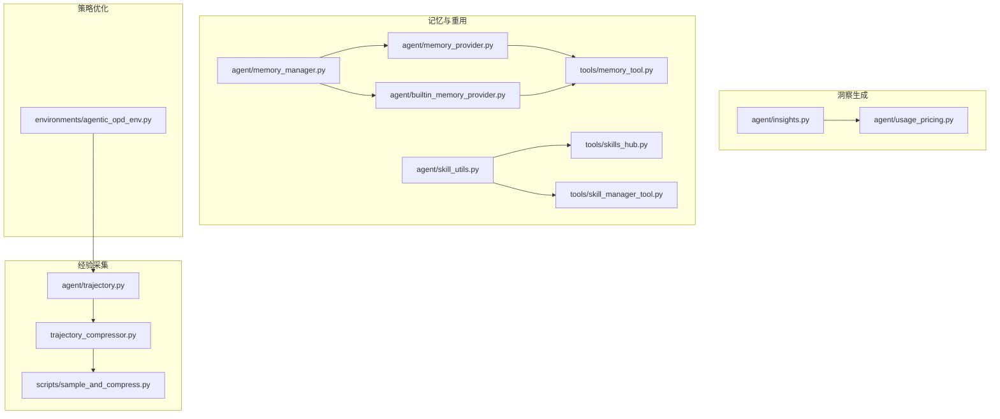
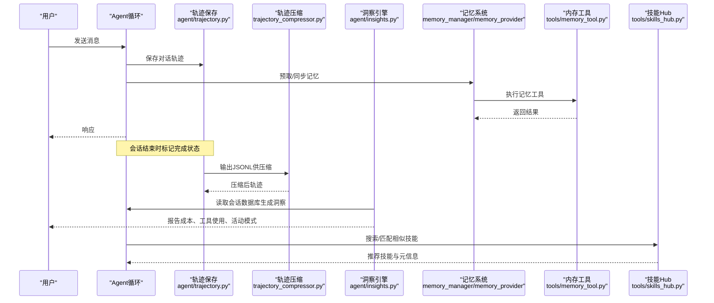
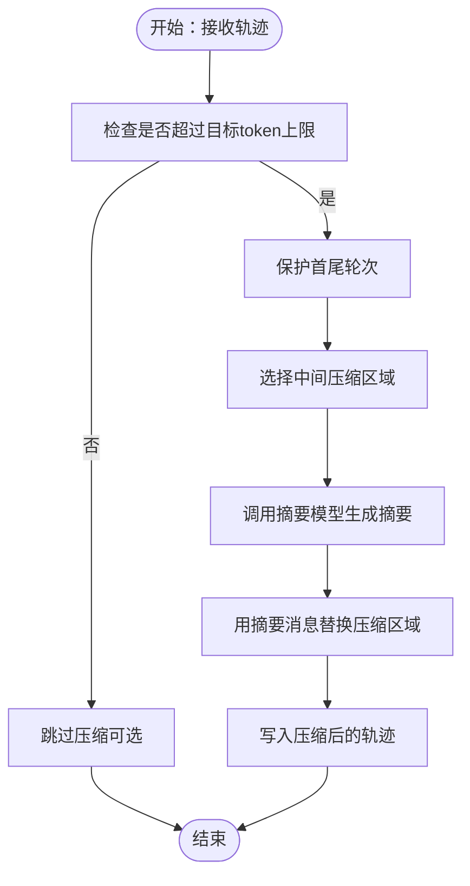
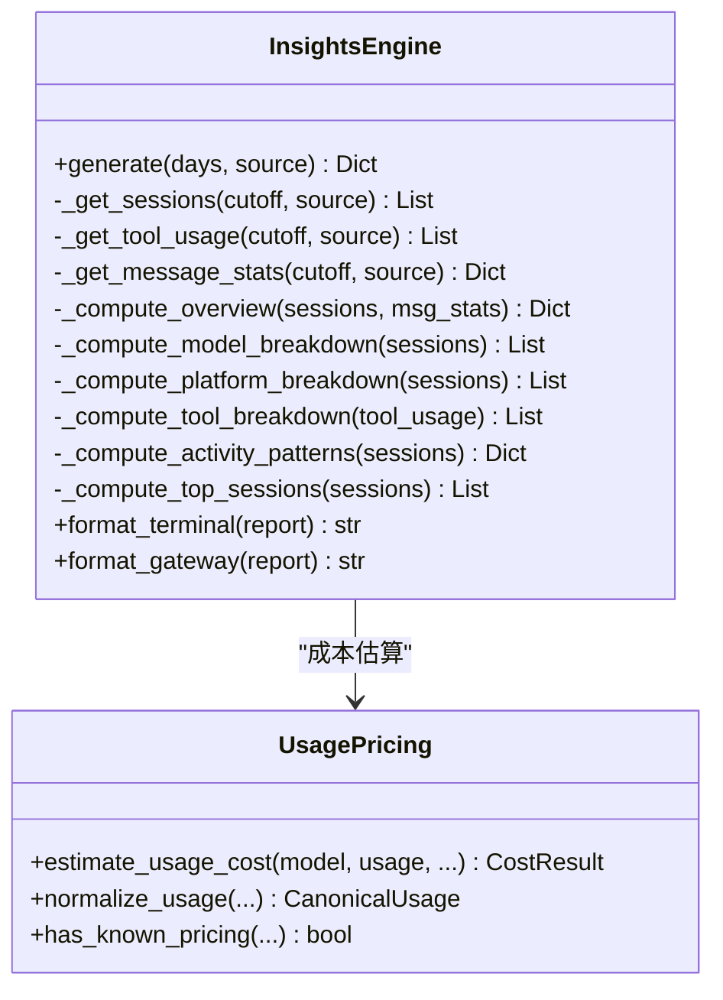
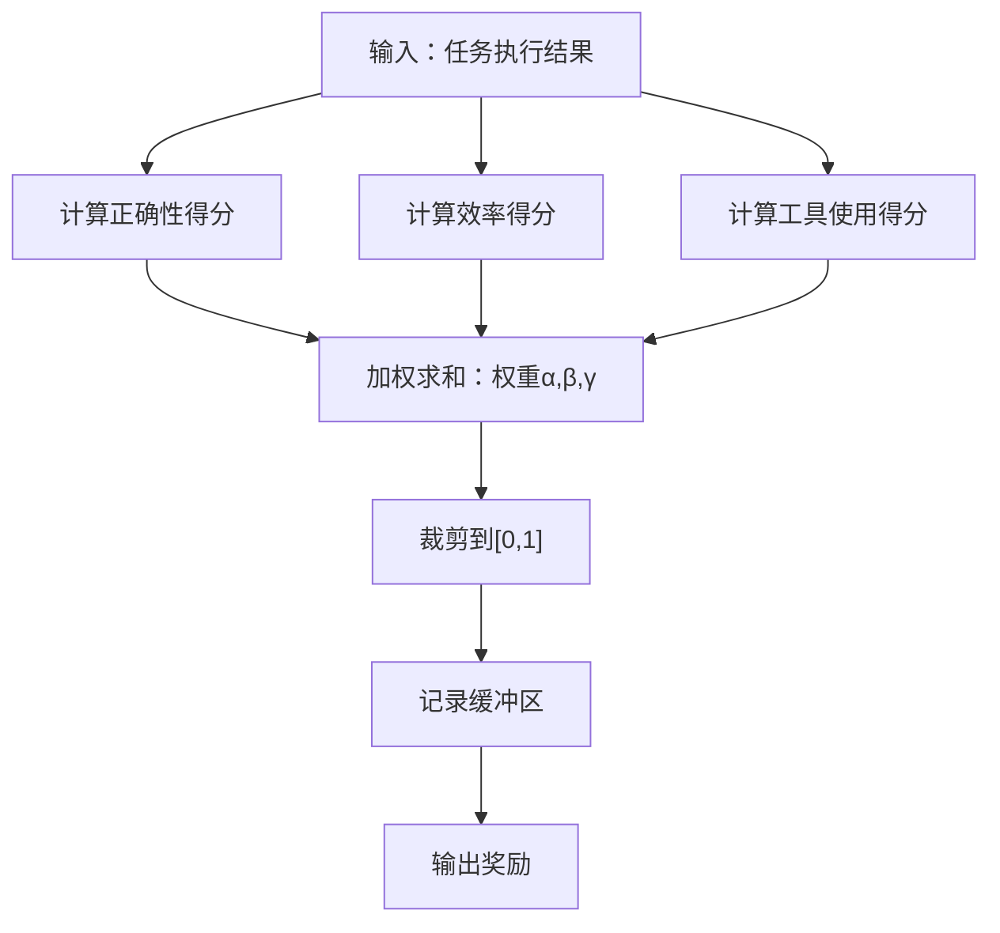
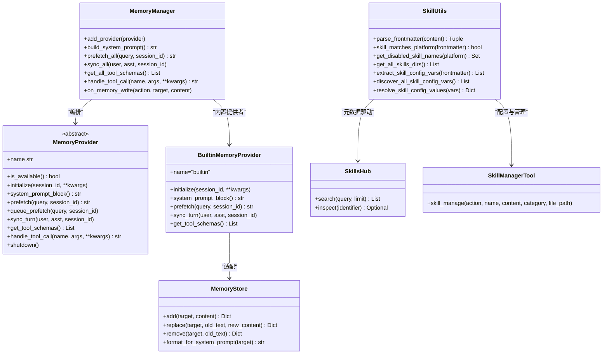
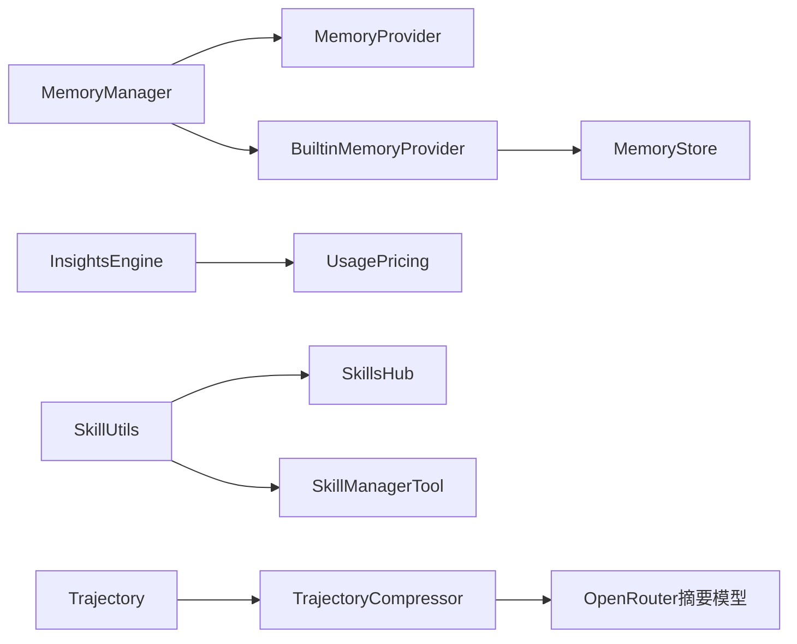

# 技能学习算法

<cite>
**本文引用的文件**
- [agent/trajectory.py](file://agent/trajectory.py)
- [agent/insights.py](file://agent/insights.py)
- [agent/memory_manager.py](file://agent/memory_manager.py)
- [agent/memory_provider.py](file://agent/memory_provider.py)
- [agent/builtin_memory_provider.py](file://agent/builtin_memory_provider.py)
- [agent/usage_pricing.py](file://agent/usage_pricing.py)
- [tools/memory_tool.py](file://tools/memory_tool.py)
- [trajectory_compressor.py](file://trajectory_compressor.py)
- [scripts/sample_and_compress.py](file://scripts/sample_and_compress.py)
- [environments/agentic_opd_env.py](file://environments/agentic_opd_env.py)
- [agent/skill_utils.py](file://agent/skill_utils.py)
- [tools/skills_hub.py](file://tools/skills_hub.py)
- [tools/skill_manager_tool.py](file://tools/skill_manager_tool.py)
- [tests/tools/test_skill_improvements.py](file://tests/tools/test_skill_improvements.py)
</cite>

## 目录
1. [引言](#引言)
2. [项目结构](#项目结构)
3. [核心组件](#核心组件)
4. [架构总览](#架构总览)
5. [详细组件分析](#详细组件分析)
6. [依赖分析](#依赖分析)
7. [性能考虑](#性能考虑)
8. [故障排查指南](#故障排查指南)
9. [结论](#结论)
10. [附录](#附录)

## 引言
本技术文档聚焦于Hermes Agent的“技能学习算法”，系统阐述代理如何从经验中学习与改进技能：经验提取（轨迹与会话）、模式识别（洞察引擎）、策略优化（奖励设计与压缩）、以及技能记忆与重用（记忆系统与技能管理）。文档同时覆盖轨迹分析算法、洞察生成系统、技能记忆与重用机制，并给出性能优化与效率提升建议。

## 项目结构
围绕技能学习的关键模块分布如下：
- 经验采集与轨迹：agent/trajectory.py、trajectory_compressor.py、scripts/sample_and_compress.py
- 洞察生成：agent/insights.py、agent/usage_pricing.py
- 技能记忆与重用：agent/memory_manager.py、agent/memory_provider.py、agent/builtin_memory_provider.py、tools/memory_tool.py、agent/skill_utils.py、tools/skills_hub.py、tools/skill_manager_tool.py
- 策略优化与评估：environments/agentic_opd_env.py（奖励函数示例）

图示来源
- [agent/trajectory.py:1-57](file://agent/trajectory.py#L1-L57)
- [trajectory_compressor.py:1-200](file://trajectory_compressor.py#L1-L200)
- [scripts/sample_and_compress.py:240-277](file://scripts/sample_and_compress.py#L240-L277)
- [agent/insights.py:1-120](file://agent/insights.py#L1-L120)
- [agent/usage_pricing.py:1-120](file://agent/usage_pricing.py#L1-L120)
- [agent/memory_manager.py:1-120](file://agent/memory_manager.py#L1-L120)
- [agent/memory_provider.py:1-120](file://agent/memory_provider.py#L1-L120)
- [agent/builtin_memory_provider.py:1-115](file://agent/builtin_memory_provider.py#L1-L115)
- [tools/memory_tool.py:1-120](file://tools/memory_tool.py#L1-L120)
- [agent/skill_utils.py:1-120](file://agent/skill_utils.py#L1-L120)
- [tools/skills_hub.py:672-704](file://tools/skills_hub.py#L672-L704)
- [tools/skill_manager_tool.py:532-574](file://tools/skill_manager_tool.py#L532-L574)
- [environments/agentic_opd_env.py:609-643](file://environments/agentic_opd_env.py#L609-L643)

章节来源
- [agent/trajectory.py:1-57](file://agent/trajectory.py#L1-L57)
- [trajectory_compressor.py:1-200](file://trajectory_compressor.py#L1-L200)
- [agent/insights.py:1-120](file://agent/insights.py#L1-L120)
- [agent/usage_pricing.py:1-120](file://agent/usage_pricing.py#L1-L120)
- [agent/memory_manager.py:1-120](file://agent/memory_manager.py#L1-L120)
- [agent/memory_provider.py:1-120](file://agent/memory_provider.py#L1-L120)
- [agent/builtin_memory_provider.py:1-115](file://agent/builtin_memory_provider.py#L1-L115)
- [tools/memory_tool.py:1-120](file://tools/memory_tool.py#L1-L120)
- [agent/skill_utils.py:1-120](file://agent/skill_utils.py#L1-L120)
- [tools/skills_hub.py:672-704](file://tools/skills_hub.py#L672-L704)
- [tools/skill_manager_tool.py:532-574](file://tools/skill_manager_tool.py#L532-L574)
- [environments/agentic_opd_env.py:609-643](file://environments/agentic_opd_env.py#L609-L643)

## 核心组件
- 轨迹保存与格式化：提供轨迹条目写入、完成状态标记、时间戳与模型元数据记录，便于后续分析与压缩。
- 洞察引擎：基于会话数据库统计token消耗、成本估算、工具使用模式、活动趋势等，形成可读报告。
- 记忆系统：统一管理内置与外部记忆提供者，支持预取、同步、工具调用与生命周期钩子；内置文件型记忆持久化。
- 技能管理：技能元数据解析、平台匹配、禁用列表、配置变量声明与解析、技能检索与模糊补丁能力。
- 轨迹压缩：在保留关键上下文的前提下，对中间轮次进行摘要压缩，控制token预算。
- 策略优化：通过奖励函数组合与缓冲区跟踪，量化正确性、效率与工具使用，指导策略迭代。

章节来源
- [agent/trajectory.py:30-57](file://agent/trajectory.py#L30-L57)
- [agent/insights.py:121-171](file://agent/insights.py#L121-L171)
- [agent/memory_manager.py:72-140](file://agent/memory_manager.py#L72-L140)
- [agent/memory_provider.py:42-120](file://agent/memory_provider.py#L42-L120)
- [agent/builtin_memory_provider.py:24-115](file://agent/builtin_memory_provider.py#L24-L115)
- [tools/memory_tool.py:100-200](file://tools/memory_tool.py#L100-L200)
- [agent/skill_utils.py:52-120](file://agent/skill_utils.py#L52-L120)
- [tools/skills_hub.py:672-704](file://tools/skills_hub.py#L672-L704)
- [tools/skill_manager_tool.py:532-574](file://tools/skill_manager_tool.py#L532-L574)
- [trajectory_compressor.py:1-200](file://trajectory_compressor.py#L1-L200)
- [environments/agentic_opd_env.py:609-643](file://environments/agentic_opd_env.py#L609-L643)

## 架构总览
下图展示从经验采集到策略优化与记忆重用的整体流程：

图示来源
- [agent/trajectory.py:30-57](file://agent/trajectory.py#L30-L57)
- [trajectory_compressor.py:921-950](file://trajectory_compressor.py#L921-L950)
- [agent/insights.py:121-171](file://agent/insights.py#L121-L171)
- [agent/memory_manager.py:172-214](file://agent/memory_manager.py#L172-L214)
- [tools/memory_tool.py:439-478](file://tools/memory_tool.py#L439-L478)
- [tools/skills_hub.py:672-704](file://tools/skills_hub.py#L672-L704)

## 详细组件分析

### 经验提取：轨迹保存与压缩
- 轨迹保存：将ShareGPT格式对话列表、时间戳、模型名、完成状态写入JSONL文件，便于离线分析与回放。
- 轨迹压缩：保护首尾若干轮次，仅压缩中间轮次；以人类摘要消息替换被压缩区域，保留工具调用完整性；支持采样与批量处理，输出压缩指标。

图示来源
- [trajectory_compressor.py:1-200](file://trajectory_compressor.py#L1-L200)
- [trajectory_compressor.py:905-920](file://trajectory_compressor.py#L905-L920)
- [scripts/sample_and_compress.py:258-277](file://scripts/sample_and_compress.py#L258-L277)

章节来源
- [agent/trajectory.py:30-57](file://agent/trajectory.py#L30-L57)
- [trajectory_compressor.py:1-200](file://trajectory_compressor.py#L1-L200)
- [trajectory_compressor.py:905-920](file://trajectory_compressor.py#L905-L920)
- [scripts/sample_and_compress.py:240-277](file://scripts/sample_and_compress.py#L240-L277)

### 模式识别：洞察生成系统
- 数据来源：会话表与消息表，聚合token用量、工具调用次数、消息角色分布、会话时长等。
- 成本估算：根据路由与定价源计算估计成本，区分已知/未知/包含/实际计费状态。
- 报告维度：概览（会话数、消息数、token总量、估计成本、平均时长）、模型与平台拆分、工具使用排行、活动模式（按周/小时）、显著会话（最长、消息最多、token最多、工具调用最多）。

图示来源
- [agent/insights.py:103-171](file://agent/insights.py#L103-L171)
- [agent/insights.py:197-327](file://agent/insights.py#L197-L327)
- [agent/insights.py:407-442](file://agent/insights.py#L407-L442)
- [agent/insights.py:444-473](file://agent/insights.py#L444-L473)
- [agent/insights.py:475-486](file://agent/insights.py#L475-L486)
- [agent/insights.py:488-544](file://agent/insights.py#L488-L544)
- [agent/insights.py:546-602](file://agent/insights.py#L546-L602)
- [agent/insights.py:608-736](file://agent/insights.py#L608-L736)
- [agent/insights.py:738-800](file://agent/insights.py#L738-L800)
- [agent/usage_pricing.py:481-557](file://agent/usage_pricing.py#L481-L557)

章节来源
- [agent/insights.py:121-171](file://agent/insights.py#L121-L171)
- [agent/insights.py:197-327](file://agent/insights.py#L197-L327)
- [agent/insights.py:407-442](file://agent/insights.py#L407-L442)
- [agent/insights.py:444-473](file://agent/insights.py#L444-L473)
- [agent/insights.py:475-486](file://agent/insights.py#L475-L486)
- [agent/insights.py:488-544](file://agent/insights.py#L488-L544)
- [agent/insights.py:546-602](file://agent/insights.py#L546-L602)
- [agent/insights.py:608-736](file://agent/insights.py#L608-L736)
- [agent/insights.py:738-800](file://agent/insights.py#L738-L800)
- [agent/usage_pricing.py:481-557](file://agent/usage_pricing.py#L481-L557)

### 策略优化：奖励设计与轨迹评估
- 奖励组合：正确性、效率、工具使用权重加权，归一化至[0,1]，并维护缓冲区用于趋势分析。
- 适用场景：OPD环境中的多目标奖励，指导策略收敛与改进。

图示来源
- [environments/agentic_opd_env.py:609-643](file://environments/agentic_opd_env.py#L609-L643)

章节来源
- [environments/agentic_opd_env.py:609-643](file://environments/agentic_opd_env.py#L609-L643)

### 技能记忆与重用：记忆系统与技能管理
- 记忆管理：MemoryManager统一编排内置与外部记忆提供者，支持预取、同步、工具路由与生命周期钩子。
- 内置记忆：BuiltinMemoryProvider封装MEMORY.md/USER.md，注入系统提示快照，避免前缀缓存失效。
- 内存工具：单工具接口实现add/replace/remove，带内容扫描与原子写入，保障安全与一致性。
- 技能元数据：frontmatter解析、平台匹配、禁用列表、配置变量声明与解析、技能检索与去重。
- 技能Hub与管理：技能搜索、标识符解析、模糊补丁与文件操作。

图示来源
- [agent/memory_manager.py:72-140](file://agent/memory_manager.py#L72-L140)
- [agent/memory_provider.py:42-120](file://agent/memory_provider.py#L42-L120)
- [agent/builtin_memory_provider.py:24-115](file://agent/builtin_memory_provider.py#L24-L115)
- [tools/memory_tool.py:100-200](file://tools/memory_tool.py#L100-L200)
- [agent/skill_utils.py:52-120](file://agent/skill_utils.py#L52-L120)
- [tools/skills_hub.py:672-704](file://tools/skills_hub.py#L672-L704)
- [tools/skill_manager_tool.py:532-574](file://tools/skill_manager_tool.py#L532-L574)

章节来源
- [agent/memory_manager.py:72-140](file://agent/memory_manager.py#L72-L140)
- [agent/memory_provider.py:42-120](file://agent/memory_provider.py#L42-L120)
- [agent/builtin_memory_provider.py:24-115](file://agent/builtin_memory_provider.py#L24-L115)
- [tools/memory_tool.py:100-200](file://tools/memory_tool.py#L100-L200)
- [agent/skill_utils.py:52-120](file://agent/skill_utils.py#L52-L120)
- [tools/skills_hub.py:672-704](file://tools/skills_hub.py#L672-L704)
- [tools/skill_manager_tool.py:532-574](file://tools/skill_manager_tool.py#L532-L574)

## 依赖分析
- 组件耦合与内聚
  - MemoryManager与MemoryProvider之间通过抽象接口解耦，内置提供者始终注册且不可移除，外部提供者最多一个，防止工具schema膨胀与冲突。
  - MemoryStore与tools.memory_tool配合，确保原子写入与并发安全。
  - InsightEngine依赖会话数据库查询，成本估算依赖UsagePricing，二者协作生成报告。
  - SkillUtils与SkillsHub/SkillManagerTool共同支撑技能发现、配置与管理。
- 外部依赖与集成点
  - 轨迹压缩依赖OpenRouter摘要模型与tokenizer，支持配置化参数与并发控制。
  - 成本估算依赖官方文档快照与模型元数据API，兼容多种提供商与自定义端点。

图示来源
- [agent/memory_manager.py:72-140](file://agent/memory_manager.py#L72-L140)
- [agent/memory_provider.py:42-120](file://agent/memory_provider.py#L42-L120)
- [agent/builtin_memory_provider.py:24-115](file://agent/builtin_memory_provider.py#L24-L115)
- [tools/memory_tool.py:100-200](file://tools/memory_tool.py#L100-L200)
- [agent/insights.py:121-171](file://agent/insights.py#L121-L171)
- [agent/usage_pricing.py:390-418](file://agent/usage_pricing.py#L390-L418)
- [agent/skill_utils.py:52-120](file://agent/skill_utils.py#L52-L120)
- [tools/skills_hub.py:672-704](file://tools/skills_hub.py#L672-L704)
- [tools/skill_manager_tool.py:532-574](file://tools/skill_manager_tool.py#L532-L574)
- [agent/trajectory.py:30-57](file://agent/trajectory.py#L30-L57)
- [trajectory_compressor.py:54-95](file://trajectory_compressor.py#L54-L95)

章节来源
- [agent/memory_manager.py:72-140](file://agent/memory_manager.py#L72-L140)
- [agent/memory_provider.py:42-120](file://agent/memory_provider.py#L42-L120)
- [agent/builtin_memory_provider.py:24-115](file://agent/builtin_memory_provider.py#L24-L115)
- [tools/memory_tool.py:100-200](file://tools/memory_tool.py#L100-L200)
- [agent/insights.py:121-171](file://agent/insights.py#L121-L171)
- [agent/usage_pricing.py:390-418](file://agent/usage_pricing.py#L390-L418)
- [agent/skill_utils.py:52-120](file://agent/skill_utils.py#L52-L120)
- [tools/skills_hub.py:672-704](file://tools/skills_hub.py#L672-L704)
- [tools/skill_manager_tool.py:532-574](file://tools/skill_manager_tool.py#L532-L574)
- [agent/trajectory.py:30-57](file://agent/trajectory.py#L30-L57)
- [trajectory_compressor.py:54-95](file://trajectory_compressor.py#L54-L95)

## 性能考虑
- 轨迹压缩
  - 保护首尾轮次避免信息丢失，仅压缩中间轮次，减少计算与token占用。
  - 并发请求限制与重试策略平衡吞吐与稳定性。
  - 支持采样与批量处理，降低全量处理开销。
- 记忆系统
  - 文件锁与原子重命名避免竞态，减少I/O抖动。
  - 预取与队列化背景召回，降低推理延迟。
- 洞察生成
  - SQL查询按时间窗口过滤，避免全表扫描；工具使用合并两路来源，避免重复计数。
  - 报告格式化采用紧凑显示与柱状图，提升终端可读性。
- 成本估算
  - 官方文档快照优先，模型元数据API兜底，未知路由返回零成本或未知状态，避免错误估算。

## 故障排查指南
- 轨迹压缩失败
  - 检查OpenRouter API密钥与网络连通性；确认tokenizer名称与远程代码信任设置；查看摘要notice文本与超时配置。
- 记忆写入异常
  - 确认内存文件路径存在且可写；检查内容扫描规则（隐藏字符、威胁模式）；查看文件锁状态与临时文件清理。
- 洞察报告为空
  - 检查时间窗口参数与平台过滤条件；确认会话数据库连接与权限；核对工具使用JSON解析逻辑。
- 技能管理问题
  - 使用模糊补丁测试验证匹配与替换逻辑；检查技能目录与frontmatter解析；确认平台兼容性与禁用列表。

章节来源
- [trajectory_compressor.py:54-95](file://trajectory_compressor.py#L54-L95)
- [tools/memory_tool.py:85-98](file://tools/memory_tool.py#L85-L98)
- [tools/memory_tool.py:138-154](file://tools/memory_tool.py#L138-L154)
- [agent/insights.py:197-295](file://agent/insights.py#L197-L295)
- [tests/tools/test_skill_improvements.py:36-52](file://tests/tools/test_skill_improvements.py#L36-L52)

## 结论
Hermes Agent的技能学习算法以“经验—洞察—策略—记忆—重用”闭环为核心：通过轨迹保存与压缩沉淀经验，借助洞察引擎识别成本与行为模式，结合奖励设计优化策略，再由记忆系统固化知识并支持技能检索与管理。该体系在保证安全性与性能的同时，提供了可扩展的学习与改进路径。

## 附录
- 相关参考
  - GRPO/RL训练与奖励设计：参考技能仓库中的相关文档与示例，理解奖励函数设计与调试要点。
  - 实验设计与监控：参考研究技能中的实验模式与监控最佳实践，确保学习过程可追踪与可复现。