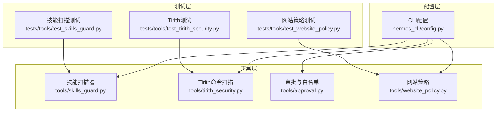
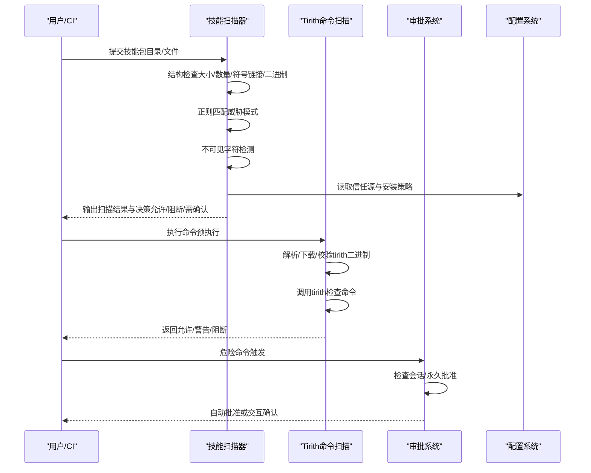
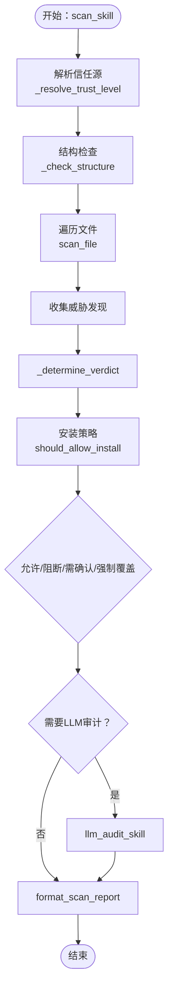
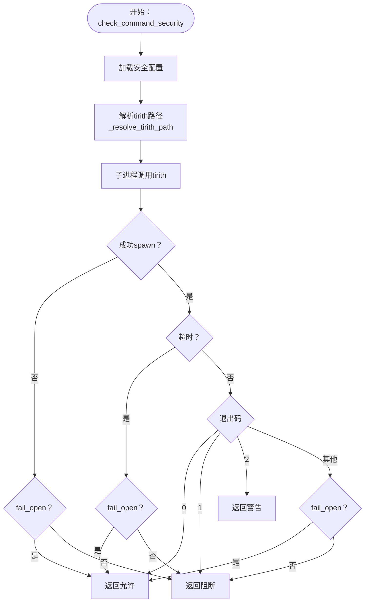
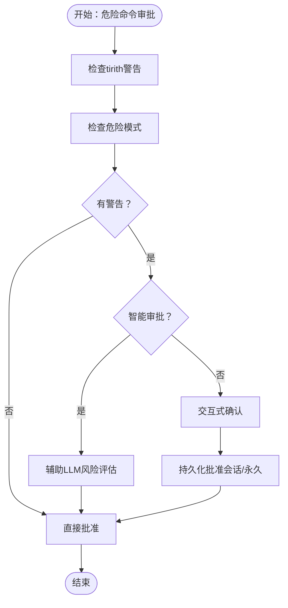
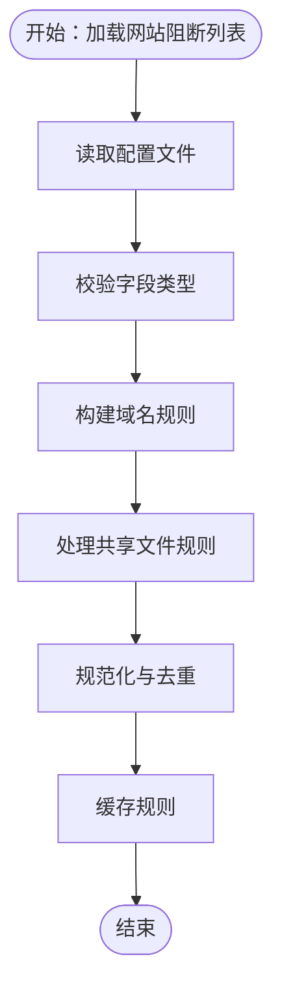
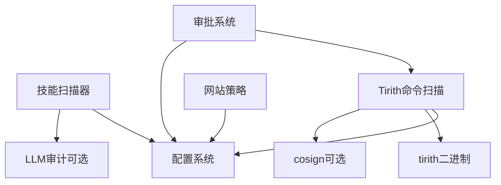

# 技能安全验证

<cite>
**本文档引用的文件**
- [skills_guard.py](file://tools/skills_guard.py)
- [test_skills_guard.py](file://tests/tools/test_skills_guard.py)
- [tirith_security.py](file://tools/tirith_security.py)
- [config.py](file://hermes_cli/config.py)
- [approval.py](file://tools/approval.py)
- [test_tirith_security.py](file://tests/tools/test_tirith_security.py)
- [test_website_policy.py](file://tests/tools/test_website_policy.py)
- [website_policy.py](file://tools/website_policy.py)
</cite>

## 目录
1. [简介](#简介)
2. [项目结构](#项目结构)
3. [核心组件](#核心组件)
4. [架构总览](#架构总览)
5. [详细组件分析](#详细组件分析)
6. [依赖分析](#依赖分析)
7. [性能考虑](#性能考虑)
8. [故障排查指南](#故障排查指南)
9. [结论](#结论)
10. [附录](#附录)

## 简介
本文件面向Hermes Agent的“技能安全验证”子系统，系统化阐述技能安装前的安全扫描机制与策略执行流程。该系统通过多阶段静态分析（正则匹配、结构检查、不可见字符检测）、信任源分级与安装策略、以及可选的LLM二次审计，确保外部技能在进入运行环境前满足安全基线；同时结合命令级预执行扫描（tirith）、网站访问阻断策略、以及审批与白名单/黑名单机制，形成端到端的安全保障。

## 项目结构
围绕技能安全验证的关键模块与测试如下：
- 工具层
  - 技能扫描器：tools/skills_guard.py
  - 命令预执行扫描：tools/tirith_security.py
  - 审批与白名单：tools/approval.py
  - 网站访问策略：tools/website_policy.py
- 配置层
  - CLI配置加载：hermes_cli/config.py
- 测试层
  - 技能扫描器测试：tests/tools/test_skills_guard.py
  - Tirith安全扫描测试：tests/tools/test_tirith_security.py
  - 网站策略测试：tests/tools/test_website_policy.py

图表来源
- [skills_guard.py:1-1106](file://tools/skills_guard.py#L1-L1106)
- [tirith_security.py:1-671](file://tools/tirith_security.py#L1-L671)
- [config.py:520-535](file://hermes_cli/config.py#L520-L535)
- [approval.py:270-877](file://tools/approval.py#L270-L877)
- [website_policy.py:149-181](file://tools/website_policy.py#L149-L181)
- [test_skills_guard.py:1-517](file://tests/tools/test_skills_guard.py#L1-L517)
- [test_tirith_security.py:490-514](file://tests/tools/test_tirith_security.py#L490-L514)
- [test_website_policy.py:151-189](file://tests/tools/test_website_policy.py#L151-L189)

章节来源
- [skills_guard.py:1-1106](file://tools/skills_guard.py#L1-L1106)
- [tirith_security.py:1-671](file://tools/tirith_security.py#L1-L671)
- [config.py:520-535](file://hermes_cli/config.py#L520-L535)

## 核心组件
- 技能扫描器（Skills Guard）
  - 功能：对技能目录或单文件进行静态扫描，包含结构检查、威胁模式正则匹配、不可见字符检测；支持基于信任源的安装策略与强制覆盖；可选LLM二次审计。
  - 关键数据结构：Finding、ScanResult。
  - 关键函数：scan_file、scan_skill、should_allow_install、format_scan_report、content_hash、llm_audit_skill。
- 命令预执行扫描（Tirith Wrapper）
  - 功能：以子进程方式调用tirith二进制，对命令进行内容级威胁检测（同源URL、管道到解释器、终端注入等），返回允许/警告/阻止决策。
  - 关键函数：check_command_security、ensure_installed、_resolve_tirith_path。
- 审批与白名单（Approval）
  - 功能：维护会话级与永久级的危险模式批准记录，支持智能审批（辅助LLM风险评估）与交互式确认。
  - 关键函数：is_approved、approve_session、approve_permanent、load_permanent_allowlist。
- 网站访问策略（Website Policy）
  - 功能：加载并校验网站阻断列表配置，提供域名与共享文件规则的规范化与缓存。
  - 关键函数：load_website_blocklist、_load_policy_config、_normalize_rule。
- 配置（Hermes CLI Config）
  - 功能：提供安全相关配置项（如tirith开关、超时、失败策略、网站阻断列表等）的默认值与环境变量覆盖。

章节来源
- [skills_guard.py:56-1106](file://tools/skills_guard.py#L56-L1106)
- [tirith_security.py:600-671](file://tools/tirith_security.py#L600-L671)
- [approval.py:270-877](file://tools/approval.py#L270-L877)
- [website_policy.py:149-181](file://tools/website_policy.py#L149-L181)
- [config.py:520-535](file://hermes_cli/config.py#L520-L535)

## 架构总览
技能安全验证由“技能安装前扫描”和“命令执行前扫描”两条主线构成，并辅以审批与策略控制：

图表来源
- [skills_guard.py:595-640](file://tools/skills_guard.py#L595-L640)
- [tirith_security.py:600-671](file://tools/tirith_security.py#L600-L671)
- [approval.py:270-877](file://tools/approval.py#L270-L877)
- [config.py:520-535](file://hermes_cli/config.py#L520-L535)

## 详细组件分析

### 技能扫描器（Skills Guard）
- 设计要点
  - 多阶段扫描：结构检查（文件数、总大小、单文件大小、二进制扩展名、可执行位、符号链接逃逸）、正则威胁模式匹配、不可见Unicode字符检测。
  - 信任源分级：builtin/trusted/community/agent-created，对应不同安装策略。
  - 安装策略：根据信任级别与扫描结论（safe/caution/dangerous）决定是否允许安装，支持--force覆盖社区/受信源的谨慎结论。
  - LLM二次审计：对静态扫描结果进行补充分析，仅提升严重度，不降低。
  - 内容哈希：对技能内容生成短摘要哈希，便于完整性追踪。
- 关键流程图（scan_skill）

图表来源
- [skills_guard.py:595-640](file://tools/skills_guard.py#L595-L640)
- [skills_guard.py:642-677](file://tools/skills_guard.py#L642-L677)
- [skills_guard.py:897-1001](file://tools/skills_guard.py#L897-L1001)
- [skills_guard.py:679-713](file://tools/skills_guard.py#L679-L713)

- 关键实现点
  - 结构检查：限制文件数量、总大小、单文件大小；禁止可疑二进制扩展名；拒绝符号链接逃逸；检测异常可执行位。
  - 威胁模式：覆盖数据泄露（curl/wget/fetch/httpx/requests、读取敏感目录与文件、环境变量读取）、提示注入（忽略指令、角色劫持、系统提示覆盖等）、破坏性操作（rm -rf、修改系统配置、格式化磁盘等）、持久化（crontab、SSH密钥、sudoers等）、网络与混淆（反向连接、隧道服务、编码与eval执行、路径穿越等）、供应链（管道到shell、远程资源拉取、未固定版本依赖）、特权提升、上下文泄露等。
  - 安装策略表：builtin/trusted/community/agent-created四档信任，分别对应safe/caution/dangerous三类结论的不同处理。
  - LLM审计：使用用户配置模型对技能内容进行二次分析，合并发现并提升严重度，但不降低。
  - 报告与哈希：输出人类可读报告，汇总严重度与类别；计算内容哈希用于完整性跟踪。

章节来源
- [skills_guard.py:734-848](file://tools/skills_guard.py#L734-L848)
- [skills_guard.py:530-593](file://tools/skills_guard.py#L530-L593)
- [skills_guard.py:879-1051](file://tools/skills_guard.py#L879-L1051)
- [skills_guard.py:642-677](file://tools/skills_guard.py#L642-L677)
- [skills_guard.py:679-713](file://tools/skills_guard.py#L679-L713)

### 命令预执行扫描（Tirith Wrapper）
- 设计要点
  - 本地优先：优先使用PATH中的tirith或$HERMES_HOME/bin/tirith。
  - 自动安装：若缺失，后台下载最新发布版，优先使用cosign进行供应链证明校验，否则仅校验SHA-256。
  - 失败策略：spawn失败或超时可按fail_open/fail_close策略回退。
  - 命令扫描：以POSIX shell模式检查命令，返回允许/警告/阻断，并附带JSON丰富信息。
- 关键流程图（check_command_security）

图表来源
- [tirith_security.py:600-671](file://tools/tirith_security.py#L600-L671)
- [tirith_security.py:379-590](file://tools/tirith_security.py#L379-L590)

- 关键实现点
  - 配置项：tirith_enabled、tirith_path、tirith_timeout、tirith_fail_open。
  - 自动安装：检测平台目标、下载归档、校验checksum、可选cosign证明、提取二进制并赋予执行权限。
  - 失败标记：磁盘持久化失败原因，避免短期内重复尝试网络安装。
  - 进程管理：后台线程下载，启动时不阻塞；支持重试与原因恢复（如安装cosign后自动重试）。

章节来源
- [tirith_security.py:68-87](file://tools/tirith_security.py#L68-L87)
- [tirith_security.py:216-279](file://tools/tirith_security.py#L216-L279)
- [tirith_security.py:281-372](file://tools/tirith_security.py#L281-L372)
- [tirith_security.py:379-590](file://tools/tirith_security.py#L379-L590)
- [tirith_security.py:600-671](file://tools/tirith_security.py#L600-L671)

### 审批与白名单（Approval）
- 设计要点
  - 会话级与永久级批准：针对特定模式键（含tirith规则键）进行短期或长期放行。
  - 智能审批：在“smart”模式下，先用辅助LLM对组合描述进行风险评估，再决定是否弹出交互确认。
  - 交互确认：支持一次性、会话级、永久三种选择；tirith警告默认仅会话级批准。
- 关键流程图（危险命令审批）

图表来源
- [approval.py:699-727](file://tools/approval.py#L699-L727)
- [approval.py:847-877](file://tools/approval.py#L847-L877)

章节来源
- [approval.py:270-877](file://tools/approval.py#L270-L877)

### 网站访问策略（Website Policy）
- 设计要点
  - 配置校验：确保配置为映射类型、字段类型正确（enabled布尔、domains与shared_files列表）。
  - 规则规范化：域名规则标准化，共享文件路径展开为绝对路径。
  - 缓存与去重：对规则进行去重与缓存，减少重复解析成本。
- 关键流程图（加载网站阻断列表）

图表来源
- [website_policy.py:149-181](file://tools/website_policy.py#L149-L181)

章节来源
- [website_policy.py:149-181](file://tools/website_policy.py#L149-L181)
- [test_website_policy.py:151-189](file://tests/tools/test_website_policy.py#L151-L189)

## 依赖分析
- 组件耦合
  - 技能扫描器依赖配置系统获取信任源与安装策略；可选依赖LLM审计能力。
  - 命令扫描器独立于技能扫描器，但共享安全配置（如fail_open/fail_close）。
  - 审批系统与命令扫描器配合，形成“预执行+审批”的双重防线。
  - 网站策略作为独立模块，可与消息网关或Web工具链集成。
- 外部依赖
  - 技能扫描器：正则表达式、文件系统遍历、可选LLM调用。
  - 命令扫描器：tirith二进制、cosign（可选）、网络下载、tar解压。
  - 审批系统：会话状态存储、可选辅助LLM。
  - 网站策略：YAML配置解析、文件系统访问。

图表来源
- [skills_guard.py:897-1001](file://tools/skills_guard.py#L897-L1001)
- [tirith_security.py:216-279](file://tools/tirith_security.py#L216-L279)
- [config.py:520-535](file://hermes_cli/config.py#L520-L535)
- [approval.py:699-727](file://tools/approval.py#L699-L727)

章节来源
- [skills_guard.py:897-1001](file://tools/skills_guard.py#L897-L1001)
- [tirith_security.py:216-279](file://tools/tirith_security.py#L216-L279)
- [config.py:520-535](file://hermes_cli/config.py#L520-L535)
- [approval.py:699-727](file://tools/approval.py#L699-L727)

## 性能考虑
- 技能扫描器
  - 文件遍历与正则匹配：对大目录或超大文件应谨慎，建议限制单文件大小与总大小阈值；对非文本扩展名跳过扫描。
  - LLM审计：仅在必要时触发，且限制输入长度与令牌上限，避免昂贵调用。
- 命令扫描器
  - 子进程spawn开销可控，但超时与失败回退策略需平衡安全性与可用性。
  - 自动安装采用后台线程，避免阻塞启动。
- 审批系统
  - 批准键集合查询为常量时间，建议缓存常用规则键。
- 网站策略
  - 规则去重与缓存可显著降低重复解析成本。

## 故障排查指南
- 技能扫描器
  - 症状：扫描结果中出现重复同一模式的同一行。
    - 排查：确认去重逻辑按（pattern_id, line）去重，避免同一行多次匹配同一模式。
    - 参考：[scan_file:556-575](file://tools/skills_guard.py#L556-L575)
  - 症状：符号链接逃逸被误报或漏报。
    - 排查：使用is_relative_to判断而非startswith，确保严格边界检查。
    - 参考：[symlink escape检测:754-778](file://tools/skills_guard.py#L754-L778)、[测试用例:340-384](file://tests/tools/test_skills_guard.py#L340-L384)
  - 症状：LLM审计失败导致安装被阻断。
    - 排查：LLM审计为best-effort，失败时保留原静态结论；检查模型配置与网络连通性。
    - 参考：[llm_audit_skill:949-972](file://tools/skills_guard.py#L949-L972)
- 命令扫描器
  - 症状：tirith未找到或无法spawn。
    - 排查：检查PATH与配置路径；查看fail_open设置；确认后台安装线程已完成。
    - 参考：[check_command_security:610-638](file://tools/tirith_security.py#L610-L638)、[ensure_installed:510-590](file://tools/tirith_security.py#L510-L590)
  - 症状：cosign缺失导致自动安装被中止。
    - 排查：安装cosign后，磁盘标记会在下次解析时自动清除并重试。
    - 参考：[cosign验证:216-254](file://tools/tirith_security.py#L216-L254)、[失败标记:113-175](file://tools/tirith_security.py#L113-L175)
- 审批系统
  - 症状：交互确认频繁。
    - 排查：将低风险模式加入永久批准；或调整审批模式为smart以减少人工干预。
    - 参考：[智能审批:713-727](file://tools/approval.py#L713-L727)
- 网站策略
  - 症状：配置类型错误导致加载失败。
    - 排查：确保security.website_blocklist为映射类型，enabled为布尔，domains/shared_files为列表。
    - 参考：[配置校验:149-181](file://tools/website_policy.py#L149-L181)、[测试用例:151-189](file://tests/tools/test_website_policy.py#L151-L189)

章节来源
- [skills_guard.py:556-593](file://tools/skills_guard.py#L556-L593)
- [test_skills_guard.py:340-384](file://tests/tools/test_skills_guard.py#L340-L384)
- [tirith_security.py:610-638](file://tools/tirith_security.py#L610-L638)
- [tirith_security.py:216-254](file://tools/tirith_security.py#L216-L254)
- [tirith_security.py:113-175](file://tools/tirith_security.py#L113-L175)
- [approval.py:713-727](file://tools/approval.py#L713-L727)
- [website_policy.py:149-181](file://tools/website_policy.py#L149-L181)
- [test_website_policy.py:151-189](file://tests/tools/test_website_policy.py#L151-L189)

## 结论
Hermes Agent的技能安全验证体系通过“技能安装前静态扫描+信任源策略+可选LLM审计”与“命令执行前内容扫描+审批与白名单/黑名单”双轨并行，实现了从文件完整性到行为模式分析的全链路安全保障。配置层提供灵活的策略开关与参数覆盖，测试层覆盖关键路径与回归场景，整体设计兼顾安全性与可用性。

## 附录
- 安全策略配置参考
  - 安全相关配置项（示例位置）：[config.py:520-535](file://hermes_cli/config.py#L520-L535)
- 测试用例参考
  - 技能扫描器测试：[test_skills_guard.py:1-517](file://tests/tools/test_skills_guard.py#L1-L517)
  - Tirith安全扫描测试：[test_tirith_security.py:490-514](file://tests/tools/test_tirith_security.py#L490-L514)
  - 网站策略测试：[test_website_policy.py:151-189](file://tests/tools/test_website_policy.py#L151-L189)