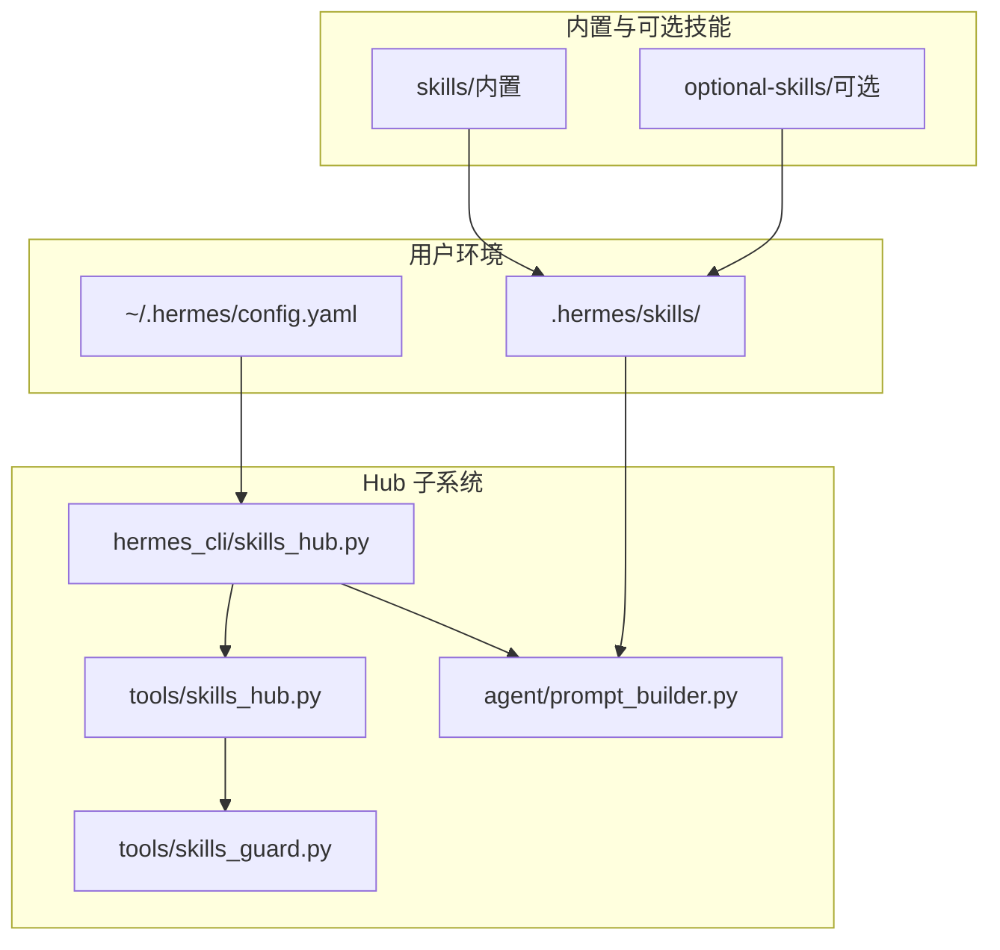
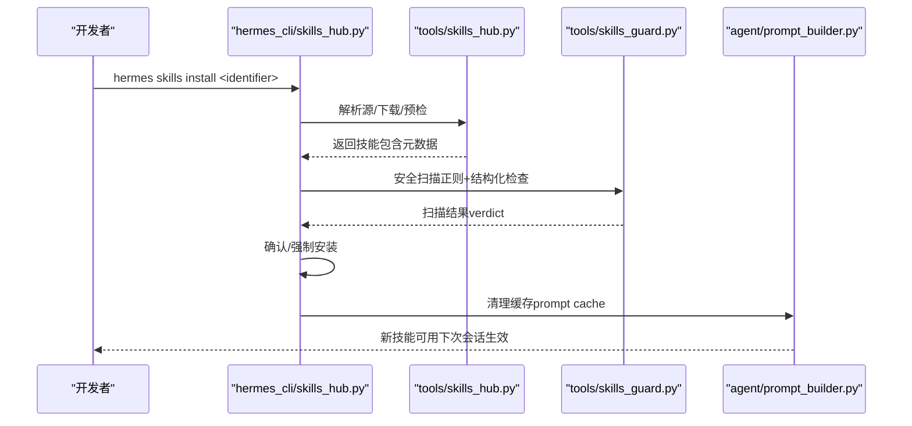
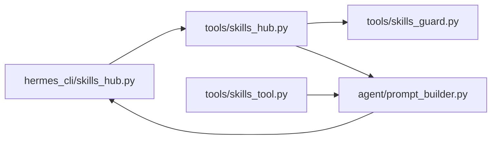

# 技能分享与分发

<cite>
**本文引用的文件**
- [README.md](file://README.md)
- [CONTRIBUTING.md](file://CONTRIBUTING.md)
- [skills_hub.py](file://hermes_cli/skills_hub.py)
- [skills_config.py](file://hermes_cli/skills_config.py)
- [uninstall.py](file://hermes_cli/uninstall.py)
- [skills_hub.py（工具模块）](file://tools/skills_hub.py)
- [skills_tool.py](file://tools/skills_tool.py)
- [skills_guard.py](file://tools/skills_guard.py)
- [prompt_builder.py](file://agent/prompt_builder.py)
- [SKILL.md 示例：arXiv](file://skills/research/arxiv/SKILL.md)
- [SKILL.md 示例：Meme Generation](file://optional-skills/creative/meme-generation/SKILL.md)
</cite>

## 目录
1. [简介](#简介)
2. [项目结构](#项目结构)
3. [核心组件](#核心组件)
4. [架构总览](#架构总览)
5. [详细组件分析](#详细组件分析)
6. [依赖关系分析](#依赖关系分析)
7. [性能考量](#性能考量)
8. [故障排查指南](#故障排查指南)
9. [结论](#结论)
10. [附录](#附录)

## 简介
本指南面向希望在 Hermes Agent 中创建、打包、发布与分发“技能”的开发者与贡献者。内容覆盖：
- 技能目录结构与元数据规范（SKILL.md）
- 技能市场发布流程（版本管理、更新机制、兼容性检查）
- 安装、卸载、更新与版本冲突处理
- 最佳实践（文档、示例、社区贡献）
- 实战案例：从本地技能到开源社区的贡献流程

## 项目结构
Hermes 的技能体系由“内置技能”“可选官方技能”“Hub 技能”三类构成，并通过统一的 Hub 系统进行发现、安装、安全扫描与更新。

图示来源
- [skills_hub.py:1-120](file://hermes_cli/skills_hub.py#L1-L120)
- [skills_hub.py（工具模块）:1-120](file://tools/skills_hub.py#L1-L120)
- [skills_guard.py:1-120](file://tools/skills_guard.py#L1-L120)
- [prompt_builder.py:1-120](file://agent/prompt_builder.py#L1-L120)

章节来源
- [README.md: 项目概览与入口:1-176](file://README.md#L1-L176)
- [CONTRIBUTING.md: 技能开发与分发指引:300-460](file://CONTRIBUTING.md#L300-L460)

## 核心组件
- 技能清单与视图工具：tools/skills_tool.py 提供技能列表、分类、视图加载等能力，支持平台过滤与禁用策略。
- 技能 Hub 命令行：hermes_cli/skills_hub.py 提供搜索、浏览、安装、卸载、更新、审计、发布等命令。
- Hub 后端适配器：tools/skills_hub.py 提供 GitHub、Well-Known Endpoint 等源的适配与索引缓存。
- 安全扫描：tools/skills_guard.py 对第三方技能进行静态威胁扫描与安装策略判定。
- 系统提示构建：agent/prompt_builder.py 在构建系统提示时按条件筛选与平台匹配技能。

章节来源
- [skills_tool.py: 技能发现与视图:520-780](file://tools/skills_tool.py#L520-L780)
- [skills_hub.py（CLI）: Hub 命令实现:144-598](file://hermes_cli/skills_hub.py#L144-L598)
- [skills_hub.py（工具模块）: 源适配与缓存:284-657](file://tools/skills_hub.py#L284-L657)
- [skills_guard.py: 扫描与安装策略:595-712](file://tools/skills_guard.py#L595-L712)
- [prompt_builder.py: 技能注入与条件过滤:1-120](file://agent/prompt_builder.py#L1-L120)

## 架构总览
Hermes 技能分发采用“本地 Hub + 多源适配 + 安全扫描 + 条件注入”的闭环：

图示来源
- [skills_hub.py（CLI）: 安装流程:307-447](file://hermes_cli/skills_hub.py#L307-L447)
- [skills_hub.py（工具模块）: 源适配与下载:340-404](file://tools/skills_hub.py#L340-L404)
- [skills_guard.py: 扫描与策略:642-676](file://tools/skills_guard.py#L642-L676)
- [prompt_builder.py: 缓存清理触发点:1-120](file://agent/prompt_builder.py#L1-L120)

## 详细组件分析

### 组件一：技能打包与元数据（SKILL.md）
- 必备文件：技能根目录必须包含 SKILL.md；可选 references/、templates/、assets/ 等。
- 元数据字段（示例见 arXiv 与 Meme Generation）：
  - name、description、version、author、license
  - metadata.hermes.tags、related_skills
  - 可选 platforms（macos/linux/windows）、required_environment_variables、prerequisites（兼容旧版）
- 推荐写法：
  - 使用 YAML frontmatter 声明元信息
  - 渐进披露：先列快速参考，再展开步骤、陷阱、验证
  - 提供脚本与示例，降低使用门槛

章节来源
- [CONTRIBUTING.md: SKILL.md 规范与示例:321-367](file://CONTRIBUTING.md#L321-L367)
- [SKILL.md 示例：arXiv:1-120](file://skills/research/arxiv/SKILL.md#L1-L120)
- [SKILL.md 示例：Meme Generation:1-130](file://optional-skills/creative/meme-generation/SKILL.md#L1-L130)

### 组件二：技能市场发布与版本管理
- 发布目标：
  - GitHub PR（需认证与仓库权限）
  - ClawHub（当前未直接支持，建议手动提交）
- 发布前自检：
  - 自扫描（禁止危险结论）
  - 需要 GitHub 访问令牌或 gh CLI 登录
- 版本管理与更新：
  - Hub 侧维护 lock.json 与审计日志
  - 支持检查更新与批量更新
  - 更新时自动重新安装并刷新 prompt 缓存

章节来源
- [skills_hub.py（CLI）: 发布流程与错误处理:711-778](file://hermes_cli/skills_hub.py#L711-L778)
- [skills_hub.py（CLI）: 检查/更新逻辑:557-598](file://hermes_cli/skills_hub.py#L557-L598)
- [skills_hub.py（工具模块）: 锁文件与状态目录:46-56](file://tools/skills_hub.py#L46-L56)

### 组件三：安装、卸载与更新
- 安装：
  - 支持短名解析、多源适配、隔离扫描、确认提示
  - 成功后清理 prompt 缓存，使新技能立即生效
- 卸载：
  - 支持交互确认、路径清理、服务停用（Linux systemd）
- 更新：
  - 检查上游变更，按需强制重装
  - 可审计已安装技能的安全状态

章节来源
- [skills_hub.py（CLI）: 安装/卸载/更新/审计:307-666](file://hermes_cli/skills_hub.py#L307-L666)
- [uninstall.py: 卸载流程与系统服务处理:169-322](file://hermes_cli/uninstall.py#L169-L322)

### 组件四：兼容性与条件激活
- 平台过滤：根据 frontmatter.platforms 字段决定是否在当前系统加载
- 工具集条件：metadata.hermes.requires_toolsets/fallback_for_toolsets 等控制显示与可用性
- 系统提示构建：prompt_builder 在构建系统提示时按可用工具集与条件过滤技能

章节来源
- [CONTRIBUTING.md: 平台与条件字段说明:381-421](file://CONTRIBUTING.md#L381-L421)
- [prompt_builder.py: 上下文与注入扫描:35-74](file://agent/prompt_builder.py#L35-L74)

### 组件五：安全扫描与信任策略
- 扫描范围：文本文件正则匹配、隐藏字符检测、结构化限制（文件数、大小、二进制）
- 威胁类型：数据外泄、提示注入、破坏性操作、持久化、网络隧道、编码混淆、供应链风险等
- 信任策略：builtin/trusted/community 三档，结合扫描结论与 --force 决策

章节来源
- [skills_guard.py: 威胁模式与策略:82-484](file://tools/skills_guard.py#L82-L484)
- [skills_guard.py: 结构化检查与阈值:734-800](file://tools/skills_guard.py#L734-L800)
- [skills_hub.py（CLI）: 安装前扫描与决策:367-383](file://hermes_cli/skills_hub.py#L367-L383)

### 组件六：技能配置与禁用
- 支持全局与平台维度禁用列表
- 提供交互式 UI 切换类别或单项技能启用/禁用
- 配置持久化于 ~/.hermes/config.yaml

章节来源
- [skills_config.py: 平台选择与切换逻辑:77-189](file://hermes_cli/skills_config.py#L77-L189)

## 依赖关系分析
- hermes_cli/skills_hub.py 依赖 tools/skills_hub.py（源适配、下载、索引缓存）
- tools/skills_hub.py 依赖 tools/skills_guard.py（扫描与策略）
- tools/skills_tool.py 负责技能发现与视图加载，供 CLI 与系统提示构建使用
- agent/prompt_builder.py 在构建系统提示时读取技能元数据与条件

图示来源
- [skills_hub.py（CLI）:1-120](file://hermes_cli/skills_hub.py#L1-L120)
- [skills_hub.py（工具模块）:1-120](file://tools/skills_hub.py#L1-L120)
- [skills_tool.py:1-120](file://tools/skills_tool.py#L1-L120)
- [prompt_builder.py:1-120](file://agent/prompt_builder.py#L1-L120)

章节来源
- [skills_hub.py（CLI）: 命令入口与流程:144-598](file://hermes_cli/skills_hub.py#L144-L598)
- [skills_hub.py（工具模块）: 源适配与下载:340-404](file://tools/skills_hub.py#L340-L404)
- [skills_tool.py: 技能发现与视图:520-780](file://tools/skills_tool.py#L520-L780)

## 性能考量
- 搜索与浏览：Hub 侧对远程索引做缓存（TTL），减少重复请求
- 安装路径校验：严格规范化相对路径，避免越界与注入
- 扫描范围控制：仅扫描文本文件，限制单文件与总量阈值，避免大体积技能影响性能
- prompt 缓存：安装/卸载后清理缓存，确保新技能及时生效

章节来源
- [skills_hub.py（工具模块）: 索引缓存 TTL:55-56](file://tools/skills_hub.py#L55-L56)
- [skills_guard.py: 结构化阈值:486-503](file://tools/skills_guard.py#L486-L503)
- [skills_hub.py（CLI）: 缓存清理触发:437-446](file://hermes_cli/skills_hub.py#L437-L446)

## 故障排查指南
- 安装被阻止
  - 查看扫描报告与结论，必要时使用 --force 强制安装（仅在理解风险后）
  - 检查源信任级别与扫描策略
- GitHub 认证失败
  - 确认 GITHUB_TOKEN 或 gh CLI 登录状态
- 平台不兼容
  - 检查 SKILL.md frontmatter.platforms 与 metadata.hermes 条件字段
- 技能未出现在系统提示中
  - 确认工具集可用性与禁用列表
  - 清理 prompt 缓存后重启会话
- 卸载残留
  - 使用卸载脚本清理 PATH、服务与数据（可选择保留数据）

章节来源
- [skills_guard.py: 安装策略与报告格式:642-712](file://tools/skills_guard.py#L642-L712)
- [skills_hub.py（CLI）: 认证与错误提示:754-777](file://hermes_cli/skills_hub.py#L754-L777)
- [skills_config.py: 禁用列表与平台维度:38-58](file://hermes_cli/skills_config.py#L38-L58)
- [uninstall.py: 卸载清理流程:169-322](file://hermes_cli/uninstall.py#L169-L322)

## 结论
通过统一的 Hub 流程与严格的安全扫描策略，Hermes Agent 为技能的创建、分发与治理提供了清晰的路径。遵循本文档的打包规范、发布流程与最佳实践，可显著提升技能质量与社区协作效率。

## 附录

### A. 技能打包清单
- 必填：SKILL.md（含 name、description、version 等）
- 可选：references/、templates/、assets/
- 元数据建议：tags、related_skills、platforms、required_environment_variables

章节来源
- [CONTRIBUTING.md: SKILL.md 规范:321-367](file://CONTRIBUTING.md#L321-L367)
- [SKILL.md 示例：arXiv:1-120](file://skills/research/arxiv/SKILL.md#L1-L120)
- [SKILL.md 示例：Meme Generation:1-130](file://optional-skills/creative/meme-generation/SKILL.md#L1-L130)

### B. 发布到技能市场（GitHub）
- 准备：本地扫描通过、GitHub 认证就绪
- 步骤：hermes skills publish <path> --to github --repo owner/repo
- 注意：禁止危险结论；必要时补充 README 与示例

章节来源
- [skills_hub.py（CLI）: 发布命令与校验:711-778](file://hermes_cli/skills_hub.py#L711-L778)

### C. 安装、卸载与更新操作速查
- 安装：hermes skills install <identifier>
- 浏览：hermes skills browse
- 检查更新：hermes skills check
- 更新：hermes skills update
- 卸载：hermes skills uninstall <name>
- 配置禁用：hermes skills（交互式切换）

章节来源
- [skills_hub.py（CLI）: 命令实现:144-598](file://hermes_cli/skills_hub.py#L144-L598)
- [skills_config.py: 配置与切换:136-189](file://hermes_cli/skills_config.py#L136-L189)
- [uninstall.py: 卸载流程:169-322](file://hermes_cli/uninstall.py#L169-L322)