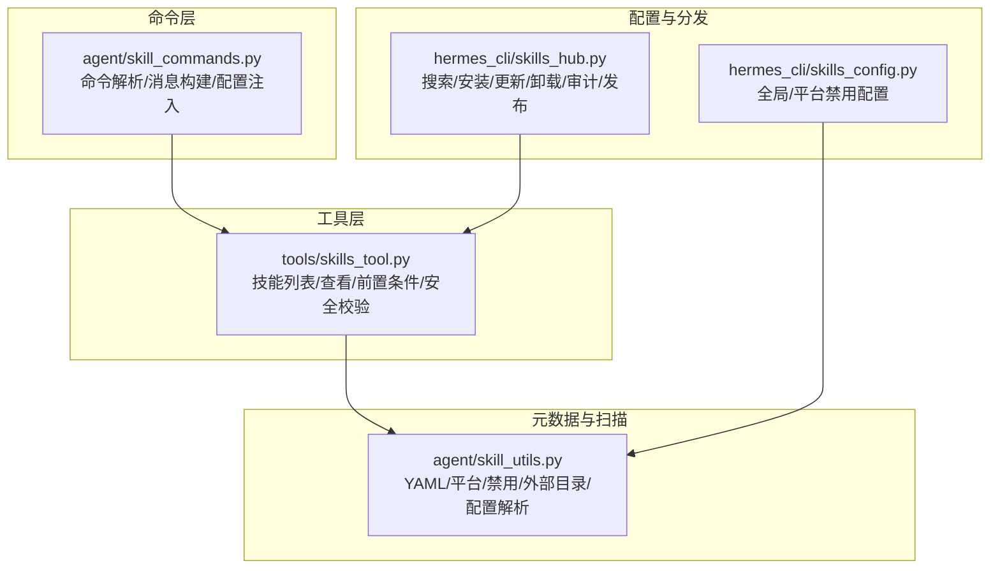
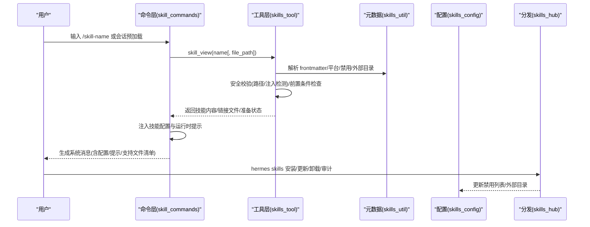
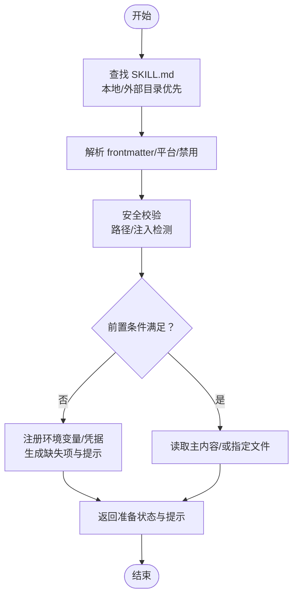
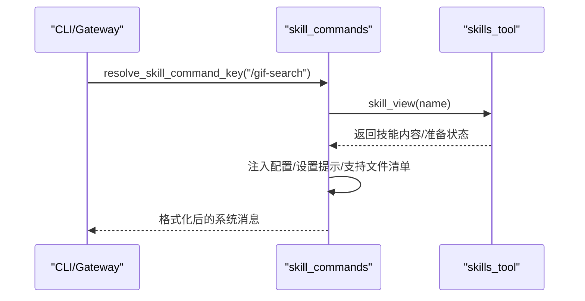
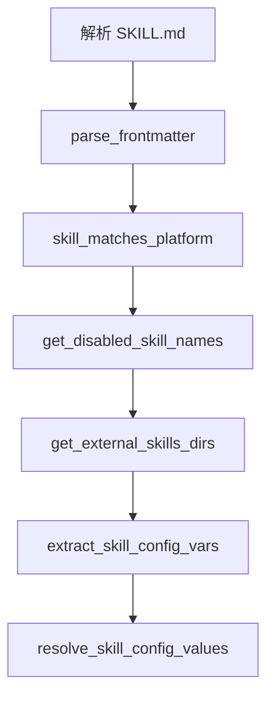
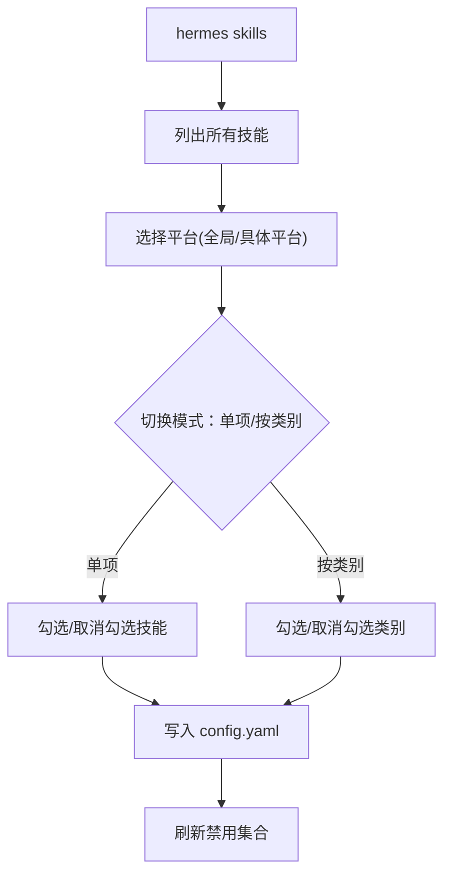
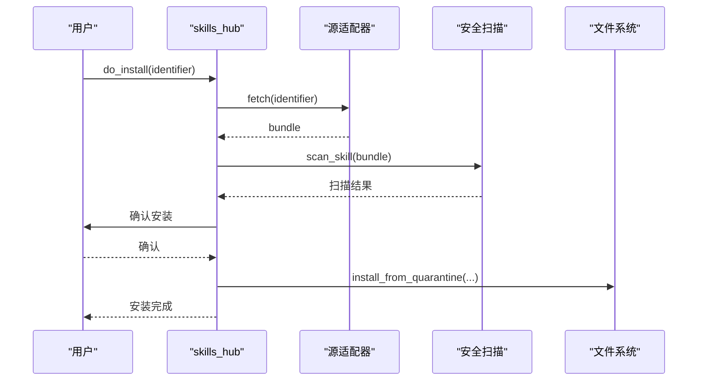
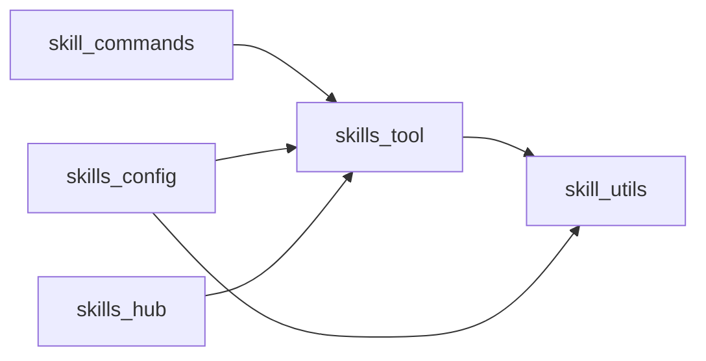

# 技能实现方法

<cite>
**本文引用的文件**
- [agent/skill_utils.py](file://agent/skill_utils.py)
- [agent/skill_commands.py](file://agent/skill_commands.py)
- [tools/skills_tool.py](file://tools/skills_tool.py)
- [hermes_cli/skills_config.py](file://hermes_cli/skills_config.py)
- [hermes_cli/skills_hub.py](file://hermes_cli/skills_hub.py)
- [optional-skills/autonomous-ai-agents/blackbox/README.md](file://optional-skills/autonomous-ai-agents/blackbox/README.md)
- [optional-skills/blockchain/base/README.md](file://optional-skills/blockchain/base/README.md)
</cite>

## 目录
1. [简介](#简介)
2. [项目结构](#项目结构)
3. [核心组件](#核心组件)
4. [架构总览](#架构总览)
5. [详细组件分析](#详细组件分析)
6. [依赖分析](#依赖分析)
7. [性能考虑](#性能考虑)
8. [故障排查指南](#故障排查指南)
9. [结论](#结论)
10. [附录](#附录)

## 简介
本指南面向希望在 Hermes Agent 中实现“技能（Skill）”的开发者与高级用户。技能是以目录形式组织的可发现知识单元，包含主文档 SKILL.md 以及可选的支持性文件（如 references、templates、scripts、assets）。技能通过工具接口被加载、解析与执行，支持平台过滤、禁用配置、外部目录扩展、环境变量注入、安全扫描与安装分发等能力。

本指南将系统讲解：
- 技能目录结构与元数据规范
- 技能生命周期：发现、加载、校验、准备、执行、清理
- Python 脚本结构、API 调用模式、文件操作技巧与第三方库集成
- 常见场景示例：文件处理、网络请求、数据转换、结果输出
- 调试技巧、日志记录与性能监控策略
- 最佳实践与常见陷阱规避

## 项目结构
Hermes Agent 的技能体系由以下模块协同构成：
- 工具层：tools/skills_tool.py 提供技能列表与内容查看、前置条件检查、环境变量与凭据注册、安全扫描与路径校验等
- 命令层：agent/skill_commands.py 将技能命令映射为系统消息，注入配置与运行时提示
- 元数据与扫描：agent/skill_utils.py 提供 YAML 解析、平台匹配、禁用列表、外部目录解析、配置变量提取与解析等
- 配置与分发：hermes_cli/skills_config.py 用于全局/平台维度的技能启用/禁用；hermes_cli/skills_hub.py 提供技能搜索、安装、更新、卸载、审计与发布

图示来源
- [tools/skills_tool.py:1-1377](file://tools/skills_tool.py#L1-L1377)
- [agent/skill_commands.py:1-369](file://agent/skill_commands.py#L1-L369)
- [agent/skill_utils.py:1-443](file://agent/skill_utils.py#L1-L443)
- [hermes_cli/skills_config.py:1-189](file://hermes_cli/skills_config.py#L1-L189)
- [hermes_cli/skills_hub.py:1-1220](file://hermes_cli/skills_hub.py#L1-L1220)

章节来源
- [tools/skills_tool.py:1-1377](file://tools/skills_tool.py#L1-L1377)
- [agent/skill_commands.py:1-369](file://agent/skill_commands.py#L1-L369)
- [agent/skill_utils.py:1-443](file://agent/skill_utils.py#L1-L443)
- [hermes_cli/skills_config.py:1-189](file://hermes_cli/skills_config.py#L1-L189)
- [hermes_cli/skills_hub.py:1-1220](file://hermes_cli/skills_hub.py#L1-L1220)

## 核心组件
- 技能工具（skills_tool）
  - 列出技能、查看技能内容、读取链接文件、解析前置条件、注册环境变量与凭据文件、平台匹配、禁用检查、安全扫描与路径校验
- 技能命令（skill_commands）
  - 将 /skill-name 命令解析为系统消息，注入技能配置与运行时提示，支持外部目录与本地目录优先级
- 技能元数据工具（skill_utils）
  - YAML 解析与回退、平台匹配、禁用列表、外部目录、条件字段提取、配置变量声明与解析
- 技能配置（skills_config）
  - 全局/平台维度的技能启用/禁用配置持久化与交互式切换
- 技能分发（skills_hub）
  - 搜索、安装、更新、卸载、审计、发布与源管理（tap）

章节来源
- [tools/skills_tool.py:1-1377](file://tools/skills_tool.py#L1-L1377)
- [agent/skill_commands.py:1-369](file://agent/skill_commands.py#L1-L369)
- [agent/skill_utils.py:1-443](file://agent/skill_utils.py#L1-L443)
- [hermes_cli/skills_config.py:1-189](file://hermes_cli/skills_config.py#L1-L189)
- [hermes_cli/skills_hub.py:1-1220](file://hermes_cli/skills_hub.py#L1-L1220)

## 架构总览
技能从“发现—加载—准备—执行—清理”的完整生命周期如下：

图示来源
- [agent/skill_commands.py:291-369](file://agent/skill_commands.py#L291-L369)
- [tools/skills_tool.py:787-1258](file://tools/skills_tool.py#L787-L1258)
- [agent/skill_utils.py:121-234](file://agent/skill_utils.py#L121-L234)
- [hermes_cli/skills_config.py:136-189](file://hermes_cli/skills_config.py#L136-L189)
- [hermes_cli/skills_hub.py:307-447](file://hermes_cli/skills_hub.py#L307-L447)

## 详细组件分析

### 组件A：技能工具（skills_tool）
职责与流程要点：
- 发现与加载：遍历本地与外部技能目录，定位 SKILL.md，解析 frontmatter，进行平台匹配与禁用检查
- 内容与文件：支持读取主文档或指定链接文件（references/templates/assets/scripts），并返回可用文件清单
- 前置条件与准备：解析 required_environment_variables、required_credential_files，注册环境透传与凭据挂载，计算 remaining_missing 并生成 setup_note
- 安全与合规：检测路径穿越、外部目录加载与潜在注入模式，记录警告日志
- 输出格式：统一返回 JSON 字符串，包含 success、content、linked_files、setup 状态等

图示来源
- [tools/skills_tool.py:800-1258](file://tools/skills_tool.py#L800-L1258)

章节来源
- [tools/skills_tool.py:1-1377](file://tools/skills_tool.py#L1-L1377)

### 组件B：技能命令（skill_commands）
职责与流程要点：
- 命令解析：将 /skill-name 映射为技能信息，支持下划线与连字符互换
- 消息构建：将技能内容包装为系统消息，注入已解析配置、设置提示、支持文件清单与用户指令
- 预加载：支持会话级预加载多个技能，合并为系统提示

图示来源
- [agent/skill_commands.py:272-369](file://agent/skill_commands.py#L272-L369)
- [tools/skills_tool.py:787-1258](file://tools/skills_tool.py#L787-L1258)

章节来源
- [agent/skill_commands.py:1-369](file://agent/skill_commands.py#L1-L369)

### 组件C：技能元数据工具（skill_utils）
职责与流程要点：
- YAML 解析：支持 CSafeLoader 与回退键值解析，确保健壮性
- 平台匹配：根据 frontmatter.platforms 与 sys.platform 进行匹配
- 外部目录：解析 config.yaml 中 skills.external_dirs，去重与存在性校验
- 禁用列表：按平台维度解析禁用技能集合
- 配置变量：提取 metadata.hermes.config 声明，解析当前值并展开路径

图示来源
- [agent/skill_utils.py:34-411](file://agent/skill_utils.py#L34-L411)

章节来源
- [agent/skill_utils.py:1-443](file://agent/skill_utils.py#L1-L443)

### 组件D：技能配置（skills_config）
职责与流程要点：
- 读取/保存禁用列表：支持全局与平台维度（cli、telegram、discord、slack、whatsapp、signal、email、homeassistant、mattermost、matrix、dingtalk、feishu、wecom、webhook）
- 交互式切换：支持按类别或单项切换启用/禁用
- 与工具层协作：通过 tools.skills_tool._is_skill_disabled 与 agent.skill_utils.get_disabled_skill_names 实现

图示来源
- [hermes_cli/skills_config.py:136-189](file://hermes_cli/skills_config.py#L136-L189)
- [agent/skill_utils.py:121-167](file://agent/skill_utils.py#L121-L167)
- [tools/skills_tool.py:503-518](file://tools/skills_tool.py#L503-L518)

章节来源
- [hermes_cli/skills_config.py:1-189](file://hermes_cli/skills_config.py#L1-L189)

### 组件E：技能分发（skills_hub）
职责与流程要点：
- 搜索与浏览：多源聚合、去重、排序与分页
- 安装：下载、隔离区扫描、策略判断、确认与安装、缓存失效
- 卸载：确认后移除并刷新缓存
- 更新：检查上游变更并批量更新
- 审计：对已安装技能重新扫描并输出报告
- 发布：本地技能自检并通过 GitHub 提交 PR

图示来源
- [hermes_cli/skills_hub.py:307-447](file://hermes_cli/skills_hub.py#L307-L447)

章节来源
- [hermes_cli/skills_hub.py:1-1220](file://hermes_cli/skills_hub.py#L1-L1220)

## 依赖分析
- 模块耦合
  - skill_commands 依赖 skills_tool 的 skill_view 与工具层能力
  - skills_tool 依赖 skill_utils 的 frontmatter 解析、平台匹配、禁用列表与外部目录
  - skills_config 与 skills_tool 协作维护禁用集合
  - skills_hub 与 skills_tool 协作进行安装/卸载/更新
- 关键依赖链
  - frontmatter 解析 → 平台匹配 → 禁用检查 → 加载内容/文件 → 注册环境变量/凭据 → 安全校验 → 输出结果
- 外部依赖
  - YAML 解析器（CSafeLoader 回退）、HTTP 客户端（用于发布）、终端后端（用于交互式任务）

图示来源
- [agent/skill_commands.py:1-369](file://agent/skill_commands.py#L1-L369)
- [tools/skills_tool.py:1-1377](file://tools/skills_tool.py#L1-L1377)
- [agent/skill_utils.py:1-443](file://agent/skill_utils.py#L1-L443)
- [hermes_cli/skills_config.py:1-189](file://hermes_cli/skills_config.py#L1-L189)
- [hermes_cli/skills_hub.py:1-1220](file://hermes_cli/skills_hub.py#L1-L1220)

章节来源
- [agent/skill_commands.py:1-369](file://agent/skill_commands.py#L1-L369)
- [tools/skills_tool.py:1-1377](file://tools/skills_tool.py#L1-L1377)
- [agent/skill_utils.py:1-443](file://agent/skill_utils.py#L1-L443)
- [hermes_cli/skills_config.py:1-189](file://hermes_cli/skills_config.py#L1-L189)
- [hermes_cli/skills_hub.py:1-1220](file://hermes_cli/skills_hub.py#L1-L1220)

## 性能考虑
- 渐进披露（Progressive Disclosure）
  - 列表仅返回最小元数据，避免大文本传输；按需加载 SKILL.md 与链接文件
- 缓存与增量
  - prompt_builder 可缓存系统提示，安装/卸载后主动失效以保证一致性
- I/O 优化
  - 限制一次性读取大小（如前 4000 字符），避免超大文件解析开销
- 并发与异步
  - 对于网络请求与扫描，建议使用异步客户端与并发控制，避免阻塞主线程
- 资源释放
  - 在远程沙箱中注册的环境变量与凭据文件应在任务结束后清理，防止资源泄露

## 故障排查指南
- 技能未显示或不可用
  - 检查是否被禁用：使用 hermes skills 查看/切换
  - 检查平台兼容性：frontmatter.platforms 是否与当前系统匹配
  - 检查外部目录配置：skills.external_dirs 是否正确且目录存在
- 加载失败或报错
  - 查看错误信息中的可用文件清单，确认 file_path 是否越界或拼写错误
  - 若提示路径越界，检查是否使用了相对路径并在技能目录内
- 安全告警
  - 若内容包含注入模式或来自非信任目录，系统会记录警告；请审阅内容并修正
- 环境变量/凭据缺失
  - 根据返回的 missing_required_environment_variables 与 missing_credential_files，补充 ~/.hermes/.env 或凭据文件
- 分发问题
  - 安装/更新/卸载失败时，查看扫描报告与错误原因；必要时重新扫描或手动清理隔离区

章节来源
- [tools/skills_tool.py:893-984](file://tools/skills_tool.py#L893-L984)
- [hermes_cli/skills_config.py:136-189](file://hermes_cli/skills_config.py#L136-L189)
- [hermes_cli/skills_hub.py:367-447](file://hermes_cli/skills_hub.py#L367-L447)

## 结论
Hermes Agent 的技能系统通过“渐进披露”与“安全优先”的设计，实现了可发现、可配置、可分发、可审计的技能生态。开发者只需遵循 SKILL.md 元数据规范与目录结构，即可快速实现可复用的技能。配合工具层的前置条件管理、环境变量与凭据注册、安全扫描与安装分发，技能的生命周期管理清晰可控。

## 附录

### 技能目录结构与元数据规范
- 目录结构
  - SKILL.md（必需）：主文档，采用 YAML frontmatter
  - references/：辅助文档、API 规范、示例
  - templates/：模板文件（markdown、脚本、配置）
  - assets/：补充文件（agentskills.io 标准）
  - scripts/：可执行脚本（Python、Shell 等）
- 元数据字段（agentskills.io 兼容）
  - 必填：name（≤64）、description（≤1024）
  - 可选：version、license、platforms（macos/linux/windows）、prerequisites（legacy）、metadata.hermes.tags/related_skills、compatibility
- 示例参考
  - 自主代理技能：[optional-skills/autonomous-ai-agents/blackbox/README.md](file://optional-skills/autonomous-ai-agents/blackbox/README.md)
  - 区块链技能：[optional-skills/blockchain/base/README.md](file://optional-skills/blockchain/base/README.md)

章节来源
- [tools/skills_tool.py:28-67](file://tools/skills_tool.py#L28-L67)
- [optional-skills/autonomous-ai-agents/blackbox/README.md:1-144](file://optional-skills/autonomous-ai-agents/blackbox/README.md#L1-L144)
- [optional-skills/blockchain/base/README.md:1-232](file://optional-skills/blockchain/base/README.md#L1-L232)

### 技能生命周期最佳实践
- 初始化
  - 在 SKILL.md frontmatter 中声明 platforms、required_environment_variables、required_credential_files
  - 使用 metadata.hermes.config 声明可配置项，便于注入到系统消息
- 执行
  - 通过 skill_view 读取内容与链接文件；在脚本中使用相对路径访问 assets/scripts
  - 对网络请求使用超时与重试策略；对敏感数据使用凭据文件而非硬编码
- 清理
  - 任务完成后清理临时文件与环境变量；在远程后端中注销环境透传与凭据挂载

章节来源
- [tools/skills_tool.py:1138-1258](file://tools/skills_tool.py#L1138-L1258)
- [agent/skill_commands.py:82-119](file://agent/skill_commands.py#L82-L119)

### 常见实现示例（步骤说明）
- 文件处理
  - 使用 skill_view(name, file_path) 读取 references/templates/assets/scripts 下的文件
  - 注意路径越界与二进制文件处理
- 网络请求
  - 在 scripts 中使用标准库或轻量 HTTP 库；设置超时与指数退避
  - 对外部服务（如 CoinGecko、RPC）进行速率限制与错误重试
- 数据转换
  - 使用 CSV/JSON/YAML 解析库；对输入进行严格校验与类型转换
- 结果输出
  - 将结果写入 /tmp 或工作目录；通过 MEDIA: 路径返回媒体文件
  - 使用日志记录关键步骤与异常，便于调试

章节来源
- [tools/skills_tool.py:947-1056](file://tools/skills_tool.py#L947-L1056)
- [optional-skills/blockchain/base/README.md:48-62](file://optional-skills/blockchain/base/README.md#L48-L62)

### 调试技巧与日志记录
- 日志
  - 使用标准 logging 记录关键路径与异常；注意区分 DEBUG/INFO/WARNING/ERROR
- 断点与单元测试
  - 对 YAML 解析、平台匹配、禁用列表、前置条件检查分别编写单元测试
- 性能监控
  - 记录 I/O 与网络耗时；对大文件与长任务使用进度反馈

章节来源
- [agent/skill_utils.py:8-17](file://agent/skill_utils.py#L8-L17)
- [tools/skills_tool.py:585-592](file://tools/skills_tool.py#L585-L592)