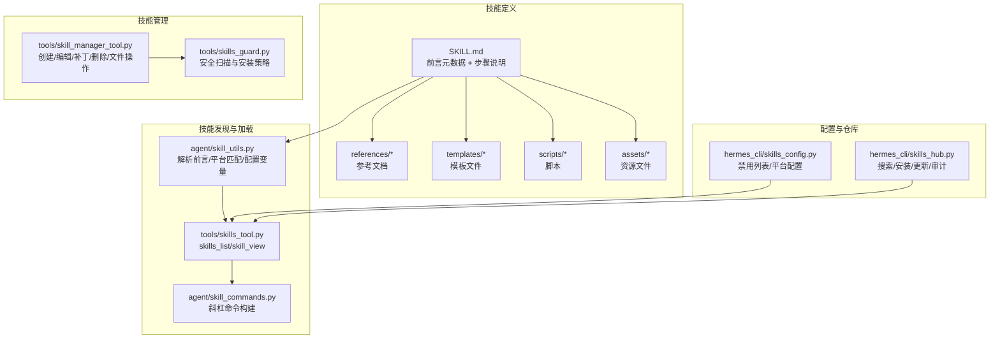
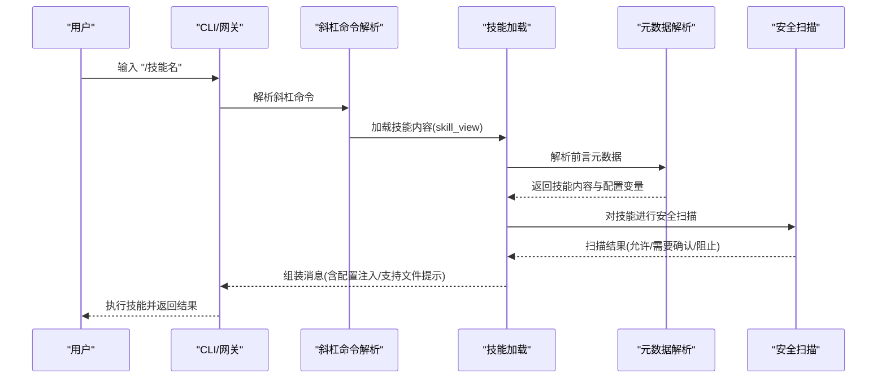
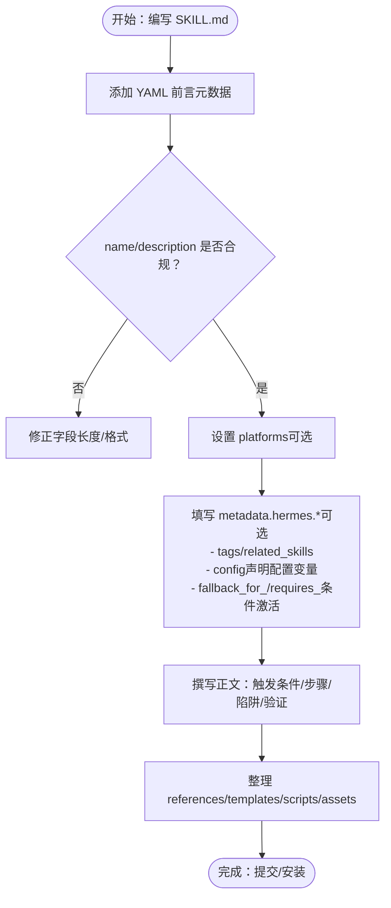
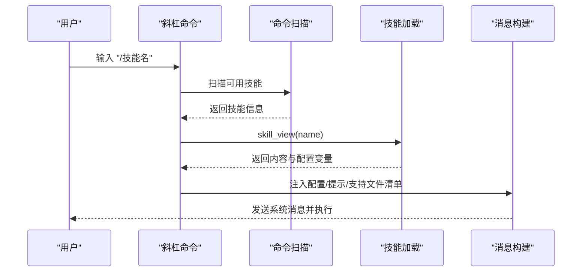
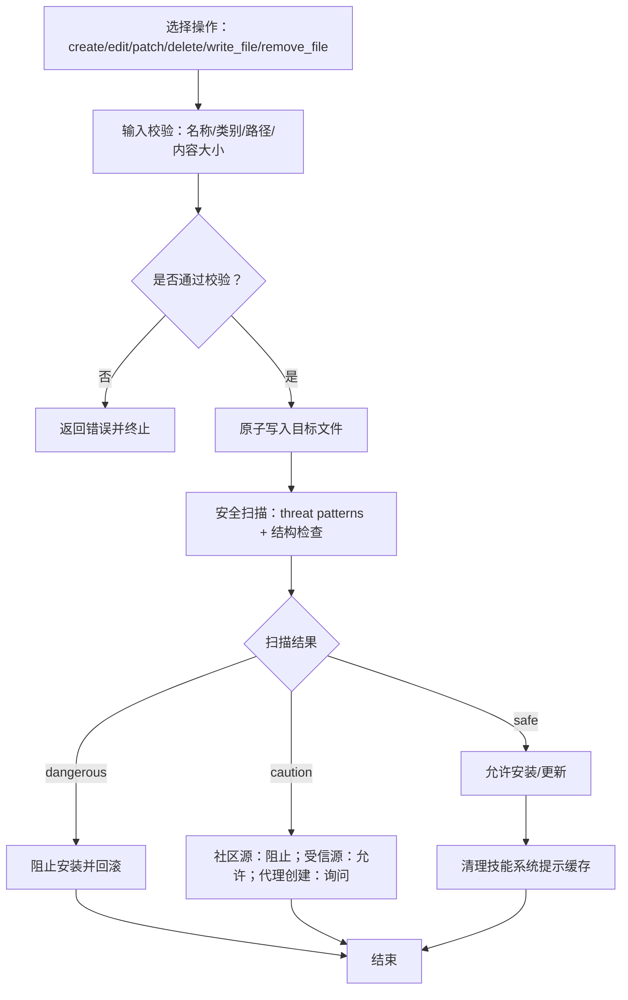
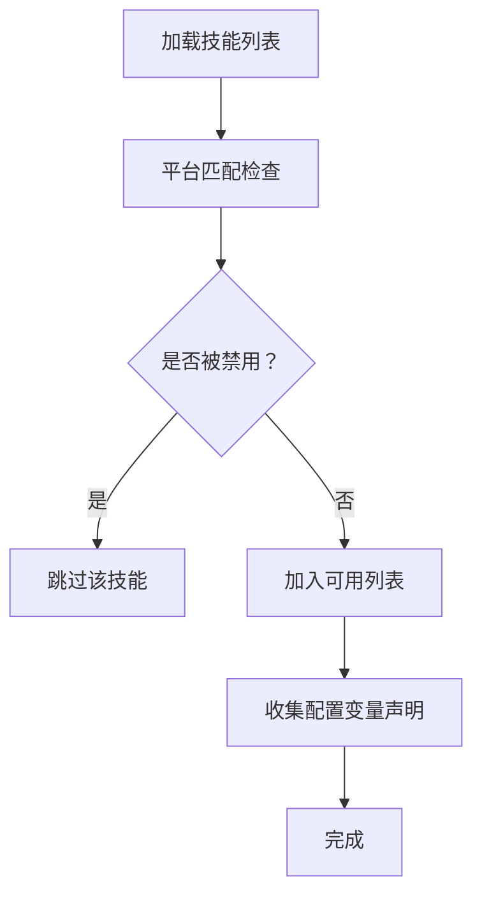
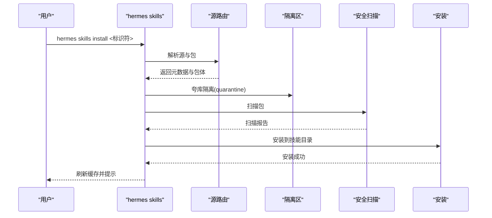
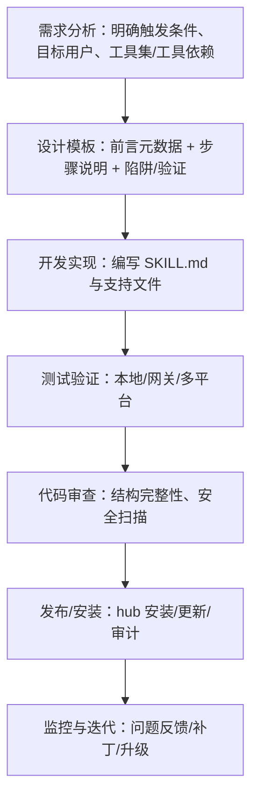
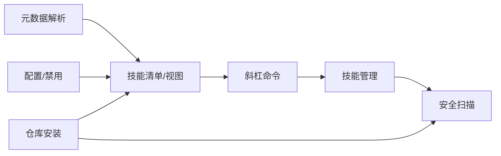

# 技能开发指南

<cite>
**本文档引用的文件**
- [README.md](file://README.md)
- [agent/skill_utils.py](file://agent/skill_utils.py)
- [agent/skill_commands.py](file://agent/skill_commands.py)
- [tools/skills_tool.py](file://tools/skills_tool.py)
- [tools/skill_manager_tool.py](file://tools/skill_manager_tool.py)
- [tools/skills_guard.py](file://tools/skills_guard.py)
- [hermes_cli/skills_config.py](file://hermes_cli/skills_config.py)
- [hermes_cli/skills_hub.py](file://hermes_cli/skills_hub.py)
- [optional-skills/devops/cli/SKILL.md](file://optional-skills/devops/cli/SKILL.md)
- [optional-skills/creative/meme-generation/SKILL.md](file://optional-skills/creative/meme-generation/SKILL.md)
- [optional-skills/research/duckduckgo-search/SKILL.md](file://optional-skills/research/duckduckgo-search/SKILL.md)
- [optional-skills/mlops/chroma/SKILL.md](file://optional-skills/mlops/chroma/SKILL.md)
- [skills/dogfood/SKILL.md](file://skills/dogfood/SKILL.md)
</cite>

## 目录
1. [简介](#简介)
2. [项目结构](#项目结构)
3. [核心组件](#核心组件)
4. [架构总览](#架构总览)
5. [详细组件分析](#详细组件分析)
6. [依赖分析](#依赖分析)
7. [性能考虑](#性能考虑)
8. [故障排除指南](#故障排除指南)
9. [结论](#结论)
10. [附录](#附录)

## 简介
本指南面向希望为 Hermes Agent 开发高质量技能（Skills）的开发者。内容覆盖技能模板结构、参数与元数据设计、触发条件与前置条件、步骤说明、陷阱警告与验证步骤等关键要素；并提供从需求分析到实现测试的完整流程，以及版本管理、依赖关系处理与兼容性考虑。文档同时通过多个真实技能案例解析，帮助开发者掌握不同类型技能的开发方法。

## 项目结构
Hermes Agent 的技能系统围绕以下关键模块组织：
- 技能发现与加载：通过扫描本地与外部技能目录，解析 SKILL.md 前言元数据，构建技能清单与视图。
- 技能命令与调用：将技能映射为可执行的斜杠命令，支持在 CLI 与网关平台中调用。
- 技能管理：提供创建、编辑、补丁、删除、写入/移除支持文件的能力，并内置安全扫描。
- 技能配置与禁用：支持按平台或全局维度控制技能启用状态。
- 技能仓库与安装：提供技能搜索、预览、安装、更新、卸载与审计能力。
- 安全扫描：对第三方与代理创建的技能进行威胁模式检测与安装策略判定。

**图表来源**
- [agent/skill_utils.py:1-443](file://agent/skill_utils.py#L1-L443)
- [tools/skills_tool.py:1-800](file://tools/skills_tool.py#L1-L800)
- [agent/skill_commands.py:1-369](file://agent/skill_commands.py#L1-L369)
- [tools/skill_manager_tool.py:1-743](file://tools/skill_manager_tool.py#L1-L743)
- [tools/skills_guard.py:1-800](file://tools/skills_guard.py#L1-L800)
- [hermes_cli/skills_config.py:1-189](file://hermes_cli/skills_config.py#L1-L189)
- [hermes_cli/skills_hub.py:1-800](file://hermes_cli/skills_hub.py#L1-L800)

**章节来源**
- [README.md:1-176](file://README.md#L1-L176)
- [agent/skill_utils.py:1-443](file://agent/skill_utils.py#L1-L443)
- [tools/skills_tool.py:1-800](file://tools/skills_tool.py#L1-L800)
- [agent/skill_commands.py:1-369](file://agent/skill_commands.py#L1-L369)
- [tools/skill_manager_tool.py:1-743](file://tools/skill_manager_tool.py#L1-L743)
- [tools/skills_guard.py:1-800](file://tools/skills_guard.py#L1-L800)
- [hermes_cli/skills_config.py:1-189](file://hermes_cli/skills_config.py#L1-L189)
- [hermes_cli/skills_hub.py:1-800](file://hermes_cli/skills_hub.py#L1-L800)

## 核心组件
- 技能前言元数据与解析：支持 name、description、version、license、platforms、metadata.hermes.*、prerequisites 等字段，用于平台匹配、标签、相关技能、前置条件等。
- 技能目录与文件结构：标准目录包含 SKILL.md 主文档，以及 references、templates、scripts、assets 子目录，便于渐进披露与扩展。
- 技能命令系统：将技能映射为斜杠命令，支持注入已配置的技能参数、环境提示与支持文件清单。
- 技能管理工具：提供原子化写入、路径校验、大小限制、安全扫描与回滚机制。
- 技能配置与禁用：支持按平台维度禁用技能，避免不兼容或不安全的使用场景。
- 技能仓库与安装：统一的技能源路由、安装策略、缓存失效与审计日志。
- 安全扫描：基于正则的静态威胁检测、信任级别策略与安装决策。

**章节来源**
- [tools/skills_tool.py:28-67](file://tools/skills_tool.py#L28-L67)
- [agent/skill_utils.py:52-86](file://agent/skill_utils.py#L52-L86)
- [agent/skill_commands.py:200-262](file://agent/skill_commands.py#L200-L262)
- [tools/skill_manager_tool.py:99-190](file://tools/skill_manager_tool.py#L99-L190)
- [hermes_cli/skills_config.py:38-58](file://hermes_cli/skills_config.py#L38-L58)
- [hermes_cli/skills_hub.py:307-447](file://hermes_cli/skills_hub.py#L307-L447)
- [tools/skills_guard.py:595-640](file://tools/skills_guard.py#L595-L640)

## 架构总览
技能系统采用“渐进披露”与“安全优先”的设计：
- 渐进披露：skills_list 仅返回最小元信息，skill_view 按需加载完整内容与链接文件。
- 平台与配置：通过前言元数据与配置文件控制平台兼容性与禁用列表。
- 安全：第三方与代理创建的技能均经过安全扫描，依据信任级别与扫描结果决定是否允许安装/使用。

**图表来源**
- [agent/skill_commands.py:291-326](file://agent/skill_commands.py#L291-L326)
- [tools/skills_tool.py:787-800](file://tools/skills_tool.py#L787-L800)
- [tools/skill_manager_tool.py:56-74](file://tools/skill_manager_tool.py#L56-L74)
- [tools/skills_guard.py:642-676](file://tools/skills_guard.py#L642-L676)

## 详细组件分析

### 组件A：技能模板与元数据设计
- 必填字段：name（≤64字符）、description（≤1024字符）。
- 可选字段：version、license、platforms（macos/linux/windows）、prerequisites（遗留前置条件）、metadata.hermes.*（tags、related_skills、config、fallback_for_*、requires_* 等）。
- 支持文件：references（参考文档）、templates（模板）、scripts（脚本）、assets（资源）。
- 兼容性：platforms 字段用于限制操作系统；metadata.hermes.config 可声明技能配置变量，供运行时注入。

**图表来源**
- [tools/skills_tool.py:28-67](file://tools/skills_tool.py#L28-L67)
- [agent/skill_utils.py:240-254](file://agent/skill_utils.py#L240-L254)
- [agent/skill_utils.py:260-316](file://agent/skill_utils.py#L260-L316)

**章节来源**
- [tools/skills_tool.py:28-67](file://tools/skills_tool.py#L28-L67)
- [agent/skill_utils.py:240-316](file://agent/skill_utils.py#L240-L316)

### 组件B：技能命令与调用流程
- 命令发现：扫描技能目录，解析 SKILL.md 前言，生成斜杠命令映射。
- 调用构建：加载技能内容，注入已解析的配置值、环境提示与支持文件清单，形成系统消息。
- 运行时提示：支持在调用时附加用户指令与运行时备注。

**图表来源**
- [agent/skill_commands.py:200-262](file://agent/skill_commands.py#L200-L262)
- [agent/skill_commands.py:291-326](file://agent/skill_commands.py#L291-L326)

**章节来源**
- [agent/skill_commands.py:200-369](file://agent/skill_commands.py#L200-L369)

### 组件C：技能管理与安全扫描
- 创建/编辑/补丁/删除/写文件/删文件：提供原子化写入、路径校验、大小限制与回滚。
- 安全扫描：对第三方与代理创建的技能进行威胁检测，依据信任级别与扫描结果决定安装策略。
- 缓存失效：修改技能后清理系统提示缓存，确保新技能立即生效。

**图表来源**
- [tools/skill_manager_tool.py:279-333](file://tools/skill_manager_tool.py#L279-L333)
- [tools/skill_manager_tool.py:56-74](file://tools/skill_manager_tool.py#L56-L74)
- [tools/skills_guard.py:642-676](file://tools/skills_guard.py#L642-L676)

**章节来源**
- [tools/skill_manager_tool.py:99-190](file://tools/skill_manager_tool.py#L99-L190)
- [tools/skill_manager_tool.py:279-472](file://tools/skill_manager_tool.py#L279-L472)
- [tools/skill_manager_tool.py:620-627](file://tools/skill_manager_tool.py#L620-L627)
- [tools/skills_guard.py:595-640](file://tools/skills_guard.py#L595-L640)

### 组件D：技能配置与禁用
- 全局与平台禁用：支持按平台维度禁用技能，避免在特定平台上加载不兼容或不安全的技能。
- 配置变量：技能可通过 metadata.hermes.config 声明配置项，系统自动注入默认值或用户配置。

**图表来源**
- [agent/skill_utils.py:121-167](file://agent/skill_utils.py#L121-L167)
- [agent/skill_utils.py:260-316](file://agent/skill_utils.py#L260-L316)
- [hermes_cli/skills_config.py:38-58](file://hermes_cli/skills_config.py#L38-L58)

**章节来源**
- [agent/skill_utils.py:121-167](file://agent/skill_utils.py#L121-L167)
- [agent/skill_utils.py:260-316](file://agent/skill_utils.py#L260-L316)
- [hermes_cli/skills_config.py:38-58](file://hermes_cli/skills_config.py#L38-L58)

### 组件E：技能仓库与安装
- 源路由：支持官方、受信与社区源，统一搜索与浏览体验。
- 安装策略：根据信任级别与扫描结果决定是否允许安装，支持强制安装与缓存失效。
- 更新与审计：提供更新检查、批量更新与重新审计功能。

**图表来源**
- [hermes_cli/skills_hub.py:307-447](file://hermes_cli/skills_hub.py#L307-L447)
- [hermes_cli/skills_hub.py:580-597](file://hermes_cli/skills_hub.py#L580-L597)
- [hermes_cli/skills_hub.py:600-631](file://hermes_cli/skills_hub.py#L600-L631)

**章节来源**
- [hermes_cli/skills_hub.py:144-181](file://hermes_cli/skills_hub.py#L144-L181)
- [hermes_cli/skills_hub.py:307-447](file://hermes_cli/skills_hub.py#L307-L447)
- [hermes_cli/skills_hub.py:580-631](file://hermes_cli/skills_hub.py#L580-L631)

### 组件F：复杂逻辑组件（技能开发流程）
以下流程展示了从需求分析到实现测试的完整过程，贯穿模板设计、参数与前置条件、步骤说明、陷阱警告与验证步骤、版本与依赖管理、兼容性与安全扫描等环节。

**图表来源**
- [tools/skill_manager_tool.py:138-174](file://tools/skill_manager_tool.py#L138-L174)
- [tools/skills_guard.py:595-640](file://tools/skills_guard.py#L595-L640)
- [hermes_cli/skills_hub.py:307-447](file://hermes_cli/skills_hub.py#L307-L447)

**章节来源**
- [tools/skill_manager_tool.py:138-174](file://tools/skill_manager_tool.py#L138-L174)
- [tools/skills_guard.py:595-640](file://tools/skills_guard.py#L595-L640)
- [hermes_cli/skills_hub.py:307-447](file://hermes_cli/skills_hub.py#L307-L447)

## 依赖分析
- 组件耦合与内聚：技能系统通过前言元数据与配置文件实现低耦合高内聚；命令解析与技能加载分离，便于扩展。
- 直接与间接依赖：技能加载依赖于元数据解析与平台匹配；命令系统依赖技能加载与配置注入；管理工具依赖安全扫描与缓存清理。
- 外部依赖与集成点：技能仓库源路由、安全扫描规则库、平台环境变量与终端后端。
- 接口契约：技能清单与视图工具、斜杠命令解析器、技能管理器、配置与禁用接口、仓库安装接口。

**图表来源**
- [agent/skill_utils.py:1-443](file://agent/skill_utils.py#L1-L443)
- [tools/skills_tool.py:520-594](file://tools/skills_tool.py#L520-L594)
- [agent/skill_commands.py:200-262](file://agent/skill_commands.py#L200-L262)
- [tools/skill_manager_tool.py:56-74](file://tools/skill_manager_tool.py#L56-L74)
- [hermes_cli/skills_config.py:38-58](file://hermes_cli/skills_config.py#L38-L58)
- [hermes_cli/skills_hub.py:307-447](file://hermes_cli/skills_hub.py#L307-L447)

**章节来源**
- [agent/skill_utils.py:1-443](file://agent/skill_utils.py#L1-L443)
- [tools/skills_tool.py:520-594](file://tools/skills_tool.py#L520-L594)
- [agent/skill_commands.py:200-262](file://agent/skill_commands.py#L200-L262)
- [tools/skill_manager_tool.py:56-74](file://tools/skill_manager_tool.py#L56-L74)
- [hermes_cli/skills_config.py:38-58](file://hermes_cli/skills_config.py#L38-L58)
- [hermes_cli/skills_hub.py:307-447](file://hermes_cli/skills_hub.py#L307-L447)

## 性能考虑
- 渐进披露：skills_list 仅返回最小元信息，减少令牌消耗；skill_view 按需加载完整内容。
- 文件大小与数量限制：单文件与总大小限制、文件数量上限，防止异常膨胀影响性能。
- 缓存与失效：技能变更后清理系统提示缓存，避免陈旧内容影响推理效率。
- 平台匹配：通过 platforms 字段提前过滤不兼容技能，减少无效加载。

[本节为通用指导，无需特定文件分析]

## 故障排除指南
- 前言元数据错误：检查 YAML 格式、必需字段、描述长度与闭合标记。
- 路径遍历与文件写入：确保文件路径在允许子目录下且无路径穿越。
- 安全扫描阻断：根据扫描报告定位危险模式（如 exfiltration、injection、destructive、persistence 等），修复后重试。
- 平台不兼容：检查 platforms 字段与当前系统平台映射。
- 配置变量缺失：确认 metadata.hermes.config 声明与 ~/.hermes/config.yaml 中的值一致。

**章节来源**
- [tools/skill_manager_tool.py:138-174](file://tools/skill_manager_tool.py#L138-L174)
- [tools/skill_manager_tool.py:217-241](file://tools/skill_manager_tool.py#L217-L241)
- [tools/skills_guard.py:642-676](file://tools/skills_guard.py#L642-L676)
- [agent/skill_utils.py:92-115](file://agent/skill_utils.py#L92-L115)
- [agent/skill_utils.py:260-316](file://agent/skill_utils.py#L260-L316)

## 结论
Hermes Agent 的技能系统以“渐进披露 + 安全优先”为核心理念，通过标准化的 SKILL.md 模板、严格的元数据与配置管理、完善的命令与调用机制、以及全面的安全扫描与仓库管理，为开发者提供了高效、安全、可维护的技能开发与分发体系。遵循本文档的设计原则与开发流程，可以显著提升技能质量与复用价值。

[本节为总结性内容，无需特定文件分析]

## 附录

### 实际技能案例分析

#### 案例一：CLI 搜索与应用运行（devops/cli）
- 触发条件：用户请求图像/视频生成、AI 应用搜索或运行。
- 步骤说明：先搜索应用、再运行并解析输出。
- 陷阱警告：不要猜测应用 ID、始终使用 --json、检查认证状态、注意长耗时任务。
- 验证步骤：输出应包含媒体 URL，使用 MEDIA: 展示。
- 依赖关系：依赖 infsh CLI 与相关服务端点。
- 版本管理：通过 version 字段标注版本号。

**章节来源**
- [optional-skills/devops/cli/SKILL.md:1-156](file://optional-skills/devops/cli/SKILL.md#L1-L156)

#### 案例二：模因生成（creative/meme-generation）
- 触发条件：用户要求生成模因图片。
- 步骤说明：选择模板/自定义场景、生成图片、视觉验证。
- 陷阱警告：保持标题简洁、匹配字段数、避免不当内容。
- 验证步骤：输出 .png 文件、文本可读、视觉效果符合预期。
- 依赖关系：依赖 Pillow 与可选的图像生成工具。

**章节来源**
- [optional-skills/creative/meme-generation/SKILL.md:1-130](file://optional-skills/creative/meme-generation/SKILL.md#L1-L130)

#### 案例三：DuckDuckGo 搜索（research/duckduckgo-search）
- 触发条件：用户需要免费网络搜索。
- 步骤说明：优先使用 ddgs CLI，否则使用 Python API 并验证导入。
- 陷阱警告：max_results 必须关键字传参、不要假设 CLI 或 Python 环境一致性。
- 验证步骤：返回标题/链接/摘要，必要时二次提取全文。
- 依赖关系：依赖 ddgs 包与 CLI 工具。

**章节来源**
- [optional-skills/research/duckduckgo-search/SKILL.md:1-238](file://optional-skills/research/duckduckgo-search/SKILL.md#L1-L238)

#### 案例四：向量数据库（mlops/chroma）
- 触发条件：需要本地/开源向量检索与元数据过滤。
- 步骤说明：创建集合、添加文档、查询与过滤、持久化存储。
- 陷阱警告：注意嵌入函数选择与性能权衡。
- 验证步骤：返回文档/元数据/距离，支持服务器模式部署。
- 依赖关系：依赖 chromadb 与 sentence-transformers。

**章节来源**
- [optional-skills/mlops/chroma/SKILL.md:1-410](file://optional-skills/mlops/chroma/SKILL.md#L1-L410)

#### 案例五：系统化 Web 应用 QA（skills/dogfood）
- 触发条件：需要系统化探索性测试与结构化报告。
- 步骤说明：计划阶段、探索阶段、证据收集、分类汇总、生成报告。
- 陷阱警告：关注静默 JS 错误、表单验证与边缘情况。
- 验证步骤：截图证据、报告模板、严重性与类目统计。
- 依赖关系：浏览器工具集与截图/控制台分析工具。

**章节来源**
- [skills/dogfood/SKILL.md:1-162](file://skills/dogfood/SKILL.md#L1-L162)