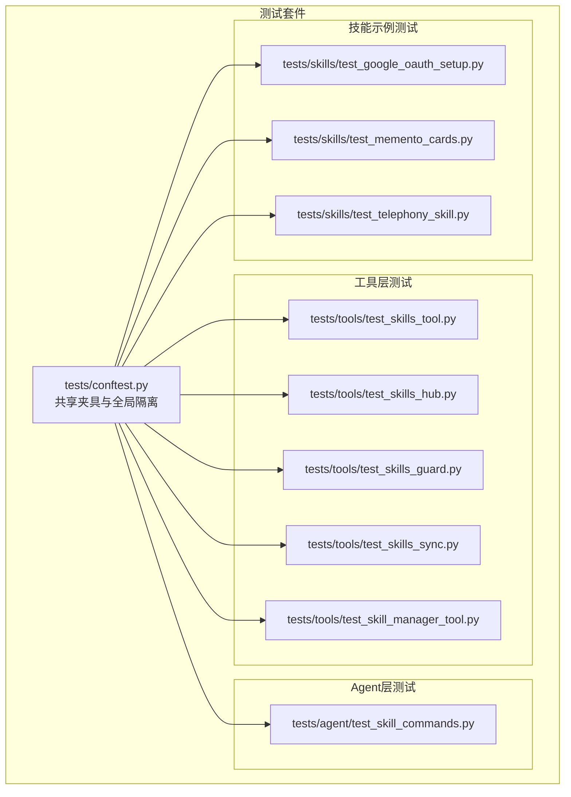
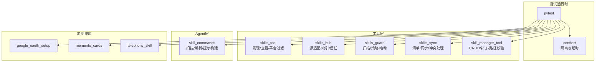
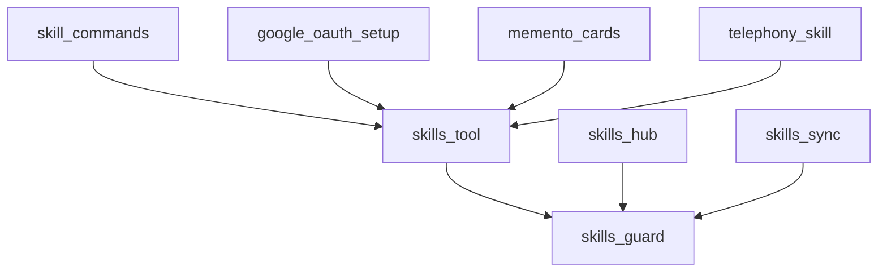

# 技能测试与验证

<cite>
**本文档引用的文件**
- [tests/conftest.py](file://tests/conftest.py)
- [tests/agent/test_skill_commands.py](file://tests/agent/test_skill_commands.py)
- [tests/tools/test_skills_tool.py](file://tests/tools/test_skills_tool.py)
- [tests/tools/test_skills_hub.py](file://tests/tools/test_skills_hub.py)
- [tests/tools/test_skills_guard.py](file://tests/tools/test_skills_guard.py)
- [tests/tools/test_skills_sync.py](file://tests/tools/test_skills_sync.py)
- [tests/tools/test_skill_manager_tool.py](file://tests/tools/test_skill_manager_tool.py)
- [tests/skills/test_google_oauth_setup.py](file://tests/skills/test_google_oauth_setup.py)
- [tests/skills/test_memento_cards.py](file://tests/skills/test_memento_cards.py)
- [tests/skills/test_telephony_skill.py](file://tests/skills/test_telephony_skill.py)
</cite>

## 目录
1. [引言](#引言)
2. [项目结构](#项目结构)
3. [核心组件](#核心组件)
4. [架构总览](#架构总览)
5. [详细组件分析](#详细组件分析)
6. [依赖分析](#依赖分析)
7. [性能考虑](#性能考虑)
8. [故障排查指南](#故障排查指南)
9. [结论](#结论)
10. [附录](#附录)

## 引言
本指南面向Hermes Agent的技能测试与验证，系统化阐述测试方法论（单元测试、集成测试、端到端测试）、测试用例设计原则（正常流程、边界条件、异常处理）、测试环境搭建（模拟数据、工具与自动化流程）、技能验证标准（功能正确性、性能表现、安全性）以及实际测试案例。文档以仓库内现有测试为依据，结合代码级分析，帮助读者快速建立可重复、可扩展的技能验证体系。

## 项目结构
测试覆盖围绕以下关键模块展开：
- 工具层：技能发现、查看、管理、同步、Hub与安全扫描
- Agent层：技能命令解析、平台过滤、预加载提示构建
- 技能示例：OAuth设置、闪卡记忆、电话技能等

图表来源
- [tests/conftest.py:1-120](file://tests/conftest.py#L1-L120)
- [tests/tools/test_skills_tool.py:1-1049](file://tests/tools/test_skills_tool.py#L1-L1049)
- [tests/tools/test_skills_hub.py:1-1372](file://tests/tools/test_skills_hub.py#L1-L1372)
- [tests/tools/test_skills_guard.py:1-517](file://tests/tools/test_skills_guard.py#L1-L517)
- [tests/tools/test_skills_sync.py:1-492](file://tests/tools/test_skills_sync.py#L1-L492)
- [tests/tools/test_skill_manager_tool.py:1-426](file://tests/tools/test_skill_manager_tool.py#L1-L426)
- [tests/agent/test_skill_commands.py:1-408](file://tests/agent/test_skill_commands.py#L1-L408)
- [tests/skills/test_google_oauth_setup.py:1-238](file://tests/skills/test_google_oauth_setup.py#L1-L238)
- [tests/skills/test_memento_cards.py:1-428](file://tests/skills/test_memento_cards.py#L1-L428)
- [tests/skills/test_telephony_skill.py:1-230](file://tests/skills/test_telephony_skill.py#L1-L230)

章节来源
- [tests/conftest.py:1-120](file://tests/conftest.py#L1-L120)

## 核心组件
- 测试夹具与隔离：统一的临时目录、HERMES_HOME隔离、事件循环与超时控制，确保测试稳定与可重复。
- 技能发现与查看：解析frontmatter、标签、平台过滤、描述截断、禁用技能屏蔽等。
- 技能Hub与索引：GitHub源、Skills.sh、Well-Known源的搜索、清单与信任级别判定。
- 安全扫描：内容哈希、结构检查、模式检测、信任级别与安装决策。
- 同步机制：清单式种子与更新、冲突处理、失败重试与数据保护。
- 技能管理：创建、编辑、补丁、删除、文件写入与路径校验。
- Agent技能命令：扫描、平台过滤、命令键解析、预加载提示与调用消息构建。
- 示例技能：Google OAuth设置、Memento闪卡、Telephony技能。

章节来源
- [tests/conftest.py:19-120](file://tests/conftest.py#L19-L120)
- [tests/tools/test_skills_tool.py:1-1049](file://tests/tools/test_skills_tool.py#L1-L1049)
- [tests/tools/test_skills_hub.py:1-1372](file://tests/tools/test_skills_hub.py#L1-L1372)
- [tests/tools/test_skills_guard.py:1-517](file://tests/tools/test_skills_guard.py#L1-L517)
- [tests/tools/test_skills_sync.py:1-492](file://tests/tools/test_skills_sync.py#L1-L492)
- [tests/tools/test_skill_manager_tool.py:1-426](file://tests/tools/test_skill_manager_tool.py#L1-L426)
- [tests/agent/test_skill_commands.py:1-408](file://tests/agent/test_skill_commands.py#L1-L408)
- [tests/skills/test_google_oauth_setup.py:1-238](file://tests/skills/test_google_oauth_setup.py#L1-L238)
- [tests/skills/test_memento_cards.py:1-428](file://tests/skills/test_memento_cards.py#L1-L428)
- [tests/skills/test_telephony_skill.py:1-230](file://tests/skills/test_telephony_skill.py#L1-L230)

## 架构总览
测试架构以“夹具隔离 + 模块化测试 + 多层次验证”为核心，贯穿工具层、Agent层与示例技能层。

图表来源
- [tests/conftest.py:1-120](file://tests/conftest.py#L1-L120)
- [tests/tools/test_skills_tool.py:1-1049](file://tests/tools/test_skills_tool.py#L1-L1049)
- [tests/tools/test_skills_hub.py:1-1372](file://tests/tools/test_skills_hub.py#L1-L1372)
- [tests/tools/test_skills_guard.py:1-517](file://tests/tools/test_skills_guard.py#L1-L517)
- [tests/tools/test_skills_sync.py:1-492](file://tests/tools/test_skills_sync.py#L1-L492)
- [tests/tools/test_skill_manager_tool.py:1-426](file://tests/tools/test_skill_manager_tool.py#L1-L426)
- [tests/agent/test_skill_commands.py:1-408](file://tests/agent/test_skill_commands.py#L1-L408)
- [tests/skills/test_google_oauth_setup.py:1-238](file://tests/skills/test_google_oauth_setup.py#L1-L238)
- [tests/skills/test_memento_cards.py:1-428](file://tests/skills/test_memento_cards.py#L1-L428)
- [tests/skills/test_telephony_skill.py:1-230](file://tests/skills/test_telephony_skill.py#L1-L230)

## 详细组件分析

### 测试夹具与环境隔离
- 临时HOME隔离：强制HERMES_HOME指向临时目录，避免污染用户环境；清理插件单例状态。
- 平台会话变量清空：防止继承网关会话环境变量。
- 全局事件循环：为同步测试提供默认事件循环，避免异步测试干扰。
- 超时控制：Unix信号SIGALRM触发30秒超时，防止阻塞测试拖垮套件。

章节来源
- [tests/conftest.py:19-120](file://tests/conftest.py#L19-L120)

### 工具层：技能发现与查看
- 前言解析与标签：支持多格式输入、回退解析、空值过滤。
- 环境变量标准化：兼容旧版prerequisites与新字段，缺失值识别。
- 分类与平台过滤：按路径推断分类，按系统平台过滤技能。
- 列表与视图：描述截断、引用文件展示、禁用技能屏蔽。
- 安全设置加载：在CLI与网关场景下分别处理密钥捕获与提示。

章节来源
- [tests/tools/test_skills_tool.py:54-800](file://tests/tools/test_skills_tool.py#L54-L800)

### 工具层：技能Hub与索引
- 快速前言解析：容错处理、嵌套YAML、非法格式返回空。
- 信任级别：内置可信仓库映射、Skills.sh别名修正、社区默认。
- 搜索与检视：Skills.sh结果重标记、详情页解析、树形查找与回退。
- 更新检测：内容哈希对比、锁文件记录、版本迁移与清理。

章节来源
- [tests/tools/test_skills_hub.py:36-800](file://tests/tools/test_skills_hub.py#L36-L800)

### 工具层：安全扫描与策略
- 结构检查：文件数量上限、单文件大小、二进制文件、符号链接逃逸与前缀混淆。
- 模式检测：网络外发、注入、破坏性命令、反向shell、隐藏字符、硬编码凭据、动态执行。
- 信任与决策：内置优先、可信放宽、社区谨慎、强制覆盖、代理创建策略。
- 报告格式化：清晰输出扫描结果与建议。

章节来源
- [tests/tools/test_skills_guard.py:48-517](file://tests/tools/test_skills_guard.py#L48-L517)

### 工具层：同步机制（清单式）
- 清单读写：v1到v2迁移、排序、空白行忽略、混合格式兼容。
- 目录哈希：MD5字符串，空目录与不存在目录的处理。
- 发现与相对路径：保留分类结构、忽略.git。
- 同步策略：全新安装复制、用户删除不回填、未修改自动更新、用户修改不覆盖、v1迁移基线、清理过期条目、失败重试与数据保护、记录新原点哈希。

章节来源
- [tests/tools/test_skills_sync.py:19-492](file://tests/tools/test_skills_sync.py#L19-L492)

### 工具层：技能管理
- 名称与分类校验：长度限制、大小写、特殊字符、路径穿越。
- 前言校验：必需字段、闭合、正文存在、YAML解析错误。
- 文件路径校验：仅允许子目录、禁止根级文件、禁止目录本身。
- CRUD与补丁：创建/编辑/补丁/删除、支持支撑文件、歧义替换与全部替换。
- 写入与删除：支撑文件写入、删除校验与错误反馈。
- 分发器：动作参数校验与错误提示。

章节来源
- [tests/tools/test_skill_manager_tool.py:65-426](file://tests/tools/test_skill_manager_tool.py#L65-L426)

### Agent层：技能命令与提示
- 命令扫描：发现技能、空目录返回、平台过滤、禁用技能排除、特殊字符清洗、全特殊名称跳过。
- 键解析：Telegram下划线与连字符互转、未知命令返回空。
- 预加载提示：多技能加载、缺失报告、构建消息体。
- 调用消息：按存储路径加载、安全设置提示、远程环境保留警告、支撑文件提示。

章节来源
- [tests/agent/test_skill_commands.py:41-408](file://tests/agent/test_skill_commands.py#L41-L408)

### 示例技能：Google OAuth设置
- 获取授权URL：持久化state与code_verifier、保存待确认文件、构造授权URL。
- 交换授权码：复用PKCE材料、从重定向URL提取code、state校验、错误保留待确认会话、拒绝覆盖更窄作用域令牌。

章节来源
- [tests/skills/test_google_oauth_setup.py:135-238](file://tests/skills/test_google_oauth_setup.py#L135-L238)

### 示例技能：Memento闪卡
- 卡片CRUD：添加默认集合、列表筛选、删除与集合删除。
- 到期过滤：新建即到期、未来到期不计、退休卡片不计。
- 评分与重排：hard(+1天)、good(+3天)、easy(+7天并累积易度 streak)、退休、3次easy后退休、hard重置streak。
- CSV导入导出：去空行与单列、集合回填、原子写入恢复。
- 批量添加：视频ID去重、重复跳过。
- 统计与边界：空牌组统计、损坏JSON恢复、目录自动创建、不存在集合删除。

章节来源
- [tests/skills/test_memento_cards.py:41-428](file://tests/skills/test_memento_cards.py#L41-L428)

### 示例技能：Telephony
- Twilio保存：写入.env与状态文件、更新默认号码与SID。
- 环境更新：增量更新、保留其他键。
- 消息过滤：基于checkpoint只返回新消息。
- 号码购买：请求Twilio接口、保存环境与状态。
- 收件箱：拉取收件、标记seen、更新checkpoint。
- VAPI导入：解析API密钥、解析Twilio凭证、导入号码并保存状态。
- 诊断：包含决策树与已保存状态。

章节来源
- [tests/skills/test_telephony_skill.py:29-230](file://tests/skills/test_telephony_skill.py#L29-L230)

## 依赖分析
- 测试耦合与内聚：各模块测试自成体系，通过conftest统一隔离，降低跨模块耦合。
- 外部依赖：HTTP客户端、文件系统、进程与信号、系统平台信息。
- 循环依赖：未见直接循环；工具层内部职责清晰，Agent与示例技能独立于工具层。
- 接口契约：技能发现/查看/管理/同步/安全扫描均以函数形式暴露，便于mock与断言。

图表来源
- [tests/tools/test_skills_tool.py:1-1049](file://tests/tools/test_skills_tool.py#L1-L1049)
- [tests/tools/test_skills_guard.py:1-517](file://tests/tools/test_skills_guard.py#L1-L517)
- [tests/tools/test_skills_hub.py:1-1372](file://tests/tools/test_skills_hub.py#L1-L1372)
- [tests/tools/test_skills_sync.py:1-492](file://tests/tools/test_skills_sync.py#L1-L492)
- [tests/agent/test_skill_commands.py:1-408](file://tests/agent/test_skill_commands.py#L1-L408)
- [tests/skills/test_google_oauth_setup.py:1-238](file://tests/skills/test_google_oauth_setup.py#L1-L238)
- [tests/skills/test_memento_cards.py:1-428](file://tests/skills/test_memento_cards.py#L1-L428)
- [tests/skills/test_telephony_skill.py:1-230](file://tests/skills/test_telephony_skill.py#L1-L230)

## 性能考虑
- I/O与文件系统：清单读写、目录哈希、批量复制/更新需关注磁盘吞吐；建议在CI中使用SSD或缓存目录。
- HTTP请求：Hub索引与第三方API调用应设置合理超时与重试；测试中通过mock减少外部依赖。
- 内存占用：大规模技能扫描与CSV导入需注意内存峰值；建议分批处理与流式读取。
- 并发与隔离：pytest并发执行时依赖conftest隔离，避免共享状态导致性能抖动。

## 故障排查指南
- 超时与悬挂：启用全局30秒超时，定位长时间阻塞的I/O或子进程。
- 环境污染：确认HERMES_HOME隔离生效，避免历史配置影响测试。
- 平台差异：技能平台过滤依赖sys.platform，确保测试机平台与预期一致。
- 安全扫描误报：检查模式规则与隐藏字符，必要时调整策略或使用force。
- 同步失败：观察失败重试与数据保护逻辑，确认manifest一致性与磁盘权限。
- 示例技能认证：OAuth流程依赖待确认文件与PKCE材料，确保state与verifier一致。

章节来源
- [tests/conftest.py:72-120](file://tests/conftest.py#L72-L120)
- [tests/tools/test_skills_guard.py:198-517](file://tests/tools/test_skills_guard.py#L198-L517)
- [tests/tools/test_skills_sync.py:380-492](file://tests/tools/test_skills_sync.py#L380-L492)
- [tests/skills/test_google_oauth_setup.py:151-238](file://tests/skills/test_google_oauth_setup.py#L151-L238)

## 结论
通过统一的测试夹具、模块化的测试用例与多层次的安全与功能验证，Hermes Agent的技能测试体系能够有效保障功能正确性、性能稳定性与安全性。建议在持续集成中固定超时、隔离环境、并行执行，同时对关键路径（安全扫描、Hub索引、同步机制）进行重点监控与回归测试。

## 附录

### 测试方法论与用例设计
- 单元测试：聚焦函数/方法行为，使用mock与夹具隔离外部依赖。
- 集成测试：跨模块协作验证（如技能发现+安全扫描），关注接口契约与错误传播。
- 端到端测试：完整流程验证（如OAuth设置、Memento闪卡工作流），模拟真实用户场景。

### 测试环境搭建步骤
- 准备临时目录与环境变量隔离（HERMES_HOME）。
- 安装依赖并运行pytest，默认启用conftest夹具。
- 对需要网络的测试，可通过mock或本地缓存减少外部依赖。

### 技能验证标准与指标
- 功能正确性：覆盖正常流程、边界条件与异常分支；确保平台过滤、禁用屏蔽、路径校验等规则生效。
- 性能表现：关注I/O与HTTP开销，避免不必要的重复扫描与下载。
- 安全性：通过安全扫描与信任级别策略，阻断高危风险；对代理创建技能采用宽松但可控策略。