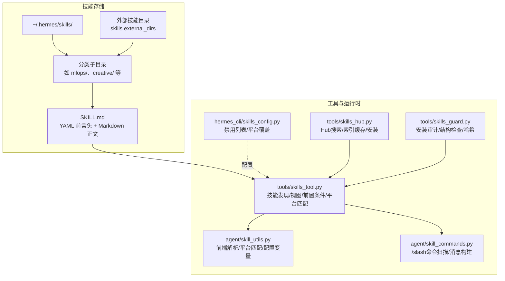
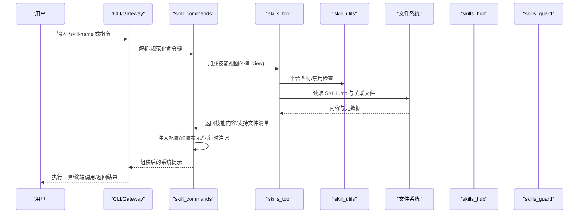
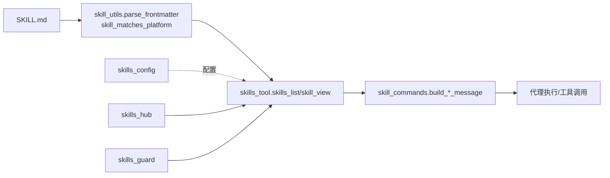

# 技能设计原则

<cite>
**本文引用的文件**
- [agent/skill_commands.py](file://agent/skill_commands.py)
- [agent/skill_utils.py](file://agent/skill_utils.py)
- [tools/skills_tool.py](file://tools/skills_tool.py)
- [hermes_cli/skills_config.py](file://hermes_cli/skills_config.py)
- [tools/skills_hub.py](file://tools/skills_hub.py)
- [optional-skills/autonomous-ai-agents/blackbox/SKILL.md](file://optional-skills/autonomous-ai-agents/blackbox/SKILL.md)
- [optional-skills/creative/meme-generation/SKILL.md](file://optional-skills/creative/meme-generation/SKILL.md)
- [optional-skills/devops/cli/SKILL.md](file://optional-skills/devops/cli/SKILL.md)
- [optional-skills/security/sherlock/SKILL.md](file://optional-skills/security/sherlock/SKILL.md)
- [optional-skills/DESCRIPTION.md](file://optional-skills/DESCRIPTION.md)
- [tests/tools/test_skills_guard.py](file://tests/tools/test_skills_guard.py)
- [tests/tools/test_skill_view_traversal.py](file://tests/tools/test_skill_view_traversal.py)
- [tests/tools/test_skill_manager_tool.py](file://tests/tools/test_skill_manager_tool.py)
</cite>

## 目录
1. [引言](#引言)
2. [项目结构](#项目结构)
3. [核心组件](#核心组件)
4. [架构总览](#架构总览)
5. [详细组件分析](#详细组件分析)
6. [依赖关系分析](#依赖关系分析)
7. [性能考量](#性能考量)
8. [故障排查指南](#故障排查指南)
9. [结论](#结论)
10. [附录](#附录)

## 引言
本文件面向Hermes Agent的技能作者与使用者，系统化阐述“技能设计原则”。内容涵盖触发条件设计、步骤分解原则、参数验证机制、错误处理策略、技能模板结构要素（技能描述、前置条件、执行步骤、输出格式、异常处理）、最佳实践（用户友好性、安全性、性能优化、可维护性），并通过仓库中真实存在的技能示例进行模式归纳与实现技巧提炼。

## 项目结构
Hermes Agent的技能体系由“技能目录”“技能工具”“命令解析”“配置与平台适配”“安全与审计”等模块协同构成。技能以目录形式组织，主文档为SKILL.md，采用YAML前言头定义元数据；通过工具层加载、校验、分发至代理执行；支持按平台过滤、禁用列表、外部目录扩展与Hub安装。

图表来源
- [tools/skills_tool.py:520-594](file://tools/skills_tool.py#L520-L594)
- [agent/skill_utils.py:226-234](file://agent/skill_utils.py#L226-L234)
- [agent/skill_commands.py:200-262](file://agent/skill_commands.py#L200-L262)
- [hermes_cli/skills_config.py:38-58](file://hermes_cli/skills_config.py#L38-L58)
- [tools/skills_hub.py:1517-1586](file://tools/skills_hub.py#L1517-L1586)
- [tools/skills_guard.py:715-727](file://tools/skills_guard.py#L715-L727)

章节来源
- [tools/skills_tool.py:1-120](file://tools/skills_tool.py#L1-L120)
- [agent/skill_utils.py:1-60](file://agent/skill_utils.py#L1-L60)
- [agent/skill_commands.py:1-40](file://agent/skill_commands.py#L1-L40)
- [hermes_cli/skills_config.py:1-35](file://hermes_cli/skills_config.py#L1-L35)
- [tools/skills_hub.py:1517-1586](file://tools/skills_hub.py#L1517-L1586)

## 核心组件
- 技能发现与视图：tools/skills_tool.py负责扫描、分类、列出技能，按需加载SKILL.md全文与关联文件，计算令牌估算，解析标签与类别。
- 前言解析与平台匹配：agent/skill_utils.py提供YAML前言解析、平台兼容性判断、禁用技能集合、外部目录解析等。
- 触发命令与消息构建：agent/skill_commands.py扫描/解析/规范化“/slash命令”，加载技能内容并注入配置、支持文件提示、运行时注记。
- 配置与平台控制：hermes_cli/skills_config.py提供按平台禁用/启用技能的交互式配置。
- Hub与安装：tools/skills_hub.py提供搜索、索引缓存、安装流程与信任级别判定。
- 安全与审计：tools/skills_guard.py对安装源进行信任判定、结构检查、内容哈希与提示注入检测。

章节来源
- [tools/skills_tool.py:520-594](file://tools/skills_tool.py#L520-L594)
- [agent/skill_utils.py:52-115](file://agent/skill_utils.py#L52-L115)
- [agent/skill_commands.py:200-369](file://agent/skill_commands.py#L200-L369)
- [hermes_cli/skills_config.py:38-58](file://hermes_cli/skills_config.py#L38-L58)
- [tools/skills_hub.py:1517-1586](file://tools/skills_hub.py#L1517-L1586)
- [tools/skills_guard.py:699-740](file://tools/skills_guard.py#L699-L740)

## 架构总览
技能从“被发现”到“被调用”的端到端流程如下：

图表来源
- [agent/skill_commands.py:291-326](file://agent/skill_commands.py#L291-L326)
- [tools/skills_tool.py:787-944](file://tools/skills_tool.py#L787-L944)
- [agent/skill_utils.py:92-115](file://agent/skill_utils.py#L92-L115)

## 详细组件分析

### 技能模板与结构要素
- 元数据（YAML前言头）
  - 必填字段：name、description
  - 可选字段：version、license、platforms、prerequisites、metadata.hermes.tags、metadata.hermes.related_skills、setup.collect_secrets、required_environment_variables
- 正文结构
  - 标题与摘要
  - 使用场景/何时使用
  - 前置条件与环境要求
  - 执行步骤与示例
  - 输出格式与验证
  - 常见陷阱与排错
- 示例参考
  - 黑盒CLI技能：包含“一次性任务/后台模式/会话命令/多模型模式/关键标志/视觉支持/令牌限制/规则”等完整要素
  - 创意类Meme生成：包含“模板选择/自定义AI图像/验证/示例/注意事项”
  - DevOps CLI：包含“何时使用/前置条件/工作流/常见命令/本地上传/搜索与研究/参考文档”
  - 安全类Sherlock：包含“何时使用/需求/流程/解析与呈现/陷阱/安装/伦理使用/验证/示例交互”

章节来源
- [optional-skills/autonomous-ai-agents/blackbox/SKILL.md:1-144](file://optional-skills/autonomous-ai-agents/blackbox/SKILL.md#L1-L144)
- [optional-skills/creative/meme-generation/SKILL.md:1-130](file://optional-skills/creative/meme-generation/SKILL.md#L1-L130)
- [optional-skills/devops/cli/SKILL.md:1-156](file://optional-skills/devops/cli/SKILL.md#L1-L156)
- [optional-skills/security/sherlock/SKILL.md:1-192](file://optional-skills/security/sherlock/SKILL.md#L1-L192)

### 触发条件设计
- 命令扫描与规范化
  - 将技能名称归一化为“/slug”命令，支持空格/下划线互换，避免非法字符
  - 跳过不兼容平台与被禁用技能
- 平台适配
  - 通过platforms字段与系统平台映射，仅在匹配时显示/加载
- 前置条件与环境
  - 支持legacy prerequisites.env_vars/prerequisites.commands与modern required_environment_variables/setup.collect_secrets
  - 在网关表面或回调缺失时给出“跳过设置/提示”路径

章节来源
- [agent/skill_commands.py:200-289](file://agent/skill_commands.py#L200-L289)
- [agent/skill_utils.py:92-115](file://agent/skill_utils.py#L92-L115)
- [tools/skills_tool.py:134-141](file://tools/skills_tool.py#L134-L141)
- [tools/skills_tool.py:152-272](file://tools/skills_tool.py#L152-L272)

### 步骤分解原则
- 明确的“何时使用”场景，便于用户快速判断是否需要该技能
- 分阶段流程（如“先搜索/再运行/再解析输出”）降低复杂度
- 提供最小可复现示例与常见变体，便于用户试错
- 对长耗时任务提供后台模式与进度查询建议

章节来源
- [optional-skills/devops/cli/SKILL.md:45-68](file://optional-skills/devops/cli/SKILL.md#L45-L68)
- [optional-skills/autonomous-ai-agents/blackbox/SKILL.md:43-61](file://optional-skills/autonomous-ai-agents/blackbox/SKILL.md#L43-L61)

### 参数验证机制
- 命名规范：小写、字母数字与连字符组合，长度限制
- 文件访问边界：严格限制在技能目录内，防止路径穿越与越界读取
- 内容安全：检测潜在提示注入模式，记录告警日志
- 结构检查：过大体积、可疑二进制/可执行文件、符号链接越界等

章节来源
- [tests/tools/test_skill_manager_tool.py:65-95](file://tests/tools/test_skill_manager_tool.py#L65-L95)
- [tests/tools/test_skill_view_traversal.py:65-83](file://tests/tools/test_skill_view_traversal.py#L65-L83)
- [tools/skills_tool.py:878-944](file://tools/skills_tool.py#L878-L944)
- [tools/skills_guard.py:734-740](file://tools/skills_guard.py#L734-L740)

### 错误处理策略
- 平台不兼容：直接返回“不支持此平台”的错误状态
- 技能被禁用：提示启用方式或直接查看磁盘文件
- 设置缺失：区分网关表面与本地CLI，分别给出“跳过设置/提示”或“安全输入回调”
- 安全告警：对外部来源或疑似注入内容发出警告日志
- Hub搜索回退：当搜索无结果时尝试精确slug匹配或目录列举

章节来源
- [tools/skills_tool.py:923-944](file://tools/skills_tool.py#L923-L944)
- [tools/skills_tool.py:287-344](file://tools/skills_tool.py#L287-L344)
- [tools/skills_tool.py:908-916](file://tools/skills_tool.py#L908-L916)
- [tools/skills_hub.py:1517-1586](file://tools/skills_hub.py#L1517-L1586)

### 技能模板结构要素详解
- 技能描述：简洁明了，突出能力边界与适用范围
- 前置条件：明确命令/环境变量/API密钥/网络权限等
- 执行步骤：分步、可验证、含示例与失败处理
- 输出格式：统一的媒体/链接/文本格式，便于代理后续处理
- 异常处理：常见陷阱、超时/速率限制、隐私与合规提醒

章节来源
- [optional-skills/creative/meme-generation/SKILL.md:50-129](file://optional-skills/creative/meme-generation/SKILL.md#L50-L129)
- [optional-skills/security/sherlock/SKILL.md:32-163](file://optional-skills/security/sherlock/SKILL.md#L32-L163)

### 最佳实践
- 用户友好性
  - 提供“何时使用”与“如何验证”的清晰指引
  - 为长任务提供后台模式与进度查询
  - 以表格/列表/示例展示关键参数与标志
- 安全性
  - 严格限制文件访问边界与输入校验
  - 对外部来源进行信任级别判定与结构检查
  - 检测并记录提示注入风险
- 性能优化
  - 列表仅返回元信息，按需加载全文
  - 合理的令牌估算与分页/缓存策略
- 可维护性
  - 保持前言头字段标准化与一致性
  - 将辅助材料放入references/templates/assets子目录
  - 通过metadata.hermes.tags与related_skills提升可发现性

章节来源
- [tools/skills_tool.py:449-460](file://tools/skills_tool.py#L449-L460)
- [tools/skills_tool.py:640-717](file://tools/skills_tool.py#L640-L717)
- [tools/skills_guard.py:699-740](file://tools/skills_guard.py#L699-L740)

### 设计模式与实现技巧
- 渐进披露（Progressive Disclosure）
  - 列表只返回名称与简述，全文与关联文件按需加载
- 条件激活与前置条件
  - 通过metadata.hermes.requires_toolsets/fallback_for_toolsets等声明依赖
- 平台隔离
  - 通过platforms字段与系统平台映射，确保跨平台兼容
- Hub集成
  - 支持远程搜索、索引缓存与信任级别，加速发现与安装

章节来源
- [tools/skills_tool.py:28-67](file://tools/skills_tool.py#L28-L67)
- [agent/skill_utils.py:240-254](file://agent/skill_utils.py#L240-L254)
- [tools/skills_hub.py:1517-1586](file://tools/skills_hub.py#L1517-L1586)

## 依赖关系分析
技能系统的关键依赖链如下：

图表来源
- [agent/skill_utils.py:52-115](file://agent/skill_utils.py#L52-L115)
- [tools/skills_tool.py:520-594](file://tools/skills_tool.py#L520-L594)
- [agent/skill_commands.py:329-369](file://agent/skill_commands.py#L329-L369)
- [hermes_cli/skills_config.py:38-58](file://hermes_cli/skills_config.py#L38-L58)
- [tools/skills_hub.py:1517-1586](file://tools/skills_hub.py#L1517-L1586)
- [tools/skills_guard.py:699-740](file://tools/skills_guard.py#L699-L740)

章节来源
- [agent/skill_utils.py:1-60](file://agent/skill_utils.py#L1-L60)
- [tools/skills_tool.py:1-120](file://tools/skills_tool.py#L1-L120)
- [agent/skill_commands.py:1-40](file://agent/skill_commands.py#L1-L40)
- [hermes_cli/skills_config.py:1-35](file://hermes_cli/skills_config.py#L1-L35)
- [tools/skills_hub.py:1517-1586](file://tools/skills_hub.py#L1517-L1586)
- [tools/skills_guard.py:699-740](file://tools/skills_guard.py#L699-L740)

## 性能考量
- 列表轻量：仅读取前言头与首段，限制描述长度，减少令牌占用
- 懒加载：全文与关联文件按需加载，避免不必要的IO
- 缓存：Hub搜索结果与索引缓存，降低网络与CPU开销
- 平台过滤：提前排除不兼容平台，减少无效扫描

章节来源
- [tools/skills_tool.py:449-460](file://tools/skills_tool.py#L449-L460)
- [tools/skills_tool.py:640-717](file://tools/skills_tool.py#L640-L717)
- [tools/skills_hub.py:1517-1586](file://tools/skills_hub.py#L1517-L1586)

## 故障排查指南
- 技能未显示
  - 检查是否被禁用或平台不兼容
  - 确认外部目录已正确配置且存在
- 技能无法加载
  - 查看是否为外部来源或疑似注入内容
  - 检查文件权限与编码
- 安装/更新问题
  - Hub搜索无结果时尝试精确slug或目录列举
  - 关注安装审计与信任级别提示

章节来源
- [tools/skills_tool.py:923-944](file://tools/skills_tool.py#L923-L944)
- [tools/skills_tool.py:878-944](file://tools/skills_tool.py#L878-L944)
- [tools/skills_hub.py:1517-1586](file://tools/skills_hub.py#L1517-L1586)
- [tests/tools/test_skills_guard.py:75-82](file://tests/tools/test_skills_guard.py#L75-L82)

## 结论
Hermes Agent的技能设计遵循“模板标准化、渐进披露、平台隔离、安全优先”的原则。通过清晰的触发条件、严谨的步骤分解、完善的参数与安全校验、以及可维护的结构化模板，既能满足用户高效使用，也能保障系统稳定与安全。建议作者在编写技能时严格遵循本文档的模板要素与最佳实践，并结合仓库中的真实示例进行对照与迭代。

## 附录
- 可选技能说明与贡献指南
  - 可选技能用于展示官方但非默认启用的技能集合，便于按需安装与管理
  - 新增可选技能需遵循标准前言头与目录结构，并提交PR进入目录

章节来源
- [optional-skills/DESCRIPTION.md:1-25](file://optional-skills/DESCRIPTION.md#L1-L25)