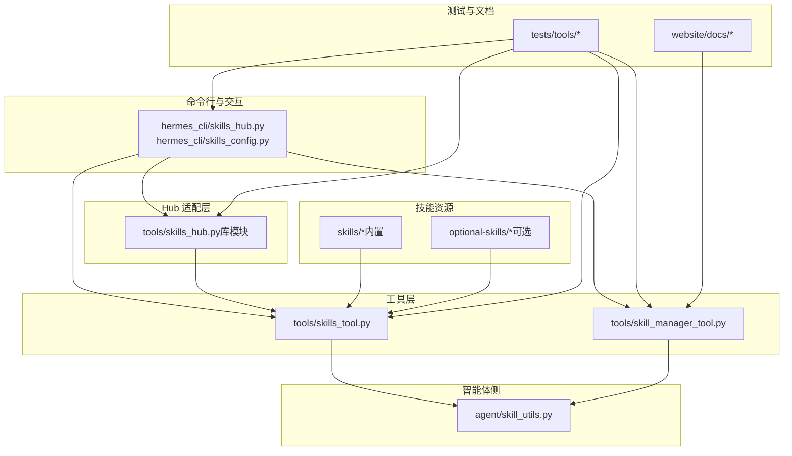
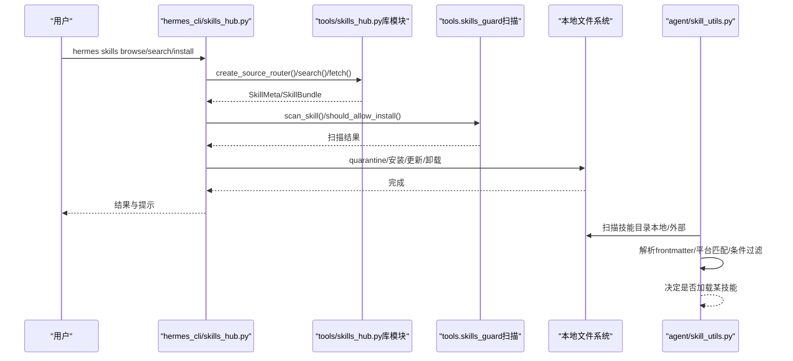
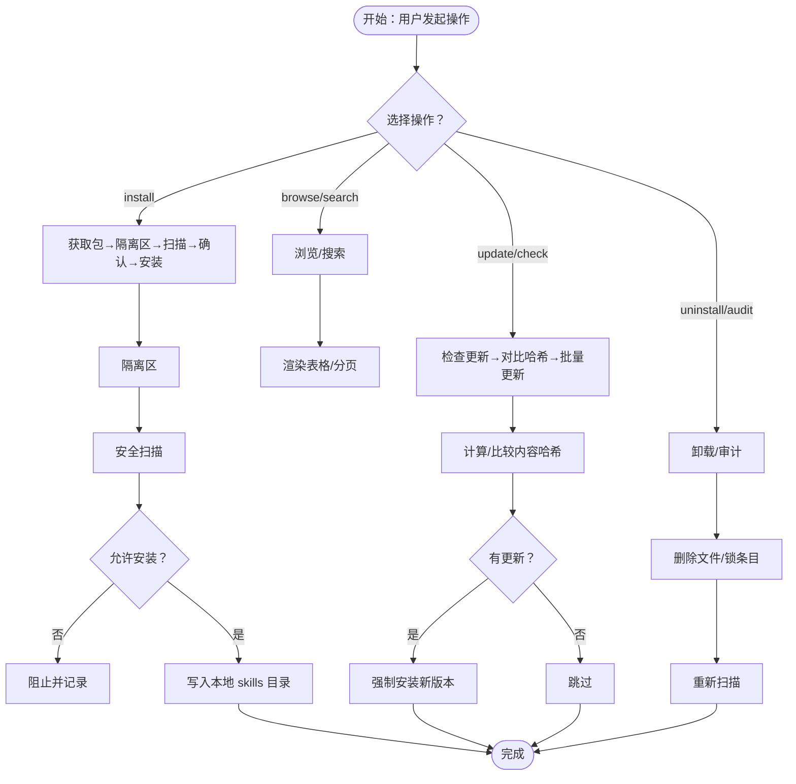
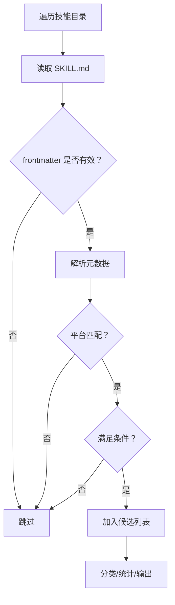
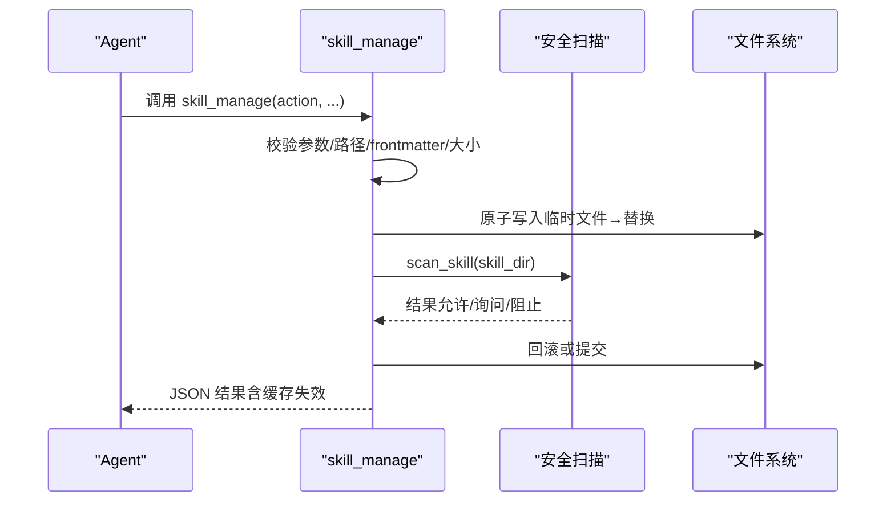
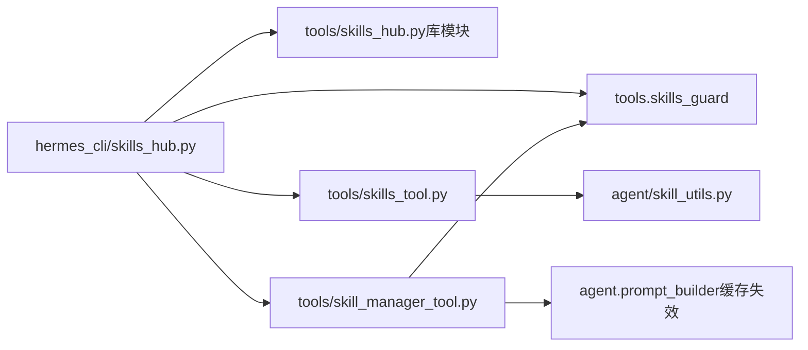

# 技能系统

<cite>
**本文引用的文件**
- [skills_hub.py](file://hermes_cli/skills_hub.py)
- [skills_config.py](file://hermes_cli/skills_config.py)
- [skills_tool.py](file://tools/skills_tool.py)
- [skill_manager_tool.py](file://tools/skill_manager_tool.py)
- [skills_hub.py（库模块）](file://tools/skills_hub.py)
- [skill_utils.py](file://agent/skill_utils.py)
- [DESCRIPTION.md（可选技能说明）](file://optional-skills/DESCRIPTION.md)
- [SKILL.md（示例技能）](file://skills/dogfood/SKILL.md)
- [SKILL.md（OpenClaw 迁移技能）](file://optional-skills/migration/openclaw-migration/SKILL.md)
- [issue-taxonomy.md](file://skills/dogfood/references/issue-taxonomy.md)
- [dogfood-report-template.md](file://skills/dogfood/templates/dogfood-report-template.md)
- [claude_marketplace_anthropics_skills.json](file://skills/index-cache/claude_marketplace_anthropics_skills.json)
- [creating-skills.md](file://website/docs/developer-guide/creating-skills.md)
- [optional-skills-catalog.md](file://website/docs/reference/optional-skills-catalog.md)
- [test_skills_tool.py](file://tests/tools/test_skills_tool.py)
- [test_skills_hub.py](file://tests/tools/test_skills_hub.py)
- [test_skill_manager_tool.py](file://tests/tools/test_skill_manager_tool.py)
</cite>

## 目录
1. [简介](#简介)
2. [项目结构](#项目结构)
3. [核心组件](#核心组件)
4. [架构总览](#架构总览)
5. [详细组件分析](#详细组件分析)
6. [依赖关系分析](#依赖关系分析)
7. [性能考虑](#性能考虑)
8. [故障排查指南](#故障排查指南)
9. [结论](#结论)
10. [附录](#附录)

## 简介
本文件系统化阐述 Hermes Agent 的技能系统：如何创建、改进、存储与共享技能；如何从经验中提取模式并优化行为策略；内置技能与可选技能的区别及使用方式；技能市场与 Hub 的工作流；技能开发指南（模板、参数设计、测试方法）；版本管理、依赖关系与兼容性处理；以及优化技巧与性能调优建议。目标是帮助开发者与用户高效地构建、维护与扩展智能体的“程序化知识”。

## 项目结构
技能系统由以下层次构成：
- 命令行与交互入口：hermes_cli 提供技能浏览、安装、卸载、配置等命令。
- Hub 适配层：tools/skills_hub 提供多源技能索引与下载能力（GitHub、Well-Known Endpoint、ClawHub 等）。
- 工具层：tools/skills_tool 提供技能发现、查看、分类与平台匹配；tools/skill_manager_tool 提供技能的增删改查与安全扫描。
- 智能体侧工具：agent/skill_utils 提供技能元数据解析、条件抽取、禁用列表与外部目录扫描。
- 可选技能与内置技能：optional-skills 收录官方可选技能；skills 收录内置技能与示例。
- 测试与文档：tests 下的单元测试覆盖关键流程；website 文档提供模板与规范。

图示来源
- [skills_hub.py:1-120](file://hermes_cli/skills_hub.py#L1-L120)
- [skills_config.py:1-189](file://hermes_cli/skills_config.py#L1-L189)
- [skills_tool.py:1-200](file://tools/skills_tool.py#L1-L200)
- [skill_manager_tool.py:1-120](file://tools/skill_manager_tool.py#L1-L120)
- [skills_hub.py（库模块）:1-120](file://tools/skills_hub.py#L1-L120)
- [skill_utils.py:1-120](file://agent/skill_utils.py#L1-L120)
- [DESCRIPTION.md（可选技能说明）:1-25](file://optional-skills/DESCRIPTION.md#L1-L25)

章节来源
- [skills_hub.py:1-120](file://hermes_cli/skills_hub.py#L1-L120)
- [skills_config.py:1-189](file://hermes_cli/skills_config.py#L1-L189)
- [skills_tool.py:1-200](file://tools/skills_tool.py#L1-L200)
- [skill_manager_tool.py:1-120](file://tools/skill_manager_tool.py#L1-L120)
- [skills_hub.py（库模块）:1-120](file://tools/skills_hub.py#L1-L120)
- [skill_utils.py:1-120](file://agent/skill_utils.py#L1-L120)
- [DESCRIPTION.md（可选技能说明）:1-25](file://optional-skills/DESCRIPTION.md#L1-L25)

## 核心组件
- 技能市场与 Hub
  - hermes_cli/skills_hub.py：提供搜索、浏览、安装、卸载、更新、审计、发布等子命令；封装富 UI 输出与缓存策略。
  - tools/skills_hub.py（库模块）：定义 SkillSource 接口、GitHubSource、WellKnownSkillSource 等适配器；提供锁文件、隔离区、索引缓存与路径校验。
- 技能发现与查看
  - tools/skills_tool.py：扫描本地与外部技能目录，解析 frontmatter，按平台与条件过滤，支持分类与内容预览。
- 技能管理（Agent 可写）
  - tools/skill_manager_tool.py：提供 skill_manage 工具，支持 create/edit/patch/delete/write_file/remove_file，并进行安全扫描与原子写入。
- 智能体侧工具
  - agent/skill_utils.py：解析 frontmatter、平台匹配、禁用列表、外部目录扫描、条件与配置变量抽取。
- 配置与启用控制
  - hermes_cli/skills_config.py：读取 config.yaml 中的 skills.disabled 与 platform_disabled，支持全局或按平台切换。
- 资源与示例
  - optional-skills/DESCRIPTION.md：说明可选技能的定位与安装方式。
  - 多个 SKILL.md 示例：如 dogfood、openclaw-migration 展示了模板结构、触发条件、步骤、注意事项与模板/参考文件组织。

章节来源
- [skills_hub.py:1-200](file://hermes_cli/skills_hub.py#L1-L200)
- [skills_tool.py:1-200](file://tools/skills_tool.py#L1-L200)
- [skill_manager_tool.py:1-200](file://tools/skill_manager_tool.py#L1-L200)
- [skill_utils.py:1-200](file://agent/skill_utils.py#L1-L200)
- [skills_config.py:1-189](file://hermes_cli/skills_config.py#L1-L189)
- [DESCRIPTION.md（可选技能说明）:1-25](file://optional-skills/DESCRIPTION.md#L1-L25)

## 架构总览
技能系统围绕“发现—选择—安装—启用—运行—反馈”的闭环展开。用户通过 CLI 或聊天命令进入 Skills Hub，浏览/搜索/预览技能；第三方可选技能经安全扫描后安装到本地；智能体在会话中根据平台、工具集、条件与禁用列表动态加载技能；Agent 在任务完成后可将成功经验转化为新的技能，形成持续改进。

图示来源
- [skills_hub.py:144-447](file://hermes_cli/skills_hub.py#L144-L447)
- [skills_hub.py（库模块）:252-404](file://tools/skills_hub.py#L252-L404)
- [skill_manager_tool.py:56-75](file://tools/skill_manager_tool.py#L56-L75)
- [skill_utils.py:173-234](file://agent/skill_utils.py#L173-L234)

章节来源
- [skills_hub.py:144-447](file://hermes_cli/skills_hub.py#L144-L447)
- [skills_hub.py（库模块）:252-404](file://tools/skills_hub.py#L252-L404)
- [skill_manager_tool.py:56-75](file://tools/skill_manager_tool.py#L56-L75)
- [skill_utils.py:173-234](file://agent/skill_utils.py#L173-L234)

## 详细组件分析

### 组件一：技能市场与 Hub（Skills Hub）
- 功能要点
  - 多源适配：GitHubSource、WellKnownSkillSource 等，统一抽象 SkillSource 接口。
  - 安全与信任：基于仓库白名单与扫描结果确定 trust_level；安装前隔离与确认。
  - 缓存与索引：索引缓存目录与 TTL 控制，减少重复网络请求。
  - 锁文件与状态：记录已安装技能来源、标识、内容哈希，支持更新检测与审计日志。
- 关键流程
  - 搜索/浏览：按源过滤、去重、排序（官方优先），分页展示。
  - 安装：下载包、隔离区扫描、用户确认、写入本地 skills 目录。
  - 更新/检查：基于内容哈希比对，支持批量更新。
  - 卸载/审计：删除文件与锁条目，重新扫描验证。
- 兼容性与安全
  - 路径规范化与防穿越校验，限制文件大小与类型。
  - 对 Hub 安装与 Agent 创建的技能采用一致的安全策略。

图示来源
- [skills_hub.py:144-447](file://hermes_cli/skills_hub.py#L144-L447)
- [skills_hub.py（库模块）:42-123](file://tools/skills_hub.py#L42-L123)
- [test_skills_hub.py:676-743](file://tests/tools/test_skills_hub.py#L676-L743)

章节来源
- [skills_hub.py:144-447](file://hermes_cli/skills_hub.py#L144-L447)
- [skills_hub.py（库模块）:42-123](file://tools/skills_hub.py#L42-L123)
- [test_skills_hub.py:676-743](file://tests/tools/test_skills_hub.py#L676-L743)

### 组件二：技能发现与查看（skills_tool 与 skill_utils）
- 发现与过滤
  - 遍历本地与外部 skills 目录，排除 .git/.github/.hub。
  - 解析 SKILL.md frontmatter，提取名称、描述、平台、条件、配置声明等。
  - 平台匹配：根据 frontmatter.platforms 与当前系统映射决定是否可用。
  - 条件过滤：requires/fallback 与工具集/工具存在性联动。
- 列表与分类
  - 支持按类别筛选与计数，返回结构化的技能清单。
- 查看与预览
  - 返回技能元信息与内容片段，便于用户决策是否安装或使用。

图示来源
- [skills_tool.py:1-200](file://tools/skills_tool.py#L1-L200)
- [skill_utils.py:52-116](file://agent/skill_utils.py#L52-L116)

章节来源
- [skills_tool.py:1-200](file://tools/skills_tool.py#L1-L200)
- [skill_utils.py:52-116](file://agent/skill_utils.py#L52-L116)

### 组件三：技能管理（Agent 可写，skill_manage）
- 支持动作
  - create：创建新技能（含可选分类），要求完整 SKILL.md（frontmatter + 正文）。
  - edit：整篇替换 SKILL.md。
  - patch：在 SKILL.md 或任意支持文件内进行模糊查找替换，支持唯一匹配或全部替换。
  - delete：删除技能目录。
  - write_file/remove_file：向技能目录写入/删除支持文件（references/templates/scripts/assets 子目录）。
- 安全与一致性
  - 原子写入（临时文件 + 替换），避免中断导致损坏。
  - 文件大小与内容长度限制，防止异常膨胀。
  - 安全扫描：Agent 创建的技能与 Hub 安装同等对待，扫描不通过则回滚。
  - 缓存失效：变更后清理技能系统提示缓存，确保新技能立即生效。
- 参数与约束
  - 名称与分类命名规则、frontmatter 必填字段与长度限制。
  - 支持文件路径仅限允许子目录，禁止路径穿越。

图示来源
- [skill_manager_tool.py:569-627](file://tools/skill_manager_tool.py#L569-L627)
- [skill_manager_tool.py:279-333](file://tools/skill_manager_tool.py#L279-L333)
- [skill_manager_tool.py:369-452](file://tools/skill_manager_tool.py#L369-L452)

章节来源
- [skill_manager_tool.py:569-627](file://tools/skill_manager_tool.py#L569-L627)
- [skill_manager_tool.py:279-333](file://tools/skill_manager_tool.py#L279-L333)
- [skill_manager_tool.py:369-452](file://tools/skill_manager_tool.py#L369-L452)

### 组件四：配置与启用控制（skills_config）
- 禁用列表
  - 支持全局 disabled 与按平台 platform_disabled（如 telegram/cli/discord 等）。
  - 优先级：平台特定列表优先于全局列表。
- 交互式配置
  - 提供 UI 选择技能或按类别切换，保存到 config.yaml。
- 与工具链集成
  - 与 skills_tool/skill_utils 协作，过滤不可用技能。

章节来源
- [skills_config.py:38-188](file://hermes_cli/skills_config.py#L38-L188)
- [skill_utils.py:121-168](file://agent/skill_utils.py#L121-L168)

### 组件五：内置技能与可选技能
- 内置技能（skills/*）
  - 由仓库自带，无需安装即可被发现与加载。
  - 示例：dogfood 技能提供系统化 Web 应用 QA 流程与报告模板。
- 可选技能（optional-skills/*）
  - 不默认激活，需通过 Skills Hub 安装到本地 skills 目录。
  - 示例：openclaw-migration 技能提供从 OpenClaw 迁移到 Hermes 的交互式流程。
- 市场与索引
  - 支持从多个源拉取索引（如 Claude Marketplace），并进行缓存与合并。

章节来源
- [DESCRIPTION.md（可选技能说明）:1-25](file://optional-skills/DESCRIPTION.md#L1-L25)
- [SKILL.md（示例技能）:1-162](file://skills/dogfood/SKILL.md#L1-L162)
- [SKILL.md（OpenClaw 迁移技能）:1-298](file://optional-skills/migration/openclaw-migration/SKILL.md#L1-L298)
- [claude_marketplace_anthropics_skills.json:1-1](file://skills/index-cache/claude_marketplace_anthropics_skills.json#L1-L1)

### 组件六：技能学习与优化（从经验到可复用知识）
- 经验沉淀
  - Agent 在复杂任务中积累成功路径与错误教训，通过 skill_manage 将 procedure 化为 SKILL.md。
  - 使用 references/templates/scripts/assets 组织辅助材料，提升可维护性。
- 模式提取与策略优化
  - 通过 issue-taxonomy 与模板化报告（如 dogfood-report-template）固化问题分类与复盘流程。
  - 在 SKILL.md 中明确触发条件、步骤、陷阱与验证点，形成可迭代的行为策略。
- 测试与验证
  - 使用 tests/tools 下的单元测试覆盖技能发现、Hub 行为与管理工具的关键路径，保证稳定性。

章节来源
- [issue-taxonomy.md:1-110](file://skills/dogfood/references/issue-taxonomy.md#L1-L110)
- [dogfood-report-template.md:1-87](file://skills/dogfood/templates/dogfood-report-template.md#L1-L87)
- [test_skills_tool.py:284-320](file://tests/tools/test_skills_tool.py#L284-L320)
- [test_skills_hub.py:676-743](file://tests/tools/test_skills_hub.py#L676-L743)
- [test_skill_manager_tool.py:190-216](file://tests/tools/test_skill_manager_tool.py#L190-L216)

## 依赖关系分析
- 组件耦合
  - hermes_cli/skills_hub.py 依赖 tools/skills_hub（库模块）与 tools.skills_guard。
  - tools/skills_tool 与 agent/skill_utils 协作，前者负责发现与查看，后者负责平台与条件过滤。
  - tools/skill_manager_tool 与 tools.skills_guard、agent.prompt_builder（缓存失效）协作。
- 外部依赖
  - HTTPX、YAML、JSON、路径与时间模块用于网络请求、元数据解析与缓存管理。
- 循环依赖规避
  - agent/skill_utils 避免导入工具注册与 CLI 配置，保持轻量与可复用。

图示来源
- [skills_hub.py:1-120](file://hermes_cli/skills_hub.py#L1-L120)
- [skills_hub.py（库模块）:1-120](file://tools/skills_hub.py#L1-L120)
- [skills_tool.py:1-120](file://tools/skills_tool.py#L1-L120)
- [skill_manager_tool.py:620-627](file://tools/skill_manager_tool.py#L620-L627)
- [skill_utils.py:1-120](file://agent/skill_utils.py#L1-L120)

章节来源
- [skills_hub.py:1-120](file://hermes_cli/skills_hub.py#L1-L120)
- [skills_hub.py（库模块）:1-120](file://tools/skills_hub.py#L1-L120)
- [skills_tool.py:1-120](file://tools/skills_tool.py#L1-L120)
- [skill_manager_tool.py:620-627](file://tools/skill_manager_tool.py#L620-L627)
- [skill_utils.py:1-120](file://agent/skill_utils.py#L1-L120)

## 性能考虑
- 索引缓存与分页
  - 使用索引缓存目录与 TTL，降低重复网络请求；浏览/搜索时分页与去重，提升响应速度。
- 原子写入与并发安全
  - 原子写入避免部分写入导致的损坏，减少回滚成本。
- 前端缓存失效
  - 修改技能后主动清理系统提示缓存，确保新技能立即生效，避免陈旧提示影响推理。
- I/O 与扫描
  - 对大型技能包进行安全扫描与内容哈希比对，建议在后台执行并提供进度提示。
- 平台与条件过滤
  - 在加载阶段尽早过滤平台不匹配与条件不满足的技能，减少后续开销。

## 故障排查指南
- 安装被阻止
  - 检查扫描报告与原因；确认路径合法性与文件大小限制；必要时调整策略或手动审核。
- 更新检测异常
  - 核对锁文件中的 content_hash 与远程包哈希是否一致；确认网络可达与缓存未过期。
- 技能未显示
  - 检查 config.yaml 中的 disabled/platform_disabled；确认 frontmatter.platforms 与当前系统匹配；确认外部目录配置正确。
- 管理工具报错
  - 检查参数完整性（如 create 需要完整 SKILL.md）；确认 file_path 合法且未越权；关注模糊匹配失败时的文件预览提示。
- 单元测试参考
  - 使用 tests/tools 下的测试用例作为行为对照，快速定位问题范围。

章节来源
- [skills_hub.py:367-383](file://hermes_cli/skills_hub.py#L367-L383)
- [test_skills_hub.py:676-743](file://tests/tools/test_skills_hub.py#L676-L743)
- [skills_config.py:38-188](file://hermes_cli/skills_config.py#L38-L188)
- [skill_manager_tool.py:569-627](file://tools/skill_manager_tool.py#L569-L627)
- [test_skills_tool.py:284-320](file://tests/tools/test_skills_tool.py#L284-L320)

## 结论
Hermes Agent 的技能系统通过“Hub + 工具 + 智能体侧工具 + 配置”的协同，实现了从发现、安装、启用到持续改进的完整闭环。内置与可选技能并存，既保证默认体验的简洁，又提供丰富的扩展空间。借助标准化模板、严格的参数与安全策略、完善的测试与缓存机制，系统在易用性、安全性与可维护性之间取得良好平衡。

## 附录

### 技能开发指南
- 模板与格式
  - 使用标准 frontmatter（name/description/version/author/license 等），并在 metadata.hermes 中声明标签、相关技能、工具集/工具依赖、配置项等。
  - 在 references/templates/scripts/assets 中组织辅助材料，保持 SKILL.md 主体清晰。
- 参数设计
  - 使用 metadata.hermes.config 声明逻辑键、默认值与提示；在运行时通过 agent/skill_utils 解析并展开路径。
  - 使用 platforms 字段限定平台；使用 requires/fallback 与工具集/工具联动控制可见性。
- 测试方法
  - 参考 tests/tools 下的测试用例，覆盖发现、浏览、安装、管理等关键路径。
  - 对 Hub 行为进行断言（如更新检测、扫描结果、锁文件条目）。
- 版本管理与兼容性
  - 通过 SKILL.md frontmatter.version 与内容哈希（content_hash）实现版本追踪与兼容性判断。
  - 对外部依赖（如特定工具集/工具）进行条件声明，避免在不满足环境下的加载。

章节来源
- [creating-skills.md:44-94](file://website/docs/developer-guide/creating-skills.md#L44-L94)
- [optional-skills-catalog.md:146-154](file://website/docs/reference/optional-skills-catalog.md#L146-L154)
- [skill_utils.py:240-316](file://agent/skill_utils.py#L240-L316)
- [test_skills_tool.py:1-200](file://tests/tools/test_skills_tool.py#L1-L200)
- [test_skills_hub.py:676-743](file://tests/tools/test_skills_hub.py#L676-L743)