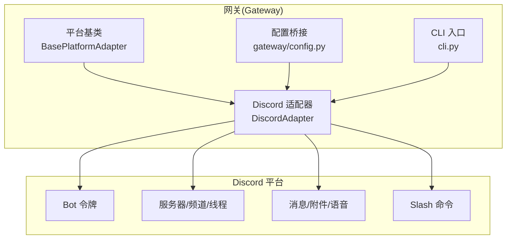
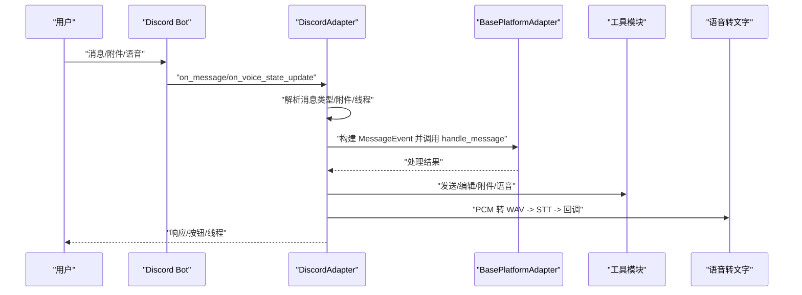
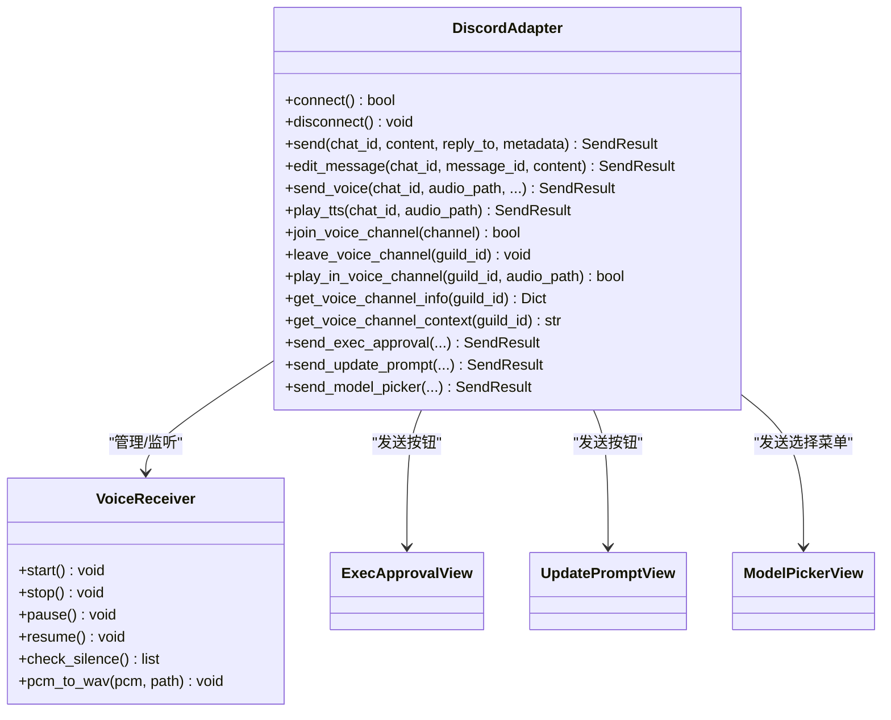
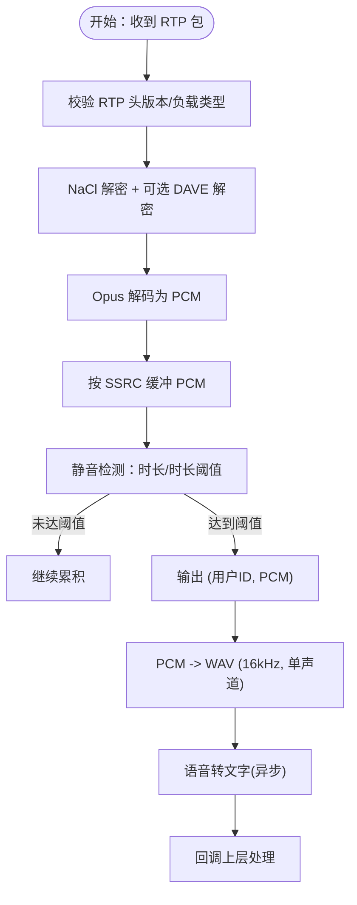
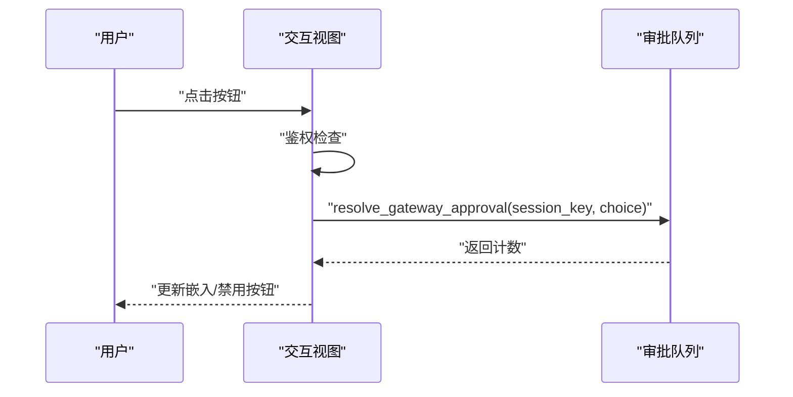
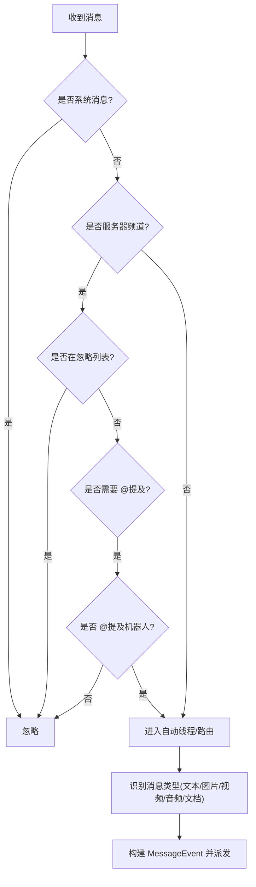
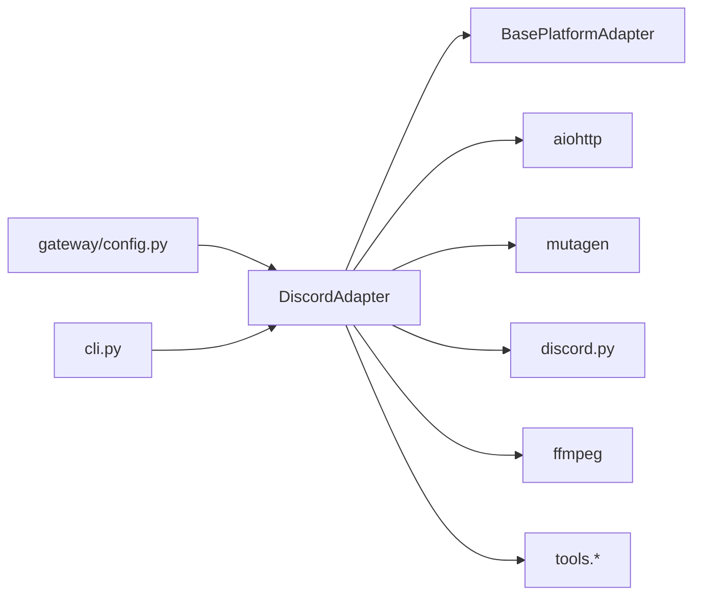

# Discord 平台

<cite>
**本文档引用的文件**
- [discord.py](file://gateway/platforms/discord.py)
- [test_discord_connect.py](file://tests/gateway/test_discord_connect.py)
- [test_discord_channel_controls.py](file://tests/gateway/test_discord_channel_controls.py)
- [test_discord_opus.py](file://tests/gateway/test_discord_opus.py)
- [config.py](file://gateway/config.py)
- [cli.py](file://cli.py)
</cite>

## 目录
1. [简介](#简介)
2. [项目结构](#项目结构)
3. [核心组件](#核心组件)
4. [架构总览](#架构总览)
5. [详细组件分析](#详细组件分析)
6. [依赖关系分析](#依赖关系分析)
7. [性能考虑](#性能考虑)
8. [故障排除指南](#故障排除指南)
9. [结论](#结论)
10. [附录](#附录)

## 简介
本文件面向为 Hermes Agent 构建 Discord 平台适配器的开发者与运维人员，系统性阐述以下主题：
- Discord 应用创建与配置：Bot 令牌获取、服务器权限与频道权限设置要点
- 消息处理机制：文本消息、嵌入消息、附件（图片/视频/文档）、语音消息的处理流程
- 会话管理：服务器上下文、用户角色权限、频道分类与线程持久化
- API 使用限制、速率限制与最佳实践
- 语音通道集成：实时音频采集、解密、静音检测、语音转文字（STT）
- 安全措施与反垃圾邮件策略：按钮式执行审批、白名单授权、环境变量控制

## 项目结构
Discord 平台适配器位于 gateway 子系统中，采用“平台适配器 + 基类 + 工具”的分层设计：
- 平台适配器：gateway/platforms/discord.py
- 基类与通用工具：gateway/platforms/base.py
- 配置桥接：gateway/config.py
- CLI 入口与令牌注入：cli.py
- 测试覆盖：tests/gateway 下的多类测试

图表来源
- [discord.py:409-458](file://gateway/platforms/discord.py#L409-L458)
- [config.py:547-569](file://gateway/config.py#L547-L569)
- [cli.py:4270-4304](file://cli.py#L4270-L4304)

章节来源
- [discord.py:1-120](file://gateway/platforms/discord.py#L1-L120)
- [config.py:547-569](file://gateway/config.py#L547-L569)
- [cli.py:4270-4304](file://cli.py#L4270-L4304)

## 核心组件
- DiscordAdapter：Discord 平台适配器，负责连接、事件接收、消息发送、线程管理、语音通道集成、交互式 UI 组件等
- VoiceReceiver：语音接收器，负责 RTP 包解密、Opus 解码、静音检测与 PCM 缓冲
- 交互式视图：ExecApprovalView（危险命令审批）、UpdatePromptView（更新确认）、ModelPickerView（模型选择）

关键职责与特性
- 连接与鉴权：基于 Bot 令牌与作用域锁，避免重复启动；按需请求 Intents（消息内容、成员列表、语音状态）
- 消息处理：识别文本、图片、视频、音频、文档；自动线程化；忽略系统消息；支持回复引用
- 发送能力：文本、图片、视频、文档、语音消息（原生语音消息标志回退到文件）、TTS 播放
- 语音通道：加入/离开、播放音频、静默保活、监听用户语音输入并进行 STT
- 交互式 UI：按钮式审批、更新提示、模型选择菜单
- 会话与上下文：线程参与持久化、语音通道状态注入到系统提示

章节来源
- [discord.py:409-458](file://gateway/platforms/discord.py#L409-L458)
- [discord.py:83-160](file://gateway/platforms/discord.py#L83-L160)
- [discord.py:2439-2828](file://gateway/platforms/discord.py#L2439-L2828)

## 架构总览
下图展示 Discord 适配器在系统中的位置与交互关系。

图表来源
- [discord.py:552-610](file://gateway/platforms/discord.py#L552-L610)
- [discord.py:2190-2433](file://gateway/platforms/discord.py#L2190-L2433)
- [discord.py:1218-1253](file://gateway/platforms/discord.py#L1218-L1253)

## 详细组件分析

### 组件一：DiscordAdapter（平台适配器）
- 角色定位：继承自 BasePlatformAdapter，实现 Discord 特定的消息收发、线程管理、语音通道、交互式 UI
- 关键字段与状态
  - 连接状态、意图配置、允许用户集合
  - 语音客户端、语音接收器、监听任务、超时任务
  - 线程参与持久化集合、去重缓存（RESUME 事件去重）
- 事件处理
  - on_ready：同步 Slash 命令、解析允许用户名
  - on_message：消息过滤、@提及规则、自动线程、媒体缓存、构建 MessageEvent
  - on_voice_state_update：记录加入/离开/切换语音频道
- 发送与编辑
  - send：按最大长度拆分、支持回复引用
  - edit_message：编辑已有消息
  - send_voice：优先原生语音消息标志，失败回退为文件
  - play_tts：在语音频道内播放 TTS
- 语音通道
  - join/leave：加入/离开语音频道
  - play_in_voice_channel：播放音频（等待前序播放完成、超时保护）
  - 语音监听循环：UDP 保活、静音检测、PCM -> WAV -> STT -> 回调
- 交互式 UI
  - ExecApprovalView：危险命令审批（一次/会话/永久/拒绝）
  - UpdatePromptView：更新确认（是/否）
  - ModelPickerView：两步模型选择（提供商 -> 模型）

图表来源
- [discord.py:409-458](file://gateway/platforms/discord.py#L409-L458)
- [discord.py:83-160](file://gateway/platforms/discord.py#L83-L160)
- [discord.py:2441-2828](file://gateway/platforms/discord.py#L2441-L2828)

章节来源
- [discord.py:409-458](file://gateway/platforms/discord.py#L409-L458)
- [discord.py:459-676](file://gateway/platforms/discord.py#L459-L676)
- [discord.py:750-820](file://gateway/platforms/discord.py#L750-L820)
- [discord.py:885-959](file://gateway/platforms/discord.py#L885-L959)
- [discord.py:964-1107](file://gateway/platforms/discord.py#L964-L1107)
- [discord.py:1186-1253](file://gateway/platforms/discord.py#L1186-L1253)
- [discord.py:2441-2828](file://gateway/platforms/discord.py#L2441-L2828)

### 组件二：VoiceReceiver（语音接收与处理）
- 功能概述：从 Discord 语音连接捕获 RTP 包，解密（NaCl + DAVE E2EE），解码 Opus，按用户缓冲 PCM，静音检测后输出完整语音片段
- 关键流程
  - 安装 SPEAKING 事件钩子以建立 SSRC -> 用户映射
  - RTP 头解析、扩展头处理、nonce 提取
  - NaCl AEAD 解密、可选 DAVE E2EE 解密
  - Opus 解码为 PCM，按 SSRC 缓冲
  - 静音检测：超过阈值且持续时间足够则判定为完整语音片段
  - PCM 转 WAV（采样率转换）供 STT 使用

图表来源
- [discord.py:205-312](file://gateway/platforms/discord.py#L205-L312)
- [discord.py:343-374](file://gateway/platforms/discord.py#L343-L374)
- [discord.py:380-407](file://gateway/platforms/discord.py#L380-L407)
- [discord.py:1218-1253](file://gateway/platforms/discord.py#L1218-L1253)

章节来源
- [discord.py:83-160](file://gateway/platforms/discord.py#L83-L160)
- [discord.py:205-312](file://gateway/platforms/discord.py#L205-L312)
- [discord.py:343-407](file://gateway/platforms/discord.py#L343-L407)
- [discord.py:1218-1253](file://gateway/platforms/discord.py#L1218-L1253)

### 组件三：交互式 UI（按钮/选择菜单）
- ExecApprovalView：危险命令审批，支持一次性/会话/永久/拒绝四种选择，超时自动禁用
- UpdatePromptView：更新提示（是/否），写入响应文件供后台进程读取
- ModelPickerView：两步模型选择（提供商 -> 模型），支持返回与取消

图表来源
- [discord.py:2441-2534](file://gateway/platforms/discord.py#L2441-L2534)
- [discord.py:2535-2613](file://gateway/platforms/discord.py#L2535-L2613)
- [discord.py:2614-2828](file://gateway/platforms/discord.py#L2614-L2828)

章节来源
- [discord.py:2441-2534](file://gateway/platforms/discord.py#L2441-L2534)
- [discord.py:2535-2613](file://gateway/platforms/discord.py#L2535-L2613)
- [discord.py:2614-2828](file://gateway/platforms/discord.py#L2614-L2828)

### 组件四：消息处理与线程管理
- 消息过滤与路由
  - 忽略系统消息（如加入/离开/主题变更）
  - 服务器频道默认要求 @提及，可通过环境变量或配置调整
  - 自动线程：在被 @提及的文本频道中自动创建线程，隔离对话
  - 线程参与持久化：跨重启保留，避免后续消息仍需 @提及
- 附件处理
  - 图片/音频/文档分别缓存至本地，便于视觉/语音/文档工具访问
  - 文档支持注入文本内容（.md/.txt，限制大小）
- Slash 命令注册：内置命令与技能命令动态注册

图表来源
- [discord.py:552-610](file://gateway/platforms/discord.py#L552-L610)
- [discord.py:2190-2433](file://gateway/platforms/discord.py#L2190-L2433)

章节来源
- [discord.py:552-610](file://gateway/platforms/discord.py#L552-L610)
- [discord.py:2190-2433](file://gateway/platforms/discord.py#L2190-L2433)

## 依赖关系分析
- 外部库依赖：discord.py（commands、discord.opus）、aiohttp、mutagen、nacl、davey、ffmpeg
- 内部依赖：BasePlatformAdapter（消息格式化、媒体缓存）、tools.*（审批、转录、TTS）
- 配置桥接：gateway/config.py 将配置项映射到环境变量，便于运行时控制

图表来源
- [discord.py:29-58](file://gateway/platforms/discord.py#L29-L58)
- [config.py:547-569](file://gateway/config.py#L547-L569)
- [cli.py:4270-4304](file://cli.py#L4270-L4304)

章节来源
- [discord.py:29-58](file://gateway/platforms/discord.py#L29-L58)
- [config.py:547-569](file://gateway/config.py#L547-L569)
- [cli.py:4270-4304](file://cli.py#L4270-L4304)

## 性能考虑
- 消息拆分与去重：按最大长度拆分文本；对 RESUME 事件进行去重缓存，避免重复响应
- 语音处理：异步解码与 STT；静音阈值与最小语音时长防止噪声误触发
- 语音通道：播放前等待前序播放结束，超时保护；UDP 保活降低路由断开风险
- 附件处理：大文件与不支持类型跳过；文档注入文本内容有大小限制
- 线程持久化：限制跟踪上限，避免无限增长导致性能问题

章节来源
- [discord.py:423-458](file://gateway/platforms/discord.py#L423-L458)
- [discord.py:1186-1217](file://gateway/platforms/discord.py#L1186-L1217)
- [discord.py:2362-2399](file://gateway/platforms/discord.py#L2362-L2399)

## 故障排除指南
常见问题与排查建议
- 连接失败/超时
  - 检查 Bot 令牌是否正确；确保未被其他实例占用（作用域锁）
  - 确认 Intents 配置（消息内容、成员列表、语音状态）是否满足需求
- 无法发送语音消息
  - 若原生语音消息标志失败，自动回退为文件发送
  - 检查 ffmpeg 是否可用与音频时长/波形参数
- 语音无法播放或卡顿
  - 确认已加载 Opus；检查 Homebrew 路径与平台判断逻辑
  - 播放前等待前序播放完成，避免并发冲突
- 语音输入无响应
  - 检查 SPEAKING 事件钩子安装；确认 SSRC 映射与静音阈值
  - 确认 STT 模型可用与 Hallucination 过滤
- 权限与安全
  - 使用 DISCORD_ALLOWED_USERS 控制可操作用户
  - 通过按钮式审批与环境变量控制（忽略无提及、自由响应、忽略频道、禁止线程频道）

章节来源
- [discord.py:459-676](file://gateway/platforms/discord.py#L459-L676)
- [discord.py:466-488](file://gateway/platforms/discord.py#L466-L488)
- [discord.py:1018-1060](file://gateway/platforms/discord.py#L1018-L1060)
- [discord.py:1218-1253](file://gateway/platforms/discord.py#L1218-L1253)
- [test_discord_opus.py:6-45](file://tests/gateway/test_discord_opus.py#L6-L45)

## 结论
Discord 平台适配器在保证与 Discord 生态兼容的同时，提供了完善的会话管理、交互式 UI、语音通道集成与安全控制。通过合理的配置与最佳实践，可在复杂服务器环境中稳定运行，并为用户提供自然的多模态交互体验。

## 附录

### A. Discord 应用创建与配置（概要）
- 创建应用与 Bot
  - 在 Discord 开发者门户创建应用，启用 Bot 权限
  - 获取 Bot 令牌并注入到运行环境（HERMES 或配置文件）
- 服务器权限与频道权限
  - 服务器权限：消息发送、线程管理、语音连接、成员可见（仅当允许列表包含用户名时才需要）
  - 频道权限：文本频道需具备消息发送、附加文件、阅读历史；语音频道需具备连接、说话
- 令牌与作用域
  - 使用作用域锁避免同一令牌被多个实例同时使用
  - 按需请求 Intents，避免因未启用特权 Intent 导致无法上线

章节来源
- [cli.py:4270-4304](file://cli.py#L4270-L4304)
- [discord.py:490-527](file://gateway/platforms/discord.py#L490-L527)
- [discord.py:541-550](file://gateway/platforms/discord.py#L541-L550)

### B. 消息处理机制（文本/嵌入/附件/语音）
- 文本消息：按最大长度拆分，支持回复引用
- 嵌入消息：用于交互式 UI（按钮/选择菜单/嵌入描述）
- 附件上传：图片/视频/文档本地缓存；语音消息优先原生语音消息标志
- 语音消息：RTP 解密 -> Opus 解码 -> 静音检测 -> WAV -> STT

章节来源
- [discord.py:750-820](file://gateway/platforms/discord.py#L750-L820)
- [discord.py:844-866](file://gateway/platforms/discord.py#L844-L866)
- [discord.py:885-959](file://gateway/platforms/discord.py#L885-L959)
- [discord.py:2314-2405](file://gateway/platforms/discord.py#L2314-L2405)
- [discord.py:1218-1253](file://gateway/platforms/discord.py#L1218-L1253)

### C. 会话管理（服务器上下文/用户权限/频道分类）
- 服务器上下文：语音通道信息（成员、发言状态）注入系统提示
- 用户权限：DISCORD_ALLOWED_USERS 白名单；按钮式审批鉴权
- 频道分类：忽略频道、禁止线程频道、自由响应频道；线程参与持久化

章节来源
- [discord.py:1109-1177](file://gateway/platforms/discord.py#L1109-L1177)
- [discord.py:1254-1258](file://gateway/platforms/discord.py#L1254-L1258)
- [discord.py:2190-2433](file://gateway/platforms/discord.py#L2190-L2433)
- [test_discord_channel_controls.py:105-200](file://tests/gateway/test_discord_channel_controls.py#L105-L200)

### D. API 使用限制、速率限制与最佳实践
- 速率限制：遵循 Discord API 速率限制，避免频繁创建线程或发送消息
- 最佳实践：合理拆分消息、缓存附件、异步 STT、保持语音通道保活、限制线程跟踪数量

章节来源
- [discord.py:423-458](file://gateway/platforms/discord.py#L423-L458)
- [discord.py:1186-1217](file://gateway/platforms/discord.py#L1186-L1217)
- [discord.py:2151-2189](file://gateway/platforms/discord.py#L2151-L2189)

### E. 语音通道集成与实时音频处理
- 加入/离开：根据用户语音状态自动加入/离开语音频道
- 播放：等待前序播放完成，超时保护；播放期间暂停语音接收以避免回音
- 实时处理：UDP 保活、静音检测、PCM -> WAV -> STT -> 回调

章节来源
- [discord.py:964-1107](file://gateway/platforms/discord.py#L964-L1107)
- [discord.py:1186-1253](file://gateway/platforms/discord.py#L1186-L1253)
- [test_discord_opus.py:6-45](file://tests/gateway/test_discord_opus.py#L6-L45)

### F. 安全措施与反垃圾邮件策略
- 白名单授权：DISCORD_ALLOWED_USERS 控制可操作用户
- 按钮式审批：危险命令需经交互式按钮确认
- 环境变量控制：忽略无提及、自由响应、忽略频道、禁止线程频道
- 附件安全：URL 安全检查、大小限制、类型过滤

章节来源
- [discord.py:507-513](file://gateway/platforms/discord.py#L507-L513)
- [discord.py:576-592](file://gateway/platforms/discord.py#L576-L592)
- [discord.py:1971-2015](file://gateway/platforms/discord.py#L1971-L2015)
- [discord.py:2314-2405](file://gateway/platforms/discord.py#L2314-L2405)
- [test_discord_connect.py:86-111](file://tests/gateway/test_discord_connect.py#L86-L111)