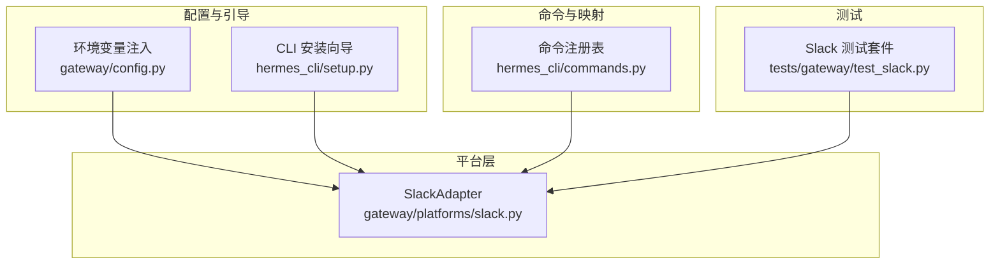
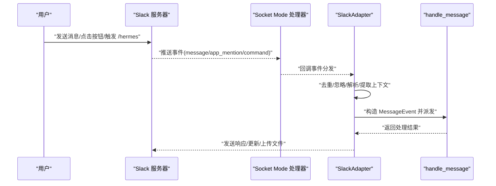
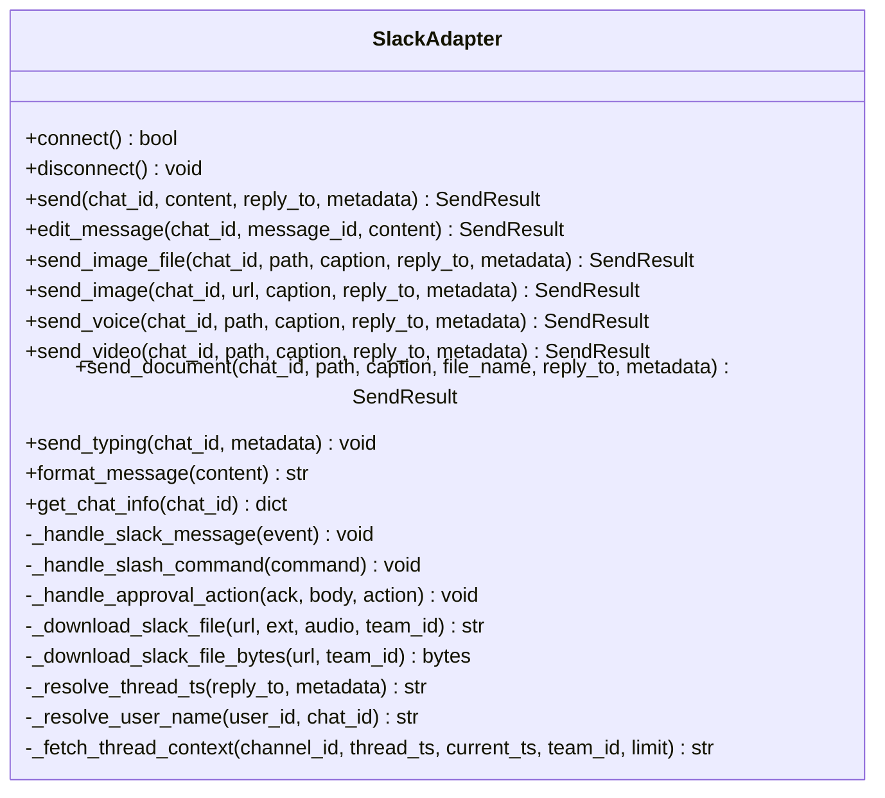
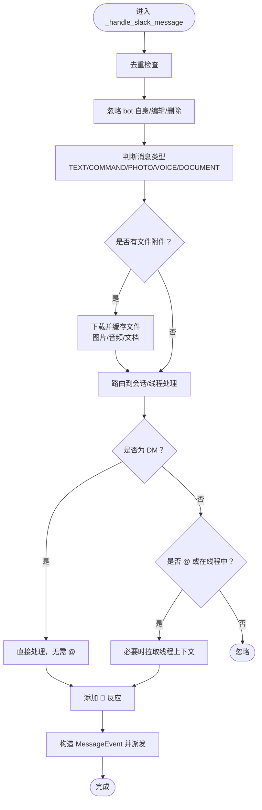
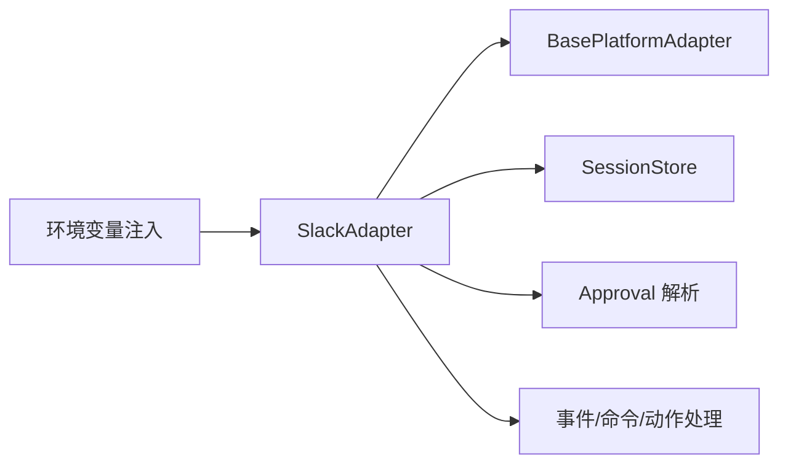
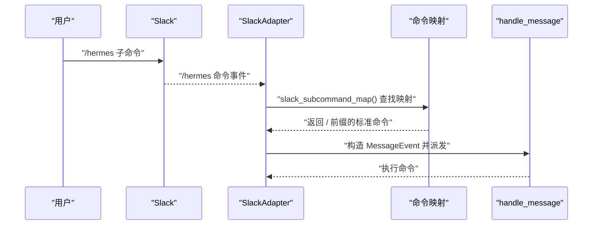

# Slack 平台

<cite>
**本文引用的文件**
- [gateway/platforms/slack.py](file://gateway/platforms/slack.py)
- [hermes_cli/setup.py](file://hermes_cli/setup.py)
- [tests/gateway/test_slack.py](file://tests/gateway/test_slack.py)
- [gateway/config.py](file://gateway/config.py)
- [hermes_cli/commands.py](file://hermes_cli/commands.py)
</cite>

## 目录
1. [简介](#简介)
2. [项目结构](#项目结构)
3. [核心组件](#核心组件)
4. [架构总览](#架构总览)
5. [详细组件分析](#详细组件分析)
6. [依赖关系分析](#依赖关系分析)
7. [性能考量](#性能考量)
8. [故障排查指南](#故障排查指南)
9. [结论](#结论)
10. [附录](#附录)

## 简介
本文件面向在 Hermes Agent 中集成 Slack 平台的开发者与运维人员，系统性说明如何创建与配置 Slack 应用、建立 Socket Mode 连接、处理消息与交互（含实时消息、块元素、交互式组件、文件分享）、多工作区支持、线程会话与上下文、以及与平台命令系统的对接。文档同时给出关键流程图与时序图，帮助快速理解从事件到响应的完整链路。

## 项目结构
Slack 平台适配器位于网关平台层，采用异步 SDK 与 Socket Mode 接收事件；CLI 提供安装与配置向导；测试覆盖关键行为与边界条件；配置模块负责环境变量注入与默认值。

图表来源
- [gateway/platforms/slack.py](file://gateway/platforms/slack.py)
- [gateway/config.py](file://gateway/config.py)
- [hermes_cli/setup.py](file://hermes_cli/setup.py)
- [hermes_cli/commands.py](file://hermes_cli/commands.py)
- [tests/gateway/test_slack.py](file://tests/gateway/test_slack.py)

章节来源
- [gateway/platforms/slack.py](file://gateway/platforms/slack.py)
- [gateway/config.py](file://gateway/config.py)
- [hermes_cli/setup.py](file://hermes_cli/setup.py)
- [hermes_cli/commands.py](file://hermes_cli/commands.py)
- [tests/gateway/test_slack.py](file://tests/gateway/test_slack.py)

## 核心组件
- SlackAdapter：基于 slack-bolt 的异步适配器，使用 Socket Mode 接收事件、处理消息与交互、发送文本/媒体/文件、管理线程与会话。
- 配置加载：自动从环境变量读取 SLACK_BOT_TOKEN、SLACK_APP_TOKEN、SLACK_HOME_CHANNEL 等并注入平台配置。
- CLI 向导：提供 Slack 应用创建步骤、Scope 与事件订阅清单、安装与邀请指引。
- 命令映射：将通用命令注册表映射为 Slack 子命令，支持别名与配置门控。

章节来源
- [gateway/platforms/slack.py](file://gateway/platforms/slack.py)
- [gateway/config.py](file://gateway/config.py)
- [hermes_cli/setup.py](file://hermes_cli/setup.py)
- [hermes_cli/commands.py](file://hermes_cli/commands.py)

## 架构总览
Slack 平台适配器通过 Socket Mode 与 Slack 服务器保持长连接，接收 message、app_mention、slash command 等事件；内部进行去重、忽略、上下文提取与类型判定；随后将标准化后的消息事件交给上层处理管线。

图表来源
- [gateway/platforms/slack.py](file://gateway/platforms/slack.py)

章节来源
- [gateway/platforms/slack.py](file://gateway/platforms/slack.py)

## 详细组件分析

### SlackAdapter 类与连接生命周期
- 支持多工作区：通过逗号分隔的多个 Bot Token，或从本地 JSON 文件加载 OAuth Token，按 team_id 维护 WebClient。
- Socket Mode：使用 AsyncApp 与 AsyncSocketModeHandler，确保连接唯一性（应用级 Token 锁）。
- 事件注册：message、app_mention（仅 ack）、/hermes slash 命令、Block Kit 按钮动作。
- 发送能力：文本拆分、线程回复、广播回复、编辑、打字状态（assistant.threads.setStatus）。
- 文件与媒体：图片/音频/视频/文档上传，私有链接下载缓存，大小限制与类型白名单。

图表来源
- [gateway/platforms/slack.py](file://gateway/platforms/slack.py)

章节来源
- [gateway/platforms/slack.py](file://gateway/platforms/slack.py)

### 消息处理机制（实时消息、块元素、交互式组件、文件分享）
- 实时消息：Socket Mode 接收 message 与 app_mention；在频道中需 @ 机器人或参与线程/会话才处理；DM 不需要 @。
- 去重与忽略：对重复事件、bot 自身消息、消息变更/删除进行去重与忽略。
- 上下文与线程：首次在频道线程中被 @ 时，拉取历史上下文；记录“被 @ 过的线程”以允许后续回复无需再次 @。
- 块元素与交互式组件：Block Kit 按钮（批准/拒绝）通过 action_id 分发，更新消息并调用审批解析接口。
- 文件分享：图片/音频/视频/文档分别走不同路径；私有链接需带 Bot Token 认证下载；超过 20MB 的文档跳过；.txt/.md 注入内容上限 100KB。

图表来源
- [gateway/platforms/slack.py](file://gateway/platforms/slack.py)

章节来源
- [gateway/platforms/slack.py](file://gateway/platforms/slack.py)
- [tests/gateway/test_slack.py](file://tests/gateway/test_slack.py)

### Slack 工作区集成（团队上下文、用户组与频道管理）
- 多工作区：每个 Bot Token 对应一个 team_id，维护 team_clients 与 team_bot_user_ids；频道归属通过 channel_team 映射。
- 用户名解析：users.info 缓存显示名/真实名，失败回退。
- 频道信息：conversations_info 获取频道名称与类型（DM/group）。

章节来源
- [gateway/platforms/slack.py](file://gateway/platforms/slack.py)

### Slack Events API 使用（Socket Mode）
- Socket Mode：启用后需要应用级 Token（connections:write），Bot Token 负责 API 调用。
- 事件订阅：至少开启 message.im、message.channels、app_mention；私有频道可选 message.groups。
- URL 验证：Socket Mode 不涉及 URL 验证（与 Events API 的 HTTP 回调不同）。

章节来源
- [hermes_cli/setup.py](file://hermes_cli/setup.py)
- [gateway/platforms/slack.py](file://gateway/platforms/slack.py)

### Slack 特定功能特性（快捷方式、模态窗口、消息菜单）
- 快捷方式：/hermes 子命令映射来自命令注册表，支持别名与配置门控；compact 映射为 /compress。
- 模态窗口：当前未发现针对 Slack 的模态窗口实现；适配器主要通过 Block Kit 动作与按钮进行交互。
- 消息菜单：未发现专用的消息菜单实现；可通过 Block Kit actions 与选择器实现类似能力。

章节来源
- [hermes_cli/commands.py](file://hermes_cli/commands.py)
- [gateway/platforms/slack.py](file://gateway/platforms/slack.py)
- [tests/gateway/test_slack.py](file://tests/gateway/test_slack.py)

### 平台命令与子命令映射
- 命令注册表统一定义所有命令、别名、参数提示与类别；Slack 子命令映射由 slack_subcommand_map() 生成，过滤掉仅 CLI 可用且无配置门控的命令。
- /hermes 子命令：compact → /compress；resume/background/usage/reasoning 等映射均来自注册表。

章节来源
- [hermes_cli/commands.py](file://hermes_cli/commands.py)
- [tests/gateway/test_slack.py](file://tests/gateway/test_slack.py)
- [gateway/platforms/slack.py](file://gateway/platforms/slack.py)

## 依赖关系分析
- 外部依赖：slack-bolt（AsyncApp、AsyncSocketModeHandler）、slack_sdk（AsyncWebClient）。
- 内部依赖：BasePlatformAdapter（消息格式化、分片、会话键构建）、SessionStore（线程会话判定）、Approval 解析（按钮动作）。
- 配置依赖：环境变量注入（SLACK_BOT_TOKEN、SLACK_APP_TOKEN、SLACK_HOME_CHANNEL 等）。

图表来源
- [gateway/platforms/slack.py](file://gateway/platforms/slack.py)
- [gateway/config.py](file://gateway/config.py)

章节来源
- [gateway/platforms/slack.py](file://gateway/platforms/slack.py)
- [gateway/config.py](file://gateway/config.py)

## 性能考量
- 消息拆分：超过最大长度（约 40k 字符）自动拆分为多段发送，保留代码块边界。
- 线程上下文：首次进入线程时拉取最近若干条消息，避免每次重复请求。
- 缓存与去重：事件时间戳去重、用户名缓存、线程集合容量控制，防止内存膨胀。
- 文件下载：带重试与超时控制，音频/图片分别缓存至专用目录。

章节来源
- [gateway/platforms/slack.py](file://gateway/platforms/slack.py)

## 故障排查指南
- 无法连接 Slack
  - 检查 SLACK_BOT_TOKEN 与 SLACK_APP_TOKEN 是否正确设置；确认应用级 Token 具备 connections:write 权限。
  - 若出现“应用级 Token 已被占用”，先停止其他实例再启动。
- 事件不触发
  - 确认已启用 Socket Mode 并安装应用到工作区；事件订阅至少包含 message.im、message.channels、app_mention。
  - 频道消息需 @ 机器人或在线程中才会处理；DM 不需要 @。
- 文件上传失败
  - 私有链接需 Bot Token 认证；检查网络与超时；超过 20MB 的文档会被跳过。
  - 失败时会降级为纯文本发送，确保线程上下文仍保留。
- 打字状态无效
  - 需要 assistant:write 或 chat:write 权限；无权限时静默忽略，后续通过反应替代。
- 按钮动作无响应
  - 确认 Block Kit 按钮的 action_id 与监听一致；检查审批解析接口是否被调用。

章节来源
- [gateway/platforms/slack.py](file://gateway/platforms/slack.py)
- [hermes_cli/setup.py](file://hermes_cli/setup.py)
- [tests/gateway/test_slack.py](file://tests/gateway/test_slack.py)

## 结论
Slack 平台适配器提供了完整的 Socket Mode 事件处理、多工作区支持、线程上下文与会话管理、丰富的媒体与文件处理能力，以及与命令系统的无缝映射。遵循本文的配置与最佳实践，可稳定地在多工作区环境中运行，并通过交互式组件提升用户体验。

## 附录

### Slack 应用创建与 OAuth 配置清单
- 创建应用：从零开始创建应用，启用 Socket Mode，创建应用级 Token（connections:write）。
- Bot Token Scopes（至少）：chat:write、app_mentions:read、channels:history、channels:read、im:history、im:read、im:write、users:read、files:write；私有频道可选 groups:history。
- 事件订阅（至少）：message.im、message.channels、app_mention；私有频道可选 message.groups。
- 安装到工作区并邀请机器人加入频道。
- CLI 向导会提示完整步骤与安全建议。

章节来源
- [hermes_cli/setup.py](file://hermes_cli/setup.py)

### 关键流程：/hermes 子命令到命令执行

图表来源
- [gateway/platforms/slack.py](file://gateway/platforms/slack.py)
- [hermes_cli/commands.py](file://hermes_cli/commands.py)