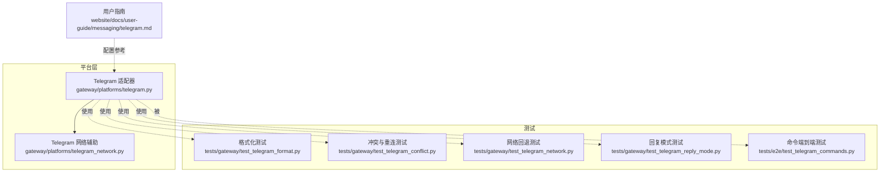
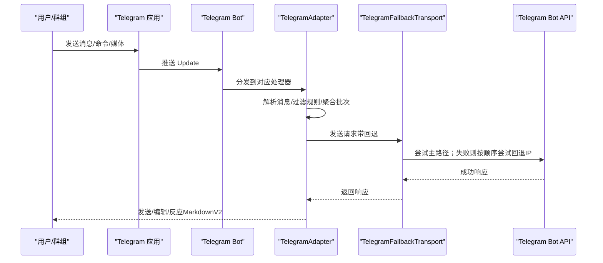
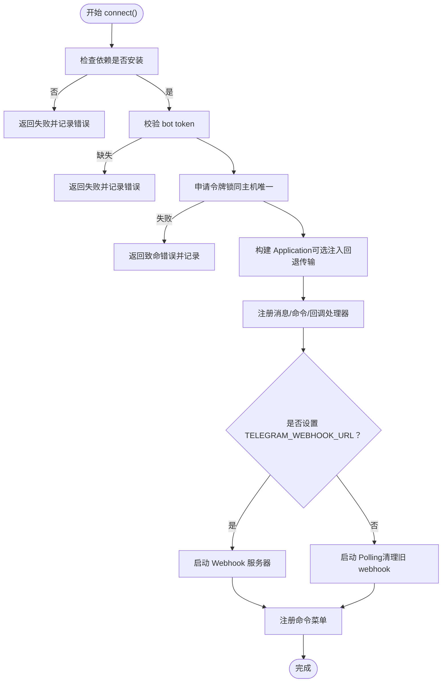
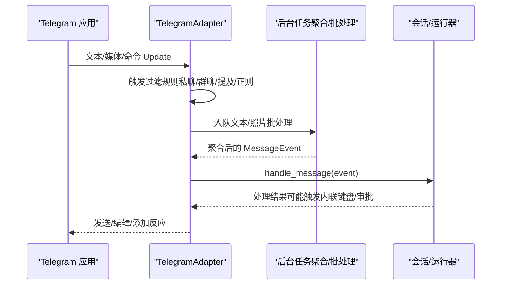
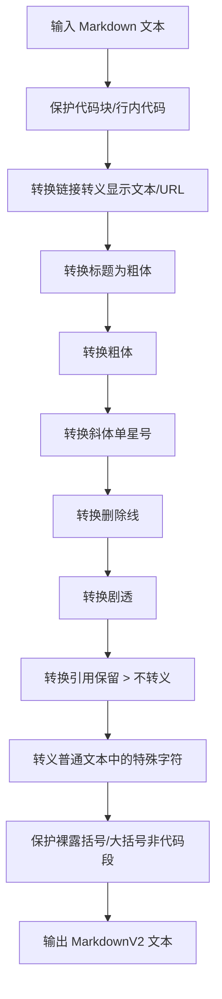
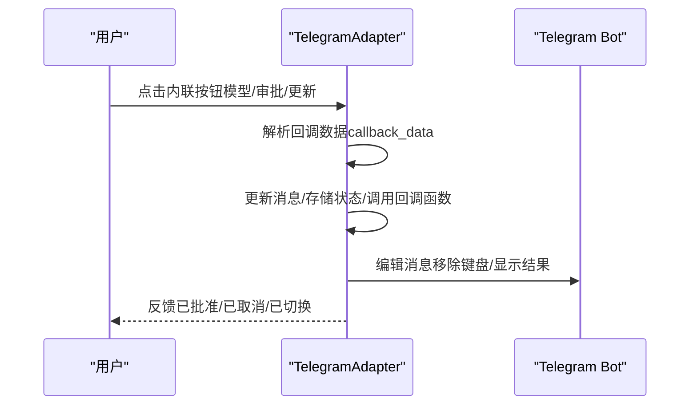
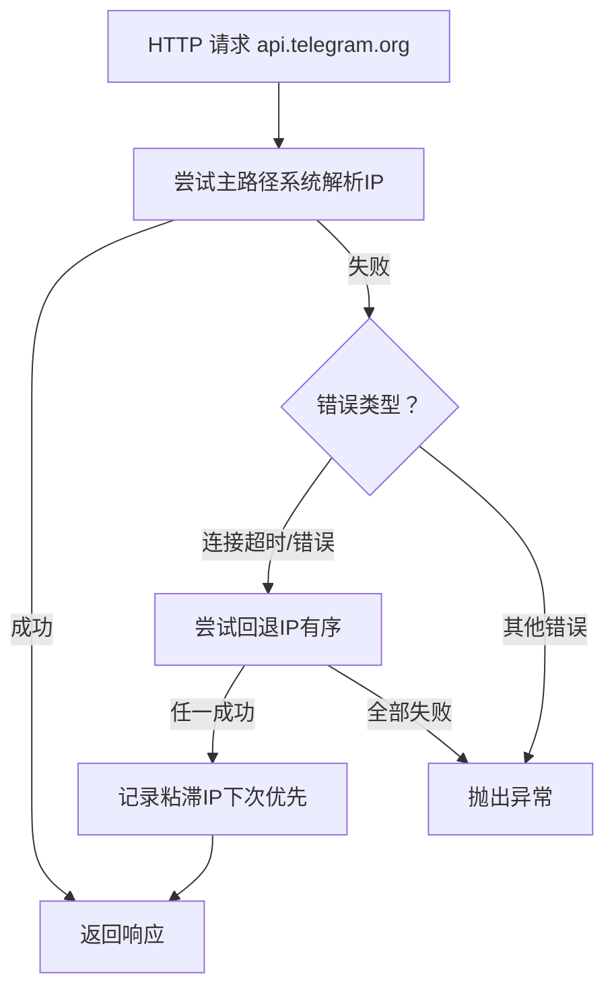
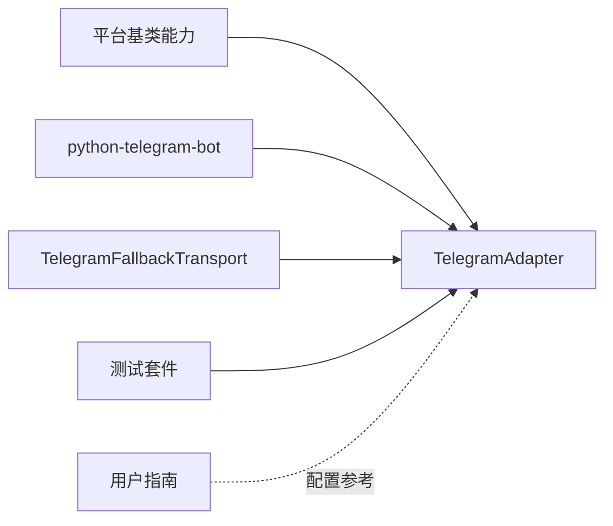

# Telegram 平台

<cite>
**本文引用的文件**
- [gateway/platforms/telegram.py](file://gateway/platforms/telegram.py)
- [gateway/platforms/telegram_network.py](file://gateway/platforms/telegram_network.py)
- [website/docs/user-guide/messaging/telegram.md](file://website/docs/user-guide/messaging/telegram.md)
- [tests/gateway/test_telegram_format.py](file://tests/gateway/test_telegram_format.py)
- [tests/gateway/test_telegram_conflict.py](file://tests/gateway/test_telegram_conflict.py)
- [tests/gateway/test_telegram_network.py](file://tests/gateway/test_telegram_network.py)
- [tests/gateway/test_telegram_reply_mode.py](file://tests/gateway/test_telegram_reply_mode.py)
- [tests/e2e/test_telegram_commands.py](file://tests/e2e/test_telegram_commands.py)
</cite>

## 目录
1. [简介](#简介)
2. [项目结构](#项目结构)
3. [核心组件](#核心组件)
4. [架构总览](#架构总览)
5. [详细组件分析](#详细组件分析)
6. [依赖关系分析](#依赖关系分析)
7. [性能考量](#性能考量)
8. [故障排除指南](#故障排除指南)
9. [结论](#结论)
10. [附录](#附录)

## 简介
本文件面向希望在 Hermes Agent 中使用 Telegram 平台的开发者与运维人员，系统性说明 Telegram 适配器的设计与实现，覆盖以下主题：
- 机器人创建、API 密钥获取与 Webhook 设置
- 消息处理机制（文本、媒体、内联键盘与回调）
- 会话管理、用户身份验证与权限控制
- 消息格式转换、Markdown 渲染与富文本支持
- Telegram 特定安全考虑（隐私保护、速率限制、错误处理）
- 故障排除与性能优化建议

## 项目结构
Telegram 适配器位于网关平台层，核心代码与测试分布如下：
- 平台适配器：gateway/platforms/telegram.py
- Telegram 网络辅助：gateway/platforms/telegram_network.py
- 用户指南（部署与配置）：website/docs/user-guide/messaging/telegram.md
- 单元与端到端测试：tests/gateway/* 与 tests/e2e/test_telegram_commands.py

图表来源
- [gateway/platforms/telegram.py](file://gateway/platforms/telegram.py)
- [gateway/platforms/telegram_network.py](file://gateway/platforms/telegram_network.py)
- [website/docs/user-guide/messaging/telegram.md](file://website/docs/user-guide/messaging/telegram.md)
- [tests/gateway/test_telegram_format.py](file://tests/gateway/test_telegram_format.py)
- [tests/gateway/test_telegram_conflict.py](file://tests/gateway/test_telegram_conflict.py)
- [tests/gateway/test_telegram_network.py](file://tests/gateway/test_telegram_network.py)
- [tests/gateway/test_telegram_reply_mode.py](file://tests/gateway/test_telegram_reply_mode.py)
- [tests/e2e/test_telegram_commands.py](file://tests/e2e/test_telegram_commands.py)

章节来源
- [gateway/platforms/telegram.py](file://gateway/platforms/telegram.py)
- [gateway/platforms/telegram_network.py](file://gateway/platforms/telegram_network.py)
- [website/docs/user-guide/messaging/telegram.md](file://website/docs/user-guide/messaging/telegram.md)

## 核心组件
- TelegramAdapter：基于 python-telegram-bot 的适配器，负责连接、消息接收、发送、富文本渲染、内联键盘交互、媒体处理与线程话题管理。
- TelegramFallbackTransport：在受限网络环境下，通过 DNS-over-HTTPS 发现可用 IP 并进行透明回退，保持 TLS SNI 与 Host 不变。
- 基类能力：继承自通用平台适配器，统一消息事件构建、会话键生成、分片发送与错误处理。

章节来源
- [gateway/platforms/telegram.py](file://gateway/platforms/telegram.py)
- [gateway/platforms/telegram_network.py](file://gateway/platforms/telegram_network.py)

## 架构总览
下图展示 Telegram 适配器从连接到消息处理的关键路径，以及网络回退与错误恢复机制。

图表来源
- [gateway/platforms/telegram.py](file://gateway/platforms/telegram.py)
- [gateway/platforms/telegram_network.py](file://gateway/platforms/telegram_network.py)

## 详细组件分析

### 连接与部署（Polling/Webhook）
- 默认使用长轮询（Polling），向 Telegram 推送更新。
- 支持 Webhook 模式：当设置 TELEGRAM_WEBHOOK_URL 时，启动本地 HTTP 服务器并注册 webhook，适合云平台自动唤醒场景。
- 启动前清理旧 webhook，避免冲突；连接后注册命令菜单（最多 100 个）。
- 令牌锁：同一进程内对同一 bot token 的并发连接进行互斥，防止多实例竞争。

图表来源
- [gateway/platforms/telegram.py](file://gateway/platforms/telegram.py)

章节来源
- [gateway/platforms/telegram.py](file://gateway/platforms/telegram.py)
- [website/docs/user-guide/messaging/telegram.md](file://website/docs/user-guide/messaging/telegram.md)

### 消息处理机制
- 文本消息：支持客户端侧长文本拆分聚合，按设定延迟合并为单次事件，避免“自中断”对话。
- 媒体消息：图片缓存至本地以便视觉工具访问；语音/Audio 缓存用于转写；文档下载并按类型注入内容或限制大小。
- 位置/地点：解析经纬度与可选地址，生成可操作提示。
- 内联键盘与回调：支持模型选择器、执行审批、更新提示等交互式按钮，回调中解析状态并解除阻塞。

图表来源
- [gateway/platforms/telegram.py](file://gateway/platforms/telegram.py)

章节来源
- [gateway/platforms/telegram.py](file://gateway/platforms/telegram.py)

### 富文本与 Markdown 渲染
- 将标准 Markdown 转换为 Telegram MarkdownV2，保护代码块/行内代码不被转义，正确转义链接、标题、粗体、斜体、删除线、剧透等。
- 对括号、花括号等特殊字符进行二次保护，避免破坏链接语法。
- 提供纯文本回退（Strip）以兼容无法解析 MarkdownV2 的场景。

图表来源
- [gateway/platforms/telegram.py](file://gateway/platforms/telegram.py)

章节来源
- [gateway/platforms/telegram.py](file://gateway/platforms/telegram.py)
- [tests/gateway/test_telegram_format.py](file://tests/gateway/test_telegram_format.py)

### 会话管理、用户认证与权限控制
- 私聊默认开放；群组消息需满足“直接回复机器人/命令/提及/正则唤醒词”之一，或显式允许列表。
- 用户授权：未授权用户进入 DM 时触发配对流程；命令处理前进行授权检查。
- 家庭频道：通过 /sethome 或配置指定，定时任务结果投递至此频道。
- 会话隔离：支持按用户/群组/话题维度隔离会话键，DM Topic 与群组论坛话题均独立上下文。

章节来源
- [gateway/platforms/telegram.py](file://gateway/platforms/telegram.py)
- [website/docs/user-guide/messaging/telegram.md](file://website/docs/user-guide/messaging/telegram.md)
- [tests/e2e/test_telegram_commands.py](file://tests/e2e/test_telegram_commands.py)

### 内联键盘与交互式功能
- 模型选择器：两步式导航（提供商→模型），支持分页与返回。
- 执行审批：交互式按钮（一次/会话/永久/拒绝），回调后解除阻塞。
- 更新提示：交互式确认（是/否），写入响应文件供后续流程使用。

图表来源
- [gateway/platforms/telegram.py](file://gateway/platforms/telegram.py)

章节来源
- [gateway/platforms/telegram.py](file://gateway/platforms/telegram.py)

### 媒体与文件处理
- 图片：优先 URL 直发（<5MB），失败则下载为文件上传；支持贴纸描述与缓存。
- 语音/音频：缓存为本地文件，便于转写；根据扩展名区分 OGG/MP3。
- 文档：按类型映射 MIME，限制最大 20MB；对 .md/.txt 注入内容（≤100KB）。
- 位置：解析经纬度与可选地址，生成地图链接与建议。

章节来源
- [gateway/platforms/telegram.py](file://gateway/platforms/telegram.py)

### 网络回退与容错
- 回退传输：在受限网络中，通过 DoH 查询 Telegram API 的替代 IP，保持 Host 与 SNI 不变，优先尝试主路径，失败则按序尝试回退 IP，并“粘滞”到稳定路径。
- 自动发现：若未显式配置，自动查询 Google/Cloudflare DNS 获取 A 记录，排除系统 DNS 结果，最后使用种子 IP。
- 连接错误处理：网络错误采用指数退避重连；轮询冲突（409）重试并在耗尽后标记致命错误。

图表来源
- [gateway/platforms/telegram_network.py](file://gateway/platforms/telegram_network.py)

章节来源
- [gateway/platforms/telegram_network.py](file://gateway/platforms/telegram_network.py)
- [tests/gateway/test_telegram_network.py](file://tests/gateway/test_telegram_network.py)
- [tests/gateway/test_telegram_conflict.py](file://tests/gateway/test_telegram_conflict.py)

## 依赖关系分析
- 适配器依赖 python-telegram-bot（消息、命令、回调、上下文、常量、请求封装）。
- 适配器依赖基类能力（消息事件、分片发送、媒体缓存、会话键生成）。
- 网络回退模块独立于 Telegram，但被适配器注入到 Application 的请求层。
- 测试覆盖格式化、网络回退、冲突与重连、回复模式、命令端到端流程。

图表来源
- [gateway/platforms/telegram.py](file://gateway/platforms/telegram.py)
- [gateway/platforms/telegram_network.py](file://gateway/platforms/telegram_network.py)

章节来源
- [gateway/platforms/telegram.py](file://gateway/platforms/telegram.py)
- [gateway/platforms/telegram_network.py](file://gateway/platforms/telegram_network.py)

## 性能考量
- 文本/媒体聚合：通过延迟合并减少重复事件与上下文切换开销。
- MarkdownV2：仅在必要时进行复杂转换，避免无谓的占位符替换。
- 发送重试：针对网络错误采用指数退避，避免抖动；对“消息过长/洪水控制”采取短等待或截断策略。
- 回退传输：粘滞 IP 减少后续连接失败概率，提升稳定性。
- Webhook：在云平台启用自动唤醒时，可降低空闲成本。

## 故障排除指南
常见问题与定位要点：
- 机器人无响应：检查 TELEGRAM_BOT_TOKEN 是否正确；查看日志错误；确认是否处于轮询冲突或网络错误。
- 群组消息被忽略：隐私模式开启导致；关闭隐私或提升为管理员；变更后需重新加入群组。
- Webhook 无法接收：确认 TELEGRAM_WEBHOOK_URL 可达且为 HTTPS；平台反向代理正确转发；证书有效；端口与本地监听一致。
- 语音未转写：确认 STT 提供商可用（本地/faster-whisper、Groq、OpenAI）；检查 API Key。
- 语音回复为文件而非气泡：安装 ffmpeg 以转换 Opus。
- 令牌失效/被撤销：在 BotFather 重新生成并更新环境变量。

章节来源
- [website/docs/user-guide/messaging/telegram.md](file://website/docs/user-guide/messaging/telegram.md)
- [tests/gateway/test_telegram_conflict.py](file://tests/gateway/test_telegram_conflict.py)
- [tests/gateway/test_telegram_network.py](file://tests/gateway/test_telegram_network.py)

## 结论
Telegram 适配器在保证与 Telegram 生态兼容的同时，提供了丰富的消息处理能力、富文本渲染、内联交互与网络回退机制。通过严格的权限控制、会话隔离与错误恢复策略，能够在本地与云端多种部署形态下稳定运行。建议在生产环境中启用 Webhook、配置隐私与允许用户列表、合理设置回复模式与话题隔离，并结合网络回退与速率限制策略保障稳定性与性能。

## 附录

### 配置清单（关键环境变量与配置项）
- TELEGRAM_BOT_TOKEN：机器人令牌
- TELEGRAM_WEBHOOK_URL：Webhook 公网 HTTPS 地址
- TELEGRAM_WEBHOOK_PORT：本地监听端口（默认 8443）
- TELEGRAM_WEBHOOK_SECRET：Webhook 验证密钥（推荐）
- TELEGRAM_ALLOWED_USERS：允许交互的用户 ID 列表
- TELEGRAM_HOME_CHANNEL / TELEGRAM_HOME_CHANNEL_NAME：家庭频道
- TELEGRAM_REPLY_TO_MODE：回复模式（off/first/all）
- TELEGRAM_FALLBACK_IPS：回退 IP 列表（逗号分隔）
- telegram.require_mention / telegram.mention_patterns：群组触发规则
- telegram.reactions：启用消息反应

章节来源
- [website/docs/user-guide/messaging/telegram.md](file://website/docs/user-guide/messaging/telegram.md)