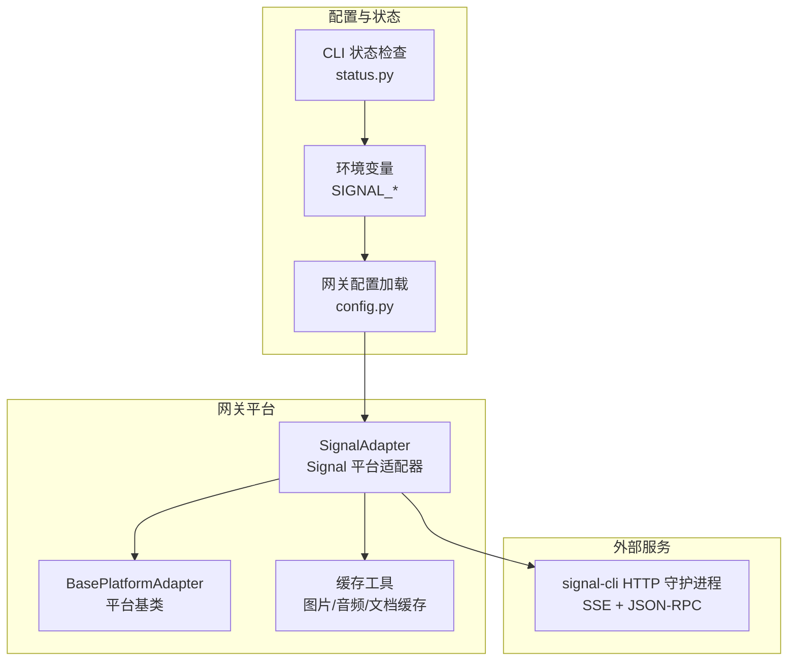
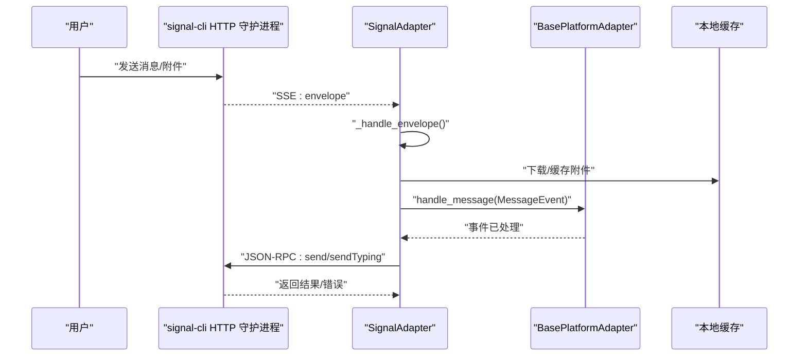
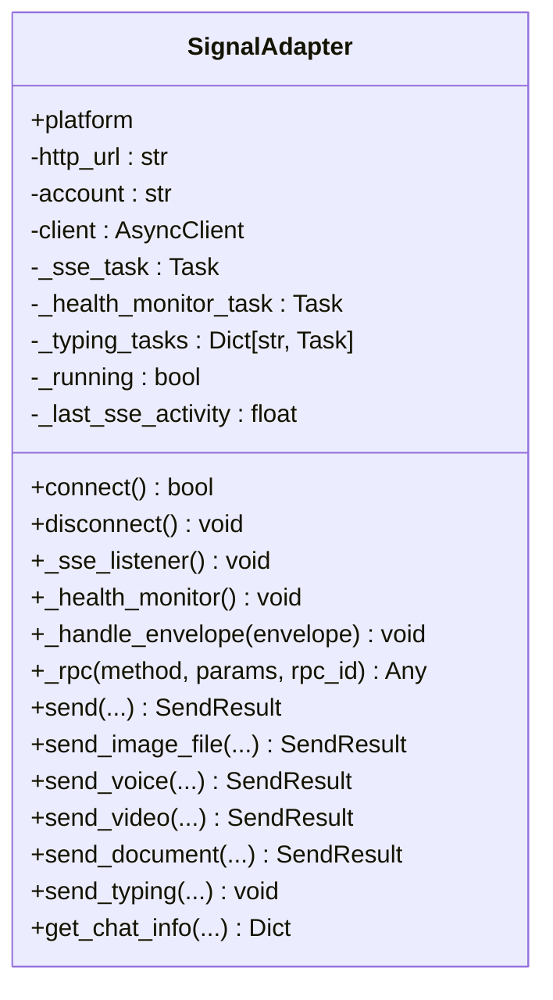
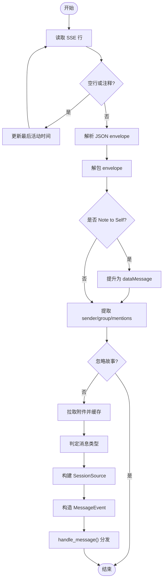
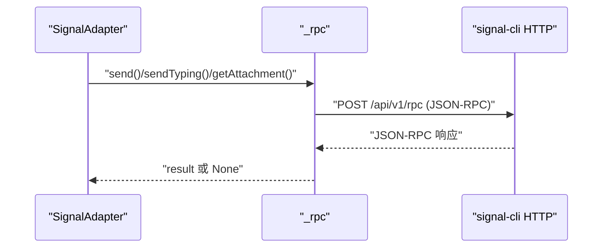
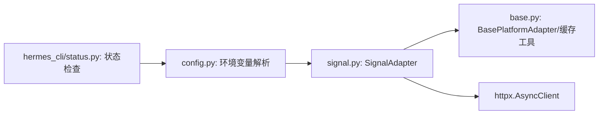

# Signal 集成

<cite>
**本文引用的文件**
- [signal.py](file://gateway/platforms/signal.py)
- [signal.md](file://website/docs/user-guide/messaging/signal.md)
- [base.py](file://gateway/platforms/base.py)
- [config.py](file://gateway/config.py)
- [test_signal.py](file://tests/gateway/test_signal.py)
- [status.py](file://hermes_cli/status.py)
- [_EXTRA_ENV_KEYS](file://hermes_cli/config.py)
</cite>

## 目录
1. [简介](#简介)
2. [项目结构](#项目结构)
3. [核心组件](#核心组件)
4. [架构总览](#架构总览)
5. [详细组件分析](#详细组件分析)
6. [依赖关系分析](#依赖关系分析)
7. [性能考量](#性能考量)
8. [故障排除指南](#故障排除指南)
9. [结论](#结论)
10. [附录](#附录)

## 简介
本文件为 Hermes Agent 的 Signal 平台适配器提供综合性技术文档。内容覆盖 Signal Desktop API 使用、端到端加密消息处理、账户与设备绑定、消息认证与访问控制、Signal 特有的消息格式与附件处理、联系人信息查询、配置参数说明、隐私保护在代理系统中的实现、连接健康监控与重连机制、以及与其他平台的对比与迁移建议。

## 项目结构
Signal 适配器位于网关平台模块中，采用“平台适配器 + 基类 + 缓存工具”的分层设计：
- 平台适配器：SignalAdapter（Signal 平台专用逻辑）
- 基类与通用能力：BasePlatformAdapter（统一事件模型、媒体缓存、会话来源等）
- 缓存工具：图片/音频/文档本地缓存（避免平台 URL 过期问题）
- 配置加载：从环境变量解析平台配置并注入网关配置
- 文档与用户指南：Signal 安装、链接、HTTP 守护进程、环境变量参考

图示来源
- [signal.py:151-868](file://gateway/platforms/signal.py#L151-L868)
- [base.py:1-200](file://gateway/platforms/base.py#L1-L200)
- [config.py:737-755](file://gateway/config.py#L737-L755)
- [status.py:280-302](file://hermes_cli/status.py#L280-L302)

章节来源
- [signal.py:1-120](file://gateway/platforms/signal.py#L1-L120)
- [base.py:1-200](file://gateway/platforms/base.py#L1-L200)
- [config.py:737-755](file://gateway/config.py#L737-L755)
- [status.py:280-302](file://hermes_cli/status.py#L280-L302)

## 核心组件
- SignalAdapter：基于 signal-cli HTTP 守护进程，通过 SSE 接收消息，JSON-RPC 发送消息；支持 typing 指示、附件下载与缓存、自对话过滤、组消息白名单、健康监控与自动重连。
- BasePlatformAdapter：提供统一的消息事件模型、媒体缓存工具（图片/音频/文档）、会话来源构建、消息类型枚举等。
- 缓存工具：将平台媒体下载到本地缓存目录，供视觉/语音识别等工具使用。
- 配置加载：从环境变量读取 SIGNAL_HTTP_URL、SIGNAL_ACCOUNT、SIGNAL_GROUP_ALLOWED_USERS 等，并注入网关配置。
- 用户指南：Signal 安装、链接、守护进程启动、环境变量与安全建议、故障排除。

章节来源
- [signal.py:151-282](file://gateway/platforms/signal.py#L151-L282)
- [base.py:367-400](file://gateway/platforms/base.py#L367-L400)
- [config.py:737-755](file://gateway/config.py#L737-L755)
- [signal.md:1-240](file://website/docs/user-guide/messaging/signal.md#L1-L240)

## 架构总览
Signal 适配器通过 signal-cli 提供的 HTTP 接口工作：
- 入站：SSE 流式推送 envelope，解析为统一 MessageEvent，触发 handle_message。
- 出站：JSON-RPC 调用 send/sendTyping/getAttachment 等方法。
- 健康监控：周期性健康检查，空闲超时强制重连。
- 访问控制：DM 白名单、组 ID 白名单、全局允许策略。

图示来源
- [signal.py:287-351](file://gateway/platforms/signal.py#L287-L351)
- [signal.py:397-547](file://gateway/platforms/signal.py#L397-L547)
- [signal.py:587-621](file://gateway/platforms/signal.py#L587-L621)
- [base.py:380-400](file://gateway/platforms/base.py#L380-L400)

## 详细组件分析

### SignalAdapter 类与生命周期
- 初始化：读取 http_url、account、ignore_stories，解析组白名单，初始化 HTTP 客户端与后台任务集合。
- 连接：健康检查 signal-cli 可达性，启动 SSE 监听与健康监控任务。
- 断开：取消所有后台任务，关闭 HTTP 客户端，释放电话号码锁。
- 自身消息过滤：对 Note to Self 或自身发送回执进行去重，防止回环。

图示来源
- [signal.py:151-282](file://gateway/platforms/signal.py#L151-L282)
- [signal.py:287-351](file://gateway/platforms/signal.py#L287-L351)
- [signal.py:397-547](file://gateway/platforms/signal.py#L397-L547)
- [signal.py:587-621](file://gateway/platforms/signal.py#L587-L621)
- [signal.py:844-868](file://gateway/platforms/signal.py#L844-L868)

章节来源
- [signal.py:151-282](file://gateway/platforms/signal.py#L151-L282)
- [signal.py:287-351](file://gateway/platforms/signal.py#L287-L351)
- [signal.py:397-547](file://gateway/platforms/signal.py#L397-L547)
- [signal.py:844-868](file://gateway/platforms/signal.py#L844-L868)

### SSE 入站消息处理流程
- 解析 SSE 数据行，处理心跳注释以更新活动时间。
- 将 envelope 转换为统一 MessageEvent，渲染 @提及、提取附件、构建会话来源、确定消息类型（文本/语音/图片）。
- 支持编辑消息（editMessage.dataMessage）与 Note to Self（syncMessage.sentMessage）特殊场景。

图示来源
- [signal.py:287-351](file://gateway/platforms/signal.py#L287-L351)
- [signal.py:397-547](file://gateway/platforms/signal.py#L397-L547)

章节来源
- [signal.py:287-351](file://gateway/platforms/signal.py#L287-L351)
- [signal.py:397-547](file://gateway/platforms/signal.py#L397-L547)

### JSON-RPC 出站通信
- 统一 _rpc 方法封装 JSON-RPC 2.0 请求，自动设置 id，处理错误字段。
- send/sendTyping/getAttachment 等方法调用 _rpc，支持群组与个人聊天路由。
- 附件发送前进行大小校验（100 MB），并根据扩展名映射 MIME 类型。

图示来源
- [signal.py:587-621](file://gateway/platforms/signal.py#L587-L621)
- [signal.py:626-809](file://gateway/platforms/signal.py#L626-L809)

章节来源
- [signal.py:587-621](file://gateway/platforms/signal.py#L587-L621)
- [signal.py:626-809](file://gateway/platforms/signal.py#L626-L809)

### 附件处理与媒体类型
- 下载附件：_fetch_attachment 调用 getAttachment，base64 解码后按扩展名选择缓存函数（图片/音频/文档）。
- MIME 映射：根据扩展名推断 MIME 类型，用于消息类型判定与传输。
- 大小限制：统一 100 MB 限制，超过则拒绝。
- 支持格式：图片（PNG/JPEG/GIF/WebP）、音频（MP3/OGG/WAV/M4A/AAC）、视频（MP4）、文档（PDF/ZIP 等）。

章节来源
- [signal.py:49-118](file://gateway/platforms/signal.py#L49-L118)
- [signal.py:553-581](file://gateway/platforms/signal.py#L553-L581)
- [signal.py:107-118](file://gateway/platforms/signal.py#L107-L118)

### typing 指示与健康监控
- typing 循环：每 8 秒发送一次 sendTyping，直到停止。
- 健康监控：每 30 秒检查一次 SSE 最后活动时间；超过 120 秒未活动时主动探测 /api/v1/check，必要时强制关闭当前响应以触发重连。
- 重连策略：指数退避（2s → 60s），加入抖动避免惊群效应。

章节来源
- [signal.py:48-52](file://gateway/platforms/signal.py#L48-L52)
- [signal.py:815-839](file://gateway/platforms/signal.py#L815-L839)
- [signal.py:356-391](file://gateway/platforms/signal.py#L356-L391)

### 访问控制与消息认证
- DM 白名单：SIGNAL_ALLOWED_USERS 控制可交互的 E.164 号码或 UUID。
- 组消息白名单：SIGNAL_GROUP_ALLOWED_USERS 支持指定组 ID 或通配符“*”。
- 自身消息过滤：对 Note to Self 与自身发送回执进行去重，防止回环。
- CLI 状态检查：status 命令显示 Signal 是否配置及 home channel 状态。

章节来源
- [signal.py:164-167](file://gateway/platforms/signal.py#L164-L167)
- [signal.py:457-470](file://gateway/platforms/signal.py#L457-L470)
- [signal.py:410-421](file://gateway/platforms/signal.py#L410-L421)
- [status.py:280-302](file://hermes_cli/status.py#L280-L302)

### 配置参数说明
- 必填项
  - SIGNAL_HTTP_URL：signal-cli HTTP 端点（如 http://127.0.0.1:8080）
  - SIGNAL_ACCOUNT：机器人手机号（E.164 格式）
- 安全与策略
  - SIGNAL_ALLOWED_USERS：逗号分隔的允许用户号码/UUID
  - SIGNAL_GROUP_ALLOWED_USERS：允许监听的组 ID 列表，或“*”表示全部
  - SIGNAL_ALLOW_ALL_USERS：允许任意用户（谨慎使用）
- 其他
  - SIGNAL_HOME_CHANNEL：定时任务默认投递目标
  - SIGNAL_IGNORE_STORIES：是否忽略故事消息（默认启用）

章节来源
- [config.py:737-755](file://gateway/config.py#L737-L755)
- [signal.md:230-240](file://website/docs/user-guide/messaging/signal.md#L230-L240)
- [_EXTRA_ENV_KEYS:36-47](file://hermes_cli/config.py#L36-L47)

### 信号与隐私保护
- 端到端加密：Signal 默认端到端加密，保护消息内容在传输过程中的机密性。
- 最小化元数据：Signal 采用开放协议，最小化元数据收集，适合安全敏感的代理工作流。
- 日志脱敏：电话号码在日志中自动脱敏（如 +155****4567）。
- 本地缓存：媒体文件下载到本地缓存，避免平台 URL 过期带来的不可用风险。

章节来源
- [signal.md:11-15](file://website/docs/user-guide/messaging/signal.md#L11-L15)
- [signal.py:62-68](file://gateway/platforms/signal.py#L62-L68)
- [base.py:95-171](file://gateway/platforms/base.py#L95-L171)

### 与其他平台的对比与迁移
- 与 WhatsApp/Telegram/Discord 等平台相比，Signal 适配器通过 signal-cli HTTP 守护进程提供 SSE + JSON-RPC，无需平台 SDK，仅需外部安装 signal-cli。
- 附件处理与消息类型在适配器层面统一抽象，迁移时主要关注环境变量与白名单策略差异。
- 若从其他平台迁移到 Signal，重点在于：
  - 安装并链接 signal-cli（作为“已链接设备”）
  - 配置 SIGNAL_HTTP_URL 与 SIGNAL_ACCOUNT
  - 设置 DM/组白名单
  - 验证定时任务 home channel（如需要）

章节来源
- [signal.md:45-77](file://website/docs/user-guide/messaging/signal.md#L45-L77)
- [signal.md:146-200](file://website/docs/user-guide/messaging/signal.md#L146-L200)

## 依赖关系分析
- 适配器依赖
  - httpx：SSE 流与 JSON-RPC HTTP 请求
  - 基类与缓存工具：统一事件模型与本地媒体缓存
  - 环境变量：SIGNAL_HTTP_URL、SIGNAL_ACCOUNT、SIGNAL_GROUP_ALLOWED_USERS 等
- 配置加载
  - config.py 从环境变量读取并注入 PlatformConfig，支持 home_channel 注入
- CLI 状态
  - status.py 读取 SIGNAL_HTTP_URL/SIGNAL_HOME_CHANNEL 判断配置状态

图示来源
- [signal.py:14-41](file://gateway/platforms/signal.py#L14-L41)
- [config.py:737-755](file://gateway/config.py#L737-L755)
- [status.py:280-302](file://hermes_cli/status.py#L280-L302)

章节来源
- [signal.py:14-41](file://gateway/platforms/signal.py#L14-L41)
- [config.py:737-755](file://gateway/config.py#L737-L755)
- [status.py:280-302](file://hermes_cli/status.py#L280-L302)

## 性能考量
- SSE 与 JSON-RPC 均为短连接模式，适配器内部复用 httpx.AsyncClient，减少连接开销。
- 附件下载采用本地缓存，避免重复网络请求与平台 URL 过期导致的失败。
- typing 指示循环与健康监控均为轻量异步任务，避免阻塞主事件循环。
- 重连策略采用指数退避与抖动，降低瞬时故障引发的风暴效应。

## 故障排除指南
常见问题与解决步骤
- 无法连接 signal-cli
  - 确认守护进程已运行且监听地址正确
  - 使用 curl 验证 /api/v1/check 返回值
- 消息未到达
  - 检查 SIGNAL_ALLOWED_USERS 是否包含发送者号码（E.164 格式）
  - 如未配置白名单，可通过 DM 配对流程授权
- 组消息被忽略
  - 配置 SIGNAL_GROUP_ALLOWED_USERS 为具体组 ID 或“*”
- 连接频繁断开
  - 检查 signal-cli 日志与 Java 版本（要求 17+）
  - 观察健康监控日志，确认是否因长时间无活动触发强制重连
- 重复消息
  - 确保同一号码只存在一个 signal-cli 实例监听
- 附件过大
  - 附件大小限制为 100 MB，超过将被拒绝

章节来源
- [signal.md:202-213](file://website/docs/user-guide/messaging/signal.md#L202-L213)
- [signal.py:356-391](file://gateway/platforms/signal.py#L356-L391)

## 结论
Signal 适配器通过 signal-cli HTTP 守护进程实现了与 Signal 的稳定集成：SSE 实时接收、JSON-RPC 可靠发送、统一的媒体缓存与消息类型抽象、完善的访问控制与健康监控。结合 Signal 的端到端加密与最小化元数据特性，适配器能够满足安全敏感场景下的代理工作流需求。通过合理的环境变量配置与白名单策略，用户可以快速完成部署并获得可靠的通信体验。

## 附录
- 用户指南与安装步骤：参见 [Signal 用户指南:1-240](file://website/docs/user-guide/messaging/signal.md#L1-L240)
- 单元测试覆盖：参见 [Signal 测试:1-710](file://tests/gateway/test_signal.py#L1-L710)
- CLI 状态检查：参见 [status.py:280-302](file://hermes_cli/status.py#L280-L302)
- 环境变量清单：参见 [_EXTRA_ENV_KEYS:36-47](file://hermes_cli/config.py#L36-L47)