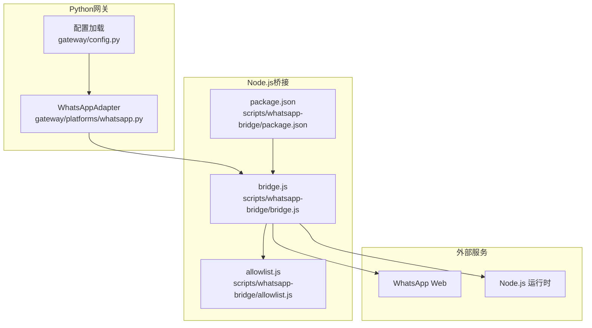
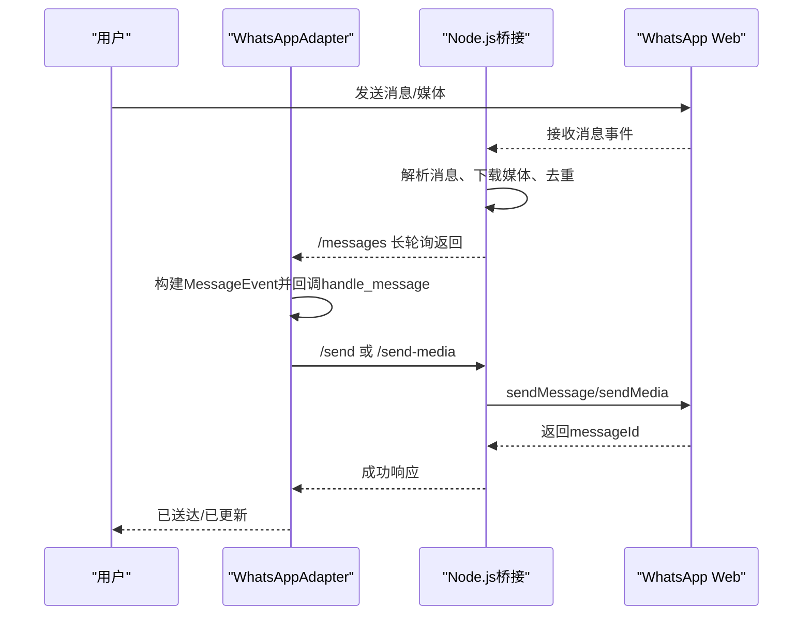
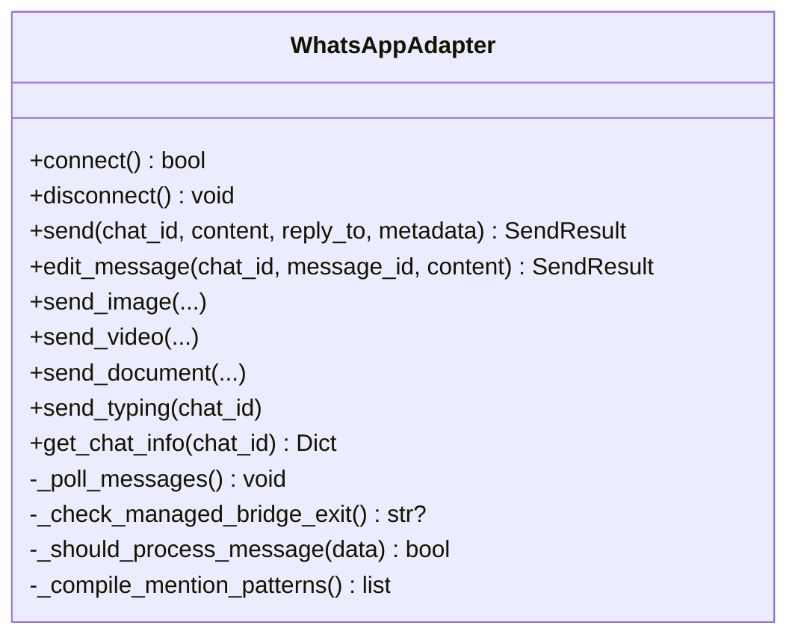
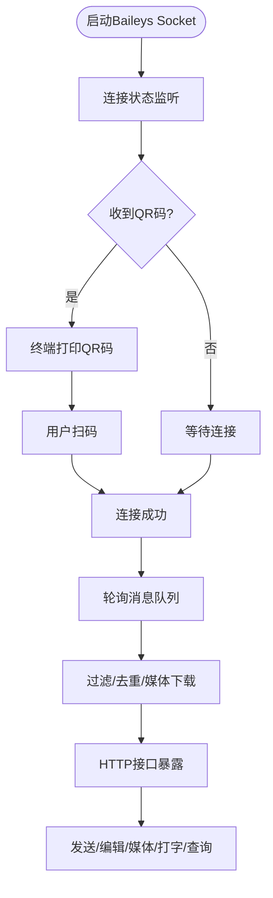
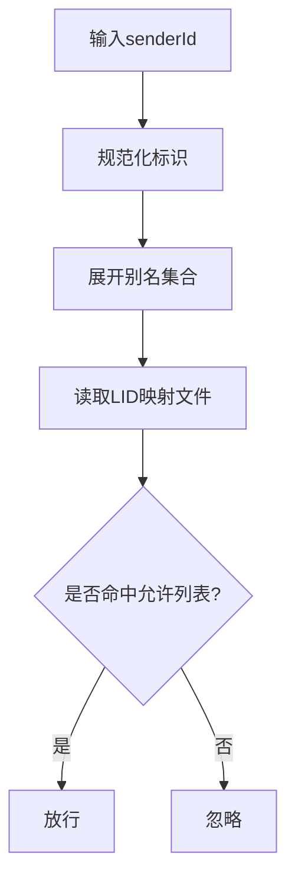
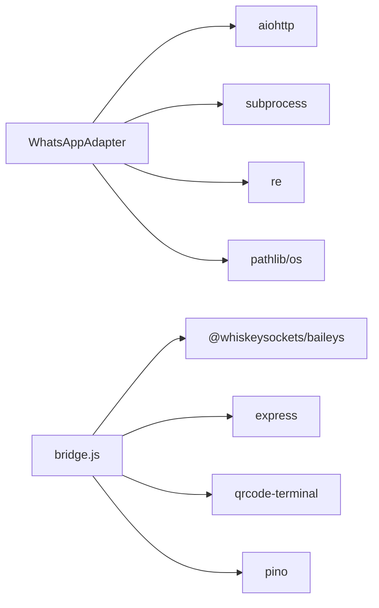

# WhatsApp 集成

<cite>
**本文引用的文件**
- [gateway/platforms/whatsapp.py](file://gateway/platforms/whatsapp.py)
- [scripts/whatsapp-bridge/bridge.js](file://scripts/whatsapp-bridge/bridge.js)
- [scripts/whatsapp-bridge/allowlist.js](file://scripts/whatsapp-bridge/allowlist.js)
- [scripts/whatsapp-bridge/package.json](file://scripts/whatsapp-bridge/package.json)
- [website/docs/user-guide/messaging/whatsapp.md](file://website/docs/user-guide/messaging/whatsapp.md)
- [tests/gateway/test_whatsapp_connect.py](file://tests/gateway/test_whatsapp_connect.py)
- [tests/gateway/test_whatsapp_group_gating.py](file://tests/gateway/test_whatsapp_group_gating.py)
- [tests/gateway/test_whatsapp_reply_prefix.py](file://tests/gateway/test_whatsapp_reply_prefix.py)
- [gateway/config.py](file://gateway/config.py)
- [hermes_cli/main.py](file://hermes_cli/main.py)
</cite>

## 目录
1. [简介](#简介)
2. [项目结构](#项目结构)
3. [核心组件](#核心组件)
4. [架构总览](#架构总览)
5. [详细组件分析](#详细组件分析)
6. [依赖关系分析](#依赖关系分析)
7. [性能考量](#性能考量)
8. [故障排除指南](#故障排除指南)
9. [结论](#结论)
10. [附录](#附录)

## 简介
本文件面向Hermes Agent的WhatsApp平台适配器，系统化阐述其在复杂生态中的实现方式与运行机制。WhatsApp集成不同于Telegram/Discord，既无官方个人账号机器人API，也需Meta企业验证才能使用Business API。因此，该适配器采用“Node.js桥接模式”，通过独立的Node.js子进程（基于Baileys）连接WhatsApp Web，Python侧以HTTP/IPC与之通信，实现消息收发、媒体传输、会话持久化与安全控制。文档覆盖：
- 个人账号与商业API差异及选择策略
- Node.js桥接模式与两种后端（whatsapp-web.js与Baileys）的可替换性
- 会话管理、QR码认证流程、消息处理机制与媒体传输
- 完整配置项说明：bridge_port、session_path、reply_prefix等
- 群组聊天处理、@提及检测与自由回复聊天室的特殊逻辑
- 故障排除、性能优化与安全最佳实践

## 项目结构
WhatsApp适配器由三层组成：
- Python网关适配层：负责生命周期管理、进程启动、HTTP轮询、错误处理与配置桥接
- Node.js桥接层：独立子进程，负责与WhatsApp Web交互、消息队列、媒体下载与转发
- 允许列表与辅助模块：用于识别允许用户、解析别名映射与LID互转

图表来源
- [gateway/platforms/whatsapp.py:103-148](file://gateway/platforms/whatsapp.py#L103-L148)
- [scripts/whatsapp-bridge/bridge.js:1-571](file://scripts/whatsapp-bridge/bridge.js#L1-L571)
- [scripts/whatsapp-bridge/allowlist.js:1-85](file://scripts/whatsapp-bridge/allowlist.js#L1-L85)
- [scripts/whatsapp-bridge/package.json:1-17](file://scripts/whatsapp-bridge/package.json#L1-L17)

章节来源
- [gateway/platforms/whatsapp.py:103-148](file://gateway/platforms/whatsapp.py#L103-L148)
- [scripts/whatsapp-bridge/bridge.js:1-571](file://scripts/whatsapp-bridge/bridge.js#L1-L571)
- [scripts/whatsapp-bridge/allowlist.js:1-85](file://scripts/whatsapp-bridge/allowlist.js#L1-L85)
- [scripts/whatsapp-bridge/package.json:1-17](file://scripts/whatsapp-bridge/package.json#L1-L17)

## 核心组件
- WhatsAppAdapter（Python）
  - 负责启动/停止Node.js桥接进程、健康检查、消息轮询、发送/编辑消息、媒体发送、打字指示、聊天信息查询
  - 支持会话锁避免重复实例竞争、自动安装依赖、跨平台端口清理
  - 提供配置项bridge_port、bridge_script、session_path、reply_prefix、require_mention、mention_patterns、free_response_chats等
- Node.js桥接（bridge.js）
  - 基于Baileys建立WhatsApp连接，支持QR扫码登录、LID映射、消息过滤与去重、媒体下载缓存、HTTP接口暴露
  - 暴露/messages、/send、/edit、/send-media、/typing、/chat/:id、/health等端点
- 允许列表（allowlist.js）
  - 解析允许用户、标准化号码、构建LID↔手机号映射、支持通配符与多级展开匹配
- 配置桥接（gateway/config.py）
  - 将config.yaml中的whatsapp节映射到环境变量，确保Python与Node桥接一致

章节来源
- [gateway/platforms/whatsapp.py:129-148](file://gateway/platforms/whatsapp.py#L129-L148)
- [scripts/whatsapp-bridge/bridge.js:123-361](file://scripts/whatsapp-bridge/bridge.js#L123-L361)
- [scripts/whatsapp-bridge/allowlist.js:12-84](file://scripts/whatsapp-bridge/allowlist.js#L12-L84)
- [gateway/config.py:588-598](file://gateway/config.py#L588-L598)

## 架构总览
WhatsApp适配器采用“桥接模式”：Python侧作为协调者，Node.js侧作为执行者。二者通过本地HTTP通信，消息以长轮询方式从桥接端推送至Python端，再由Python适配器转换为统一事件模型并交由上层处理。

图表来源
- [gateway/platforms/whatsapp.py:779-800](file://gateway/platforms/whatsapp.py#L779-L800)
- [scripts/whatsapp-bridge/bridge.js:367-498](file://scripts/whatsapp-bridge/bridge.js#L367-L498)

章节来源
- [gateway/platforms/whatsapp.py:274-479](file://gateway/platforms/whatsapp.py#L274-L479)
- [scripts/whatsapp-bridge/bridge.js:367-549](file://scripts/whatsapp-bridge/bridge.js#L367-L549)

## 详细组件分析

### 组件A：WhatsAppAdapter（Python）
- 生命周期管理
  - 启动：校验Node.js、自动安装依赖、端口占用清理、进程启动、健康检查、消息轮询任务
  - 停止：终止子进程（跨平台）、取消轮询任务、关闭持久HTTP会话、释放会话锁
- 消息处理
  - 长轮询获取消息，构建统一事件对象，调用handle_message分发
  - 支持编辑、媒体发送、打字指示、聊天信息查询
- 会话与安全
  - 会话锁防止多实例竞争同一会话目录
  - 允许列表与@提及/前缀匹配决定是否处理群消息
  - 自动记录桥接日志文件便于排障

图表来源
- [gateway/platforms/whatsapp.py:103-148](file://gateway/platforms/whatsapp.py#L103-L148)
- [gateway/platforms/whatsapp.py:274-560](file://gateway/platforms/whatsapp.py#L274-L560)

章节来源
- [gateway/platforms/whatsapp.py:103-148](file://gateway/platforms/whatsapp.py#L103-L148)
- [gateway/platforms/whatsapp.py:274-560](file://gateway/platforms/whatsapp.py#L274-L560)

### 组件B：Node.js桥接（bridge.js）
- 连接与认证
  - 使用Baileys建立多文件认证状态，打印QR码供终端扫描
  - 处理断线重连（含515重启），保持在线状态
- 消息与媒体
  - 解析多种消息类型（文本、图片、视频、音频、文档），自动下载并缓存媒体
  - 去重：维护最近发送ID集合，避免自回环
  - 允许列表：仅转发匹配的发送者消息
- HTTP接口
  - /messages：长轮询返回新消息
  - /send、/edit、/send-media：发送文本/编辑/媒体
  - /typing：发送打字指示
  - /chat/:id：查询聊天元数据
  - /health：健康检查

图表来源
- [scripts/whatsapp-bridge/bridge.js:123-361](file://scripts/whatsapp-bridge/bridge.js#L123-L361)
- [scripts/whatsapp-bridge/bridge.js:367-549](file://scripts/whatsapp-bridge/bridge.js#L367-L549)

章节来源
- [scripts/whatsapp-bridge/bridge.js:123-361](file://scripts/whatsapp-bridge/bridge.js#L123-L361)
- [scripts/whatsapp-bridge/bridge.js:367-549](file://scripts/whatsapp-bridge/bridge.js#L367-L549)

### 组件C：允许列表与别名映射（allowlist.js）
- 规范化标识：去除国家码前缀、冒号与@后缀，统一为纯数字
- 映射扩展：读取lid-mapping-*.json，双向解析LID与手机号，形成可扩展的别名集合
- 匹配策略：支持通配符“*”，允许任意发送者；否则按别名集合匹配

图表来源
- [scripts/whatsapp-bridge/allowlist.js:4-84](file://scripts/whatsapp-bridge/allowlist.js#L4-L84)

章节来源
- [scripts/whatsapp-bridge/allowlist.js:4-84](file://scripts/whatsapp-bridge/allowlist.js#L4-L84)

### 组件D：配置桥接（gateway/config.py）
- 将config.yaml中whatsapp节的关键字段映射到环境变量，确保Python与Node桥接一致
- 支持require_mention、mention_patterns、free_response_chats等

章节来源
- [gateway/config.py:588-598](file://gateway/config.py#L588-L598)

## 依赖关系分析
- Python侧依赖
  - aiohttp：HTTP客户端/服务端
  - subprocess：启动/管理Node.js桥接进程
  - re/pathlib/os：正则编译、路径处理、跨平台判断
- Node.js侧依赖
  - @whiskeysockets/baileys：核心WhatsApp连接库
  - express：HTTP服务端
  - qrcode-terminal：终端内打印二维码
  - pino：日志
- 依赖安装
  - Node.js桥接目录下存在package.json，首次启动时自动安装依赖

图表来源
- [gateway/platforms/whatsapp.py:18-81](file://gateway/platforms/whatsapp.py#L18-L81)
- [scripts/whatsapp-bridge/bridge.js:21-29](file://scripts/whatsapp-bridge/bridge.js#L21-L29)
- [scripts/whatsapp-bridge/package.json:10-15](file://scripts/whatsapp-bridge/package.json#L10-L15)

章节来源
- [gateway/platforms/whatsapp.py:18-81](file://gateway/platforms/whatsapp.py#L18-L81)
- [scripts/whatsapp-bridge/bridge.js:21-29](file://scripts/whatsapp-bridge/bridge.js#L21-L29)
- [scripts/whatsapp-bridge/package.json:10-15](file://scripts/whatsapp-bridge/package.json#L10-L15)

## 性能考量
- 消息轮询与队列
  - Python侧使用异步队列与长轮询，避免阻塞主线程
  - Node.js侧维护固定大小的消息队列，防止内存膨胀
- 媒体处理
  - 下载媒体写入临时缓存目录，避免重复下载
  - 限制最近发送ID集合大小，降低查找成本
- 并发与资源
  - Python侧使用持久HTTP会话减少连接开销
  - Node.js侧使用多文件认证状态，避免频繁重连
- 优化建议
  - 合理设置bridge_port，避免端口冲突
  - 控制会话目录权限，确保磁盘I/O稳定
  - 在高并发群聊场景下，适当放宽轮询间隔或增加队列容量

[本节为通用指导，无需特定文件来源]

## 故障排除指南
- 依赖检查
  - Node.js版本与npm可用性：适配器启动前会检查node --version
  - 依赖安装：若node_modules缺失，自动执行npm install
- 进程管理
  - 端口占用：启动前尝试清理占用端口（Windows使用netstat/taskkill，类Unix使用fuser）
  - 子进程退出：监控子进程状态，标记致命错误并通知
- 日志分析
  - 桥接日志：默认输出到session_path父目录下的bridge.log，便于定位QR、错误与重连信息
  - 调试开关：WHATSAPP_DEBUG=true可输出原始消息事件
- 常见问题
  - QR码不扫描：确保终端宽度足够、使用支持Unicode的终端；确认扫描的是正确的WhatsApp账号
  - 会话未持久：检查session目录可写；容器部署需挂载持久卷
  - 登出或断线：设备长时间离线会被解除链接，重新hermes whatsapp配对
  - 群组消息未触发：检查require_mention、mention_patterns、free_response_chats配置
  - 自回环：Node.js侧已内置最近发送ID去重，确保未被覆盖

章节来源
- [gateway/platforms/whatsapp.py:35-67](file://gateway/platforms/whatsapp.py#L35-L67)
- [gateway/platforms/whatsapp.py:84-100](file://gateway/platforms/whatsapp.py#L84-L100)
- [gateway/platforms/whatsapp.py:362-393](file://gateway/platforms/whatsapp.py#L362-L393)
- [website/docs/user-guide/messaging/whatsapp.md:177-190](file://website/docs/user-guide/messaging/whatsapp.md#L177-L190)

## 结论
WhatsApp适配器通过“桥接模式”将Python网关与Node.js桥接解耦，既规避了官方API限制，又提供了稳定的个人账号与群组消息处理能力。通过会话锁、允许列表、@提及与前缀匹配、媒体缓存与去重等机制，实现了安全、可控且高性能的消息流转。建议在生产环境中结合安全策略（专用号码、访问控制、日志审计）与性能优化（合理队列与轮询、缓存策略）持续迭代。

[本节为总结，无需特定文件来源]

## 附录

### 配置选项说明
- bridge_port（Python）
  - 默认值：3000
  - 作用：Node.js桥接HTTP服务监听端口
- bridge_script（Python）
  - 默认值：scripts/whatsapp-bridge/bridge.js
  - 作用：指定Node.js桥接脚本路径
- session_path（Python）
  - 默认值：~/.hermes/platforms/whatsapp/session
  - 作用：会话目录，保存Baileys认证状态与设备凭据
- reply_prefix（Python/Node）
  - 默认值：为空字符串或特定前缀
  - 作用：在self-chat模式下为回复添加前缀；Node侧通过WHATSAPP_REPLY_PREFIX传递
- require_mention（Python/Node）
  - 默认值：false
  - 作用：群组消息是否必须@提及或以命令开头才处理
- mention_patterns（Python/Node）
  - 默认值：空
  - 作用：自定义唤醒词的正则表达式列表
- free_response_chats（Python/Node）
  - 默认值：空
  - 作用：白名单群组可免@直接回复

章节来源
- [gateway/platforms/whatsapp.py:129-141](file://gateway/platforms/whatsapp.py#L129-L141)
- [gateway/platforms/whatsapp.py:150-164](file://gateway/platforms/whatsapp.py#L150-L164)
- [gateway/platforms/whatsapp.py:166-195](file://gateway/platforms/whatsapp.py#L166-L195)
- [gateway/platforms/whatsapp.py:377-379](file://gateway/platforms/whatsapp.py#L377-L379)
- [gateway/config.py:588-598](file://gateway/config.py#L588-L598)

### 安全与最佳实践
- 使用专用号码作为Bot号码，降低封禁风险
- 严格配置WHATSAPP_ALLOWED_USERS或设置为“*”以允许所有人
- 保护session目录权限（chmod 700），避免泄露
- 定期更新Hermes以适配WhatsApp协议变更
- 在macOS等环境下，确保launchd服务继承正确PATH

章节来源
- [website/docs/user-guide/messaging/whatsapp.md:193-214](file://website/docs/user-guide/messaging/whatsapp.md#L193-L214)

### 测试与回归
- 连接流程与错误路径：覆盖健康检查、文件句柄关闭、进程退出致命错误等
- 群组门控：require_mention、mention_patterns、free_response_chats行为验证
- 回复前缀：config.yaml桥接到PlatformConfig与Node环境变量传递

章节来源
- [tests/gateway/test_whatsapp_connect.py:150-332](file://tests/gateway/test_whatsapp_connect.py#L150-L332)
- [tests/gateway/test_whatsapp_group_gating.py:79-143](file://tests/gateway/test_whatsapp_group_gating.py#L79-L143)
- [tests/gateway/test_whatsapp_reply_prefix.py:23-122](file://tests/gateway/test_whatsapp_reply_prefix.py#L23-L122)