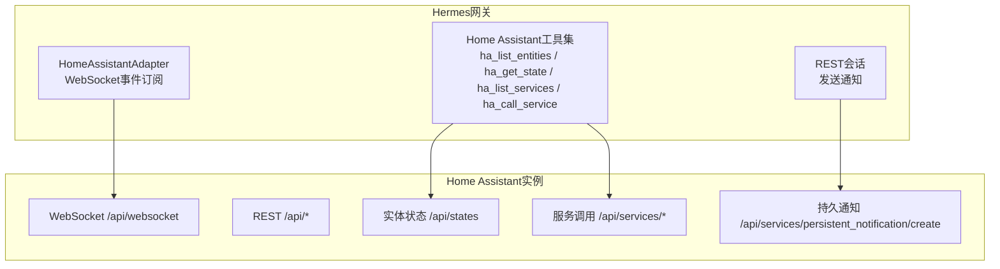
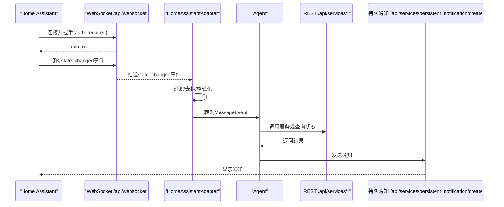
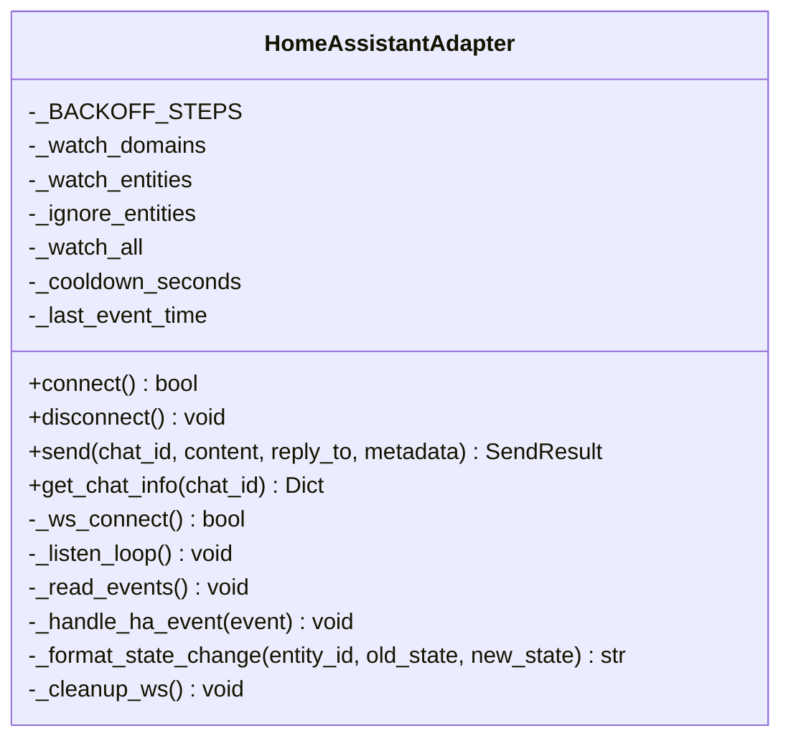
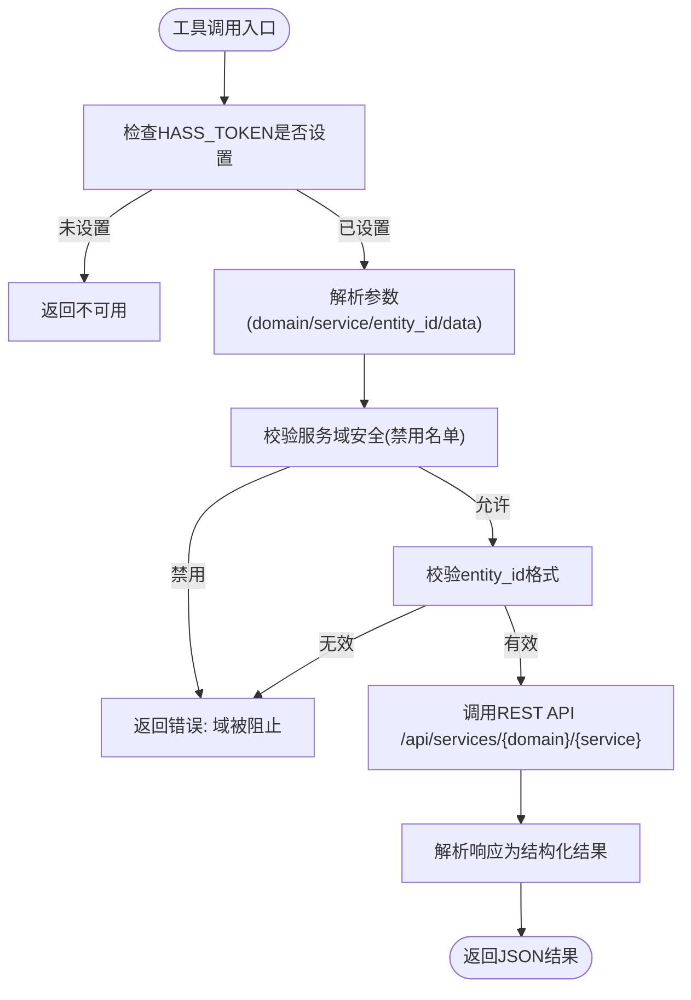
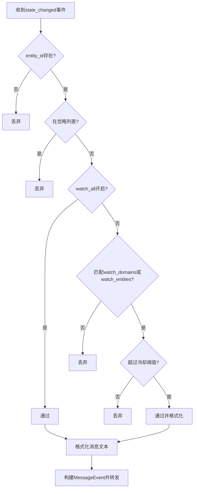
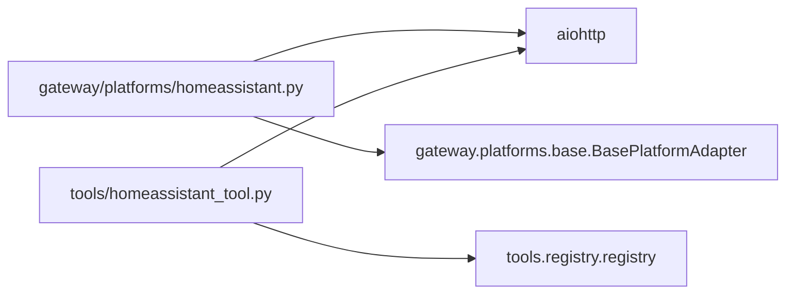

# Home Assistant集成

<cite>
**本文档引用的文件**
- [gateway/platforms/homeassistant.py](file://gateway/platforms/homeassistant.py)
- [tools/homeassistant_tool.py](file://tools/homeassistant_tool.py)
- [website/docs/user-guide/messaging/homeassistant.md](file://website/docs/user-guide/messaging/homeassistant.md)
- [tests/fakes/fake_ha_server.py](file://tests/fakes/fake_ha_server.py)
- [tests/gateway/test_homeassistant.py](file://tests/gateway/test_homeassistant.py)
- [tests/tools/test_homeassistant_tool.py](file://tests/tools/test_homeassistant_tool.py)
- [tests/integration/test_ha_integration.py](file://tests/integration/test_ha_integration.py)
- [gateway/run.py](file://gateway/run.py)
</cite>

## 目录
1. [简介](#简介)
2. [项目结构](#项目结构)
3. [核心组件](#核心组件)
4. [架构总览](#架构总览)
5. [详细组件分析](#详细组件分析)
6. [依赖关系分析](#依赖关系分析)
7. [性能考量](#性能考量)
8. [故障排除指南](#故障排除指南)
9. [结论](#结论)
10. [附录](#附录)

## 简介
本文件面向Home Assistant智能家居平台的集成与使用，覆盖以下关键主题：
- WebSocket连接与认证机制（Long-Lived Access Token）
- REST API工具集：设备发现与状态查询、服务调用
- 实时事件网关：设备状态变化订阅、过滤与去抖
- 自动化规则与场景管理（基于工具调用与事件驱动）
- 历史数据与统计信息（通过工具查询）
- 错误处理与连接重试机制
- 完整配置示例与故障排除

## 项目结构
该集成由两部分组成：
- 网关平台（Gateway Platform）：通过WebSocket订阅Home Assistant实时事件，按配置过滤后转发给代理处理；同时通过REST API发送通知。
- 智能家居工具集（Smart Home Tools）：四个LLM可调用工具，用于枚举实体、查询状态、列出服务、调用服务，均通过REST API完成。

图表来源
- [gateway/platforms/homeassistant.py:101-185](file://gateway/platforms/homeassistant.py#L101-L185)
- [tools/homeassistant_tool.py:96-191](file://tools/homeassistant_tool.py#L96-L191)

章节来源
- [gateway/platforms/homeassistant.py:1-450](file://gateway/platforms/homeassistant.py#L1-L450)
- [tools/homeassistant_tool.py:1-491](file://tools/homeassistant_tool.py#L1-L491)

## 核心组件
- HomeAssistantAdapter：负责WebSocket连接、认证、事件订阅、过滤与消息转发，以及通过REST API发送通知。
- Home Assistant工具集：四个LLM可调用工具，分别用于实体枚举、状态查询、服务列表与服务调用。

章节来源
- [gateway/platforms/homeassistant.py:51-450](file://gateway/platforms/homeassistant.py#L51-L450)
- [tools/homeassistant_tool.py:454-491](file://tools/homeassistant_tool.py#L454-L491)

## 架构总览
下图展示了从Home Assistant到Hermes网关再到工具调用的整体流程。

图表来源
- [gateway/platforms/homeassistant.py:140-185](file://gateway/platforms/homeassistant.py#L140-L185)
- [gateway/platforms/homeassistant.py:217-261](file://gateway/platforms/homeassistant.py#L217-L261)
- [gateway/platforms/homeassistant.py:386-439](file://gateway/platforms/homeassistant.py#L386-L439)
- [tools/homeassistant_tool.py:168-191](file://tools/homeassistant_tool.py#L168-L191)

## 详细组件分析

### 组件A：HomeAssistantAdapter（WebSocket网关）
- 连接生命周期：建立aiohttp会话与WebSocket连接，执行认证握手，订阅state_changed事件。
- 事件过滤：支持按域、实体ID、忽略列表与全局开关进行过滤；默认不转发任何事件，需显式配置。
- 去抖机制：同一实体在冷却时间内仅允许一次事件通过。
- 消息格式化：根据实体域生成人类可读的消息文本。
- 出站消息：通过REST API发送持久通知，避免与事件监听的WebSocket竞争。

图表来源
- [gateway/platforms/homeassistant.py:51-450](file://gateway/platforms/homeassistant.py#L51-L450)

章节来源
- [gateway/platforms/homeassistant.py:101-185](file://gateway/platforms/homeassistant.py#L101-L185)
- [gateway/platforms/homeassistant.py:217-381](file://gateway/platforms/homeassistant.py#L217-L381)
- [gateway/platforms/homeassistant.py:386-449](file://gateway/platforms/homeassistant.py#L386-L449)

### 组件B：Home Assistant工具集（REST API）
- 工具注册：四个工具在工具注册表中注册，名称分别为ha_list_entities、ha_get_state、ha_list_services、ha_call_service。
- 认证：统一使用Long-Lived Access Token（HASS_TOKEN）。
- 安全限制：禁止调用高危服务域（如shell_command、python_script、hassio等），并对实体ID进行正则校验。
- 功能覆盖：枚举实体、查询单个实体状态、列出可用服务、调用服务（含参数）。

图表来源
- [tools/homeassistant_tool.py:242-266](file://tools/homeassistant_tool.py#L242-L266)
- [tools/homeassistant_tool.py:168-191](file://tools/homeassistant_tool.py#L168-L191)

章节来源
- [tools/homeassistant_tool.py:31-62](file://tools/homeassistant_tool.py#L31-L62)
- [tools/homeassistant_tool.py:242-266](file://tools/homeassistant_tool.py#L242-L266)
- [tools/homeassistant_tool.py:454-491](file://tools/homeassistant_tool.py#L454-L491)

### 组件C：事件过滤与格式化流程
- 过滤顺序：忽略列表优先于域/实体过滤；若未启用watch_all且未配置域/实体过滤，则丢弃事件。
- 去抖策略：以实体ID为键记录最后事件时间，低于冷却阈值的事件直接丢弃。
- 格式化策略：针对不同域输出人类可读描述，如HVAC模式、传感器单位、二进制传感器触发状态等。

图表来源
- [gateway/platforms/homeassistant.py:262-318](file://gateway/platforms/homeassistant.py#L262-L318)

章节来源
- [gateway/platforms/homeassistant.py:262-381](file://gateway/platforms/homeassistant.py#L262-L381)
- [tests/gateway/test_homeassistant.py:270-347](file://tests/gateway/test_homeassistant.py#L270-L347)

## 依赖关系分析
- 外部依赖：aiohttp（异步HTTP与WebSocket）、Home Assistant REST与WebSocket API。
- 内部依赖：Gateway基础适配器（BasePlatformAdapter）提供的消息源构建、消息类型与发送结果封装。
- 配置依赖：环境变量HASS_TOKEN与HASS_URL，以及网关配置文件中的extra选项（watch_*、cooldown_seconds）。

图表来源
- [gateway/platforms/homeassistant.py:24-37](file://gateway/platforms/homeassistant.py#L24-L37)
- [tools/homeassistant_tool.py:454-455](file://tools/homeassistant_tool.py#L454-L455)

章节来源
- [gateway/platforms/homeassistant.py:24-37](file://gateway/platforms/homeassistant.py#L24-L37)
- [tools/homeassistant_tool.py:454-455](file://tools/homeassistant_tool.py#L454-L455)

## 性能考量
- WebSocket心跳：30秒心跳维持长连接稳定。
- 事件去抖：默认30秒冷却，避免高频传感器导致的消息风暴。
- 过滤策略：建议仅订阅必要域与实体，减少网络与CPU开销。
- 并发与超时：REST调用与WebSocket连接均设置合理超时，避免阻塞。
- 重连退避：网关层对平台级失败采用指数退避，最大5分钟间隔，最多尝试20次。

章节来源
- [gateway/platforms/homeassistant.py:62-63](file://gateway/platforms/homeassistant.py#L62-L63)
- [gateway/platforms/homeassistant.py:117-118](file://gateway/platforms/homeassistant.py#L117-L118)
- [gateway/platforms/homeassistant.py:217-246](file://gateway/platforms/homeassistant.py#L217-L246)
- [gateway/run.py:1375-1456](file://gateway/run.py#L1375-L1456)

## 故障排除指南
- 无法连接Home Assistant
  - 检查HASS_TOKEN是否正确设置；确认HASS_URL可达且协议匹配（http/ws或https/wss）。
  - 查看日志中“Failed to connect”或“Auth failed”提示，确认令牌有效性与HA版本兼容性。
- 未收到任何事件
  - 默认情况下不会转发任何事件，必须配置watch_domains、watch_entities或watch_all之一。
  - 使用ignore_entities屏蔽噪声传感器，确保冷却时间设置合理。
- 发送通知失败
  - 检查REST API返回状态码与错误信息；确认Authorization头与Bearer令牌正确。
  - 注意消息长度上限（4096字符），过长内容会被截断。
- WebSocket断线重连
  - 网关内置5s→10s→30s→60s退避重连；若持续失败，最终停止重试并记录致命错误。
  - 平台级重连队列采用指数退避（最大300s），最多20次尝试。

章节来源
- [gateway/platforms/homeassistant.py:101-138](file://gateway/platforms/homeassistant.py#L101-L138)
- [gateway/platforms/homeassistant.py:121-128](file://gateway/platforms/homeassistant.py#L121-L128)
- [gateway/platforms/homeassistant.py:386-439](file://gateway/platforms/homeassistant.py#L386-L439)
- [gateway/platforms/homeassistant.py:217-246](file://gateway/platforms/homeassistant.py#L217-L246)
- [gateway/run.py:1375-1456](file://gateway/run.py#L1375-L1456)

## 结论
该集成提供了两条路径：
- 实时事件网关：通过WebSocket订阅Home Assistant状态变化，结合过滤与去抖策略，为代理提供高质量上下文。
- REST工具集：通过四个LLM可调用工具实现设备发现、状态查询与服务调用，具备严格的安全限制与参数校验。

推荐实践：
- 优先使用事件网关配合工具集，形成“感知—决策—执行”的闭环。
- 合理配置过滤与冷却，避免噪声事件干扰。
- 对高危服务域保持禁用，确保系统安全。

[无需章节来源：总结性内容]

## 附录

### 配置示例
- 环境变量
  - HASS_TOKEN：Long-Lived Access Token
  - HASS_URL：Home Assistant地址（默认http://homeassistant.local:8123）
- 网关配置（~/.hermes/config.yaml）
  - platforms.homeassistant.extra.watch_domains/watch_entities/ignore_entities/cooldown_seconds

章节来源
- [website/docs/user-guide/messaging/homeassistant.md:17-35](file://website/docs/user-guide/messaging/homeassistant.md#L17-L35)
- [website/docs/user-guide/messaging/homeassistant.md:135-164](file://website/docs/user-guide/messaging/homeassistant.md#L135-L164)

### 工具调用示例
- 列出实体：ha_list_entities(domain="light", area="living room")
- 查询状态：ha_get_state(entity_id="climate.thermostat")
- 列出服务：ha_list_services(domain="light")
- 调用服务：ha_call_service(domain="light", service="turn_on", entity_id="light.living_room", data={"brightness": 200})

章节来源
- [website/docs/user-guide/messaging/homeassistant.md:53-122](file://website/docs/user-guide/messaging/homeassistant.md#L53-L122)

### 自动化与场景管理
- 自动化规则：可通过事件网关触发代理自动执行工具调用（如门磁触发走廊灯）。
- 场景与脚本：工具集中包含scene与script域的服务调用能力，可用于场景编排与批量操作。

章节来源
- [website/docs/user-guide/messaging/homeassistant.md:209-252](file://website/docs/user-guide/messaging/homeassistant.md#L209-L252)
- [tools/homeassistant_tool.py:404-447](file://tools/homeassistant_tool.py#L404-L447)

### 历史数据与统计信息
- 工具集支持查询实体状态与属性，可间接用于历史趋势分析与统计展示。
- 若需更深入的历史统计，可在Home Assistant侧配置相应集成或使用外部存储。

章节来源
- [tools/homeassistant_tool.py:113-131](file://tools/homeassistant_tool.py#L113-L131)
- [tools/homeassistant_tool.py:272-304](file://tools/homeassistant_tool.py#L272-L304)

### 语音控制集成
- 当前代码库未提供专门的语音命令解析与响应生成模块；语音功能主要集中在CLI与语音模式管理上。
- 如需与Home Assistant联动，可通过工具集调用媒体播放器服务实现TTS与播放控制。

章节来源
- [cli.py:5846-5911](file://cli.py#L5846-L5911)
- [tests/gateway/test_voice_command.py:105-169](file://tests/gateway/test_voice_command.py#L105-L169)