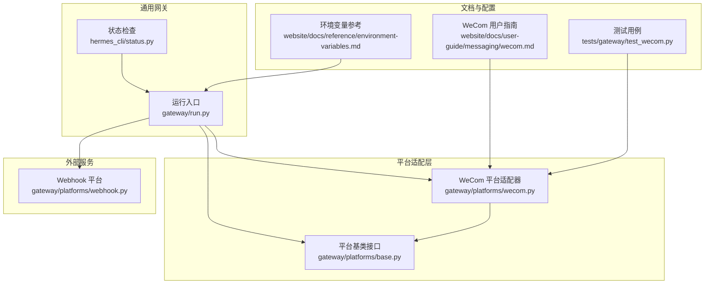
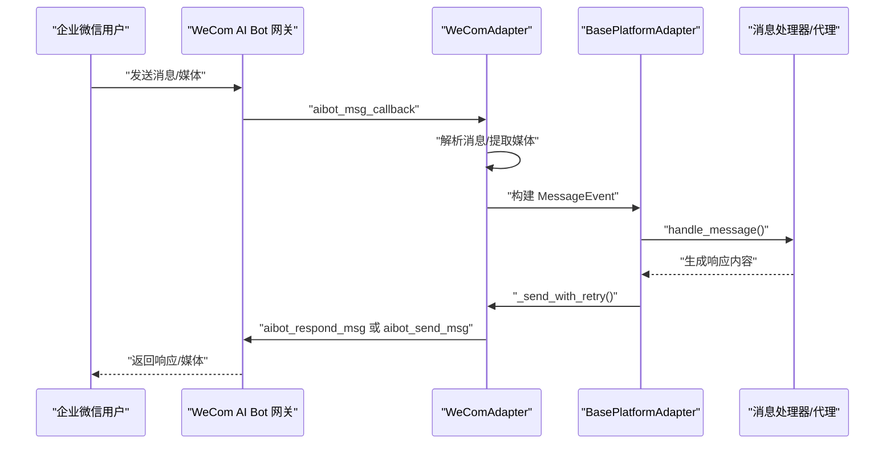
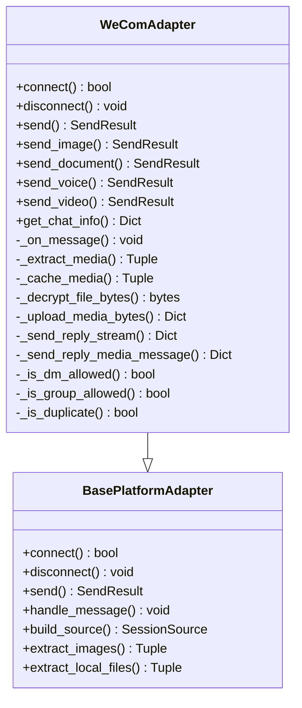
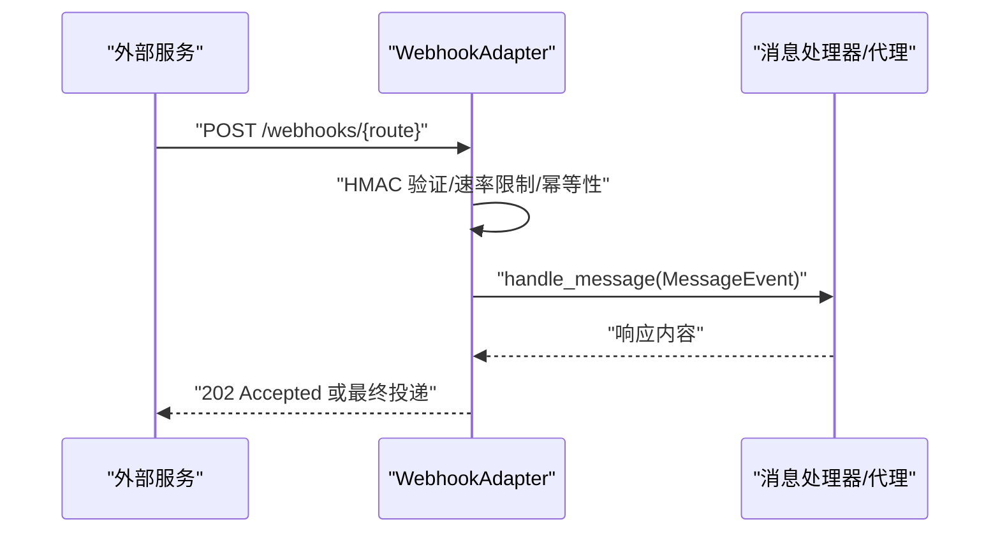
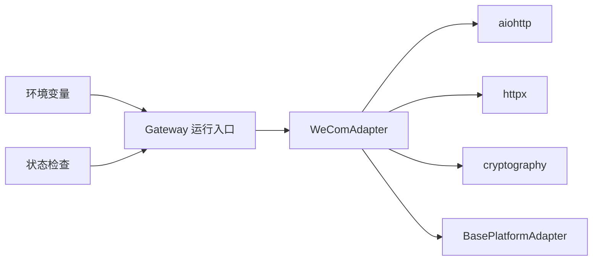

# 企业微信集成

<cite>
**本文引用的文件**
- [wecom.py](file://gateway/platforms/wecom.py)
- [base.py](file://gateway/platforms/base.py)
- [webhook.py](file://gateway/platforms/webhook.py)
- [wecom.md](file://website/docs/user-guide/messaging/wecom.md)
- [environment-variables.md](file://website/docs/reference/environment-variables.md)
- [test_wecom.py](file://tests/gateway/test_wecom.py)
- [run.py](file://gateway/run.py)
- [status.py](file://hermes_cli/status.py)
</cite>

## 目录
1. [简介](#简介)
2. [项目结构](#项目结构)
3. [核心组件](#核心组件)
4. [架构总览](#架构总览)
5. [详细组件分析](#详细组件分析)
6. [依赖关系分析](#依赖关系分析)
7. [性能考虑](#性能考虑)
8. [故障排查指南](#故障排查指南)
9. [结论](#结论)
10. [附录](#附录)

## 简介
本文件为企业微信（WeCom）集成的完整技术文档，基于代码库中的 WeCom 平台适配器与相关基础设施，系统阐述以下主题：
- 企业微信 Webhook 与 Server 酱推送机制（通过通用 Webhook 平台）
- 消息接收与事件处理流程
- 应用配置（企业ID、应用Secret、回调URL等）
- 客户联系与消息发送能力
- 组织架构集成（部门树同步与权限继承）
- 多媒体消息处理（图片、视频、文件上传下载）
- 会话存档与合规要求
- 机器人配置与群聊管理
- 错误处理与日志记录
- 安全配置与性能优化建议

本指南兼顾非技术读者，提供从安装到运维的全流程说明。

## 项目结构
WeCom 集成由以下关键模块构成：
- 平台适配器：负责与企业微信 AI Bot WebSocket 网关通信、消息解析与发送
- 基类平台接口：统一消息事件模型、发送结果、重试与生命周期钩子
- 通用 Webhook 平台：用于对接外部服务的 Webhook 推送与 Server 酱推送
- 文档与环境变量参考：官方用户指南与环境变量清单
- 测试用例：覆盖策略校验、媒体处理与上传流程
- 运行时与状态：平台运行状态检查与环境变量映射

**图表来源**
- [wecom.py](file://gateway/platforms/wecom.py)
- [base.py](file://gateway/platforms/base.py)
- [webhook.py](file://gateway/platforms/webhook.py)
- [run.py](file://gateway/run.py)
- [status.py](file://hermes_cli/status.py)
- [wecom.md](file://website/docs/user-guide/messaging/wecom.md)
- [environment-variables.md](file://website/docs/reference/environment-variables.md)
- [test_wecom.py](file://tests/gateway/test_wecom.py)

**章节来源**
- [wecom.py](file://gateway/platforms/wecom.py)
- [base.py](file://gateway/platforms/base.py)
- [webhook.py](file://gateway/platforms/webhook.py)
- [wecom.md](file://website/docs/user-guide/messaging/wecom.md)
- [environment-variables.md](file://website/docs/reference/environment-variables.md)
- [test_wecom.py](file://tests/gateway/test_wecom.py)
- [run.py](file://gateway/run.py)
- [status.py](file://hermes_cli/status.py)

## 核心组件
- WeCom 平台适配器（WeComAdapter）
  - WebSocket 认证与持久连接
  - 入站消息解析（文本、混合、图片、文件、语音、引用上下文）
  - 出站消息发送（Markdown、图片、文件、语音、视频）
  - 媒体下载与缓存（本地路径供工具链使用）
  - AES 加密媒体自动解密
  - 回复模式流式响应（关联原始请求ID）
  - 去重与自动重连
- 平台基类（BasePlatformAdapter）
  - 统一的消息事件模型与发送结果
  - 发送重试与降级回退
  - 生命周期钩子与后台任务管理
  - 图片/音频/文档缓存工具
- 通用 Webhook 平台（WebhookAdapter）
  - HTTP 服务器接收 Webhook
  - HMAC 签名验证与速率限制
  - 动态路由与幂等性
  - 跨平台投递（如 Telegram、Discord 等）

**章节来源**
- [wecom.py](file://gateway/platforms/wecom.py)
- [base.py](file://gateway/platforms/base.py)
- [webhook.py](file://gateway/platforms/webhook.py)

## 架构总览
WeCom 采用 AI Bot WebSocket 网关进行双向通信，无需公网 Webhook。消息在适配器中解析后转换为统一的 MessageEvent，交由消息处理器执行业务逻辑，再通过适配器发送响应。通用 Webhook 平台独立于 WeCom，用于接收外部服务事件并触发代理运行。

**图表来源**
- [wecom.py](file://gateway/platforms/wecom.py)
- [base.py](file://gateway/platforms/base.py)

## 详细组件分析

### WeCom 平台适配器（WeComAdapter）
- 连接与认证
  - 使用 bot_id 与 secret 通过 aibot_subscribe 认证
  - 心跳保活与指数退避重连
  - 连接状态与致命错误标记
- 消息接收与解析
  - 支持文本、混合（文本+图片）、图片、文件、语音、引用回复
  - 自动去重（5分钟窗口，最大1000条）
  - 引用上下文保留（quote）
- 媒体处理
  - 下载并缓存图片/文件至本地，便于视觉/文档工具使用
  - 支持 AES-256-CBC 解密（PKCS#7 填充）
  - 自动降级：超限自动转为文件发送
- 发送与回复
  - Markdown 文本发送（最大4000字符）
  - 原生图片/文件/语音/视频发送
  - 回复模式：关联原始请求ID进行流式回复
- 策略控制
  - DM 策略：开放、白名单、禁用、配对
  - 群组策略：开放、白名单、禁用
  - 按群组发送者白名单（支持通配符与前缀）
- 错误处理
  - WeCom 返回码映射为可读错误
  - 网络瞬时错误自动重试
  - 超时与格式化失败的降级回退

**图表来源**
- [wecom.py](file://gateway/platforms/wecom.py)
- [base.py](file://gateway/platforms/base.py)

**章节来源**
- [wecom.py](file://gateway/platforms/wecom.py)
- [base.py](file://gateway/platforms/base.py)
- [test_wecom.py](file://tests/gateway/test_wecom.py)

### 通用 Webhook 平台（WebhookAdapter）
- 提供 HTTP 服务器接收外部 Webhook
- HMAC 签名验证（GitHub/GitLab/通用）
- 速率限制与幂等性（按 delivery_id）
- 动态路由热加载（JSON 文件）
- 跨平台投递（如 Telegram、Discord 等）

**图表来源**
- [webhook.py](file://gateway/platforms/webhook.py)

**章节来源**
- [webhook.py](file://gateway/platforms/webhook.py)

### 平台基类（BasePlatformAdapter）
- 统一的消息事件模型（MessageEvent）
- 发送结果封装（SendResult）
- 发送重试与降级回退策略
- 图片/音频/文档缓存工具
- 生命周期钩子与后台任务管理

**章节来源**
- [base.py](file://gateway/platforms/base.py)

## 依赖关系分析
- WeComAdapter 依赖
  - aiohttp/httpx：WebSocket 与 HTTP 下载
  - cryptography：媒体解密（可选）
  - 工具链：URL 安全检查、缓存目录管理
- 运行时依赖
  - 环境变量映射：WECOM_BOT_ID/WECOM_SECRET/WECOM_WEBSOCKET_URL 等
  - 平台运行状态检查与配置注入

**图表来源**
- [wecom.py](file://gateway/platforms/wecom.py)
- [run.py](file://gateway/run.py)
- [status.py](file://hermes_cli/status.py)
- [environment-variables.md](file://website/docs/reference/environment-variables.md)

**章节来源**
- [wecom.py](file://gateway/platforms/wecom.py)
- [run.py](file://gateway/run.py)
- [status.py](file://hermes_cli/status.py)
- [environment-variables.md](file://website/docs/reference/environment-variables.md)

## 性能考虑
- 连接与重连
  - 心跳间隔 30 秒，指数退避重连，避免频繁抖动
  - 断线后失败所有待处理请求，防止挂起
- 媒体处理
  - 分块上传（512KB/块），最多 100 块
  - 超限时自动降级为文件发送，避免丢消息
- 缓存与去重
  - 去重窗口 300 秒，最大 1000 条，降低重复处理成本
  - 图片/音频/文档缓存定期清理（默认 24 小时）
- 发送重试
  - 瞬时网络错误自动指数退避重试
  - 超时与格式化错误降级为纯文本回退

**章节来源**
- [wecom.py](file://gateway/platforms/wecom.py)
- [base.py](file://gateway/platforms/base.py)

## 故障排查指南
常见问题与解决步骤：
- 缺少依赖
  - aiohttp/httpx 未安装：安装对应包后重启
- 认证失败
  - bot_id/secret 错误或网络不可达：核对凭据与外网连通性
- 媒体解密失败
  - 缺少 cryptography：安装后重试
- 语音/图片自动降级
  - 非 AMR 格式或超限：调整格式或拆分文件
- 连接中断
  - 检查日志中的重连信息；确认 WebSocket 地址可达
- 策略不生效
  - 核对 dm_policy/group_policy 及 allowlist 配置

**章节来源**
- [wecom.md](file://website/docs/user-guide/messaging/wecom.md)
- [wecom.py](file://gateway/platforms/wecom.py)

## 结论
WeCom 集成通过 WebSocket 网关实现了低延迟、高可靠的企业微信消息通道，配合统一的平台基类与通用 Webhook 平台，能够满足企业内部消息、外部事件接入与多媒体处理的多样化需求。通过完善的策略控制、媒体处理与错误恢复机制，可在生产环境中稳定运行。

## 附录

### 企业微信应用配置（Bot）
- 在企业微信管理后台创建 AI Bot，获取 Bot ID 与 Secret
- 设置环境变量或在配置文件中启用平台
- 可选：限制访问（DM/群组策略与发送者白名单）
- 可选：自定义 WebSocket 网关地址

**章节来源**
- [wecom.md](file://website/docs/user-guide/messaging/wecom.md)
- [environment-variables.md](file://website/docs/reference/environment-variables.md)

### 客户联系与消息发送
- 适配器支持主动发送 Markdown 文本、图片、文件、语音、视频
- 支持回复模式（关联原始请求ID）与流式响应
- 对于超限媒体自动降级为文件发送

**章节来源**
- [wecom.py](file://gateway/platforms/wecom.py)

### 组织架构集成（部门树同步与权限继承）
- 当前适配器未直接提供企业微信组织架构同步能力
- 建议通过企业微信 API 或第三方工具实现组织树同步，再结合平台策略进行权限继承与访问控制

[本节为概念性说明，不直接分析具体源文件]

### 多媒体消息处理（图片、视频、文件）
- 入站：自动下载并缓存图片/文件；语音转文本抽取；混合消息解析；引用媒体提取
- 出站：原生类型发送；超限自动降级；分块上传协议

**章节来源**
- [wecom.py](file://gateway/platforms/wecom.py)

### 会话存档与合规
- 适配器具备去重与幂等性（delivery_id）以减少重复处理
- 建议结合企业微信侧的会话存档与合规策略，确保满足审计与数据留存要求

[本节为概念性说明，不直接分析具体源文件]

### 机器人配置与群聊管理
- 支持 DM 与群组消息
- 策略：开放/白名单/禁用/配对
- 群组内发送者白名单（支持通配符与前缀）

**章节来源**
- [wecom.md](file://website/docs/user-guide/messaging/wecom.md)
- [test_wecom.py](file://tests/gateway/test_wecom.py)

### 错误处理与日志记录
- WeCom 返回码映射为可读错误
- 网络瞬时错误自动重试
- 超时与格式化失败降级为纯文本
- 日志记录连接状态变化与重连过程

**章节来源**
- [wecom.py](file://gateway/platforms/wecom.py)
- [base.py](file://gateway/platforms/base.py)

### 安全配置与性能优化建议
- 安全
  - 使用强密码与最小权限原则配置 bot_id/secret
  - 通过 allowlist 控制 DM 与群组交互范围
  - Webhook 使用 HMAC 签名与速率限制
- 性能
  - 合理设置心跳与重连参数
  - 媒体分块上传与缓存清理策略
  - 发送重试与降级回退策略

**章节来源**
- [wecom.md](file://website/docs/user-guide/messaging/wecom.md)
- [webhook.py](file://gateway/platforms/webhook.py)
- [environment-variables.md](file://website/docs/reference/environment-variables.md)