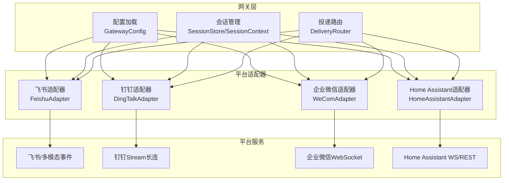
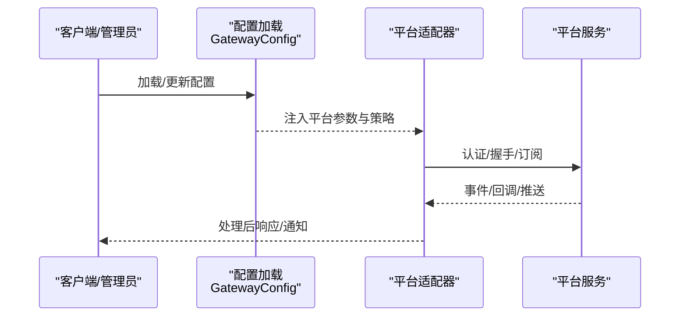
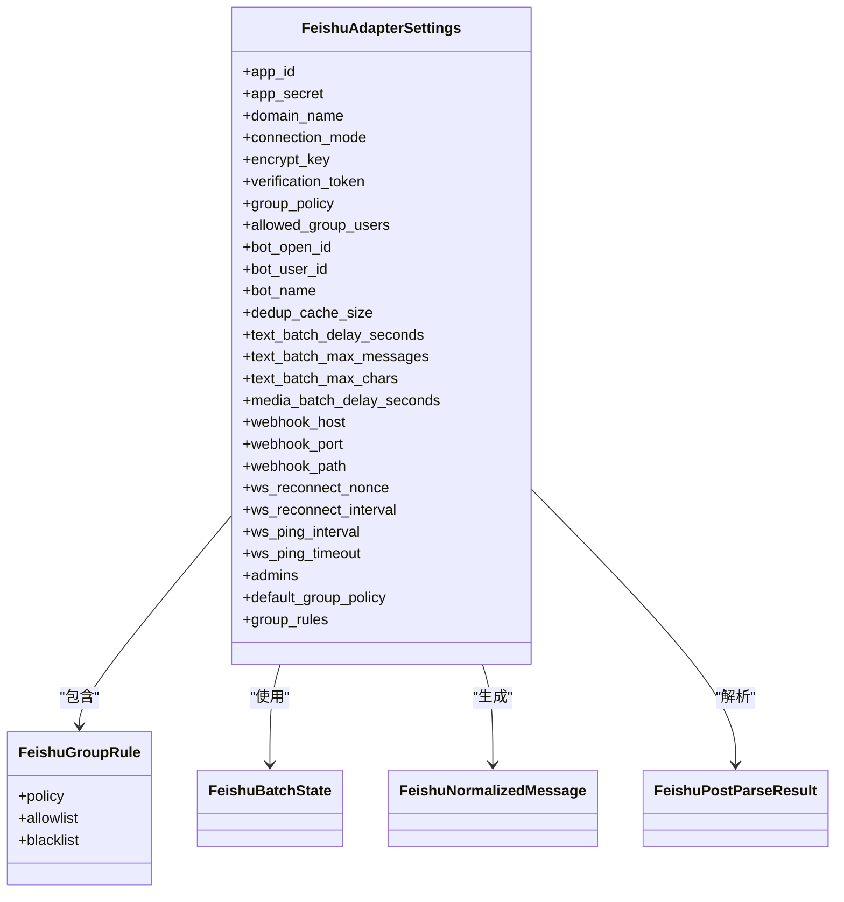
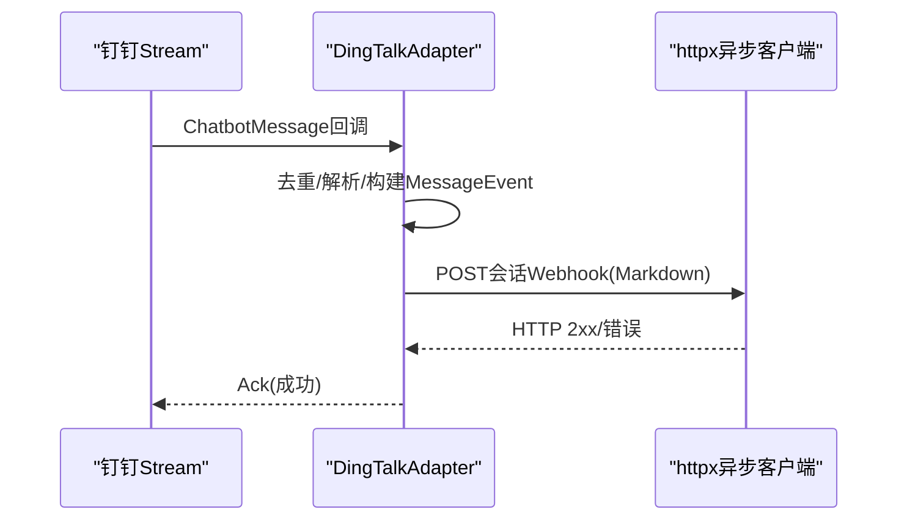
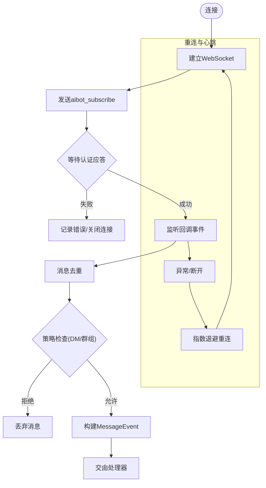
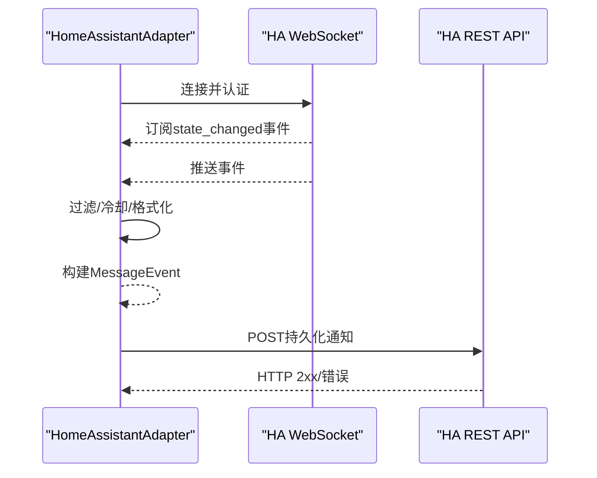
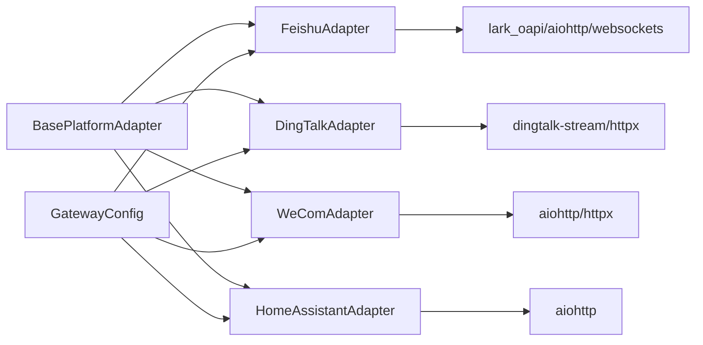

# 企业级平台

<cite>
**本文引用的文件**
- [gateway/platforms/base.py](file://gateway/platforms/base.py)
- [gateway/platforms/feishu.py](file://gateway/platforms/feishu.py)
- [gateway/platforms/dingtalk.py](file://gateway/platforms/dingtalk.py)
- [gateway/platforms/wecom.py](file://gateway/platforms/wecom.py)
- [gateway/platforms/homeassistant.py](file://gateway/platforms/homeassistant.py)
- [gateway/config.py](file://gateway/config.py)
- [gateway/__init__.py](file://gateway/__init__.py)
- [tools/approval.py](file://tools/approval.py)
- [hermes_cli/gateway.py](file://hermes_cli/gateway.py)
- [optional-skills/security/DESCRIPTION.md](file://optional-skills/security/DESCRIPTION.md)
- [website/docs/reference/mcp-config-reference.md](file://website/docs/reference/mcp-config-reference.md)
</cite>

## 目录
1. [简介](#简介)
2. [项目结构](#项目结构)
3. [核心组件](#核心组件)
4. [架构总览](#架构总览)
5. [详细组件分析](#详细组件分析)
6. [依赖关系分析](#依赖关系分析)
7. [性能考量](#性能考量)
8. [故障排除指南](#故障排除指南)
9. [结论](#结论)
10. [附录](#附录)

## 简介
本文件面向企业级消息平台的集成与运维，围绕飞书、钉钉、企业微信与Home Assistant四类平台，系统阐述其适配器设计、认证机制、API 使用方式、组织架构集成、权限与策略、以及跨平台协作与数据同步等主题。同时给出企业部署的安全配置、网络策略与合规建议，并提供故障排除与性能优化指引。

## 项目结构
本项目采用“网关统一入口 + 平台适配器”的分层架构：上层通过统一配置加载与会话管理，下层以平台适配器对接不同企业平台；媒体资源在本地缓存，支持图片、音频、文档三类；平台间通过网关路由进行消息与通知分发。

图表来源
- [gateway/config.py:218-401](file://gateway/config.py#L218-L401)
- [gateway/platforms/base.py:470-662](file://gateway/platforms/base.py#L470-L662)
- [gateway/platforms/feishu.py:1-120](file://gateway/platforms/feishu.py#L1-L120)
- [gateway/platforms/dingtalk.py:68-120](file://gateway/platforms/dingtalk.py#L68-L120)
- [gateway/platforms/wecom.py:142-214](file://gateway/platforms/wecom.py#L142-L214)
- [gateway/platforms/homeassistant.py:51-139](file://gateway/platforms/homeassistant.py#L51-L139)

章节来源
- [gateway/__init__.py:1-36](file://gateway/__init__.py#L1-L36)
- [gateway/config.py:48-66](file://gateway/config.py#L48-L66)

## 核心组件
- 统一基类与消息模型
  - 基类适配器定义了连接、断开、发送、处理消息的标准接口，内置重试、去重、类型化消息事件与媒体提取能力。
  - 消息事件与发送结果抽象，支持文本、图片、音频、视频、文档、语音、命令等多种类型。
- 配置与会话
  - 平台配置支持启用状态、令牌、额外参数、主页通道、回复线程策略等；会话隔离策略可按用户或线程维度控制。
- 能力扩展点
  - 生命周期钩子（处理开始/完成）、打字指示、媒体自动转写与TTS、人类节奏延迟等。

章节来源
- [gateway/platforms/base.py:367-468](file://gateway/platforms/base.py#L367-L468)
- [gateway/platforms/base.py:470-662](file://gateway/platforms/base.py#L470-L662)
- [gateway/platforms/base.py:1138-1511](file://gateway/platforms/base.py#L1138-L1511)
- [gateway/config.py:140-184](file://gateway/config.py#L140-L184)
- [gateway/config.py:218-401](file://gateway/config.py#L218-L401)

## 架构总览
下图展示从配置到平台适配器、再到平台服务的端到端调用链路与关键安全与策略节点。

图表来源
- [gateway/config.py:415-662](file://gateway/config.py#L415-L662)
- [gateway/platforms/base.py:598-632](file://gateway/platforms/base.py#L598-L632)

## 详细组件分析

### 飞书（Lark）平台适配器
- 支持能力
  - WebSocket 与 Webhook 双通道；群聊/私聊消息收发；富文本/卡片解析；媒体缓存；去重与回执；交互卡片按钮事件转为命令事件。
- 认证与接入
  - 通过 lark_oapi 客户端进行消息发送与资源上传；支持校验 token 的二次鉴权层。
- 组织架构与权限
  - 提供组规则（开放/白名单/黑名单/管理员/禁用）与用户/群策略；支持按群覆盖策略。
- 关键要点
  - 文档/图片/音频/视频上传类型与扩展名映射；批量发送窗口与字符限制；速率限制与异常追踪；消息去重窗口与回复上下文保留。
- 企业特性
  - 交互卡片用于审批/查询等场景；合并转发/分享聊天等富内容形态解析。

图表来源
- [gateway/platforms/feishu.py:252-295](file://gateway/platforms/feishu.py#L252-L295)
- [gateway/platforms/feishu.py:281-288](file://gateway/platforms/feishu.py#L281-L288)
- [gateway/platforms/feishu.py:291-295](file://gateway/platforms/feishu.py#L291-L295)
- [gateway/platforms/feishu.py:240-249](file://gateway/platforms/feishu.py#L240-L249)
- [gateway/platforms/feishu.py:421-449](file://gateway/platforms/feishu.py#L421-L449)

章节来源
- [gateway/platforms/feishu.py:1-120](file://gateway/platforms/feishu.py#L1-L120)
- [gateway/platforms/feishu.py:158-170](file://gateway/platforms/feishu.py#L158-L170)
- [gateway/platforms/feishu.py:281-288](file://gateway/platforms/feishu.py#L281-L288)
- [gateway/platforms/feishu.py:413-449](file://gateway/platforms/feishu.py#L413-L449)
- [gateway/platforms/feishu.py:608-659](file://gateway/platforms/feishu.py#L608-L659)

### 钉钉（DingTalk）平台适配器
- 支持能力
  - Stream 模式长连接收消息；基于会话 Webhook 回复；消息去重窗口；最大消息长度限制。
- 认证与接入
  - 依赖 dingtalk-stream 与 httpx；需配置客户端 ID/Secret。
- 企业特性
  - 适合群聊与工作通知场景；支持会话上下文路由与快速回复。

图表来源
- [gateway/platforms/dingtalk.py:68-120](file://gateway/platforms/dingtalk.py#L68-L120)
- [gateway/platforms/dingtalk.py:175-231](file://gateway/platforms/dingtalk.py#L175-L231)
- [gateway/platforms/dingtalk.py:266-301](file://gateway/platforms/dingtalk.py#L266-L301)

章节来源
- [gateway/platforms/dingtalk.py:59-120](file://gateway/platforms/dingtalk.py#L59-L120)
- [gateway/platforms/dingtalk.py:175-231](file://gateway/platforms/dingtalk.py#L175-L231)
- [gateway/platforms/dingtalk.py:266-301](file://gateway/platforms/dingtalk.py#L266-L301)

### 企业微信（WeCom）平台适配器
- 支持能力
  - AI Bot WebSocket 网关；订阅/回调/心跳；媒体下载与缓存；消息去重与回复请求 ID 映射；支持混合消息与语音识别文本化。
- 认证与接入
  - 通过 aibot_subscribe 认证；支持 ping 心跳；失败自动重连。
- 权限与策略
  - DM/群组策略（开放/白名单/禁用），支持按群覆盖；允许通配符策略。
- 企业特性
  - 适合企业内部沟通与知识检索；支持图片/文件/语音等多媒体；可与企业组织架构结合做访问控制。

图表来源
- [gateway/platforms/wecom.py:179-214](file://gateway/platforms/wecom.py#L179-L214)
- [gateway/platforms/wecom.py:281-304](file://gateway/platforms/wecom.py#L281-L304)
- [gateway/platforms/wecom.py:305-330](file://gateway/platforms/wecom.py#L305-L330)
- [gateway/platforms/wecom.py:345-363](file://gateway/platforms/wecom.py#L345-L363)
- [gateway/platforms/wecom.py:462-522](file://gateway/platforms/wecom.py#L462-L522)

章节来源
- [gateway/platforms/wecom.py:108-111](file://gateway/platforms/wecom.py#L108-L111)
- [gateway/platforms/wecom.py:142-214](file://gateway/platforms/wecom.py#L142-L214)
- [gateway/platforms/wecom.py:462-522](file://gateway/platforms/wecom.py#L462-L522)
- [gateway/platforms/wecom.py:704-721](file://gateway/platforms/wecom.py#L704-L721)

### Home Assistant 平台适配器
- 支持能力
  - 连接 HA WebSocket，订阅 state_changed 事件；按域/实体过滤与冷却时间；将状态变更转换为消息事件；通过 REST API 发送持久化通知。
- 认证与接入
  - 通过 Long-Lived Access Token 认证；支持配置 URL 与冷却时间。
- 企业特性
  - 设备监控与自动化联动的理想入口；可与智能体结合实现“状态驱动”的告警与处置。

图表来源
- [gateway/platforms/homeassistant.py:101-139](file://gateway/platforms/homeassistant.py#L101-L139)
- [gateway/platforms/homeassistant.py:140-185](file://gateway/platforms/homeassistant.py#L140-L185)
- [gateway/platforms/homeassistant.py:217-261](file://gateway/platforms/homeassistant.py#L217-L261)
- [gateway/platforms/homeassistant.py:262-318](file://gateway/platforms/homeassistant.py#L262-L318)
- [gateway/platforms/homeassistant.py:386-438](file://gateway/platforms/homeassistant.py#L386-L438)

章节来源
- [gateway/platforms/homeassistant.py:42-49](file://gateway/platforms/homeassistant.py#L42-L49)
- [gateway/platforms/homeassistant.py:65-91](file://gateway/platforms/homeassistant.py#L65-L91)
- [gateway/platforms/homeassistant.py:262-318](file://gateway/platforms/homeassistant.py#L262-L318)
- [gateway/platforms/homeassistant.py:386-438](file://gateway/platforms/homeassistant.py#L386-L438)

## 依赖关系分析
- 平台适配器对平台 SDK 的依赖
  - 飞书：lark_oapi（消息/资源）、websockets/aiohttp（长连/Webhook）
  - 钉钉：dingtalk-stream、httpx
  - 企业微信：aiohttp、httpx
  - Home Assistant：aiohttp
- 基类适配器的通用能力
  - 媒体缓存（图片/音频/文档）、消息去重、重试与降级、生命周期钩子、打字指示与人类节奏延迟。
- 配置与运行时状态
  - 平台启用/令牌/主页通道/会话重置策略/流式传输等；运行状态写入与致命错误上报。

图表来源
- [gateway/platforms/base.py:470-662](file://gateway/platforms/base.py#L470-L662)
- [gateway/config.py:218-401](file://gateway/config.py#L218-L401)
- [gateway/platforms/feishu.py:37-86](file://gateway/platforms/feishu.py#L37-L86)
- [gateway/platforms/dingtalk.py:28-42](file://gateway/platforms/dingtalk.py#L28-L42)
- [gateway/platforms/wecom.py:47-60](file://gateway/platforms/wecom.py#L47-L60)
- [gateway/platforms/homeassistant.py:24-30](file://gateway/platforms/homeassistant.py#L24-L30)

章节来源
- [gateway/platforms/base.py:1138-1511](file://gateway/platforms/base.py#L1138-L1511)
- [gateway/config.py:257-290](file://gateway/config.py#L257-L290)

## 性能考量
- 去重与速率控制
  - 飞书/企业微信均设置去重窗口与速率限制；钉钉/飞书提供批量发送窗口与字符上限，避免触发平台限流。
- 重连与心跳
  - 企业微信采用指数退避重连与应用层 ping；Home Assistant 事件监听具备自动重连与冷却。
- 媒体处理
  - 本地缓存图片/音频/文档，避免平台 URL 过期与跨域问题；按扩展名与 MIME 类型选择发送路径。
- 流式输出与人类节奏
  - 基类提供流式编辑与人类节奏延迟，改善用户体验并降低平台压力。

章节来源
- [gateway/platforms/feishu.py:158-170](file://gateway/platforms/feishu.py#L158-L170)
- [gateway/platforms/wecom.py:93-96](file://gateway/platforms/wecom.py#L93-L96)
- [gateway/platforms/wecom.py:345-363](file://gateway/platforms/wecom.py#L345-L363)
- [gateway/platforms/homeassistant.py:217-246](file://gateway/platforms/homeassistant.py#L217-L246)
- [gateway/platforms/base.py:1228-1247](file://gateway/platforms/base.py#L1228-L1247)

## 故障排除指南
- 常见错误与定位
  - 连接失败/认证失败：检查令牌/密钥是否正确、环境变量是否生效、平台 SDK 是否安装。
  - 传输超时/网络错误：区分“可重试”与“不可重试”错误；对可重试错误自动重试，非可重试错误尝试纯文本回退。
  - 飞书/企业微信 Webhook 异常：关注异常阈值与跟踪窗口，排查回调频率与平台侧限制。
- 审批与权限
  - 对危险命令采用审批流程，支持一次性/会话/永久三种授权范围；审批状态可通过网关回调或待处理队列管理。
- 日志与状态
  - 基类适配器在连接/断开/致命错误时写入运行状态，便于运维观察。

章节来源
- [gateway/platforms/base.py:1021-1039](file://gateway/platforms/base.py#L1021-L1039)
- [gateway/platforms/base.py:1040-1121](file://gateway/platforms/base.py#L1040-L1121)
- [gateway/platforms/feishu.py:165-167](file://gateway/platforms/feishu.py#L165-L167)
- [tools/approval.py:810-841](file://tools/approval.py#L810-L841)

## 结论
该平台通过统一的适配器框架与配置体系，实现了飞书、钉钉、企业微信与Home Assistant的标准化接入。在企业级场景中，适配器提供了认证、权限、消息处理、媒体与自动化等关键能力，并通过去重、重连、速率控制与审批流程保障稳定性与安全性。建议在生产部署中结合平台特性完善网络策略、密钥管理与合规审计。

## 附录

### 企业部署的安全配置与合规
- 密钥与令牌管理
  - 使用环境变量注入令牌；避免硬编码；对敏感字段进行日志脱敏。
- OAuth 与 MCP 服务器
  - 对需要 OAuth 的 HTTP 服务器，采用 OAuth 2.1 PKCE 流程，令牌持久化与自动刷新。
- 平台特定安全
  - 飞书/企业微信：启用校验 token 的二次鉴权；钉钉：确保会话 Webhook 地址可信；Home Assistant：仅在内网或受控网络访问。

章节来源
- [website/docs/reference/mcp-config-reference.md:231-248](file://website/docs/reference/mcp-config-reference.md#L231-L248)
- [gateway/platforms/feishu.py:1-16](file://gateway/platforms/feishu.py#L1-L16)
- [gateway/platforms/wecom.py:1-28](file://gateway/platforms/wecom.py#L1-L28)
- [gateway/platforms/dingtalk.py:1-18](file://gateway/platforms/dingtalk.py#L1-L18)
- [gateway/platforms/homeassistant.py:1-13](file://gateway/platforms/homeassistant.py#L1-L13)

### 平台间协作与数据同步
- 会话隔离与线程策略
  - 可按用户/线程维度隔离会话，避免共享上下文导致的串扰。
- 主页通道与投递路由
  - 为各平台配置主页通道，统一 Cron 输出与告警投递目标。
- 审批与权限继承
  - 审批范围（一次性/会话/永久）与平台策略（白名单/黑名单/禁用）可组合使用，形成“平台-群组-用户”三级权限继承。

章节来源
- [gateway/config.py:96-137](file://gateway/config.py#L96-L137)
- [gateway/config.py:218-401](file://gateway/config.py#L218-L401)
- [gateway/platforms/wecom.py:704-734](file://gateway/platforms/wecom.py#L704-L734)
- [tools/approval.py:810-841](file://tools/approval.py#L810-L841)

### 平台新增与配置向导
- 新增平台步骤
  - 在平台目录添加适配器文件；在 CLI 中注册平台信息与设置向导；完善文档与环境变量说明。
- 安全与脱敏
  - 若平台使用敏感标识符（如电话号码），在统一脱敏模块中增加正则与处理逻辑，确保所有日志均被遮蔽。

章节来源
- [gateway/platforms/ADDING_A_PLATFORM.md:234-280](file://gateway/platforms/ADDING_A_PLATFORM.md#L234-L280)
- [optional-skills/security/DESCRIPTION.md:1-4](file://optional-skills/security/DESCRIPTION.md#L1-L4)
- [hermes_cli/gateway.py:234-280](file://hermes_cli/gateway.py#L234-L280)