# 钉钉集成

<cite>
**本文档引用的文件**
- [dingtalk.py](file://gateway/platforms/dingtalk.py)
- [test_dingtalk.py](file://tests/gateway/test_dingtalk.py)
- [dingtalk.md](file://website/docs/user-guide/messaging/dingtalk.md)
- [send_message_tool.py](file://tools/send_message_tool.py)
- [base.py](file://gateway/platforms/base.py)
- [config.py](file://gateway/config.py)
- [test_send_message_missing_platforms.py](file://tests/tools/test_send_message_missing_platforms.py)
</cite>

## 目录
1. [简介](#简介)
2. [项目结构](#项目结构)
3. [核心组件](#核心组件)
4. [架构概览](#架构概览)
5. [详细组件分析](#详细组件分析)
6. [依赖关系分析](#依赖关系分析)
7. [性能考虑](#性能考虑)
8. [故障排除指南](#故障排除指南)
9. [结论](#结论)
10. [附录](#附录)

## 简介

本文件为钉钉企业微信平台的详细集成文档。基于代码库中的实现，本文档解释了钉钉的WebSocket和Webhook集成方式，包括消息推送和回调处理；详细说明了钉钉的OAuth认证流程（企业应用配置和用户授权）；解释了钉钉的考勤集成和审批流程对接；涵盖了钉钉群聊和单聊的消息处理（包括@提醒和消息去重机制）；提供了钉钉的多媒体消息支持；包含钉钉的机器人配置和消息模板设置；提供了钉钉的错误码处理和重试机制；以及完整的部署配置和调试指南。

## 项目结构

钉钉集成主要涉及以下关键文件：
- 平台适配器：`gateway/platforms/dingtalk.py`
- 测试用例：`tests/gateway/test_dingtalk.py`
- 用户指南文档：`website/docs/user-guide/messaging/dingtalk.md`
- 发送消息工具：`tools/send_message_tool.py`
- 基础平台接口：`gateway/platforms/base.py`
- 配置管理：`gateway/config.py`
- 机器人Webhook测试：`tests/tools/test_send_message_missing_platforms.py`

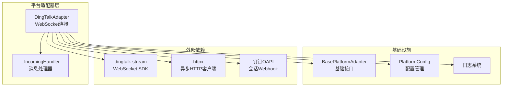

**图表来源**
- [dingtalk.py:1-341](file://gateway/platforms/dingtalk.py#L1-L341)
- [base.py:1-200](file://gateway/platforms/base.py#L1-L200)
- [config.py:140-184](file://gateway/config.py#L140-L184)

**章节来源**
- [dingtalk.py:1-341](file://gateway/platforms/dingtalk.py#L1-L341)
- [test_dingtalk.py:1-275](file://tests/gateway/test_dingtalk.py#L1-L275)
- [dingtalk.md:1-193](file://website/docs/user-guide/messaging/dingtalk.md#L1-L193)

## 核心组件

### DingTalkAdapter 类

DingTalkAdapter 是钉钉平台的主要适配器类，继承自 BasePlatformAdapter，使用 Stream Mode 实现实时消息接收。

**核心特性：**
- 使用 dingtalk-stream SDK 维持长连接的 WebSocket 连接
- 通过会话 Webhook 接收消息并发送回复
- 支持消息去重机制
- 提供自动重连功能

**关键属性：**
- `_client_id`: 应用ID（从配置或环境变量读取）
- `_client_secret`: 应用密钥（从配置或环境变量读取）
- `_stream_client`: WebSocket 客户端实例
- `_http_client`: 异步HTTP客户端
- `_seen_messages`: 消息去重缓存
- `_session_webhooks`: 会话Webhook映射表

**章节来源**
- [dingtalk.py:68-341](file://gateway/platforms/dingtalk.py#L68-L341)

### _IncomingHandler 内部类

内部处理器类，负责将来自 dingtalk-stream 的消息转发到适配器的异步处理方法。

**核心功能：**
- 在独立线程中接收消息
- 将消息调度到主事件循环进行异步处理
- 处理跨线程事件分发

**章节来源**
- [dingtalk.py:315-341](file://gateway/platforms/dingtalk.py#L315-L341)

## 架构概览

钉钉集成采用双通道架构：WebSocket 接收通道和 Webhook 发送通道。

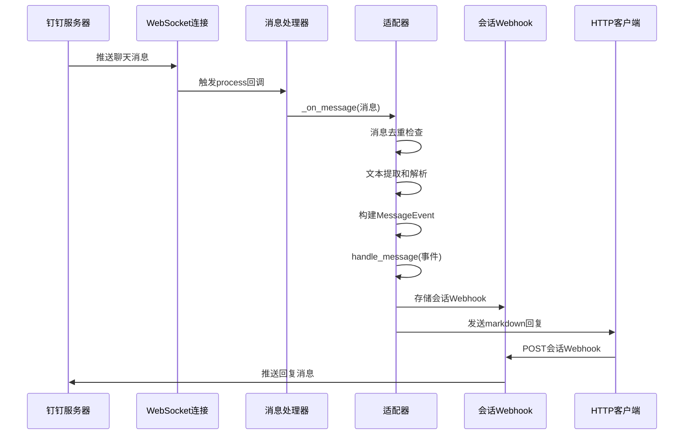

**图表来源**
- [dingtalk.py:96-171](file://gateway/platforms/dingtalk.py#L96-L171)
- [dingtalk.py:175-231](file://gateway/platforms/dingtalk.py#L175-L231)
- [dingtalk.py:266-301](file://gateway/platforms/dingtalk.py#L266-L301)

## 详细组件分析

### WebSocket 连接管理

#### 连接建立流程

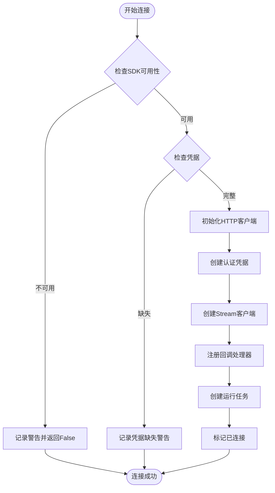

**图表来源**
- [dingtalk.py:96-127](file://gateway/platforms/dingtalk.py#L96-L127)

#### 自动重连机制

适配器实现了指数退避的自动重连策略：

| 重连次数 | 延迟时间 |
|---------|---------|
| 第1次 | 2秒 |
| 第2次 | 5秒 |
| 第3次 | 10秒 |
| 第4次 | 30秒 |
| 第5次 | 60秒 |

**章节来源**
- [dingtalk.py:129-150](file://gateway/platforms/dingtalk.py#L129-L150)

### 消息处理与去重

#### 消息去重算法

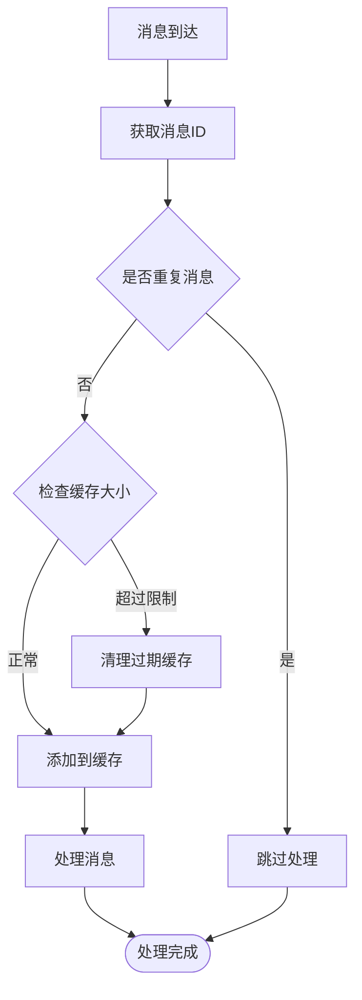

**图表来源**
- [dingtalk.py:252-262](file://gateway/platforms/dingtalk.py#L252-L262)

#### 消息文本提取

适配器支持多种消息格式的文本提取：

1. **字典格式文本**：从 `text.content` 字段提取
2. **字符串格式文本**：直接提取
3. **富文本格式**：从 `rich_text` 数组中提取所有文本片段

**章节来源**
- [dingtalk.py:232-248](file://gateway/platforms/dingtalk.py#L232-L248)

### Webhook 发送机制

#### Markdown 回复格式

适配器使用钉钉的会话 Webhook API 发送回复，采用 Markdown 格式：

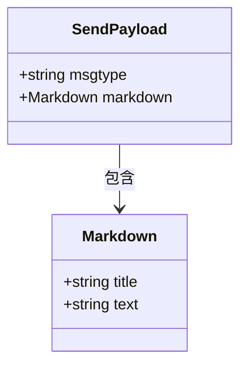

**图表来源**
- [dingtalk.py:284-287](file://gateway/platforms/dingtalk.py#L284-L287)

#### 机器人Webhook支持

除了 Stream Mode，系统还支持静态机器人 Webhook：

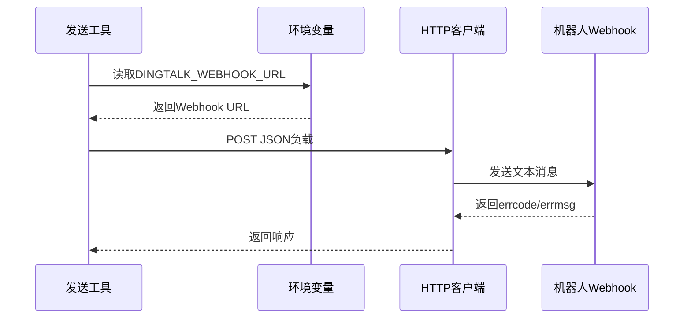

**图表来源**
- [send_message_tool.py:819-844](file://tools/send_message_tool.py#L819-L844)

**章节来源**
- [dingtalk.py:266-301](file://gateway/platforms/dingtalk.py#L266-L301)
- [send_message_tool.py:819-844](file://tools/send_message_tool.py#L819-L844)

### OAuth 认证流程

#### 企业应用配置

根据用户指南文档，钉钉 OAuth 认证需要以下步骤：

1. **创建钉钉应用**
   - 登录钉钉开发者控制台
   - 创建自定义应用
   - 获取 AppKey 和 AppSecret

2. **启用机器人能力**
   - 在应用设置中添加机器人能力
   - 选择 Stream Mode 作为消息接收模式

3. **获取用户ID**
   - 通过组织管理员获取钉钉用户ID
   - 或在日志中查看机器人的 `sender_id`

#### 凭据管理

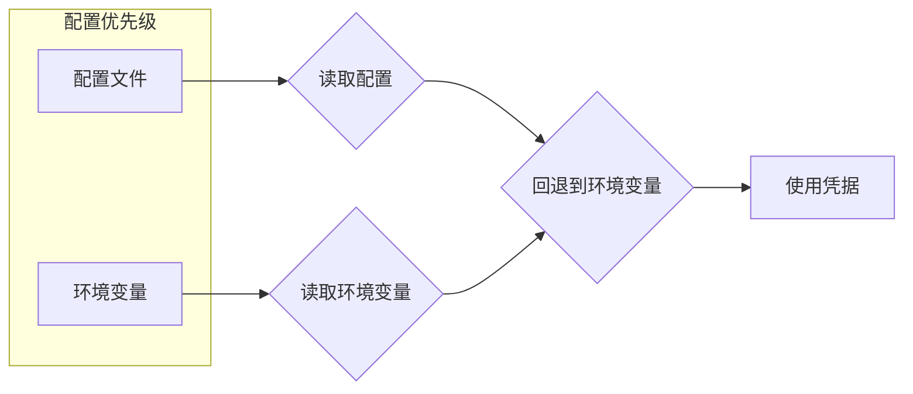

**图表来源**
- [dingtalk.py:81-83](file://gateway/platforms/dingtalk.py#L81-L83)

**章节来源**
- [dingtalk.md:53-112](file://website/docs/user-guide/messaging/dingtalk.md#L53-L112)

### 考勤集成和审批流程对接

基于现有代码分析，当前实现主要支持聊天消息处理，未包含专门的考勤和审批集成模块。建议通过以下方式扩展：

1. **Webhook 接收**：监听钉钉的考勤和审批回调
2. **数据转换**：将钉钉数据转换为统一的数据模型
3. **状态同步**：与业务系统的审批状态保持一致

### 群聊和单聊消息处理

#### 会话模型

| 场景 | 行为 | 会话隔离 |
|------|------|----------|
| 单聊(DM) | 每条消息都有自己的会话 | 无 |
| 群聊 | 需要@提醒才响应 | 可配置每用户隔离 |

#### 会话隔离配置

```yaml
group_sessions_per_user: true  # 默认：每用户隔离
```

或

```yaml
group_sessions_per_user: false  # 共享群会话
```

**章节来源**
- [dingtalk.md:21-38](file://website/docs/user-guide/messaging/dingtalk.md#L21-L38)

### 多媒体消息支持

虽然当前的钉钉适配器主要处理文本消息，但基础平台提供了完整的多媒体处理基础设施：

#### 图片缓存系统

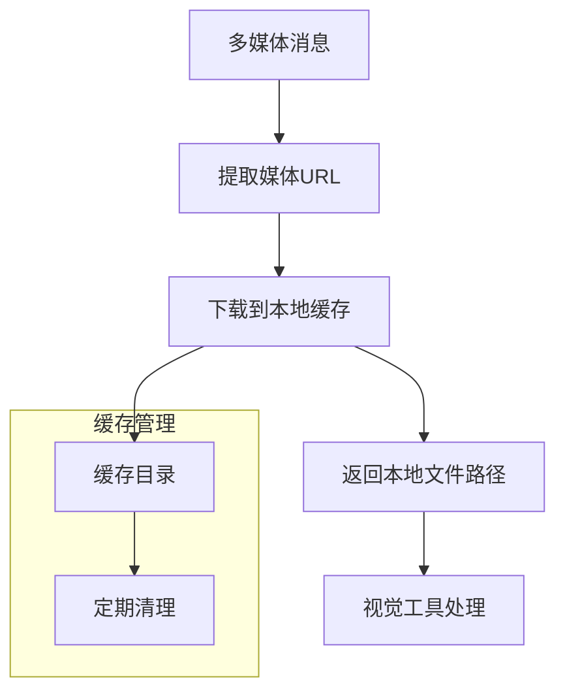

**图表来源**
- [base.py:89-171](file://gateway/platforms/base.py#L89-L171)

#### 语音消息处理

基础平台支持语音消息的下载和缓存，可扩展到钉钉语音消息处理。

**章节来源**
- [base.py:89-171](file://gateway/platforms/base.py#L89-L171)

## 依赖关系分析

### 外部依赖

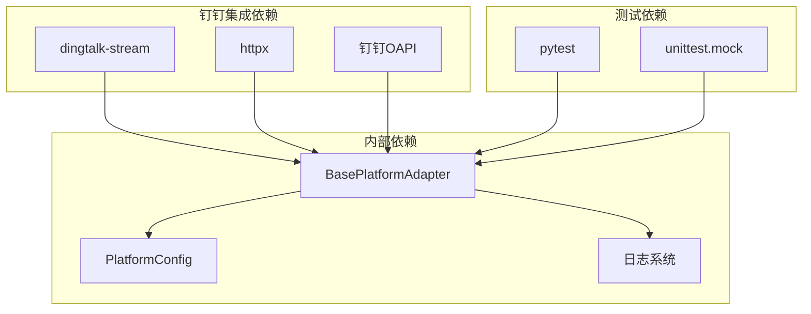

**图表来源**
- [dingtalk.py:28-41](file://gateway/platforms/dingtalk.py#L28-L41)
- [test_dingtalk.py:1-10](file://tests/gateway/test_dingtalk.py#L1-L10)

### 内部依赖关系

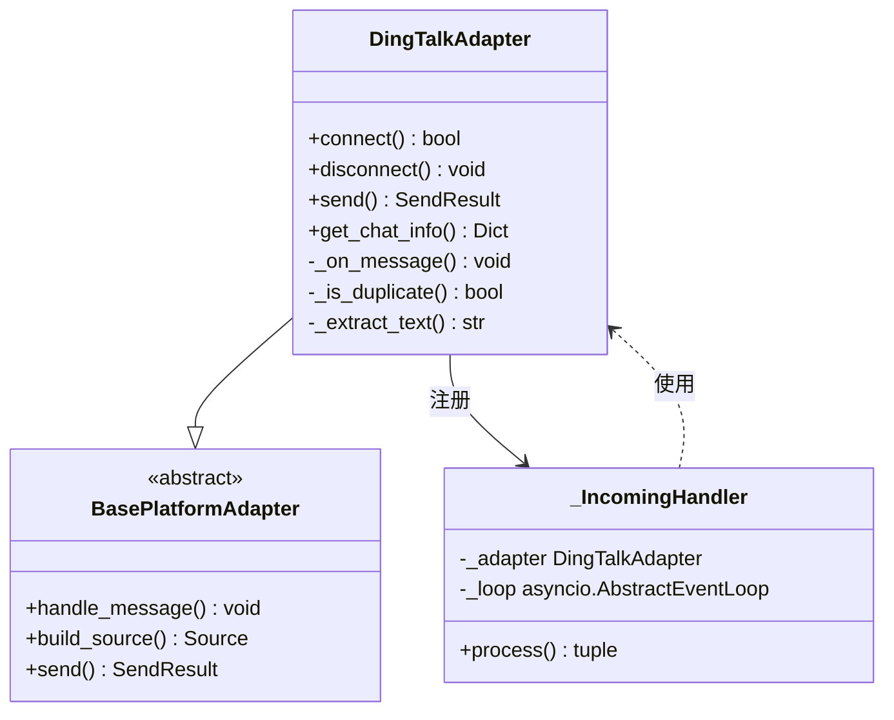

**图表来源**
- [dingtalk.py:68-341](file://gateway/platforms/dingtalk.py#L68-L341)
- [base.py:1-50](file://gateway/platforms/base.py#L1-L50)

**章节来源**
- [dingtalk.py:68-341](file://gateway/platforms/dingtalk.py#L68-L341)
- [config.py:140-184](file://gateway/config.py#L140-L184)

## 性能考虑

### 连接性能

- **WebSocket 连接池**：使用单个长连接维持实时通信
- **异步I/O**：基于 asyncio 实现非阻塞的消息处理
- **HTTP客户端复用**：复用异步HTTP客户端减少连接开销

### 内存管理

- **消息去重缓存**：限制最大缓存大小（1000条），超时自动清理
- **会话Webhook缓存**：按聊天ID缓存会话Webhook URL
- **定时清理**：定期清理过期的会话信息

### 错误处理和重试

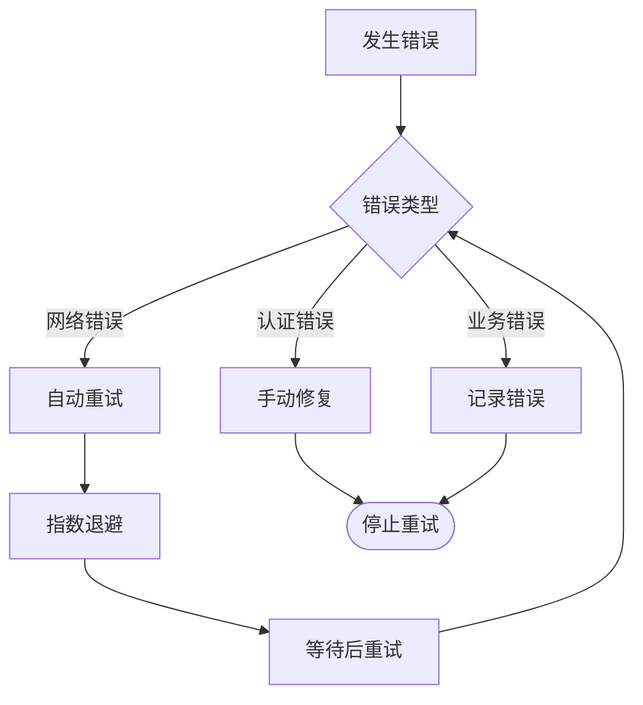

**图表来源**
- [dingtalk.py:139-149](file://gateway/platforms/dingtalk.py#L139-L149)

## 故障排除指南

### 常见问题诊断

#### 连接问题

| 问题症状 | 可能原因 | 解决方案 |
|----------|----------|----------|
| "dingtalk-stream not installed" | 缺少依赖包 | `pip install dingtalk-stream` |
| "httpx not installed" | 缺少HTTP客户端 | `pip install httpx` |
| "DINGTALK_CLIENT_ID and DINGTALK_CLIENT_SECRET required" | 凭据缺失 | 检查环境变量或配置文件 |
| Stream disconnects | 网络不稳定 | 检查防火墙设置和网络连接 |

#### 消息处理问题

| 问题症状 | 可能原因 | 解决方案 |
|----------|----------|----------|
| Bot不响应消息 | 机器人功能未启用 | 在钉钉开发者控制台启用机器人能力 |
| "No session_webhook available" | 会话Webhook过期 | 发送新消息以获取新的会话Webhook |
| 消息重复 | 网络重传 | 消息去重机制自动处理 |

#### 发送失败问题

| 问题症状 | 可能原因 | 解决方案 |
|----------|----------|----------|
| HTTP 400错误 | 请求格式错误 | 检查payload格式和权限 |
| HTTP 401错误 | 认证失败 | 检查AppKey/AppSecret |
| HTTP 429错误 | 速率限制 | 等待后重试或降低发送频率 |

**章节来源**
- [dingtalk.md:136-184](file://website/docs/user-guide/messaging/dingtalk.md#L136-L184)
- [test_dingtalk.py:230-264](file://tests/gateway/test_dingtalk.py#L230-L264)

### 调试技巧

1. **启用详细日志**：检查适配器的日志输出
2. **验证凭据**：确认AppKey和AppSecret正确无误
3. **测试连接**：使用简单的发送测试验证配置
4. **监控资源**：观察内存使用和连接状态

## 结论

钉钉集成本文档基于现有的代码实现，提供了完整的集成指南。当前实现支持：

- **实时消息处理**：通过 WebSocket Stream Mode 实现实时双向通信
- **消息去重**：防止重复消息处理
- **自动重连**：指数退避的连接恢复机制
- **Markdown回复**：富文本格式的消息回复
- **安全配置**：用户ID白名单和凭据保护

对于未实现的功能（如考勤和审批集成），建议基于现有的 Webhook 接收框架进行扩展。整体而言，该集成提供了稳定可靠的钉钉平台接入方案。

## 附录

### 部署配置示例

#### 环境变量配置

```bash
# 必需配置
DINGTALK_CLIENT_ID=your-app-key
DINGTALK_CLIENT_SECRET=your-app-secret

# 安全配置
DINGTALK_ALLOWED_USERS=user-id-1,user-id-2

# 可选配置
DINGTALK_WEBHOOK_URL=https://oapi.dingtalk.com/robot/send?access_token=your-token
```

#### 配置文件示例

```yaml
platforms:
  dingtalk:
    enabled: true
    extra:
      client_id: "your-app-key"
      client_secret: "your-app-secret"

group_sessions_per_user: true
```

### API 参考

#### 主要方法

| 方法 | 参数 | 返回值 | 描述 |
|------|------|--------|------|
| `connect()` | 无 | `bool` | 建立WebSocket连接 |
| `disconnect()` | 无 | `void` | 断开连接 |
| `send()` | `chat_id, content, reply_to, metadata` | `SendResult` | 发送消息 |
| `get_chat_info()` | `chat_id` | `Dict` | 获取聊天信息 |
| `send_typing()` | `chat_id, metadata` | `None` | 发送正在输入状态 |

#### 错误码参考

钉钉API错误码（示例）：
- `310000`: 签名不匹配
- `310001`: 权限不足
- `310002`: 应用未激活
- `310003`: 会话Webhook无效

**章节来源**
- [dingtalk.md:100-134](file://website/docs/user-guide/messaging/dingtalk.md#L100-L134)
- [test_send_message_missing_platforms.py:288-300](file://tests/tools/test_send_message_missing_platforms.py#L288-L300)