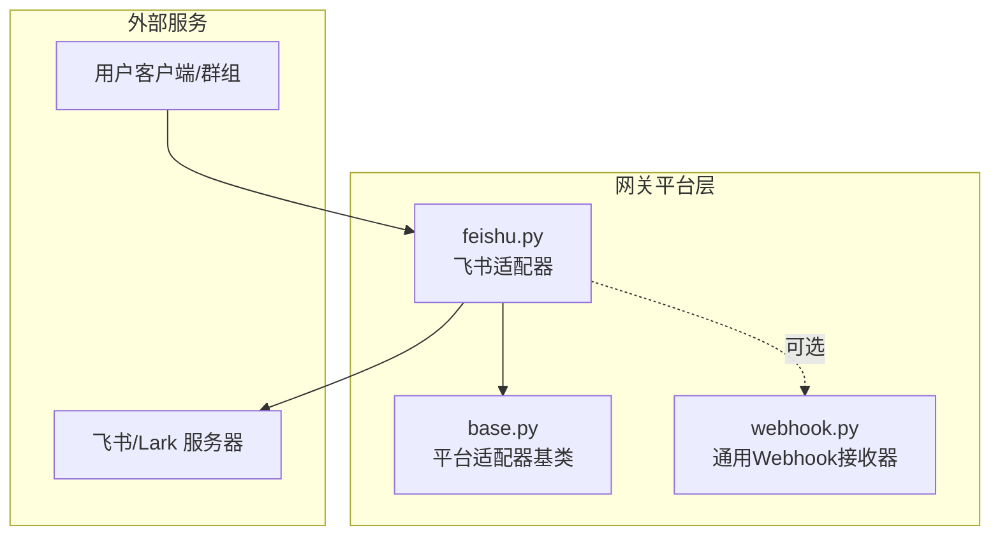
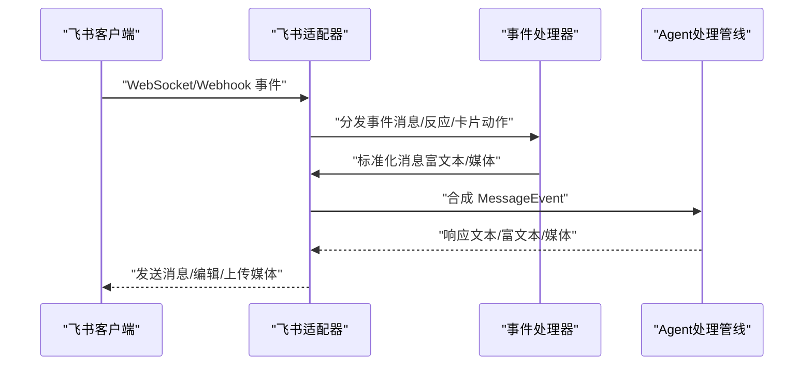
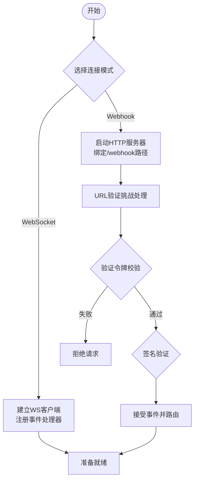
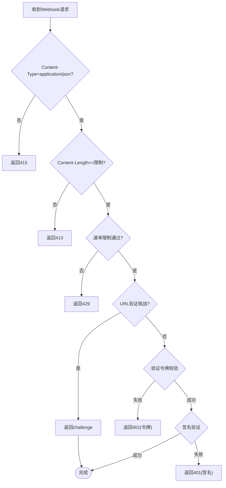
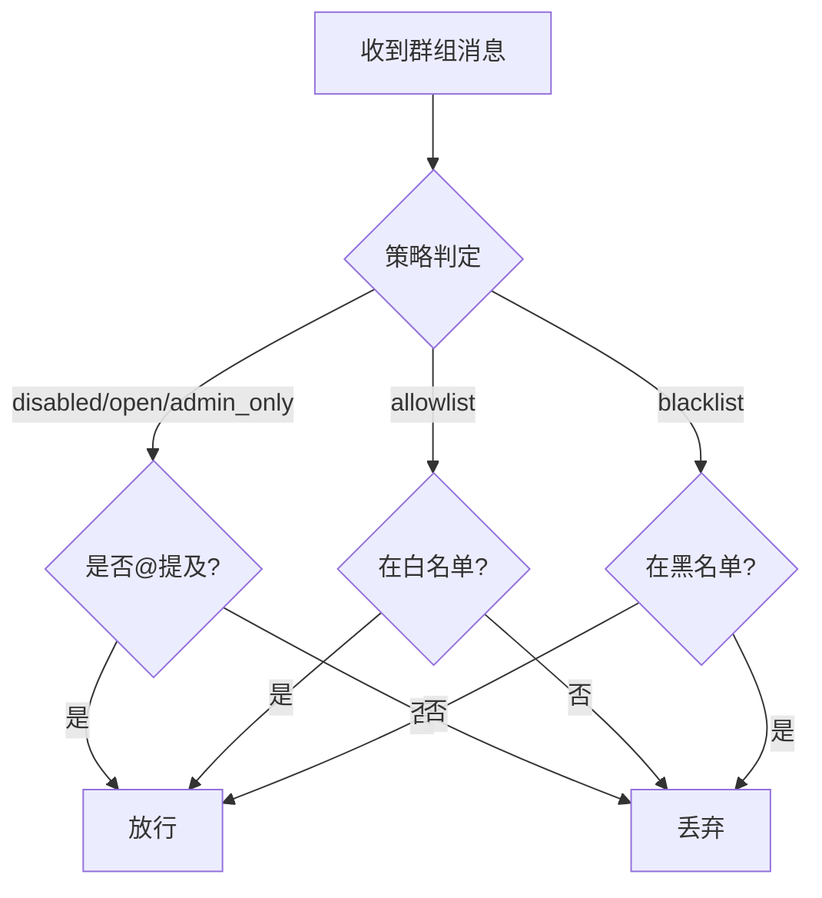
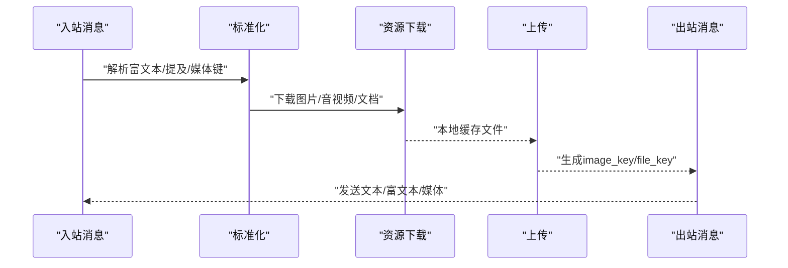
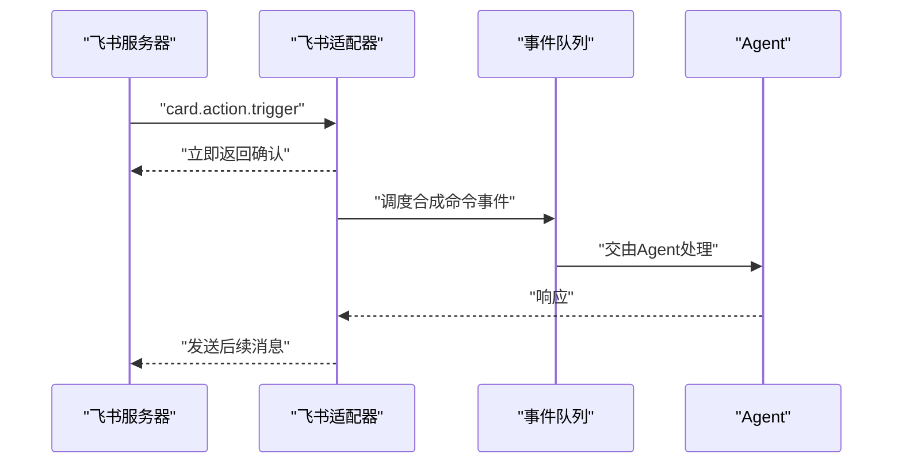
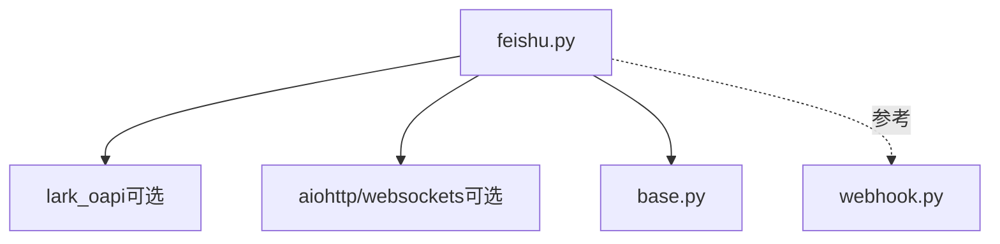

# 飞书集成

<cite>
**本文引用的文件**
- [feishu.py](file://gateway/platforms/feishu.py)
- [base.py](file://gateway/platforms/base.py)
- [webhook.py](file://gateway/platforms/webhook.py)
</cite>

## 目录
1. [简介](#简介)
2. [项目结构](#项目结构)
3. [核心组件](#核心组件)
4. [架构总览](#架构总览)
5. [详细组件分析](#详细组件分析)
6. [依赖分析](#依赖分析)
7. [性能考虑](#性能考虑)
8. [故障排除指南](#故障排除指南)
9. [结论](#结论)
10. [附录](#附录)

## 简介
本文件面向在飞书（Lark）企业微信平台上集成 Hermes Agent 的工程团队与运维人员，系统性阐述以下主题：
- 飞书的 WebSocket 长连接与 Webhook 两种传输模式的接入方式与差异
- 消息接收与发送流程，含富文本、媒体资源下载与本地缓存
- 认证机制：App ID、App Secret、加密密钥、验证令牌的配置要点
- 权限管理：部门权限、用户白名单与黑名单策略
- 富文本消息处理：Markdown 渲染、@ 提及解析、图片与文件上传
- 卡片交互按钮事件路由：合成命令事件的生成与去重
- 反垃圾与速率限制：Webhook 安全与限流策略
- 异常监控与重连策略：告警阈值、异常追踪与连接稳定性

## 项目结构
飞书适配器位于网关平台层，采用“适配器模式”统一抽象不同平台的消息协议与传输方式。核心文件如下：
- gateway/platforms/feishu.py：飞书适配器实现，覆盖认证、消息收发、富文本解析、卡片事件路由、Webhook 安全与限流、权限控制等
- gateway/platforms/base.py：平台适配器基类，定义通用消息模型、发送结果、媒体缓存工具与生命周期接口
- gateway/platforms/webhook.py：通用 Webhook 接收器，用于理解 Webhook 模式下的安全与限流机制

图示来源
- [feishu.py:1012-1225](file://gateway/platforms/feishu.py#L1012-L1225)
- [base.py:470-632](file://gateway/platforms/base.py#L470-L632)
- [webhook.py:65-161](file://gateway/platforms/webhook.py#L65-L161)

章节来源
- [feishu.py:1012-1225](file://gateway/platforms/feishu.py#L1012-L1225)
- [base.py:470-632](file://gateway/platforms/base.py#L470-L632)
- [webhook.py:65-161](file://gateway/platforms/webhook.py#L65-L161)

## 核心组件
- 飞书适配器（FeishuAdapter）
  - 支持 WebSocket 与 Webhook 两种连接模式
  - 提供消息标准化、富文本解析、媒体资源下载与本地缓存、卡片事件路由、权限控制、去重与批处理
- 平台适配器基类（BasePlatformAdapter）
  - 统一消息模型（MessageEvent）、发送结果（SendResult）、媒体缓存工具（图片/音频/文档）
  - 定义连接/断开生命周期与错误处理框架
- 通用 Webhook 接收器（WebhookAdapter）
  - 展示 Webhook 模式的签名验证、速率限制与幂等策略，便于对照飞书 Webhook 实现

章节来源
- [feishu.py:1012-1225](file://gateway/platforms/feishu.py#L1012-L1225)
- [base.py:380-444](file://gateway/platforms/base.py#L380-L444)
- [webhook.py:65-161](file://gateway/platforms/webhook.py#L65-L161)

## 架构总览
飞书适配器通过官方 SDK 建立与飞书服务器的连接，支持两种运行模式：
- WebSocket 模式：使用官方 WS 客户端线程运行，事件回调在主线程调度
- Webhook 模式：启动内置 HTTP 服务器，接收飞书推送的事件并进行安全校验与路由

图示来源
- [feishu.py:1622-1663](file://gateway/platforms/feishu.py#L1622-L1663)
- [feishu.py:1804-1851](file://gateway/platforms/feishu.py#L1804-L1851)
- [feishu.py:1308-1364](file://gateway/platforms/feishu.py#L1308-L1364)

## 详细组件分析

### 传输模式：WebSocket 与 Webhook
- WebSocket 连接
  - 使用官方 lark_oapi 的 FeishuWSClient，在独立线程事件循环中运行
  - 通过 EventDispatcherHandler 注册多种事件回调（消息、已读、反应、卡片动作）
  - 支持运行时重连次数与间隔、心跳参数覆盖
- Webhook 连接
  - 启动 aiohttp 服务器，监听自定义路径（默认 /feishu/webhook）
  - 对请求进行速率限制、内容类型检查、Body 大小限制、签名验证与验证令牌校验
  - 支持 URL 验证挑战、异常追踪与告警

图示来源
- [feishu.py:3137-3177](file://gateway/platforms/feishu.py#L3137-L3177)
- [feishu.py:2158-2250](file://gateway/platforms/feishu.py#L2158-L2250)

章节来源
- [feishu.py:3137-3177](file://gateway/platforms/feishu.py#L3137-L3177)
- [feishu.py:2158-2250](file://gateway/platforms/feishu.py#L2158-L2250)

### 认证机制：App ID、App Secret、加密密钥与验证令牌
- 应用级凭据
  - 从配置或环境变量读取 app_id 与 app_secret；二者缺一不可
  - 域名选择：feishu 或 lark（对应不同域）
- 加密密钥（Encrypt Key）
  - 用于 Webhook 请求体签名验证（SHA256(timestamp + nonce + encrypt_key + body)）
  - 未设置时跳过签名校验
- 验证令牌（Verification Token）
  - 第二道安全防线，对 header.token 或 payload.token 进行恒时比较
  - 未设置时跳过令牌校验
- 应用锁
  - 同一 app_id 在同一进程内仅允许一个适配器实例运行，避免重复连接

图示来源
- [feishu.py:2158-2250](file://gateway/platforms/feishu.py#L2158-L2250)
- [feishu.py:2252-2271](file://gateway/platforms/feishu.py#L2252-L2271)

章节来源
- [feishu.py:1057-1132](file://gateway/platforms/feishu.py#L1057-L1132)
- [feishu.py:2158-2250](file://gateway/platforms/feishu.py#L2158-L2250)
- [feishu.py:2252-2271](file://gateway/platforms/feishu.py#L2252-L2271)

### 权限管理：部门权限、白名单与黑名单
- 策略类型
  - open：开放，无需 @ 提及即可进入
  - allowlist：白名单，仅允许列表内的用户触发
  - blacklist：黑名单，禁止列表内的用户触发
  - admin_only：管理员专用（当前实现为不开放）
  - disabled：禁用
- 默认策略
  - 可通过环境变量或配置项设置全局默认策略与允许用户集合
- 群组规则
  - 支持按 chat_id 指定独立规则，优先于全局规则
- @ 提及门控
  - 非 DM 场景下要求显式 @ 机器人或 @_all（全体）才放行
  - 机器人身份识别：支持 open_id、user_id、名称三类匹配

图示来源
- [feishu.py:2811-2860](file://gateway/platforms/feishu.py#L2811-L2860)
- [feishu.py:2862-2886](file://gateway/platforms/feishu.py#L2862-L2886)

章节来源
- [feishu.py:2811-2860](file://gateway/platforms/feishu.py#L2811-L2860)
- [feishu.py:2862-2886](file://gateway/platforms/feishu.py#L2862-L2886)

### 富文本消息处理：Markdown 渲染、@ 提及解析与图片/文件上传
- 富文本解析
  - 支持 post 内容解析，提取标题、段落、链接、@ 提及、图片、音视频/文件等
  - 将富文本转换为纯文本摘要，保留关键信息与占位符
- Markdown 渲染
  - 对内联代码、粗体、斜体、删除线、下划线、代码块等进行转义与包裹
  - 将 Markdown 转换为飞书 post payload 发送
- 媒体资源处理
  - 下载图片/音频/视频/文档至本地缓存目录，自动推断扩展名与 MIME 类型
  - 文档注入：对 text/plain 与 text/markdown 的小文件尝试读取内容注入到回复中
- 上传与发送
  - 图片：先上传为 image_key，再以 image 或 post（含图片标签）形式发送
  - 文件/音频/视频：先上传为 file_key，再以 file/audio/media 形式发送
  - 回复消息：支持 thread_id 元数据传递

图示来源
- [feishu.py:413-449](file://gateway/platforms/feishu.py#L413-L449)
- [feishu.py:2411-2435](file://gateway/platforms/feishu.py#L2411-L2435)
- [feishu.py:2515-2622](file://gateway/platforms/feishu.py#L2515-L2622)
- [feishu.py:2982-3044](file://gateway/platforms/feishu.py#L2982-L3044)

章节来源
- [feishu.py:413-449](file://gateway/platforms/feishu.py#L413-L449)
- [feishu.py:2411-2435](file://gateway/platforms/feishu.py#L2411-L2435)
- [feishu.py:2515-2622](file://gateway/platforms/feishu.py#L2515-L2622)
- [feishu.py:2982-3044](file://gateway/platforms/feishu.py#L2982-L3044)

### 卡片交互按钮事件路由
- 事件类型
  - card.action.trigger：卡片按钮点击事件
- 路由策略
  - 立即返回确认响应，随后在适配器事件循环中异步处理
  - 生成合成命令事件（/card <tag> <value>），其中 value 为 JSON 字符串化
  - 去重窗口：15 分钟，防止重复触发
- 反馈机制
  - 对入站消息添加持久 ACK 反应（OK），作为已接收标记

图示来源
- [feishu.py:1718-1731](file://gateway/platforms/feishu.py#L1718-L1731)
- [feishu.py:1804-1851](file://gateway/platforms/feishu.py#L1804-L1851)
- [feishu.py:1882-1914](file://gateway/platforms/feishu.py#L1882-L1914)

章节来源
- [feishu.py:1718-1731](file://gateway/platforms/feishu.py#L1718-L1731)
- [feishu.py:1804-1851](file://gateway/platforms/feishu.py#L1804-L1851)
- [feishu.py:1882-1914](file://gateway/platforms/feishu.py#L1882-L1914)

### 反垃圾与速率限制配置
- Webhook 安全
  - 异常追踪：连续错误响应（如 401/413/429）超过阈值（25 次）发出警告日志
  - TTL：异常追踪记录有效期 6 小时
- 速率限制
  - 复合键：{app_id}:{path}:{remote_ip}
  - 窗口：60 秒；最大请求数：120 次；最大跟踪键数：4096
  - 当达到容量上限时，允许通过而不跟踪，避免内存膨胀
- Body 限制与超时
  - 最大 Body：1 MB
  - 读取超时：30 秒
  - Content-Type 严格校验为 application/json

章节来源
- [feishu.py:1920-1948](file://gateway/platforms/feishu.py#L1920-L1948)
- [feishu.py:2273-2305](file://gateway/platforms/feishu.py#L2273-L2305)
- [feishu.py:2158-2200](file://gateway/platforms/feishu.py#L2158-L2200)

### 异常监控与重连策略
- 异常监控
  - Webhook 异常计数与告警：基于 IP 的连续错误计数，超过阈值输出 WARNING 日志
  - 去重状态持久化：重启后仍能保持去重窗口生效
- 重连策略
  - 连接重试：最多 3 次指数回退
  - WS 自动重连：可通过运行时参数覆盖重连次数与间隔
  - 断开清理：取消挂起任务、停止线程循环、释放应用锁

章节来源
- [feishu.py:1920-1948](file://gateway/platforms/feishu.py#L1920-L1948)
- [feishu.py:2917-2970](file://gateway/platforms/feishu.py#L2917-L2970)
- [feishu.py:3112-3136](file://gateway/platforms/feishu.py#L3112-L3136)
- [feishu.py:1227-1270](file://gateway/platforms/feishu.py#L1227-L1270)

## 依赖分析
- 组件耦合
  - 飞书适配器依赖 lark_oapi SDK（可选安装），用于 WebSocket 客户端与 IM/应用 API
  - 基类提供媒体缓存与消息模型，降低各平台重复实现
  - Webhook 适配器提供通用的安全与限流参考
- 外部依赖
  - aiohttp/websockets（可选）：启用 Webhook/WS 模式
  - lark_oapi：启用飞书官方 SDK 功能

图示来源
- [feishu.py:39-83](file://gateway/platforms/feishu.py#L39-L83)
- [base.py:28-31](file://gateway/platforms/base.py#L28-L31)
- [webhook.py:36-42](file://gateway/platforms/webhook.py#L36-L42)

章节来源
- [feishu.py:39-83](file://gateway/platforms/feishu.py#L39-L83)
- [base.py:28-31](file://gateway/platforms/base.py#L28-L31)
- [webhook.py:36-42](file://gateway/platforms/webhook.py#L36-L42)

## 性能考虑
- 批处理
  - 文本消息：按会话聚合，支持最大消息数与字符数阈值，静默期后批量发送
  - 媒体消息：同类型媒体合并，减少 API 调用次数
- 去重与持久化
  - 去重缓存大小可调，重启后持久化，避免重复处理与消息风暴
- 资源下载
  - 媒体资源下载带重试与 SSRF 保护，避免单次慢响应导致消息丢失
- 限流与异常追踪
  - 复合键限流与异常阈值告警，降低被误判为攻击的风险

## 故障排除指南
- 无法连接
  - 检查 app_id 与 app_secret 是否正确设置
  - 确认网络可达性与域名选择（feishu/lark）
  - 若启用 WS 模式，确保 websockets 已安装；若启用 Webhook 模式，确保 aiohttp 已安装
- Webhook 401/400
  - 核对验证令牌与加密密钥配置
  - 确认请求头 x-lark-request-timestamp/x-lark-request-nonce/x-lark-signature
- Webhook 429
  - 降低上游推送频率或调整限流阈值
- 速率限制告警
  - 关注异常追踪日志中的连续错误计数，排查上游 IP 与路径
- 媒体发送失败
  - 检查文件是否存在与大小限制
  - 确认上传返回包含 file_key/image_key
- 重复消息
  - 检查去重缓存是否正常持久化与 TTL 设置

章节来源
- [feishu.py:1182-1225](file://gateway/platforms/feishu.py#L1182-L1225)
- [feishu.py:2158-2250](file://gateway/platforms/feishu.py#L2158-L2250)
- [feishu.py:2917-2970](file://gateway/platforms/feishu.py#L2917-L2970)

## 结论
飞书适配器在保证安全与稳定性的前提下，提供了灵活的消息收发能力与丰富的富文本/媒体支持。通过 WebSocket 与 Webhook 双通道、完善的权限控制、速率限制与异常监控，以及批处理与去重优化，能够满足企业级场景的高并发与可靠性需求。

## 附录
- 配置项清单（节选）
  - app_id/app_secret：应用凭据
  - domain：feishu 或 lark
  - connection_mode：websocket 或 webhook
  - encrypt_key：Webhook 签名密钥
  - verification_token：Webhook 验证令牌
  - webhook_host/port/path：Webhook 服务器地址与路径
  - group_policy/default_group_policy：默认群组策略
  - allowed_group_users：允许用户集合
  - admins：管理员集合
  - group_rules：按 chat_id 的群组规则
  - ws_reconnect_nonce/ws_reconnect_interval/ws_ping_interval/ws_ping_timeout：WS 运行时参数
  - HERMES_FEISHU_DEDUP_CACHE_SIZE/text/media 批处理参数：批处理与缓存大小

章节来源
- [feishu.py:1057-1132](file://gateway/platforms/feishu.py#L1057-L1132)
- [feishu.py:1134-1161](file://gateway/platforms/feishu.py#L1134-L1161)