# 其他消息平台

<cite>
**本文档引用的文件**
- [gateway/platforms/base.py](file://gateway/platforms/base.py)
- [gateway/platforms/whatsapp.py](file://gateway/platforms/whatsapp.py)
- [gateway/platforms/signal.py](file://gateway/platforms/signal.py)
- [gateway/platforms/feishu.py](file://gateway/platforms/feishu.py)
- [gateway/platforms/dingtalk.py](file://gateway/platforms/dingtalk.py)
- [gateway/platforms/matrix.py](file://gateway/platforms/matrix.py)
- [gateway/platforms/mattermost.py](file://gateway/platforms/mattermost.py)
- [gateway/platforms/sms.py](file://gateway/platforms/sms.py)
- [gateway/platforms/webhook.py](file://gateway/platforms/webhook.py)
- [gateway/platforms/wecom.py](file://gateway/platforms/wecom.py)
</cite>

## 目录
1. [简介](#简介)
2. [项目结构](#项目结构)
3. [核心组件](#核心组件)
4. [架构总览](#架构总览)
5. [详细组件分析](#详细组件分析)
6. [依赖分析](#依赖分析)
7. [性能考量](#性能考量)
8. [故障排除指南](#故障排除指南)
9. [结论](#结论)
10. [附录](#附录)

## 简介
本文件系统性梳理 Hermes Agent 的“其他消息平台”适配器，覆盖 WhatsApp、Signal、飞书（Feishu）、钉钉（DingTalk）、Matrix、Mattermost、短信（SMS/Twilio）、Webhook 和企业微信（WeCom）等平台。内容包括：
- 各平台认证机制与接入方式
- 消息处理流程与特性差异
- 平台特定配置项与部署注意事项
- 跨平台兼容性、消息格式标准化与状态同步策略
- 故障排除与性能优化建议

## 项目结构
各平台适配器均继承自统一的基类接口，遵循一致的消息事件模型与发送结果抽象，确保跨平台行为一致性。

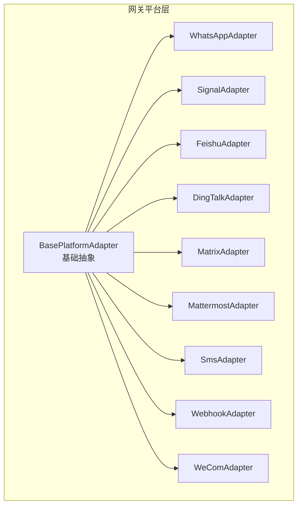

图表来源
- [gateway/platforms/base.py:470-800](file://gateway/platforms/base.py#L470-L800)
- [gateway/platforms/whatsapp.py:103-150](file://gateway/platforms/whatsapp.py#L103-L150)
- [gateway/platforms/signal.py:151-190](file://gateway/platforms/signal.py#L151-L190)
- [gateway/platforms/feishu.py:252-320](file://gateway/platforms/feishu.py#L252-L320)
- [gateway/platforms/dingtalk.py:68-120](file://gateway/platforms/dingtalk.py#L68-L120)
- [gateway/platforms/matrix.py:120-180](file://gateway/platforms/matrix.py#L120-L180)
- [gateway/platforms/mattermost.py:71-120](file://gateway/platforms/mattermost.py#L71-L120)
- [gateway/platforms/sms.py:62-120](file://gateway/platforms/sms.py#L62-L120)
- [gateway/platforms/webhook.py:65-120](file://gateway/platforms/webhook.py#L65-L120)
- [gateway/platforms/wecom.py:142-210](file://gateway/platforms/wecom.py#L142-L210)

章节来源
- [gateway/platforms/base.py:470-800](file://gateway/platforms/base.py#L470-L800)

## 核心组件
- 基类接口：定义统一的连接/断开、发送、编辑、输入指示、媒体发送等抽象方法；提供消息事件与发送结果的数据结构；内置致命错误管理与运行状态上报。
- 平台适配器：在各自模块中实现平台特有逻辑，如认证、长连接、消息解析、媒体下载缓存、回复模式等。
- 缓存工具：图片、音频、文档本地缓存，统一路径与清理策略，避免平台 URL 过期导致的媒体不可用。

章节来源
- [gateway/platforms/base.py:367-444](file://gateway/platforms/base.py#L367-L444)
- [gateway/platforms/base.py:85-191](file://gateway/platforms/base.py#L85-L191)
- [gateway/platforms/base.py:194-364](file://gateway/platforms/base.py#L194-L364)

## 架构总览
下图展示平台适配器与通用基础设施的关系，以及消息在系统内的流转路径。

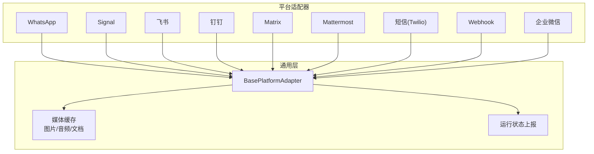

图表来源
- [gateway/platforms/base.py:470-568](file://gateway/platforms/base.py#L470-L568)
- [gateway/platforms/whatsapp.py:103-150](file://gateway/platforms/whatsapp.py#L103-L150)
- [gateway/platforms/signal.py:151-190](file://gateway/platforms/signal.py#L151-L190)
- [gateway/platforms/feishu.py:252-320](file://gateway/platforms/feishu.py#L252-L320)
- [gateway/platforms/dingtalk.py:68-120](file://gateway/platforms/dingtalk.py#L68-L120)
- [gateway/platforms/matrix.py:120-180](file://gateway/platforms/matrix.py#L120-L180)
- [gateway/platforms/mattermost.py:71-120](file://gateway/platforms/mattermost.py#L71-L120)
- [gateway/platforms/sms.py:62-120](file://gateway/platforms/sms.py#L62-L120)
- [gateway/platforms/webhook.py:65-120](file://gateway/platforms/webhook.py#L65-L120)
- [gateway/platforms/wecom.py:142-210](file://gateway/platforms/wecom.py#L142-L210)

## 详细组件分析

### WhatsApp 适配器
- 认证与接入
  - 支持多种后端：Business API、Node.js 桥接（whatsapp-web.js/Baileys）。
  - 通过本地子进程启动 Node.js 桥接服务，HTTP 与桥接通信。
- 消息处理
  - 支持群组与私聊；支持 @提及、回复、自由响应聊天列表等策略。
  - 提供 JID 规范化、提及模式匹配、机器人 ID 解析与消息过滤。
- 发送能力
  - 文本、图片、视频、文档直发；支持 typing 指示。
- 配置要点
  - bridge_script、bridge_port、session_path、reply_prefix、mention_patterns、require_mention、free_response_chats。
- 特色功能
  - JID 处理与提及识别；会话锁防止重复实例；自动安装依赖；健康检查与重连。

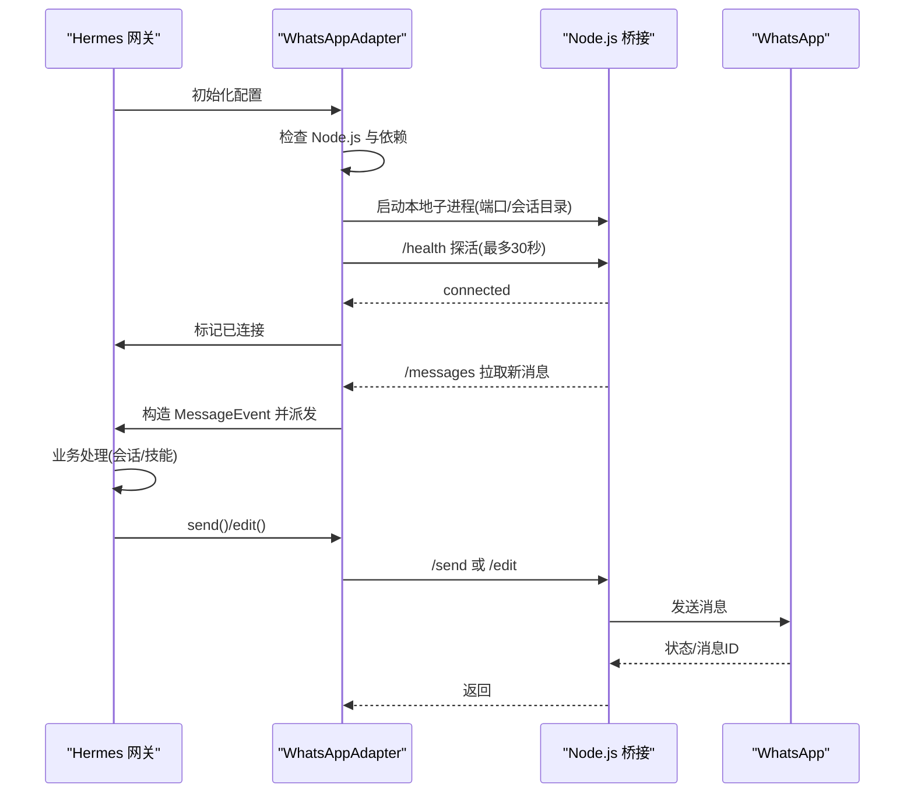

图表来源
- [gateway/platforms/whatsapp.py:274-479](file://gateway/platforms/whatsapp.py#L274-L479)
- [gateway/platforms/whatsapp.py:779-800](file://gateway/platforms/whatsapp.py#L779-L800)

章节来源
- [gateway/platforms/whatsapp.py:103-150](file://gateway/platforms/whatsapp.py#L103-L150)
- [gateway/platforms/whatsapp.py:150-273](file://gateway/platforms/whatsapp.py#L150-L273)
- [gateway/platforms/whatsapp.py:274-479](file://gateway/platforms/whatsapp.py#L274-L479)
- [gateway/platforms/whatsapp.py:779-800](file://gateway/platforms/whatsapp.py#L779-L800)

### Signal 适配器
- 认证与接入
  - 依赖 signal-cli 守护进程（HTTP 模式），需设置 SIGNAL_HTTP_URL 与 SIGNAL_ACCOUNT。
- 消息处理
  - SSE 流式接收事件；支持 @提及渲染、故事消息过滤、自对话去回环（Note to Self）。
  - 组消息允许白名单控制；附件大小限制；媒体类型识别与缓存。
- 发送能力
  - 文本、图片、文档、语音（作为附件）；typing 指示；RPC 调用。
- 配置要点
  - http_url、account、ignore_stories、GROUP 允许列表环境变量。
- 特色功能
  - Mention 渲染（Unicode 替换为可读标识）；最近发送时间戳去回环；健康监控与强制重连。

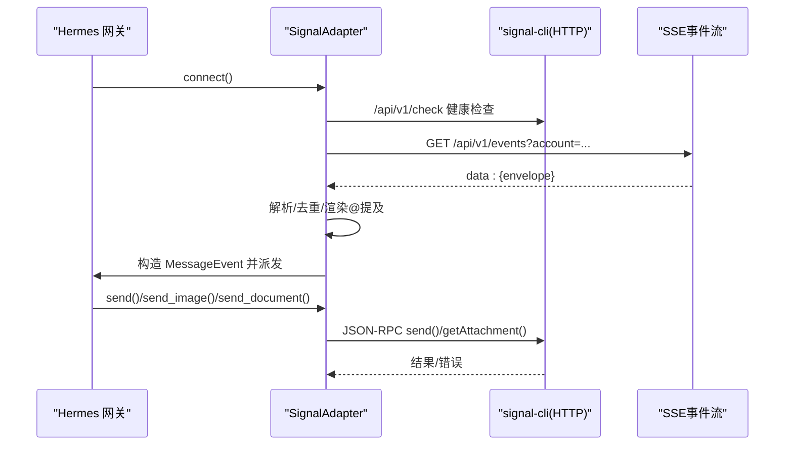

图表来源
- [gateway/platforms/signal.py:197-244](file://gateway/platforms/signal.py#L197-L244)
- [gateway/platforms/signal.py:287-351](file://gateway/platforms/signal.py#L287-L351)
- [gateway/platforms/signal.py:397-547](file://gateway/platforms/signal.py#L397-L547)
- [gateway/platforms/signal.py:587-621](file://gateway/platforms/signal.py#L587-L621)

章节来源
- [gateway/platforms/signal.py:151-190](file://gateway/platforms/signal.py#L151-L190)
- [gateway/platforms/signal.py:197-244](file://gateway/platforms/signal.py#L197-L244)
- [gateway/platforms/signal.py:287-351](file://gateway/platforms/signal.py#L287-L351)
- [gateway/platforms/signal.py:397-547](file://gateway/platforms/signal.py#L397-L547)
- [gateway/platforms/signal.py:587-621](file://gateway/platforms/signal.py#L587-L621)

### 飞书（Lark）适配器
- 认证与接入
  - 支持 WebSocket 与 Webhook 双通道；验证令牌校验；持久去重。
- 消息处理
  - 文本、富文本卡片、图片、文件、音频、合并转发、分享聊天等多形态解析。
  - @提及解析与占位符替换；交互卡片按钮事件转为命令事件；ACK 表情反馈。
- 发送能力
  - 文本、图片、文件、Markdown；批量发送与限流；线程化回复。
- 配置要点
  - app_id/app_secret/domain_name/connection_mode/encrypt_key/verification_token/group_policy/allowed_group_users/bot_open_id/bot_user_id/bot_name 等。
- 特色功能
  - 丰富的富文本解析与占位符提取；卡片动作去重；Webhook 异常追踪；带宽与速率限制。

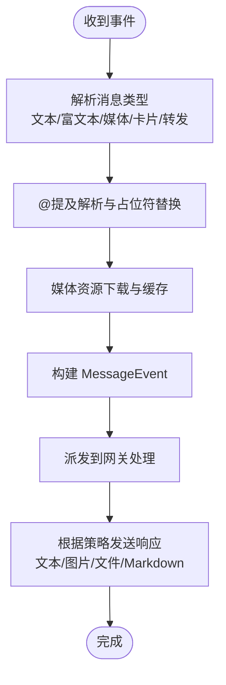

图表来源
- [gateway/platforms/feishu.py:413-449](file://gateway/platforms/feishu.py#L413-L449)
- [gateway/platforms/feishu.py:608-659](file://gateway/platforms/feishu.py#L608-L659)
- [gateway/platforms/feishu.py:670-746](file://gateway/platforms/feishu.py#L670-L746)

章节来源
- [gateway/platforms/feishu.py:252-320](file://gateway/platforms/feishu.py#L252-L320)
- [gateway/platforms/feishu.py:413-449](file://gateway/platforms/feishu.py#L413-L449)
- [gateway/platforms/feishu.py:608-659](file://gateway/platforms/feishu.py#L608-L659)
- [gateway/platforms/feishu.py:670-746](file://gateway/platforms/feishu.py#L670-L746)

### 钉钉适配器
- 认证与接入
  - 使用 dingtalk-stream SDK，基于 WebSocket 实时接收消息；回复通过 session_webhook。
- 消息处理
  - 文本与富文本提取；去重窗口；会话 webhook 缓存用于回复路由。
- 发送能力
  - Markdown 回复；最大长度限制；不支持 typing 指示。
- 配置要点
  - client_id/client_secret；Stream Mode 自动重连。
- 特色功能
  - 消息 ID 去重；会话级回复路由；自动重连退避。

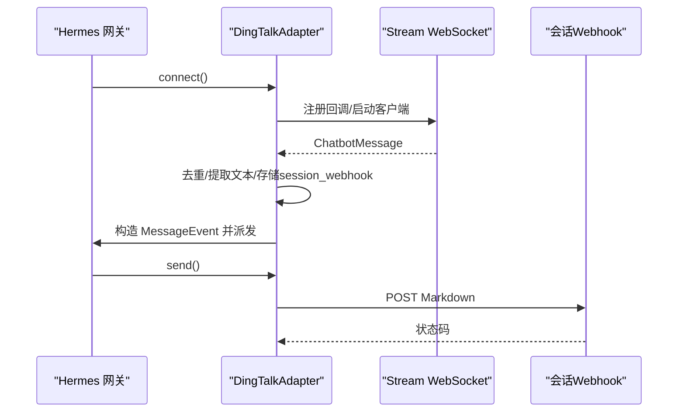

图表来源
- [gateway/platforms/dingtalk.py:96-127](file://gateway/platforms/dingtalk.py#L96-L127)
- [gateway/platforms/dingtalk.py:175-230](file://gateway/platforms/dingtalk.py#L175-L230)
- [gateway/platforms/dingtalk.py:266-301](file://gateway/platforms/dingtalk.py#L266-L301)

章节来源
- [gateway/platforms/dingtalk.py:68-120](file://gateway/platforms/dingtalk.py#L68-L120)
- [gateway/platforms/dingtalk.py:96-127](file://gateway/platforms/dingtalk.py#L96-L127)
- [gateway/platforms/dingtalk.py:175-230](file://gateway/platforms/dingtalk.py#L175-L230)
- [gateway/platforms/dingtalk.py:266-301](file://gateway/platforms/dingtalk.py#L266-L301)

### Matrix 适配器
- 认证与接入
  - 使用 matrix-nio SDK；支持访问令牌与密码登录；可选 E2EE（需要额外依赖）。
- 消息处理
  - 文本、图片、音频、视频、文件、加密事件；反应事件（lifecycle eyes/checkmark/cross）可配置是否处理。
  - DM 房间缓存；事件去重；线程化回复；Markdown 到 HTML 转换。
- 发送能力
  - 文本、媒体、编辑、typing 指示；E2EE 维护与密钥导出。
- 配置要点
  - homeserver、access_token、user_id、password、encryption、device_id、允许用户、房间等。
- 特色功能
  - E2EE 密钥持久化与导入导出；Megolm 未解密事件缓冲；线程参与跟踪以放宽 @提及要求。

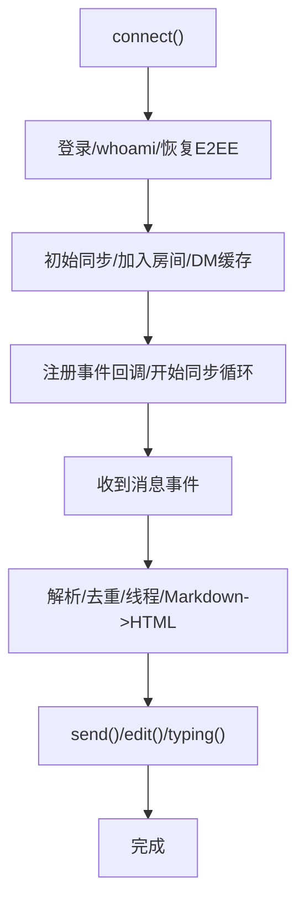

图表来源
- [gateway/platforms/matrix.py:192-391](file://gateway/platforms/matrix.py#L192-L391)
- [gateway/platforms/matrix.py:422-515](file://gateway/platforms/matrix.py#L422-L515)
- [gateway/platforms/matrix.py:768-800](file://gateway/platforms/matrix.py#L768-L800)

章节来源
- [gateway/platforms/matrix.py:120-180](file://gateway/platforms/matrix.py#L120-L180)
- [gateway/platforms/matrix.py:192-391](file://gateway/platforms/matrix.py#L192-L391)
- [gateway/platforms/matrix.py:422-515](file://gateway/platforms/matrix.py#L422-L515)
- [gateway/platforms/matrix.py:768-800](file://gateway/platforms/matrix.py#L768-L800)

### Mattermost 适配器
- 认证与接入
  - 使用 aiohttp REST API 与 WebSocket；支持个人访问令牌或机器人令牌。
- 消息处理
  - 文本、图片、文件、音频；@提及门控；线程回复；文件下载缓存。
- 发送能力
  - 文本、图片、文件、语音；typing 指示；编辑。
- 配置要点
  - MATTERMOST_URL/MATTERMOST_TOKEN/MATTERMOST_REPLY_MODE/MATTERMOST_FREE_RESPONSE_CHANNELS 等。
- 特色功能
  - 专用去重窗口；指数退避重连；WS 认证与心跳；线程模式控制。

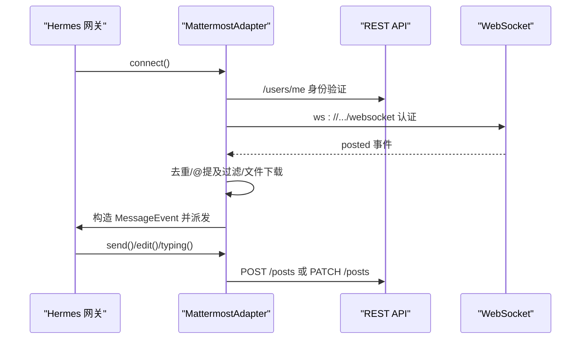

图表来源
- [gateway/platforms/mattermost.py:197-229](file://gateway/platforms/mattermost.py#L197-L229)
- [gateway/platforms/mattermost.py:507-540](file://gateway/platforms/mattermost.py#L507-L540)
- [gateway/platforms/mattermost.py:580-735](file://gateway/platforms/mattermost.py#L580-L735)

章节来源
- [gateway/platforms/mattermost.py:71-120](file://gateway/platforms/mattermost.py#L71-L120)
- [gateway/platforms/mattermost.py:197-229](file://gateway/platforms/mattermost.py#L197-L229)
- [gateway/platforms/mattermost.py:507-540](file://gateway/platforms/mattermost.py#L507-L540)
- [gateway/platforms/mattermost.py:580-735](file://gateway/platforms/mattermost.py#L580-L735)

### 短信（Twilio）适配器
- 认证与接入
  - 使用 Twilio REST API 发送；内置 aiohttp Webhook 服务器接收短信。
- 消息处理
  - 单号码多租户会话；回显防护；格式化清理（去除 Markdown）。
- 发送能力
  - 分段短信（约1600字符）；按段发送；错误返回。
- 配置要点
  - TWILIO_ACCOUNT_SID/TWILIO_AUTH_TOKEN/TWILIO_PHONE_NUMBER/SMS_WEBHOOK_PORT/SMS_ALLOWED_USERS/SMS_ALLOW_ALL_USERS。
- 特色功能
  - 健康检查端点；Webhook XML 响应；短信长度与分段控制。

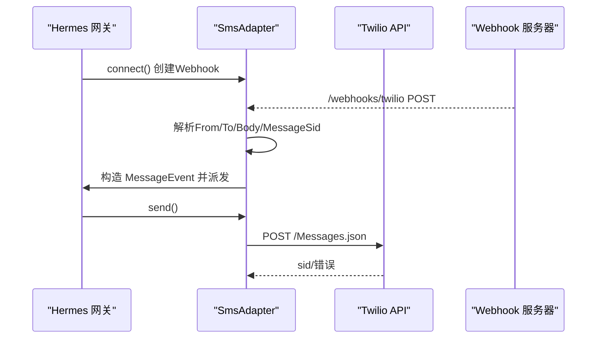

图表来源
- [gateway/platforms/sms.py:93-119](file://gateway/platforms/sms.py#L93-L119)
- [gateway/platforms/sms.py:210-277](file://gateway/platforms/sms.py#L210-L277)
- [gateway/platforms/sms.py:131-184](file://gateway/platforms/sms.py#L131-L184)

章节来源
- [gateway/platforms/sms.py:62-120](file://gateway/platforms/sms.py#L62-L120)
- [gateway/platforms/sms.py:93-119](file://gateway/platforms/sms.py#L93-L119)
- [gateway/platforms/sms.py:131-184](file://gateway/platforms/sms.py#L131-L184)
- [gateway/platforms/sms.py:210-277](file://gateway/platforms/sms.py#L210-L277)

### Webhook 适配器
- 认证与接入
  - 内置 aiohttp 服务器；每条路由独立 HMAC 签名验证；支持动态订阅文件热更新。
- 消息处理
  - 事件类型过滤；模板渲染；幂等窗口；速率限制；跨平台投递。
- 发送能力
  - 日志输出、GitHub PR 评论、跨平台投递（Telegram/Discord/Slack/Signal/SMS）。
- 配置要点
  - host/port/routes/secret/global_secret/max_body_bytes/rate_limit。
- 特色功能
  - 动态路由热加载；交付信息 TTL 管理；跨平台投递与线程 ID透传。

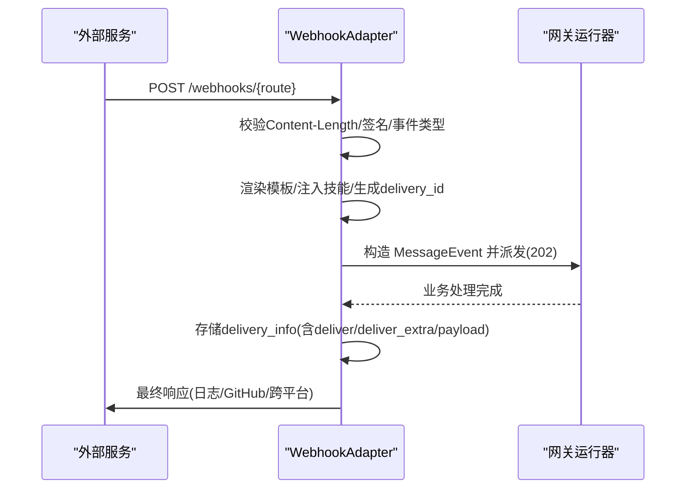

图表来源
- [gateway/platforms/webhook.py:112-154](file://gateway/platforms/webhook.py#L112-L154)
- [gateway/platforms/webhook.py:267-467](file://gateway/platforms/webhook.py#L267-L467)
- [gateway/platforms/webhook.py:163-204](file://gateway/platforms/webhook.py#L163-L204)
- [gateway/platforms/webhook.py:618-662](file://gateway/platforms/webhook.py#L618-L662)

章节来源
- [gateway/platforms/webhook.py:65-120](file://gateway/platforms/webhook.py#L65-L120)
- [gateway/platforms/webhook.py:112-154](file://gateway/platforms/webhook.py#L112-L154)
- [gateway/platforms/webhook.py:267-467](file://gateway/platforms/webhook.py#L267-L467)
- [gateway/platforms/webhook.py:618-662](file://gateway/platforms/webhook.py#L618-L662)

### 企业微信（WeCom）适配器
- 认证与接入
  - 使用 WeCom AI Bot WebSocket；订阅鉴权；心跳维护；请求/响应相关性管理。
- 消息处理
  - 文本、混合消息、语音、图片、文件；@提及门控；回复上下文保留；媒体下载缓存。
- 发送能力
  - Markdown 文本；原生媒体上传（分片）；编辑、回复关联 req_id。
- 配置要点
  - bot_id/secret/websocket_url/dm_policy/group_policy/group_allow_from/groups。
- 特色功能
  - 分片上传与 AES 解密；去重窗口与回复 req_id 映射；策略化的群/人允许列表。

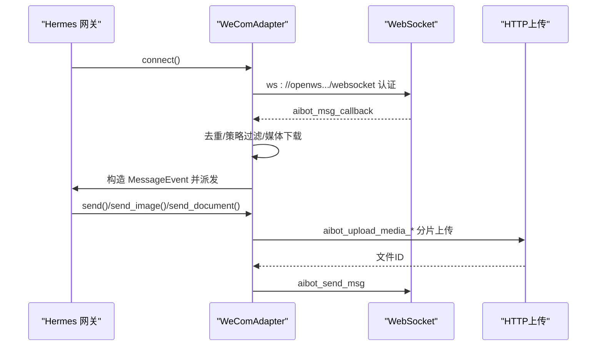

图表来源
- [gateway/platforms/wecom.py:179-213](file://gateway/platforms/wecom.py#L179-L213)
- [gateway/platforms/wecom.py:305-343](file://gateway/platforms/wecom.py#L305-L343)
- [gateway/platforms/wecom.py:462-522](file://gateway/platforms/wecom.py#L462-L522)
- [gateway/platforms/wecom.py:772-800](file://gateway/platforms/wecom.py#L772-L800)

章节来源
- [gateway/platforms/wecom.py:142-210](file://gateway/platforms/wecom.py#L142-L210)
- [gateway/platforms/wecom.py:305-343](file://gateway/platforms/wecom.py#L305-L343)
- [gateway/platforms/wecom.py:462-522](file://gateway/platforms/wecom.py#L462-L522)
- [gateway/platforms/wecom.py:772-800](file://gateway/platforms/wecom.py#L772-L800)

## 依赖分析
- 统一依赖
  - 所有适配器均依赖基类接口与消息事件模型；部分平台引入第三方库（如 matrix-nio、aiohttp、httpx、dingtalk-stream、signal-cli 等）。
- 平台特定依赖
  - WhatsApp：Node.js 与 npm 依赖（由适配器自动检测与安装）。
  - Signal：signal-cli HTTP 守护进程。
  - Matrix：matrix-nio（可选 E2EE 依赖）。
  - DingTalk：dingtalk-stream、httpx。
  - Mattermost：aiohttp。
  - SMS：aiohttp。
  - Webhook：aiohttp。
  - WeCom：aiohttp、httpx。
- 通用工具
  - 媒体缓存（图片/音频/文档）与 SSRF 保护；运行状态上报；致命错误管理。

章节来源
- [gateway/platforms/base.py:85-191](file://gateway/platforms/base.py#L85-L191)
- [gateway/platforms/whatsapp.py:84-101](file://gateway/platforms/whatsapp.py#L84-L101)
- [gateway/platforms/signal.py:142-144](file://gateway/platforms/signal.py#L142-L144)
- [gateway/platforms/matrix.py:84-117](file://gateway/platforms/matrix.py#L84-L117)
- [gateway/platforms/dingtalk.py:59-65](file://gateway/platforms/dingtalk.py#L59-L65)
- [gateway/platforms/mattermost.py:63-68](file://gateway/platforms/mattermost.py#L63-L68)
- [gateway/platforms/sms.py:53-59](file://gateway/platforms/sms.py#L53-L59)
- [gateway/platforms/webhook.py:60-62](file://gateway/platforms/webhook.py#L60-L62)
- [gateway/platforms/wecom.py:108-110](file://gateway/platforms/wecom.py#L108-L110)

## 性能考量
- 连接与重连
  - 多数平台采用指数退避重连（如 Mattermost、WeCom、Matrix）；Signal 健康监控与强制重连；Webhook 路由级速率限制。
- 媒体处理
  - 统一缓存策略减少重复下载；超大文件分片上传（WeCom）；网络异常重试（Signal、WhatsApp）。
- 并发与队列
  - 基类支持后台任务集合与会话中断；部分平台（如 Matrix）内置去重队列与事件缓冲。
- 资源占用
  - WebSocket 长连接与心跳（Matrix、WeCom、Mattermost）；Webhook 端口冲突检测（Webhook）。

章节来源
- [gateway/platforms/mattermost.py:507-540](file://gateway/platforms/mattermost.py#L507-L540)
- [gateway/platforms/wecom.py:305-343](file://gateway/platforms/wecom.py#L305-L343)
- [gateway/platforms/signal.py:356-381](file://gateway/platforms/signal.py#L356-L381)
- [gateway/platforms/webhook.py:130-140](file://gateway/platforms/webhook.py#L130-L140)

## 故障排除指南
- 通用
  - 致命错误上报与状态写入；重连与退避策略；SSRF 保护触发的 URL 下载失败。
- 平台特定
  - WhatsApp：Node.js 未安装、桥接进程退出、会话锁冲突；检查 bridge.log。
  - Signal：daemon 不可达、SSE 长时间无活动、自对话回环；查看健康检查与重连逻辑。
  - 飞书：SDK 可选依赖缺失（lark_oapi）；Webhook 验证令牌；卡片动作去重。
  - 钉钉：Stream SDK/HTTPX 缺失；缺少 client_id/client_secret；会话 webhook 为空。
  - Matrix：E2EE 依赖缺失或设备 ID 未绑定；access token 登录后未恢复加密状态。
  - Mattermost：WS 认证失败（401/403）；文件下载失败；@提及门控。
  - SMS：缺少 TWILIO 凭证；Webhook 端口被占用；短信长度超限。
  - Webhook：路由签名无效；body 过大；动态订阅文件变更；跨平台投递目标不存在。
  - 企业微信：WebSocket 认证失败；分片上传失败；媒体解密失败。

章节来源
- [gateway/platforms/whatsapp.py:490-506](file://gateway/platforms/whatsapp.py#L490-L506)
- [gateway/platforms/signal.py:356-381](file://gateway/platforms/signal.py#L356-L381)
- [gateway/platforms/feishu.py:75-86](file://gateway/platforms/feishu.py#L75-L86)
- [gateway/platforms/dingtalk.py:96-106](file://gateway/platforms/dingtalk.py#L96-L106)
- [gateway/platforms/matrix.py:209-216](file://gateway/platforms/matrix.py#L209-L216)
- [gateway/platforms/mattermost.py:520-530](file://gateway/platforms/mattermost.py#L520-L530)
- [gateway/platforms/sms.py:93-99](file://gateway/platforms/sms.py#L93-L99)
- [gateway/platforms/webhook.py:130-140](file://gateway/platforms/webhook.py#L130-L140)
- [gateway/platforms/wecom.py:275-280](file://gateway/platforms/wecom.py#L275-L280)

## 结论
Hermes Agent 的“其他消息平台”适配器通过统一的基类接口实现了跨平台一致性，同时针对各平台特性提供了定制化能力。平台间在认证方式、消息形态、媒体处理与连接模型上存在显著差异，但都遵循了消息事件标准化、发送结果抽象与运行状态管理的最佳实践。结合缓存与去重、健康监控与重连、速率限制与幂等窗口等机制，整体具备良好的稳定性与可运维性。

## 附录
- 消息格式标准化
  - 统一的 MessageEvent 字段与 MessageType 枚举；媒体 URL 本地缓存；Markdown 渲染与 HTML 转换。
- 跨平台状态同步
  - 运行状态写入；致命错误上报；会话中断与后台任务管理。
- 平台间映射与扩展
  - 新平台适配遵循 BasePlatformAdapter 抽象；消息事件与发送结果保持一致；媒体缓存与安全策略复用。

章节来源
- [gateway/platforms/base.py:367-444](file://gateway/platforms/base.py#L367-L444)
- [gateway/platforms/base.py:470-568](file://gateway/platforms/base.py#L470-L568)
- [gateway/platforms/base.py:85-191](file://gateway/platforms/base.py#L85-L191)