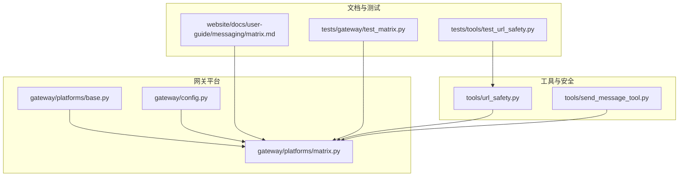
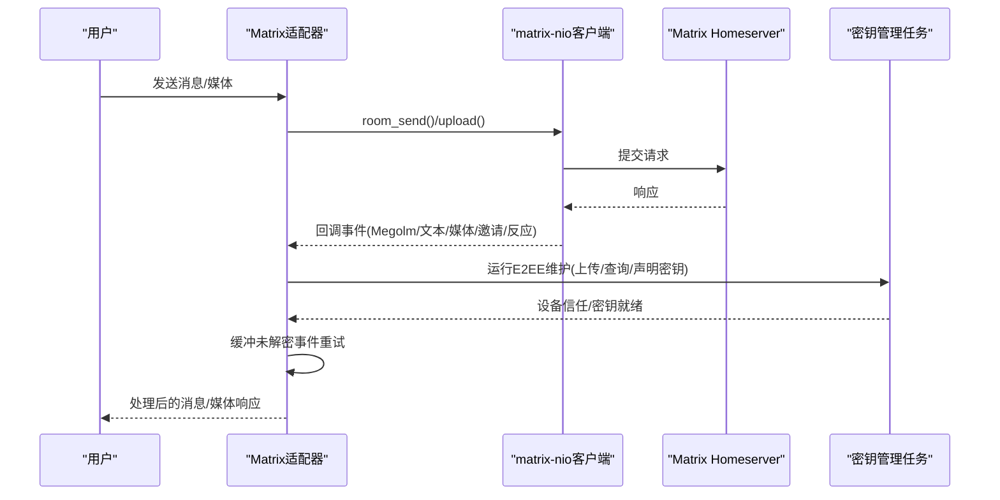
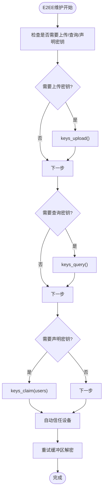
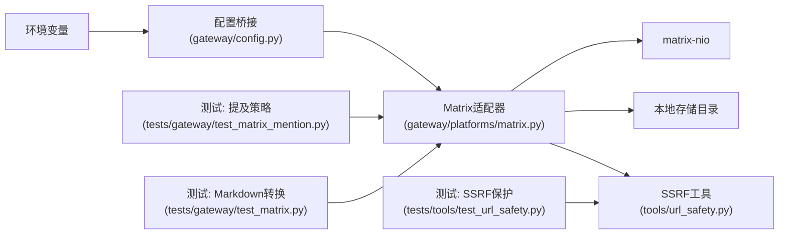

# Matrix 分布式通信

<cite>
**本文引用的文件**
- [gateway/platforms/matrix.py](file://gateway/platforms/matrix.py)
- [website/docs/user-guide/messaging/matrix.md](file://website/docs/user-guide/messaging/matrix.md)
- [gateway/config.py](file://gateway/config.py)
- [hermes_cli/config.py](file://hermes_cli/config.py)
- [tests/gateway/test_matrix.py](file://tests/gateway/test_matrix.py)
- [tests/gateway/test_matrix_mention.py](file://tests/gateway/test_matrix_mention.py)
- [tests/tools/test_url_safety.py](file://tests/tools/test_url_safety.py)
- [tests/tools/test_vision_tools.py](file://tests/tools/test_vision_tools.py)
- [tools/url_safety.py](file://tools/url_safety.py)
- [tools/send_message_tool.py](file://tools/send_message_tool.py)
- [website/docs/reference/platforms/matrix.md](file://website/docs/reference/platforms/matrix.md)
</cite>

## 目录
1. [简介](#简介)
2. [项目结构](#项目结构)
3. [核心组件](#核心组件)
4. [架构总览](#架构总览)
5. [详细组件分析](#详细组件分析)
6. [依赖关系分析](#依赖关系分析)
7. [性能考量](#性能考量)
8. [故障排查指南](#故障排查指南)
9. [结论](#结论)
10. [附录](#附录)

## 简介
本文件面向Matrix分布式通信平台的实现与使用，围绕以下目标展开：
- 解释Matrix去中心化架构与联邦网络、分布式信任模型（基于homeserver与设备信任）
- 详解端到端加密（E2EE）实现：Megolm会话密钥管理、设备信任与密钥导出恢复
- 房间管理、DM聊天室识别与权限控制
- 消息格式标准化、HTML富文本渲染与Markdown支持
- 事件处理、同步循环与连接管理
- SSRF防护、媒体文件上传/下载与语音消息支持
- 环境变量配置、认证方式与错误处理策略

## 项目结构
本项目在gateway子系统中提供了Matrix适配器，负责与任意Matrix homeserver交互，支持可选E2EE、消息富文本渲染、媒体上传下载、语音消息、线程与提及控制等能力。用户指南与测试覆盖了行为与安全要点。

图表来源
- [gateway/platforms/matrix.py:1-200](file://gateway/platforms/matrix.py#L1-L200)
- [gateway/config.py:780-820](file://gateway/config.py#L780-L820)
- [tools/url_safety.py:1-120](file://tools/url_safety.py#L1-L120)
- [tools/send_message_tool.py:750-768](file://tools/send_message_tool.py#L750-L768)
- [website/docs/user-guide/messaging/matrix.md:1-120](file://website/docs/user-guide/messaging/matrix.md#L1-L120)
- [tests/gateway/test_matrix.py:389-401](file://tests/gateway/test_matrix.py#L389-L401)
- [tests/tools/test_url_safety.py:1-102](file://tests/tools/test_url_safety.py#L1-L102)

章节来源
- [gateway/platforms/matrix.py:1-200](file://gateway/platforms/matrix.py#L1-L200)
- [gateway/config.py:780-820](file://gateway/config.py#L780-L820)
- [website/docs/user-guide/messaging/matrix.md:1-120](file://website/docs/user-guide/messaging/matrix.md#L1-L120)

## 核心组件
- Matrix适配器：封装matrix-nio客户端，负责连接、认证、事件回调、发送/编辑/删除消息、房间管理、线程与提及控制、E2EE维护、媒体上传下载与语音消息、富文本转换与SSRF防护。
- 配置桥接：从环境变量加载Matrix参数并注入到平台配置。
- 文档与测试：行为规范、安装与E2EE要求、SSRF保护、提及与自动线程策略等。

章节来源
- [gateway/platforms/matrix.py:120-200](file://gateway/platforms/matrix.py#L120-L200)
- [gateway/config.py:780-820](file://gateway/config.py#L780-L820)
- [website/docs/user-guide/messaging/matrix.md:229-280](file://website/docs/user-guide/messaging/matrix.md#L229-L280)

## 架构总览
Matrix适配器通过matrix-nio与homeserver交互，采用自定义同步循环以驱动E2EE密钥管理任务，同时处理多种事件类型（文本、媒体、邀请、反应）。E2EE启用时，自动上传/查询/声明密钥、信任设备并重试解密缓冲区中的事件；非E2EE时走明文路径。媒体下载时对加密媒体进行本地解密，对非加密媒体提供HTTP回退。提及与线程策略由环境变量控制，默认仅DM免提及，房间内需@提及或参与过线程。

图表来源
- [gateway/platforms/matrix.py:370-391](file://gateway/platforms/matrix.py#L370-L391)
- [gateway/platforms/matrix.py:808-855](file://gateway/platforms/matrix.py#L808-L855)
- [gateway/platforms/matrix.py:954-1091](file://gateway/platforms/matrix.py#L954-L1091)
- [gateway/platforms/matrix.py:1093-1312](file://gateway/platforms/matrix.py#L1093-L1312)

章节来源
- [gateway/platforms/matrix.py:370-391](file://gateway/platforms/matrix.py#L370-L391)
- [gateway/platforms/matrix.py:808-855](file://gateway/platforms/matrix.py#L808-L855)
- [gateway/platforms/matrix.py:954-1091](file://gateway/platforms/matrix.py#L954-L1091)
- [gateway/platforms/matrix.py:1093-1312](file://gateway/platforms/matrix.py#L1093-L1312)

## 详细组件分析

### 1) 去中心化架构与联邦网络、分布式信任模型
- homeserver概念：每个用户/组织运行或托管自己的homeserver，或使用公共homeserver（如matrix.org），消息路由与存储由各自服务器负责。
- 联邦网络：不同homeserver之间通过Matrix协议互通，用户可在任一服务器上与来自其他服务器的用户通信。
- 分布式信任模型：
  - 设备信任：E2EE依赖设备级信任。适配器在E2EE维护阶段自动信任新设备，确保会话密钥分发。
  - 用户授权：通过ALLOWED_USERS限制可交互用户集合，避免未授权访问。
  - 认证方式：优先使用access token（whoami解析获取device_id），其次使用密码登录。

章节来源
- [website/docs/user-guide/messaging/matrix.md:374-379](file://website/docs/user-guide/messaging/matrix.md#L374-L379)
- [gateway/platforms/matrix.py:244-310](file://gateway/platforms/matrix.py#L244-L310)
- [gateway/platforms/matrix.py:845-887](file://gateway/platforms/matrix.py#L845-L887)

### 2) 端到端加密（E2EE）实现
- 依赖与检测：安装matrix-nio[e2e]与libolm，启动前校验E2EE依赖可用性。
- 客户端初始化：根据是否启用E2EE选择构造加密或明文客户端；若提供access token，先whoami解析用户与device_id，再restore_login绑定设备与加密存储。
- 密钥管理：
  - 自动上传设备密钥（should_upload_keys）
  - 查询/声明密钥（keys_query/keys_claim）
  - 发送to-device消息（send_to_device_messages）
  - 自动信任所有设备（verify_device）以促进密钥共享
- 会话密钥管理：
  - Megolm事件未解密时，请求房间密钥（request_room_key），并将事件加入待重试缓冲队列
  - 维护周期结束后重试解密，成功后转交对应处理器
- 密钥持久化与恢复：
  - 断开前导出Megolm密钥至固定文件，重启后导入以恢复会话解密能力
  - 支持稳定device_id以跨重启保持同一设备身份

图表来源
- [gateway/platforms/matrix.py:808-855](file://gateway/platforms/matrix.py#L808-L855)
- [gateway/platforms/matrix.py:888-948](file://gateway/platforms/matrix.py#L888-L948)

章节来源
- [gateway/platforms/matrix.py:75-117](file://gateway/platforms/matrix.py#L75-L117)
- [gateway/platforms/matrix.py:209-339](file://gateway/platforms/matrix.py#L209-L339)
- [gateway/platforms/matrix.py:404-414](file://gateway/platforms/matrix.py#L404-L414)
- [gateway/platforms/matrix.py:808-887](file://gateway/platforms/matrix.py#L808-L887)
- [gateway/platforms/matrix.py:888-948](file://gateway/platforms/matrix.py#L888-L948)

### 3) 房间管理、DM聊天室识别与权限控制
- DM识别：通过m.direct账户数据缓存与房间成员数判断，将双人房间识别为DM。
- 权限控制：通过ALLOWED_USERS限制交互范围；房间内默认要求@提及，可通过FREE_RESPONSE_ROOMS豁免或关闭require_mention。
- 自动加入：收到房间邀请时自动加入并刷新DM缓存。
- 房间创建：支持按preset创建私聊/公开/受信任私聊房间，并可直接邀请用户。

章节来源
- [gateway/platforms/matrix.py:1714-1761](file://gateway/platforms/matrix.py#L1714-L1761)
- [gateway/platforms/matrix.py:1314-1346](file://gateway/platforms/matrix.py#L1314-L1346)
- [gateway/platforms/matrix.py:1564-1607](file://gateway/platforms/matrix.py#L1564-L1607)
- [website/docs/user-guide/messaging/matrix.md:15-27](file://website/docs/user-guide/messaging/matrix.md#L15-L27)

### 4) 消息格式标准化、HTML富文本渲染与Markdown支持
- Markdown到HTML：优先使用markdown库扩展（fenced_code/tables/nl2br/sane_lists），否则使用内置正则转换器，支持代码块、行内代码、标题、粗体、斜体、删除线、链接、引用块、有序/无序列表、水平线等；对链接URL进行危险协议过滤与引号转义。
- 富文本格式：当存在HTML时，使用org.matrix.custom.html格式字段发送，确保客户端正确渲染。
- 图片Markdown剥离：发送前剥离图片Markdown，改为单独上传后再发送消息。

章节来源
- [gateway/platforms/matrix.py:666-670](file://gateway/platforms/matrix.py#L666-L670)
- [gateway/platforms/matrix.py:1860-1891](file://gateway/platforms/matrix.py#L1860-L1891)
- [gateway/platforms/matrix.py:1912-2052](file://gateway/platforms/matrix.py#L1912-L2052)
- [tests/gateway/test_matrix.py:407-424](file://tests/gateway/test_matrix.py#L407-L424)

### 5) 事件处理、同步循环与连接管理
- 同步循环：自定义循环执行sync，捕获SyncError并区分永久认证错误（401/403/M_UNKNOWN_TOKEN）停止，其他错误5秒重试。
- 事件回调：注册文本/媒体/邀请/反应等回调；对Megolm事件进行解密失败处理与缓冲重试。
- 连接管理：支持access token与密码两种认证；断开前导出密钥，保证重启后能继续解密。

章节来源
- [gateway/platforms/matrix.py:768-807](file://gateway/platforms/matrix.py#L768-L807)
- [gateway/platforms/matrix.py:342-369](file://gateway/platforms/matrix.py#L342-L369)
- [gateway/platforms/matrix.py:954-1091](file://gateway/platforms/matrix.py#L954-L1091)
- [tests/gateway/test_ws_auth_retry.py:113-201](file://tests/gateway/test_ws_auth_retry.py#L113-L201)

### 6) SSRF防护、媒体文件上传/下载与语音消息支持
- SSRF防护：下载媒体前先用url_safety.is_safe_url校验URL，阻止私有/回环/CGNAT/多播等不安全地址；对重定向链路再次校验。
- 上传/下载：使用upload接口上传字节流，生成mxc://URL；下载时对加密媒体进行本地解密（decrypt_attachment），对非加密媒体提供HTTP回退。
- 语音消息：支持MSC3245原生语音消息标记，自动识别并缓存为本地音频文件，便于转录等下游处理。

章节来源
- [gateway/platforms/matrix.py:589-616](file://gateway/platforms/matrix.py#L589-L616)
- [gateway/platforms/matrix.py:676-738](file://gateway/platforms/matrix.py#L676-L738)
- [gateway/platforms/matrix.py:1188-1247](file://gateway/platforms/matrix.py#L1188-L1247)
- [gateway/platforms/matrix.py:1166-1168](file://gateway/platforms/matrix.py#L1166-L1168)
- [tools/url_safety.py:1-102](file://tools/url_safety.py#L1-L102)
- [tests/tools/test_url_safety.py:1-102](file://tests/tools/test_url_safety.py#L1-L102)
- [tests/tools/test_vision_tools.py:40-73](file://tests/tools/test_vision_tools.py#L40-L73)

### 7) 环境变量配置、认证方式与错误处理策略
- 环境变量：
  - 必填：MATRIX_HOMESERVER、MATRIX_ACCESS_TOKEN 或 MATRIX_USER_ID + MATRIX_PASSWORD
  - 可选：MATRIX_ENCRYPTION、MATRIX_DEVICE_ID、MATRIX_ALLOWED_USERS、MATRIX_HOME_ROOM、MATRIX_REQUIRE_MENTION、MATRIX_FREE_RESPONSE_ROOMS、MATRIX_AUTO_THREAD
- 认证策略：
  - access token优先：通过whoami解析user_id与device_id，restore_login绑定设备与加密存储
  - 密码登录：登录后记录user_id/device_id，必要时上传密钥
- 错误处理：
  - 永久认证错误（401/403/M_UNKNOWN_TOKEN）停止同步循环
  - 其他瞬时错误5秒重试
  - E2EE依赖缺失时拒绝连接并提示安装

章节来源
- [gateway/platforms/matrix.py:7-21](file://gateway/platforms/matrix.py#L7-L21)
- [gateway/platforms/matrix.py:84-117](file://gateway/platforms/matrix.py#L84-L117)
- [gateway/platforms/matrix.py:244-310](file://gateway/platforms/matrix.py#L244-L310)
- [gateway/config.py:780-820](file://gateway/config.py#L780-L820)
- [hermes_cli/config.py:1054-1090](file://hermes_cli/config.py#L1054-L1090)
- [website/docs/user-guide/messaging/matrix.md:107-146](file://website/docs/user-guide/messaging/matrix.md#L107-L146)

## 依赖关系分析
- 适配器依赖matrix-nio（可选E2EE）与本地存储目录；通过环境变量与配置模块注入参数。
- 工具层提供URL安全校验，用于媒体下载与SSRF防护。
- 测试覆盖提及策略、Markdown转换、链接安全等关键路径。

图表来源
- [gateway/config.py:780-820](file://gateway/config.py#L780-L820)
- [gateway/platforms/matrix.py:50-62](file://gateway/platforms/matrix.py#L50-L62)
- [tools/url_safety.py:1-102](file://tools/url_safety.py#L1-L102)
- [tests/gateway/test_matrix_mention.py:449-478](file://tests/gateway/test_matrix_mention.py#L449-L478)
- [tests/gateway/test_matrix.py:407-424](file://tests/gateway/test_matrix.py#L407-L424)
- [tests/tools/test_url_safety.py:1-102](file://tests/tools/test_url_safety.py#L1-L102)

章节来源
- [gateway/config.py:780-820](file://gateway/config.py#L780-L820)
- [gateway/platforms/matrix.py:50-62](file://gateway/platforms/matrix.py#L50-L62)
- [tools/url_safety.py:1-102](file://tools/url_safety.py#L1-L102)
- [tests/gateway/test_matrix_mention.py:449-478](file://tests/gateway/test_matrix_mention.py#L449-L478)
- [tests/gateway/test_matrix.py:407-424](file://tests/gateway/test_matrix.py#L407-L424)
- [tests/tools/test_url_safety.py:1-102](file://tests/tools/test_url_safety.py#L1-L102)

## 性能考量
- 同步循环：默认30秒超时，错误时5秒重试，避免忙轮询；E2EE维护异步并发执行多个任务，减少阻塞。
- 事件去重与缓冲：使用双端队列与集合跟踪已处理事件，限制待解密事件数量与TTL，防止内存膨胀。
- 媒体处理：仅在必要时缓存加密媒体与语音消息，避免不必要的磁盘写入；对非加密媒体优先HTTP回退。
- Markdown转换：优先使用markdown库，回退正则转换器，兼顾性能与兼容性。

[本节为通用指导，无需特定文件引用]

## 故障排查指南
- “无法认证”/“whoami失败”：检查MATRIX_HOMESERVER与MATRIX_ACCESS_TOKEN有效性；可用curl验证whoami接口。
- “matrix-nio未安装”：安装matrix-nio[e2e]与libolm；E2EE依赖缺失时将降级为明文。
- “加密错误/无法解密事件”：确认libolm安装、MATRIX_ENCRYPTION开启、在客户端信任设备；新加入房间后仅能解密之后的消息。
- “同步问题/掉队”：检查homeserver资源与网络；适配器每5秒重试；长时间任务可能延迟同步。
- “用户不允许/被忽略”：确认MATRIX_ALLOWED_USERS包含完整@user:server格式；重启后生效。
- “SSRF风险”：确保媒体URL通过is_safe_url校验；对重定向链路二次校验。

章节来源
- [website/docs/user-guide/messaging/matrix.md:301-381](file://website/docs/user-guide/messaging/matrix.md#L301-L381)
- [gateway/platforms/matrix.py:768-807](file://gateway/platforms/matrix.py#L768-L807)
- [tests/gateway/test_ws_auth_retry.py:113-201](file://tests/gateway/test_ws_auth_retry.py#L113-L201)

## 结论
本实现以matrix-nio为核心，结合自定义同步循环与E2EE维护流程，提供了对Matrix联邦网络的完整接入：支持去中心化homeserver、分布式信任、端到端加密、富文本渲染、媒体与语音消息、房间与线程管理以及严格的SSRF防护。通过环境变量与配置桥接，用户可以灵活地控制行为与安全策略。

[本节为总结，无需特定文件引用]

## 附录
- 环境变量参考（节选）：
  - MATRIX_HOMESERVER：homeserver地址
  - MATRIX_ACCESS_TOKEN：访问令牌
  - MATRIX_USER_ID / MATRIX_PASSWORD：替代令牌的用户名/密码
  - MATRIX_ENCRYPTION：启用E2EE
  - MATRIX_DEVICE_ID：稳定设备ID
  - MATRIX_ALLOWED_USERS：允许交互的用户列表
  - MATRIX_HOME_ROOM / MATRIX_HOME_ROOM_NAME：主页房间
  - MATRIX_REQUIRE_MENTION / MATRIX_FREE_RESPONSE_ROOMS / MATRIX_AUTO_THREAD：提及与线程策略
- 参考文档与测试：
  - 用户指南：Matrix安装与行为说明
  - 单元测试：提及策略、Markdown转换、SSRF保护等

章节来源
- [hermes_cli/config.py:1054-1090](file://hermes_cli/config.py#L1054-L1090)
- [website/docs/user-guide/messaging/matrix.md:1-381](file://website/docs/user-guide/messaging/matrix.md#L1-L381)
- [tests/gateway/test_matrix_mention.py:449-478](file://tests/gateway/test_matrix_mention.py#L449-L478)
- [tests/gateway/test_matrix.py:407-424](file://tests/gateway/test_matrix.py#L407-L424)
- [tests/tools/test_url_safety.py:1-102](file://tests/tools/test_url_safety.py#L1-L102)