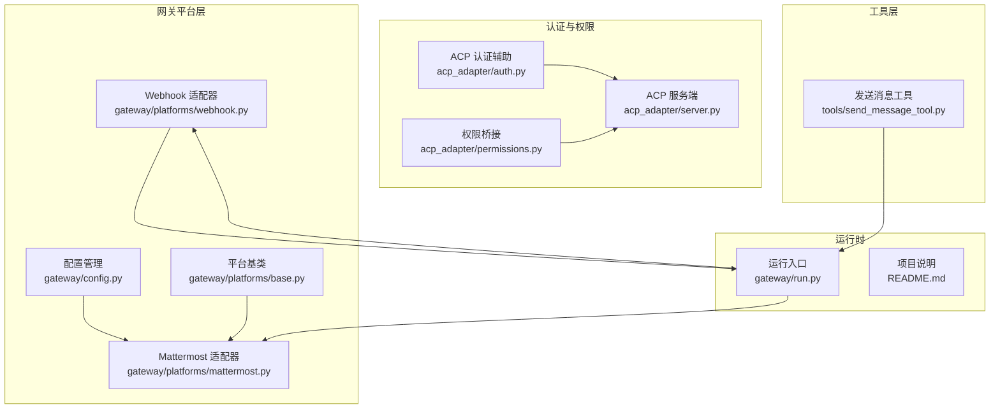
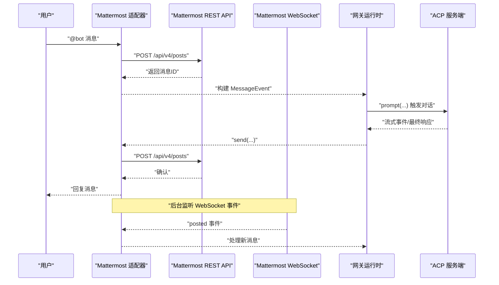
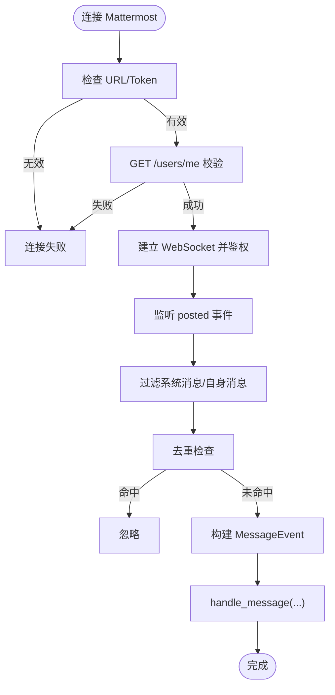
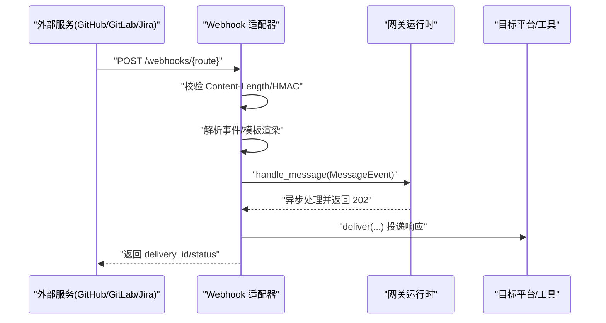
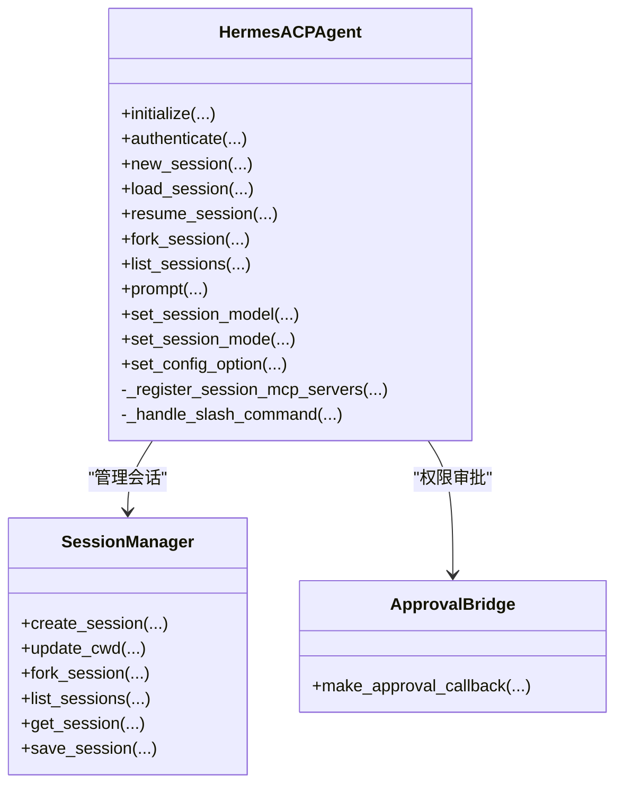
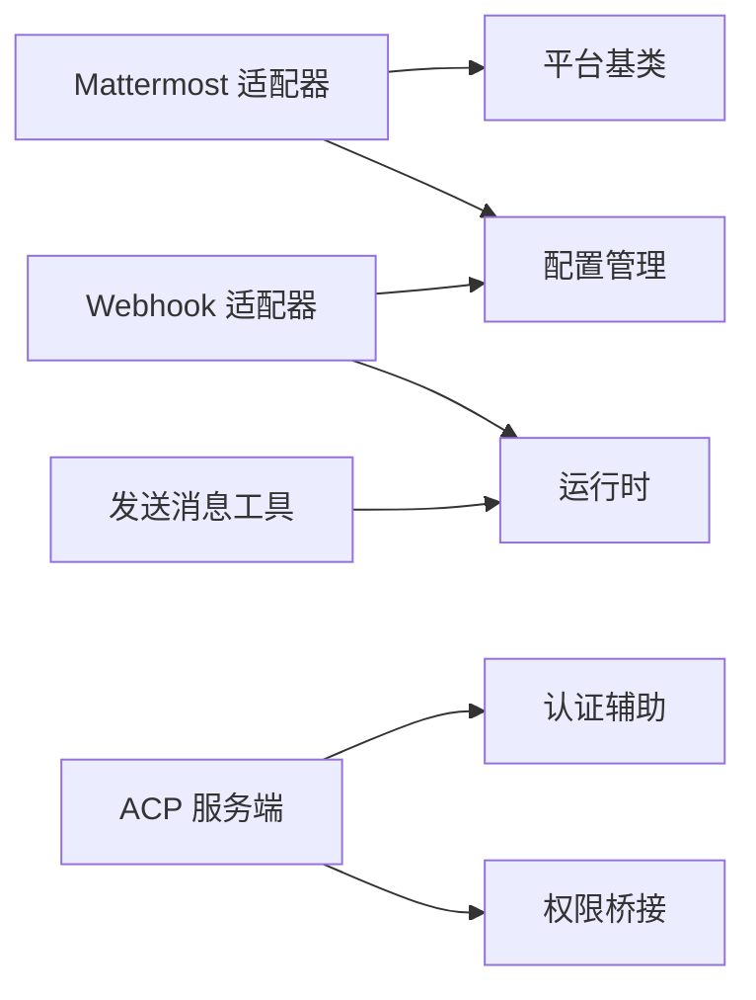

# Mattermost 团队协作

<cite>
**本文档引用的文件**
- [mattermost.py](file://gateway/platforms/mattermost.py)
- [base.py](file://gateway/platforms/base.py)
- [config.py](file://gateway/config.py)
- [webhook.py](file://gateway/platforms/webhook.py)
- [auth.py](file://acp_adapter/auth.py)
- [permissions.py](file://acp_adapter/permissions.py)
- [server.py](file://acp_adapter/server.py)
- [send_message_tool.py](file://tools/send_message_tool.py)
- [README.md](file://README.md)
- [test_mattermost.py](file://tests/gateway/test_mattermost.py)
- [test_send_message_missing_platforms.py](file://tests/tools/test_send_message_missing_platforms.py)
- [run.py](file://gateway/run.py)
</cite>

## 目录
1. [简介](#简介)
2. [项目结构](#项目结构)
3. [核心组件](#核心组件)
4. [架构总览](#架构总览)
5. [详细组件分析](#详细组件分析)
6. [依赖关系分析](#依赖关系分析)
7. [性能考量](#性能考量)
8. [故障排除指南](#故障排除指南)
9. [结论](#结论)
10. [附录](#附录)

## 简介
本文件面向在企业环境中部署与使用 Hermes Agent 的团队，系统化阐述如何通过 Mattermost 平台实现团队协作与自动化工作流。内容覆盖：
- 企业级协作：频道管理、用户组与权限控制
- 集成能力：Webhook、OAuth 认证与第三方应用集成
- 消息推送与通知：实时通信机制与状态管理
- 插件系统与扩展：ACP 协议、MCP 服务器与工具面刷新
- REST API 使用：认证令牌、错误处理与安全配置
- 与 GitHub、Jira 等工具的集成方案与最佳实践

## 项目结构
Hermes Agent 采用模块化设计，Mattermost 集成位于 gateway 子系统中，配合通用平台适配器、配置管理与工具层共同构成端到端的消息网关。

**图表来源**
- [mattermost.py:1-747](file://gateway/platforms/mattermost.py#L1-L747)
- [base.py:1-800](file://gateway/platforms/base.py#L1-L800)
- [config.py:1-958](file://gateway/config.py#L1-L958)
- [webhook.py:1-662](file://gateway/platforms/webhook.py#L1-L662)
- [auth.py:1-25](file://acp_adapter/auth.py#L1-L25)
- [permissions.py:1-78](file://acp_adapter/permissions.py#L1-L78)
- [server.py:1-727](file://acp_adapter/server.py#L1-L727)
- [send_message_tool.py:726-768](file://tools/send_message_tool.py#L726-L768)
- [run.py:1677-1705](file://gateway/run.py#L1677-L1705)

**章节来源**
- [README.md:1-176](file://README.md#L1-L176)

## 核心组件
- Mattermost 适配器：基于 REST API v4 与 WebSocket 实现实时事件监听，支持分片发送、媒体上传与提及过滤。
- 平台基类：统一消息格式、会话管理、重试策略与致命错误处理。
- 配置管理：集中管理平台开关、令牌、Home Channel、会话重置策略与流式传输设置。
- Webhook 适配器：接收外部服务（如 GitHub/GitLab/Jira）事件，进行签名验证、幂等与速率限制。
- ACP 适配器：通过 Agent Client Protocol 提供会话管理、命令注册与权限审批桥接。
- 发送消息工具：跨平台统一发送接口，内含 Mattermost 直发实现。

**章节来源**
- [mattermost.py:71-284](file://gateway/platforms/mattermost.py#L71-L284)
- [base.py:470-800](file://gateway/platforms/base.py#L470-L800)
- [config.py:48-401](file://gateway/config.py#L48-L401)
- [webhook.py:65-225](file://gateway/platforms/webhook.py#L65-L225)
- [server.py:92-727](file://acp_adapter/server.py#L92-L727)
- [send_message_tool.py:726-768](file://tools/send_message_tool.py#L726-L768)

## 架构总览
下图展示 Mattermost 集成在 Hermes Agent 中的整体架构与交互路径。

**图表来源**
- [mattermost.py:197-284](file://gateway/platforms/mattermost.py#L197-L284)
- [mattermost.py:507-576](file://gateway/platforms/mattermost.py#L507-L576)
- [server.py:349-466](file://acp_adapter/server.py#L349-L466)

## 详细组件分析

### Mattermost 适配器
- 连接与认证
  - 通过环境变量或配置加载 MATTERMOST_URL 与 MATTERMOST_TOKEN。
  - 首次连接调用 /api/v4/users/me 校验令牌有效性。
  - 启动 WebSocket 并以 authentication_challenge 方式鉴权。
- 消息收发
  - send 支持分片发送（最大长度 4000），可选线程模式（reply_mode="thread"）。
  - 支持图片/音频/视频/文档上传与本地文件直传。
  - format_message 将 Markdown 图片转为纯链接，避免平台不支持的渲染。
- 事件处理
  - WebSocket 事件过滤：仅处理 posted 类型。
  - 去重缓存：防止重复处理同一 post。
  - 提及过滤：非 DM 场景默认要求 @bot 或白名单通道。
  - 自动下载附件到本地缓存，便于后续工具处理。
- 错误与重连
  - WebSocket 断线自动指数退避重连（2s→60s），遇到 401/403 永久失败停止重连。

**图表来源**
- [mattermost.py:197-284](file://gateway/platforms/mattermost.py#L197-L284)
- [mattermost.py:507-747](file://gateway/platforms/mattermost.py#L507-L747)

**章节来源**
- [mattermost.py:53-69](file://gateway/platforms/mattermost.py#L53-L69)
- [mattermost.py:197-284](file://gateway/platforms/mattermost.py#L197-L284)
- [mattermost.py:507-747](file://gateway/platforms/mattermost.py#L507-L747)
- [test_mattermost.py:1-133](file://tests/gateway/test_mattermost.py#L1-L133)

### 平台基类与通用能力
- 统一消息类型与事件结构，支持文本、图片、语音、文档、命令等。
- 发送结果 SendResult 统一封装成功/失败与可重试标记。
- 超时策略：明确区分“可重试”网络错误与“不可重试”的业务错误。
- 缓存工具：图片/音频/文档本地缓存，提升媒体处理效率与稳定性。

**章节来源**
- [base.py:367-444](file://gateway/platforms/base.py#L367-L444)
- [base.py:470-800](file://gateway/platforms/base.py#L470-L800)

### 配置管理与平台策略
- 平台枚举包含 MATTERMOST，支持按平台启用/禁用与令牌配置。
- Home Channel：为 Cron/通知等场景提供默认投递目标。
- 会话重置策略：支持按日/空闲/两者触发，可配置通知行为。
- 流式传输：控制编辑式流式回显与节流参数。
- 环境变量优先：支持通过环境变量覆盖配置，便于容器化部署。

**章节来源**
- [config.py:48-66](file://gateway/config.py#L48-L66)
- [config.py:139-401](file://gateway/config.py#L139-L401)
- [config.py:757-774](file://gateway/config.py#L757-L774)

### Webhook 集成与第三方应用
- 安全模型：每路由 HMAC 密钥校验，支持全局密钥；可跳过认证用于测试。
- 功能特性：速率限制、幂等缓存（按 delivery_id）、动态路由订阅文件热更新。
- 交付策略：支持记录日志、GitHub 评论、跨平台投递（Telegram/Discord/Slack 等）。
- 模板渲染：支持点号访问嵌套字段与 {__raw__} 输出完整负载。

**图表来源**
- [webhook.py:112-154](file://gateway/platforms/webhook.py#L112-L154)
- [webhook.py:267-467](file://gateway/platforms/webhook.py#L267-L467)
- [webhook.py:618-662](file://gateway/platforms/webhook.py#L618-L662)

**章节来源**
- [webhook.py:1-662](file://gateway/platforms/webhook.py#L1-L662)

### ACP 适配器与权限系统
- ACP Agent：提供会话生命周期管理、命令注册、模型切换与配置选项持久化。
- 权限桥接：将 ACP 的请求权限映射为本地审批回调，支持超时与拒绝策略。
- 认证辅助：检测当前运行时提供商，支持 OAuth 设备码流程与 API Key 流程。

**图表来源**
- [server.py:92-727](file://acp_adapter/server.py#L92-L727)
- [permissions.py:26-78](file://acp_adapter/permissions.py#L26-L78)
- [auth.py:8-25](file://acp_adapter/auth.py#L8-L25)

**章节来源**
- [server.py:92-727](file://acp_adapter/server.py#L92-L727)
- [permissions.py:1-78](file://acp_adapter/permissions.py#L1-L78)
- [auth.py:1-25](file://acp_adapter/auth.py#L1-L25)

### REST API 使用与令牌管理
- Mattermost REST API v4
  - 端点：/api/v4/posts、/api/v4/files、/api/v4/users/me、/api/v4/channels/{id} 等。
  - 认证：Bearer Token，需设置 Authorization 头。
  - 上传：multipart 表单提交，返回 file_infos 数组中的文件 ID。
- 工具层直发
  - _send_mattermost 提供独立的 aiohttp 调用封装，便于在非网关场景直接发送。

**章节来源**
- [mattermost.py:114-192](file://gateway/platforms/mattermost.py#L114-L192)
- [send_message_tool.py:726-768](file://tools/send_message_tool.py#L726-L768)

### 与 GitHub、Jira 等工具的集成
- GitHub/GitLab
  - Webhook 路由配置支持事件头过滤（如 X-GitHub-Event、X-GitLab-Event）。
  - 可注入技能内容，或直接投递给 Mattermost/Home Channel。
- Jira
  - 通过通用 Webhook 路由配置，使用模板渲染生成提示词，再投递到指定渠道。
- 最佳实践
  - 为每个路由配置独立 HMAC 密钥，避免泄露。
  - 使用动态订阅文件实现零停机更新路由。
  - 对高并发事件启用幂等与 TTL 清理，避免重复执行。

**章节来源**
- [webhook.py:332-350](file://gateway/platforms/webhook.py#L332-L350)
- [webhook.py:508-547](file://gateway/platforms/webhook.py#L508-L547)

## 依赖关系分析
- Mattermost 适配器依赖平台基类与配置模块，通过环境变量与配置对象驱动。
- Webhook 适配器依赖 aiohttp，提供 HTTP 服务与路由管理。
- ACP 适配器依赖会话管理与权限桥接，向客户端暴露统一协议接口。
- 工具层发送消息工具为跨平台通用接口，内部调用各平台具体实现。

**图表来源**
- [mattermost.py:25-31](file://gateway/platforms/mattermost.py#L25-L31)
- [webhook.py:44-50](file://gateway/platforms/webhook.py#L44-L50)
- [server.py:51-59](file://acp_adapter/server.py#L51-L59)
- [send_message_tool.py:388-401](file://tools/send_message_tool.py#L388-L401)

**章节来源**
- [mattermost.py:1-747](file://gateway/platforms/mattermost.py#L1-L747)
- [webhook.py:1-662](file://gateway/platforms/webhook.py#L1-L662)
- [server.py:1-727](file://acp_adapter/server.py#L1-L727)
- [send_message_tool.py:1-768](file://tools/send_message_tool.py#L1-L768)

## 性能考量
- 分片发送：针对 Mattermost 文本长度限制，自动切分为多段发布，减少单次失败影响。
- 媒体缓存：图片/音频/文档落地缓存目录，避免平台 URL 过期导致的二次下载。
- WebSocket 重连：指数退避与抖动，降低瞬时网络波动对可用性的影响。
- 幂等与 TTL：Webhook 侧按 delivery_id 去重，结合 TTL 清理，避免重复执行。
- 速率限制：固定窗口计数，防止突发流量冲击后端。

[本节为通用指导，无需特定文件引用]

## 故障排除指南
- 连接失败
  - 检查 MATTERMOST_URL 与 MATTERMOST_TOKEN 是否正确配置。
  - 使用 curl 验证 /api/v4/users/me 返回是否正常。
- WebSocket 断开/重连循环
  - 核对反向代理 WebSocket 升级配置（Upgrade/Connection/读超时）。
  - 关注网络防火墙与服务器重启导致的临时中断。
- 403 Forbidden
  - 确认令牌有效且账户未被禁用；确保机器人已加入频道并具备发帖权限。
- 用户未授权
  - 在 MATTERMOST_ALLOWED_USERS 中添加用户 ID（26 字符字母数字），重启网关。
- 直发 Mattermost 失败
  - 检查环境变量回退逻辑与返回的错误信息（HTTP 状态与响应体）。

**章节来源**
- [mattermost.py:53-69](file://gateway/platforms/mattermost.py#L53-L69)
- [test_mattermost.py:24-99](file://tests/gateway/test_mattermost.py#L24-L99)
- [test_send_message_missing_platforms.py:51-100](file://tests/tools/test_send_message_missing_platforms.py#L51-L100)
- [run.py:1677-1705](file://gateway/run.py#L1677-L1705)

## 结论
通过 Mattermost 适配器与 Webhook 适配器，Hermes Agent 能够在企业环境中实现：
- 以 Mattermost 为中心的团队协作与自动化工作流；
- 基于 HMAC 的 Webhook 安全集成，覆盖 GitHub/GitLab/Jira 等主流工具；
- ACP 协议驱动的会话管理与权限控制，保障企业级安全与合规；
- 统一的 REST API 与令牌管理，便于运维与监控。

建议在生产部署中：
- 明确用户白名单与通道策略；
- 为每个 Webhook 路由配置独立密钥；
- 启用流式传输与会话重置策略；
- 结合缓存与幂等机制优化性能与可靠性。

[本节为总结性内容，无需特定文件引用]

## 附录

### 环境变量与配置要点
- Mattermost
  - MATTERMOST_URL、MATTERMOST_TOKEN、MATTERMOST_ALLOWED_USERS、MATTERMOST_HOME_CHANNEL
- Webhook
  - platforms.webhook.extra.routes 下的每条路由需配置 secret、events、prompt、deliver 等
- ACP
  - 运行时提供商检测与 OAuth 流程由认证辅助模块负责

**章节来源**
- [mattermost.py:7-12](file://gateway/platforms/mattermost.py#L7-L12)
- [config.py:757-774](file://gateway/config.py#L757-L774)
- [webhook.py:8-23](file://gateway/platforms/webhook.py#L8-L23)
- [auth.py:8-25](file://acp_adapter/auth.py#L8-L25)