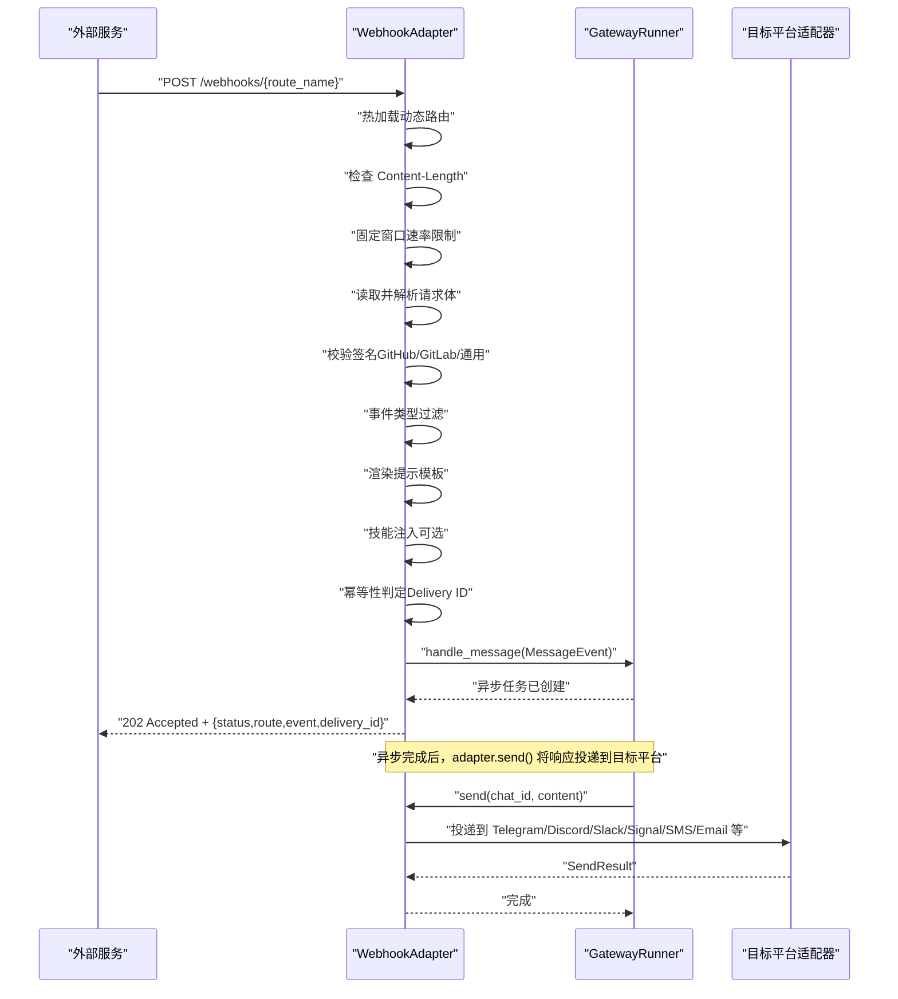
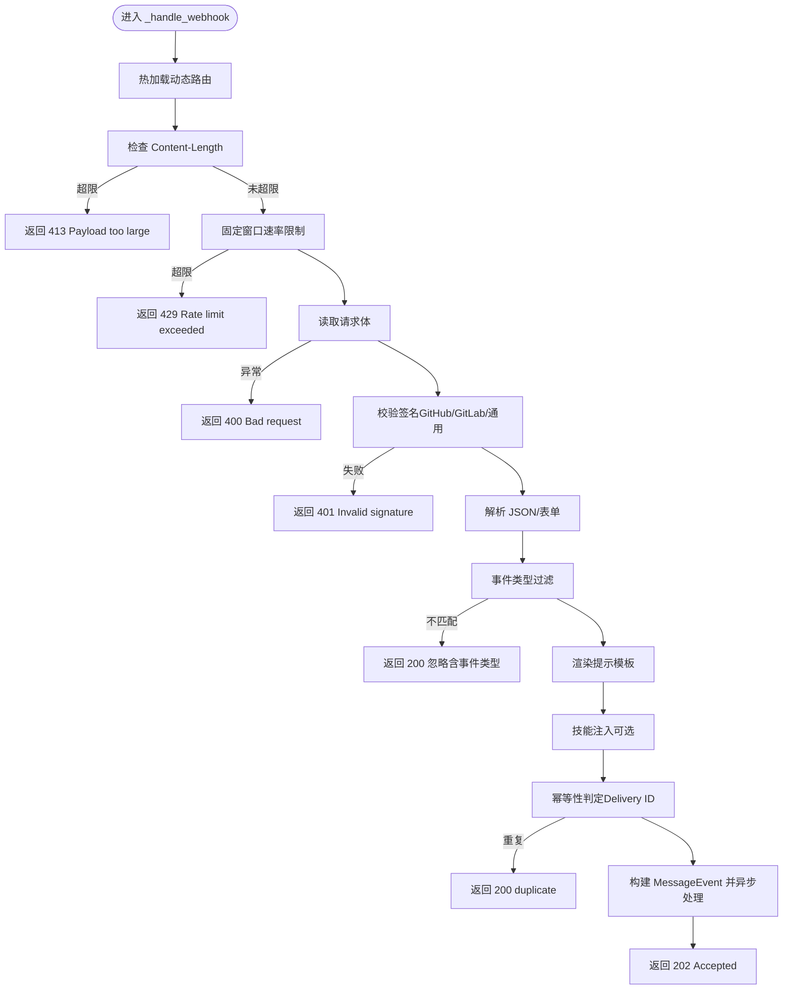
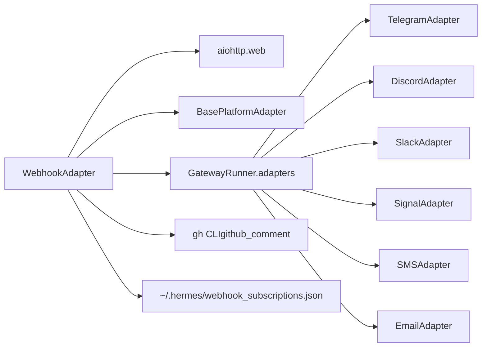

# Webhook 回调集成

<cite>
**本文引用的文件**
- [gateway/platforms/webhook.py](file://gateway/platforms/webhook.py)
- [hermes_cli/webhook.py](file://hermes_cli/webhook.py)
- [website/docs/user-guide/messaging/webhooks.md](file://website/docs/user-guide/messaging/webhooks.md)
- [tests/gateway/test_webhook_adapter.py](file://tests/gateway/test_webhook_adapter.py)
- [tests/gateway/test_webhook_integration.py](file://tests/gateway/test_webhook_integration.py)
- [tests/gateway/test_webhook_dynamic_routes.py](file://tests/gateway/test_webhook_dynamic_routes.py)
- [tests/hermes_cli/test_webhook_cli.py](file://tests/hermes_cli/test_webhook_cli.py)
</cite>

## 目录
1. [简介](#简介)
2. [项目结构](#项目结构)
3. [核心组件](#核心组件)
4. [架构总览](#架构总览)
5. [详细组件分析](#详细组件分析)
6. [依赖分析](#依赖分析)
7. [性能考虑](#性能考虑)
8. [故障排查指南](#故障排查指南)
9. [结论](#结论)
10. [附录](#附录)

## 简介
本文件面向“Webhook 回调集成平台”的使用者与维护者，系统化阐述基于本仓库实现的通用 Webhook 接收器的工作原理与使用方式。内容覆盖：
- HTTP 回调机制、请求处理与响应格式标准化
- Webhook 签名验证、URL 验证与安全认证
- 重试策略、超时处理与幂等性保证
- Webhook 事件类型、负载格式与数据序列化
- 不同编程语言的 Webhook 客户端实现示例（Python、JavaScript/Curl）
- 调试工具、日志记录与监控指标建议
- 与 CI/CD 流水线、监控系统和自动化工具的集成方案
- 安全最佳实践、速率限制与故障恢复策略

## 项目结构
Webhook 平台由以下关键模块组成：
- 平台适配器：接收 HTTP 请求、校验签名、解析负载、触发代理运行、路由响应
- CLI 工具：动态订阅管理、列表查看、删除与测试
- 文档：用户指南，包含配置、事件类型、交付选项、安全与排障
- 测试：覆盖签名验证、动态路由、幂等性、速率限制、跨平台交付与 GitHub/GitLab 场景

```mermaid
graph TB
subgraph "网关平台"
WH["WebhookAdapter<br/>HTTP 接收与处理"]
BASE["BasePlatformAdapter<br/>平台基类"]
end
subgraph "CLI"
CLI["hermes webhook<br/>动态订阅管理"]
end
subgraph "外部服务"
GH["GitHub/GitLab/JIRA/Stripe 等"]
end
GH --> WH
CLI --> WH
WH --> BASE
```

图表来源
- [gateway/platforms/webhook.py:65-160](file://gateway/platforms/webhook.py#L65-L160)
- [hermes_cli/webhook.py:114-134](file://hermes_cli/webhook.py#L114-L134)

章节来源
- [gateway/platforms/webhook.py:1-100](file://gateway/platforms/webhook.py#L1-L100)
- [hermes_cli/webhook.py:1-120](file://hermes_cli/webhook.py#L1-L120)
- [website/docs/user-guide/messaging/webhooks.md:1-60](file://website/docs/user-guide/messaging/webhooks.md#L1-L60)

## 核心组件
- WebhookAdapter：Aiohttp HTTP 服务器，负责健康检查、路由分发、签名验证、事件过滤、提示模板渲染、幂等性控制、速率限制、动态路由热加载、响应投递（日志、GitHub 评论、跨平台）。
- hermes webhook CLI：在 ~/.hermes 下持久化动态订阅，支持订阅、列出、删除、测试；测试时自动生成 HMAC 签名并发送请求。
- 文档与测试：提供配置说明、事件类型、交付选项、安全与排障；通过单元与集成测试覆盖关键行为。

章节来源
- [gateway/platforms/webhook.py:65-160](file://gateway/platforms/webhook.py#L65-L160)
- [hermes_cli/webhook.py:114-180](file://hermes_cli/webhook.py#L114-L180)
- [website/docs/user-guide/messaging/webhooks.md:61-128](file://website/docs/user-guide/messaging/webhooks.md#L61-L128)

## 架构总览
WebhookAdapter 在启动时注册 /health 与 /webhooks/{route_name} 路由，接收外部服务的 HTTP POST，按顺序执行：
- 动态路由热加载
- 内容长度限制（防 DoS）
- 速率限制（固定窗口）
- 负载读取与解析（JSON 或表单）
- 签名验证（GitHub/GitLab/通用）
- 事件类型过滤
- 提示模板渲染
- 技能注入（可选）
- 幂等性判定（Delivery ID 缓存）
- 会话构建与异步处理
- 返回 202 并立即返回，后续通过 send() 投递响应



图表来源
- [gateway/platforms/webhook.py:267-467](file://gateway/platforms/webhook.py#L267-L467)
- [gateway/platforms/webhook.py:163-204](file://gateway/platforms/webhook.py#L163-L204)

章节来源
- [gateway/platforms/webhook.py:267-467](file://gateway/platforms/webhook.py#L267-L467)

## 详细组件分析

### WebhookAdapter 组件
- 生命周期与连接
  - 启动时校验每条路由的密钥（全局或路由级），若未设置且非测试模式则报错
  - 注册 /health 与 /webhooks/{route_name} 路由
  - 端口占用检测，避免冲突
- 请求处理流程
  - 动态路由热加载（mtime 门控，开销极低）
  - Content-Length 检查，超过阈值直接 413
  - 速率限制（每分钟请求数，固定窗口）
  - 读取请求体，失败返回 400
  - 签名验证（GitHub: X-Hub-Signature-256；GitLab: X-Gitlab-Token；通用: X-Webhook-Signature）
  - 解析 JSON，失败尝试表单编码
  - 事件类型过滤（从头部或 payload 中提取）
  - 渲染提示模板（支持点号访问与特殊 __raw__）
  - 技能注入（优先加载第一个匹配的技能）
  - 幂等性判定（Delivery ID 缓存，TTL 1 小时）
  - 构建 MessageEvent 并异步处理，立即返回 202
- 响应投递
  - 日志投递：仅记录
  - GitHub 评论：通过 gh CLI 发送
  - 跨平台投递：Telegram/Discord/Slack/Signal/SMS/Email 等，需目标平台已连接
- 关键参数
  - host/port、全局密钥、路由配置、速率限制、最大请求体大小、幂等性 TTL



图表来源
- [gateway/platforms/webhook.py:267-467](file://gateway/platforms/webhook.py#L267-L467)

章节来源
- [gateway/platforms/webhook.py:65-160](file://gateway/platforms/webhook.py#L65-L160)
- [gateway/platforms/webhook.py:267-467](file://gateway/platforms/webhook.py#L267-L467)

### hermes webhook CLI 组件
- 功能
  - 订阅：生成唯一名称、可选事件列表、提示模板、技能、交付目标与附加参数、自动生成密钥
  - 列表：展示所有动态订阅及其 URL、事件、交付目标
  - 删除：移除指定订阅
  - 测试：构造 HMAC 签名并发送测试请求，打印响应状态与正文
- 存储
  - ~/.hermes/webhook_subscriptions.json，支持热加载
- 与平台集成
  - 生成的 URL 与密钥用于外部服务配置
  - 无需重启即可生效

章节来源
- [hermes_cli/webhook.py:114-180](file://hermes_cli/webhook.py#L114-L180)
- [hermes_cli/webhook.py:219-260](file://hermes_cli/webhook.py#L219-L260)

### 文档与配置要点
- 路由属性
  - events：事件类型白名单（GitHub/GitLab 头部或 payload 字段）
  - secret：HMAC 密钥（路由级优先于全局）
  - prompt：模板字符串，支持点号访问与 __raw__
  - skills：可选技能列表
  - deliver/deliver_extra：交付目标与附加参数（如 repo、pr_number、chat_id）
- 交付选项
  - log、github_comment、telegram、discord、slack、signal、sms、email 等
- 安全与防护
  - HMAC 校验（GitHub/GitLab/通用）
  - 速率限制（默认 30/min）
  - 幂等性（Delivery ID 缓存，TTL 1h）
  - 最大请求体大小（默认 1MB）

章节来源
- [website/docs/user-guide/messaging/webhooks.md:61-128](file://website/docs/user-guide/messaging/webhooks.md#L61-L128)
- [website/docs/user-guide/messaging/webhooks.md:283-327](file://website/docs/user-guide/messaging/webhooks.md#L283-L327)

## 依赖分析
- 组件耦合
  - WebhookAdapter 依赖 Aiohttp 进行 HTTP 处理
  - 与平台基类交互以构建 MessageEvent 与发送结果
  - 与 GatewayRunner 的适配器集合协作进行跨平台投递
  - 与 hermes_constants 获取 HOME 目录以读写动态订阅文件
- 外部依赖
  - GitHub CLI（gh）用于 github_comment 交付
  - 目标平台适配器（Telegram/Discord/Slack/Signal/SMS/Email 等）需已启用并连接



图表来源
- [gateway/platforms/webhook.py:44-50](file://gateway/platforms/webhook.py#L44-L50)
- [gateway/platforms/webhook.py:190-204](file://gateway/platforms/webhook.py#L190-L204)
- [gateway/platforms/webhook.py:564-616](file://gateway/platforms/webhook.py#L564-L616)

章节来源
- [gateway/platforms/webhook.py:44-50](file://gateway/platforms/webhook.py#L44-L50)
- [gateway/platforms/webhook.py:190-204](file://gateway/platforms/webhook.py#L190-L204)

## 性能考虑
- 固定窗口速率限制：每路由每分钟请求数上限，超过即 429
- 内容长度限制：先检查再读取，避免大体积请求阻塞
- 异步处理：收到请求后立即返回 202，实际处理在后台任务中进行
- 幂等性缓存：按 Delivery ID 缓存，TTL 1 小时，避免重复处理
- 动态路由热加载：基于 mtime 的门控，每次请求检查文件变更，开销极低

章节来源
- [gateway/platforms/webhook.py:101-106](file://gateway/platforms/webhook.py#L101-L106)
- [gateway/platforms/webhook.py:288-296](file://gateway/platforms/webhook.py#L288-L296)
- [gateway/platforms/webhook.py:392-409](file://gateway/platforms/webhook.py#L392-L409)
- [gateway/platforms/webhook.py:234-266](file://gateway/platforms/webhook.py#L234-L266)

## 故障排查指南
- Webhook 未到达
  - 确认端口暴露与防火墙放行
  - 使用 /health 检查服务状态
  - 核对 URL 路径与路由名
- 签名验证失败
  - GitHub：确认 X-Hub-Signature-256 与密钥一致
  - GitLab：确认 X-Gitlab-Token 与密钥一致
  - 通用：确认 X-Webhook-Signature 与密钥一致
- 事件被忽略
  - 检查 route.events 是否包含该事件类型
  - GitHub/GitLab 事件类型来自对应头部或 payload 字段
- 重复响应
  - 确保外部服务发送 Delivery ID 头（X-GitHub-Delivery 或 X-Request-ID）
  - Delivery ID 缓存 TTL 为 1 小时
- gh CLI 错误（github_comment）
  - 在网关主机上执行 gh auth login
  - 确认用户对仓库具有写权限
  - 确认 gh 已安装且在 PATH 中

章节来源
- [website/docs/user-guide/messaging/webhooks.md:337-376](file://website/docs/user-guide/messaging/webhooks.md#L337-L376)

## 结论
本 Webhook 回调集成平台提供了安全、可扩展、易用的事件驱动入口，具备完善的签名验证、速率限制、幂等性与动态路由能力，并支持多种交付目标。通过 CLI 可快速创建与测试动态订阅，满足从 GitHub/GitLab 到企业内部系统的广泛场景。

## 附录

### Webhook 事件类型与负载格式
- 事件类型来源
  - GitHub：X-GitHub-Event
  - GitLab：X-GitLab-Event
  - 其他：payload.event_type
- 负载格式
  - 默认 JSON；若解析失败尝试表单编码
  - 支持点号访问与特殊 __raw__ 输出
- 提示模板
  - 支持 {pull_request.title} 等点号访问
  - 支持 {__raw__} 输出完整负载（截断）

章节来源
- [gateway/platforms/webhook.py:332-350](file://gateway/platforms/webhook.py#L332-L350)
- [gateway/platforms/webhook.py:508-546](file://gateway/platforms/webhook.py#L508-L546)
- [website/docs/user-guide/messaging/webhooks.md:109-127](file://website/docs/user-guide/messaging/webhooks.md#L109-L127)

### 安全认证与最佳实践
- 必须为每个路由配置密钥（路由级优先于全局）
- 开发测试可设为 INSECURE_NO_AUTH（跳过校验）
- 使用 HMAC 校验（GitHub/GitLab/通用）
- 速率限制与最大请求体限制
- 幂等性防止重复处理
- 建议在隔离环境中运行（容器/虚拟机），避免攻击面扩大

章节来源
- [gateway/platforms/webhook.py:116-124](file://gateway/platforms/webhook.py#L116-L124)
- [website/docs/user-guide/messaging/webhooks.md:283-334](file://website/docs/user-guide/messaging/webhooks.md#L283-L334)

### 重试策略、超时与幂等性
- 重试策略
  - 外部服务可重试；平台通过 Delivery ID 实现幂等，重复请求返回 200 duplicate
- 超时处理
  - 发送响应到目标平台时，部分路径存在超时控制（例如 github_comment 的子进程调用）
- 幂等性
  - Delivery ID 缓存 TTL 1 小时，到期后允许重新处理

章节来源
- [gateway/platforms/webhook.py:392-409](file://gateway/platforms/webhook.py#L392-L409)
- [tests/gateway/test_webhook_adapter.py:401-434](file://tests/gateway/test_webhook_adapter.py#L401-L434)

### 与 CI/CD、监控与自动化集成
- CI/CD 流水线
  - 使用 hermes webhook subscribe 动态创建流水线事件订阅
  - 通过 deliver 指向通知渠道（Telegram/Discord/Slack/Signal/SMS/Email）
- 监控与告警
  - 使用 deliver=log 或跨平台投递到通知系统
  - 结合外部监控系统采集 /health 与业务日志
- 自动化工具
  - 通过 CLI 与平台交互，实现自动化订阅与测试

章节来源
- [website/docs/user-guide/messaging/webhooks.md:233-280](file://website/docs/user-guide/messaging/webhooks.md#L233-L280)

### 不同编程语言的 Webhook 客户端实现示例

- Python（使用 requests）
  - 步骤
    - 生成 HMAC-SHA256 签名（GitHub 方式：sha256=...）
    - 设置 Content-Type: application/json
    - 设置 X-Hub-Signature-256 头
    - 发送 POST 到 http://host:port/webhooks/{route_name}
  - 参考
    - [hermes_cli/webhook.py:235-259](file://hermes_cli/webhook.py#L235-L259)

- JavaScript（使用 fetch）
  - 步骤
    - 使用 crypto 模块计算 HMAC-SHA256
    - 设置 Content-Type: application/json
    - 设置 X-Hub-Signature-256 头
    - 发送 POST 请求
  - 参考
    - [hermes_cli/webhook.py:235-259](file://hermes_cli/webhook.py#L235-L259)

- Curl
  - 步骤
    - 使用 openssl dgst -sha256 -hmac "$SECRET" 计算签名
    - 设置 -H "Content-Type: application/json"
    - 设置 -H "X-Hub-Signature-256: sha256=..."
    - 发送 -d '{"..."}' POST 请求
  - 参考
    - [hermes_cli/webhook.py:235-259](file://hermes_cli/webhook.py#L235-L259)

章节来源
- [hermes_cli/webhook.py:235-259](file://hermes_cli/webhook.py#L235-L259)

### 调试工具与日志记录
- 健康检查
  - GET /health
  - 参考
    - [gateway/platforms/webhook.py:230-232](file://gateway/platforms/webhook.py#L230-L232)
- CLI 测试
  - hermes webhook test <name> [--payload "..."]
  - 参考
    - [hermes_cli/webhook.py:219-260](file://hermes_cli/webhook.py#L219-L260)
- 日志
  - 关键操作均有日志输出（签名失败、速率限制、幂等跳过、未知路由等）
  - 参考
    - [gateway/platforms/webhook.py:302-314](file://gateway/platforms/webhook.py#L302-L314)
    - [gateway/platforms/webhook.py:292-295](file://gateway/platforms/webhook.py#L292-L295)
    - [gateway/platforms/webhook.py:403-408](file://gateway/platforms/webhook.py#L403-L408)

### 单元与集成测试要点
- 签名验证
  - GitHub/GitLab/通用三种签名方式均通过
  - 无签名头但有密钥时拒绝
- 动态路由
  - mtime 门控热加载，静态路由优先
- 幂等性
  - 同一 Delivery ID 在 TTL 内重复请求返回 200 duplicate
- 速率限制
  - 超限时返回 429
- 集成场景
  - GitHub PR 触发代理运行
  - 技能注入到提示
  - 跨平台交付（Telegram）
  - GitHub 评论交付（gh CLI）

章节来源
- [tests/gateway/test_webhook_adapter.py:119-170](file://tests/gateway/test_webhook_adapter.py#L119-L170)
- [tests/gateway/test_webhook_dynamic_routes.py:26-88](file://tests/gateway/test_webhook_dynamic_routes.py#L26-L88)
- [tests/gateway/test_webhook_adapter.py:401-434](file://tests/gateway/test_webhook_adapter.py#L401-L434)
- [tests/gateway/test_webhook_adapter.py:441-464](file://tests/gateway/test_webhook_adapter.py#L441-L464)
- [tests/gateway/test_webhook_integration.py:81-145](file://tests/gateway/test_webhook_integration.py#L81-L145)
- [tests/gateway/test_webhook_integration.py:151-207](file://tests/gateway/test_webhook_integration.py#L151-L207)
- [tests/gateway/test_webhook_integration.py:213-265](file://tests/gateway/test_webhook_integration.py#L213-L265)
- [tests/gateway/test_webhook_integration.py:271-340](file://tests/gateway/test_webhook_integration.py#L271-L340)
- [tests/hermes_cli/test_webhook_cli.py:50-117](file://tests/hermes_cli/test_webhook_cli.py#L50-L117)