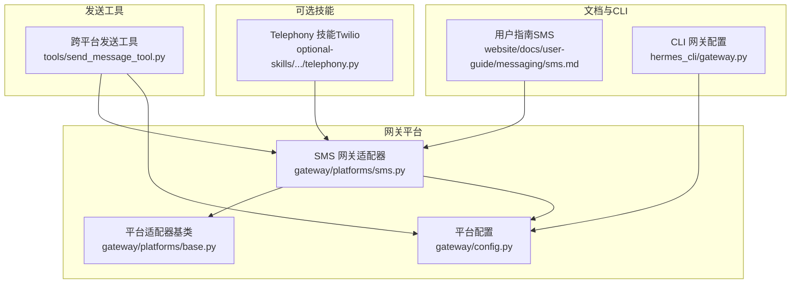
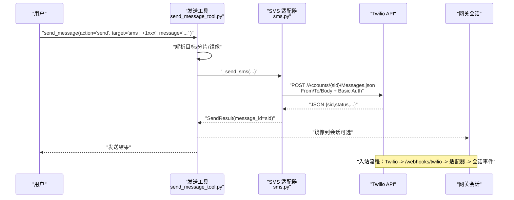
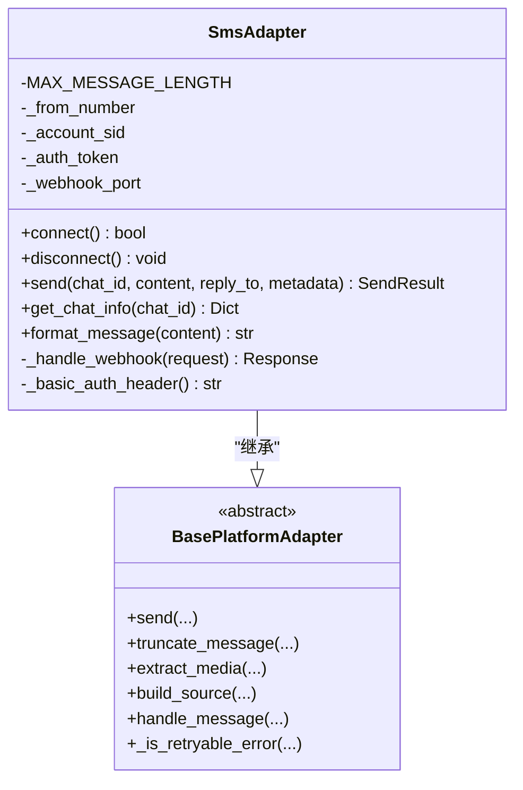
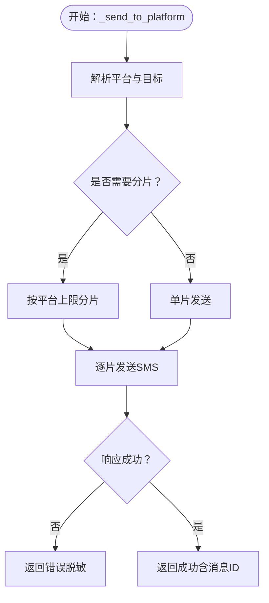
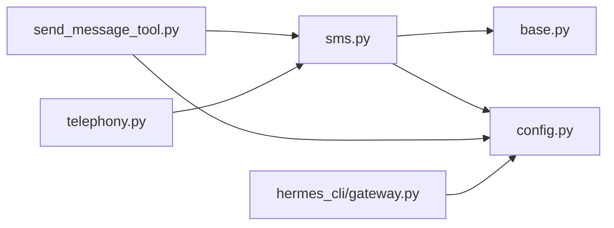

# 短信通信服务

<cite>
**本文档引用的文件**
- [gateway/platforms/sms.py](file://gateway/platforms/sms.py)
- [tools/send_message_tool.py](file://tools/send_message_tool.py)
- [gateway/config.py](file://gateway/config.py)
- [gateway/platforms/base.py](file://gateway/platforms/base.py)
- [tests/gateway/test_sms.py](file://tests/gateway/test_sms.py)
- [website/docs/user-guide/messaging/sms.md](file://website/docs/user-guide/messaging/sms.md)
- [hermes_cli/gateway.py](file://hermes_cli/gateway.py)
- [optional-skills/productivity/telephony/scripts/telephony.py](file://optional-skills/productivity/telephony/scripts/telephony.py)
</cite>

## 目录
1. [简介](#简介)
2. [项目结构](#项目结构)
3. [核心组件](#核心组件)
4. [架构总览](#架构总览)
5. [详细组件分析](#详细组件分析)
6. [依赖关系分析](#依赖关系分析)
7. [性能考虑](#性能考虑)
8. [故障排除指南](#故障排除指南)
9. [结论](#结论)
10. [附录](#附录)

## 简介
本文件面向短信通信服务的技术实现与使用说明，重点覆盖以下方面：
- 技术实现：基于 Twilio REST API 的短信发送、基于 aiohttp 的 Webhook 接收与处理、消息分片与格式化策略
- 平台集成：SMS 网关适配器、跨平台发送工具（send_message_tool）对 SMS 的统一接入
- 运营商与国际号码：通过 Twilio 支持全球号码与短信路由
- 状态报告与送达确认：当前实现以 Twilio API 返回的消息 SID 作为唯一标识；可结合外部监控与日志进行状态追踪
- 错误处理与重试：统一的适配器基类提供指数退避重试与可重试错误判定
- 内容格式与编码：纯文本传输，自动去除 Markdown 格式；字符长度限制与智能分段
- 集成指南：Twilio、可选 telephony 技能与 CLI 配置
- 计费与用量：通过 Twilio API 获取消息状态与媒体数量，结合外部计费系统进行成本控制
- 模板、批量与个性化：通过工具层的分片与目标解析实现批量投递与个性化内容拼接
- 安全与合规：允许白名单、端口与凭证管理、日志脱敏

## 项目结构
短信能力在代码库中主要由三部分组成：
- 网关平台适配器：SMS 网关适配器负责连接 Twilio、发送短信、接收 Webhook
- 发送工具：跨平台发送工具对 SMS 提供统一入口，支持分片与目标解析
- 配置与测试：平台枚举、配置数据结构、环境变量与行为约束，以及单元测试验证

**图表来源**
- [gateway/platforms/sms.py](file://gateway/platforms/sms.py)
- [tools/send_message_tool.py](file://tools/send_message_tool.py)
- [gateway/config.py](file://gateway/config.py)
- [gateway/platforms/base.py](file://gateway/platforms/base.py)
- [website/docs/user-guide/messaging/sms.md](file://website/docs/user-guide/messaging/sms.md)
- [hermes_cli/gateway.py](file://hermes_cli/gateway.py)
- [optional-skills/productivity/telephony/scripts/telephony.py](file://optional-skills/productivity/telephony/scripts/telephony.py)

**章节来源**
- [gateway/platforms/sms.py](file://gateway/platforms/sms.py)
- [tools/send_message_tool.py](file://tools/send_message_tool.py)
- [gateway/config.py](file://gateway/config.py)
- [gateway/platforms/base.py](file://gateway/platforms/base.py)
- [website/docs/user-guide/messaging/sms.md](file://website/docs/user-guide/messaging/sms.md)
- [hermes_cli/gateway.py](file://hermes_cli/gateway.py)
- [optional-skills/productivity/telephony/scripts/telephony.py](file://optional-skills/productivity/telephony/scripts/telephony.py)

## 核心组件
- SMS 网关适配器（Twilio）
  - 负责连接 Twilio REST API 发送短信、启动 Webhook 服务器接收入站消息、格式化与分片处理
  - 关键特性：纯文本传输、1600 字符上限、自动去除 Markdown、回声抑制、日志脱敏
- 跨平台发送工具（send_message_tool）
  - 统一入口，支持按平台路由；对 SMS 使用 HTTP Basic 认证与表单提交
  - 自动分片与目标解析，支持镜像到会话
- 平台配置与基类
  - 平台枚举与配置数据结构；统一的发送重试与错误处理逻辑
- 可选 telephony 技能
  - 提供 Twilio 号码购买、查询、状态监控与 MMS 发送等能力，便于计费与用量统计

**章节来源**
- [gateway/platforms/sms.py](file://gateway/platforms/sms.py)
- [tools/send_message_tool.py](file://tools/send_message_tool.py)
- [gateway/config.py](file://gateway/config.py)
- [gateway/platforms/base.py](file://gateway/platforms/base.py)
- [optional-skills/productivity/telephony/scripts/telephony.py](file://optional-skills/productivity/telephony/scripts/telephony.py)

## 架构总览
短信通信的整体流程分为“出站”和“入站”两条主线：
- 出站（REST API）：工具层或网关适配器调用 Twilio Messages.json 接口，使用 HTTP Basic 认证与表单字段 From/To/Body
- 入站（Webhook）：Twilio 将短信推送到网关的 /webhooks/twilio，网关解析后触发消息事件处理

**图表来源**
- [tools/send_message_tool.py](file://tools/send_message_tool.py)
- [gateway/platforms/sms.py](file://gateway/platforms/sms.py)

**章节来源**
- [tools/send_message_tool.py](file://tools/send_message_tool.py)
- [gateway/platforms/sms.py](file://gateway/platforms/sms.py)

## 详细组件分析

### SMS 网关适配器（Twilio）
- 连接与认证
  - 使用 HTTP Basic 认证，凭据来自环境变量 TWILIO_ACCOUNT_SID 与 TWILIO_AUTH_TOKEN
  - 启动 aiohttp Webhook 服务器，默认监听 8080 端口，可通过 SMS_WEBHOOK_PORT 覆盖
- 出站发送
  - 采用表单字段 From/To/Body 提交至 Twilio Messages.json
  - 自动格式化：去除 Markdown、折叠多余换行；按 1600 字符上限进行智能分片
  - 返回值包含消息 SID，用于后续状态追踪
- 入站接收
  - 解析 TwiML 表单数据，忽略来自自身号码的回声
  - 构建消息事件并异步处理，快速返回空 TwiML 响应
- 安全与隐私
  - 日志中对电话号码进行脱敏显示
  - 默认拒绝所有用户，需通过 SMS_ALLOWED_USERS 或 SMS_ALLOW_ALL_USERS 控制

**图表来源**
- [gateway/platforms/sms.py](file://gateway/platforms/sms.py)
- [gateway/platforms/base.py](file://gateway/platforms/base.py)

**章节来源**
- [gateway/platforms/sms.py](file://gateway/platforms/sms.py)
- [gateway/platforms/base.py](file://gateway/platforms/base.py)

### 跨平台发送工具（SMS 路由）
- 目标解析与分片
  - 支持平台名与目标参考（如 sms:+1xxx），自动解析并进行平台特定分片
  - 对于 SMS，去除 Markdown 并按 1600 字符上限分片
- 认证与请求
  - 使用 HTTP Basic 认证，表单字段 From/To/Body
  - 失败时返回标准化错误信息，并进行敏感信息脱敏
- 镜像与重复跳过
  - 成功后可将内容镜像到目标会话
  - 与计划任务自动投递冲突时进行重复跳过

**图表来源**
- [tools/send_message_tool.py](file://tools/send_message_tool.py)

**章节来源**
- [tools/send_message_tool.py](file://tools/send_message_tool.py)

### 配置与平台枚举
- 平台枚举包含 SMS，支持在配置中启用并设置 home_channel
- 平台配置支持额外参数与回复线程模式等扩展属性
- CLI 与文档提供交互式与手动配置方式，强调安全白名单与端口设置

**章节来源**
- [gateway/config.py](file://gateway/config.py)
- [website/docs/user-guide/messaging/sms.md](file://website/docs/user-guide/messaging/sms.md)
- [hermes_cli/gateway.py](file://hermes_cli/gateway.py)

### 可选 telephony 技能（Twilio 扩展能力）
- 提供 Twilio 号码搜索、购买、状态查询、MMS 发送等功能
- 支持从 Twilio 获取消息列表、检查点与增量拉取，便于计费与用量统计
- 与网关共享相同的 Twilio 凭据

**章节来源**
- [optional-skills/productivity/telephony/scripts/telephony.py](file://optional-skills/productivity/telephony/scripts/telephony.py)

## 依赖关系分析
- 组件耦合
  - SmsAdapter 依赖 BasePlatformAdapter 的分片与事件处理能力
  - send_message_tool 依赖平台配置与各平台适配器的统一接口
- 外部依赖
  - Twilio REST API 与 Webhook
  - aiohttp（网关 Webhook 与工具层 HTTP 请求）
  - 可选 lark-oapi（飞书适配器，非 SMS）

**图表来源**
- [tools/send_message_tool.py](file://tools/send_message_tool.py)
- [gateway/platforms/sms.py](file://gateway/platforms/sms.py)
- [gateway/platforms/base.py](file://gateway/platforms/base.py)
- [gateway/config.py](file://gateway/config.py)
- [hermes_cli/gateway.py](file://hermes_cli/gateway.py)
- [optional-skills/productivity/telephony/scripts/telephony.py](file://optional-skills/productivity/telephony/scripts/telephony.py)

**章节来源**
- [tools/send_message_tool.py](file://tools/send_message_tool.py)
- [gateway/platforms/sms.py](file://gateway/platforms/sms.py)
- [gateway/platforms/base.py](file://gateway/platforms/base.py)
- [gateway/config.py](file://gateway/config.py)
- [hermes_cli/gateway.py](file://hermes_cli/gateway.py)
- [optional-skills/productivity/telephony/scripts/telephony.py](file://optional-skills/productivity/telephony/scripts/telephony.py)

## 性能考虑
- 分片策略
  - 1600 字符上限，优先保留换行与自然边界，避免破坏 Markdown 与代码块
- 异步与并发
  - 网关 Webhook 使用 aiohttp，发送路径使用异步 HTTP 客户端
- 重试与退避
  - 基类提供指数退避重试与可重试错误判定，降低瞬时失败影响
- 资源管理
  - 适配器在连接/断开时正确关闭会话与运行器，避免资源泄漏

[本节为通用指导，无需具体文件分析]

## 故障排除指南
- 常见问题
  - 入站消息未到达：检查 Twilio Webhook URL 是否可达、端口是否被占用、环境变量是否正确
  - 回复无法发送：确认 TWILIO_PHONE_NUMBER 设置为 E.164 格式且账户具备短信能力
  - 端口冲突：修改 SMS_WEBHOOK_PORT 并同步更新 Twilio 控制台
- 日志与诊断
  - 网关日志包含发送与 Webhook 处理的关键信息，注意查看 Twilio 返回的状态码与错误消息
  - 工具层返回的错误已进行敏感信息脱敏，便于向用户展示
- 单元测试参考
  - 测试覆盖了配置加载、格式化、回声抑制、依赖检查与工具集可用性等关键场景

**章节来源**
- [website/docs/user-guide/messaging/sms.md](file://website/docs/user-guide/messaging/sms.md)
- [tests/gateway/test_sms.py](file://tests/gateway/test_sms.py)

## 结论
该短信通信服务以 Twilio 为核心，通过网关适配器与跨平台发送工具实现了稳定的出站与入站能力。其设计强调：
- 明确的平台抽象与统一的错误处理与重试机制
- 简洁的纯文本传输与智能分片策略
- 安全与隐私保护（白名单、脱敏、端口与凭证管理）
- 与可选 telephony 技能的协同，便于计费与用量监控

建议在生产环境中：
- 始终配置允许白名单，避免开放访问
- 使用公网可访问的 Webhook 地址并确保端口畅通
- 结合 Twilio 日志与 telephony 技能的监控能力进行成本与用量控制
- 对敏感场景优先选择加密通道（如 Signal/Telegram）

[本节为总结性内容，无需具体文件分析]

## 附录

### 环境变量与行为要点
- Twilio 凭据与号码：TWILIO_ACCOUNT_SID、TWILIO_AUTH_TOKEN、TWILIO_PHONE_NUMBER
- 网关 Webhook：SMS_WEBHOOK_PORT（默认 8080）、SMS_ALLOWED_USERS、SMS_ALLOW_ALL_USERS
- 主频道：SMS_HOME_CHANNEL、SMS_HOME_CHANNEL_NAME
- 行为特性：纯文本传输、1600 字符上限、回声抑制、日志脱敏

**章节来源**
- [gateway/platforms/sms.py](file://gateway/platforms/sms.py)
- [website/docs/user-guide/messaging/sms.md](file://website/docs/user-guide/messaging/sms.md)

### 状态报告与计费
- 状态报告：Twilio API 返回消息 SID，可用于后续状态查询与追踪
- 计费与用量：可结合 telephony 技能的消息列表查询与媒体计数，配合外部计费系统实现成本控制

**章节来源**
- [optional-skills/productivity/telephony/scripts/telephony.py](file://optional-skills/productivity/telephony/scripts/telephony.py)
- [tools/send_message_tool.py](file://tools/send_message_tool.py)

### 国际号码与运营商集成
- 通过 Twilio 支持全球号码与短信路由，号码格式遵循 E.164
- 号码能力查询与购买由 telephony 技能提供辅助

**章节来源**
- [optional-skills/productivity/telephony/scripts/telephony.py](file://optional-skills/productivity/telephony/scripts/telephony.py)

### 安全与合规
- 默认拒绝所有用户，推荐配置 SMS_ALLOWED_USERS 白名单
- 日志脱敏与最小权限原则，避免在终端环境中开放访问
- 对敏感操作建议使用加密通道（Signal/Telegram）

**章节来源**
- [website/docs/user-guide/messaging/sms.md](file://website/docs/user-guide/messaging/sms.md)