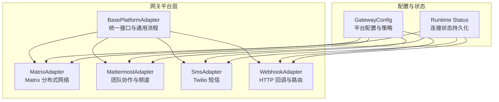
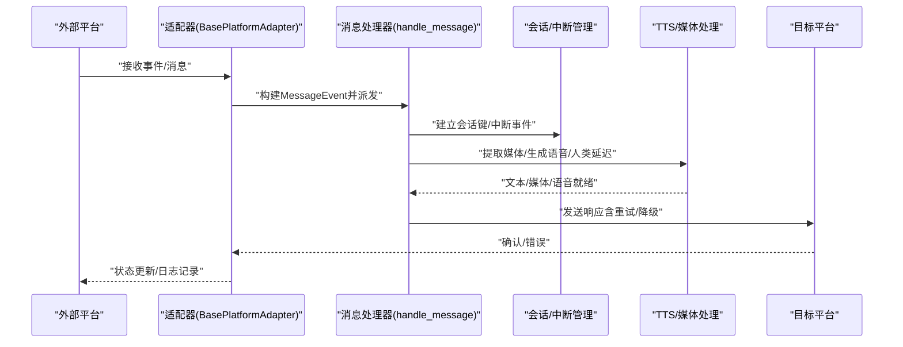
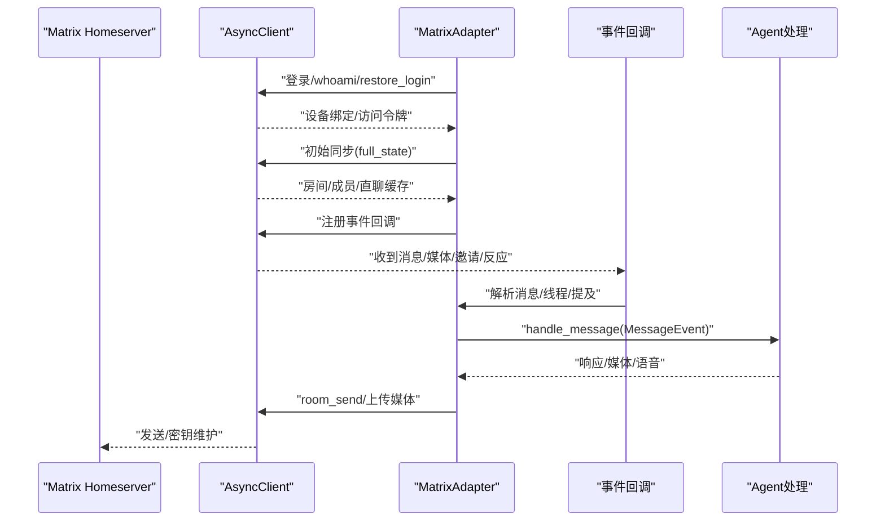
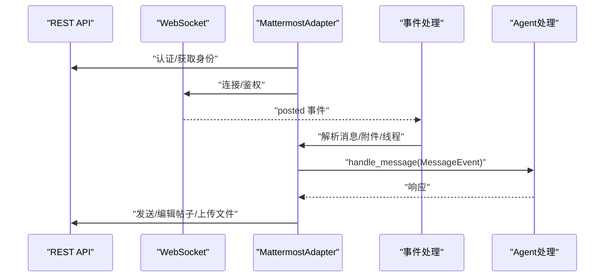
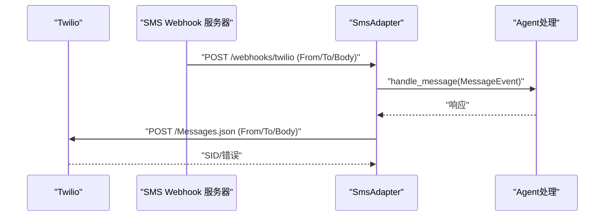
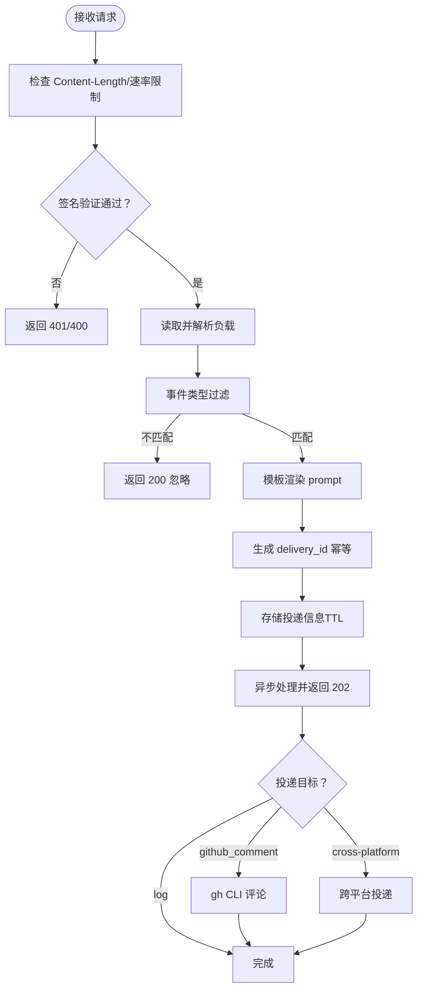
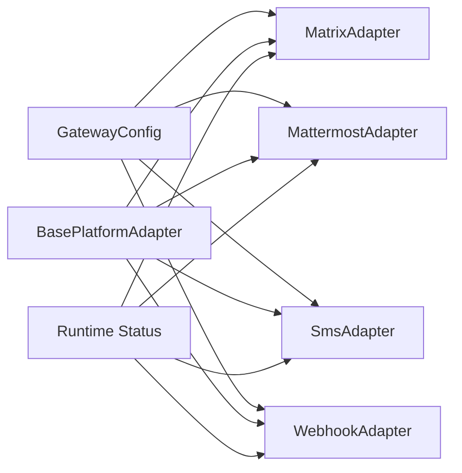

# 通信平台

<cite>
**本文引用的文件**
- [gateway/platforms/base.py](file://gateway/platforms/base.py)
- [gateway/platforms/matrix.py](file://gateway/platforms/matrix.py)
- [gateway/platforms/mattermost.py](file://gateway/platforms/mattermost.py)
- [gateway/platforms/sms.py](file://gateway/platforms/sms.py)
- [gateway/platforms/webhook.py](file://gateway/platforms/webhook.py)
- [gateway/config.py](file://gateway/config.py)
- [gateway/status.py](file://gateway/status.py)
</cite>

## 目录
1. [简介](#简介)
2. [项目结构](#项目结构)
3. [核心组件](#核心组件)
4. [架构总览](#架构总览)
5. [详细组件分析](#详细组件分析)
6. [依赖关系分析](#依赖关系分析)
7. [性能考虑](#性能考虑)
8. [故障排查指南](#故障排查指南)
9. [结论](#结论)
10. [附录](#附录)

## 简介
本文件面向“通信类消息平台”的技术文档，覆盖以下能力与平台：
- Matrix 分布式网络：去中心化信任模型、端到端加密（E2EE）通信机制、房间与线程管理、提及触发与反应标记等。
- Mattermost 团队协作：频道管理、权限控制、提及规则、回复线程模式、插件生态与文件附件。
- 短信服务（SMS）：基于 Twilio 的出站短信与入站回执、号码清洗与安全策略。
- Webhook 集成：HTTP 回调接收、HMAC 签名验证、速率限制、幂等性、动态路由与跨平台投递。

文档同时提供消息格式标准化、状态同步与错误处理策略，以及性能优化、带宽管理与 QoS 保障建议，并给出跨平台协议转换与数据映射指南。

## 项目结构
通信平台以“适配器”为核心，统一抽象于基类，按平台拆分具体实现；配置与运行时状态通过独立模块管理。

图表来源
- [gateway/platforms/base.py](file://gateway/platforms/base.py)
- [gateway/platforms/matrix.py](file://gateway/platforms/matrix.py)
- [gateway/platforms/mattermost.py](file://gateway/platforms/mattermost.py)
- [gateway/platforms/sms.py](file://gateway/platforms/sms.py)
- [gateway/platforms/webhook.py](file://gateway/platforms/webhook.py)
- [gateway/config.py](file://gateway/config.py)
- [gateway/status.py](file://gateway/status.py)

章节来源
- [gateway/platforms/base.py](file://gateway/platforms/base.py)
- [gateway/platforms/matrix.py](file://gateway/platforms/matrix.py)
- [gateway/platforms/mattermost.py](file://gateway/platforms/mattermost.py)
- [gateway/platforms/sms.py](file://gateway/platforms/sms.py)
- [gateway/platforms/webhook.py](file://gateway/platforms/webhook.py)
- [gateway/config.py](file://gateway/config.py)
- [gateway/status.py](file://gateway/status.py)

## 核心组件
- 基类适配器（BasePlatformAdapter）
  - 统一定义连接、断开、发送、编辑、媒体发送、打字指示、会话中断与重试策略。
  - 提供消息事件标准化（MessageEvent）、发送结果封装（SendResult）、会话键生成与并发控制。
  - 内置人类延迟模拟、媒体提取与自动语音播报（TTS）等体验增强功能。
- 平台适配器
  - Matrix：支持 E2EE、房间/线程、提及过滤、反应标记、密钥导出与维护。
  - Mattermost：支持频道类型识别、提及规则、回复线程、文件上传与 WebSocket 实时事件。
  - SMS：Twilio 出站短信、入站 Webhook、号码清洗与安全策略。
  - Webhook：多路由、HMAC 签名、速率限制、幂等性、动态订阅与跨平台投递。

章节来源
- [gateway/platforms/base.py](file://gateway/platforms/base.py)
- [gateway/platforms/matrix.py](file://gateway/platforms/matrix.py)
- [gateway/platforms/mattermost.py](file://gateway/platforms/mattermost.py)
- [gateway/platforms/sms.py](file://gateway/platforms/sms.py)
- [gateway/platforms/webhook.py](file://gateway/platforms/webhook.py)

## 架构总览
下图展示从外部平台到内部适配器的消息流与关键处理点，包括认证、事件解析、会话管理、媒体缓存与响应投递。

图表来源
- [gateway/platforms/base.py](file://gateway/platforms/base.py)

## 详细组件分析

### Matrix 分布式网络
- 去中心化与信任模型
  - 通过任意 Matrix Homeserver 连接，无需中心化仲裁；用户身份与设备由 homeserver 管理。
  - 支持端到端加密（E2EE），使用 Olm/Megolm 密钥交换；可持久化密钥导出文件，重启后恢复会话。
- 加密通信机制
  - 启用 E2EE 时，初始化密钥上传、导入历史密钥、处理未解密事件缓冲与超时重试。
  - 发送失败若与未验证设备或发送重试相关，自动执行 E2EE 维护后重试。
- 房间与线程
  - 初始同步加载房间状态，缓存 DM 列表；支持线程回复（thread_id）与回复引用（reply_to）。
  - 可配置“需要提及”与“自由响应房间”，避免非目标房间的噪音。
- 媒体与富文本
  - 支持图片、音频、视频、文件上传与原生媒体消息；Markdown 转 HTML 渲染。
- 安全与合规
  - SSRF 保护：下载媒体前校验 URL 安全性；日志中对敏感信息进行脱敏。
  - 未解密事件缓冲上限与 TTL，防止无限重试导致资源耗尽。

图表来源
- [gateway/platforms/matrix.py](file://gateway/platforms/matrix.py)

章节来源
- [gateway/platforms/matrix.py](file://gateway/platforms/matrix.py)

### Mattermost 团队协作
- 频道管理与权限控制
  - 识别频道类型（私有/公开/直聊），支持提及规则与自由响应通道白名单。
  - 通过 WebSocket 实时监听“posted”事件，过滤自身消息与系统消息，避免回环。
- 插件系统与文件附件
  - 使用 REST API 发送/编辑帖子；文件上传后以附件形式发布。
  - 下载并缓存文件内容至本地，便于后续工具链处理（如视觉/语音）。
- 回复线程与提及
  - 支持“线程回复”模式，根消息 root_id 用于关联上下文。
  - 提及检测与清理，确保下游看到干净输入。
- 连接健壮性
  - 指数退避重连，区分永久鉴权失败与瞬时网络错误，避免无限循环。

图表来源
- [gateway/platforms/mattermost.py](file://gateway/platforms/mattermost.py)

章节来源
- [gateway/platforms/mattermost.py](file://gateway/platforms/mattermost.py)

### 短信服务（SMS）
- 技术实现
  - 出站：基于 Twilio REST API，按段落拆分（最大约 1600 字符），逐段发送。
  - 入站：内置 aiohttp Webhook 服务器，接收 TwiML 表单数据，解析 From/To/Body/Sid。
- 国际号码支持
  - 使用 E.164 格式号码；在日志中进行脱敏显示；允许通过环境变量配置允许列表。
- 安全与合规
  - Basic 认证头；日志脱敏；SSRF 保护；禁止回环（忽略来自自身号码的消息）。
- 错误处理
  - 失败时返回标准错误码与消息；必要时通知用户并提示重试。

图表来源
- [gateway/platforms/sms.py](file://gateway/platforms/sms.py)

章节来源
- [gateway/platforms/sms.py](file://gateway/platforms/sms.py)

### Webhook 集成
- HTTP 回调机制
  - 监听 /webhooks/{route_name}，支持健康检查 /health；端口冲突快速失败。
- 签名验证与安全
  - 支持 GitHub/GitLab/通用 HMAC-SHA256 签名；测试模式可禁用验证。
- 速率限制与幂等性
  - 每路由固定窗口计数；按 delivery_id 幂等，避免重复执行。
- 动态路由与跨平台投递
  - 支持动态订阅文件热加载；模板渲染 payload；可投递到 GitHub 评论或其它平台。
- 重试策略
  - 对于可重试的网络错误，采用指数退避；对不可重试错误（如格式错误）尝试纯文本降级。

图表来源
- [gateway/platforms/webhook.py](file://gateway/platforms/webhook.py)

章节来源
- [gateway/platforms/webhook.py](file://gateway/platforms/webhook.py)

## 依赖关系分析
- 平台适配器依赖基类提供的统一接口与通用流程（发送重试、媒体缓存、会话管理、生命周期钩子）。
- 配置模块负责平台启用、令牌/密钥、首页频道、会话重置策略与流式传输设置。
- 运行时状态模块负责进程 PID 文件、运行状态持久化与平台连接状态写入。

图表来源
- [gateway/config.py](file://gateway/config.py)
- [gateway/platforms/base.py](file://gateway/platforms/base.py)
- [gateway/status.py](file://gateway/status.py)

章节来源
- [gateway/config.py](file://gateway/config.py)
- [gateway/platforms/base.py](file://gateway/platforms/base.py)
- [gateway/status.py](file://gateway/status.py)

## 性能考虑
- 带宽与吞吐
  - 平台消息分片（如 Matrix/Mattermost/SMS）避免超限；Webhook 采用固定窗口速率限制与请求体大小限制。
  - 媒体下载采用指数退避与重试，避免慢 CDN 影响整体吞吐。
- 延迟与体验
  - 基类提供“人类延迟”随机延时，提升自然交互体验；持续打字指示刷新频率适配平台特性。
  - 多媒体发送按人类延迟间隔，避免密集投递造成平台限流。
- 资源与稳定性
  - 未解密事件缓冲上限与 TTL，防止内存膨胀；会话并发控制与中断事件避免资源泄漏。
  - Webhook 幂等与 TTL 清理，保证在高并发/重试场景下的稳定。

## 故障排查指南
- 连接失败
  - 检查令牌/密钥是否正确配置；查看运行时状态文件中的平台状态与错误码。
- 矩阵 E2EE 失败
  - 确认已安装 E2EE 依赖；检查设备 ID 与密钥导出文件；关注“未验证设备”错误并执行 E2EE 维护。
- Mattermost WebSocket 断开
  - 查看鉴权错误（401/403）与网络异常；确认指数退避重连逻辑是否生效。
- Webhook 签名失败
  - 确认路由签名密钥；检查请求头（GitHub/GitLab/通用）是否匹配；必要时启用测试模式。
- 短信发送失败
  - 检查 Twilio 返回状态码与错误消息；确认号码格式（E.164）与允许列表；查看日志脱敏后的 From/To。

章节来源
- [gateway/status.py](file://gateway/status.py)
- [gateway/platforms/matrix.py](file://gateway/platforms/matrix.py)
- [gateway/platforms/mattermost.py](file://gateway/platforms/mattermost.py)
- [gateway/platforms/webhook.py](file://gateway/platforms/webhook.py)
- [gateway/platforms/sms.py](file://gateway/platforms/sms.py)

## 结论
该通信平台通过统一的适配器基类与平台特定实现，提供了矩阵化、团队化、短信化与 Webhook 化的多维消息能力。其设计强调：
- 安全性：E2EE、签名验证、速率限制、幂等性与 SSRF 保护；
- 可靠性：重试策略、指数退避、会话中断与状态持久化；
- 可扩展性：动态路由、跨平台投递、媒体缓存与人类延迟；
- 易用性：提及过滤、线程回复、自动语音播报与纯文本降级。

## 附录

### 消息格式标准化与状态同步
- 标准化消息事件（MessageEvent）包含文本、类型、来源、原始消息、媒体列表、回复上下文等字段，确保跨平台一致性。
- 发送结果（SendResult）统一返回成功/失败、消息 ID、错误信息与可重试标志，便于上层统一处理。
- 运行时状态（gateway_state.json）记录各平台连接状态、错误码与时间戳，便于诊断与运维。

章节来源
- [gateway/platforms/base.py](file://gateway/platforms/base.py)
- [gateway/status.py](file://gateway/status.py)

### 跨平台通信协议转换与数据映射
- 会话键生成：根据平台、聊天 ID、用户 ID、线程 ID 与话题生成唯一会话键，隔离不同上下文。
- 来源对象（SessionSource）：统一承载平台标识、聊天类型、用户信息与线程信息，便于下游工具链使用。
- 媒体映射：图片/音频/视频/文档分别映射到平台原生媒体 API 或文件附件；本地路径与 URL 自动识别与缓存。

章节来源
- [gateway/platforms/base.py](file://gateway/platforms/base.py)