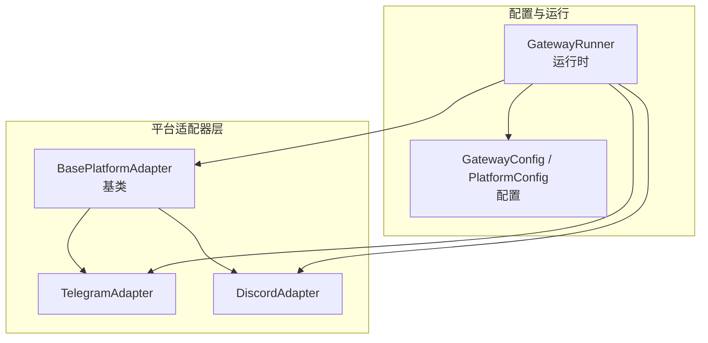
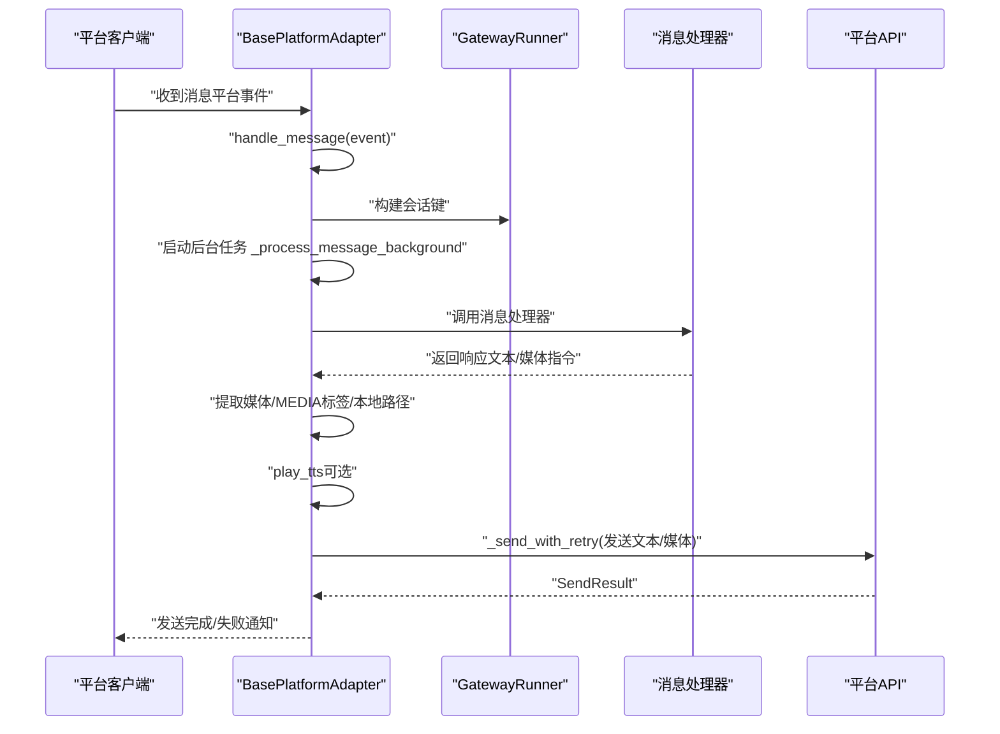
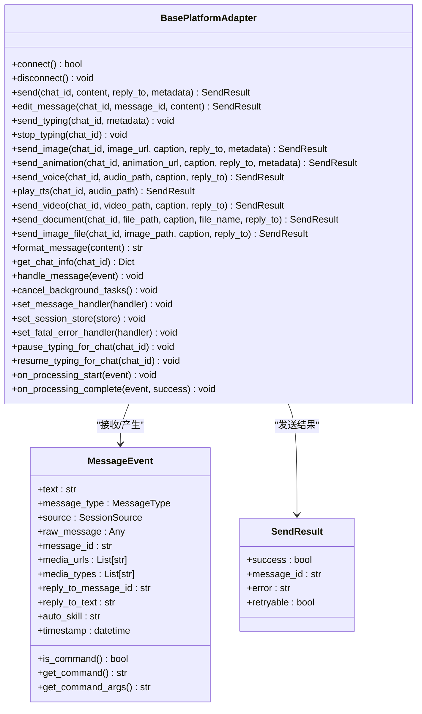
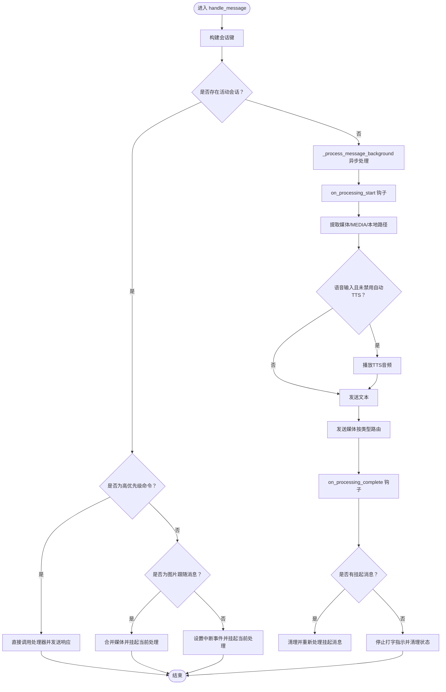
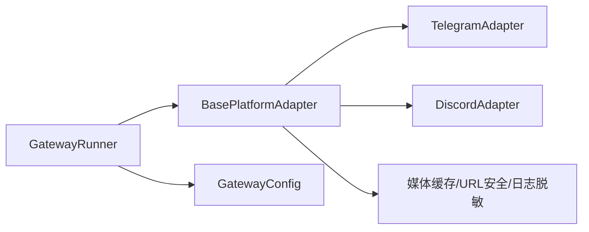

# 平台适配器开发

<cite>
**本文档引用的文件**
- [gateway/platforms/base.py](file://gateway/platforms/base.py)
- [gateway/platforms/__init__.py](file://gateway/platforms/__init__.py)
- [gateway/platforms/ADDING_A_PLATFORM.md](file://gateway/platforms/ADDING_A_PLATFORM.md)
- [gateway/platforms/telegram.py](file://gateway/platforms/telegram.py)
- [gateway/platforms/discord.py](file://gateway/platforms/discord.py)
- [gateway/config.py](file://gateway/config.py)
- [gateway/run.py](file://gateway/run.py)
</cite>

## 目录
1. [简介](#简介)
2. [项目结构](#项目结构)
3. [核心组件](#核心组件)
4. [架构总览](#架构总览)
5. [详细组件分析](#详细组件分析)
6. [依赖分析](#依赖分析)
7. [性能考虑](#性能考虑)
8. [故障排查指南](#故障排查指南)
9. [结论](#结论)
10. [附录](#附录)

## 简介
本指南面向为 Hermes Agent 开发“平台适配器”的工程师，系统讲解 BasePlatformAdapter 基类的设计与实现，覆盖抽象方法定义、生命周期管理、事件处理机制、消息事件模型、会话管理与状态同步、配置与错误处理、日志记录最佳实践、平台特定扩展点与钩子函数、中间件机制、测试策略与模拟环境、以及性能优化与并发处理等主题。同时提供从零开始实现新平台适配器的完整流程与检查清单。

## 项目结构
Hermes 的平台适配器位于 gateway/platforms 子目录，采用“基类 + 多平台实现”的分层设计：
- 基类：gateway/platforms/base.py 定义统一接口、消息事件模型、发送重试与回退策略、会话键生成、媒体缓存工具等
- 平台实现：如 TelegramAdapter、DiscordAdapter 等，继承自 BasePlatformAdapter，实现具体平台的连接、消息收发、格式化、媒体处理等
- 配置与运行时：gateway/config.py 提供平台枚举、配置数据结构与加载逻辑；gateway/run.py 负责适配器实例化、生命周期管理与错误恢复

图表来源
- [gateway/platforms/base.py](file://gateway/platforms/base.py)
- [gateway/platforms/telegram.py](file://gateway/platforms/telegram.py)
- [gateway/platforms/discord.py](file://gateway/platforms/discord.py)
- [gateway/config.py](file://gateway/config.py)
- [gateway/run.py](file://gateway/run.py)

章节来源
- [gateway/platforms/base.py](file://gateway/platforms/base.py)
- [gateway/platforms/__init__.py](file://gateway/platforms/__init__.py)
- [gateway/config.py](file://gateway/config.py)
- [gateway/run.py](file://gateway/run.py)

## 核心组件
- BasePlatformAdapter 抽象基类：定义平台适配器必须实现的接口（连接、断开、发送、编辑、打字指示、媒体发送等），并提供通用的消息处理流程、重试与回退、会话跟踪、生命周期钩子、媒体缓存与清理、人类节奏延迟等能力
- MessageEvent 消息事件模型：标准化不同平台的输入消息，包含文本内容、消息类型、原始消息体、媒体附件、回复上下文、自动技能注入、时间戳等
- SendResult 发送结果模型：统一返回发送是否成功、消息ID、错误信息、是否可重试等
- 平台枚举与配置：Platform 枚举与 PlatformConfig/GatewayConfig 数据结构，支持从环境变量与配置文件加载平台参数
- 运行时管理：GatewayRunner 负责适配器实例化、消息路由、会话状态、后台任务管理、错误恢复与重连

章节来源
- [gateway/platforms/base.py](file://gateway/platforms/base.py)
- [gateway/config.py](file://gateway/config.py)
- [gateway/run.py](file://gateway/run.py)

## 架构总览
下图展示平台适配器在 Hermes 中的整体交互：GatewayRunner 加载配置并创建适配器实例，适配器通过 handle_message 接收平台消息，调用消息处理器生成响应，再通过 _send_with_retry 与平台 API 交互，期间支持媒体提取与本地化发送、TTS 自动语音播放、人类节奏延迟、生命周期钩子等。

图表来源
- [gateway/platforms/base.py](file://gateway/platforms/base.py)
- [gateway/run.py](file://gateway/run.py)

## 详细组件分析

### BasePlatformAdapter 设计与实现
- 抽象方法
  - connect()/disconnect()：建立与平台的连接/断开，启动/停止监听与后台任务
  - send(chat_id, content, reply_to, metadata)：向聊天发送文本消息
  - 可选扩展：edit_message、send_typing、stop_typing、send_image、send_animation、send_voice、play_tts、send_video、send_document、send_image_file、format_message、get_chat_info 等
- 生命周期管理
  - _mark_connected/_mark_disconnected：更新运行状态与运行时状态文件
  - set_fatal_error_handler/_set_fatal_error/_notify_fatal_error：设置致命错误处理器与上报
  - cancel_background_tasks：在关闭或替换时取消进行中的后台任务
- 事件处理机制
  - handle_message：快速返回，将消息派发到后台任务；支持命令优先级（approve/deny/status/stop/new/reset）绕过活动会话保护；照片批量合并与队列化；中断信号与挂起消息管理
  - _process_message_background：实际处理流程，含生命周期钩子、媒体提取与本地化发送、TTS 自动语音、人类节奏延迟、错误上报与清理
  - _run_processing_hook：安全地执行生命周期钩子，避免异常影响消息流
- 消息事件模型
  - MessageEvent：统一承载文本、消息类型、来源、原始消息、媒体列表、回复上下文、自动技能、时间戳等
  - MessageType：文本、位置、图片、视频、音频、语音、文档、贴纸、命令等
  - SendResult：成功与否、消息ID、错误、是否可重试
- 媒体与缓存
  - 图片/音频/文档缓存工具：异步下载与本地缓存，支持重试与 SSRF 保护
  - extract_images/extract_media/extract_local_files：从响应中提取媒体链接与本地路径，支持 MEDIA: 与 [[audio_as_voice]]
  - _is_animation_url：判断 GIF 动图以选择 send_animation
- 发送重试与回退
  - _send_with_retry：对瞬时网络错误自动重试，超时错误不重试，格式化失败尝试纯文本回退
  - _is_retryable_error/_is_timeout_error：识别可重试错误与超时错误
- 会话管理与状态同步
  - build_session_key：基于 SessionSource 生成会话键，支持按用户隔离与线程共享策略
  - _active_sessions/_pending_messages：跟踪活动会话与挂起消息，支持中断与后续处理
  - _typing_tasks/_keep_typing：持续发送打字指示，支持暂停与恢复
  - _auto_tts_disabled_chats：按聊天禁用自动 TTS
- 配置与环境
  - 支持从环境变量与配置文件加载平台参数，如 Telegram 的 webhook、fallback IP、DM Topic 等
- 日志与安全
  - _safe_url_for_log：日志中脱敏 URL
  - SSRF 检查与路径穿越保护

图表来源
- [gateway/platforms/base.py](file://gateway/platforms/base.py)

章节来源
- [gateway/platforms/base.py](file://gateway/platforms/base.py)

### 新平台适配器开发流程
参考官方“新增平台”清单，确保覆盖所有集成点：
- 在 gateway/platforms/<platform>.py 实现适配器，继承 BasePlatformAdapter，实现必需方法与可选方法
- 在 gateway/config.py 的 Platform 枚举中添加新平台，并在 _apply_env_overrides 中支持环境变量加载
- 在 gateway/run.py 的工厂方法中注册新适配器的创建逻辑与依赖检查
- 在授权映射中完善 _is_user_authorized 的平台映射
- 如需额外身份字段，在 gateway/session.py 的 SessionSource 中扩展
- 在 agent/prompt_builder.py 添加平台提示词
- 在 toolsets.py 注册平台工具集
- 在 cron/scheduler.py 与 tools/send_message_tool.py 中完善投递与路由
- 在 gateway/channel_directory.py 中完善会话发现策略
- 在 hermes_cli/status.py 与 hermes_cli/gateway.py 中完善状态显示与安装向导
- 在 agent/redact.py 添加敏感标识脱敏规则
- 编写测试用例，覆盖平台枚举、配置加载、会话源、授权、发送工具路由等

章节来源
- [gateway/platforms/ADDING_A_PLATFORM.md](file://gateway/platforms/ADDING_A_PLATFORM.md)
- [gateway/config.py](file://gateway/config.py)
- [gateway/run.py](file://gateway/run.py)

### 平台特定实现示例：TelegramAdapter
- 连接方式：支持轮询与 Webhook，具备令牌锁防止重复使用、网络错误自动重连、冲突错误处理
- 文本处理：MarkdownV2 转义与清理、长文本截断、回复线程控制
- 媒体处理：图片/音频/文档缓存、DM Topic 创建与持久化、相册/文本批处理缓冲
- 交互增强：按钮式审批、模型选择器状态、DM Topic 映射

章节来源
- [gateway/platforms/telegram.py](file://gateway/platforms/telegram.py)

### 平台特定实现示例：DiscordAdapter
- 连接方式：基于 discord.py 的 Bot，支持意图配置、去重、忽略系统消息
- 交互增强：消息反应反馈（👀/✅/❌）、自动线程、语音通道监听与解码、静音检测与转写
- 权限与过滤：允许用户白名单、@提及要求、自由回复通道、忽略通道等

章节来源
- [gateway/platforms/discord.py](file://gateway/platforms/discord.py)

### 消息事件模型与处理流程
- MessageEvent 字段与语义：文本、类型、来源、媒体、回复上下文、自动技能、时间戳
- 命令解析：is_command/get_command/get_command_args
- 处理流程：handle_message → 后台任务 → 生命周期钩子 → 媒体提取与本地化 → TTS → 发送 → 错误上报与清理

图表来源
- [gateway/platforms/base.py](file://gateway/platforms/base.py)

章节来源
- [gateway/platforms/base.py](file://gateway/platforms/base.py)

### 会话管理与状态同步
- 会话键生成：基于 SessionSource（平台、聊天ID、用户ID、线程ID、话题等）
- 活动会话跟踪：_active_sessions 记录每个会话的中断事件，支持并发安全
- 挂起消息队列：_pending_messages 在活跃会话期间排队后续消息，避免丢失
- 打字指示：_keep_typing 持续刷新，支持暂停/恢复与平台特定停止逻辑
- 自动 TTS：按聊天禁用集合与语音输入自动播放

章节来源
- [gateway/platforms/base.py](file://gateway/platforms/base.py)

### 配置管理与环境变量
- 平台枚举：Platform 包含 TELEGRAM、DISCORD、WHATSAPP、SLACK、SIGNAL、MATRIX、HOMEASSISTANT、EMAIL、SMS、DINGTALK、API_SERVER、WEBHOOK、FEISHU、WECOM 等
- 配置数据结构：PlatformConfig、HomeChannel、SessionResetPolicy、StreamingConfig、GatewayConfig
- 配置加载：优先级为环境变量 > ~/.hermes/config.yaml > ~/.hermes/gateway.json > 内置默认值
- 环境变量桥接：_apply_env_overrides 将各平台令牌、回复模式、备用IP、Home Channel 等注入配置

章节来源
- [gateway/config.py](file://gateway/config.py)

### 错误处理与日志记录最佳实践
- 致命错误：_set_fatal_error 设置错误码与消息，触发状态文件更新与可选回调
- 可重试错误：_is_retryable_error 识别网络类瞬时错误；_is_timeout_error 区分读写超时（不重试）
- 发送重试：_send_with_retry 自动指数退避重试，失败后发送用户可见的通知
- 日志脱敏：_safe_url_for_log 对日志中的 URL 进行脱敏，避免泄露凭据
- SSRF 与路径穿越：媒体下载前进行 URL 安全性检查；文档缓存进行路径穿越保护

章节来源
- [gateway/platforms/base.py](file://gateway/platforms/base.py)

### 平台特定扩展点、钩子函数与中间件机制
- 生命周期钩子：on_processing_start/on_processing_complete，平台可实现自定义反馈（如 Discord 的反应）
- 打字指示：send_typing/stop_typing 与 _keep_typing 循环，支持暂停/恢复
- 中间件风格：_run_processing_hook 统一执行钩子，捕获异常不影响主流程
- 平台特定行为：Telegram 的 DM Topic、Webhook 与 fallback IP；Discord 的语音监听与静音检测

章节来源
- [gateway/platforms/base.py](file://gateway/platforms/base.py)
- [gateway/platforms/discord.py](file://gateway/platforms/discord.py)
- [gateway/platforms/telegram.py](file://gateway/platforms/telegram.py)

### 测试策略、模拟环境与集成测试
- 单元测试：覆盖平台枚举、配置加载、会话源序列化/反序列化、授权映射、发送工具路由
- 异步测试：模拟平台 API，验证消息处理流程、重连逻辑、附件处理、群组消息过滤
- 集成测试：端到端验证适配器生命周期、会话中断、媒体发送、TTS 播放、状态同步
- 快速验证：使用 grep 搜索平台名称，确保遗漏的集成点被补齐

章节来源
- [gateway/platforms/ADDING_A_PLATFORM.md](file://gateway/platforms/ADDING_A_PLATFORM.md)

## 依赖分析
- 组件耦合
  - BasePlatformAdapter 与平台实现之间为强依赖关系，平台实现必须遵循基类接口
  - GatewayRunner 与适配器之间为弱耦合，通过统一接口交互
  - 配置模块与运行模块相互独立，通过数据结构传递
- 外部依赖
  - 平台 SDK：Telegram 的 python-telegram-bot、Discord 的 discord.py
  - HTTP/网络库：httpx、aiohttp（用于媒体下载与平台 API）
  - 工具库：url_safety、yaml、json、logging、asyncio、pathlib 等

图表来源
- [gateway/platforms/base.py](file://gateway/platforms/base.py)
- [gateway/platforms/telegram.py](file://gateway/platforms/telegram.py)
- [gateway/platforms/discord.py](file://gateway/platforms/discord.py)
- [gateway/run.py](file://gateway/run.py)
- [gateway/config.py](file://gateway/config.py)

章节来源
- [gateway/platforms/base.py](file://gateway/platforms/base.py)
- [gateway/platforms/telegram.py](file://gateway/platforms/telegram.py)
- [gateway/platforms/discord.py](file://gateway/platforms/discord.py)
- [gateway/run.py](file://gateway/run.py)
- [gateway/config.py](file://gateway/config.py)

## 性能考虑
- 并发与任务管理
  - 使用 asyncio.create_task 管理后台消息处理，避免阻塞事件循环
  - 通过 cancel_background_tasks 在关闭/替换时清理任务，防止僵尸任务
- 媒体处理
  - 异步下载媒体并缓存至本地，减少平台 URL 过期带来的失败
  - 对 GIF 动图使用 send_animation 以获得内联播放体验
- 发送策略
  - _send_with_retry 指数退避重试，降低瞬时网络抖动的影响
  - 人类节奏延迟（_get_human_delay）提升用户体验，避免过于频繁的发送
- 会话隔离
  - group_sessions_per_user/thread_sessions_per_user 控制会话隔离策略，平衡并发与资源占用

章节来源
- [gateway/platforms/base.py](file://gateway/platforms/base.py)

## 故障排查指南
- 连接失败
  - 检查令牌/密钥是否正确配置，查看致命错误码与消息
  - 对于 Telegram：确认轮询冲突与网络错误重连逻辑
  - 对于 Discord：检查意图配置与去重逻辑
- 发送失败
  - 查看 SendResult.error 与 retryable 标记，区分瞬时错误与永久错误
  - 若为超时错误，避免自动重试，改用手动重试
- 媒体问题
  - 确认媒体 URL 安全性与缓存路径有效性
  - 检查 MIME 类型与文件扩展名匹配
- 会话中断
  - 确认 _active_sessions 与 _pending_messages 的状态一致性
  - 检查命令优先级与照片批处理逻辑

章节来源
- [gateway/platforms/base.py](file://gateway/platforms/base.py)
- [gateway/platforms/telegram.py](file://gateway/platforms/telegram.py)
- [gateway/platforms/discord.py](file://gateway/platforms/discord.py)

## 结论
通过 BasePlatformAdapter 基类提供的统一接口与通用能力，Hermes 实现了跨平台的一致性与可扩展性。开发者只需关注平台特有的连接、消息格式化与媒体处理差异，即可快速接入新平台。配合完善的配置体系、错误处理与测试策略，可以保证适配器在生产环境中的稳定性与可维护性。

## 附录
- 新平台开发检查清单
  - 实现必需方法与可选方法
  - 平台枚举与环境变量桥接
  - 适配器工厂注册与依赖检查
  - 授权映射与会话源扩展
  - 工具集与投递路由完善
  - 状态显示与安装向导更新
  - 脱敏规则与测试覆盖
- 参考文件
  - [gateway/platforms/ADDING_A_PLATFORM.md](file://gateway/platforms/ADDING_A_PLATFORM.md)
  - [gateway/platforms/base.py](file://gateway/platforms/base.py)
  - [gateway/config.py](file://gateway/config.py)
  - [gateway/run.py](file://gateway/run.py)