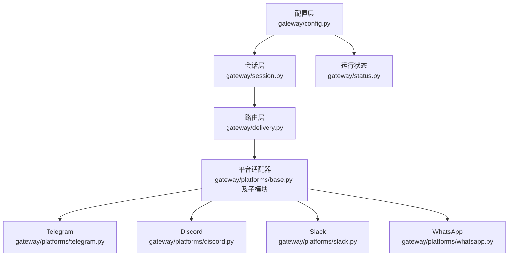
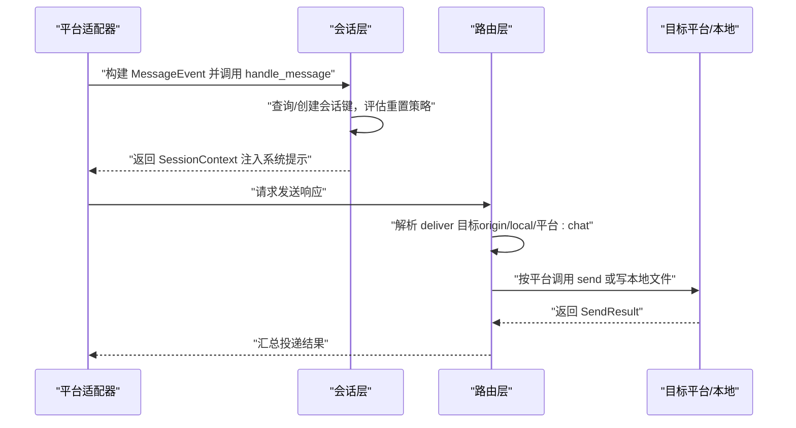
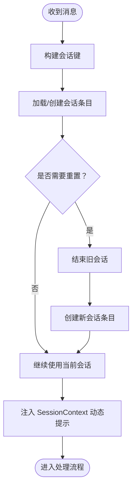
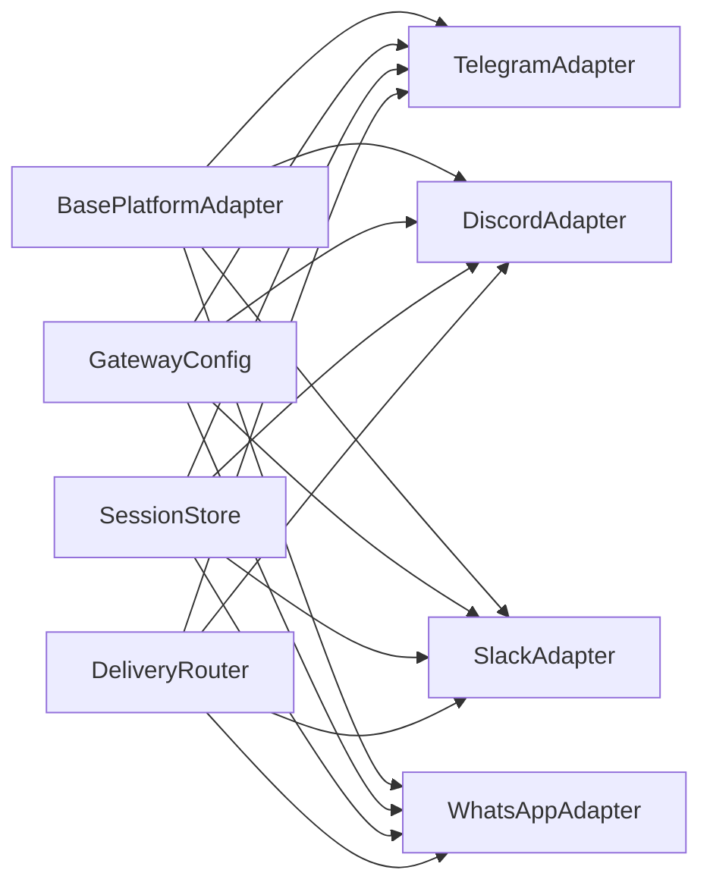

# 消息网关

<cite>
**本文引用的文件**
- [gateway/__init__.py](file://gateway/__init__.py)
- [gateway/config.py](file://gateway/config.py)
- [gateway/session.py](file://gateway/session.py)
- [gateway/status.py](file://gateway/status.py)
- [gateway/delivery.py](file://gateway/delivery.py)
- [gateway/platforms/base.py](file://gateway/platforms/base.py)
- [gateway/platforms/telegram.py](file://gateway/platforms/telegram.py)
- [gateway/platforms/discord.py](file://gateway/platforms/discord.py)
- [gateway/platforms/slack.py](file://gateway/platforms/slack.py)
- [gateway/platforms/whatsapp.py](file://gateway/platforms/whatsapp.py)
</cite>

## 目录
1. [简介](#简介)
2. [项目结构](#项目结构)
3. [核心组件](#核心组件)
4. [架构总览](#架构总览)
5. [详细组件分析](#详细组件分析)
6. [依赖分析](#依赖分析)
7. [性能考虑](#性能考虑)
8. [故障排除指南](#故障排除指南)
9. [结论](#结论)
10. [附录](#附录)

## 简介
本文件为 Hermes Agent 的消息网关系统提供完整技术文档，覆盖多平台适配（Telegram、Discord、Slack、WhatsApp 等）、平台适配器开发规范、消息处理流程与状态管理、会话与权限控制、平台配置与 API 密钥管理、连接稳定性保障、消息格式转换与多媒体支持、实时通信处理、最佳实践与故障排除等内容。目标是帮助开发者快速理解并扩展消息网关能力。

## 项目结构
消息网关位于 gateway 目录，采用“配置-会话-路由-平台适配器”的分层设计：
- 配置层：统一加载与合并环境变量、旧版 JSON、新式 YAML 的配置，生成 GatewayConfig。
- 会话层：持久化会话上下文，按策略判定重置，注入动态系统提示。
- 路由层：解析交付目标，将内容投递到本地或各平台。
- 平台适配器：以 BasePlatformAdapter 为基类，实现 Telegram、Discord、Slack、WhatsApp 等平台的具体逻辑。

图表来源
- [gateway/config.py](file://gateway/config.py)
- [gateway/session.py](file://gateway/session.py)
- [gateway/delivery.py](file://gateway/delivery.py)
- [gateway/platforms/base.py](file://gateway/platforms/base.py)
- [gateway/platforms/telegram.py](file://gateway/platforms/telegram.py)
- [gateway/platforms/discord.py](file://gateway/platforms/discord.py)
- [gateway/platforms/slack.py](file://gateway/platforms/slack.py)
- [gateway/platforms/whatsapp.py](file://gateway/platforms/whatsapp.py)

章节来源
- [gateway/__init__.py](file://gateway/__init__.py)
- [gateway/config.py](file://gateway/config.py)
- [gateway/session.py](file://gateway/session.py)
- [gateway/delivery.py](file://gateway/delivery.py)
- [gateway/platforms/base.py](file://gateway/platforms/base.py)

## 核心组件
- 配置管理 GatewayConfig：集中管理平台开关、令牌、HomeChannel、会话重置策略、STT、流式传输等。
- 会话管理 SessionStore：基于会话键构建规则，持久化会话元数据与转录；按策略判定自动重置。
- 交付路由 DeliveryRouter：解析 deliver 规范，将输出投递至 origin、local 或指定平台/聊天。
- 平台适配器 BasePlatformAdapter：定义统一接口，子类实现连接、发送、编辑、媒体上传、线程/回复语义等。
- 运行状态 status：PID 文件与运行状态文件，用于 CLI 检测网关可用性与跨进程锁。

章节来源
- [gateway/config.py](file://gateway/config.py)
- [gateway/session.py](file://gateway/session.py)
- [gateway/delivery.py](file://gateway/delivery.py)
- [gateway/platforms/base.py](file://gateway/platforms/base.py)
- [gateway/status.py](file://gateway/status.py)

## 架构总览
消息从平台适配器进入，经会话层注入上下文，再由路由层投递到目标渠道（原路返回、本地文件、其他平台）。

图表来源
- [gateway/platforms/base.py](file://gateway/platforms/base.py)
- [gateway/session.py](file://gateway/session.py)
- [gateway/delivery.py](file://gateway/delivery.py)

## 详细组件分析

### 配置与平台枚举
- 支持平台：本地、Telegram、Discord、WhatsApp、Slack、Signal、Mattermost、Matrix、HomeAssistant、Email、SMS、钉钉、API Server、Webhook、飞书、企业微信。
- 关键配置项：
  - 平台开关与令牌/API Key
  - HomeChannel 默认投递目标
  - 会话重置策略（按日/空闲/两者/不重置）
  - 快捷命令、STT 开关、会话隔离策略（群组/线程按用户隔离）
  - 未授权 DM 行为（配对/忽略）
  - 实时流式传输参数（编辑模式、节流间隔、缓冲阈值、光标）

章节来源
- [gateway/config.py](file://gateway/config.py)

### 会话管理与上下文注入
- 会话键规则：DM/群组/频道/线程组合，支持按用户隔离与线程共享策略。
- 自动重置：基于“每日边界”和“空闲分钟数”，可通知用户；活跃后台任务不会被重置。
- 上下文注入：动态系统提示包含来源平台、会话类型、HomeChannel 列表、交付选项等，支持 PII 脱敏。
- 存储：SQLite（优先）+ JSONL 回退，持久化会话元数据与转录。

图表来源
- [gateway/session.py](file://gateway/session.py)

章节来源
- [gateway/session.py](file://gateway/session.py)

### 交付路由与目标解析
- 目标解析：origin（回源）、local（本地文件）、平台名（使用 HomeChannel）、平台:chat_id、平台:chat_id:thread_id。
- 去重与本地落盘：同一平台同 chat/thread 去重；总是记录本地文件。
- 大消息截断：超过平台限制时保存全文并返回截断提示。

章节来源
- [gateway/delivery.py](file://gateway/delivery.py)

### 平台适配器开发规范
- 统一接口：connect/disconnect/send/edit_message/send_typing/send_image/send_voice 等。
- 错误处理：区分致命错误与可重试网络错误，记录运行状态。
- 媒体缓存：图片/音频/文档本地缓存，避免平台 URL 过期与 SSRF 风险。
- 线程/回复：按平台语义实现回复到原始消息、线程内回复、按需广播等。
- 会话感知：可选设置 SessionStore，用于线程/会话存在性判断。

章节来源
- [gateway/platforms/base.py](file://gateway/platforms/base.py)

### Telegram 适配器
- 连接方式：轮询或 Webhook；支持 Telegram Fallback Transport 与 IP 白名单。
- DM 主题（论坛话题）：启动时创建/映射主题到 thread_id，并持久化。
- 投递策略：支持 off/first/all 三种回复到原消息的线程模式。
- 容错：网络中断指数退避重连；轮询冲突（多个实例）自动处理。
- 文档来源
  - [gateway/platforms/telegram.py](file://gateway/platforms/telegram.py)

章节来源
- [gateway/platforms/telegram.py](file://gateway/platforms/telegram.py)

### Discord 适配器
- 连接方式：discord.py Bot，支持语音接收（Opus 解码、DAVE/E2EE 解密、静音检测）。
- 线程与自动归档：支持线程自动归档分钟数集合。
- 去重与反应反馈：Socket Mode 事件去重，处理中/完成反应。
- 允许列表与提及：支持用户名/ID 白名单、忽略无提及消息、机器人消息策略。
- 文档来源
  - [gateway/platforms/discord.py](file://gateway/platforms/discord.py)

章节来源
- [gateway/platforms/discord.py](file://gateway/platforms/discord.py)

### Slack 适配器
- 连接方式：slack-bolt Socket Mode，支持多工作区（多 Bot Token）。
- 线程与回复广播：可配置在回复时广播到主频道。
- Markdown 到 mrkdwn 转换：保护代码块，转换链接/标题/粗体/斜体/删除线。
- 反应与“正在输入”：通过 assistant_threads.setStatus 显示“正在思考”。
- 文档来源
  - [gateway/platforms/slack.py](file://gateway/platforms/slack.py)

章节来源
- [gateway/platforms/slack.py](file://gateway/platforms/slack.py)

### WhatsApp 适配器
- 连接方式：通过 Node.js 桥接进程（whatsapp-web.js/Baileys/业务 API），HTTP 与桥通信。
- 会话隔离：进程级锁防止重复会话；QR 码/登录信息持久化于 session_path。
- 提及/自由回复：支持 require_mention、free_response_chats、mention_patterns。
- 发送与编辑：/send、/edit、/send-media 等端点；媒体下载到本地缓存后转发。
- 文档来源
  - [gateway/platforms/whatsapp.py](file://gateway/platforms/whatsapp.py)

章节来源
- [gateway/platforms/whatsapp.py](file://gateway/platforms/whatsapp.py)

### 运行状态与锁
- PID 文件与运行状态 JSON：记录进程 PID、启动时间、平台状态、更新时间。
- 作用域锁：按外部身份（如 Telegram Bot Token、Slack App Token、WhatsApp Session）进行互斥，避免重复实例。
- CLI 可见性：CLI 通过 PID 文件与状态文件判断网关可用性。

章节来源
- [gateway/status.py](file://gateway/status.py)

## 依赖分析
- 组件耦合
  - 平台适配器依赖 BasePlatformAdapter 接口与通用工具（媒体缓存、URL 安全检查）。
  - 会话层依赖配置层的重置策略与会话键规则。
  - 路由层依赖配置层的 HomeChannel 与平台枚举。
  - 运行状态与锁独立于平台，但平台适配器在连接时申请/释放锁。
- 外部依赖
  - Telegram：python-telegram-bot
  - Discord：discord.py + Opus 库
  - Slack：slack-bolt + slack_sdk
  - WhatsApp：Node.js 桥接脚本（whatsapp-web.js/Baileys/业务 API）

图表来源
- [gateway/platforms/base.py](file://gateway/platforms/base.py)
- [gateway/platforms/telegram.py](file://gateway/platforms/telegram.py)
- [gateway/platforms/discord.py](file://gateway/platforms/discord.py)
- [gateway/platforms/slack.py](file://gateway/platforms/slack.py)
- [gateway/platforms/whatsapp.py](file://gateway/platforms/whatsapp.py)
- [gateway/config.py](file://gateway/config.py)
- [gateway/session.py](file://gateway/session.py)
- [gateway/delivery.py](file://gateway/delivery.py)

## 性能考虑
- 媒体缓存：图片/音频/文档本地缓存减少平台 URL 过期与网络抖动影响。
- 会话重置：合理设置每日边界与空闲超时，避免过长会话导致上下文膨胀。
- 流式传输：编辑模式与节流参数可降低平台压力与客户端闪烁。
- 去重与限流：路由层对同一目标去重；平台侧对速率限制敏感的 API 做退避与重试。
- SQLite 优先：会话存储优先使用 SQLite，JSONL 作为回退，兼顾可靠性与兼容性。

## 故障排除指南
- Telegram
  - 轮询冲突：多个实例使用相同 Token 时会触发冲突，自动重试多次后标记致命错误。
  - 网络中断：指数退避重连，超过最大次数后重启网关。
  - DM 主题：创建失败或重复时记录警告，不影响整体功能。
- Discord
  - Socket Mode 重连：事件去重，避免重复回复；Opus 加载失败时禁用语音播放。
  - 语音接收：静音检测与解码异常时记录调试日志，不影响文本消息。
- Slack
  - 多工作区：加载保存的 tokens.json；Socket Mode 断开后重新连接。
  - Markdown 转换：保护代码块，避免破坏语法。
- WhatsApp
  - 桥接进程：健康检查失败或退出时记录致命错误并尝试重启；QR 登录信息持久化。
  - 会话锁：重复会话时拒绝启动，提示先停止另一个实例。
- 通用
  - 运行状态：PID 文件与状态文件用于诊断；作用域锁防止重复实例。
  - 环境变量覆盖：优先级高于配置文件，便于临时调整。

章节来源
- [gateway/platforms/telegram.py](file://gateway/platforms/telegram.py)
- [gateway/platforms/discord.py](file://gateway/platforms/discord.py)
- [gateway/platforms/slack.py](file://gateway/platforms/slack.py)
- [gateway/platforms/whatsapp.py](file://gateway/platforms/whatsapp.py)
- [gateway/status.py](file://gateway/status.py)

## 结论
消息网关通过清晰的分层设计与统一的适配器接口，实现了多平台的一致接入体验。配置层提供灵活的平台与行为控制，会话层确保上下文连续性与可恢复性，路由层保证交付的确定性与幂等，平台适配器则针对各平台特性实现差异化能力。配合完善的运行状态与锁机制、媒体缓存与容错策略，整体具备良好的稳定性与可扩展性。

## 附录
- 平台配置要点
  - Telegram：Token、Webhook/轮询、DM 主题、回复到原消息模式、备用 IP。
  - Discord：Bot Token、允许用户列表、提及/机器人策略、语音 Opus。
  - Slack：Bot Token + App Token、Socket Mode、多工作区、线程广播。
  - WhatsApp：Node.js、Bridge 脚本、端口、会话目录、提及/自由回复规则。
- API 密钥管理
  - 优先使用环境变量覆盖；配置文件仅保留差异项；作用域锁避免重复实例。
- 最佳实践
  - 合理设置会话重置策略，平衡上下文新鲜度与成本。
  - 使用 HomeChannel 与 deliver 规范明确输出目标，避免遗漏。
  - 对大消息启用本地落盘与截断提示，提升用户体验。
  - 在生产环境启用 Telegram Fallback Transport 与 Discord Opus，增强稳定性。