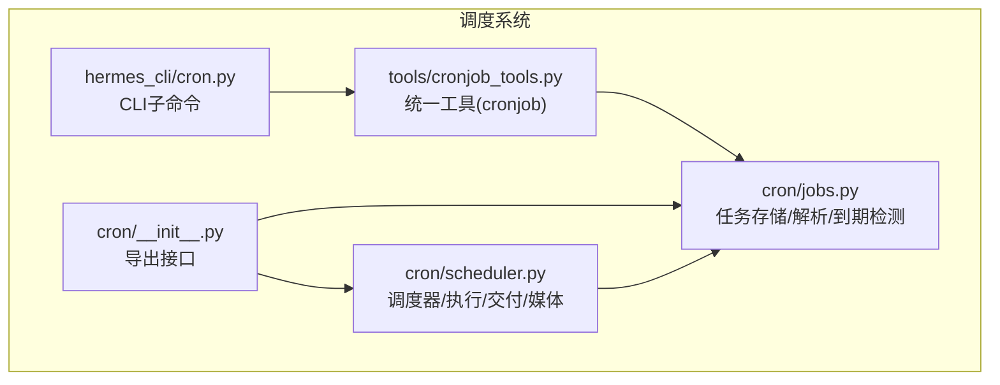
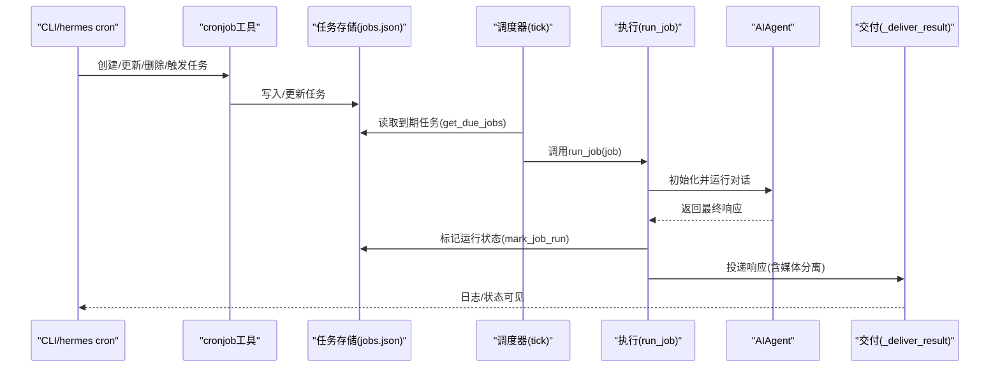
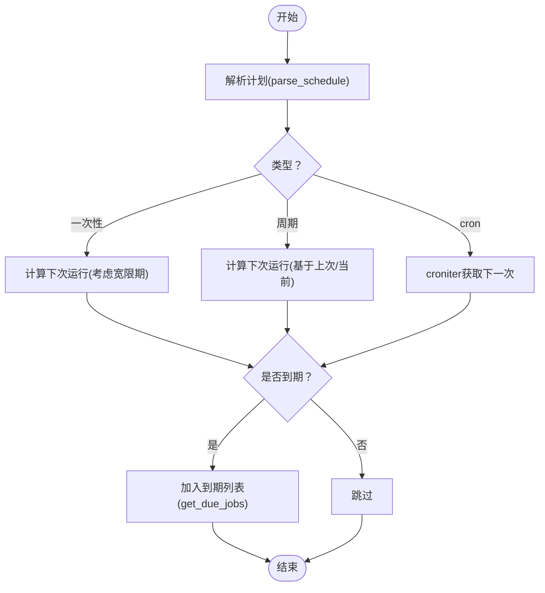
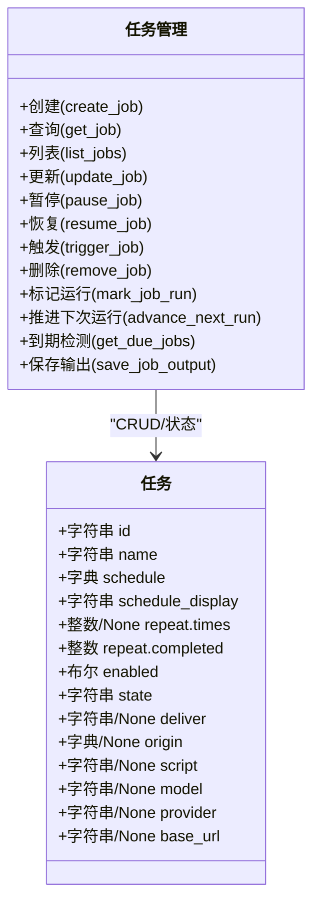
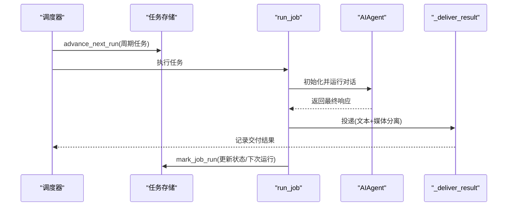
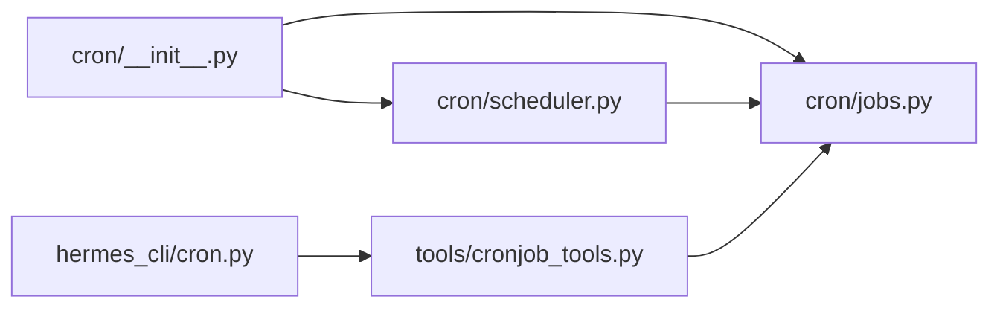

# 调度系统

<cite>
**本文引用的文件**
- [cron/__init__.py](file://cron/__init__.py)
- [cron/jobs.py](file://cron/jobs.py)
- [cron/scheduler.py](file://cron/scheduler.py)
- [hermes_cli/cron.py](file://hermes_cli/cron.py)
- [tools/cronjob_tools.py](file://tools/cronjob_tools.py)
- [tests/cron/test_jobs.py](file://tests/cron/test_jobs.py)
- [tests/cron/test_scheduler.py](file://tests/cron/test_scheduler.py)
- [tests/cron/test_cron_inactivity_timeout.py](file://tests/cron/test_cron_inactivity_timeout.py)
</cite>

## 目录
1. [简介](#简介)
2. [项目结构](#项目结构)
3. [核心组件](#核心组件)
4. [架构总览](#架构总览)
5. [详细组件分析](#详细组件分析)
6. [依赖分析](#依赖分析)
7. [性能考量](#性能考量)
8. [故障排除指南](#故障排除指南)
9. [结论](#结论)
10. [附录](#附录)

## 简介
本文件面向Hermes Agent的调度系统，系统性阐述cron调度器的实现原理与使用方法，覆盖任务队列管理、时间触发机制、并发控制、任务生命周期（创建/修改/删除/暂停/恢复/触发）、自然语言任务描述与技能加载、交付路由与媒体附件、配置项与超时策略、监控与日志、失败重试与崩溃安全、性能优化与排障建议，并提供丰富的使用示例与最佳实践。

## 项目结构
调度系统主要由以下模块组成：
- cron 模块：任务存储、解析与执行
  - cron/jobs.py：任务CRUD、计划解析、到期检测、输出持久化
  - cron/scheduler.py：调度器主循环、执行流程、交付与媒体处理、运行期配置注入
  - cron/__init__.py：对外导出接口
- hermes_cli/cron.py：CLI子命令入口（列出、状态、创建、编辑、暂停/恢复/触发、删除、手动tick）
- tools/cronjob_tools.py：统一的工具接口（cronjob），用于从聊天或工具调用中创建/更新/删除/触发任务；内置威胁扫描与脚本路径校验
- tests/cron/*：针对任务解析、到期检测、交付路由、超时行为等的单元测试

图表来源
- [cron/__init__.py:1-43](file://cron/__init__.py#L1-L43)
- [cron/jobs.py:1-754](file://cron/jobs.py#L1-L754)
- [cron/scheduler.py:1-800](file://cron/scheduler.py#L1-L800)
- [hermes_cli/cron.py:1-276](file://hermes_cli/cron.py#L1-L276)
- [tools/cronjob_tools.py:1-532](file://tools/cronjob_tools.py#L1-L532)

章节来源
- [cron/__init__.py:1-43](file://cron/__init__.py#L1-L43)
- [cron/jobs.py:1-754](file://cron/jobs.py#L1-L754)
- [cron/scheduler.py:1-800](file://cron/scheduler.py#L1-L800)
- [hermes_cli/cron.py:1-276](file://hermes_cli/cron.py#L1-L276)
- [tools/cronjob_tools.py:1-532](file://tools/cronjob_tools.py#L1-L532)

## 核心组件
- 任务存储与计划解析
  - 任务持久化在~/.hermes/cron/jobs.json，输出保存在~/.hermes/cron/output/<job_id>/<timestamp>.md
  - 支持三种计划类型：一次性（相对/绝对时间）、间隔（every X）、cron表达式（需安装croniter）
  - 到期检测支持“宽限期”策略，避免网关重启导致的大量missed run堆积
- 调度器
  - 每60秒tick一次，文件锁防并发
  - 执行前对一次性任务进行“宽限期”恢复，对周期性任务进行“快进”策略
  - 运行期注入环境变量（如HERMES_CRON_AUTO_DELIVER_*）与会话上下文
- 交付与媒体
  - 支持origin/local/平台名/平台:chat_id:thread_id等目标
  - 自动包裹cron响应头尾，可配置关闭
  - 提取MEDIA标签并以原生附件发送（语音/图片/视频/文档）
- 统一工具接口
  - cronjob工具：单点入口，支持威胁扫描、脚本路径校验、模型/提供商覆盖
  - CLI子命令：list/status/tick/create/edit/pause/resume/run/remove

章节来源
- [cron/jobs.py:1-754](file://cron/jobs.py#L1-L754)
- [cron/scheduler.py:1-800](file://cron/scheduler.py#L1-L800)
- [tools/cronjob_tools.py:1-532](file://tools/cronjob_tools.py#L1-L532)
- [hermes_cli/cron.py:1-276](file://hermes_cli/cron.py#L1-L276)

## 架构总览
调度系统采用“文件驱动 + 守护线程”的轻量架构：任务定义与输出均落盘，调度器在后台线程按固定周期扫描到期任务并执行。执行过程通过AIAgent完成推理与工具调用，最终将结果自动投递到指定渠道。

图表来源
- [hermes_cli/cron.py:106-110](file://hermes_cli/cron.py#L106-L110)
- [tools/cronjob_tools.py:208-372](file://tools/cronjob_tools.py#L208-L372)
- [cron/jobs.py:649-725](file://cron/jobs.py#L649-L725)
- [cron/scheduler.py:512-800](file://cron/scheduler.py#L512-L800)

## 详细组件分析

### 任务队列与计划解析
- 计划解析
  - 支持“30m/2h/1d”（一次性）、“every 30m/every 2h”（周期）、“0 9 * * *”（cron表达式）、“2026-02-03T14:00”（一次性时间戳）
  - cron表达式需croniter包；非法表达式直接报错
  - 一次性任务带“宽限期”容错，避免创建后立即错过
- 到期检测
  - 对周期性任务计算动态宽限期（半周期，120s~7200s夹紧）
  - 若超过宽限期则“快进”到下一次未来时间，不立即触发
  - 一次性任务若无next_run_at且在宽限内则恢复执行
- 输出持久化
  - 每次运行输出保存为Markdown文件，权限严格控制

图表来源
- [cron/jobs.py:117-204](file://cron/jobs.py#L117-L204)
- [cron/jobs.py:284-314](file://cron/jobs.py#L284-L314)
- [cron/jobs.py:649-725](file://cron/jobs.py#L649-L725)

章节来源
- [cron/jobs.py:117-204](file://cron/jobs.py#L117-L204)
- [cron/jobs.py:284-314](file://cron/jobs.py#L284-L314)
- [cron/jobs.py:649-725](file://cron/jobs.py#L649-L725)
- [tests/cron/test_jobs.py:72-114](file://tests/cron/test_jobs.py#L72-L114)
- [tests/cron/test_jobs.py:427-461](file://tests/cron/test_jobs.py#L427-L461)

### 任务生命周期（CRUD/暂停/恢复/触发）
- 创建：支持prompt/skills/model/provider/base_url/script等字段；默认delivery根据是否有origin选择
- 更新：可变更计划、名称、提示词、技能、模型/提供商覆盖、脚本、重复次数等
- 删除：按ID移除
- 暂停/恢复：设置state=paused并记录原因；恢复后重新计算next_run_at
- 触发：立即将next_run_at设为当前时间，等待下一tick执行

图表来源
- [cron/jobs.py:366-575](file://cron/jobs.py#L366-L575)
- [cron/jobs.py:577-647](file://cron/jobs.py#L577-L647)
- [cron/jobs.py:649-725](file://cron/jobs.py#L649-L725)

章节来源
- [cron/jobs.py:366-575](file://cron/jobs.py#L366-L575)
- [cron/jobs.py:577-647](file://cron/jobs.py#L577-L647)
- [cron/jobs.py:649-725](file://cron/jobs.py#L649-L725)
- [tests/cron/test_jobs.py:191-224](file://tests/cron/test_jobs.py#L191-L224)
- [tests/cron/test_jobs.py:237-281](file://tests/cron/test_jobs.py#L237-L281)
- [tests/cron/test_jobs.py:283-301](file://tests/cron/test_jobs.py#L283-L301)
- [tests/cron/test_jobs.py:303-341](file://tests/cron/test_jobs.py#L303-L341)

### 执行与交付（并发/超时/媒体）
- 并发控制
  - 文件锁防止多进程同时tick
  - 单任务执行使用线程池，配合活动性超时轮询
- 超时策略
  - 默认600秒空闲超时；可通过HERMES_CRON_TIMEOUT设置；0表示不限时
  - 超时前会收集活动摘要（最后活动描述、迭代次数、当前工具等）写入日志
- 交付路由
  - 支持origin/local/平台名/平台:chat_id:thread_id
  - 可通过环境变量或配置控制是否包裹cron响应头尾
  - 自动提取MEDIA标签并以原生附件发送（语音/图片/视频/文档）
- 崩溃安全
  - 周期性任务在run_job前先advance_next_run，避免崩溃重启导致的重复执行

图表来源
- [cron/scheduler.py:621-646](file://cron/scheduler.py#L621-L646)
- [cron/scheduler.py:512-800](file://cron/scheduler.py#L512-L800)
- [cron/scheduler.py:199-339](file://cron/scheduler.py#L199-L339)

章节来源
- [cron/scheduler.py:621-646](file://cron/scheduler.py#L621-L646)
- [cron/scheduler.py:512-800](file://cron/scheduler.py#L512-L800)
- [cron/scheduler.py:199-339](file://cron/scheduler.py#L199-L339)
- [tests/cron/test_scheduler.py:280-375](file://tests/cron/test_scheduler.py#L280-L375)
- [tests/cron/test_scheduler.py:511-554](file://tests/cron/test_scheduler.py#L511-L554)
- [tests/cron/test_cron_inactivity_timeout.py:85-187](file://tests/cron/test_cron_inactivity_timeout.py#L85-L187)

### 自然语言任务描述与技能加载
- prompt构建
  - 自动注入“你是定时任务”提示与交付说明，指导Agent正确产出内容
  - 可选前置数据采集脚本，其stdout作为上下文注入prompt
- 技能加载
  - 支持单个或多个技能有序加载，技能内容作为系统提示注入
  - 未找到的技能会被跳过并给出notice
- 安全扫描
  - cron prompt层面进行关键模式匹配与不可见字符检查，阻止注入与敏感信息泄露

章节来源
- [cron/scheduler.py:422-510](file://cron/scheduler.py#L422-L510)
- [tools/cronjob_tools.py:55-64](file://tools/cronjob_tools.py#L55-L64)
- [tests/cron/test_scheduler.py:760-800](file://tests/cron/test_scheduler.py#L760-L800)

### 配置选项、优先级与资源限制
- 配置项
  - cron.wrap_response：是否包裹cron响应头尾（默认开启）
  - HERMES_CRON_TIMEOUT：空闲超时秒数（默认600，0为不限时）
  - HERMES_CRON_AUTO_DELIVER_*：自动交付目标（平台/聊天ID/主题ID）
  - .env与config.yaml：每轮执行前重新加载，确保模型/推理/预填充/路由等配置即时生效
- 优先级与路由
  - 支持per-job模型/提供商覆盖；若仅提供模型名未提供提供商，将“钉住”当前主提供商以保持稳定
  - 智能路由与provider routing配置在运行期解析
- 资源限制
  - 单任务线程池执行；脚本执行有超时保护
  - 输出与任务文件权限严格控制（owner-only）

章节来源
- [cron/scheduler.py:256-264](file://cron/scheduler.py#L256-L264)
- [cron/scheduler.py:674-708](file://cron/scheduler.py#L674-L708)
- [tools/cronjob_tools.py:107-129](file://tools/cronjob_tools.py#L107-L129)
- [cron/jobs.py:75-82](file://cron/jobs.py#L75-L82)

### 监控、日志与失败重试
- 监控
  - CLI status显示网关运行状态、下一个运行时间
  - 输出文件命名包含时间戳，便于审计与回溯
- 日志
  - 详细的执行日志与错误日志；超时常驻活动摘要
  - 交付失败/适配器异常均有明确告警
- 失败重试
  - 一次性任务在网关重启后仍会在宽限期内恢复执行
  - 周期性任务超过宽限期将被“快进”，避免堆积
  - 崩溃安全：advance_next_run确保重启后不会重复触发

章节来源
- [hermes_cli/cron.py:112-143](file://hermes_cli/cron.py#L112-L143)
- [cron/scheduler.py:724-737](file://cron/scheduler.py#L724-L737)
- [cron/jobs.py:698-718](file://cron/jobs.py#L698-L718)
- [cron/jobs.py:621-646](file://cron/jobs.py#L621-L646)

## 依赖分析
- cron/__init__.py导出任务管理与调度接口
- cron/scheduler依赖cron/jobs进行任务状态读写，并依赖外部工具链（AIAgent、发送消息工具、频道目录解析等）
- tools/cronjob_tools提供统一工具入口，内部复用cron/jobs能力
- hermes_cli/cron对接工具层，暴露CLI命令

图表来源
- [cron/__init__.py:18-42](file://cron/__init__.py#L18-L42)
- [hermes_cli/cron.py:35-39](file://hermes_cli/cron.py#L35-L39)
- [tools/cronjob_tools.py:18-28](file://tools/cronjob_tools.py#L18-L28)

章节来源
- [cron/__init__.py:18-42](file://cron/__init__.py#L18-L42)
- [hermes_cli/cron.py:35-39](file://hermes_cli/cron.py#L35-L39)
- [tools/cronjob_tools.py:18-28](file://tools/cronjob_tools.py#L18-L28)

## 性能考量
- tick频率与锁
  - 每60秒tick一次，文件锁保证并发安全；建议在多实例场景下通过系统服务管理避免重复进程
- 超时与活动性
  - 合理设置HERMES_CRON_TIMEOUT，避免长时间空闲占用资源
  - 使用活动性摘要轮询，及时中断卡死任务
- I/O与存储
  - 任务与输出均为文件落盘，注意磁盘空间与权限；输出目录与任务文件权限严格控制
- 交付效率
  - 优先使用运行期适配器直连交付，支持端到端加密与原生附件；失败时回退到独立发送路径

[本节为通用指导，无需特定文件引用]

## 故障排除指南
- 无法自动触发
  - 检查网关是否运行（hermes gateway status），确认cron.tick被定期调用
  - 查看CLI status与日志，确认任务处于enabled且next_run_at合理
- 交付失败
  - 检查平台配置与HOME_CHANNEL环境变量；确认deliver目标格式正确（平台:chat_id[:thread_id]）
  - 查看包裹开关cron.wrap_response与交付日志
- 超时/卡死
  - 设置HERMES_CRON_TIMEOUT或使用0不限时；查看超时日志中的活动摘要定位问题
- 脚本执行失败
  - 确认脚本位于~/.hermes/scripts/且路径相对；检查脚本返回码与输出
- 权限问题
  - 确认~/.hermes/cron目录与文件权限为owner-only

章节来源
- [hermes_cli/cron.py:112-143](file://hermes_cli/cron.py#L112-L143)
- [cron/scheduler.py:341-420](file://cron/scheduler.py#L341-L420)
- [tests/cron/test_cron_inactivity_timeout.py:158-187](file://tests/cron/test_cron_inactivity_timeout.py#L158-L187)

## 结论
Hermes Agent的调度系统以文件存储为核心、守护线程为脉络，结合严格的计划解析、到期检测与交付路由，提供了高可靠、可审计、可扩展的自动化任务执行能力。通过统一工具接口与CLI命令，用户可以便捷地创建、管理与监控定时任务；通过超时与崩溃安全机制，系统在复杂运行环境中保持稳健。

[本节为总结性内容，无需特定文件引用]

## 附录

### 使用示例与最佳实践
- 创建一次性任务
  - hermes cron create --schedule "30m" --prompt "检查服务器状态"
  - 或使用cron表达式：--schedule "0 9 * * *"
- 创建周期性任务
  - hermes cron create --schedule "every 2h" --prompt "生成日报"
- 添加技能
  - hermes cron create --schedule "every 1h" --skills blogwatcher,websearch --prompt "汇总最新内容"
- 数据采集脚本
  - hermes cron create --schedule "30m" --script "weather_report.py" --prompt "基于天气数据生成简报"
- 自动交付
  - --deliver origin：回复到创建来源
  - --deliver telegram:CHAT_ID:THREAD_ID：指定群组主题
  - --deliver telegram：使用环境变量TELEGRAM_HOME_CHANNEL
- 配置与超时
  - 在config.yaml中设置cron.wrap_response；通过HERMES_CRON_TIMEOUT调整空闲超时
- 最佳实践
  - prompt必须自包含；必要时使用技能加载
  - 周期性任务尽量避开高峰时段
  - 定期清理输出目录，保留必要的审计文件
  - 对关键任务启用origin交付并记录日志

章节来源
- [hermes_cli/cron.py:145-170](file://hermes_cli/cron.py#L145-L170)
- [hermes_cli/cron.py:172-222](file://hermes_cli/cron.py#L172-L222)
- [tools/cronjob_tools.py:411-486](file://tools/cronjob_tools.py#L411-L486)
- [cron/scheduler.py:256-264](file://cron/scheduler.py#L256-L264)
- [cron/scheduler.py:674-708](file://cron/scheduler.py#L674-L708)