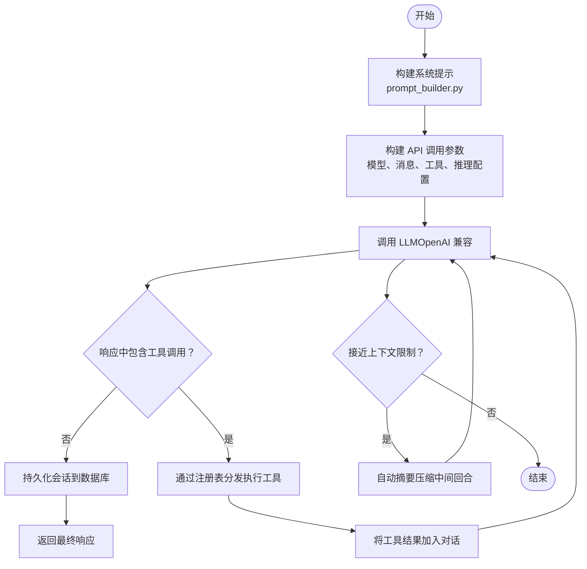
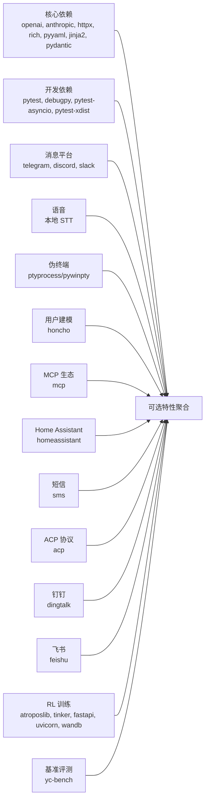

# 代码贡献

<cite>
**本文引用的文件**
- [CONTRIBUTING.md](file://CONTRIBUTING.md)
- [README.md](file://README.md)
- [pyproject.toml](file://pyproject.toml)
- [requirements.txt](file://requirements.txt)
- [flake.nix](file://flake.nix)
- [setup-hermes.sh](file://setup-hermes.sh)
- [tests/conftest.py](file://tests/conftest.py)
- [cli-config.yaml.example](file://cli-config.yaml.example)
- [.github/PULL_REQUEST_TEMPLATE.md](file://.github/PULL_REQUEST_TEMPLATE.md)
</cite>

## 目录
1. [简介](#简介)
2. [项目结构](#项目结构)
3. [核心组件](#核心组件)
4. [架构总览](#架构总览)
5. [详细组件分析](#详细组件分析)
6. [依赖分析](#依赖分析)
7. [性能考虑](#性能考虑)
8. [故障排查指南](#故障排查指南)
9. [结论](#结论)
10. [附录](#附录)

## 简介
本指南面向希望为 Hermes Agent 贡献代码的开发者，覆盖从开发环境搭建、代码规范与最佳实践、测试策略、持续集成与发布流程，到社区协作与沟通渠道的完整路径。文档内容均基于仓库现有文件整理，确保可操作性与一致性。

## 项目结构
Hermes Agent 采用模块化分层组织：核心运行时（run_agent、model_tools）、CLI 命令行入口（hermes_cli）、工具系统（tools）、消息网关（gateway）、技能系统（skills/optional-skills）、测试套件（tests）以及文档与示例配置（docs、cli-config.yaml.example）。下图给出与实际源码映射的高层视图：

```mermaid
graph TB
subgraph "核心运行时"
RA["run_agent.py"]
MT["model_tools.py"]
TS["toolsets.py"]
HS["hermes_state.py"]
TRAJ["trajectory_compressor.py"]
end
subgraph "CLI"
CLI_MAIN["hermes_cli/main.py"]
CLI_CFG["hermes_cli/config.py"]
CLI_SETUP["hermes_cli/setup.py"]
CLI_AUTH["hermes_cli/auth.py"]
CLI_MODELS["hermes_cli/models.py"]
CLI_DOCTOR["hermes_cli/doctor.py"]
end
subgraph "工具系统"
REG["tools/registry.py"]
TERM["tools/terminal_tool.py"]
FILE["tools/file_operations.py"]
WEB["tools/web_tools.py"]
VISION["tools/vision_tools.py"]
CODE["tools/code_execution_tool.py"]
ENV_LOCAL["tools/environments/local.py"]
ENV_DOCKER["tools/environments/docker.py"]
ENV_SSH["tools/environments/ssh.py"]
ENV_MODAL["tools/environments/modal.py"]
ENV_DAYTONA["tools/environments/daytona.py"]
ENV_SINGULARITY["tools/environments/singularity.py"]
end
subgraph "消息网关"
GW_RUN["gateway/run.py"]
GW_CFG["gateway/config.py"]
GW_SESS["gateway/session.py"]
PL_TG["gateway/platforms/telegram.py"]
PL_DC["gateway/platforms/discord.py"]
PL_SL["gateway/platforms/slack.py"]
PL_WHATS["gateway/platforms/whatsapp.py"]
end
subgraph "技能系统"
SKILLS["skills/"]
OPT_SKILLS["optional-skills/"]
end
subgraph "测试"
TESTS["tests/"]
end
RA --> MT
MT --> REG
CLI_MAIN --> CLI_CFG
CLI_MAIN --> CLI_SETUP
CLI_MAIN --> CLI_AUTH
CLI_MAIN --> CLI_MODELS
CLI_MAIN --> CLI_DOCTOR
GW_RUN --> GW_CFG
GW_RUN --> GW_SESS
GW_RUN --> PL_TG
GW_RUN --> PL_DC
GW_RUN --> PL_SL
GW_RUN --> PL_WHATS
TESTS --> RA
TESTS --> CLI_MAIN
TESTS --> GW_RUN
TESTS --> REG
```

图表来源
- [pyproject.toml:104-108](file://pyproject.toml#L104-L108)
- [pyproject.toml:107-108](file://pyproject.toml#L107-L108)

章节来源
- [CONTRIBUTING.md:114-197](file://CONTRIBUTING.md#L114-L197)

## 核心组件
- 运行时与会话
  - run_agent.py：核心对话循环、工具调度、会话持久化。
  - model_tools.py：对工具注册表进行薄封装，统一工具调用入口。
  - toolsets.py：工具集分组与预设（如 hermes-cli、hermes-telegram 等），按平台启用/禁用。
  - hermes_state.py：SQLite 会话数据库（含 FTS5 全文检索、会话标题）。
  - trajectory_compressor.py：轨迹压缩辅助。
- CLI 子系统
  - hermes_cli/main.py：命令解析与分发入口。
  - hermes_cli/config.py：配置管理、迁移、环境变量定义。
  - hermes_cli/setup.py：交互式设置向导。
  - hermes_cli/auth.py：提供商解析、OAuth、Nous Portal 集成。
  - hermes_cli/models.py：OpenRouter 模型选择列表。
  - hermes_cli/doctor.py：诊断工具。
- 工具系统
  - tools/registry.py：中央工具注册表（模式、处理器、分发）。
  - tools/terminal_tool.py：终端编排（sudo、环境生命周期、后端）。
  - tools/file_operations.py：读写文件、搜索、补丁等。
  - tools/web_tools.py：网页搜索、内容抽取（Parallel/Firecrawl + Gemini 摘要）。
  - tools/vision_tools.py：多模态图像分析。
  - tools/code_execution_tool.py：沙箱化 Python 执行（RPC 工具访问）。
  - tools/environments/*：终端执行后端（local、docker、ssh、modal、daytona、singularity）。
- 消息网关
  - gateway/run.py：平台生命周期、消息路由、定时任务。
  - gateway/config.py：平台配置解析。
  - gateway/session.py：会话存储、上下文提示、重置策略。
  - gateway/platforms/*：各平台适配器（Telegram、Discord、Slack、WhatsApp 等）。
- 技能系统
  - skills/ 与 optional-skills/：捆绑与官方可选技能，遵循统一目录结构与 SKILL.md 规范。

章节来源
- [CONTRIBUTING.md:118-182](file://CONTRIBUTING.md#L118-L182)

## 架构总览
Hermes 的核心循环围绕“用户输入 → 构建系统提示 → 调用 LLM → 工具调用 → 再回到 LLM”展开，并在接近上下文上限时自动压缩中间回合。设计要点包括：
- 自注册工具：每个工具文件在导入时调用注册表完成注册；model_tools 通过导入触发发现。
- 工具集分组：工具按功能归类为 toolsets，可在不同平台按需启用。
- 会话持久化：SQLite 数据库存储会话，JSON 日志落盘；系统提示与预填充消息仅注入不落盘。
- 提供商抽象：支持任意 OpenAI 兼容 API；提供商解析在初始化阶段完成（Nous Portal OAuth、OpenRouter API Key、自定义端点）。
- 提供商路由：当使用 OpenRouter 时，可通过配置控制提供商排序、白名单/黑名单、数据保留策略等。

图表来源
- [CONTRIBUTING.md:200-217](file://CONTRIBUTING.md#L200-L217)

章节来源
- [CONTRIBUTING.md:200-227](file://CONTRIBUTING.md#L200-L227)

## 详细组件分析

### 开发环境搭建
- 前置条件
  - Git（支持 --recurse-submodules）
  - Python 3.11+（推荐使用 uv 安装与管理）
  - uv（快速 Python 包管理器）
  - Node.js 18+（浏览器工具与 WhatsApp 桥接可选）
- 克隆与安装
  - 使用 uv 创建虚拟环境并安装所有可选特性与开发依赖。
  - 可选：安装 tinker-atropos 子模块用于 RL 训练。
  - 可选：安装 npm 依赖以启用浏览器工具。
- 配置开发环境
  - 在用户目录创建 ~/.hermes 并复制示例配置与空 .env 文件。
  - 至少添加一个 LLM 提供商密钥到 .env。
- 运行与验证
  - 将 hermes 可执行链接至 ~/.local/bin，使用 hermes doctor 与 hermes chat -q "Hello" 验证安装。
- 测试
  - 使用 pytest tests/ -v 运行测试套件。

章节来源
- [CONTRIBUTING.md:52-111](file://CONTRIBUTING.md#L52-L111)
- [README.md:138-160](file://README.md#L138-L160)
- [setup-hermes.sh:1-308](file://setup-hermes.sh#L1-L308)

### 代码规范与最佳实践
- 编码风格
  - 遵循 PEP 8，不强制严格行长。
  - 注释仅在解释非显而易见的意图、权衡或 API 特性时使用。
- 错误处理
  - 捕获具体异常；使用 logger.warning()/logger.error() 记录错误，对意外错误开启 exc_info=True 以便日志输出堆栈。
- 跨平台兼容
  - 避免假设 Unix 环境；对 termios/fcntl、文件编码、进程管理、路径分隔符、安装脚本中的 shell 命令进行平台差异处理。
- 安全
  - 使用 shlex.quote() 防止 shell 注入；对路径检查使用 os.path.realpath() 防止符号链接绕过；避免记录敏感信息；在工具执行周围捕获宽泛异常防止崩溃。

章节来源
- [CONTRIBUTING.md:230-236](file://CONTRIBUTING.md#L230-L236)
- [CONTRIBUTING.md:516-553](file://CONTRIBUTING.md#L516-L553)
- [CONTRIBUTING.md:556-581](file://CONTRIBUTING.md#L556-L581)

### 添加新工具
- 设计原则
  - 在编写工具前先判断是否应作为技能实现（优先技能）。
- 实现步骤
  - 工具文件内定义 handler、Schema、check_fn，并在导入时通过 registry.register() 完成注册。
  - 在 model_tools 的 _modules 列表中添加导入项以触发发现。
  - 若为全新工具集，需在 toolsets.py 中新增并在相关平台预设中启用。
- 示例参考
  - 工具模板与注册流程可参考 CONTRIBUTING.md 中的“Adding a New Tool”。

章节来源
- [CONTRIBUTING.md:239-298](file://CONTRIBUTING.md#L239-L298)

### 添加技能
- 目录结构
  - skills/ 与 optional-skills/ 下按类别组织，每个技能包含 SKILL.md 与可选的 scripts/ 与 references/。
- SKILL.md 规范
  - 必填字段：name、description、version、author、license。
  - 可选字段：platforms（限制平台）、required_environment_variables（安全加载元数据）、metadata.hermes.tags/related_skills/fallback_for_toolsets/requires_toolsets 等。
- 条件激活
  - 通过 metadata.hermes.fallback_for_* 与 requires_* 控制技能在不同工具/工具集可用性下的显示与隐藏。
- 安全设置
  - required_environment_variables 在技能加载时触发安全提示，Secret 不会回传给模型，仅暴露 stored_as/skipped/validated 等元信息。
- 指南
  - 优先使用标准库与现有工具（web_extract、terminal、read_file），逐步披露工作流，提供辅助脚本，完成后进行端到端测试。

章节来源
- [CONTRIBUTING.md:302-463](file://CONTRIBUTING.md#L302-L463)

### 添加皮肤/主题
- 用户皮肤（YAML 文件）
  - 在 ~/.hermes/skins/<name>.yaml 中定义颜色、旋转器、品牌文案与工具前缀等。
- 内置皮肤
  - 在 hermes_cli/skin_engine.py 的内置皮肤字典中添加，随包分发。
- 激活方式
  - CLI：/skin mytheme 或在 config.yaml 中设置 display.skin。
  - 配置：display: { skin: mytheme }。

章节来源
- [CONTRIBUTING.md:466-513](file://CONTRIBUTING.md#L466-L513)

### 跨平台兼容性
- 关键规则
  - Unix-only 模块（termios/fcntl）需捕获 ImportError 与 NotImplementedError，并提供 Windows 替代方案。
  - 处理 .env 文件编码问题（如 cp1252），统一使用 UTF-8 解码。
  - 进程管理差异（如 os.setsid/os.killpg、信号处理）需平台检测。
  - 路径拼接使用 pathlib.Path。
  - 安装脚本变更需同时考虑 Windows 等价实现。

章节来源
- [CONTRIBUTING.md:516-553](file://CONTRIBUTING.md#L516-L553)

### 安全注意事项
- 现有保护
  - sudo 密码管道使用 shlex.quote；危险命令检测与审批流程；Cron 提示注入扫描；写入黑名单；Hub 技能安全扫描；代码执行沙箱剥离密钥；容器加固（capabilities、权限、PID 限制、tmpfs）。
- 贡献安全敏感代码时
  - 始终使用 shlex.quote；解析真实路径后再做访问控制；不记录密钥；在工具执行周围捕获异常；跨平台测试。

章节来源
- [CONTRIBUTING.md:556-581](file://CONTRIBUTING.md#L556-L581)

### 测试策略
- 测试框架与标记
  - 使用 pytest；默认排除 integration 标记的测试；支持并行执行（-n auto）。
- 共享夹具
  - tests/conftest.py 提供隔离的 HERMES_HOME、临时目录、最小配置、事件循环与超时保护。
- 测试建议
  - 单元测试：针对函数与小模块，使用夹具模拟外部依赖。
  - 集成测试：需要外部服务（API Key、Modal 等）时标注 integration，并在本地按需启用。
  - E2E 测试：覆盖端到端场景，结合 hermes doctor 与 CLI 命令验证。
- 配置参考
  - cli-config.yaml.example 展示了模型、工具集、会话、记忆、显示等配置项，便于构造测试场景。

章节来源
- [pyproject.toml:110-116](file://pyproject.toml#L110-L116)
- [tests/conftest.py:1-120](file://tests/conftest.py#L1-L120)
- [cli-config.yaml.example:1-831](file://cli-config.yaml.example#L1-L831)

### 持续集成与发布流程
- 分支命名
  - fix/description、feat/description、docs/description、test/description、refactor/description。
- 提交信息
  - 遵循 Conventional Commits：fix(scope)、feat(scope)、docs、test、refactor、chore。
- PR 流程
  - 运行 pytest tests/ -q；在目标平台手动验证；保持 PR 聚焦单一逻辑变更；PR 描述包含变更原因、测试步骤、平台信息与关联问题；必要时在描述中标注安全影响。
- 模板参考
  - .github/PULL_REQUEST_TEMPLATE.md 提供了 PR 模板与清单项。

章节来源
- [CONTRIBUTING.md:584-637](file://CONTRIBUTING.md#L584-L637)
- [.github/PULL_REQUEST_TEMPLATE.md:1-76](file://.github/PULL_REQUEST_TEMPLATE.md#L1-L76)

### 社区参与与沟通
- Discord：用于提问、展示项目与分享技能。
- GitHub Discussions：用于设计提案与架构讨论。
- Skills Hub：上传专业技能到注册表并与社区共享。

章节来源
- [CONTRIBUTING.md:650-655](file://CONTRIBUTING.md#L650-L655)

## 依赖分析
- 语言与构建
  - Python >= 3.11；setuptools 构建后端；pyproject.toml 定义核心与可选依赖。
- 核心依赖
  - openai、anthropic、python-dotenv、fire、httpx、rich、tenacity、pyyaml、requests、jinja2、pydantic。
- 可选依赖
  - messaging（Telegram、Discord、Slack）、cron、voice（本地 STT）、pty（跨平台伪终端）、honcho、mcp、homeassistant、sms、acp、dingtalk、feishu、rl（Atropos/Tinker）、yc-bench 等。
- 开发依赖
  - debugpy、pytest、pytest-asyncio、pytest-xdist、mcp。
- 安装方式
  - 推荐使用 pip install -e ".[all]"；requirements.txt 为便捷维护文件，实际以 pyproject.toml 为准。
- Nix 支持
  - flake.nix 提供多系统（Linux、macOS ARM）与开发 Shell、检查与包定义。

图表来源
- [pyproject.toml:13-97](file://pyproject.toml#L13-L97)
- [requirements.txt:1-37](file://requirements.txt#L1-L37)
- [flake.nix:1-36](file://flake.nix#L1-L36)

章节来源
- [pyproject.toml:1-116](file://pyproject.toml#L1-L116)
- [requirements.txt:1-37](file://requirements.txt#L1-L37)
- [flake.nix:1-36](file://flake.nix#L1-L36)

## 性能考虑
- 上下文压缩
  - 当接近模型上下文上限时自动摘要压缩中间回合，保留最近若干条消息与摘要尾部预算，减少令牌占用。
- 会话与日志
  - SQLite 存储会话，JSON 日志便于离线分析；系统提示与预填充消息仅注入不落盘，降低存储压力。
- 并行与批处理
  - batch_runner.py 支持并行批量生成轨迹；pytest -n auto 提升测试执行效率。
- 依赖与版本
  - 核心依赖采用已知良好范围以降低供应链风险；可选特性按需安装，避免不必要的开销。

章节来源
- [CONTRIBUTING.md:200-217](file://CONTRIBUTING.md#L200-L217)
- [pyproject.toml:110-116](file://pyproject.toml#L110-L116)

## 故障排查指南
- 常见问题
  - 安装失败：确认 uv 与 Python 3.11 正确安装；使用 setup-hermes.sh 自动化安装流程。
  - 跨平台问题：Windows/macOS 差异（termios/fcntl、路径分隔符、进程管理）需按 CONTRIBUTING.md 的规则处理。
  - 测试超时：tests/conftest.py 设置了 30 秒超时保护，避免挂起；可在本地禁用或调整。
  - 配置错误：参考 cli-config.yaml.example 的模型、工具集、会话与记忆配置，确保 .env 中的密钥正确。
- 诊断命令
  - hermes doctor：诊断配置与运行环境问题。
  - hermes gateway start：启动消息网关并观察日志。
- 安全检查
  - 使用 dangerous command 检测与审批流程；对路径解析使用 realpath；避免记录敏感信息。

章节来源
- [setup-hermes.sh:1-308](file://setup-hermes.sh#L1-L308)
- [CONTRIBUTING.md:516-581](file://CONTRIBUTING.md#L516-L581)
- [tests/conftest.py:67-120](file://tests/conftest.py#L67-L120)
- [cli-config.yaml.example:1-831](file://cli-config.yaml.example#L1-L831)

## 结论
本指南提供了从开发环境到贡献流程的完整路径，强调了跨平台兼容、安全实践与测试策略的重要性。建议在提交 PR 前完成本地测试与平台验证，并遵循 Conventional Commits 与 PR 模板，以提升协作效率与代码质量。

## 附录
- 快速开始（贡献者）
  - 克隆仓库 → 安装 uv → 创建虚拟环境 → 安装可选特性 → 运行 pytest → 使用 hermes doctor 验证 → 提交 PR。
- 参考文档
  - README.md 的“Getting Started”与“Contributing”部分提供了更广泛的使用与贡献入口。

章节来源
- [README.md:138-160](file://README.md#L138-L160)