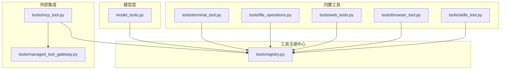
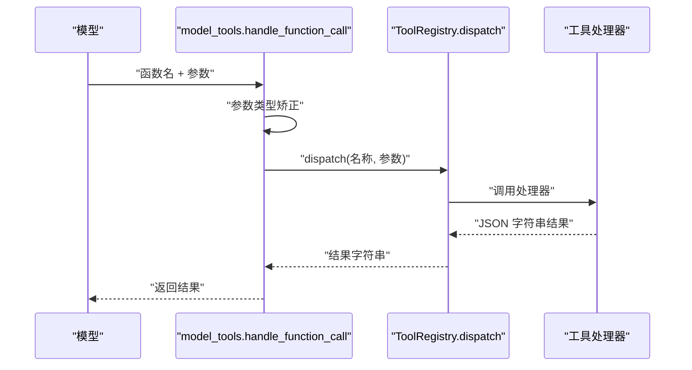
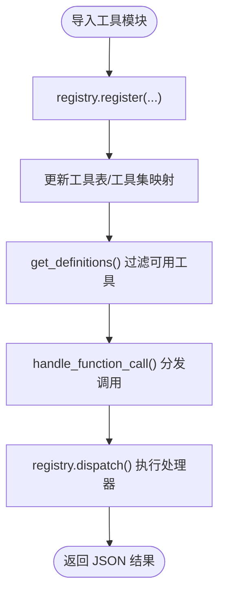
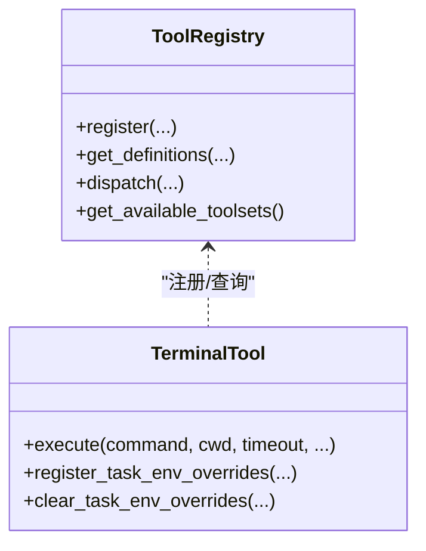
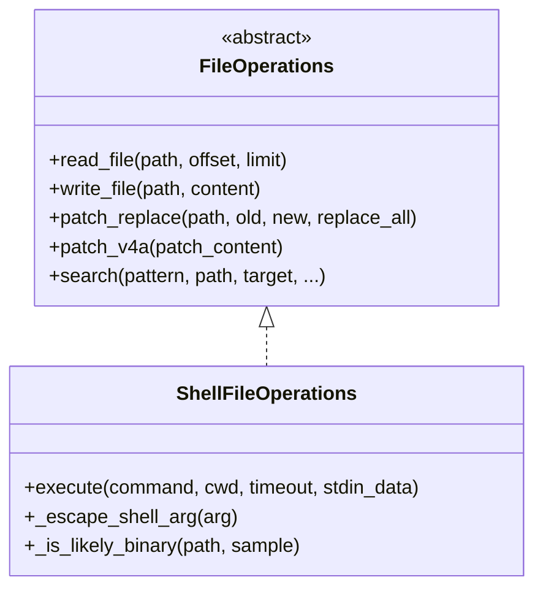
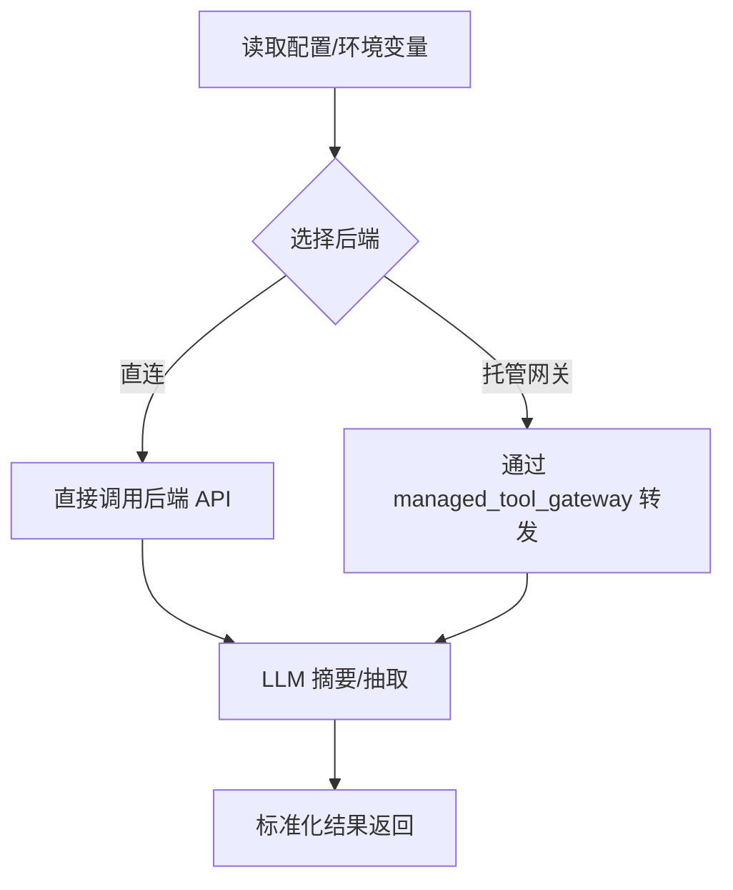
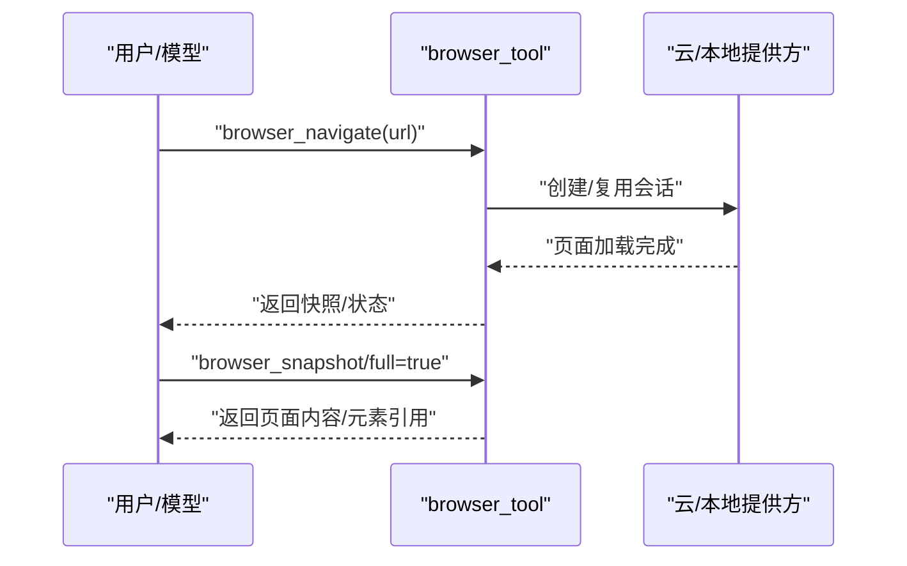
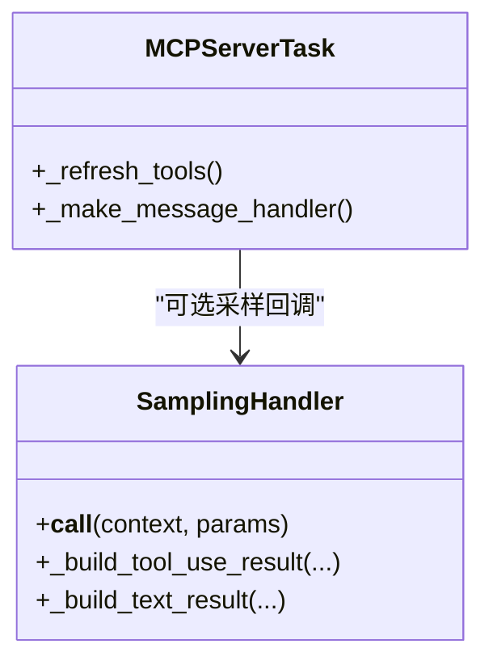
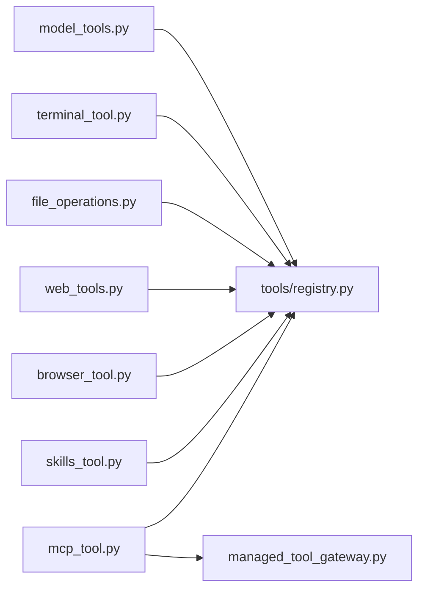

# 工具开发

<cite>
**本文引用的文件**
- [tools/__init__.py](file://tools/__init__.py)
- [tools/registry.py](file://tools/registry.py)
- [model_tools.py](file://model_tools.py)
- [tools/terminal_tool.py](file://tools/terminal_tool.py)
- [tools/file_operations.py](file://tools/file_operations.py)
- [tools/web_tools.py](file://tools/web_tools.py)
- [tools/browser_tool.py](file://tools/browser_tool.py)
- [tools/mcp_tool.py](file://tools/mcp_tool.py)
- [tools/managed_tool_gateway.py](file://tools/managed_tool_gateway.py)
- [tools/skills_tool.py](file://tools/skills_tool.py)
</cite>

## 目录
1. [简介](#简介)
2. [项目结构](#项目结构)
3. [核心组件](#核心组件)
4. [架构总览](#架构总览)
5. [详细组件分析](#详细组件分析)
6. [依赖分析](#依赖分析)
7. [性能考虑](#性能考虑)
8. [故障排查指南](#故障排查指南)
9. [结论](#结论)
10. [附录](#附录)

## 简介
本指南面向希望在 Hermes Agent 中开发与集成“工具”的开发者，系统讲解工具系统的架构、注册机制、生命周期与并发安全、性能优化与资源控制，并提供文件操作、终端执行、网络检索、浏览器自动化、MCP 外部工具等实用示例与测试调试方法。目标是帮助你在不深入理解内部实现的前提下，快速、安全、高效地扩展 Hermes 的能力边界。

## 项目结构
Hermes 的工具体系以“模块化 + 注册中心”为核心：每个工具文件在导入时通过注册中心完成元数据与处理器的登记；模型侧通过统一的工具发现与分发接口调用具体工具。关键目录与文件如下：
- tools/registry.py：工具注册中心（单例），负责 schema 收集、可用性检查、分发与工具集元数据聚合
- model_tools.py：模型层编排器，负责工具发现、过滤、参数类型矫正、异步桥接与调度
- tools/terminal_tool.py：终端工具，支持本地/容器/云沙箱多后端，会话生命周期管理与清理
- tools/file_operations.py：文件操作抽象与 Shell 化实现，跨后端统一读写/搜索/补丁
- tools/web_tools.py：网页检索/提取/爬取工具，支持多供应商与辅助模型摘要
- tools/browser_tool.py：浏览器自动化工具，支持本地/云/代理/截图/控制台等
- tools/mcp_tool.py：MCP（模型上下文协议）客户端，动态发现外部工具并注册到注册中心
- tools/managed_tool_gateway.py：受保护的“托管工具网关”辅助，用于安全转发第三方服务请求
- tools/skills_tool.py：技能目录与文档工具，提供技能列表与查看能力

图表来源
- [model_tools.py:132-184](file://model_tools.py#L132-L184)
- [tools/registry.py:45-275](file://tools/registry.py#L45-L275)
- [tools/terminal_tool.py:1-120](file://tools/terminal_tool.py#L1-L120)
- [tools/file_operations.py:1-120](file://tools/file_operations.py#L1-L120)
- [tools/web_tools.py:1-120](file://tools/web_tools.py#L1-L120)
- [tools/browser_tool.py:1-120](file://tools/browser_tool.py#L1-L120)
- [tools/mcp_tool.py:1-120](file://tools/mcp_tool.py#L1-L120)
- [tools/managed_tool_gateway.py:1-168](file://tools/managed_tool_gateway.py#L1-L168)

章节来源
- [model_tools.py:132-184](file://model_tools.py#L132-L184)
- [tools/registry.py:45-275](file://tools/registry.py#L45-L275)

## 核心组件
- 工具注册中心（ToolRegistry）
  - 职责：收集工具 schema、处理器、可用性检查函数、工具集映射；按需过滤返回给模型；统一异常捕获与错误格式化
  - 关键接口：register、deregister、get_definitions、dispatch、get_available_toolsets、check_toolset_requirements
- 模型工具编排（model_tools）
  - 职责：自动导入各工具模块触发注册；根据工具集启用/禁用过滤；参数类型矫正；异步工具的事件循环桥接；对外暴露统一的工具定义与调用接口
- 终端工具（terminal_tool）
  - 职责：多后端命令执行（本地/容器/云沙箱）、会话复用与生命周期管理、后台任务、磁盘用量告警、危险命令审批与 sudo 处理
- 文件操作（file_operations）
  - 职责：统一的文件读写/搜索/补丁接口，跨后端（Shell 命令）实现，带二进制检测、路径展开、命令缓存与 LLM 自动 lint
- 网络工具（web_tools）
  - 职责：多供应商（Exa/Firecrawl/Parallel/Tavily）网页检索/提取/爬取；可选通过托管网关；内容压缩与摘要；LLM 辅助抽取
- 浏览器工具（browser_tool）
  - 职责：本地/云（Browserbase/Browser Use）浏览器自动化；会话隔离；快照/点击/输入/滚动/控制台；截图与视觉分析；超时清理
- MCP 工具（mcp_tool）
  - 职责：连接外部 MCP 服务器（stdio 或 HTTP/StreamableHTTP），动态发现工具并注册；环境变量过滤、凭证清洗、采样回调（server-initiated LLM 请求）
- 技能工具（skills_tool）
  - 职责：技能目录扫描、前端 YAML 元数据解析、平台兼容性检查、密钥收集与持久化提示

章节来源
- [tools/registry.py:45-275](file://tools/registry.py#L45-L275)
- [model_tools.py:81-126](file://model_tools.py#L81-L126)
- [tools/terminal_tool.py:430-800](file://tools/terminal_tool.py#L430-L800)
- [tools/file_operations.py:321-800](file://tools/file_operations.py#L321-L800)
- [tools/web_tools.py:1-200](file://tools/web_tools.py#L1-L200)
- [tools/browser_tool.py:1-200](file://tools/browser_tool.py#L1-L200)
- [tools/mcp_tool.py:1-200](file://tools/mcp_tool.py#L1-L200)
- [tools/skills_tool.py:1-200](file://tools/skills_tool.py#L1-L200)

## 架构总览
Hermes 的工具系统采用“声明式注册 + 运行时分发”的设计：
- 工具文件在导入时调用注册中心的 register，传入 schema、处理器、可用性检查、工具集等信息
- 模型层通过 get_tool_definitions 获取筛选后的工具定义（OpenAI 格式）
- 工具调用由 handle_function_call 统一分发，内部进行参数类型矫正、插件钩子、异步桥接与错误包装
- 注册中心负责工具可用性检查、错误格式化与工具集元数据聚合

图表来源
- [model_tools.py:459-548](file://model_tools.py#L459-L548)
- [tools/registry.py:144-162](file://tools/registry.py#L144-L162)

## 详细组件分析

### 工具注册与生命周期
- 注册流程
  - 工具模块导入时调用 registry.register(name, toolset, schema, handler, check_fn, requires_env, is_async, description, emoji)
  - 注册中心维护工具表与工具集检查函数映射，支持去重与覆盖警告
- 可用性检查
  - get_definitions 会先调用 check_fn 判断工具是否可用，失败则跳过
  - check_toolset_requirements 与 get_available_toolsets 提供工具集级可用性信息
- 分发与错误处理
  - dispatch 自动桥接异步处理器；统一捕获异常并返回标准错误格式
- 生命周期管理
  - 终端工具：后台清理线程定期回收空闲会话；文件操作缓存与失效；浏览器工具：会话超时清理；MCP：长连接任务与动态刷新

图表来源
- [tools/registry.py:56-138](file://tools/registry.py#L56-L138)
- [model_tools.py:234-353](file://model_tools.py#L234-L353)

章节来源
- [tools/registry.py:56-138](file://tools/registry.py#L56-L138)
- [model_tools.py:234-353](file://model_tools.py#L234-L353)

### 终端工具（文件/命令执行）
- 多后端支持：本地、Docker、Singularity、Modal、Daytona、SSH
- 会话复用与生命周期：按任务 ID 管理环境实例，空闲超时自动清理
- 安全与合规：危险命令审批、sudo 密码缓存与交互提示、工作目录白名单校验
- 性能与资源：容器资源配额、持久化文件系统、磁盘用量告警

图表来源
- [tools/registry.py:45-275](file://tools/registry.py#L45-L275)
- [tools/terminal_tool.py:583-713](file://tools/terminal_tool.py#L583-L713)

章节来源
- [tools/terminal_tool.py:430-800](file://tools/terminal_tool.py#L430-L800)

### 文件操作工具
- 统一接口：read_file/write_file/patch_replace/patch_v4a/search
- 跨后端实现：基于 Shell 命令封装，适配任意具备 execute 的环境对象
- 安全策略：敏感路径写入阻断、可选安全根目录限制、二进制/图片识别与提示
- 质量保障：命令可用性缓存、Lint 自动检查、分页读取与截断提示

图表来源
- [tools/file_operations.py:247-400](file://tools/file_operations.py#L247-L400)
- [tools/file_operations.py:321-800](file://tools/file_operations.py#L321-L800)

章节来源
- [tools/file_operations.py:321-800](file://tools/file_operations.py#L321-L800)

### 网络工具（Web 检索/提取/爬取）
- 后端选择：Exa/Firecrawl/Parallel/Tavily，支持直连或托管网关（Nous 订阅者）
- 内容处理：LLM 辅助摘要与抽取，大文本分块并行处理与合成
- 配置与可用性：按配置与环境变量自动选择后端，提供工具集级可用性检查

图表来源
- [tools/web_tools.py:75-120](file://tools/web_tools.py#L75-L120)
- [tools/web_tools.py:477-575](file://tools/web_tools.py#L477-L575)
- [tools/managed_tool_gateway.py:132-168](file://tools/managed_tool_gateway.py#L132-L168)

章节来源
- [tools/web_tools.py:1-200](file://tools/web_tools.py#L1-L200)
- [tools/managed_tool_gateway.py:132-168](file://tools/managed_tool_gateway.py#L132-L168)

### 浏览器工具
- 后端：本地 headless、Browserbase、Browser Use、CDP 直连
- 功能：导航、快照（可达性树）、点击/输入/滚动/回退/按键、控制台、截图与视觉分析
- 安全：私有地址访问开关、SSRF 防护（本地后端默认关闭）、会话超时清理

图表来源
- [tools/browser_tool.py:500-656](file://tools/browser_tool.py#L500-L656)
- [tools/browser_tool.py:690-744](file://tools/browser_tool.py#L690-L744)

章节来源
- [tools/browser_tool.py:1-200](file://tools/browser_tool.py#L1-L200)

### MCP 工具（外部工具动态发现）
- 连接：stdio 或 HTTP/StreamableHTTP 两种传输
- 动态发现：监听 tools/list_changed 通知，原子刷新工具注册
- 安全：环境变量白名单过滤、凭证模式清洗、采样回调限流与模型白名单
- 并发：后台事件循环线程、消息处理器、采样回调在独立线程中同步调用

图表来源
- [tools/mcp_tool.py:720-800](file://tools/mcp_tool.py#L720-L800)
- [tools/mcp_tool.py:349-714](file://tools/mcp_tool.py#L349-L714)

章节来源
- [tools/mcp_tool.py:1-200](file://tools/mcp_tool.py#L1-L200)

### 技能工具（技能目录与文档）
- 目录结构：SKILL.md 主文档 + references/templates/assets 子目录
- 元数据：YAML Frontmatter（名称、描述、版本、平台、前置条件、标签等）
- 功能：技能列表（渐进披露）、技能视图（主文档/子文件）、平台兼容性检查、密钥收集与持久化

章节来源
- [tools/skills_tool.py:1-200](file://tools/skills_tool.py#L1-L200)

## 依赖分析
- 模块耦合
  - model_tools 仅依赖 tools/registry 与工具集解析模块，避免直接耦合具体工具实现
  - 工具模块通过 tools/registry 间接耦合，降低循环导入风险
- 外部依赖
  - MCP 工具依赖 mcp SDK（可选），未安装时模块为 no-op
  - 浏览器工具依赖 agent-browser CLI（可选），本地模式下可降级
  - 网络工具依赖各供应商 SDK（可选），未安装时按可用性回退
- 循环依赖规避
  - 注册链路采用“注册中心无工具导入、工具导入注册中心”的方式，避免循环

图表来源
- [model_tools.py:132-184](file://model_tools.py#L132-L184)
- [tools/registry.py:1-321](file://tools/registry.py#L1-L321)

章节来源
- [model_tools.py:132-184](file://model_tools.py#L132-L184)
- [tools/registry.py:1-321](file://tools/registry.py#L1-L321)

## 性能考虑
- 异步桥接与事件循环
  - 使用持久化事件循环避免“事件循环已关闭”问题，减少缓存客户端重建开销
  - 工作线程使用各自事件循环，避免主线程争用
- 工具调用与参数矫正
  - 对 LLM 返回的字符串参数进行类型矫正，减少无效重试
- 文件与网络工具
  - 文件操作使用命令缓存与分页读取；网络工具对大文本分块并行处理并限制输出长度
- 终端与浏览器
  - 会话复用与空闲清理，避免频繁创建销毁带来的延迟与资源浪费

章节来源
- [model_tools.py:81-126](file://model_tools.py#L81-L126)
- [tools/file_operations.py:369-400](file://tools/file_operations.py#L369-L400)
- [tools/web_tools.py:477-575](file://tools/web_tools.py#L477-L575)
- [tools/terminal_tool.py:715-791](file://tools/terminal_tool.py#L715-L791)
- [tools/browser_tool.py:414-494](file://tools/browser_tool.py#L414-L494)

## 故障排查指南
- 工具不可用
  - 使用 get_available_toolsets 与 check_tool_availability 查看工具集可用性与缺失要求
  - 检查工具的 check_fn 是否抛出异常或返回 False
- 错误格式化
  - registry.dispatch 统一捕获异常并返回标准 JSON 错误；优先查看返回中的 error 字段
- 终端工具
  - sudo 权限：交互模式下可输入密码；非交互模式下 sudo 将失败；可通过 SUDO_PASSWORD 缓存
  - 危险命令：需要审批；可在 CLI 注册审批回调
  - 磁盘用量：超过阈值会发出告警，建议清理环境
- 文件操作
  - 写入被拒：检查敏感路径与安全根目录限制；使用 write_file 前确认路径不在拒绝列表
  - 二进制文件：自动识别并提示改用视觉工具
- 网络工具
  - 后端配置：检查环境变量与托管网关配置；必要时切换后端
  - 大文本：超出阈值会被拒绝或截断；可使用更聚焦的检索策略
- 浏览器工具
  - 私有地址：默认禁止；如确需允许，调整 allow_private_urls
  - 会话泄漏：检查清理线程是否运行；必要时手动清理
- MCP 工具
  - 连接失败：检查命令/URL、凭据与网络；查看错误消息中的缺失可执行文件
  - 凭证泄露：错误消息会清洗常见凭证模式

章节来源
- [tools/registry.py:144-162](file://tools/registry.py#L144-L162)
- [tools/terminal_tool.py:138-203](file://tools/terminal_tool.py#L138-L203)
- [tools/file_operations.py:98-116](file://tools/file_operations.py#L98-L116)
- [tools/web_tools.py:160-172](file://tools/web_tools.py#L160-L172)
- [tools/browser_tool.py:308-327](file://tools/browser_tool.py#L308-L327)
- [tools/mcp_tool.py:270-328](file://tools/mcp_tool.py#L270-L328)

## 结论
Hermes 的工具系统通过“声明式注册 + 运行时分发 + 统一错误与可用性管理”，实现了高扩展性与强健性。开发者只需关注工具的 schema、处理器与可用性检查，即可无缝接入模型调用链。配合会话生命周期管理、安全策略与性能优化，能够在复杂环境中稳定运行。

## 附录

### 工具开发流程（模板）
- 定义工具
  - 在 tools/your_tool.py 中实现处理器函数与 schema
  - 在模块末尾调用 registry.register(...) 完成注册
- 参数校验与安全
  - 在处理器内进行参数校验与权限检查
  - 对敏感操作（如写文件、sudo、危险命令）添加审批或白名单
- 可用性检查
  - 实现 check_fn，返回 True/False 表示工具可用
  - 若涉及环境变量，将其加入 requires_env
- 并发与异步
  - 如为异步处理器，设置 is_async=True；注册中心会自动桥接
- 错误处理
  - 统一返回 JSON 字符串；使用 registry 的 tool_error/tool_result 辅助
- 生命周期与资源
  - 对会话/进程/文件句柄进行显式清理；必要时启动后台清理线程
- 性能优化
  - 使用命令缓存、分页读取、分块处理、持久化会话复用
- 测试与调试
  - 单元测试：构造最小化环境，模拟处理器调用
  - 集成测试：在真实后端（容器/云沙箱）上验证行为
  - 调试：开启日志、使用 DebugSession（如 web_tools 的调试模式）

章节来源
- [tools/registry.py:56-89](file://tools/registry.py#L56-L89)
- [model_tools.py:459-548](file://model_tools.py#L459-L548)

### 示例：文件操作工具
- 读取文件：read_file(path, offset, limit)
- 写入文件：write_file(path, content)
- 搜索内容：search(pattern, path, target="content", file_glob, limit, offset, output_mode, context)
- 文本补丁：patch_replace(path, old_string, new_string, replace_all)

章节来源
- [tools/file_operations.py:469-557](file://tools/file_operations.py#L469-L557)
- [tools/file_operations.py:587-640](file://tools/file_operations.py#L587-L640)
- [tools/file_operations.py:772-800](file://tools/file_operations.py#L772-L800)

### 示例：终端工具
- 执行命令：terminal_tool(command, background=False, timeout=秒, pty=False, workdir=目录)
- 后台任务：返回 session_id，后续可用 process(action="poll/wait") 查询
- 环境选择：TERMINAL_ENV=local/docker/modal/daytona/ssh

章节来源
- [tools/terminal_tool.py:409-428](file://tools/terminal_tool.py#L409-L428)
- [tools/terminal_tool.py:495-572](file://tools/terminal_tool.py#L495-L572)

### 示例：网络工具
- 搜索：web_search_tool(query, limit)
- 提取：web_extract_tool(urls, format="markdown")
- 爬取：web_crawl_tool(domain_or_url, instructions)

章节来源
- [tools/web_tools.py:30-41](file://tools/web_tools.py#L30-L41)
- [tools/web_tools.py:287-305](file://tools/web_tools.py#L287-L305)

### 示例：浏览器工具
- 导航：browser_navigate(url, task_id)
- 快照：browser_snapshot(full=False)
- 点击/输入：browser_click(ref), browser_type(ref, text)
- 截图与视觉分析：browser_vision(question, annotate=False)

章节来源
- [tools/browser_tool.py:500-656](file://tools/browser_tool.py#L500-L656)

### 示例：MCP 工具
- 配置：~/.hermes/config.yaml 中 mcp_servers
- 发现：discover_mcp_tools() 自动注册外部工具
- 采样：服务器可请求 LLM 补全，支持速率限制与模型白名单

章节来源
- [tools/mcp_tool.py:13-70](file://tools/mcp_tool.py#L13-L70)
- [tools/mcp_tool.py:172-178](file://tools/mcp_tool.py#L172-L178)

### 工具间依赖与组合
- browser_navigate 与 web_search/web_extract 的描述会根据可用性动态调整
- execute_code 的可用工具集合会根据当前会话启用的工具动态生成
- MCP 工具可与内置工具组合使用，形成“本地工具 + 外部工具”的混合能力

章节来源
- [model_tools.py:314-342](file://model_tools.py#L314-L342)
- [model_tools.py:513-527](file://model_tools.py#L513-L527)