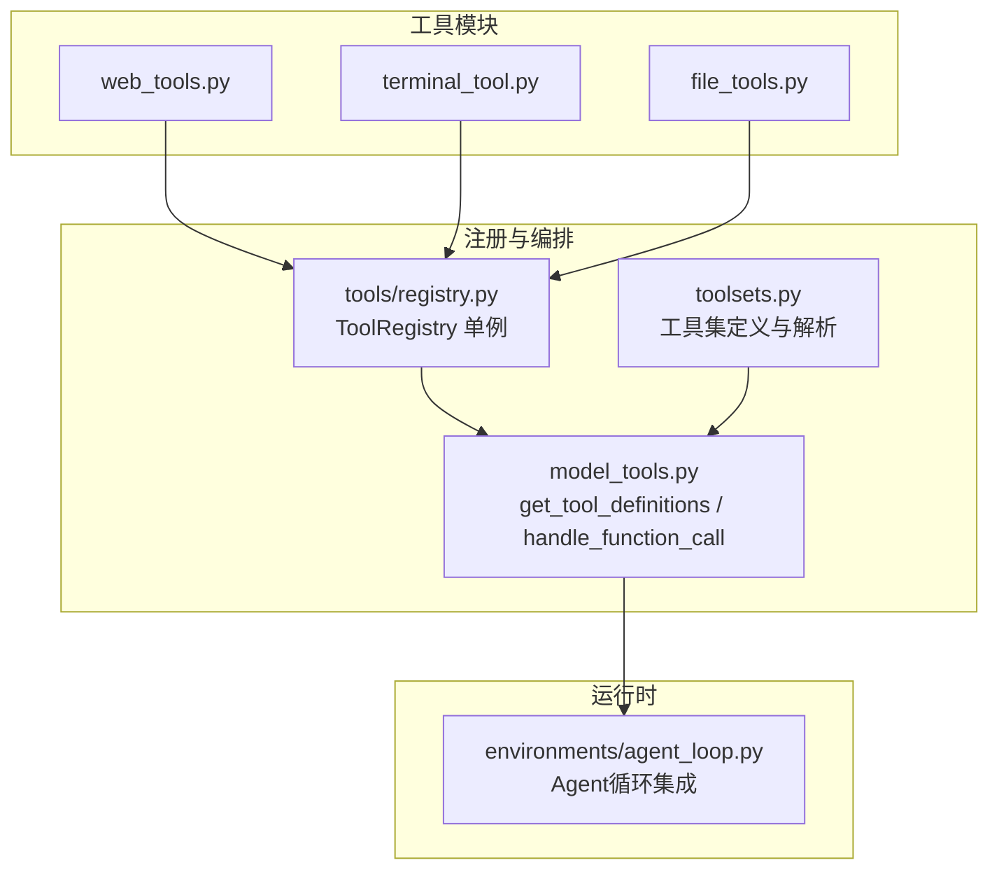
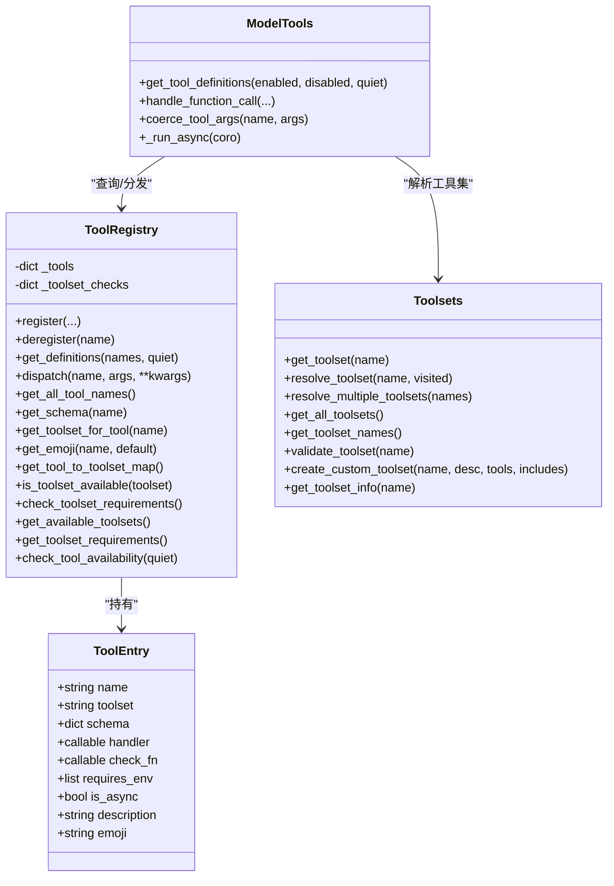
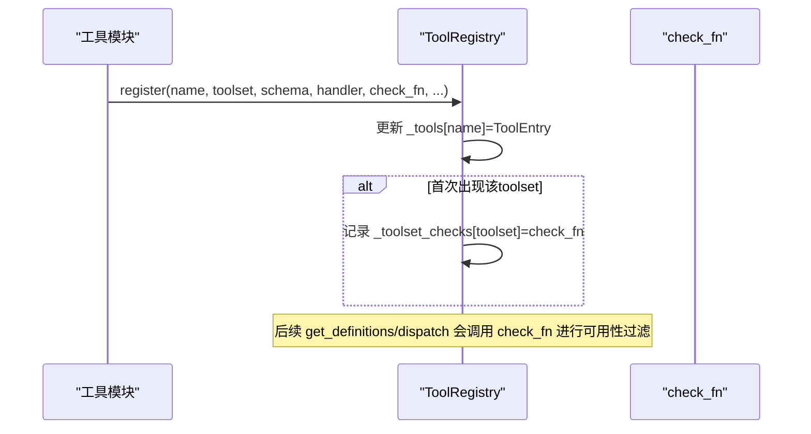
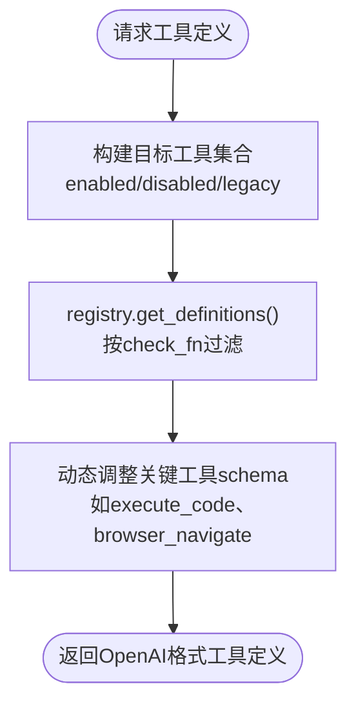
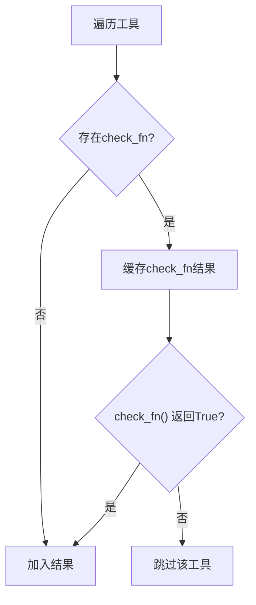
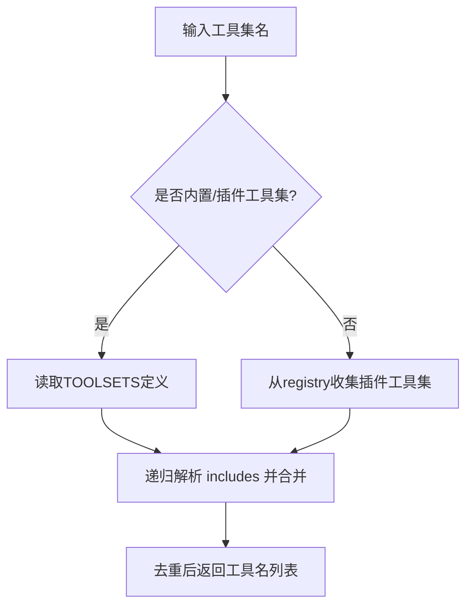
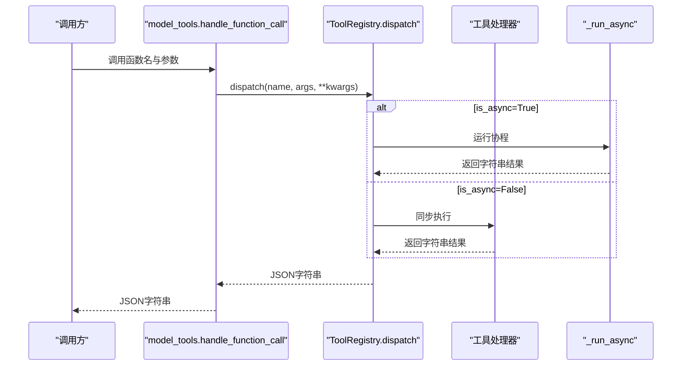
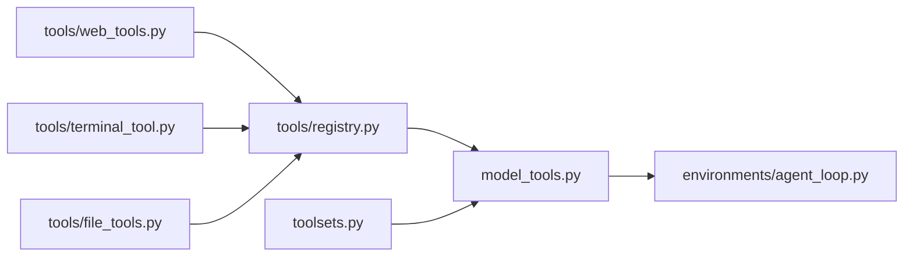

# 工具系统架构

<cite>
**本文档引用的文件**
- [tools/registry.py](file://tools/registry.py)
- [model_tools.py](file://model_tools.py)
- [toolsets.py](file://toolsets.py)
- [tools/web_tools.py](file://tools/web_tools.py)
- [tools/terminal_tool.py](file://tools/terminal_tool.py)
- [tools/file_tools.py](file://tools/file_tools.py)
- [environments/agent_loop.py](file://environments/agent_loop.py)
- [tests/tools/test_registry.py](file://tests/tools/test_registry.py)
- [tests/tools/test_mcp_dynamic_discovery.py](file://tests/tools/test_mcp_dynamic_discovery.py)
</cite>

## 目录
1. [引言](#引言)
2. [项目结构](#项目结构)
3. [核心组件](#核心组件)
4. [架构总览](#架构总览)
5. [详细组件分析](#详细组件分析)
6. [依赖分析](#依赖分析)
7. [性能考虑](#性能考虑)
8. [故障排查指南](#故障排查指南)
9. [结论](#结论)
10. [附录](#附录)

## 引言
本文件面向Hermes Agent的工具系统，系统化阐述工具注册机制、ToolRegistry单例模式、ToolEntry元数据结构的设计原理；解释工具schema定义格式与OpenAI函数调用规范的兼容性；说明工具可用性检查机制、工具集管理、异步工具处理等核心架构特性；并给出工具生命周期管理、性能优化策略与资源控制机制，辅以架构图与组件交互示例，帮助开发者快速理解与扩展工具系统。

## 项目结构
工具系统围绕“工具注册—工具集管理—模型层编排—执行分发”四条主线展开：
- 工具注册：每个工具模块在导入时通过工具注册表完成schema与处理器注册。
- 工具集管理：通过toolsets模块对工具进行分组、组合与动态解析。
- 模型层编排：model_tools聚合工具定义、参数类型转换、异步桥接与执行分发。
- 执行分发：ToolRegistry集中管理工具入口，支持同步/异步统一调度与错误收敛。

图表来源
- [tools/registry.py:45-275](file://tools/registry.py#L45-L275)
- [model_tools.py:132-185](file://model_tools.py#L132-L185)
- [toolsets.py:68-373](file://toolsets.py#L68-L373)
- [environments/agent_loop.py:422-445](file://environments/agent_loop.py#L422-L445)

章节来源
- [tools/registry.py:1-321](file://tools/registry.py#L1-L321)
- [model_tools.py:1-578](file://model_tools.py#L1-L578)
- [toolsets.py:1-638](file://toolsets.py#L1-L638)

## 核心组件
- ToolRegistry（单例）：集中注册、查询、可用性检查与分发工具；维护工具名到ToolEntry的映射及工具集检查函数。
- ToolEntry（元数据）：封装单个工具的schema、处理器、可用性检查函数、环境变量需求、是否异步、描述与表情符号等。
- model_tools：工具发现、过滤、动态schema调整、参数类型转换、异步桥接与执行分发。
- toolsets：工具集定义、组合、解析与校验，支持静态与插件动态注册的工具集。

章节来源
- [tools/registry.py:24-89](file://tools/registry.py#L24-L89)
- [model_tools.py:132-170](file://model_tools.py#L132-L170)
- [toolsets.py:68-197](file://toolsets.py#L68-L197)

## 架构总览
工具系统采用“模块导入即注册”的设计，避免在上层维护重复的数据结构。ToolRegistry作为中央枢纽，model_tools负责对外暴露统一接口，toolsets提供灵活的工具集编排能力。

图表来源
- [tools/registry.py:24-275](file://tools/registry.py#L24-L275)
- [model_tools.py:234-577](file://model_tools.py#L234-L577)
- [toolsets.py:377-596](file://toolsets.py#L377-L596)

## 详细组件分析

### 工具注册机制与ToolRegistry单例
- 注册入口：工具模块在导入时调用registry.register(...)，传入name、toolset、schema、handler、check_fn、requires_env、is_async、description、emoji等。
- 冲突处理：当同一name被不同toolset覆盖时记录告警，确保可追踪性。
- 单例模式：模块级registry实例全局共享，避免重复初始化与状态分散。
- 可用性检查：每个toolset可挂载一个check_fn，ToolRegistry按需缓存check结果，异常安全地返回False。

图表来源
- [tools/registry.py:56-89](file://tools/registry.py#L56-L89)

章节来源
- [tools/registry.py:45-106](file://tools/registry.py#L45-L106)
- [tests/tools/test_registry.py:129-159](file://tests/tools/test_registry.py#L129-L159)

### ToolEntry元数据结构设计
- 字段设计：name、toolset、schema、handler、check_fn、requires_env、is_async、description、emoji，均通过构造函数注入，保证最小字段集与高内聚。
- 性能与内存：使用__slots__减少内存占用，适合大量工具实例场景。
- 元信息复用：description与emoji用于UI展示与调试，便于用户识别工具用途与来源。

章节来源
- [tools/registry.py:24-43](file://tools/registry.py#L24-L43)

### 工具schema定义格式与OpenAI函数调用规范兼容
- 输出格式：get_definitions返回OpenAI风格的function工具定义列表，每项为{"type": "function", "function": {...}}，其中function对象包含name与schema内容。
- 名称回填：若schema未显式包含name，将回填entry.name，确保模型侧调用一致性。
- 动态调整：针对execute_code与browser_navigate等工具，根据可用工具集合动态裁剪描述或允许列表，避免模型“幻觉”调用不存在的工具。

图表来源
- [model_tools.py:234-353](file://model_tools.py#L234-L353)
- [tools/registry.py:111-138](file://tools/registry.py#L111-L138)

章节来源
- [model_tools.py:234-353](file://model_tools.py#L234-L353)
- [tools/registry.py:111-138](file://tools/registry.py#L111-L138)

### 工具可用性检查机制
- 工具级：get_definitions在输出前对每个工具执行check_fn，失败则跳过，日志记录调试信息。
- 工具集级：is_toolset_available对toolset的check_fn进行异常安全检查；check_toolset_requirements批量返回可用性；check_tool_availability汇总不可用工具集及其原因（环境变量、工具清单）。
- 插件与MCP：ToolRegistry支持deregister清理工具集检查函数，配合MCP动态发现实现“nuk-and-repave”。

图表来源
- [tools/registry.py:111-138](file://tools/registry.py#L111-L138)
- [tools/registry.py:194-212](file://tools/registry.py#L194-L212)
- [tests/tools/test_registry.py:184-239](file://tests/tools/test_registry.py#L184-L239)

章节来源
- [tools/registry.py:194-271](file://tools/registry.py#L194-L271)
- [tests/tools/test_registry.py:184-289](file://tests/tools/test_registry.py#L184-L289)
- [tests/tools/test_mcp_dynamic_discovery.py:157-170](file://tests/tools/test_mcp_dynamic_discovery.py#L157-L170)

### 工具集管理（toolsets）
- 定义与组合：TOOLSETS中定义基础与场景化工具集，支持includes组合；resolve_toolset递归解析并去重。
- 动态扩展：插件可通过注册新toolset参与解析；validate_toolset支持别名all/*自动包含所有工具。
- 查询接口：get_all_toolsets合并静态与插件工具集；get_toolset_info返回解析后的完整信息。

图表来源
- [toolsets.py:392-449](file://toolsets.py#L392-L449)
- [toolsets.py:488-510](file://toolsets.py#L488-L510)
- [toolsets.py:529-546](file://toolsets.py#L529-L546)

章节来源
- [toolsets.py:68-373](file://toolsets.py#L68-L373)
- [toolsets.py:392-596](file://toolsets.py#L392-L596)

### 异步工具处理与资源控制
- 异步桥接：_run_async在同步上下文统一运行协程，优先使用持久事件循环，避免“Event loop is closed”问题；在已有运行循环或工作线程中采用一次性线程隔离。
- 资源控制：终端工具对危险命令进行审批与白名单校验；文件工具对敏感路径写入进行阻断；磁盘使用阈值告警与清理提示。
- 环境隔离：终端工具支持local/docker/modal等多种后端，结合清理线程与空闲回收降低资源占用。

图表来源
- [model_tools.py:459-548](file://model_tools.py#L459-L548)
- [tools/registry.py:144-162](file://tools/registry.py#L144-L162)
- [model_tools.py:81-125](file://model_tools.py#L81-L125)

章节来源
- [model_tools.py:39-125](file://model_tools.py#L39-L125)
- [tools/terminal_tool.py:138-200](file://tools/terminal_tool.py#L138-L200)
- [tools/file_tools.py:92-125](file://tools/file_tools.py#L92-L125)

### 工具生命周期管理
- 发现阶段：_discover_tools导入各工具模块触发注册；MCP与插件发现补充工具集。
- 使用阶段：get_tool_definitions按工具集过滤并输出OpenAI格式定义；handle_function_call执行工具并注入前后钩子。
- 清理阶段：终端工具的清理线程与空闲回收；进程注册表对历史会话进行修剪，限制最大进程数。

章节来源
- [model_tools.py:132-185](file://model_tools.py#L132-L185)
- [model_tools.py:234-577](file://model_tools.py#L234-L577)
- [tests/tools/test_process_registry.py:185-222](file://tests/tools/test_process_registry.py#L185-L222)

### 参数类型转换与错误收敛
- 类型转换：coerce_tool_args依据JSON Schema对字符串类型的数值、布尔进行安全转换，提升LLM输出鲁棒性。
- 错误收敛：registry.dispatch与model_tools.handle_function_call捕获异常并统一返回JSON错误字符串，避免上抛崩溃。

章节来源
- [model_tools.py:372-457](file://model_tools.py#L372-L457)
- [model_tools.py:459-548](file://model_tools.py#L459-L548)
- [tools/registry.py:144-162](file://tools/registry.py#L144-L162)

## 依赖分析
- 模块耦合：tools/registry.py不依赖model_tools或具体工具模块，形成自底向上的导入链，避免循环依赖。
- 导入链路：tools/*.py导入tools/registry，model_tools导入tools/registry与所有工具模块，再由run_agent/cli/batch_runner等消费。
- 工具集依赖：model_tools依赖toolsets解析工具集；ToolRegistry仅依赖工具schema与check_fn，不关心工具集。

图表来源
- [tools/registry.py:1-15](file://tools/registry.py#L1-L15)
- [model_tools.py:132-170](file://model_tools.py#L132-L170)
- [toolsets.py:68-197](file://toolsets.py#L68-L197)

章节来源
- [tools/registry.py:1-15](file://tools/registry.py#L1-L15)
- [model_tools.py:132-170](file://model_tools.py#L132-L170)

## 性能考虑
- 缓存与去重
  - get_definitions内部对check_fn结果进行缓存，避免重复调用。
  - resolve_toolset使用visited集合防止循环依赖与重复解析。
- 事件循环优化
  - _run_async为主线程与工作线程分别维护持久事件循环，减少协程创建/销毁成本，避免“Event loop is closed”引发的GC问题。
- I/O与资源控制
  - 文件读取字符上限与设备路径阻断，降低大文件与阻塞设备带来的风险。
  - 终端工具磁盘使用阈值告警与清理提示，避免资源耗尽。
- 进程与会话修剪
  - 进程注册表按最大进程数与时间窗口修剪历史会话，保持系统稳定。

章节来源
- [tools/registry.py:117-138](file://tools/registry.py#L117-L138)
- [toolsets.py:420-424](file://toolsets.py#L420-L424)
- [model_tools.py:81-125](file://model_tools.py#L81-L125)
- [tools/file_tools.py:31-51](file://tools/file_tools.py#L31-L51)
- [tests/tools/test_process_registry.py:199-216](file://tests/tools/test_process_registry.py#L199-L216)

## 故障排查指南
- 工具不可用
  - 使用check_tool_availability获取不可用工具集的环境变量与工具清单，核对配置。
  - 若check_fn抛出异常，ToolRegistry会记录日志并标记为不可用，建议在工具模块中完善异常处理。
- 工具名称冲突
  - 当同一name被不同toolset覆盖时，ToolRegistry会发出告警；确认工具命名唯一性或调整toolset划分。
- 异步工具报错
  - _run_async在工作线程或已有运行循环中会使用一次性线程隔离；若仍出现“Event loop is closed”，检查外部客户端是否在关闭后复用已绑定的循环。
- 参数类型错误
  - 使用coerce_tool_args前先确认工具schema中的参数类型定义；必要时在工具内部补充更严格的类型校验。

章节来源
- [tools/registry.py:194-271](file://tools/registry.py#L194-L271)
- [tests/tools/test_registry.py:184-239](file://tests/tools/test_registry.py#L184-L239)
- [model_tools.py:459-548](file://model_tools.py#L459-L548)
- [model_tools.py:372-457](file://model_tools.py#L372-L457)

## 结论
Hermes Agent工具系统通过ToolRegistry单例与ToolEntry元数据结构实现了工具注册、可用性检查与分发的统一抽象；借助toolsets模块提供了灵活的工具集编排能力；model_tools在工具发现、动态schema调整、参数类型转换与异步桥接方面提供了完整的运行时支撑。该架构兼顾了扩展性、稳定性与性能，既满足CLI与多平台消息机器人的使用场景，也为插件与MCP动态发现提供了良好基础。

## 附录
- 工具注册示例路径
  - [tools/file_tools.py:820-823](file://tools/file_tools.py#L820-L823)
  - [tools/web_tools.py:1-200](file://tools/web_tools.py#L1-L200)
  - [tools/terminal_tool.py:1-200](file://tools/terminal_tool.py#L1-L200)
- 关键流程参考
  - [model_tools.py:234-353](file://model_tools.py#L234-L353) 获取工具定义
  - [model_tools.py:459-548](file://model_tools.py#L459-L548) 分发工具调用
  - [tools/registry.py:144-162](file://tools/registry.py#L144-L162) 分发执行