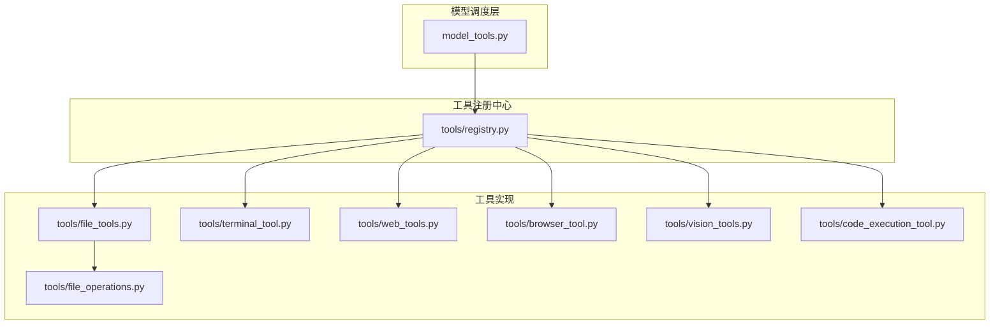
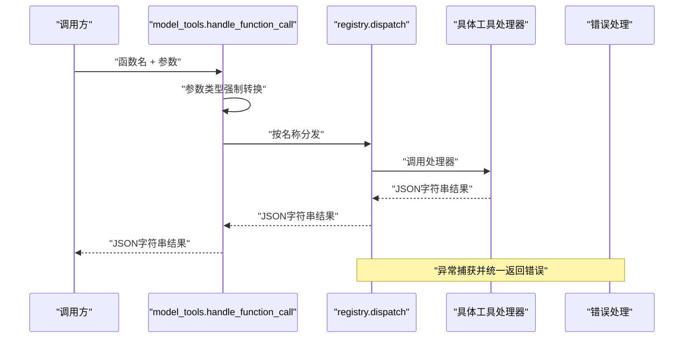
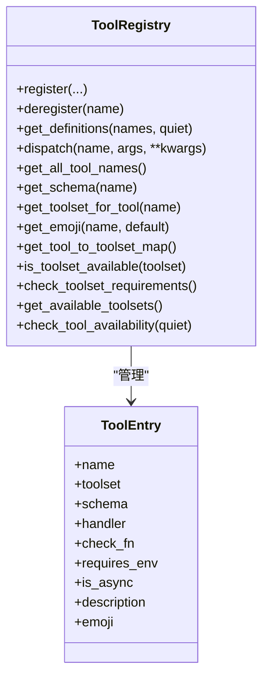
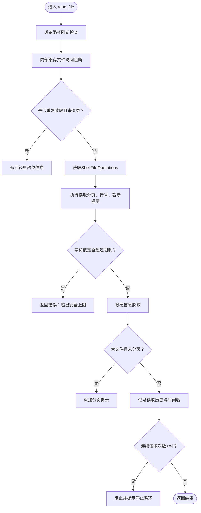
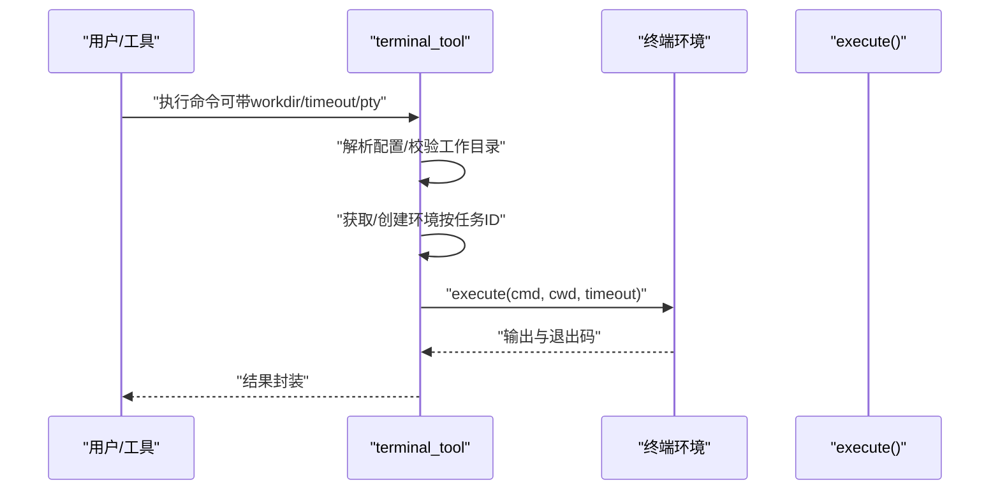
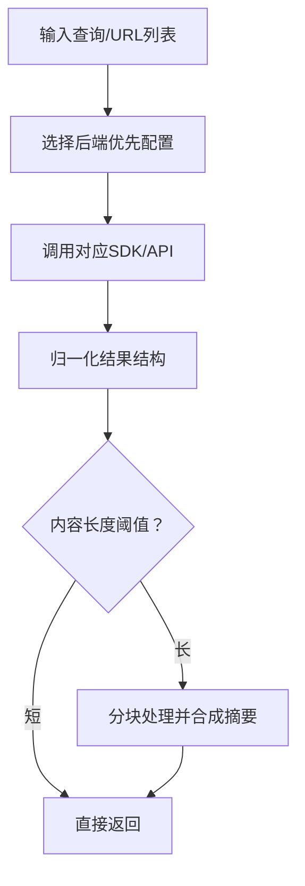
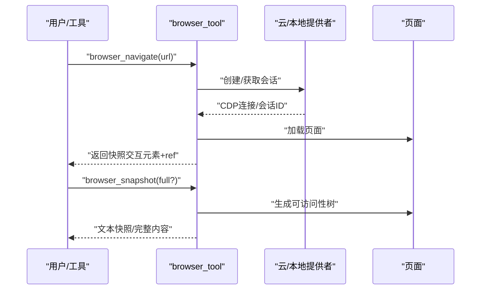
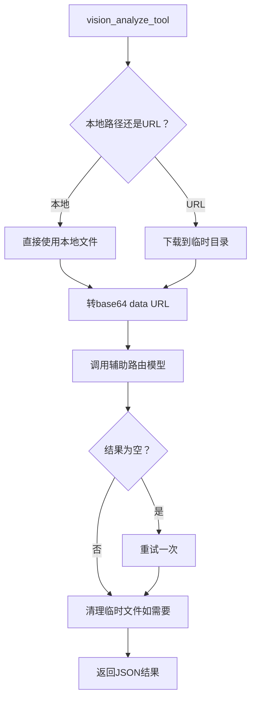
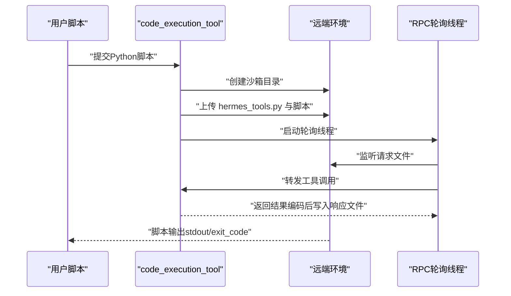
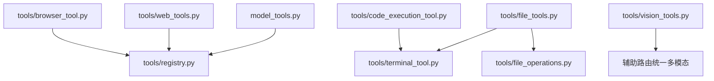

# 开发流程指南

<cite>
**本文档引用的文件**
- [tools/registry.py](file://tools/registry.py)
- [model_tools.py](file://model_tools.py)
- [tools/file_tools.py](file://tools/file_tools.py)
- [tools/file_operations.py](file://tools/file_operations.py)
- [tools/terminal_tool.py](file://tools/terminal_tool.py)
- [tools/web_tools.py](file://tools/web_tools.py)
- [tools/browser_tool.py](file://tools/browser_tool.py)
- [tools/vision_tools.py](file://tools/vision_tools.py)
- [tools/code_execution_tool.py](file://tools/code_execution_tool.py)
</cite>

## 目录
1. [简介](#简介)
2. [项目结构](#项目结构)
3. [核心组件](#核心组件)
4. [架构总览](#架构总览)
5. [详细组件分析](#详细组件分析)
6. [依赖关系分析](#依赖关系分析)
7. [性能考虑](#性能考虑)
8. [故障排除指南](#故障排除指南)
9. [结论](#结论)
10. [附录](#附录)

## 简介
本指南面向Hermes Agent的工具开发者，系统阐述从工具设计、Schema编写、参数校验、错误处理，到注册、模块导入、工具集分类与部署的完整开发流程。文档同时提供文件操作、终端执行、网络搜索、浏览器自动化、视觉分析等类型工具的实践范式，并给出测试、调试与性能优化建议，以及工具间依赖与组合使用的最佳实践。

## 项目结构
Hermes Agent的工具体系以“工具注册中心 + 工具实现 + 模型调度层”为核心组织方式：
- 工具注册中心：集中管理工具Schema、处理器、可用性检查与分组元数据
- 工具实现：各功能域的独立模块（文件、终端、网络、浏览器、视觉、代码执行等）
- 模型调度层：统一暴露给推理引擎的工具定义与调用接口

图示来源
- [model_tools.py:132-170](file://model_tools.py#L132-L170)
- [tools/registry.py:45-90](file://tools/registry.py#L45-L90)
- [tools/file_tools.py:149-267](file://tools/file_tools.py#L149-L267)
- [tools/file_operations.py:321-367](file://tools/file_operations.py#L321-L367)
- [tools/terminal_tool.py:583-712](file://tools/terminal_tool.py#L583-L712)
- [tools/web_tools.py:75-120](file://tools/web_tools.py#L75-L120)
- [tools/browser_tool.py:690-743](file://tools/browser_tool.py#L690-L743)
- [tools/vision_tools.py:573-614](file://tools/vision_tools.py#L573-L614)
- [tools/code_execution_tool.py:72-74](file://tools/code_execution_tool.py#L72-L74)

章节来源
- [model_tools.py:132-170](file://model_tools.py#L132-L170)
- [tools/registry.py:1-321](file://tools/registry.py#L1-L321)

## 核心组件
- 工具注册中心（ToolRegistry）：提供工具注册、Schema过滤、分发与可用性检查；统一错误返回格式
- 模型工具层（model_tools）：负责工具发现、Schema生成、参数类型强制转换、异步桥接与调用钩子
- 具体工具模块：各自实现Handler与Schema，并通过注册中心暴露能力

章节来源
- [tools/registry.py:45-162](file://tools/registry.py#L45-L162)
- [model_tools.py:81-126](file://model_tools.py#L81-L126)
- [model_tools.py:132-170](file://model_tools.py#L132-L170)

## 架构总览
工具从“被发现”到“被调用”的端到端流程如下：

图示来源
- [model_tools.py:459-548](file://model_tools.py#L459-L548)
- [tools/registry.py:144-162](file://tools/registry.py#L144-L162)

章节来源
- [model_tools.py:459-548](file://model_tools.py#L459-L548)
- [tools/registry.py:144-162](file://tools/registry.py#L144-L162)

## 详细组件分析

### 工具注册中心（Registry）
- 注册接口：register(name, toolset, schema, handler, check_fn, requires_env, is_async, description, emoji)
- 可用性过滤：get_definitions根据check_fn动态筛选可用工具
- 分发机制：dispatch按名称调用处理器，自动桥接异步
- 错误统一：tool_error/tool_result标准化错误与成功响应

图示来源
- [tools/registry.py:24-90](file://tools/registry.py#L24-L90)
- [tools/registry.py:45-271](file://tools/registry.py#L45-L271)

章节来源
- [tools/registry.py:24-321](file://tools/registry.py#L24-L321)

### 文件工具链（File Tools）
- ShellFileOperations：跨后端统一文件操作（读取、写入、补丁、搜索），内置二进制/图像检测、路径展开、命令缓存与Lint
- file_tools：面向LLM的工具入口（read_file、write_file、patch、search_files），含设备路径阻断、敏感路径检查、重复读取去重、超大文件提示与连续循环防护
- 终端环境复用：与terminal_tool共享任务级环境，避免重复沙箱创建

图示来源
- [tools/file_tools.py:279-436](file://tools/file_tools.py#L279-L436)
- [tools/file_operations.py:321-556](file://tools/file_operations.py#L321-L556)

章节来源
- [tools/file_tools.py:149-267](file://tools/file_tools.py#L149-L267)
- [tools/file_tools.py:279-706](file://tools/file_tools.py#L279-L706)
- [tools/file_operations.py:321-800](file://tools/file_operations.py#L321-L800)

### 终端工具（Terminal）
- 多后端支持：local、docker、singularity、modal、daytona、ssh
- 生命周期管理：按任务ID复用/清理环境，空闲回收线程
- 安全增强：sudo密码缓存与交互式输入、危险命令审批、工作目录白名单校验
- 资源配置：CPU/内存/磁盘/持久化开关、容器卷映射、主机工作目录挂载

图示来源
- [tools/terminal_tool.py:583-712](file://tools/terminal_tool.py#L583-L712)
- [tools/terminal_tool.py:715-790](file://tools/terminal_tool.py#L715-L790)

章节来源
- [tools/terminal_tool.py:495-571](file://tools/terminal_tool.py#L495-L571)
- [tools/terminal_tool.py:583-800](file://tools/terminal_tool.py#L583-L800)

### 网络工具（Web）
- 后端选择：Exa、Firecrawl、Parallel、Tavily（含受控路由至Nous托管网关）
- 内容抽取：统一归一化结果格式，支持LLM摘要与压缩，超大内容分块处理
- 安全策略：URL白名单/黑名单、SSRF防护、调试日志

图示来源
- [tools/web_tools.py:75-120](file://tools/web_tools.py#L75-L120)
- [tools/web_tools.py:477-575](file://tools/web_tools.py#L477-L575)

章节来源
- [tools/web_tools.py:1-800](file://tools/web_tools.py#L1-L800)

### 浏览器工具（Browser）
- 多后端：Browser Use（默认）、Browserbase、本地Chromium（agent-browser）
- 会话隔离：按任务ID管理会话，空闲回收线程
- 页面快照：基于可访问性树的文本表示，支持ref选择器与滚动/回退/按键
- 视觉辅助：截图+AI分析（vision_analyze）

图示来源
- [tools/browser_tool.py:690-743](file://tools/browser_tool.py#L690-L743)
- [tools/browser_tool.py:496-656](file://tools/browser_tool.py#L496-L656)

章节来源
- [tools/browser_tool.py:1-800](file://tools/browser_tool.py#L1-L800)

### 视觉工具（Vision）
- 支持URL或本地路径，自动下载/转base64，MIME识别
- 通过统一的辅助路由调用多模态模型，失败时给出明确提示
- 临时文件清理与调试日志

图示来源
- [tools/vision_tools.py:264-495](file://tools/vision_tools.py#L264-L495)

章节来源
- [tools/vision_tools.py:1-615](file://tools/vision_tools.py#L1-L615)

### 代码执行工具（Execute Code）
- 两种传输：本地Unix Domain Socket（UDS）与远程文件RPC
- 沙箱允许的工具集合：web_search、web_extract、read_file、write_file、search_files、patch、terminal
- 资源限制：超时、最大工具调用次数、stdout/stderr大小限制
- 远程执行：在远端终端后端创建沙箱目录，生成hermes_tools.py桩模块，通过请求/响应文件进行RPC

图示来源
- [tools/code_execution_tool.py:685-800](file://tools/code_execution_tool.py#L685-L800)
- [tools/code_execution_tool.py:546-683](file://tools/code_execution_tool.py#L546-L683)

章节来源
- [tools/code_execution_tool.py:1-800](file://tools/code_execution_tool.py#L1-L800)

## 依赖关系分析
- 模型调度层依赖注册中心：通过统一入口获取工具Schema与分发调用
- 文件工具依赖终端工具：ShellFileOperations基于终端环境execute接口
- 视觉工具依赖辅助路由：统一的多模态模型调用
- 代码执行工具依赖终端工具：在远端后端复用同一套环境生命周期管理

图示来源
- [model_tools.py:132-170](file://model_tools.py#L132-L170)
- [tools/file_tools.py:149-267](file://tools/file_tools.py#L149-L267)
- [tools/code_execution_tool.py:430-527](file://tools/code_execution_tool.py#L430-L527)

章节来源
- [model_tools.py:132-170](file://model_tools.py#L132-L170)
- [tools/file_tools.py:149-267](file://tools/file_tools.py#L149-L267)
- [tools/code_execution_tool.py:430-527](file://tools/code_execution_tool.py#L430-L527)

## 性能考虑
- 工具调用参数类型强制转换：减少因字符串/数字/布尔不匹配导致的重试与失败
- 文件读取字符上限与分页：避免超大上下文引发的Token压力
- 连续读取/搜索去重与告警：防止模型陷入无效循环
- 终端环境复用与空闲回收：降低沙箱创建/销毁开销
- 远程RPC轮询指数退避：平衡延迟与吞吐
- 视觉分析下载超时与重试：提升鲁棒性

章节来源
- [model_tools.py:372-457](file://model_tools.py#L372-L457)
- [tools/file_tools.py:31-56](file://tools/file_tools.py#L31-L56)
- [tools/file_tools.py:415-432](file://tools/file_tools.py#L415-L432)
- [tools/terminal_tool.py:715-790](file://tools/terminal_tool.py#L715-L790)
- [tools/code_execution_tool.py:546-683](file://tools/code_execution_tool.py#L546-L683)
- [tools/vision_tools.py:124-213](file://tools/vision_tools.py#L124-L213)

## 故障排除指南
- 工具不可用：检查工具集可用性与check_fn返回值
- 参数类型错误：确认JSON Schema期望类型，必要时启用参数强制转换
- 文件读取过大：使用offset/limit分页，或调整file_read_max_chars配置
- 终端命令失败：查看sudo密码配置、危险命令审批、工作目录合法性
- 网络工具未配置：核对后端API Key与托管网关设置
- 浏览器会话泄漏：确认空闲回收线程运行与任务ID正确传递
- 视觉分析失败：检查URL可达性、MIME类型、模型可用性与配额

章节来源
- [tools/registry.py:194-271](file://tools/registry.py#L194-L271)
- [model_tools.py:372-457](file://model_tools.py#L372-L457)
- [tools/file_tools.py:358-372](file://tools/file_tools.py#L358-L372)
- [tools/terminal_tool.py:138-150](file://tools/terminal_tool.py#L138-L150)
- [tools/web_tools.py:160-171](file://tools/web_tools.py#L160-L171)
- [tools/browser_tool.py:414-440](file://tools/browser_tool.py#L414-L440)
- [tools/vision_tools.py:443-483](file://tools/vision_tools.py#L443-L483)

## 结论
通过统一的工具注册中心与模型调度层，Hermes Agent实现了工具的模块化、可扩展与安全可控。开发者只需遵循Schema规范、实现处理器、注册工具集与可用性检查，即可无缝接入模型工具调用链路。结合本文提供的测试、调试与性能优化建议，可快速构建高质量的工具并稳定交付。

## 附录

### 工具Schema编写规范
- 必填字段：name、description、parameters.properties
- 参数类型：严格声明integer/number/boolean/string与枚举
- 默认值与最小/最大约束：确保LLM输出符合预期
- 示例参考：file_tools中的READ_FILE_SCHEMA、WRITE_FILE_SCHEMA、PATCH_SCHEMA、SEARCH_FILES_SCHEMA

章节来源
- [tools/file_tools.py:727-788](file://tools/file_tools.py#L727-L788)

### 参数验证与类型强制转换
- 自动类型强制：handle_function_call中对整数、浮点、布尔进行安全转换
- 建议：在工具Schema中明确类型，减少运行期转换失败

章节来源
- [model_tools.py:372-457](file://model_tools.py#L372-L457)

### 错误处理模式
- 统一返回：registry.tool_error/tool_result
- 异常捕获：registry.dispatch与model_tools.handle_function_call均捕获异常并返回标准错误
- 建议：工具处理器返回JSON字符串，避免抛出异常

章节来源
- [tools/registry.py:294-321](file://tools/registry.py#L294-L321)
- [model_tools.py:545-548](file://model_tools.py#L545-L548)

### 工具注册流程与模块导入
- 工具模块自注册：每个工具文件在导入时调用registry.register
- 发现入口：model_tools._discover_tools集中导入工具模块
- 建议：新增工具时在tools目录下新建模块并在discover_tools中加入导入

章节来源
- [model_tools.py:132-170](file://model_tools.py#L132-L170)

### 工具集分类与组合使用
- 工具集：每个工具绑定toolset，registry按toolset聚合与可用性检查
- 组合使用：execute_code可在沙箱内组合有限工具，注意资源限制与参数剥离
- 建议：通过enabled_toolsets/disabled_toolsets控制可见工具集，避免模型误调用

章节来源
- [model_tools.py:234-353](file://model_tools.py#L234-L353)
- [tools/code_execution_tool.py:72-74](file://tools/code_execution_tool.py#L72-L74)

### 测试方法与调试技巧
- 单元测试：利用tests目录下的工具测试用例作为参考
- 调试开关：工具模块普遍支持DEBUG环境变量（如WEB_TOOLS_DEBUG、VISION_TOOLS_DEBUG）
- 日志：关注tools/registry.py与model_tools.py中的日志输出
- 建议：为新工具提供最小可运行示例与错误场景覆盖

章节来源
- [tools/web_tools.py:25-29](file://tools/web_tools.py#L25-L29)
- [tools/vision_tools.py:46-46](file://tools/vision_tools.py#L46-L46)