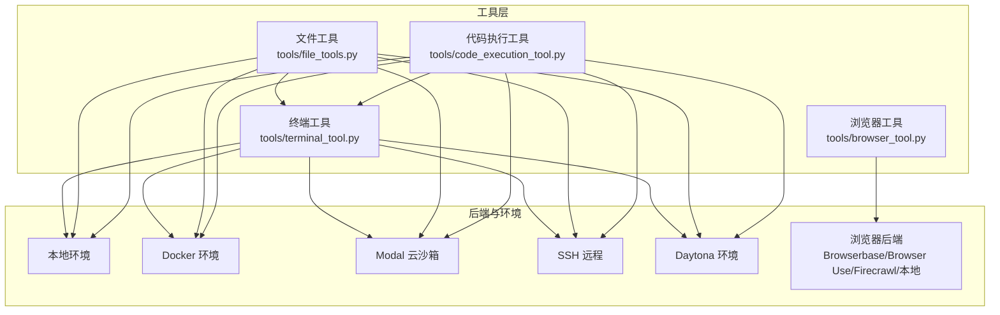
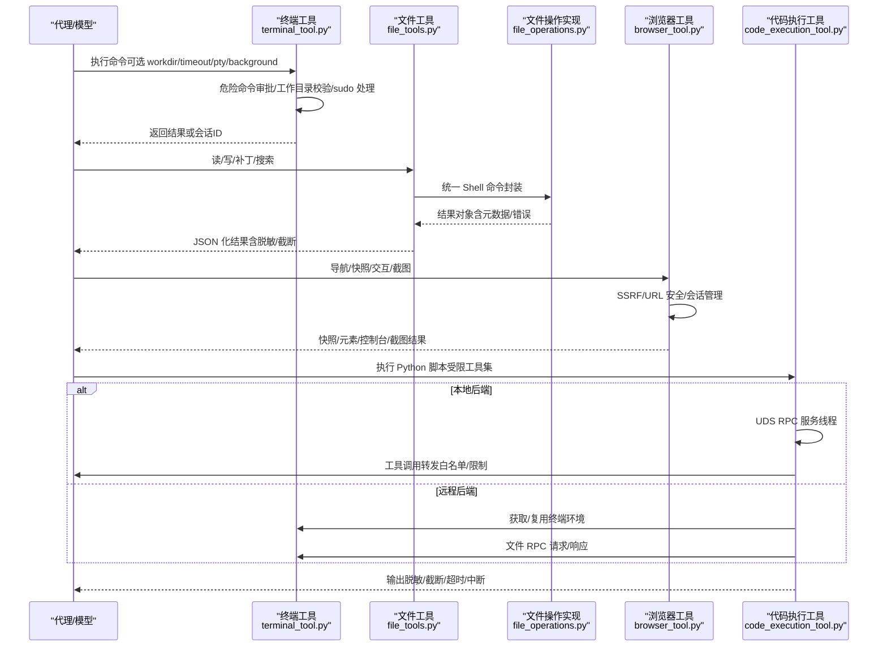
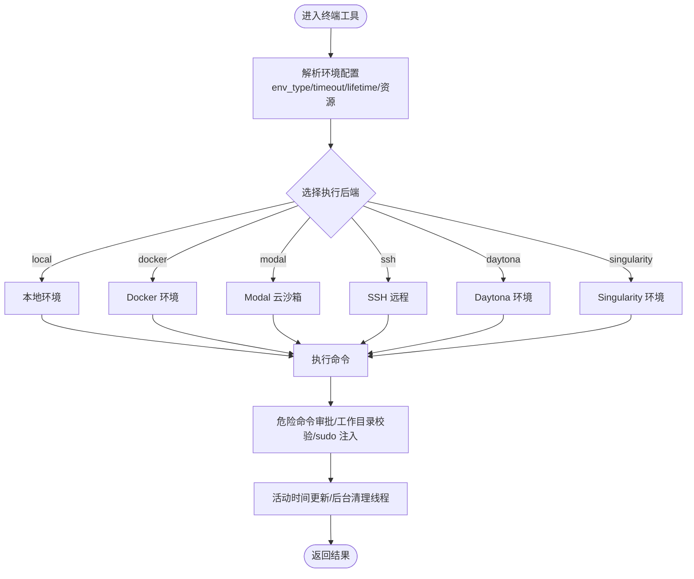
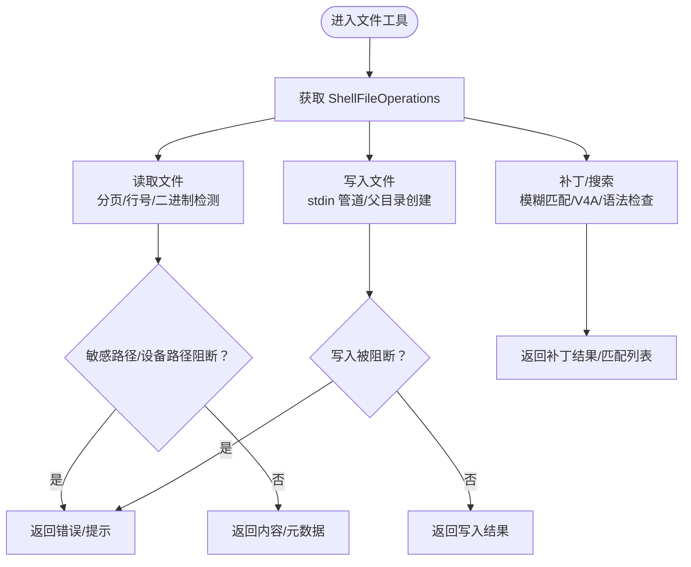
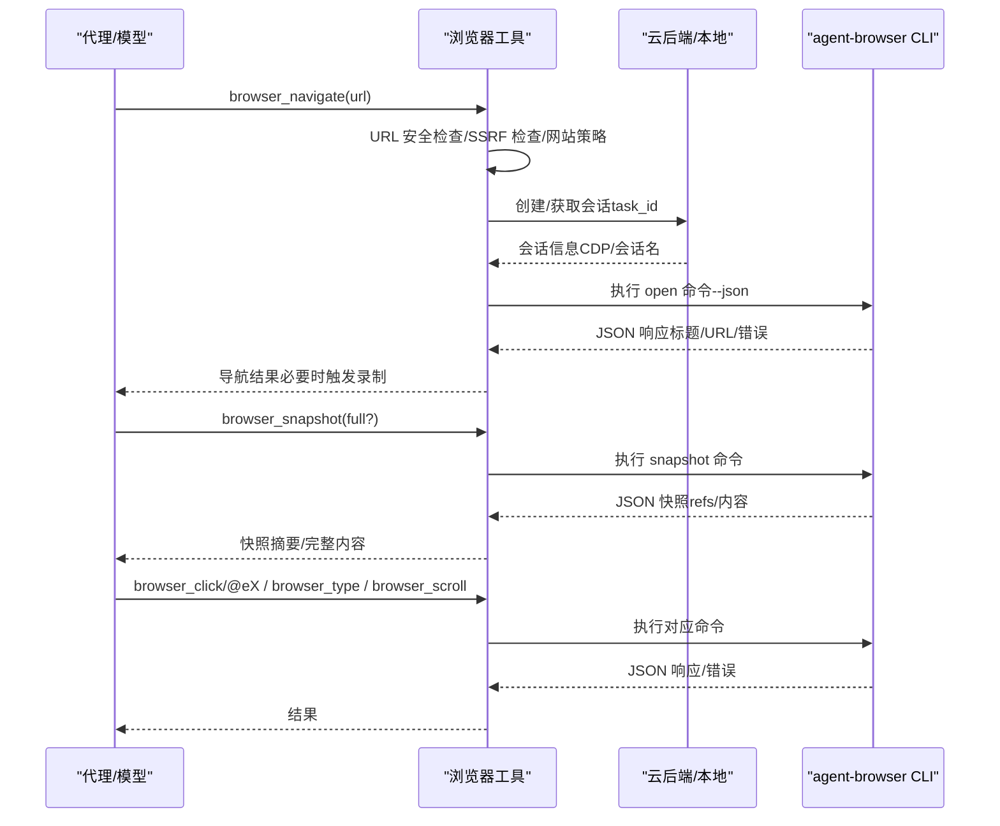
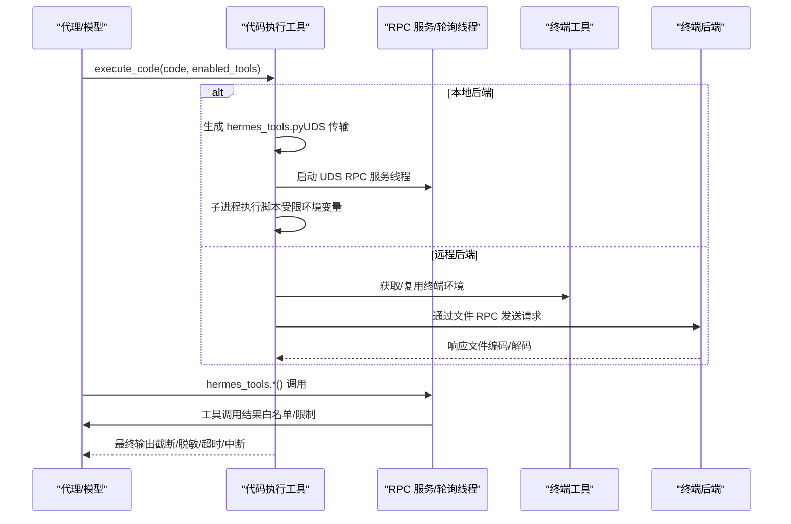
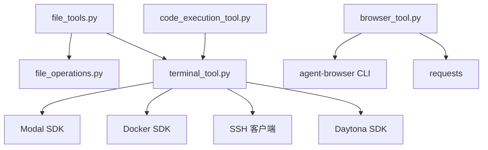

# 核心工具类型

<cite>
**本文引用的文件**
- [terminal_tool.py](file://tools/terminal_tool.py)
- [file_tools.py](file://tools/file_tools.py)
- [file_operations.py](file://tools/file_operations.py)
- [browser_tool.py](file://tools/browser_tool.py)
- [code_execution_tool.py](file://tools/code_execution_tool.py)
</cite>

## 目录
1. [简介](#简介)
2. [项目结构](#项目结构)
3. [核心组件](#核心组件)
4. [架构总览](#架构总览)
5. [详细组件分析](#详细组件分析)
6. [依赖分析](#依赖分析)
7. [性能考虑](#性能考虑)
8. [故障排查指南](#故障排查指南)
9. [结论](#结论)
10. [附录](#附录)

## 简介
本文件系统性梳理 Hermes Agent 的三大核心工具类型：终端工具、文件工具与浏览器工具，并补充代码执行工具（Programmatic Tool Calling，PTC）的安全隔离与沙箱机制。内容覆盖：
- 终端工具：多后端执行（本地、Docker、Singularity、Modal、SSH、Daytona）、危险命令审批、sudo 处理、工作目录校验、磁盘用量告警、后台任务生命周期管理。
- 文件工具：跨后端统一文件操作（读、写、补丁、搜索）、敏感路径阻断、设备路径保护、重复读/搜索检测、内容脱敏与截断、大文件提示与分页。
- 浏览器工具：多云后端（Browserbase、Browser Use、Firecrawl）与本地 Chromium、会话隔离、SSRF 防护、URL 安全检查、快照提取与摘要、截图与视觉分析。
- 代码执行工具：本地 UDS 与远程文件 RPC 双通道、工具白名单、资源限制、环境变量过滤、ANSI 去除与敏感信息脱敏、超时与中断处理。

## 项目结构
围绕核心工具的模块分布如下：
- tools/terminal_tool.py：终端工具主入口，负责环境选择、执行后端、生命周期管理、sudo 与危险命令处理。
- tools/file_tools.py：文件工具入口，封装 ShellFileOperations，提供读、写、补丁、搜索等能力，并进行路径与内容安全控制。
- tools/file_operations.py：跨后端文件操作实现，基于 Shell 命令抽象，屏蔽容器/云沙箱差异。
- tools/browser_tool.py：浏览器自动化入口，支持本地与云后端，提供导航、快照、点击、输入、滚动、控制台、截图与视觉分析。
- tools/code_execution_tool.py：代码执行工具，通过 RPC 将 LLM 生成的脚本在受控环境中运行，提供本地 UDS 与远程文件 RPC 两种通道。

**图表来源**
- [terminal_tool.py:495-713](file://tools/terminal_tool.py#L495-L713)
- [file_tools.py:149-267](file://tools/file_tools.py#L149-L267)
- [browser_tool.py:232-286](file://tools/browser_tool.py#L232-L286)
- [code_execution_tool.py:430-527](file://tools/code_execution_tool.py#L430-L527)

**章节来源**
- [terminal_tool.py:1-120](file://tools/terminal_tool.py#L1-L120)
- [file_tools.py:1-40](file://tools/file_tools.py#L1-L40)
- [browser_tool.py:1-60](file://tools/browser_tool.py#L1-L60)
- [code_execution_tool.py:1-40](file://tools/code_execution_tool.py#L1-L40)

## 核心组件
- 终端工具（terminal_tool）
  - 支持本地、Docker、Singularity、Modal、SSH、Daytona 六类后端，按环境变量选择；默认本地。
  - 提供背景任务、持久化 shell、容器资源配额、工作目录校验、sudo 自动注入与密码缓存、危险命令审批、磁盘用量告警。
  - 生命周期管理：活动时间跟踪、后台清理线程、任务级环境复用与失效清理。
- 文件工具（file_tools）
  - 以 ShellFileOperations 为核心，统一读、写、补丁、搜索接口，屏蔽后端差异。
  - 路径安全：设备路径阻断、内部 Hermes 缓存路径保护、敏感路径前缀/精确路径阻断、可选安全根目录限制。
  - 内容安全：字符数上限、重复读/搜索检测、大文件提示、脱敏输出、统计与历史记录。
- 浏览器工具（browser_tool）
  - 后端自动探测：Browser Use（优先）、Browserbase、Firecrawl 或本地 Chromium。
  - 安全防护：SSRF 检查、URL 安全校验、网站策略拦截、Camofix 模式、会话隔离与自动清理。
  - 能力：导航、快照（含摘要）、元素交互（点击/输入/滚动/回退/按键）、控制台（日志/JS 错误/表达式求值）、截图与视觉分析。
- 代码执行工具（code_execution_tool）
  - 本地：Unix Domain Socket（UDS）RPC，子进程隔离，环境变量白名单过滤，ANSI 去除与脱敏。
  - 远程：文件 RPC（请求/响应文件），在终端后端（Docker/Modal/SSH/Daytona 等）中执行，带超时与中断处理。
  - 限制：最大工具调用次数、最大输出字节数、前台命令限制、允许工具白名单。

**章节来源**
- [terminal_tool.py:495-713](file://tools/terminal_tool.py#L495-L713)
- [file_tools.py:149-267](file://tools/file_tools.py#L149-L267)
- [browser_tool.py:232-286](file://tools/browser_tool.py#L232-L286)
- [code_execution_tool.py:430-527](file://tools/code_execution_tool.py#L430-L527)

## 架构总览
下图展示核心工具的调用链与关键安全点：

**图表来源**
- [terminal_tool.py:715-800](file://tools/terminal_tool.py#L715-L800)
- [file_tools.py:149-267](file://tools/file_tools.py#L149-L267)
- [file_operations.py:321-400](file://tools/file_operations.py#L321-L400)
- [browser_tool.py:826-1028](file://tools/browser_tool.py#L826-L1028)
- [code_execution_tool.py:866-900](file://tools/code_execution_tool.py#L866-L900)

## 详细组件分析

### 终端工具（terminal_tool）
- 多后端选择与配置
  - 通过环境变量选择后端（local/docker/modal/ssh/daytona/singularity），默认 local。
  - 容器资源（CPU/内存/磁盘）、持久化文件系统、工作目录、超时、持久化 shell 等参数从环境变量解析。
- 危险命令与 sudo
  - 危险命令审批：集中守卫（含 Tirith 等）与交互式批准回调。
  - sudo 处理：将裸 sudo 替换为 -S -p '' 并注入密码到 stdin；支持会话内缓存与交互式提示。
- 工作目录安全
  - 使用正则白名单校验工作目录，拒绝可疑字符，避免路径注入。
- 生命周期与清理
  - 后台清理线程定期扫描不活跃环境并停止；结合进程注册表避免误杀活跃沙箱。
- 磁盘用量告警
  - 统计 hermes 目录总大小，超过阈值发出告警，建议清理。

**图表来源**
- [terminal_tool.py:495-713](file://tools/terminal_tool.py#L495-L713)
- [terminal_tool.py:715-800](file://tools/terminal_tool.py#L715-L800)

**章节来源**
- [terminal_tool.py:137-203](file://tools/terminal_tool.py#L137-L203)
- [terminal_tool.py:151-177](file://tools/terminal_tool.py#L151-L177)
- [terminal_tool.py:330-396](file://tools/terminal_tool.py#L330-L396)
- [terminal_tool.py:715-800](file://tools/terminal_tool.py#L715-L800)

### 文件工具（file_tools）与文件操作实现（file_operations）
- 统一接口与后端适配
  - ShellFileOperations 将文件操作抽象为 shell 命令，兼容本地与各类容器/云后端。
- 路径与内容安全
  - 设备路径阻断（/dev/zero、/proc/self/fd/0 等）、内部 Hermes 缓存路径保护、敏感路径前缀/精确路径阻断。
  - 可选安全根目录（HERMES_WRITE_SAFE_ROOT）限制写入范围。
- 读取策略
  - 分页读取（offset/limit）、行号添加、二进制/图片检测、大文件提示、字符数上限与截断、重复读去重与连续读警告。
- 写入与补丁
  - 写入通过 stdin 管道，绕过 ARG_MAX；补丁采用模糊匹配与 V4A 解析，自动语法检查。
- 搜索
  - 支持内容搜索（正则）与文件名搜索（glob），支持上下文行与计数模式。

**图表来源**
- [file_tools.py:149-267](file://tools/file_tools.py#L149-L267)
- [file_operations.py:321-400](file://tools/file_operations.py#L321-L400)
- [file_operations.py:469-556](file://tools/file_operations.py#L469-L556)
- [file_operations.py:587-639](file://tools/file_operations.py#L587-L639)
- [file_operations.py:645-704](file://tools/file_operations.py#L645-L704)
- [file_operations.py:772-800](file://tools/file_operations.py#L772-L800)

**章节来源**
- [file_tools.py:73-116](file://tools/file_tools.py#L73-L116)
- [file_tools.py:279-436](file://tools/file_tools.py#L279-L436)
- [file_tools.py:559-637](file://tools/file_tools.py#L559-L637)
- [file_tools.py:640-706](file://tools/file_tools.py#L640-L706)
- [file_operations.py:98-116](file://tools/file_operations.py#L98-L116)
- [file_operations.py:469-556](file://tools/file_operations.py#L469-L556)
- [file_operations.py:587-639](file://tools/file_operations.py#L587-L639)
- [file_operations.py:645-704](file://tools/file_operations.py#L645-L704)
- [file_operations.py:772-800](file://tools/file_operations.py#L772-L800)

### 浏览器工具（browser_tool）
- 后端与会话
  - 自动探测 Browser Use（优先）、Browserbase、Firecrawl 或本地 Chromium；支持 CDP Override 直连。
  - 会话隔离：按 task_id 管理；后台清理线程定期关闭不活跃会话。
- 安全与合规
  - SSRF 防护：禁止私有/内部地址（本地后端跳过）；导航后重定向若落至私有地址则清屏阻断。
  - URL 安全：正则识别密钥/令牌片段；网站策略拦截。
- 能力矩阵
  - 导航、快照（紧凑/完整视图，超长内容摘要或截断）、元素交互（点击/输入/滚动/回退/按键）、控制台（日志/错误/表达式）、截图与视觉分析。
- 输出与错误
  - 统一 JSON 返回；非 JSON 输出尝试从文本恢复截图路径；空输出/失败码记录日志。

**图表来源**
- [browser_tool.py:1107-1200](file://tools/browser_tool.py#L1107-L1200)
- [browser_tool.py:826-1028](file://tools/browser_tool.py#L826-L1028)
- [browser_tool.py:1107-1200](file://tools/browser_tool.py#L1107-L1200)

**章节来源**
- [browser_tool.py:1118-1184](file://tools/browser_tool.py#L1118-L1184)
- [browser_tool.py:1129-1139](file://tools/browser_tool.py#L1129-L1139)
- [browser_tool.py:1140-1148](file://tools/browser_tool.py#L1140-L1148)
- [browser_tool.py:1166-1189](file://tools/browser_tool.py#L1166-L1189)
- [browser_tool.py:826-1028](file://tools/browser_tool.py#L826-L1028)

### 代码执行工具（code_execution_tool）
- 通道与隔离
  - 本地：Unix Domain Socket（UDS）RPC，子进程隔离，仅暴露受限工具集。
  - 远程：文件 RPC（请求/响应文件），在终端后端（Docker/Modal/SSH/Daytona 等）执行。
- 工具白名单与限制
  - 允许工具集：web_search、web_extract、read_file、write_file、search_files、patch、terminal。
  - 限制：最大工具调用次数、最大 stdout 字节、前台命令限制（terminal 不支持后台/pty）。
- 环境变量与安全
  - 子进程环境变量白名单过滤，排除密钥/令牌等敏感变量；允许技能显式透传变量。
- 输出与错误
  - stdout 截断（头尾保留）、ANSI 去除、脱敏；stderr 合并到输出以便模型看到堆栈；超时/中断状态明确返回。

**图表来源**
- [code_execution_tool.py:866-900](file://tools/code_execution_tool.py#L866-L900)
- [code_execution_tool.py:900-1175](file://tools/code_execution_tool.py#L900-L1175)
- [code_execution_tool.py:1191-1221](file://tools/code_execution_tool.py#L1191-L1221)

**章节来源**
- [code_execution_tool.py:53-70](file://tools/code_execution_tool.py#L53-L70)
- [code_execution_tool.py:129-162](file://tools/code_execution_tool.py#L129-L162)
- [code_execution_tool.py:306-424](file://tools/code_execution_tool.py#L306-L424)
- [code_execution_tool.py:426-527](file://tools/code_execution_tool.py#L426-L527)
- [code_execution_tool.py:546-683](file://tools/code_execution_tool.py#L546-L683)
- [code_execution_tool.py:685-860](file://tools/code_execution_tool.py#L685-L860)
- [code_execution_tool.py:900-1175](file://tools/code_execution_tool.py#L900-L1175)
- [code_execution_tool.py:1191-1221](file://tools/code_execution_tool.py#L1191-L1221)

## 依赖分析
- 组件耦合
  - 文件工具依赖终端工具创建的环境实例，共享任务级环境复用与清理逻辑。
  - 代码执行工具依赖终端工具获取/复用环境，并在远程后端通过文件 RPC 与环境交互。
  - 浏览器工具独立于终端工具，但同样支持 CDP Override 与会话隔离。
- 外部依赖
  - 终端工具：subprocess、信号、定时器、Modal/Docker/SSH/Daytona 等后端 SDK（按需导入）。
  - 文件工具：ShellFileOperations 基于 POSIX 命令（wc/head/sed/ls 等）。
  - 浏览器工具：agent-browser CLI、requests、Chrome DevTools Protocol。
  - 代码执行工具：socket（UDS）、subprocess、文件 RPC、环境变量过滤。

**图表来源**
- [file_tools.py:149-267](file://tools/file_tools.py#L149-L267)
- [terminal_tool.py:398-406](file://tools/terminal_tool.py#L398-L406)
- [browser_tool.py:70-84](file://tools/browser_tool.py#L70-L84)
- [code_execution_tool.py:430-527](file://tools/code_execution_tool.py#L430-L527)

**章节来源**
- [file_tools.py:149-267](file://tools/file_tools.py#L149-L267)
- [terminal_tool.py:398-406](file://tools/terminal_tool.py#L398-L406)
- [browser_tool.py:70-84](file://tools/browser_tool.py#L70-L84)
- [code_execution_tool.py:430-527](file://tools/code_execution_tool.py#L430-L527)

## 性能考虑
- 终端工具
  - 后台清理线程周期性扫描，避免长时间占用锁；容器/云沙箱停止可能阻塞，因此在锁外执行。
  - 磁盘用量告警减少不必要的大体量文件操作。
- 文件工具
  - 重复读/搜索检测与去重缓存降低上下文开销；字符数上限与截断避免大文本进入模型上下文。
  - 二进制/图片快速判定，避免昂贵的文本解析。
- 浏览器工具
  - 快照长度阈值与摘要模型减少传输量；会话不活跃自动清理释放资源。
- 代码执行工具
  - UDS 与文件 RPC 的选择取决于后端；stdout 截断与 ANSI 去除减少输出体积；超时与中断快速失败。

[本节为通用指导，无需特定文件引用]

## 故障排查指南
- 终端工具
  - sudo 失败：在消息网关场景下附加提示，建议在 agent 机器 .env 中设置 SUDO_PASSWORD。
  - 危险命令被阻：根据审批回调或模型重新表述命令；必要时使用 terminal 工具直接执行。
  - 磁盘用量过高：执行清理函数或调整阈值；关注沙箱临时目录。
- 文件工具
  - 设备路径/内部路径访问失败：遵循工具建议改用 read_file/search_files；避免直接 cat/head/tail。
  - 写入被阻断：目标为敏感路径或超出安全根目录；改用 terminal 工具并配合 sudo。
  - 重复读/搜索被限制：模型应合并/重定向到其他工具；避免循环读取。
- 浏览器工具
  - SSRF/URL 安全被阻：检查 URL 是否包含密钥片段；确认网站策略与私有地址访问开关。
  - 快照为空：可能为 CDP/守护进程问题，尝试重启会话或切换后端。
- 代码执行工具
  - 本地不可用：Windows 不支持 UDS，改用远程通道或普通工具调用。
  - 超时/中断：调整超时与工具调用上限；确保脚本中止逻辑正确。
  - 输出泄露：确认环境变量过滤与脱敏已生效；避免在脚本中直接打印敏感信息。

**章节来源**
- [terminal_tool.py:179-203](file://tools/terminal_tool.py#L179-L203)
- [file_tools.py:279-436](file://tools/file_tools.py#L279-L436)
- [file_tools.py:559-637](file://tools/file_tools.py#L559-L637)
- [browser_tool.py:1118-1184](file://tools/browser_tool.py#L1118-L1184)
- [code_execution_tool.py:866-900](file://tools/code_execution_tool.py#L866-L900)
- [code_execution_tool.py:1146-1156](file://tools/code_execution_tool.py#L1146-L1156)

## 结论
Hermes Agent 的核心工具通过“统一抽象 + 后端适配 + 强安全策略”实现了在本地与多云沙箱中的稳定运行。终端工具保障命令执行的可控性与安全性；文件工具在跨后端一致性上提供强约束；浏览器工具在自动化与安全之间取得平衡；代码执行工具则在隔离与可用性之间提供灵活的双通道方案。建议在生产中结合环境变量与策略配置，持续监控磁盘与会话资源，确保工具链的稳定性与安全性。

[本节为总结性内容，无需特定文件引用]

## 附录
- API 参考（简述）
  - 终端工具
    - 参数：command、timeout、workdir、background、pty、notify_on_complete 等。
    - 行为：前台即时返回、后台会话管理、持久化 shell、容器资源限制。
  - 文件工具
    - read_file：path、offset、limit；返回内容/行数/大小/提示/相似文件。
    - write_file：path、content；返回写入字节数/目录创建标记。
    - patch：mode=replace 或 patch；支持模糊匹配与 V4A；返回 diff/修改文件列表/语法检查。
    - search_files：pattern、target、path、file_glob、limit、offset、output_mode、context。
  - 浏览器工具
    - browser_navigate：url；返回标题/最终 URL/错误。
    - browser_snapshot：full；返回 refs/内容/提示。
    - browser_click/brower_type/brower_scroll/brower_back/brower_press：ref/text/direction/key。
    - browser_close/get_images/vision/console：会话资源管理与辅助能力。
  - 代码执行工具
    - execute_code：code、enabled_tools；返回状态/输出/耗时/工具调用数/错误信息。

- 使用示例（路径指引）
  - 终端工具：参见 [terminal_tool.py:23-31](file://tools/terminal_tool.py#L23-L31)。
  - 文件工具：参见 [file_tools.py:708-713](file://tools/file_tools.py#L708-L713)。
  - 浏览器工具：参见 [browser_tool.py:40-50](file://tools/browser_tool.py#L40-L50)。
  - 代码执行工具：参见 [code_execution_tool.py:866-890](file://tools/code_execution_tool.py#L866-L890)。

- 最佳实践
  - 终端：优先前台命令；需要长时间任务使用后台并通知完成；合理设置 timeout 与工作目录。
  - 文件：避免直接 cat/head/tail；大文件使用 offset/limit；敏感路径改用 terminal + sudo。
  - 浏览器：先导航再快照；对私有地址访问谨慎开启；必要时使用视觉分析。
  - 代码执行：本地优先；远程注意 Python 可用性；严格控制工具调用次数与输出大小。

[本节为概览性内容，无需特定文件引用]