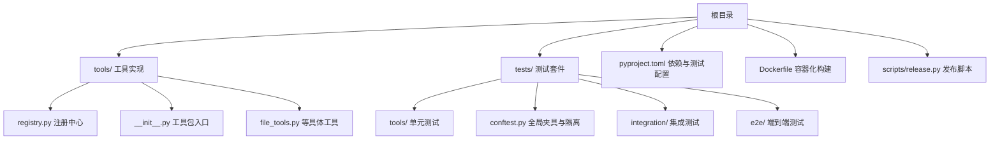
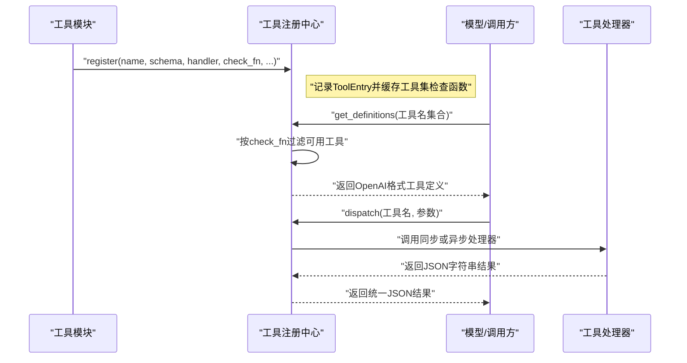
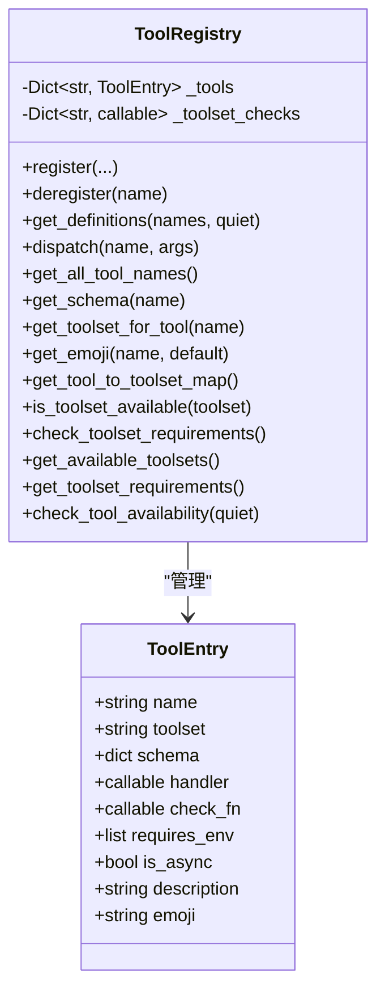
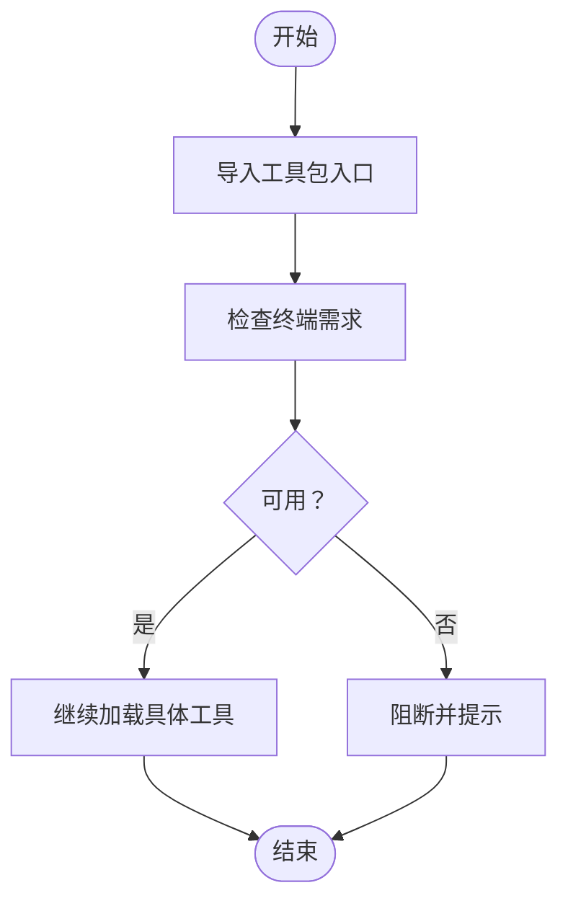
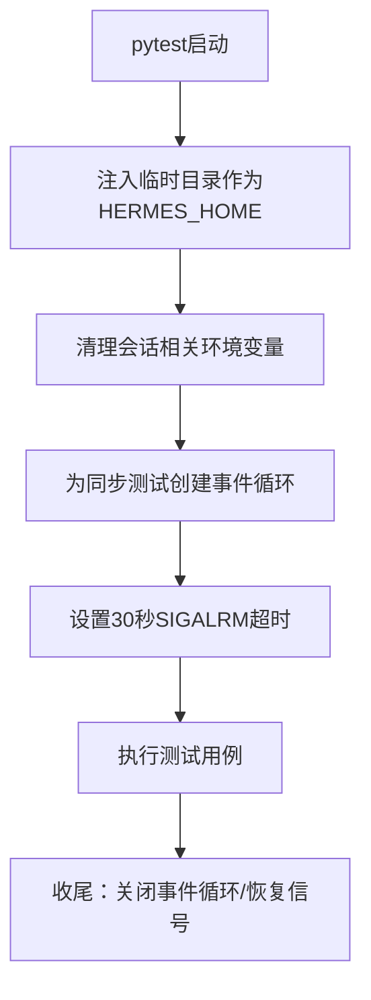
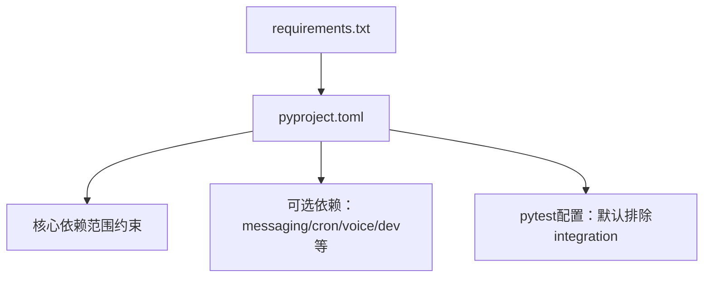

# 测试与部署

<cite>
**本文引用的文件**
- [README.md](file://README.md)
- [pyproject.toml](file://pyproject.toml)
- [requirements.txt](file://requirements.txt)
- [tests/conftest.py](file://tests/conftest.py)
- [tests/tools/test_registry.py](file://tests/tools/test_registry.py)
- [tools/registry.py](file://tools/registry.py)
- [tools/__init__.py](file://tools/__init__.py)
- [tests/tools/test_file_tools.py](file://tests/tools/test_file_tools.py)
- [Dockerfile](file://Dockerfile)
- [scripts/release.py](file://scripts/release.py)
</cite>

## 目录
1. [引言](#引言)
2. [项目结构](#项目结构)
3. [核心组件](#核心组件)
4. [架构总览](#架构总览)
5. [详细组件分析](#详细组件分析)
6. [依赖分析](#依赖分析)
7. [性能考虑](#性能考虑)
8. [故障排除指南](#故障排除指南)
9. [结论](#结论)
10. [附录](#附录)

## 引言
本指南面向Hermes Agent的工具开发与维护团队，系统阐述工具测试与部署的完整方法论：包括单元测试编写、测试用例设计原则、模拟对象使用；集成与端到端测试策略；性能测试方法；工具部署最佳实践与环境配置；依赖管理与版本控制；发布流程与向后兼容；监控与错误上报；以及测试自动化与持续集成的质量保障建议。内容以仓库现有测试体系与构建脚本为基础，结合工具注册中心与工具包特性，给出可操作的落地步骤。

## 项目结构
Hermes Agent采用模块化组织方式，工具能力通过“工具注册中心”集中编排，测试覆盖工具注册、分发、可用性检查、文件工具等关键路径。核心目录与文件关系如下：

图示来源
- [pyproject.toml:107-116](file://pyproject.toml#L107-L116)
- [Dockerfile:1-26](file://Dockerfile#L1-L26)

章节来源
- [README.md:140-158](file://README.md#L140-L158)
- [pyproject.toml:107-116](file://pyproject.toml#L107-L116)
- [Dockerfile:1-26](file://Dockerfile#L1-L26)

## 核心组件
- 工具注册中心：集中管理工具Schema、处理器、可用性检查函数与工具集元数据，统一对外提供定义查询与执行分发。
- 工具包入口：延迟导入策略，避免初始化阶段的全量加载。
- 测试夹具：全局隔离HERMES_HOME、事件循环与超时保护，确保测试稳定性与可重复性。
- 构建与发布：基于CalVer的标签与语义化版本联动，自动生成变更日志并可选构建Python发行制品。

章节来源
- [tools/registry.py:45-275](file://tools/registry.py#L45-L275)
- [tools/__init__.py:18-26](file://tools/__init__.py#L18-L26)
- [tests/conftest.py:19-120](file://tests/conftest.py#L19-L120)
- [scripts/release.py:140-214](file://scripts/release.py#L140-L214)

## 架构总览
工具从模块级注册到运行时分发的关键流程如下：

图示来源
- [tools/registry.py:56-89](file://tools/registry.py#L56-L89)
- [tools/registry.py:111-138](file://tools/registry.py#L111-L138)
- [tools/registry.py:144-161](file://tools/registry.py#L144-L161)

## 详细组件分析

### 工具注册中心（ToolRegistry）
- 职责：集中注册、查询、分发工具；提供工具集可用性检查与元信息聚合。
- 关键能力：
  - 注册与去注册：支持同名冲突告警与工具集检查清理。
  - 定义获取：按工具名集合返回OpenAI格式Schema，并自动过滤不可用工具。
  - 分发执行：捕获异常并统一返回错误；对异步处理器进行桥接。
  - 可用性检查：对check_fn异常进行兜底，避免崩溃；提供工具集维度的可用性汇总。
  - 辅助工具：tool_error/tool_result统一错误与结果序列化格式。

图示来源
- [tools/registry.py:24-43](file://tools/registry.py#L24-L43)
- [tools/registry.py:45-275](file://tools/registry.py#L45-L275)

章节来源
- [tools/registry.py:45-275](file://tools/registry.py#L45-L275)
- [tests/tools/test_registry.py:20-312](file://tests/tools/test_registry.py#L20-L312)

### 工具包入口与文件工具测试
- 工具包入口采用延迟导入策略，避免在配置未完成时加载全量工具栈。
- 文件工具测试覆盖Schema完整性、处理器分发、参数校验、异常处理与提示信息生成，广泛使用unittest.mock进行外部依赖隔离。

图示来源
- [tools/__init__.py:18-26](file://tools/__init__.py#L18-L26)

章节来源
- [tests/tools/test_file_tools.py:1-315](file://tests/tools/test_file_tools.py#L1-L315)
- [tools/__init__.py:18-26](file://tools/__init__.py#L18-L26)

### 测试夹具与隔离策略
- 全局HERMES_HOME隔离：每个测试在临时目录下运行，避免污染用户主目录。
- 事件循环兼容：为同步测试提供默认事件循环，避免旧版Python行为差异导致的失败。
- 超时保护：Unix平台使用SIGALRM强制终止超时测试，防止挂起拖垮CI。

图示来源
- [tests/conftest.py:19-120](file://tests/conftest.py#L19-L120)

章节来源
- [tests/conftest.py:19-120](file://tests/conftest.py#L19-L120)

## 依赖分析
- 依赖声明：核心依赖集中在pyproject.toml中，采用范围约束降低供应链风险；可选依赖按功能拆分，便于最小化安装。
- 测试配置：pytest默认排除integration标记的用例，加速本地迭代；可通过命令行开关启用。
- 安装便捷性：requirements.txt仅作便利参考，推荐使用可选extras进行完整安装。

图示来源
- [pyproject.toml:13-37](file://pyproject.toml#L13-L37)
- [pyproject.toml:39-97](file://pyproject.toml#L39-L97)
- [pyproject.toml:110-116](file://pyproject.toml#L110-L116)
- [requirements.txt:1-37](file://requirements.txt#L1-37)

章节来源
- [pyproject.toml:13-37](file://pyproject.toml#L13-L37)
- [pyproject.toml:39-97](file://pyproject.toml#L39-L97)
- [pyproject.toml:110-116](file://pyproject.toml#L110-L116)
- [requirements.txt:1-37](file://requirements.txt#L1-37)

## 性能考虑
- 工具注册中心的check_fn缓存：同一check_fn在一次查询周期内仅计算一次，减少重复开销。
- 异步处理器桥接：统一调度与错误捕获，避免上层逻辑分散处理。
- 文件工具的提示信息：在截断与匹配缺失场景下提供导航提示，减少无效重试与IO消耗。
- 建议：
  - 对高成本check_fn引入短路缓存或定期刷新策略。
  - 在批量工具查询时合并请求，减少多次check_fn调用。
  - 对大文件读写与搜索增加合理的limit/offset与并发限制。

章节来源
- [tools/registry.py:117-138](file://tools/registry.py#L117-L138)
- [tools/registry.py:155-161](file://tools/registry.py#L155-L161)
- [tests/tools/test_file_tools.py:225-312](file://tests/tools/test_file_tools.py#L225-L312)

## 故障排除指南
- 工具未知或不可用
  - 现象：dispatch返回“未知工具”或定义缺失。
  - 排查：确认工具已注册且check_fn返回True；检查工具名大小写与拼写。
- 工具集可用性检查异常
  - 现象：工具集被标记为不可用但无明显错误日志。
  - 排查：检查check_fn是否抛出异常；注册中心会吞掉异常并返回False，必要时在本地复现并修复。
- 文件工具权限与异常
  - 现象：写入失败或意外异常。
  - 排查：区分预期拒绝（不产生ERROR级别日志）与非预期异常（记录ERROR），根据返回的error字段定位原因。
- 测试超时
  - 现象：单测卡住。
  - 排查：确认是否在同步测试中使用了需要事件循环的异步代码；或是否存在外部I/O阻塞；利用conftest中的超时保护快速定位。

章节来源
- [tools/registry.py:194-207](file://tools/registry.py#L194-L207)
- [tests/tools/test_registry.py:184-260](file://tests/tools/test_registry.py#L184-L260)
- [tests/tools/test_file_tools.py:90-111](file://tests/tools/test_file_tools.py#L90-L111)
- [tests/conftest.py:72-120](file://tests/conftest.py#L72-L120)

## 结论
通过工具注册中心的统一编排、严格的测试夹具隔离与清晰的异常处理约定，Hermes Agent实现了工具能力的稳定交付。配合可选依赖与容器化打包，既能满足最小化安装，也能快速扩展至生产环境。建议在后续迭代中进一步完善集成与端到端测试矩阵，并将性能热点纳入基准测试。

## 附录

### 工具单元测试编写与用例设计
- 设计原则
  - 每个工具的Schema必须包含name/description/parameters.properties。
  - 处理器应返回JSON字符串；错误通过tool_error统一格式。
  - 使用mock隔离外部依赖（如文件系统、网络服务），验证参数传递与异常分支。
- 示例要点
  - 注册与分发：验证名称映射与参数透传。
  - 可用性检查：check_fn异常兜底、工具集可用性汇总。
  - 文件工具：读写/补丁/搜索的边界条件与提示信息。

章节来源
- [tests/tools/test_registry.py:20-312](file://tests/tools/test_registry.py#L20-L312)
- [tests/tools/test_file_tools.py:1-315](file://tests/tools/test_file_tools.py#L1-L315)
- [tools/registry.py:294-321](file://tools/registry.py#L294-L321)

### 集成与端到端测试策略
- 集成测试
  - 覆盖跨模块交互（如工具注册中心与模型调用链）、外部服务依赖（API密钥、第三方SDK）。
  - 使用pytest标记选择性运行，本地优先禁用，CI中按需开启。
- 端到端测试
  - 以真实网关或最小化环境驱动，模拟用户命令到工具执行的完整回路。
  - 关注会话状态、消息路由与平台适配的一致性。

章节来源
- [pyproject.toml:112-116](file://pyproject.toml#L112-L116)
- [tests/e2e/conftest.py](file://tests/e2e/conftest.py)

### 性能测试方法
- 工具注册与查询
  - 批量工具定义获取的响应时间与check_fn调用次数。
- 工具执行
  - 大文件读写与搜索的吞吐、延迟与内存占用。
- 建议工具
  - 使用pytest-benchmark或locust进行压力与回归测试。

章节来源
- [tools/registry.py:111-138](file://tools/registry.py#L111-L138)
- [tests/tools/test_file_tools.py:182-220](file://tests/tools/test_file_tools.py#L182-L220)

### 工具部署最佳实践
- 容器化
  - 基于Dockerfile构建镜像，预装Playwright依赖与Node生态，持久化数据卷映射到/ opt/data。
- 运行时环境
  - 设置HERMES_HOME指向持久化目录；按需启用可选功能（messaging、voice、mcp等）。
- 依赖管理
  - 优先使用可选extras组合安装；避免在源码包中引入上游问题依赖。

章节来源
- [Dockerfile:1-26](file://Dockerfile#L1-L26)
- [pyproject.toml:39-97](file://pyproject.toml#L39-L97)

### 版本管理与发布流程
- 版本策略
  - 语义化版本与CalVer标签联动：更新pyproject.toml与版本文件，创建带注释的标签。
- 发布脚本
  - 自动生成变更日志、可选构建Python制品、推送标签并尝试创建GitHub Release。
- 向后兼容
  - 严格遵循注册中心的Schema与错误格式契约；对check_fn异常进行兼容性处理。

章节来源
- [scripts/release.py:140-214](file://scripts/release.py#L140-L214)
- [scripts/release.py:534-627](file://scripts/release.py#L534-L627)
- [tools/registry.py:194-207](file://tools/registry.py#L194-L207)

### 监控与错误报告
- 日志策略
  - 工具执行错误统一记录；敏感信息不在结果中泄露。
- 指标建议
  - 工具调用成功率、平均/分位延迟、check_fn失败率、文件工具I/O统计。
- 错误上报
  - 将异常上下文与工具名、参数摘要纳入上报；保留最小必要信息。

章节来源
- [tools/registry.py:159-161](file://tools/registry.py#L159-L161)
- [tests/tools/test_registry.py:304-312](file://tests/tools/test_registry.py#L304-L312)

### 测试自动化与持续集成
- CI建议
  - 分层执行：先跑单元与集成，再跑端到端；对昂贵服务使用缓存与令牌。
  - 并行化：pytest-xdist提升吞吐；按模块划分作业。
  - 报告与归档：保存测试日志与快照，便于问题复盘。
- 质量门禁
  - 必须通过单元与关键集成测试；端到端测试按分支策略触发。

章节来源
- [pyproject.toml:42-43](file://pyproject.toml#L42-L43)
- [pyproject.toml:110-116](file://pyproject.toml#L110-L116)