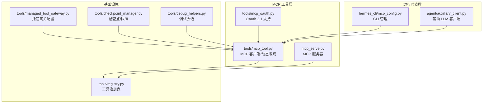
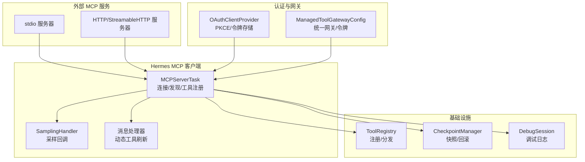
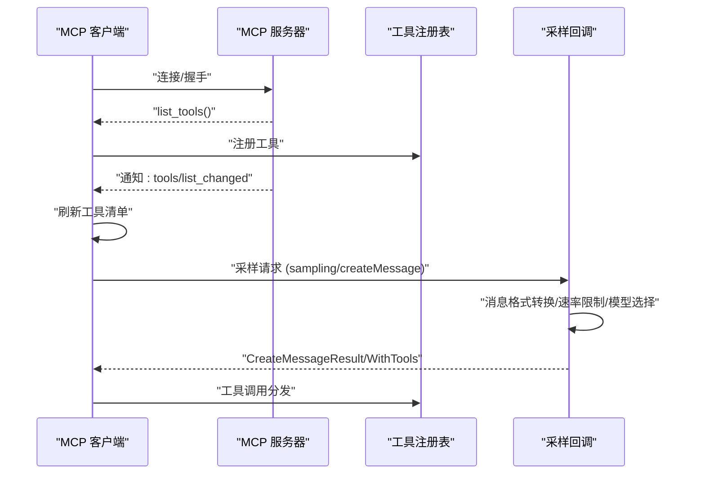
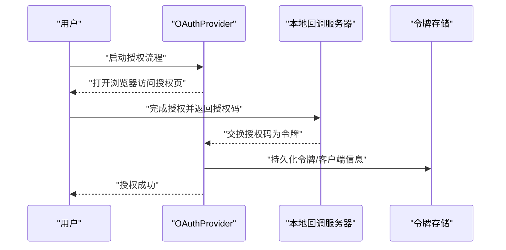
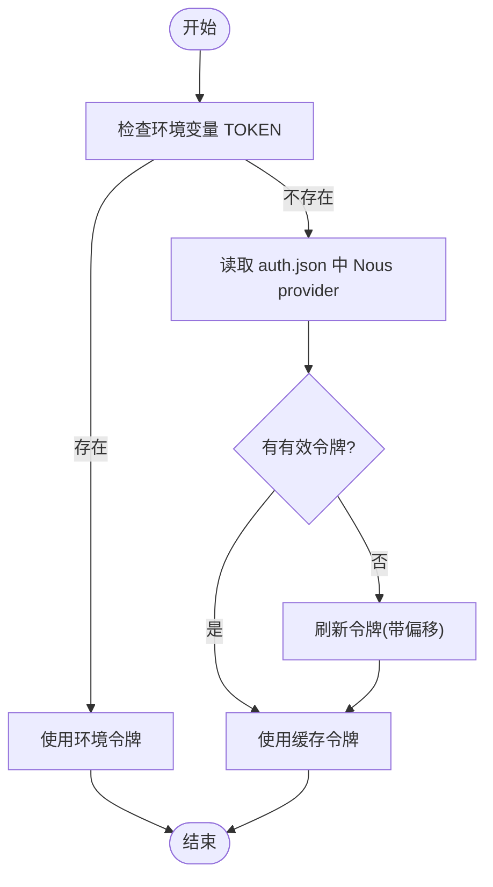
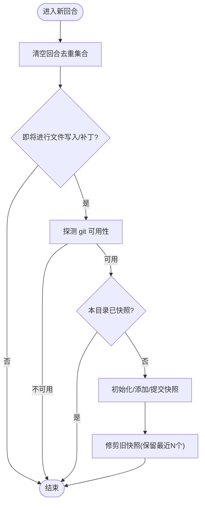
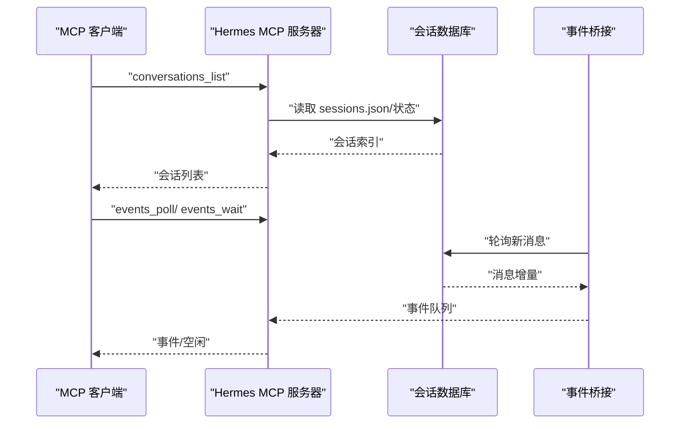
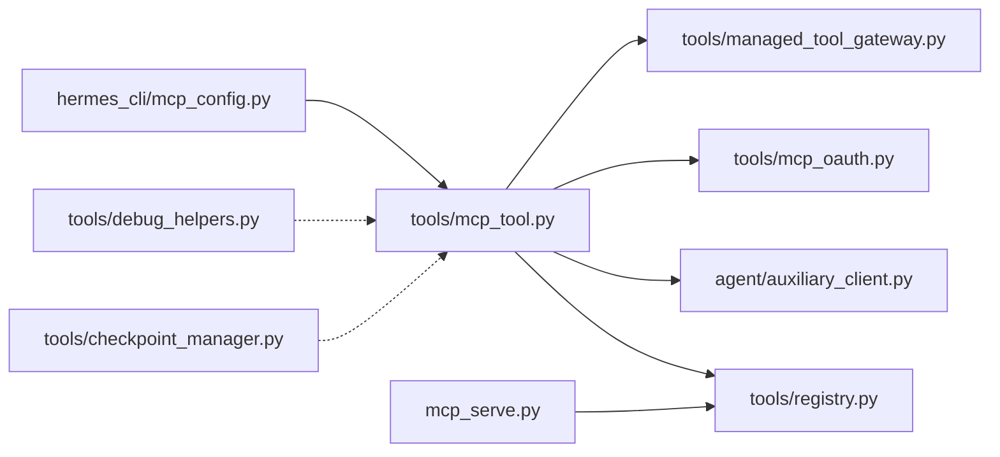

# 高级工具特性

<cite>
**本文引用的文件**
- [tools/mcp_tool.py](file://tools/mcp_tool.py)
- [tools/mcp_oauth.py](file://tools/mcp_oauth.py)
- [tools/managed_tool_gateway.py](file://tools/managed_tool_gateway.py)
- [tools/checkpoint_manager.py](file://tools/checkpoint_manager.py)
- [tools/debug_helpers.py](file://tools/debug_helpers.py)
- [tools/registry.py](file://tools/registry.py)
- [hermes_cli/mcp_config.py](file://hermes_cli/mcp_config.py)
- [mcp_serve.py](file://mcp_serve.py)
- [agent/auxiliary_client.py](file://agent/auxiliary_client.py)
</cite>

## 目录
1. [简介](#简介)
2. [项目结构](#项目结构)
3. [核心组件](#核心组件)
4. [架构总览](#架构总览)
5. [详细组件分析](#详细组件分析)
6. [依赖分析](#依赖分析)
7. [性能考量](#性能考量)
8. [故障排查指南](#故障排查指南)
9. [结论](#结论)
10. [附录](#附录)

## 简介
本技术文档聚焦于 Hermes Agent 的高级工具特性，围绕以下主题展开：MCP 工具协议实现与动态工具发现、OAuth 认证集成、托管工具网关架构与令牌管理、工具生命周期与状态持久化、检查点管理器与中断恢复、调试助手与日志记录最佳实践，以及高级工具开发的安全与性能优化建议。文档旨在帮助开发者在不深入源码的前提下快速掌握系统能力，并提供面向生产的使用与维护指南。

## 项目结构
与高级工具特性直接相关的核心模块分布如下：
- MCP 客户端与服务器：tools/mcp_tool.py、mcp_serve.py
- OAuth 支持：tools/mcp_oauth.py
- 托管工具网关：tools/managed_tool_gateway.py
- 检查点与状态持久化：tools/checkpoint_manager.py
- 调试与日志：tools/debug_helpers.py
- 工具注册表与分发：tools/registry.py
- CLI 管理：hermes_cli/mcp_config.py
- 辅助 LLM 客户端（用于 MCP 采样）：agent/auxiliary_client.py

图表来源
- [tools/mcp_tool.py:1-2187](file://tools/mcp_tool.py#L1-L2187)
- [tools/mcp_oauth.py:1-482](file://tools/mcp_oauth.py#L1-L482)
- [tools/managed_tool_gateway.py:1-168](file://tools/managed_tool_gateway.py#L1-L168)
- [tools/checkpoint_manager.py:1-549](file://tools/checkpoint_manager.py#L1-L549)
- [tools/debug_helpers.py:1-106](file://tools/debug_helpers.py#L1-L106)
- [tools/registry.py:1-321](file://tools/registry.py#L1-L321)
- [hermes_cli/mcp_config.py:1-646](file://hermes_cli/mcp_config.py#L1-L646)
- [mcp_serve.py:1-868](file://mcp_serve.py#L1-L868)
- [agent/auxiliary_client.py:1-800](file://agent/auxiliary_client.py#L1-L800)

章节来源
- [tools/mcp_tool.py:1-2187](file://tools/mcp_tool.py#L1-L2187)
- [tools/mcp_oauth.py:1-482](file://tools/mcp_oauth.py#L1-L482)
- [tools/managed_tool_gateway.py:1-168](file://tools/managed_tool_gateway.py#L1-L168)
- [tools/checkpoint_manager.py:1-549](file://tools/checkpoint_manager.py#L1-L549)
- [tools/debug_helpers.py:1-106](file://tools/debug_helpers.py#L1-L106)
- [tools/registry.py:1-321](file://tools/registry.py#L1-L321)
- [hermes_cli/mcp_config.py:1-646](file://hermes_cli/mcp_config.py#L1-L646)
- [mcp_serve.py:1-868](file://mcp_serve.py#L1-L868)
- [agent/auxiliary_client.py:1-800](file://agent/auxiliary_client.py#L1-L800)

## 核心组件
- MCP 客户端与动态发现：支持 stdio 与 HTTP/StreamableHTTP 传输，自动重连、环境变量过滤、错误信息脱敏、采样回调（server-initiated LLM 请求）、通知驱动的动态工具刷新。
- OAuth 2.1 集成：浏览器授权码流程（PKCE），本地回调服务器，令牌持久化，客户端元数据与动态注册，非交互环境提示。
- 托管工具网关：统一域名/方案解析，Nous 订阅者访问令牌读取与刷新，过期检测与回退策略。
- 工具注册表：集中式工具注册、Schema 提供、可用性检查、异步桥接、错误格式化。
- 检查点管理器：透明文件系统快照（基于 shadow git 仓库），按会话回合去重，列表/差异/回滚，文件数量限制与超大目录跳过。
- 调试助手：按工具启用的调试会话，记录调用与保存日志，暴露会话信息。
- MCP 服务器：将 Hermes 会话桥接到 MCP 工具面，提供对话列表、消息读取、附件提取、事件轮询/等待、消息发送、通道列表、权限请求等工具。
- 辅助 LLM 客户端：多提供商自动探测链，Codex Responses 适配器，Anthropic 适配器，OpenRouter/Nous/Codex/OAuth 等组合路由。

章节来源
- [tools/mcp_tool.py:1-2187](file://tools/mcp_tool.py#L1-L2187)
- [tools/mcp_oauth.py:1-482](file://tools/mcp_oauth.py#L1-L482)
- [tools/managed_tool_gateway.py:1-168](file://tools/managed_tool_gateway.py#L1-L168)
- [tools/checkpoint_manager.py:1-549](file://tools/checkpoint_manager.py#L1-L549)
- [tools/debug_helpers.py:1-106](file://tools/debug_helpers.py#L1-L106)
- [tools/registry.py:1-321](file://tools/registry.py#L1-L321)
- [mcp_serve.py:1-868](file://mcp_serve.py#L1-L868)
- [agent/auxiliary_client.py:1-800](file://agent/auxiliary_client.py#L1-L800)

## 架构总览
下图展示 MCP 工具生态的关键交互：客户端通过 stdio 或 HTTP 连接外部 MCP 服务器；服务器可主动发起采样请求；动态变更由通知触发；OAuth 用于需要用户授权的场景；托管网关提供统一访问入口；检查点保障文件操作安全；调试助手贯穿开发与运维。

图表来源
- [tools/mcp_tool.py:720-850](file://tools/mcp_tool.py#L720-L850)
- [tools/mcp_oauth.py:377-482](file://tools/mcp_oauth.py#L377-L482)
- [tools/managed_tool_gateway.py:132-168](file://tools/managed_tool_gateway.py#L132-L168)
- [tools/registry.py:45-162](file://tools/registry.py#L45-L162)
- [tools/checkpoint_manager.py:181-250](file://tools/checkpoint_manager.py#L181-L250)
- [tools/debug_helpers.py:36-106](file://tools/debug_helpers.py#L36-L106)

## 详细组件分析

### MCP 工具协议实现与动态工具发现
- 传输与连接
  - 支持 stdio 与 HTTP/StreamableHTTP 两种传输方式，自动重连（最多 5 次指数回退）。
  - 子进程环境变量白名单过滤，避免泄露敏感信息；命令解析与 PATH 补全。
- 动态工具发现
  - 基于通知类型（如 tools/list_changed）触发刷新；并发刷新受锁保护，避免竞态。
  - 刷新流程：从服务器重新拉取工具清单，原子替换注册表中的工具条目。
- 采样回调（server-initiated LLM 请求）
  - 将 MCP 服务器的采样请求转换为标准消息格式，调用辅助 LLM 客户端；支持速率限制、模型白名单、最大 tokens、工具转发、审计日志。
  - 返回 CreateMessageResult/WithTools/ErrorData，或抛出异常降级处理。
- 错误处理与可观测性
  - 连接失败信息扁平化与去重；凭证模式正则脱敏；统一异常解包以提升诊断性。
- 线程与事件循环
  - 后台事件循环线程，每个服务器任务在同一线程内进入/退出取消作用域，确保资源清理一致性。

图表来源
- [tools/mcp_tool.py:755-850](file://tools/mcp_tool.py#L755-L850)
- [tools/mcp_tool.py:349-714](file://tools/mcp_tool.py#L349-L714)
- [tools/registry.py:144-162](file://tools/registry.py#L144-L162)

章节来源
- [tools/mcp_tool.py:1-2187](file://tools/mcp_tool.py#L1-L2187)
- [tools/registry.py:1-321](file://tools/registry.py#L1-L321)

### OAuth 认证集成（浏览器授权码流程）
- 流程概览
  - 使用 OAuthClientProvider 自动完成 JWK 发现、动态客户端注册、PKCE、授权码交换、令牌刷新与逐步授权。
  - 本地回调服务器捕获授权码，支持非交互环境的超时与错误提示。
- 令牌持久化
  - 令牌与客户端信息以 JSON 文件形式存放在 HERMES_HOME/mcp-tokens 下，严格权限控制。
- 配置与兼容
  - 支持预注册 client_id/client_secret，自定义 scope、redirect_port、client_name；与 MCP SDK 版本兼容性检测。
- 安全与可用性
  - 仅在交互环境尝试打开浏览器；头等舱环境打印 URL 供手动打开；令牌过期检测与降级策略。

图表来源
- [tools/mcp_oauth.py:377-482](file://tools/mcp_oauth.py#L377-L482)
- [tools/mcp_oauth.py:286-363](file://tools/mcp_oauth.py#L286-L363)

章节来源
- [tools/mcp_oauth.py:1-482](file://tools/mcp_oauth.py#L1-L482)

### 托管工具网关架构与令牌管理
- 统一网关解析
  - 支持通过环境变量覆盖域名/方案；默认域名 nousresearch.com；vendor 对应 vendor-gateway.<domain>。
- 访问令牌读取与刷新
  - 优先读取环境变量 TOOL_GATEWAY_USER_TOKEN；否则从 auth.json 中读取 Nous provider 的 access_token，并进行过期检测与刷新（带偏移容差）。
- 可插拔构建器与读取器
  - 支持注入自定义网关 URL 构建器与令牌读取器，便于测试与扩展。

图表来源
- [tools/managed_tool_gateway.py:75-103](file://tools/managed_tool_gateway.py#L75-L103)
- [tools/managed_tool_gateway.py:117-168](file://tools/managed_tool_gateway.py#L117-L168)

章节来源
- [tools/managed_tool_gateway.py:1-168](file://tools/managed_tool_gateway.py#L1-L168)

### 工具生命周期与状态持久化
- 工具注册与分发
  - 工具模块在导入时向注册表登记；查询时根据 check_fn 决定可用性；异步工具通过桥接执行；统一错误格式化。
- 状态持久化（检查点）
  - 基于 shadow git 仓库的透明快照：工作树与对象分离，避免污染用户工程；按回合去重，限制最大快照数；支持列出、差异、回滚。
  - 文件数量上限与目录范围限制，防止大目录导致性能问题；超时与错误日志记录。

图表来源
- [tools/checkpoint_manager.py:207-250](file://tools/checkpoint_manager.py#L207-L250)
- [tools/checkpoint_manager.py:438-488](file://tools/checkpoint_manager.py#L438-L488)

章节来源
- [tools/registry.py:45-272](file://tools/registry.py#L45-L272)
- [tools/checkpoint_manager.py:1-549](file://tools/checkpoint_manager.py#L1-L549)

### MCP 服务器（将会话桥接为 MCP 工具）
- 工具集
  - conversations_list、conversation_get、messages_read、attachments_fetch、events_poll、events_wait、messages_send、channels_list、permissions_list_open、permissions_respond。
- 事件桥接
  - 基于 SQLite 会话数据库的轮询桥接，内存队列限流，支持长轮询等待；维护审批请求状态。
- 附件提取与内容解析
  - 多部分内容块、MEDIA 标签、图片 URL、文件引用等统一抽取。

图表来源
- [mcp_serve.py:431-800](file://mcp_serve.py#L431-L800)
- [mcp_serve.py:185-426](file://mcp_serve.py#L185-L426)

章节来源
- [mcp_serve.py:1-868](file://mcp_serve.py#L1-L868)

### 调试助手与日志记录最佳实践
- DebugSession
  - 通过环境变量启用；记录调用时间、工具名与参数；会话结束后输出 JSON 日志文件；提供会话信息查询接口。
- 最佳实践
  - 在开发阶段按工具开启调试；生产中关闭或限制输出；结合检查点与工具注册表定位问题；利用 MCP 采样审计日志追踪 LLM 行为。

章节来源
- [tools/debug_helpers.py:1-106](file://tools/debug_helpers.py#L1-L106)

### 辅助 LLM 客户端与 MCP 采样
- 自动探测链
  - OpenRouter → Nous Portal → 自定义端点 → Codex OAuth → 原生 Anthropic → 直连 API Key 提供商 → 无。
- Codex Responses 适配器
  - 将 chat.completions 接口映射到 Responses API，支持流式事件收集与最终响应合成；支持工具调用。
- Anthropic 适配器
  - 规范化消息与工具调用参数，输出标准化响应结构。
- MCP 采样
  - SamplingHandler 将 MCP 采样请求转换为辅助 LLM 客户端调用，支持速率限制、模型白名单、最大 tokens、工具转发与审计日志。

章节来源
- [agent/auxiliary_client.py:1-800](file://agent/auxiliary_client.py#L1-L800)
- [tools/mcp_tool.py:349-714](file://tools/mcp_tool.py#L349-L714)

## 依赖分析
- 组件耦合
  - MCP 客户端依赖注册表进行工具分发；依赖辅助 LLM 客户端执行采样；依赖 OAuth 提供商进行授权；依赖托管网关提供统一访问。
  - 检查点管理器与调试助手作为横切关注点被各工具复用。
- 外部依赖
  - MCP SDK（可选）：提供客户端、HTTP/StreamableHTTP、OAuth、采样类型与通知类型。
  - Git：用于检查点管理器的 shadow 仓库。
  - OpenAI/Anthropic/Codex：用于辅助 LLM 客户端。
- 循环依赖规避
  - 注册表不依赖具体工具模块；工具模块仅在导入时登记；CLI 与 MCP 工具模块通过延迟导入避免循环。

图表来源
- [tools/mcp_tool.py:1-2187](file://tools/mcp_tool.py#L1-L2187)
- [tools/registry.py:1-321](file://tools/registry.py#L1-L321)
- [agent/auxiliary_client.py:1-800](file://agent/auxiliary_client.py#L1-L800)
- [tools/mcp_oauth.py:1-482](file://tools/mcp_oauth.py#L1-L482)
- [tools/managed_tool_gateway.py:1-168](file://tools/managed_tool_gateway.py#L1-L168)
- [tools/checkpoint_manager.py:1-549](file://tools/checkpoint_manager.py#L1-L549)
- [tools/debug_helpers.py:1-106](file://tools/debug_helpers.py#L1-L106)
- [hermes_cli/mcp_config.py:1-646](file://hermes_cli/mcp_config.py#L1-L646)
- [mcp_serve.py:1-868](file://mcp_serve.py#L1-L868)

章节来源
- [tools/mcp_tool.py:1-2187](file://tools/mcp_tool.py#L1-L2187)
- [tools/registry.py:1-321](file://tools/registry.py#L1-L321)
- [agent/auxiliary_client.py:1-800](file://agent/auxiliary_client.py#L1-L800)
- [tools/mcp_oauth.py:1-482](file://tools/mcp_oauth.py#L1-L482)
- [tools/managed_tool_gateway.py:1-168](file://tools/managed_tool_gateway.py#L1-L168)
- [tools/checkpoint_manager.py:1-549](file://tools/checkpoint_manager.py#L1-L549)
- [tools/debug_helpers.py:1-106](file://tools/debug_helpers.py#L1-L106)
- [hermes_cli/mcp_config.py:1-646](file://hermes_cli/mcp_config.py#L1-L646)
- [mcp_serve.py:1-868](file://mcp_serve.py#L1-L868)

## 性能考量
- MCP 连接与采样
  - 采样回调采用线程池执行同步 LLM 调用，避免阻塞事件循环；速率限制滑动窗口实现；最大 tokens 与工具转发减少无效往返。
- 检查点
  - 文件数量上限与目录范围限制；git 超时可配置；首次初始化与排除规则减少开销。
- 事件桥接
  - mtime 缓存与增量轮询，降低数据库压力；队列长度限制与游标推进。
- 辅助 LLM 客户端
  - 多提供商自动探测链，遇 402/余额耗尽自动降级；Codex Responses 适配器合并流事件，避免空输出。

## 故障排查指南
- MCP 连接失败
  - 使用 hermes mcp test 快速验证传输、认证与工具发现；查看连接错误扁平化信息与缺失可执行文件提示。
- OAuth 授权失败
  - 检查本地回调端口占用与浏览器打开情况；确认非交互环境下的令牌缓存；必要时删除存储的令牌重新授权。
- 采样超时/无响应
  - 调整采样超时与最大 tokens；检查模型白名单与速率限制；核对工具转发是否正确。
- 检查点无法生成
  - 确认 git 可用；避免对根目录/家目录等过大范围快照；检查文件数量上限与排除规则。
- 调试日志
  - 开启工具调试后，查看 logs 目录中的 JSON 日志文件；结合会话信息定位问题。

章节来源
- [hermes_cli/mcp_config.py:440-501](file://hermes_cli/mcp_config.py#L440-L501)
- [tools/mcp_oauth.py:312-363](file://tools/mcp_oauth.py#L312-L363)
- [tools/mcp_tool.py:270-328](file://tools/mcp_tool.py#L270-L328)
- [tools/checkpoint_manager.py:90-134](file://tools/checkpoint_manager.py#L90-L134)
- [tools/debug_helpers.py:70-90](file://tools/debug_helpers.py#L70-L90)

## 结论
Hermes Agent 的高级工具特性以 MCP 协议为核心，结合 OAuth 授权、托管网关、检查点与调试设施，构建了安全、可观测且可扩展的工具生态。通过动态工具发现与采样回调，系统实现了与外部工具的无缝集成；通过严格的令牌管理与网关抽象，保障了跨供应商的一致访问体验；通过检查点与调试助手，提升了开发与运维效率。建议在生产环境中合理配置超时与速率限制，启用调试日志与审计日志，并定期审查工具可用性与令牌状态。

## 附录
- 高级工具开发要点
  - 使用工具注册表进行统一登记与分发；遵循 check_fn 与 requires_env 的可用性声明。
  - 对外暴露的工具需返回 JSON 字符串；错误统一使用 tool_error；结果使用 tool_result。
  - 若涉及外部网络或文件系统，务必结合检查点管理器进行幂等与可回滚设计。
- 安全考虑
  - 严格过滤 stdio 子进程环境变量；对错误信息进行凭证模式脱敏。
  - OAuth 令牌存储采用受限权限文件；非交互环境需明确提示与降级策略。
- 性能优化建议
  - 控制 MCP 采样频率与 tokens；限制检查点目录范围；使用 mtime 缓存与增量轮询；避免在热路径上进行昂贵的 IO 操作。