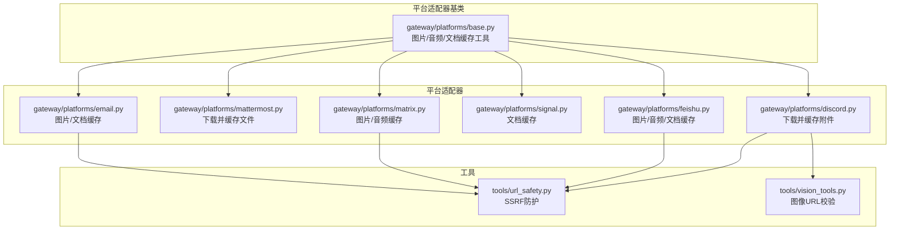
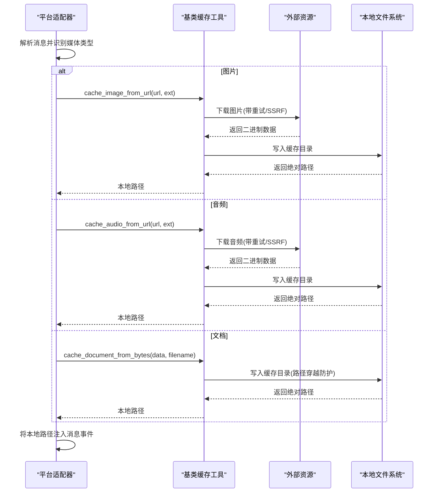
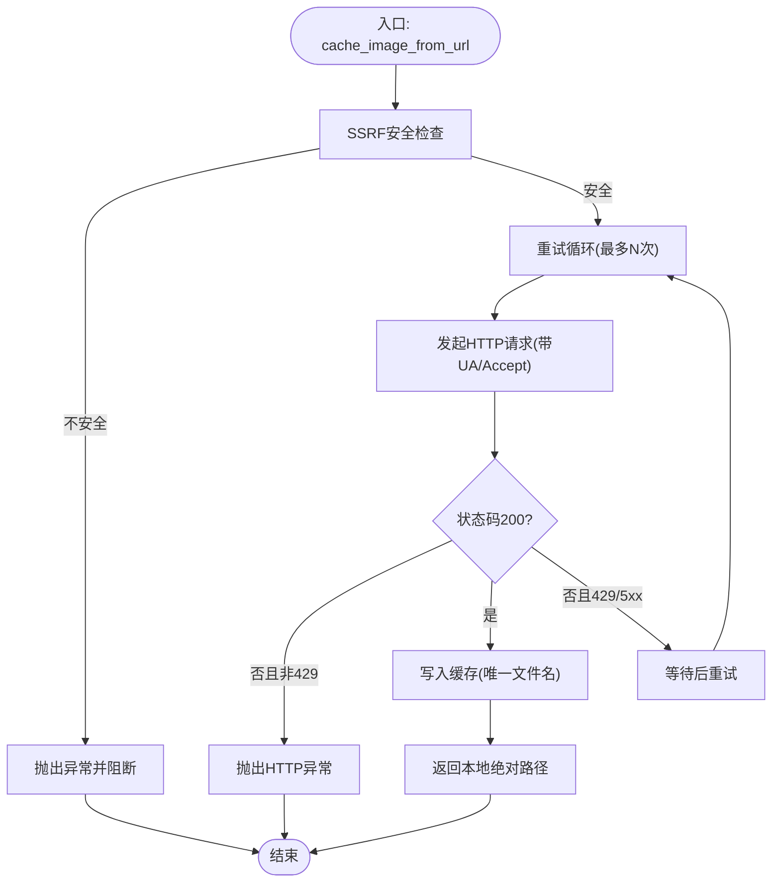
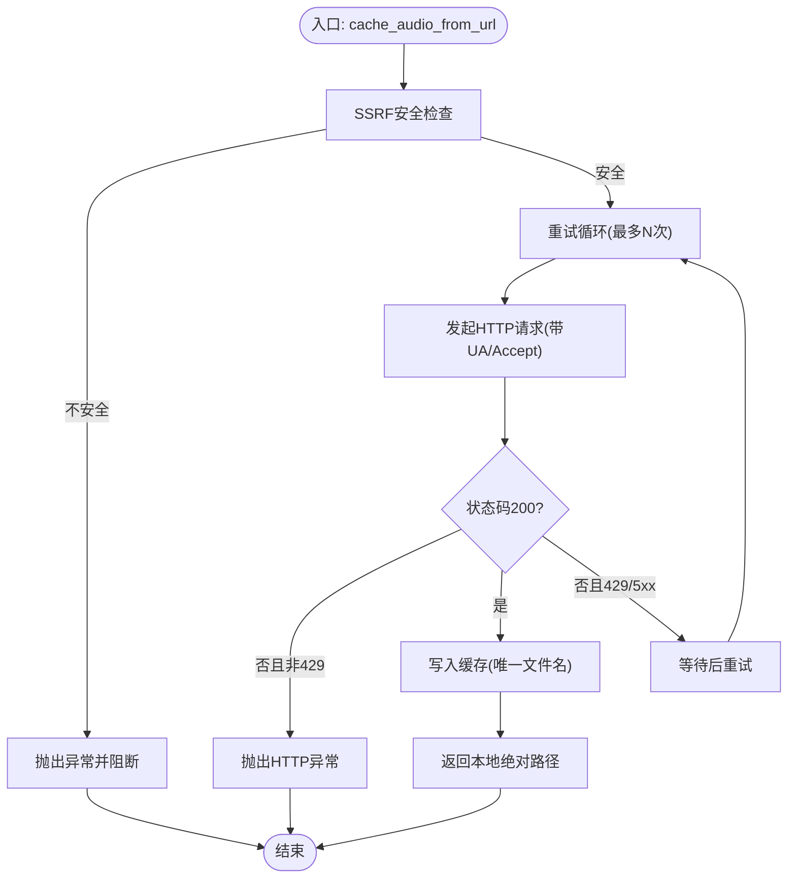
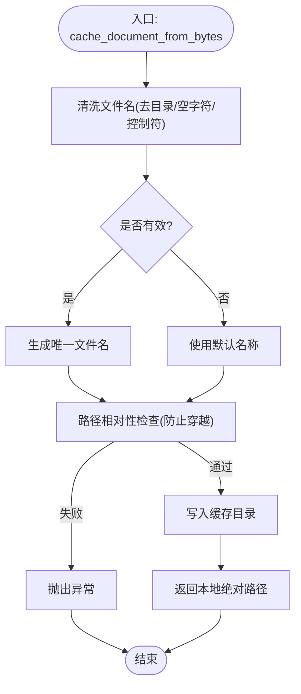
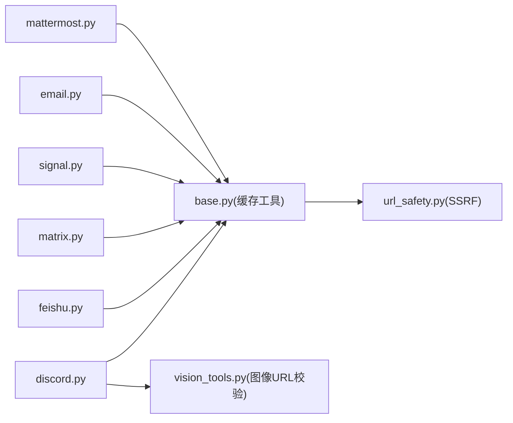

# 媒体处理机制

<cite>
**本文引用的文件**
- [gateway/platforms/base.py](file://gateway/platforms/base.py)
- [gateway/platforms/discord.py](file://gateway/platforms/discord.py)
- [gateway/platforms/mattermost.py](file://gateway/platforms/mattermost.py)
- [gateway/platforms/email.py](file://gateway/platforms/email.py)
- [gateway/platforms/feishu.py](file://gateway/platforms/feishu.py)
- [gateway/platforms/signal.py](file://gateway/platforms/signal.py)
- [gateway/platforms/matrix.py](file://gateway/platforms/matrix.py)
- [tools/url_safety.py](file://tools/url_safety.py)
- [tools/vision_tools.py](file://tools/vision_tools.py)
- [tests/gateway/test_document_cache.py](file://tests/gateway/test_document_cache.py)
- [tests/tools/test_url_safety.py](file://tests/tools/test_url_safety.py)
- [tests/tools/test_vision_tools.py](file://tests/tools/test_vision_tools.py)
- [gateway/sticker_cache.py](file://gateway/sticker_cache.py)
</cite>

## 目录
1. [简介](#简介)
2. [项目结构](#项目结构)
3. [核心组件](#核心组件)
4. [架构总览](#架构总览)
5. [详细组件分析](#详细组件分析)
6. [依赖分析](#依赖分析)
7. [性能考量](#性能考量)
8. [故障排除指南](#故障排除指南)
9. [结论](#结论)
10. [附录](#附录)

## 简介
本文件面向Hermes Agent平台适配器的媒体处理机制，系统化阐述图片缓存、音频缓存与文档缓存的实现原理与使用方法，覆盖安全性检查（SSRF防护）、缓存清理策略、URL验证机制、平台间传输方式、格式转换与大小限制等技术细节，并提供使用示例与性能优化建议。

## 项目结构
媒体处理能力主要由“平台适配器基类”提供通用缓存工具，各具体平台（如Discord、Mattermost、飞书、Signal、Matrix、邮件）在消息解析阶段调用这些工具完成本地缓存与后续处理。

图表来源
- [gateway/platforms/base.py:76-377](file://gateway/platforms/base.py#L76-L377)
- [gateway/platforms/discord.py:2300-2405](file://gateway/platforms/discord.py#L2300-L2405)
- [gateway/platforms/mattermost.py:678-701](file://gateway/platforms/mattermost.py#L678-L701)
- [gateway/platforms/feishu.py:2102-2132](file://gateway/platforms/feishu.py#L2102-L2132)
- [gateway/platforms/signal.py:578-578](file://gateway/platforms/signal.py#L578-L578)
- [gateway/platforms/matrix.py:1222-1244](file://gateway/platforms/matrix.py#L1222-L1244)
- [gateway/platforms/email.py:197-205](file://gateway/platforms/email.py#L197-L205)
- [tools/url_safety.py:50-97](file://tools/url_safety.py#L50-L97)
- [tools/vision_tools.py:82-123](file://tools/vision_tools.py#L82-L123)

章节来源
- [gateway/platforms/base.py:76-377](file://gateway/platforms/base.py#L76-L377)
- [gateway/platforms/discord.py:2300-2405](file://gateway/platforms/discord.py#L2300-L2405)
- [gateway/platforms/mattermost.py:678-701](file://gateway/platforms/mattermost.py#L678-L701)
- [gateway/platforms/feishu.py:2102-2132](file://gateway/platforms/feishu.py#L2102-L2132)
- [gateway/platforms/signal.py:578-578](file://gateway/platforms/signal.py#L578-L578)
- [gateway/platforms/matrix.py:1222-1244](file://gateway/platforms/matrix.py#L1222-L1244)
- [gateway/platforms/email.py:197-205](file://gateway/platforms/email.py#L197-L205)
- [tools/url_safety.py:50-97](file://tools/url_safety.py#L50-L97)
- [tools/vision_tools.py:82-123](file://tools/vision_tools.py#L82-L123)

## 核心组件
- 图片缓存：提供从字节与URL下载并缓存图片的能力，返回本地绝对路径；支持重试与SSRF防护。
- 音频缓存：提供从字节与URL下载并缓存音频的能力，返回本地绝对路径；支持重试与SSRF防护。
- 文档缓存：提供从字节缓存文档的能力，保留原始文件名并进行路径穿越防护；支持按时间清理。
- 安全性：通过URL安全检查阻断私有/内部网络地址；对图像URL进行额外校验。
- 平台集成：各平台在消息解析时根据内容类型选择对应缓存函数，并将本地路径注入消息事件。

章节来源
- [gateway/platforms/base.py:76-377](file://gateway/platforms/base.py#L76-L377)
- [tools/url_safety.py:50-97](file://tools/url_safety.py#L50-L97)
- [tools/vision_tools.py:82-123](file://tools/vision_tools.py#L82-L123)

## 架构总览
媒体处理在平台适配器中遵循统一流程：解析消息→识别媒体类型→调用对应缓存函数→写入本地缓存→将本地路径加入消息事件→交由上层逻辑处理。

图表来源
- [gateway/platforms/base.py:113-171](file://gateway/platforms/base.py#L113-L171)
- [gateway/platforms/base.py:228-285](file://gateway/platforms/base.py#L228-L285)
- [gateway/platforms/base.py:314-343](file://gateway/platforms/base.py#L314-L343)
- [gateway/platforms/discord.py:2317-2384](file://gateway/platforms/discord.py#L2317-L2384)

## 详细组件分析

### 图片缓存系统
- 功能要点
  - 从URL下载图片并缓存：支持重试与指数回退，避免CDN抖动导致失败；对429/5xx等瞬时错误自动重试。
  - 从字节缓存：直接写入缓存目录，生成唯一文件名。
  - SSRF防护：在下载前调用URL安全检查，拒绝私有/内部网络地址。
  - 清理策略：按修改时间清理超期文件，默认保留24小时。
- 关键实现位置
  - URL下载与重试：[gateway/platforms/base.py:113-171](file://gateway/platforms/base.py#L113-L171)
  - 字节写入：[gateway/platforms/base.py:95-110](file://gateway/platforms/base.py#L95-L110)
  - 清理函数：[gateway/platforms/base.py:173-191](file://gateway/platforms/base.py#L173-L191)
  - 平台调用示例：Discord图片缓存调用链见[gateway/platforms/discord.py:2317-2333](file://gateway/platforms/discord.py#L2317-L2333)、飞书图片缓存见[gateway/platforms/feishu.py:2102-2102](file://gateway/platforms/feishu.py#L2102-L2102)、Matrix图片缓存见[gateway/platforms/matrix.py:1235-1235](file://gateway/platforms/matrix.py#L1235-L1235)、邮件图片缓存见[gateway/platforms/email.py:197-197](file://gateway/platforms/email.py#L197-L197)、Mattermost图片缓存见[gateway/platforms/mattermost.py:690-693](file://gateway/platforms/mattermost.py#L690-L693)。
- 安全与验证
  - URL安全检查：[tools/url_safety.py:50-97](file://tools/url_safety.py#L50-L97)
  - 图像URL额外校验（是否为图像）：[tools/vision_tools.py:82-123](file://tools/vision_tools.py#L82-L123)

图表来源
- [gateway/platforms/base.py:113-171](file://gateway/platforms/base.py#L113-L171)
- [tools/url_safety.py:50-97](file://tools/url_safety.py#L50-L97)

章节来源
- [gateway/platforms/base.py:76-191](file://gateway/platforms/base.py#L76-L191)
- [gateway/platforms/discord.py:2317-2333](file://gateway/platforms/discord.py#L2317-L2333)
- [gateway/platforms/feishu.py:2102-2102](file://gateway/platforms/feishu.py#L2102-L2102)
- [gateway/platforms/matrix.py:1235-1235](file://gateway/platforms/matrix.py#L1235-L1235)
- [gateway/platforms/email.py:197-197](file://gateway/platforms/email.py#L197-L197)
- [gateway/platforms/mattermost.py:690-693](file://gateway/platforms/mattermost.py#L690-L693)
- [tools/url_safety.py:50-97](file://tools/url_safety.py#L50-L97)
- [tools/vision_tools.py:82-123](file://tools/vision_tools.py#L82-L123)

### 音频缓存系统
- 功能要点
  - 从URL下载音频并缓存：与图片一致的重试与SSRF防护策略。
  - 从字节缓存：直接写入缓存目录，生成唯一文件名。
  - 清理策略：按修改时间清理超期文件，默认保留24小时。
- 关键实现位置
  - URL下载与重试：[gateway/platforms/base.py:228-285](file://gateway/platforms/base.py#L228-L285)
  - 字节写入：[gateway/platforms/base.py:210-225](file://gateway/platforms/base.py#L210-L225)
  - 清理函数：[gateway/platforms/base.py:346-364](file://gateway/platforms/base.py#L346-L364)
  - 平台调用示例：Discord音频缓存调用链见[gateway/platforms/discord.py:2334-2346](file://gateway/platforms/discord.py#L2334-L2346)、飞书音频缓存见[gateway/platforms/feishu.py:2598-2598](file://gateway/platforms/feishu.py#L2598-L2598)、Matrix音频缓存见[gateway/platforms/matrix.py:1239-1239](file://gateway/platforms/matrix.py#L1239-L1239)。

图表来源
- [gateway/platforms/base.py:228-285](file://gateway/platforms/base.py#L228-L285)
- [tools/url_safety.py:50-97](file://tools/url_safety.py#L50-L97)

章节来源
- [gateway/platforms/base.py:194-285](file://gateway/platforms/base.py#L194-L285)
- [gateway/platforms/discord.py:2334-2346](file://gateway/platforms/discord.py#L2334-L2346)
- [gateway/platforms/feishu.py:2598-2598](file://gateway/platforms/feishu.py#L2598-L2598)
- [gateway/platforms/matrix.py:1239-1239](file://gateway/platforms/matrix.py#L1239-L1239)

### 文档缓存系统
- 功能要点
  - 从字节缓存：接收原始字节与原始文件名，进行路径穿越防护，生成唯一文件名并写入缓存目录。
  - 支持类型：PDF、Markdown、纯文本、ZIP、DOCX、XLSX、PPTX。
  - 清理策略：按修改时间清理超期文件，默认保留24小时。
- 关键实现位置
  - 缓存函数与路径穿越防护：[gateway/platforms/base.py:314-343](file://gateway/platforms/base.py#L314-L343)
  - 类型映射：[gateway/platforms/base.py:297-305](file://gateway/platforms/base.py#L297-L305)
  - 清理函数：[gateway/platforms/base.py:346-364](file://gateway/platforms/base.py#L346-L364)
  - 平台调用示例：Discord文档缓存调用链见[gateway/platforms/discord.py:2362-2384](file://gateway/platforms/discord.py#L2362-L2384)、飞书文档缓存见[gateway/platforms/feishu.py:2132-2132](file://gateway/platforms/feishu.py#L2132-L2132)、Signal文档缓存见[gateway/platforms/signal.py:578-578](file://gateway/platforms/signal.py#L578-L578)、Matrix文档缓存见[gateway/platforms/matrix.py:1244-1244](file://gateway/platforms/matrix.py#L1244-L1244)、邮件文档缓存见[gateway/platforms/email.py:205-205](file://gateway/platforms/email.py#L205-L205)、Mattermost文档缓存见[gateway/platforms/mattermost.py:700-700](file://gateway/platforms/mattermost.py#L700-L700)。
- 测试覆盖
  - 文档缓存功能与路径穿越防护：[tests/gateway/test_document_cache.py:54-100](file://tests/gateway/test_document_cache.py#L54-L100)
  - 类型映射正确性：[tests/gateway/test_document_cache.py:146-158](file://tests/gateway/test_document_cache.py#L146-L158)

图表来源
- [gateway/platforms/base.py:314-343](file://gateway/platforms/base.py#L314-L343)
- [tests/gateway/test_document_cache.py:74-84](file://tests/gateway/test_document_cache.py#L74-L84)

章节来源
- [gateway/platforms/base.py:288-364](file://gateway/platforms/base.py#L288-L364)
- [gateway/platforms/discord.py:2362-2384](file://gateway/platforms/discord.py#L2362-L2384)
- [gateway/platforms/feishu.py:2132-2132](file://gateway/platforms/feishu.py#L2132-L2132)
- [gateway/platforms/signal.py:578-578](file://gateway/platforms/signal.py#L578-L578)
- [gateway/platforms/matrix.py:1244-1244](file://gateway/platforms/matrix.py#L1244-L1244)
- [gateway/platforms/email.py:205-205](file://gateway/platforms/email.py#L205-L205)
- [gateway/platforms/mattermost.py:700-700](file://gateway/platforms/mattermost.py#L700-L700)
- [tests/gateway/test_document_cache.py:54-100](file://tests/gateway/test_document_cache.py#L54-L100)

### 平台间传输与格式转换
- 传输方式
  - 平台侧：将附件/文件以CDN链接形式下发至适配器；适配器下载到本地缓存后再交给上层工具处理。
  - 本地路径：所有媒体最终以本地绝对路径形式注入消息事件，便于后续工具（如视觉/语音）直接访问。
- 格式转换
  - 图片：根据内容类型推导扩展名，若未知则回退为常见格式。
  - 音频：根据内容类型推导扩展名，若未知则回退为常见格式。
  - 文档：根据扩展名或MIME映射确定类型，仅支持白名单类型。
- 大小限制
  - 文档：Discord侧设置最大20MB，超限跳过并记录告警。
  - 图片/音频：未见硬性大小限制，但受缓存目录空间与内存影响，建议结合实际环境评估。
- 示例
  - Discord图片/音频/文档处理链路：[gateway/platforms/discord.py:2317-2405](file://gateway/platforms/discord.py#L2317-L2405)
  - 飞书图片/音频/文档处理链路：[gateway/platforms/feishu.py:2102-2132](file://gateway/platforms/feishu.py#L2102-L2132)、[gateway/platforms/feishu.py:2598-2611](file://gateway/platforms/feishu.py#L2598-L2611)
  - Matrix图片/音频/文档处理链路：[gateway/platforms/matrix.py:1235-1244](file://gateway/platforms/matrix.py#L1235-L1244)
  - Signal文档处理链路：[gateway/platforms/signal.py:578-578](file://gateway/platforms/signal.py#L578-L578)
  - 邮件图片/文档处理链路：[gateway/platforms/email.py:197-205](file://gateway/platforms/email.py#L197-L205)

章节来源
- [gateway/platforms/discord.py:2317-2405](file://gateway/platforms/discord.py#L2317-L2405)
- [gateway/platforms/feishu.py:2102-2132](file://gateway/platforms/feishu.py#L2102-L2132)
- [gateway/platforms/feishu.py:2598-2611](file://gateway/platforms/feishu.py#L2598-L2611)
- [gateway/platforms/matrix.py:1235-1244](file://gateway/platforms/matrix.py#L1235-L1244)
- [gateway/platforms/signal.py:578-578](file://gateway/platforms/signal.py#L578-L578)
- [gateway/platforms/email.py:197-205](file://gateway/platforms/email.py#L197-L205)

### 安全性检查与URL验证机制
- SSRF防护
  - 统一入口：URL安全检查函数，基于主机名解析IP并判断是否属于私有/内部范围。
  - 生效范围：图片/音频URL下载前均会执行该检查；图像URL在视觉工具中也有额外校验。
- URL验证
  - 图像URL：要求HTTP/HTTPS、具备网络位置，且通过SSRF检查；支持无扩展CDN端点。
- 测试覆盖
  - URL安全检查：[tests/tools/test_url_safety.py:12-42](file://tests/tools/test_url_safety.py#L12-L42)
  - 视觉工具图像URL校验：[tests/tools/test_vision_tools.py:40-73](file://tests/tools/test_vision_tools.py#L40-L73)

章节来源
- [tools/url_safety.py:50-97](file://tools/url_safety.py#L50-L97)
- [tools/vision_tools.py:82-123](file://tools/vision_tools.py#L82-L123)
- [tests/tools/test_url_safety.py:12-42](file://tests/tools/test_url_safety.py#L12-L42)
- [tests/tools/test_vision_tools.py:40-73](file://tests/tools/test_vision_tools.py#L40-L73)

### 缓存清理策略
- 图片缓存清理：按修改时间删除超期文件，默认保留24小时。
- 音频缓存清理：按修改时间删除超期文件，默认保留24小时。
- 文档缓存清理：按修改时间删除超期文件，默认保留24小时。
- 使用建议：可结合平台负载与磁盘空间定期运行清理任务，避免缓存膨胀。

章节来源
- [gateway/platforms/base.py:173-191](file://gateway/platforms/base.py#L173-L191)
- [gateway/platforms/base.py:288-364](file://gateway/platforms/base.py#L288-L364)

### 具体使用示例
- 在平台适配器中调用缓存函数
  - 图片：[gateway/platforms/discord.py:2319-2333](file://gateway/platforms/discord.py#L2319-L2333)、[gateway/platforms/feishu.py:2102-2102](file://gateway/platforms/feishu.py#L2102-L2102)、[gateway/platforms/matrix.py:1235-1235](file://gateway/platforms/matrix.py#L1235-L1235)
  - 音频：[gateway/platforms/discord.py:2334-2346](file://gateway/platforms/discord.py#L2334-L2346)、[gateway/platforms/feishu.py:2598-2598](file://gateway/platforms/feishu.py#L2598-L2598)、[gateway/platforms/matrix.py:1239-1239](file://gateway/platforms/matrix.py#L1239-L1239)
  - 文档：[gateway/platforms/discord.py:2362-2384](file://gateway/platforms/discord.py#L2362-L2384)、[gateway/platforms/feishu.py:2132-2132](file://gateway/platforms/feishu.py#L2132-L2132)、[gateway/platforms/signal.py:578-578](file://gateway/platforms/signal.py#L578-L578)
- 在消息事件中注入媒体路径
  - 所有平台均将本地路径写入消息事件的媒体列表，供上层工具使用：[gateway/platforms/discord.py:2415-2425](file://gateway/platforms/discord.py#L2415-L2425)

章节来源
- [gateway/platforms/discord.py:2317-2425](file://gateway/platforms/discord.py#L2317-L2425)
- [gateway/platforms/feishu.py:2102-2132](file://gateway/platforms/feishu.py#L2102-L2132)
- [gateway/platforms/matrix.py:1235-1239](file://gateway/platforms/matrix.py#L1235-L1239)
- [gateway/platforms/signal.py:578-578](file://gateway/platforms/signal.py#L578-L578)

## 依赖分析
- 组件耦合
  - 平台适配器依赖基类提供的缓存工具，耦合度低、内聚性强。
  - URL安全检查作为横切关注点，被图片/音频缓存与视觉工具共同依赖。
- 外部依赖
  - HTTP客户端：图片/音频缓存使用异步HTTP客户端进行下载与重试。
  - 文件系统：所有缓存均写入本地目录，需确保磁盘权限与容量。
- 潜在风险
  - 平台侧附件过大可能导致内存压力，应结合大小限制与清理策略。
  - CDN抖动可能触发重试，需合理配置重试次数与等待时间。

图表来源
- [gateway/platforms/discord.py:2317-2384](file://gateway/platforms/discord.py#L2317-L2384)
- [gateway/platforms/feishu.py:2102-2132](file://gateway/platforms/feishu.py#L2102-L2132)
- [gateway/platforms/matrix.py:1235-1244](file://gateway/platforms/matrix.py#L1235-L1244)
- [gateway/platforms/signal.py:578-578](file://gateway/platforms/signal.py#L578-L578)
- [gateway/platforms/email.py:197-205](file://gateway/platforms/email.py#L197-L205)
- [gateway/platforms/mattermost.py:690-700](file://gateway/platforms/mattermost.py#L690-L700)
- [gateway/platforms/base.py:113-171](file://gateway/platforms/base.py#L113-L171)
- [tools/url_safety.py:50-97](file://tools/url_safety.py#L50-L97)
- [tools/vision_tools.py:82-123](file://tools/vision_tools.py#L82-L123)

章节来源
- [gateway/platforms/base.py:76-377](file://gateway/platforms/base.py#L76-L377)
- [tools/url_safety.py:50-97](file://tools/url_safety.py#L50-L97)
- [tools/vision_tools.py:82-123](file://tools/vision_tools.py#L82-L123)

## 性能考量
- 重试策略
  - 图片/音频缓存采用指数回退等待，降低CDN拥塞风险，提升成功率。
- 并发与批处理
  - 平台适配器对快速连续的媒体消息进行批处理合并，减少重复处理开销。
- 存储与清理
  - 定期清理超期缓存，避免磁盘占用持续增长；建议结合监控与告警。
- 传输优化
  - 优先使用本地路径而非网络URL，避免二次下载与网络抖动影响。

## 故障排除指南
- SSRF拦截
  - 现象：下载失败并提示被阻断。
  - 排查：确认URL是否指向私有/内部网络；检查DNS解析结果。
  - 参考：[tools/url_safety.py:50-97](file://tools/url_safety.py#L50-L97)
- 路径穿越
  - 现象：缓存失败并提示路径穿越被拒绝。
  - 排查：检查原始文件名是否包含目录分隔符或控制字符。
  - 参考：[gateway/platforms/base.py:332-342](file://gateway/platforms/base.py#L332-L342)、[tests/gateway/test_document_cache.py:74-84](file://tests/gateway/test_document_cache.py#L74-L84)
- 文档类型不受支持
  - 现象：日志警告“不受支持的文档类型”，跳过处理。
  - 排查：确认扩展名或MIME是否在支持列表中。
  - 参考：[gateway/platforms/discord.py:2356-2360](file://gateway/platforms/discord.py#L2356-L2360)、[gateway/platforms/base.py:297-305](file://gateway/platforms/base.py#L297-L305)
- 文档过大
  - 现象：日志警告“文档过大”，跳过处理。
  - 排查：确认附件大小是否超过平台限制。
  - 参考：[gateway/platforms/discord.py:2362-2367](file://gateway/platforms/discord.py#L2362-L2367)
- 图像URL无效
  - 现象：图像URL校验失败。
  - 排查：确认URL协议、网络位置与SSRF检查结果。
  - 参考：[tools/vision_tools.py:82-123](file://tools/vision_tools.py#L82-L123)、[tests/tools/test_vision_tools.py:40-73](file://tests/tools/test_vision_tools.py#L40-L73)

章节来源
- [tools/url_safety.py:50-97](file://tools/url_safety.py#L50-L97)
- [gateway/platforms/base.py:332-342](file://gateway/platforms/base.py#L332-L342)
- [tests/gateway/test_document_cache.py:74-84](file://tests/gateway/test_document_cache.py#L74-L84)
- [gateway/platforms/discord.py:2356-2367](file://gateway/platforms/discord.py#L2356-L2367)
- [tools/vision_tools.py:82-123](file://tools/vision_tools.py#L82-L123)
- [tests/tools/test_vision_tools.py:40-73](file://tests/tools/test_vision_tools.py#L40-L73)

## 结论
Hermes Agent的媒体处理机制通过统一的缓存工具与严格的SSRF防护，在多平台适配器中实现了稳定、可扩展的图片、音频与文档处理能力。配合重试与清理策略，能够在复杂网络环境下保持高可用与高性能。建议在生产环境中结合监控与告警，定期清理缓存并评估平台侧大小限制，确保系统长期稳定运行。

## 附录
- 相关测试
  - 文档缓存：[tests/gateway/test_document_cache.py:1-158](file://tests/gateway/test_document_cache.py#L1-L158)
  - URL安全检查：[tests/tools/test_url_safety.py:1-42](file://tests/tools/test_url_safety.py#L1-L42)
  - 视觉工具图像URL校验：[tests/tools/test_vision_tools.py:40-73](file://tests/tools/test_vision_tools.py#L40-L73)
- 其他缓存
  - 贴图描述缓存：[gateway/sticker_cache.py:1-112](file://gateway/sticker_cache.py#L1-L112)