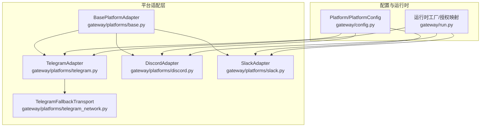
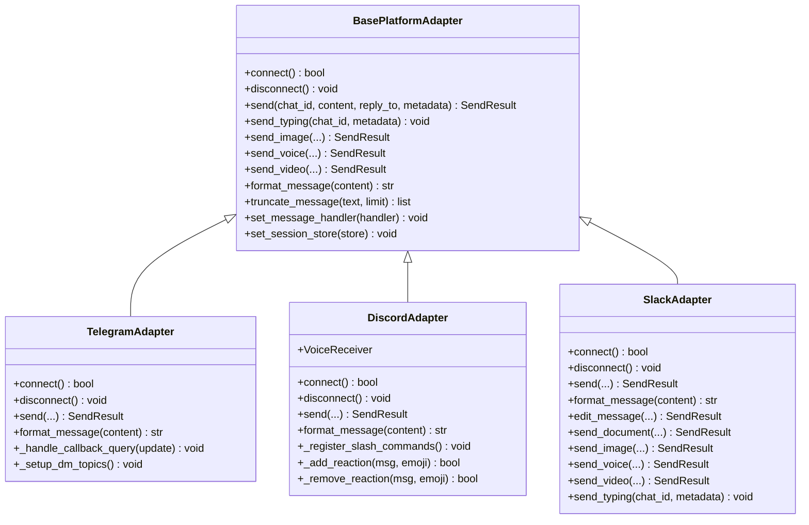
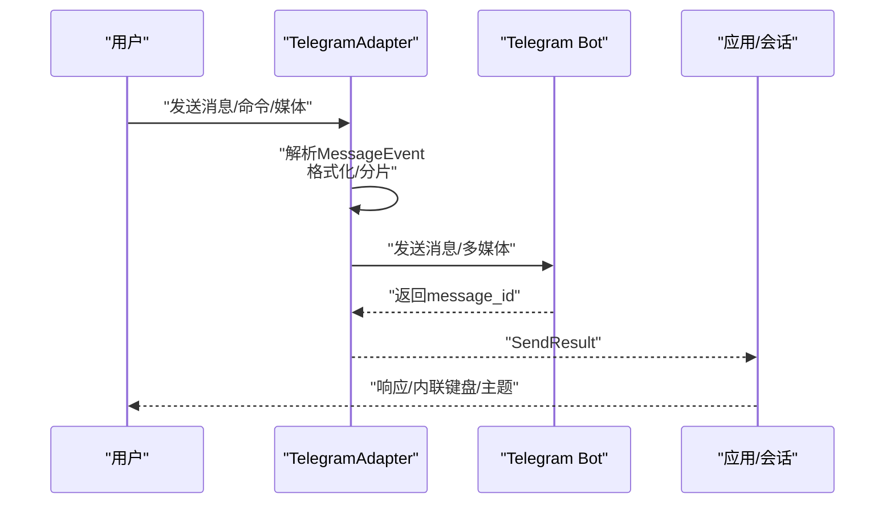
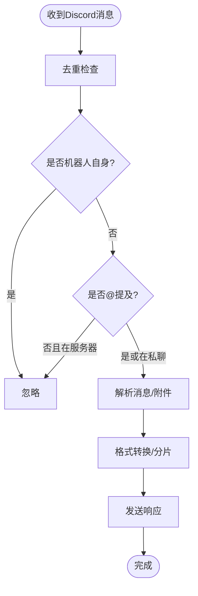
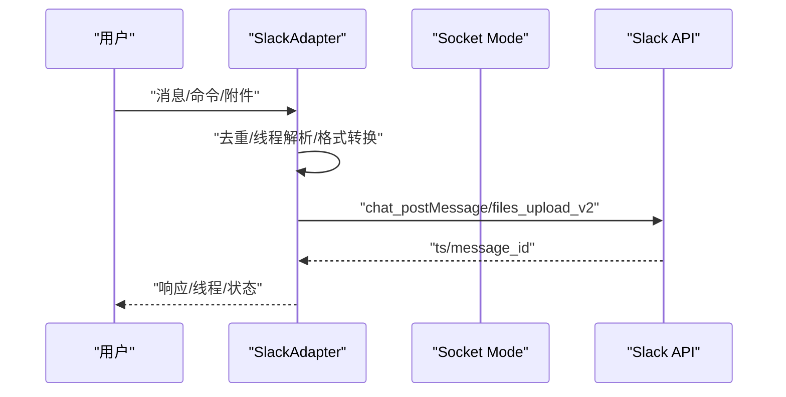
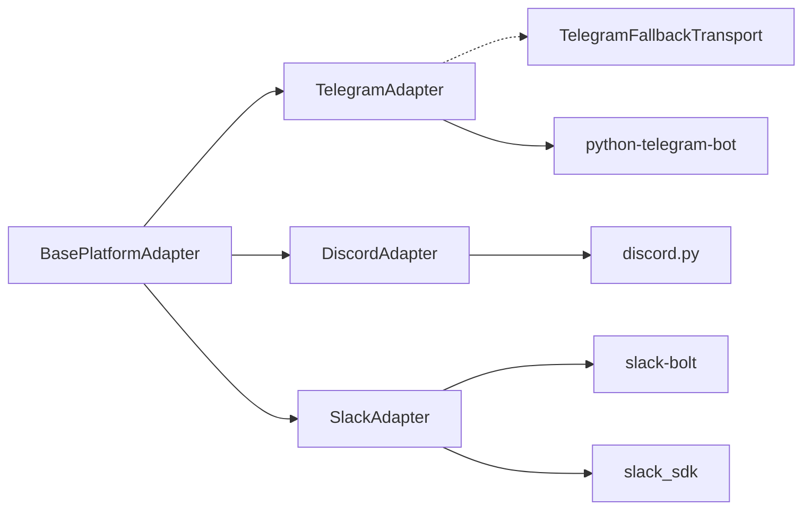

# 平台实现示例

<cite>
**本文档引用的文件**
- [gateway/platforms/telegram.py](file://gateway/platforms/telegram.py)
- [gateway/platforms/discord.py](file://gateway/platforms/discord.py)
- [gateway/platforms/slack.py](file://gateway/platforms/slack.py)
- [gateway/platforms/base.py](file://gateway/platforms/base.py)
- [gateway/platforms/telegram_network.py](file://gateway/platforms/telegram_network.py)
- [gateway/platforms/ADDING_A_PLATFORM.md](file://gateway/platforms/ADDING_A_PLATFORM.md)
- [gateway/config.py](file://gateway/config.py)
- [tests/gateway/test_slack.py](file://tests/gateway/test_slack.py)
</cite>

## 目录
1. [简介](#简介)
2. [项目结构](#项目结构)
3. [核心组件](#核心组件)
4. [架构总览](#架构总览)
5. [详细组件分析](#详细组件分析)
6. [依赖分析](#依赖分析)
7. [性能考量](#性能考量)
8. [故障排查指南](#故障排查指南)
9. [结论](#结论)
10. [附录](#附录)

## 简介
本文件面向Hermes Agent平台适配器实现，聚焦Telegram、Discord、Slack三大平台的适配器设计与实现细节。内容涵盖：
- 平台特定API集成方式与认证流程
- 消息格式转换策略（Markdown到平台原生格式）
- 特殊功能实现：Telegram内联键盘、Discord嵌入消息、Slack线程支持
- 平台差异处理策略、兼容性考虑与最佳实践
- 具体代码示例路径与配置指南
- 平台API限制、速率限制与错误处理方案

## 项目结构
平台适配器位于gateway/platforms目录下，统一继承自基类，按平台拆分文件：
- 基类与通用能力：gateway/platforms/base.py
- 平台实现：telegram.py、discord.py、slack.py
- Telegram专用网络增强：telegram_network.py
- 新平台接入清单：gateway/platforms/ADDING_A_PLATFORM.md
- 配置模型：gateway/config.py

图表来源
- [gateway/platforms/base.py:470-800](file://gateway/platforms/base.py#L470-L800)
- [gateway/platforms/telegram.py:111-200](file://gateway/platforms/telegram.py#L111-L200)
- [gateway/platforms/discord.py:409-520](file://gateway/platforms/discord.py#L409-L520)
- [gateway/platforms/slack.py:53-120](file://gateway/platforms/slack.py#L53-L120)
- [gateway/platforms/telegram_network.py:55-122](file://gateway/platforms/telegram_network.py#L55-L122)
- [gateway/config.py:48-184](file://gateway/config.py#L48-L184)

章节来源
- [gateway/platforms/base.py:470-800](file://gateway/platforms/base.py#L470-L800)
- [gateway/platforms/telegram.py:111-200](file://gateway/platforms/telegram.py#L111-L200)
- [gateway/platforms/discord.py:409-520](file://gateway/platforms/discord.py#L409-L520)
- [gateway/platforms/slack.py:53-120](file://gateway/platforms/slack.py#L53-L120)
- [gateway/platforms/telegram_network.py:55-122](file://gateway/platforms/telegram_network.py#L55-L122)
- [gateway/config.py:48-184](file://gateway/config.py#L48-L184)

## 核心组件
- 基类BasePlatformAdapter：定义统一接口、消息事件模型、发送结果模型、媒体缓存工具、会话管理与致命错误处理框架。
- TelegramAdapter：长轮询/Webhook模式、MarkdownV2转义、DM主题（论坛话题）、内联键盘回调、媒体批处理与分片发送、网络重连策略。
- DiscordAdapter：Slash命令、按钮审批、反应反馈、语音接收与解码、线程自动归档、消息去重、OPUS加载与静音检测。
- SlackAdapter：Socket Mode连接、多工作区、线程回复、mrkdwn格式转换、文件上传、打字状态显示。

章节来源
- [gateway/platforms/base.py:367-444](file://gateway/platforms/base.py#L367-L444)
- [gateway/platforms/telegram.py:111-200](file://gateway/platforms/telegram.py#L111-L200)
- [gateway/platforms/discord.py:409-520](file://gateway/platforms/discord.py#L409-L520)
- [gateway/platforms/slack.py:53-120](file://gateway/platforms/slack.py#L53-L120)

## 架构总览
平台适配器通过统一的基类接口与平台特定实现，向上提供一致的消息收发能力，向下对接平台API与网络传输层。

图表来源
- [gateway/platforms/base.py:470-800](file://gateway/platforms/base.py#L470-L800)
- [gateway/platforms/telegram.py:750-820](file://gateway/platforms/telegram.py#L750-L820)
- [gateway/platforms/discord.py:750-820](file://gateway/platforms/discord.py#L750-L820)
- [gateway/platforms/slack.py:241-330](file://gateway/platforms/slack.py#L241-L330)

## 详细组件分析

### Telegram 适配器
- 认证与连接
  - 支持长轮询与Webhook两种模式；默认长轮询，可通过环境变量启用Webhook。
  - 使用scoped lock防止同一bot token被重复使用。
  - 可选fallback IP传输层以解决DNS解析不可达问题。
- 消息处理
  - 文本、命令、位置、媒体（图片/视频/音频/语音/文档/贴纸）统一入口。
  - 内联键盘回调处理（更新提示词等交互式操作）。
  - DM主题（论坛话题）创建与持久化，支持图标颜色与自定义表情。
- 发送与格式
  - MarkdownV2转义与清理，超长文本分片发送并在分片后缀中转义括号。
  - 支持按“首次/全部/关闭”三种模式进行回复线程（thread）。
- 错误与重连
  - 轮询冲突与网络错误的指数退避重连策略。
  - 多次冲突或网络错误后标记致命错误并通知上层重启。

图表来源
- [gateway/platforms/telegram.py:538-677](file://gateway/platforms/telegram.py#L538-L677)
- [gateway/platforms/telegram.py:750-820](file://gateway/platforms/telegram.py#L750-L820)

章节来源
- [gateway/platforms/telegram.py:469-690](file://gateway/platforms/telegram.py#L469-L690)
- [gateway/platforms/telegram.py:750-820](file://gateway/platforms/telegram.py#L750-L820)
- [gateway/platforms/telegram_network.py:55-122](file://gateway/platforms/telegram_network.py#L55-L122)

### Discord 适配器
- 认证与连接
  - 使用discord.py，启用消息内容与私聊意图；可选服务器成员意图用于用户名解析。
  - 连接成功后同步Slash命令，注册消息事件处理器。
- 消息处理
  - 去重：基于消息ID与时间窗口的去重缓存，避免RESUME重放导致的重复处理。
  - 过滤：忽略系统消息、非目标提及、机器人自身消息等。
  - 语音：内置VoiceReceiver，负责RTP解密、DAVE E2EE解密、Opus解码、静音检测与说话人映射。
- 发送与格式
  - 支持Markdown到Discord Markdown的转换；超长文本分片发送。
  - 支持回复引用（reply_to）与线程自动归档设置。
  - 反馈：处理中/完成/失败的反应反馈。

图表来源
- [gateway/platforms/discord.py:552-610](file://gateway/platforms/discord.py#L552-L610)
- [gateway/platforms/discord.py:750-820](file://gateway/platforms/discord.py#L750-L820)

章节来源
- [gateway/platforms/discord.py:459-706](file://gateway/platforms/discord.py#L459-L706)
- [gateway/platforms/discord.py:750-820](file://gateway/platforms/discord.py#L750-L820)

### Slack 适配器
- 认证与连接
  - 使用slack-bolt的Socket Mode，需要SLACK_BOT_TOKEN与SLACK_APP_TOKEN。
  - 支持多工作区：从配置与OAuth文件加载多个令牌并建立客户端映射。
- 消息处理
  - 去重：基于事件时间戳的去重缓存，避免Socket Mode重连后的重复事件。
  - 线程：支持reply_in_thread配置控制是否在顶层通道直接回复；支持reply_broadcast广播线程回复至主频道。
  - 打字状态：通过assistant.threads.setStatus显示“正在思考”，降级为反应反馈。
- 发送与格式
  - Markdown到Slack mrkdwn转换，保留代码块边界。
  - 文件/图像/音频/视频上传，支持caption与thread_ts。
  - 编辑消息：支持chat.update。

图表来源
- [gateway/platforms/slack.py:99-213](file://gateway/platforms/slack.py#L99-L213)
- [gateway/platforms/slack.py:241-330](file://gateway/platforms/slack.py#L241-L330)

章节来源
- [gateway/platforms/slack.py:99-213](file://gateway/platforms/slack.py#L99-L213)
- [gateway/platforms/slack.py:241-330](file://gateway/platforms/slack.py#L241-L330)

## 依赖分析
- 继承关系：三个平台适配器均继承自BasePlatformAdapter，复用统一的事件模型、发送结果模型与媒体缓存工具。
- 平台特定依赖：
  - Telegram：python-telegram-bot（长轮询/Webhook、内联键盘、MarkdownV2）
  - Discord：discord.py（Slash命令、语音解码、反应）
  - Slack：slack-bolt + slack_sdk（Socket Mode、多工作区、文件上传）
- 网络增强：Telegram提供fallback transport以绕过不可达的DNS解析结果。

图表来源
- [gateway/platforms/base.py:470-800](file://gateway/platforms/base.py#L470-L800)
- [gateway/platforms/telegram.py:19-46](file://gateway/platforms/telegram.py#L19-L46)
- [gateway/platforms/discord.py:29-40](file://gateway/platforms/discord.py#L29-L40)
- [gateway/platforms/slack.py:19-29](file://gateway/platforms/slack.py#L19-L29)
- [gateway/platforms/telegram_network.py:55-122](file://gateway/platforms/telegram_network.py#L55-L122)

章节来源
- [gateway/platforms/base.py:470-800](file://gateway/platforms/base.py#L470-L800)
- [gateway/platforms/telegram.py:19-46](file://gateway/platforms/telegram.py#L19-L46)
- [gateway/platforms/discord.py:29-40](file://gateway/platforms/discord.py#L29-L40)
- [gateway/platforms/slack.py:19-29](file://gateway/platforms/slack.py#L19-L29)
- [gateway/platforms/telegram_network.py:55-122](file://gateway/platforms/telegram_network.py#L55-L122)

## 性能考量
- 分片与限流
  - Telegram：消息长度上限与分片发送，对分片后缀进行特殊转义以避免平台拒绝。
  - Discord：消息长度上限，分片发送并支持回复引用。
  - Slack：消息长度上限较大，分片发送并保留代码块边界。
- 媒体处理
  - 统一使用本地缓存（图片/音频/文档），避免平台URL过期与网络抖动影响。
  - Slack/Discord支持原生文件上传，减少文本URL带来的体积与渲染开销。
- 语音处理
  - Discord VoiceReceiver采用静音检测与缓冲策略，降低无效唤醒成本。
- 连接稳定性
  - Telegram轮询冲突与网络错误的指数退避重连，避免频繁重试导致服务端压力。
  - Slack/Telegram的Socket Mode/长轮询均具备去重与容错机制。

## 故障排查指南
- Telegram
  - 轮询冲突：出现“另一个轮询实例已在运行”等错误时，按最大重试次数自动停止并标记致命错误。
  - 网络中断：触发指数退避重连，超过最大尝试次数后标记致命错误并通知重启。
  - Webhook模式：确认TELEGRAM_WEBHOOK_URL、端口与密钥配置正确。
- Discord
  - 去重失效：若出现重复响应，检查RESUME事件重放与去重缓存配置。
  - OPUS加载：若语音播放不可用，检查系统OPUS库路径与加载状态。
  - 反应反馈：确认权限与环境变量设置。
- Slack
  - Socket Mode：确认SLACK_APP_TOKEN与SLACK_BOT_TOKEN配置正确，多工作区令牌加载正常。
  - 线程回复：根据reply_in_thread与reply_broadcast配置判断是否在顶层通道直接回复。
  - 文件上传：检查URL安全策略与网络可达性。

章节来源
- [gateway/platforms/telegram.py:189-311](file://gateway/platforms/telegram.py#L189-L311)
- [gateway/platforms/discord.py:552-610](file://gateway/platforms/discord.py#L552-L610)
- [gateway/platforms/slack.py:99-213](file://gateway/platforms/slack.py#L99-L213)

## 结论
Hermes Agent的平台适配器通过统一基类与平台特定实现，实现了跨平台的一致体验。Telegram侧重于内联交互与DM主题，Discord强调语音与反应反馈，Slack专注于线程与多工作区支持。借助分片发送、媒体缓存与稳健的重连策略，适配器在复杂网络环境下仍能保持高可用性与一致性。

## 附录

### 配置与环境变量
- Telegram
  - TELEGRAM_WEBHOOK_URL：Webhook公网地址
  - TELEGRAM_WEBHOOK_PORT：监听端口（默认8443）
  - TELEGRAM_WEBHOOK_SECRET：校验密钥
  - HERMES_TELEGRAM_MEDIA_BATCH_DELAY_SECONDS：媒体批处理延迟
  - HERMES_TELEGRAM_TEXT_BATCH_DELAY_SECONDS：文本批处理延迟
- Discord
  - DISCORD_ALLOWED_USERS：允许用户列表（支持ID或用户名）
  - DISCORD_REACTIONS：启用/禁用反应反馈
  - DISCORD_IGNORE_NO_MENTION：服务器中忽略未提及消息
  - DISCORD_ALLOW_BOTS：控制是否接受其他机器人的消息
- Slack
  - SLACK_BOT_TOKEN：Bot令牌（xoxb-...）
  - SLACK_APP_TOKEN：App令牌（xapp-...）
  - gateway.slack.reply_broadcast：线程回复广播选项
  - gateway.slack.reply_in_thread：顶层消息是否进入线程

章节来源
- [gateway/platforms/telegram.py:580-600](file://gateway/platforms/telegram.py#L580-L600)
- [gateway/platforms/discord.py:598-608](file://gateway/platforms/discord.py#L598-L608)
- [gateway/platforms/slack.py:263-265](file://gateway/platforms/slack.py#L263-L265)

### 平台差异与最佳实践
- 差异点
  - Telegram：内联键盘、DM主题、MarkdownV2；支持Webhook与长轮询。
  - Discord：Slash命令、语音接收、反应反馈、OPUS解码。
  - Slack：Socket Mode、多工作区、线程、mrkdwn格式。
- 最佳实践
  - 使用分片发送与平台消息长度限制匹配，避免单次发送失败。
  - 启用去重与线程控制，提升对话上下文一致性。
  - 对媒体采用本地缓存，提高STT/视觉分析的稳定性。
  - 在不稳定网络环境中优先使用Telegram的fallback transport与Discord的静音检测。

章节来源
- [gateway/platforms/telegram.py:122-125](file://gateway/platforms/telegram.py#L122-L125)
- [gateway/platforms/discord.py:424-427](file://gateway/platforms/discord.py#L424-L427)
- [gateway/platforms/slack.py:69](file://gateway/platforms/slack.py#L69)

### 新平台接入清单（参考）
- 实现check_平台名_requirements函数
- 继承BasePlatformAdapter并实现connect/disconnect/send等方法
- 在Platform枚举与配置加载中注册新平台
- 在运行时工厂与授权映射中加入新平台
- 补充工具集、定时投递、通道目录、状态显示与CLI向导中的平台项
- 编写测试覆盖关键路径

章节来源
- [gateway/platforms/ADDING_A_PLATFORM.md:10-314](file://gateway/platforms/ADDING_A_PLATFORM.md#L10-L314)