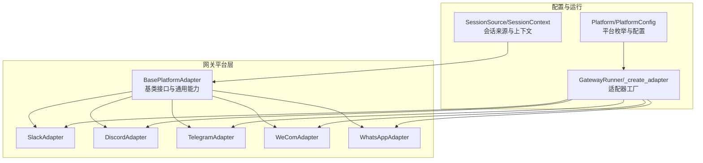
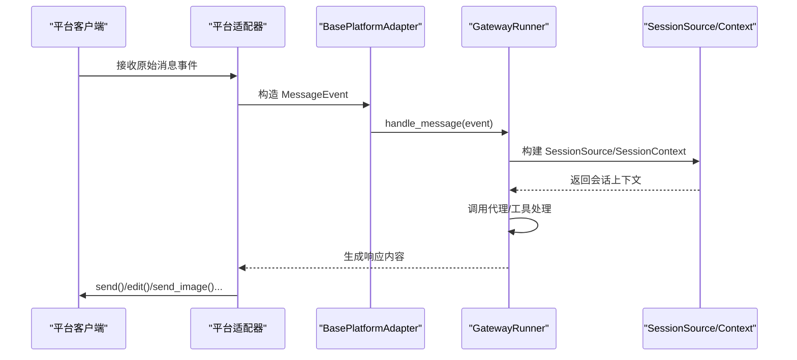
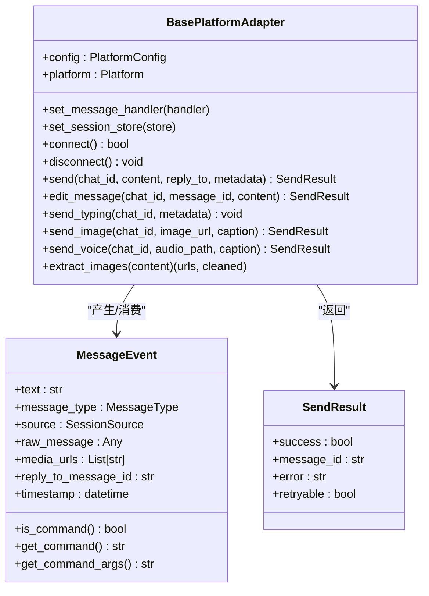
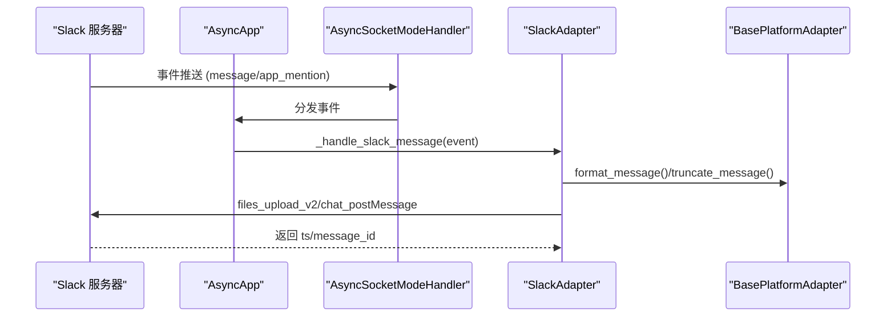
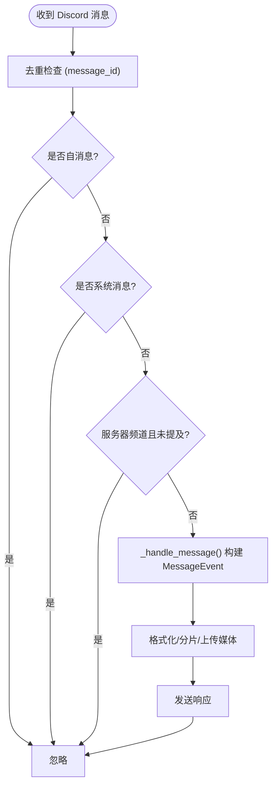
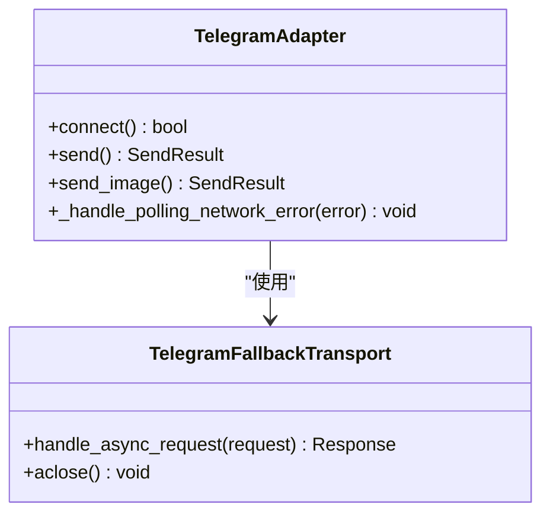
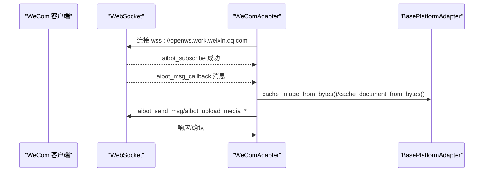
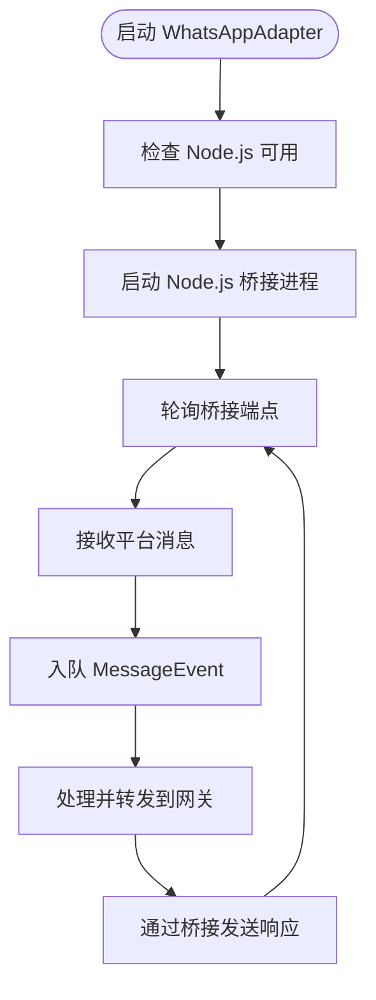
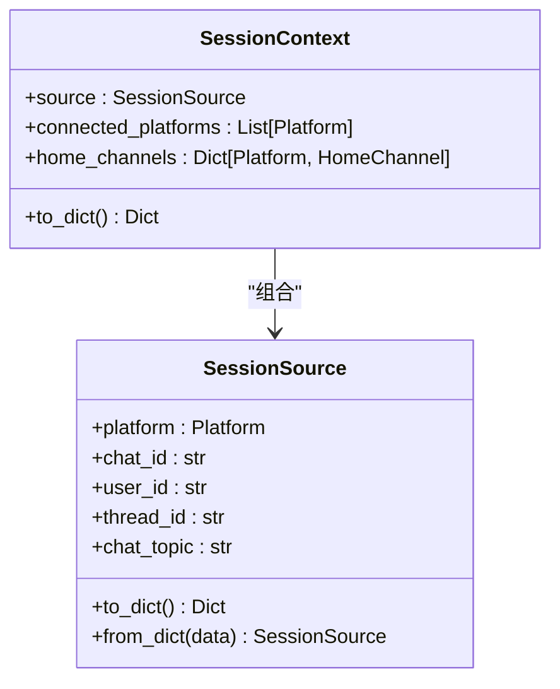
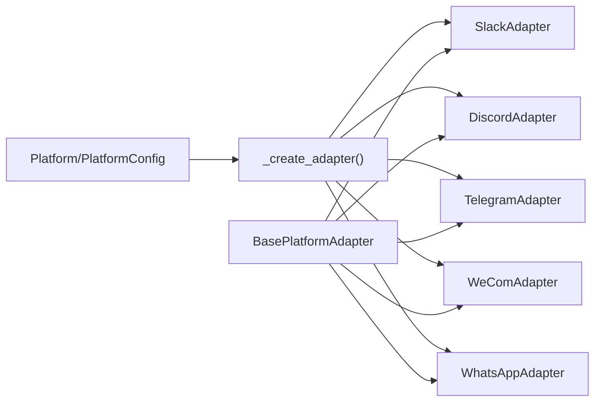

# 平台适配器开发

<cite>
**本文档引用的文件**
- [gateway/platforms/base.py](file://gateway/platforms/base.py)
- [gateway/platforms/__init__.py](file://gateway/platforms/__init__.py)
- [gateway/platforms/ADDING_A_PLATFORM.md](file://gateway/platforms/ADDING_A_PLATFORM.md)
- [gateway/platforms/slack.py](file://gateway/platforms/slack.py)
- [gateway/platforms/discord.py](file://gateway/platforms/discord.py)
- [gateway/platforms/telegram.py](file://gateway/platforms/telegram.py)
- [gateway/platforms/wecom.py](file://gateway/platforms/wecom.py)
- [gateway/platforms/whatsapp.py](file://gateway/platforms/whatsapp.py)
- [gateway/platforms/telegram_network.py](file://gateway/platforms/telegram_network.py)
- [gateway/config.py](file://gateway/config.py)
- [gateway/run.py](file://gateway/run.py)
- [gateway/session.py](file://gateway/session.py)
</cite>

## 目录
1. [简介](#简介)
2. [项目结构](#项目结构)
3. [核心组件](#核心组件)
4. [架构总览](#架构总览)
5. [详细组件分析](#详细组件分析)
6. [依赖关系分析](#依赖关系分析)
7. [性能考量](#性能考量)
8. [故障排除指南](#故障排除指南)
9. [结论](#结论)
10. [附录](#附录)

## 简介
本指南面向希望为 Hermes Agent 开发新消息平台适配器的开发者。文档基于现有平台（Telegram、Discord、Slack、WeCom、WhatsApp）的实现，系统阐述适配器基类设计模式、消息处理机制、会话管理、权限控制、并发处理、媒体缓存与下载、错误恢复与重试策略等关键主题，并提供从环境准备到测试部署的完整开发流程。

## 项目结构
Hermes 的平台适配器位于 `gateway/platforms/` 目录，采用“基类 + 多平台子类”的分层设计：
- 基类：`BasePlatformAdapter` 定义统一接口与通用能力（消息事件模型、发送结果、媒体缓存、默认发送方法等）
- 平台实现：各平台适配器继承基类并覆盖连接、发送、编辑、媒体上传、线程/话题支持等细节
- 配置与运行：`gateway/config.py` 定义平台枚举与配置数据结构；`gateway/run.py` 负责适配器工厂与生命周期管理；`gateway/session.py` 提供会话来源与上下文构建

图表来源
- [gateway/platforms/base.py](file://gateway/platforms/base.py)
- [gateway/platforms/slack.py](file://gateway/platforms/slack.py)
- [gateway/platforms/discord.py](file://gateway/platforms/discord.py)
- [gateway/platforms/telegram.py](file://gateway/platforms/telegram.py)
- [gateway/platforms/wecom.py](file://gateway/platforms/wecom.py)
- [gateway/platforms/whatsapp.py](file://gateway/platforms/whatsapp.py)
- [gateway/config.py](file://gateway/config.py)
- [gateway/run.py](file://gateway/run.py)
- [gateway/session.py](file://gateway/session.py)

章节来源
- [gateway/platforms/base.py](file://gateway/platforms/base.py)
- [gateway/platforms/__init__.py](file://gateway/platforms/__init__.py)
- [gateway/config.py](file://gateway/config.py)
- [gateway/run.py](file://gateway/run.py)
- [gateway/session.py](file://gateway/session.py)

## 核心组件
- 基类接口与通用能力
  - 消息事件模型：`MessageEvent` 统一承载文本、类型、媒体、回复上下文、时间戳等
  - 发送结果模型：`SendResult` 统一返回成功状态、消息ID、错误信息与可重试标记
  - 并发与中断：活动会话跟踪、后台任务集合、打字指示暂停/恢复
  - 媒体缓存：图片/音频/文档本地缓存与清理，URL 下载与重试
  - 默认发送：文本、图片、动画、语音、视频的默认实现与回退策略
- 平台适配器
  - Slack：Socket Mode 连接、多工作区、线程自动响应、mrkdwn 格式转换
  - Discord：事件去重、提及过滤、反应反馈、语音接收与解码
  - Telegram：轮询/Webhook、媒体组聚合、MarkdownV2 转义、网络降级传输
  - WeCom：WebSocket 持久连接、媒体上传分片、去重窗口
  - WhatsApp：Node.js 桥接模式、进程管理、消息队列与前缀匹配

章节来源
- [gateway/platforms/base.py](file://gateway/platforms/base.py)
- [gateway/platforms/slack.py](file://gateway/platforms/slack.py)
- [gateway/platforms/discord.py](file://gateway/platforms/discord.py)
- [gateway/platforms/telegram.py](file://gateway/platforms/telegram.py)
- [gateway/platforms/wecom.py](file://gateway/platforms/wecom.py)
- [gateway/platforms/whatsapp.py](file://gateway/platforms/whatsapp.py)

## 架构总览
平台适配器通过统一基类接入网关运行时，运行时根据配置实例化具体适配器并建立连接。消息在平台侧到达后被标准化为 `MessageEvent`，经由网关路由到会话管理与代理执行逻辑，再通过适配器发送回平台。

图表来源
- [gateway/platforms/base.py](file://gateway/platforms/base.py)
- [gateway/run.py](file://gateway/run.py)
- [gateway/session.py](file://gateway/session.py)

## 详细组件分析

### 基类设计模式与接口规范
- 抽象方法
  - `connect()`：建立连接并开始监听
  - `disconnect()`：停止监听、关闭连接、取消任务
  - `send(chat_id, content, reply_to, metadata)`：发送文本消息
- 可选扩展
  - 编辑消息、打字指示、图片/动画/语音/视频原生发送
  - 附件上传（本地路径或URL）、URL安全校验与重试
- 通用能力
  - 会话来源构建、消息命令解析、媒体提取与清理
  - 错误与致命错误标记、重试模式识别

图表来源
- [gateway/platforms/base.py](file://gateway/platforms/base.py)

章节来源
- [gateway/platforms/base.py](file://gateway/platforms/base.py)

### Slack 适配器实现要点
- 连接与认证
  - 使用 slack-bolt 的 Socket Mode，支持多工作区（多 bot token）
  - 应用令牌互斥锁，避免重复使用
- 消息处理
  - 事件去重（按 ts），忽略 bot 自身与系统消息
  - 线程自动响应：记录 bot 发送的 ts，后续无需 @mention 的回复
  - mrkdwn 格式转换与长消息分片
- 媒体与文件
  - 图片/音频/视频上传（files_upload_v2），URL 下载后上传
  - 语音消息回退为文本提示
- 打字指示
  - 通过 assistant.threads.setStatus 显示“正在思考”

图表来源
- [gateway/platforms/slack.py](file://gateway/platforms/slack.py)
- [gateway/platforms/base.py](file://gateway/platforms/base.py)

章节来源
- [gateway/platforms/slack.py](file://gateway/platforms/slack.py)

### Discord 适配器实现要点
- 连接与认证
  - 使用 discord.py，动态加载 opus，注册事件回调
  - 令牌互斥锁，等待 on_ready 同步 Slash 命令
- 消息处理
  - 事件去重（按 message_id），忽略系统消息与非目标用户
  - 提及过滤：在服务器频道中忽略未提及机器人的消息
  - 反应反馈：处理中/完成/失败的 emoji 反应
- 媒体与语音
  - 语音接收：RTP 解密（NaCl + DAVE E2EE）、Opus 解码、静音检测
  - 文件上传：支持图片/音频/视频本地路径上传
- 线程与自动线程
  - 长对话自动归档线程，参与过的线程集合持久化

图表来源
- [gateway/platforms/discord.py](file://gateway/platforms/discord.py)

章节来源
- [gateway/platforms/discord.py](file://gateway/platforms/discord.py)

### Telegram 适配器实现要点
- 连接与认证
  - 支持轮询与 Webhook，网络受限时使用自定义 HTTP 传输进行 IP 回退
  - 令牌冲突检测与网络错误重连策略
- 消息处理
  - 媒体组与长文本批处理，减少自我中断
  - MarkdownV2 转义与清理，避免格式污染
- 媒体与网络
  - 本地缓存图片/音频/文档，URL 下载带 SSRF 校验与指数退避
  - TelegramFallbackTransport 保持主机名与 SNI，仅替换 IP 进行连接重试

图表来源
- [gateway/platforms/telegram.py](file://gateway/platforms/telegram.py)
- [gateway/platforms/telegram_network.py](file://gateway/platforms/telegram_network.py)

章节来源
- [gateway/platforms/telegram.py](file://gateway/platforms/telegram.py)
- [gateway/platforms/telegram_network.py](file://gateway/platforms/telegram_network.py)

### WeCom 适配器实现要点
- 连接与认证
  - WebSocket 持久连接，心跳保活，断线指数退避重连
  - 订阅回调鉴权与去重窗口
- 消息与媒体
  - 文本消息长度限制与分片发送
  - 媒体上传采用分片协议（init/chunk/finish），支持图片/视频/语音/文件
- 权限与策略
  - 私聊/群组策略与白名单匹配，支持通配符与大小写不敏感

图表来源
- [gateway/platforms/wecom.py](file://gateway/platforms/wecom.py)
- [gateway/platforms/base.py](file://gateway/platforms/base.py)

章节来源
- [gateway/platforms/wecom.py](file://gateway/platforms/wecom.py)

### WhatsApp 适配器实现要点
- 桥接模式
  - 通过 Node.js 子进程运行 WhatsApp Web 客户端，Python 适配器通过 HTTP/IPC 通信
- 配置与运行
  - 桥接脚本路径、端口、会话目录、回复前缀、提及模式等
  - 进程冲突检测与端口占用清理
- 消息处理
  - 消息队列、提及模式匹配、自由回复聊天列表

图表来源
- [gateway/platforms/whatsapp.py](file://gateway/platforms/whatsapp.py)

章节来源
- [gateway/platforms/whatsapp.py](file://gateway/platforms/whatsapp.py)

### 会话管理与上下文注入
- 会话来源
  - `SessionSource` 描述消息来源（平台、聊天ID、用户ID、线程ID、话题等）
  - 支持哈希化标识以保护隐私
- 会话上下文
  - `SessionContext` 注入系统提示，包含可用平台与首页通道映射
- 动态系统提示
  - 不同平台在提示中注入能力描述，避免不支持的格式化

图表来源
- [gateway/session.py](file://gateway/session.py)
- [gateway/config.py](file://gateway/config.py)

章节来源
- [gateway/session.py](file://gateway/session.py)
- [gateway/config.py](file://gateway/config.py)

## 依赖关系分析
- 平台枚举与配置
  - `Platform` 枚举定义所有受支持平台；`PlatformConfig` 提供令牌、额外参数、首页通道等
- 适配器工厂
  - `GatewayRunner._create_adapter()` 根据配置选择具体适配器，加载依赖检查函数
- 运行时集成
  - 平台适配器通过 `set_message_handler()` 注册消息处理器，通过 `SessionSource` 构建会话键

图表来源
- [gateway/config.py](file://gateway/config.py)
- [gateway/run.py](file://gateway/run.py)
- [gateway/platforms/base.py](file://gateway/platforms/base.py)

章节来源
- [gateway/config.py](file://gateway/config.py)
- [gateway/run.py](file://gateway/run.py)

## 性能考量
- 媒体缓存与清理
  - 图片/音频/文档缓存目录按小时清理，避免磁盘膨胀
- 消息分片与格式转换
  - 长消息按平台限制分片，避免一次性超限
  - 平台特定格式转换（如 Slack mrkdwn、Telegram MarkdownV2）减少渲染失败
- 并发与背压
  - 会话级活动事件与后台任务集合，确保重启/替换时及时取消
- 网络鲁棒性
  - Telegram 回退传输、Discord/WeCom 指数退避、URL 下载重试与SSRF 校验

## 故障排除指南
- 常见致命错误
  - 令牌冲突：不同进程使用相同令牌导致互斥锁失败，需停止旧进程
  - 依赖缺失：缺少平台库或 Node.js，安装相应依赖后重试
- 网络问题
  - Telegram API 主机不可达：启用回退 IP 传输，或配置 DNS-over-HTTPS
  - Discord 语音解码失败：检查 opus 加载与 FFmpeg 转码链路
- 消息处理异常
  - 事件重复：确认去重窗口与键值（ts 或 message_id）
  - 提及过滤：在服务器频道中未提及机器人会被忽略
- 媒体上传失败
  - URL 下载超时/429：启用重试与指数退避
  - 文件过大：按平台最大尺寸限制拆分或压缩

章节来源
- [gateway/platforms/slack.py](file://gateway/platforms/slack.py)
- [gateway/platforms/discord.py](file://gateway/platforms/discord.py)
- [gateway/platforms/telegram.py](file://gateway/platforms/telegram.py)
- [gateway/platforms/wecom.py](file://gateway/platforms/wecom.py)
- [gateway/platforms/whatsapp.py](file://gateway/platforms/whatsapp.py)

## 结论
通过统一的基类接口与平台特定实现，Hermes Agent 能够以较低成本扩展新的消息平台。开发新适配器的关键在于：正确实现抽象方法、遵循消息与媒体处理规范、妥善处理并发与错误恢复、并在运行时与会话管理良好集成。建议参考现有平台实现，严格遵守依赖检查、令牌互斥、事件去重与格式转换等最佳实践。

## 附录

### 开发流程清单（新增平台）
- 创建适配器文件与依赖检查函数
- 在平台枚举与配置加载中注册新平台
- 在适配器工厂中添加创建逻辑
- 实现授权映射与会话来源扩展
- 添加系统提示、工具集、Cron 投递、发送消息工具路由
- 更新频道目录、状态显示与设置向导
- 补充文档与测试

章节来源
- [gateway/platforms/ADDING_A_PLATFORM.md](file://gateway/platforms/ADDING_A_PLATFORM.md)