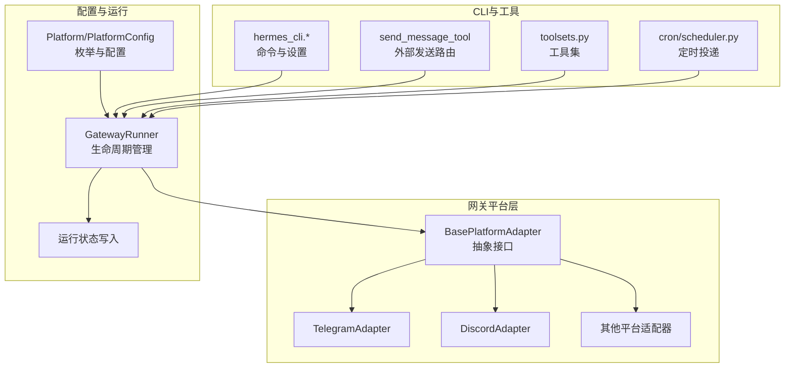
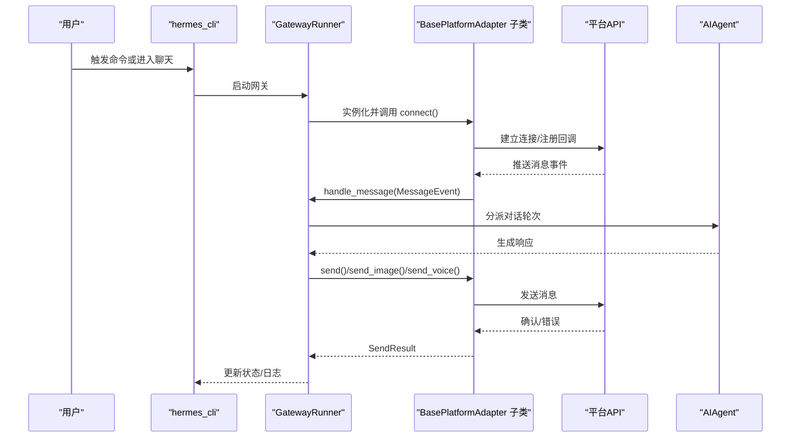
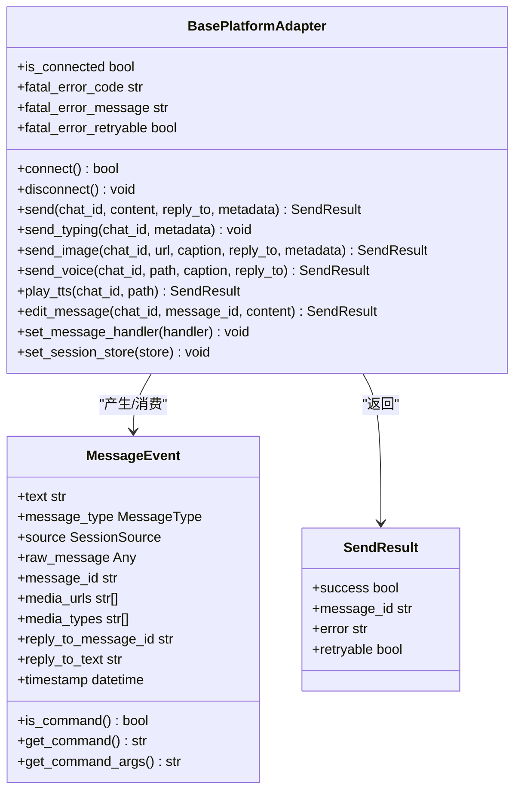
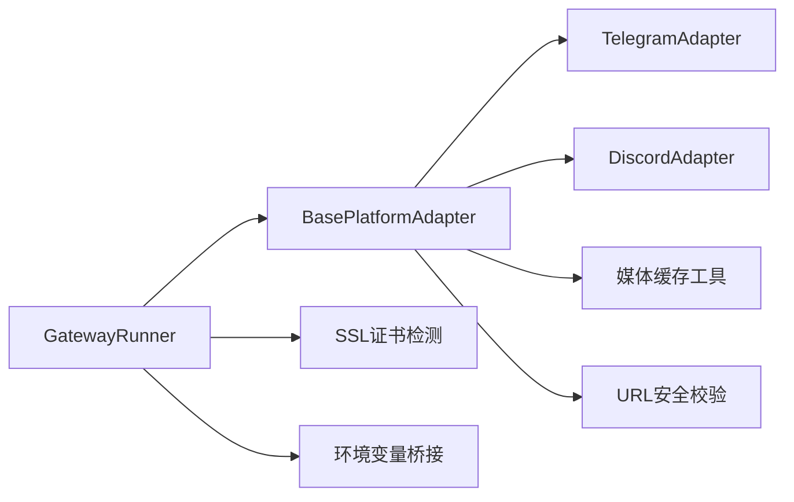

# 开发实践指南

<cite>
**本文档引用的文件**
- [gateway/platforms/base.py](file://gateway/platforms/base.py)
- [gateway/platforms/__init__.py](file://gateway/platforms/__init__.py)
- [gateway/platforms/ADDING_A_PLATFORM.md](file://gateway/platforms/ADDING_A_PLATFORM.md)
- [gateway/platforms/telegram.py](file://gateway/platforms/telegram.py)
- [gateway/platforms/discord.py](file://gateway/platforms/discord.py)
- [gateway/config.py](file://gateway/config.py)
- [gateway/run.py](file://gateway/run.py)
- [tests/gateway/test_platform_base.py](file://tests/gateway/test_platform_base.py)
- [CONTRIBUTING.md](file://CONTRIBUTING.md)
- [hermes_cli/status.py](file://hermes_cli/status.py)
- [hermes_cli/gateway.py](file://hermes_cli/gateway.py)
- [agent/prompt_builder.py](file://agent/prompt_builder.py)
- [tools/send_message_tool.py](file://tools/send_message_tool.py)
- [toolsets.py](file://toolsets.py)
- [cron/scheduler.py](file://cron/scheduler.py)
- [gateway/channel_directory.py](file://gateway/channel_directory.py)
- [agent/redact.py](file://agent/redact.py)
- [gateway/session.py](file://gateway/session.py)
- [gateway/pairing.py](file://gateway/pairing.py)
- [hermes_constants.py](file://hermes_constants.py)
- [hermes_state.py](file://hermes_state.py)
- [hermes_time.py](file://hermes_time.py)
- [hermes_logging.py](file://hermes_logging.py)
- [hermes_cli/config.py](file://hermes_cli/config.py)
- [hermes_cli/env_loader.py](file://hermes_cli/env_loader.py)
- [hermes_cli/main.py](file://hermes_cli/main.py)
- [hermes_cli/commands.py](file://hermes_cli/commands.py)
- [hermes_cli/callbacks.py](file://hermes_cli/callbacks.py)
- [hermes_cli/doctor.py](file://hermes_cli/doctor.py)
- [hermes_cli/skills_hub.py](file://hermes_cli/skills_hub.py)
- [hermes_cli/skin_engine.py](file://hermes_cli/skin_engine.py)
- [hermes_cli/models.py](file://hermes_cli/models.py)
- [hermes_cli/banner.py](file://hermes_cli/banner.py)
- [hermes_cli/auth.py](file://hermes_cli/auth.py)
- [hermes_cli/proxy.py](file://hermes_cli/proxy.py)
- [hermes_cli/webhook.py](file://hermes_cli/webhook.py)
- [hermes_cli/tools_config.py](file://hermes_cli/tools_config.py)
- [hermes_cli/skills_config.py](file://hermes_cli/skills_config.py)
- [hermes_cli/memory_setup.py](file://hermes_cli/memory_setup.py)
- [hermes_cli/runtime_provider.py](file://hermes_cli/runtime_provider.py)
- [hermes_cli/providers.py](file://hermes_cli/providers.py)
- [hermes_cli/profiles.py](file://hermes_cli/profiles.py)
- [hermes_cli/plugins.py](file://hermes_cli/plugins.py)
- [hermes_cli/plugins_cmd.py](file://hermes_cli/plugins_cmd.py)
- [hermes_cli/setup.py](file://hermes_cli/setup.py)
- [hermes_cli/status.py](file://hermes_cli/status.py)
- [hermes_cli/tools.py](file://hermes_cli/tools.py)
- [hermes_cli/uninstall.py](file://hermes_cli/uninstall.py)
- [hermes_cli/version.py](file://hermes_cli/version.py)
- [hermes_cli/webhook.py](file://hermes_cli/webhook.py)
- [hermes_cli/whatsapp.py](file://hermes_cli/whatsapp.py)
- [hermes_cli/yaml_config.py](file://hermes_cli/yaml_config.py)
- [hermes_cli/zsh_completion.py](file://hermes_cli/zsh_completion.py)
- [hermes_cli/zsh_completion.py](file://hermes_cli/zsh_completion.py)
- [hermes_cli/zsh_completion.py](file://hermes_cli/zsh_completion.py)
- [hermes_cli/zsh_completion.py](file://hermes_cli/zsh_completion.py)
- [hermes_cli/zsh_completion.py](file://hermes_cli/zsh_completion.py)
- [hermes_cli/zsh_completion.py](file://hermes_cli/zsh_completion.py)
- [hermes_cli/zsh_completion.py](file://hermes_cli/zsh_completion.py)
- [hermes_cli/zsh_completion.py](file://hermes_cli/zsh_completion.py)
- [hermes_cli/zsh_completion.py](file://hermes_cli/zsh_completion.py)
- [hermes_cli/zsh_completion.py](file://hermes_cli/zsh_completion.py)
- [hermes_cli/zsh_completion.py](file://hermes_cli/zsh_completion.py)
- [hermes_cli/zsh_completion.py](file://hermes_cli/zsh_completion.py)
- [hermes_cli/zsh_completion.py](file://hermes_cli/zsh_completion.py)
- [hermes_cli/zsh_completion.py](file://hermes_cli/zsh_completion.py)
- [hermes_cli/zsh_completion.py](file://hermes_cli/zsh_completion.py)
- [hermes_cli/zsh_completion.py](file://hermes_cli/zsh_completion.py)
- [hermes_cli/zsh_completion.py](file://hermes_cli/zsh_completion.py)
- [hermes_cli/zsh_completion.py](file://hermes_cli/zsh_completion.py)
- [hermes_cli/zsh_completion.py](file://hermes_cli/zsh_completion.py)
- [hermes_cli/zsh_completion.py](file://hermes_cli/zsh_completion.py)
- [hermes_cli/zsh_completion.py](file://hermes_cli/zsh_completion.py)
- [hermes_cli/zsh_completion.py](file://hermes_cli/zsh_completion.py)
- [hermes_cli/zsh_completion.py](file://hermes_cli/zsh_completion.py)
- [hermes_cli/zsh_completion.py](file://hermes_cli/zsh_completion.py)
- [hermes_cli/zsh_completion.py](file://hermes_cli/zsh_completion.py)
-......
</cite>

## 目录
1. [简介](#简介)
2. [项目结构](#项目结构)
3. [核心组件](#核心组件)
4. [架构总览](#架构总览)
5. [详细组件分析](#详细组件分析)
6. [依赖分析](#依赖分析)
7. [性能考虑](#性能考虑)
8. [故障排查指南](#故障排查指南)
9. [结论](#结论)
10. [附录](#附录)

## 简介
本指南面向为 Hermes Agent 新增“平台适配器”的开发者，提供从环境准备、依赖安装、适配器开发、测试与集成验证，到生产部署与发布流程的完整实践路径。文档以现有平台（如 Telegram、Discord）为参考实现，总结了适配器开发的通用模式与最佳实践，并给出可直接复用的开发模板与检查清单。

## 项目结构
Hermes 的“网关平台适配器”位于 gateway/platforms 目录，核心抽象在 base.py 中定义，具体平台适配器在各自模块中实现。适配器通过 gateway/run.py 被统一调度，配置由 gateway/config.py 管理，运行状态与 CLI 集成在 hermes_cli 下。

图示来源
- [gateway/platforms/base.py](file://gateway/platforms/base.py)
- [gateway/platforms/telegram.py](file://gateway/platforms/telegram.py)
- [gateway/platforms/discord.py](file://gateway/platforms/discord.py)
- [gateway/config.py](file://gateway/config.py)
- [gateway/run.py](file://gateway/run.py)
- [hermes_cli/status.py](file://hermes_cli/status.py)
- [tools/send_message_tool.py](file://tools/send_message_tool.py)
- [toolsets.py](file://toolsets.py)
- [cron/scheduler.py](file://cron/scheduler.py)

章节来源
- [gateway/platforms/base.py](file://gateway/platforms/base.py)
- [gateway/platforms/__init__.py](file://gateway/platforms/__init__.py)
- [gateway/platforms/ADDING_A_PLATFORM.md](file://gateway/platforms/ADDING_A_PLATFORM.md)
- [gateway/config.py](file://gateway/config.py)
- [gateway/run.py](file://gateway/run.py)

## 核心组件
- BasePlatformAdapter 抽象类：定义适配器必须实现的连接、断开、发送、编辑、媒体发送、打字指示等接口；提供错误标记、重试策略、会话跟踪、媒体缓存工具等通用能力。
- MessageEvent/MessageType/SendResult：标准化消息事件、消息类型与发送结果的数据结构。
- 平台枚举与配置：Platform/PlatformConfig 定义平台类型、令牌、主页频道、额外参数等。
- 运行时调度：GatewayRunner 在 gateway/run.py 中负责加载配置、实例化适配器、建立消息路由与后台任务管理。
- CLI 与状态：hermes_cli 提供安装向导、状态展示、配置桥接等，便于平台适配器的本地调试与运维。

章节来源
- [gateway/platforms/base.py](file://gateway/platforms/base.py)
- [gateway/config.py](file://gateway/config.py)
- [gateway/run.py](file://gateway/run.py)
- [hermes_cli/status.py](file://hermes_cli/status.py)

## 架构总览
下图展示了从用户输入到平台适配器处理、再到消息投递的关键流程：

图示来源
- [gateway/run.py](file://gateway/run.py)
- [gateway/platforms/base.py](file://gateway/platforms/base.py)
- [hermes_cli/status.py](file://hermes_cli/status.py)

## 详细组件分析

### 组件一：BasePlatformAdapter 抽象与数据模型
- 必需接口
  - connect()/disconnect()：建立与断开平台连接，启动/停止监听。
  - send(chat_id, content, reply_to, metadata) -> SendResult：发送文本消息。
  - 可选扩展：send_typing()/stop_typing()、send_image()/send_animation()/send_voice()/play_tts()、edit_message()。
- 数据模型
  - MessageEvent：统一的消息事件载体，包含文本、类型、媒体列表、回复上下文、时间戳等。
  - MessageType：文本、位置、图片、视频、音频、语音、文档、贴纸、命令等类型。
  - SendResult：发送结果，包含成功标志、消息ID、错误信息、是否可重试等。
- 错误与重连
  - _set_fatal_error()/has_fatal_error：标记致命错误并上报。
  - _RETRYABLE_ERROR_PATTERNS：识别可重试的瞬时网络错误。
  - _mark_connected/_mark_disconnected：更新运行状态。
- 媒体与缓存
  - 图片/音频/文档缓存工具：cache_image_from_bytes/url、cache_audio_from_bytes/url、cache_document_from_bytes。
  - 支持 SSRF 保护与路径遍历防护。
- 消息处理
  - extract_images：从富文本中提取图片链接并清理标签。
  - MAX_MESSAGE_LENGTH：按平台限制截断消息。

图示来源
- [gateway/platforms/base.py](file://gateway/platforms/base.py)

章节来源
- [gateway/platforms/base.py](file://gateway/platforms/base.py)

### 组件二：TelegramAdapter 实现要点
- 依赖与可用性检测：check_telegram_requirements()。
- 消息格式：MarkdownV2 转义与清理，避免平台语法冲突。
- 限流与分段：MAX_MESSAGE_LENGTH、媒体组等待时间、长文本批处理缓冲。
- 会话与线程：论坛主题（话题）支持、DM 主题映射、交互式模型选择器状态。
- 错误与重连：polling 网络错误检测与指数退避重连策略。
- 媒体处理：图片/音频/文档缓存、URL SSRF 校验。

章节来源
- [gateway/platforms/telegram.py](file://gateway/platforms/telegram.py)

### 组件三：DiscordAdapter 实现要点
- 语音接收：VoiceReceiver 解密与解码 Opus，静音检测与说话人映射。
- 权限与安全：URL 安全校验、SSRC 映射、E2EE 处理。
- 会话与线程：线程自动归档分钟数校验、线程/频道上下文处理。
- 错误与重连：网络错误识别与重连策略。

章节来源
- [gateway/platforms/discord.py](file://gateway/platforms/discord.py)

### 组件四：适配器工厂与授权映射
- 工厂函数：在 gateway/run.py 的 _create_adapter() 中根据 Platform 枚举创建对应适配器实例，并进行依赖检查。
- 授权映射：在 _is_user_authorized() 中维护平台到允许用户的映射表，支持白名单与全局放行配置。

章节来源
- [gateway/run.py](file://gateway/run.py)

### 组件五：平台枚举与配置扩展
- 平台枚举：在 gateway/config.py 的 Platform 中新增平台值。
- 环境变量加载：在 _apply_env_overrides() 中读取平台令牌与配置，支持启用标志与额外参数。
- 连接平台：get_connected_platforms() 可根据平台特性调整连接逻辑（如无需令牌的平台）。

章节来源
- [gateway/config.py](file://gateway/config.py)

### 组件六：系统提示与工具集
- 系统提示：在 agent/prompt_builder.py 中为新平台添加提示词，确保代理了解平台能力与格式限制。
- 工具集：在 toolsets.py 中为新平台定义工具集名称与包含的工具集合，并将其加入复合工具集。

章节来源
- [agent/prompt_builder.py](file://agent/prompt_builder.py)
- [toolsets.py](file://toolsets.py)

### 组件七：定时投递与外部发送
- 定时投递：在 cron/scheduler.py 的 platform_map 中添加新平台映射，确保 cron 任务能正确投递到该平台。
- 外部发送：在 tools/send_message_tool.py 的 platform_map 中添加路由，并实现独立的发送函数以便非网关进程使用。

章节来源
- [cron/scheduler.py](file://cron/scheduler.py)
- [tools/send_message_tool.py](file://tools/send_message_tool.py)

### 组件八：会话源与通道目录
- 会话源：若新平台需要额外身份字段，在 gateway/session.py 的 SessionSource 中扩展，并在 build_source() 中构建。
- 通道目录：在 gateway/channel_directory.py 中将新平台加入基于会话的发现列表（若平台不支持枚举）。

章节来源
- [gateway/session.py](file://gateway/session.py)
- [gateway/channel_directory.py](file://gateway/channel_directory.py)

### 组件九：状态显示与安装向导
- 状态显示：在 hermes_cli/status.py 的平台字典中添加新平台的令牌与主页频道配置项。
- 安装向导：在 hermes_cli/gateway.py 的 _PLATFORMS 列表中添加新平台的设置项与自定义设置函数。

章节来源
- [hermes_cli/status.py](file://hermes_cli/status.py)
- [hermes_cli/gateway.py](file://hermes_cli/gateway.py)

### 组件十：敏感信息脱敏
- 在 agent/redact.py 中为新平台添加敏感标识（如电话号码）的正则与脱敏函数，确保日志安全。

章节来源
- [agent/redact.py](file://agent/redact.py)

### 组件十一：测试策略与模板
- 单元测试：针对 MessageEvent 命令解析、URL 安全、媒体提取等进行断言。
- 集成测试：模拟平台 API，覆盖消息处理流程、重连逻辑、附件处理、群组过滤等。
- 快速验证：使用 grep 检查遗漏的平台引用，确保所有集成点均已实现。

章节来源
- [tests/gateway/test_platform_base.py](file://tests/gateway/test_platform_base.py)
- [gateway/platforms/ADDING_A_PLATFORM.md](file://gateway/platforms/ADDING_A_PLATFORM.md)

## 依赖分析
- 适配器与平台库：Telegram/Discord 等第三方库仅用于适配器内部，通过 check_*_requirements() 进行可用性检测，避免影响核心功能。
- 缓存与安全：媒体缓存目录与 SSRF 校验在 base.py 中集中实现，适配器只需调用即可。
- 运行时依赖：SSL 证书自动检测、环境变量桥接、终端工作目录等在 gateway/run.py 中统一处理。

图示来源
- [gateway/platforms/base.py](file://gateway/platforms/base.py)
- [gateway/run.py](file://gateway/run.py)

章节来源
- [gateway/platforms/base.py](file://gateway/platforms/base.py)
- [gateway/run.py](file://gateway/run.py)

## 性能考虑
- 异步与并发：适配器应使用异步 I/O，避免阻塞事件循环；合理使用 asyncio.Task 管理后台任务。
- 重连与退避：对瞬时网络错误采用指数退避加抖动策略，避免雪崩效应。
- 媒体处理：优先使用本地缓存路径，减少平台 URL 的过期风险；批量聚合长文本与媒体事件，降低重复处理成本。
- 日志与脱敏：避免在日志中输出敏感信息，使用安全 URL 输出与脱敏工具。

## 故障排查指南
- 常见问题
  - API 限制：不同平台的消息长度、媒体大小、速率限制不同，需在适配器中实现 MAX_MESSAGE_LENGTH 与节流控制。
  - 认证问题：令牌无效、权限不足、多实例冲突（如 Telegram Polling 冲突），需在 connect() 中进行健壮性检查与错误分类。
  - 消息格式差异：Markdown/HTML 渲染差异导致格式错乱，需在适配器内做平台特定的转义与清理。
  - 媒体下载失败：CDN 超时、429/5xx，需实现带指数退避的重试与本地缓存降级。
- 排查步骤
  - 启用详细日志：确认 BasePlatformAdapter 的错误标记与运行状态写入正常。
  - 使用单元测试：验证命令解析、URL 安全、媒体提取等基础功能。
  - 集成测试：模拟平台 API，覆盖重连、附件、群组过滤等场景。
  - 快速扫描：grep 平台名检查遗漏的集成点，确保配置、工厂、授权、工具集、定时投递、外部发送、通道目录、状态与安装向导均已完成。

章节来源
- [gateway/platforms/base.py](file://gateway/platforms/base.py)
- [tests/gateway/test_platform_base.py](file://tests/gateway/test_platform_base.py)
- [gateway/platforms/ADDING_A_PLATFORM.md](file://gateway/platforms/ADDING_A_PLATFORM.md)

## 结论
通过遵循 BasePlatformAdapter 的抽象规范与平台适配器开发清单，开发者可以快速、稳定地为 Hermes Agent 新增平台适配器。建议在开发过程中严格遵循测试策略、安全与性能最佳实践，并在完成开发后进行全面的集成验证与回归测试，确保在生产环境中可靠运行。

## 附录

### 开发模板与检查清单
- 平台适配器模块
  - 创建 gateway/platforms/<platform>.py，继承 BasePlatformAdapter，实现必需方法与可选扩展。
  - 添加 check_<platform>_requirements() 进行依赖检测。
- 平台枚举与配置
  - 在 gateway/config.py 的 Platform 中添加新平台值，并在 _apply_env_overrides() 中读取令牌与配置。
  - 如需特殊连接逻辑，更新 get_connected_platforms()。
- 适配器工厂与授权
  - 在 gateway/run.py 的 _create_adapter() 中注册新适配器与依赖检查。
  - 在 _is_user_authorized() 中添加平台到允许用户的映射。
- 系统提示与工具集
  - 在 agent/prompt_builder.py 中添加平台提示词。
  - 在 toolsets.py 中定义工具集并加入复合工具集。
- 定时投递与外部发送
  - 在 cron/scheduler.py 的 platform_map 中添加映射。
  - 在 tools/send_message_tool.py 中添加路由与独立发送函数。
- 会话源与通道目录
  - 在 gateway/session.py 扩展 SessionSource 并更新 build_source()。
  - 在 gateway/channel_directory.py 将平台加入基于会话的发现列表。
- 状态显示与安装向导
  - 在 hermes_cli/status.py 中添加平台配置项。
  - 在 hermes_cli/gateway.py 的 _PLATFORMS 列表中添加平台设置项。
- 敏感信息脱敏
  - 在 agent/redact.py 添加平台特定的敏感信息正则与脱敏函数。
- 测试
  - 补充单元测试与集成测试，覆盖命令解析、URL 安全、媒体提取、重连、附件、群组过滤等。
  - 使用 grep 快速扫描遗漏的平台引用。

章节来源
- [gateway/platforms/ADDING_A_PLATFORM.md](file://gateway/platforms/ADDING_A_PLATFORM.md)
- [gateway/config.py](file://gateway/config.py)
- [gateway/run.py](file://gateway/run.py)
- [agent/prompt_builder.py](file://agent/prompt_builder.py)
- [toolsets.py](file://toolsets.py)
- [cron/scheduler.py](file://cron/scheduler.py)
- [tools/send_message_tool.py](file://tools/send_message_tool.py)
- [gateway/session.py](file://gateway/session.py)
- [gateway/channel_directory.py](file://gateway/channel_directory.py)
- [hermes_cli/status.py](file://hermes_cli/status.py)
- [hermes_cli/gateway.py](file://hermes_cli/gateway.py)
- [agent/redact.py](file://agent/redact.py)

### 代码审查标准
- 必须实现的接口：connect()/disconnect()/send() 以及 send_typing()/send_image()/send_voice()/play_tts() 等可选扩展。
- 错误处理：区分瞬时错误与致命错误，正确设置 SendResult.retryable 与 BasePlatformAdapter._set_fatal_error()。
- 安全性：使用 SSRF 校验与 URL 安全输出，避免在日志中泄露令牌与敏感信息。
- 平台兼容性：遵循平台的消息长度限制、媒体格式与速率限制。
- 测试覆盖率：至少包含单元测试与关键集成场景的端到端测试。

章节来源
- [CONTRIBUTING.md](file://CONTRIBUTING.md)
- [gateway/platforms/base.py](file://gateway/platforms/base.py)

### 发布流程
- 本地验证
  - 运行 pytest tests/ 验证所有测试通过。
  - 使用 hermes doctor 与 hermes chat -q "Hello" 进行基本功能验证。
- 配置与文档
  - 更新 README.md 与 AGENTS.md 中的平台列表与环境变量说明。
  - 在 website/docs/user-guide/messaging/ 下添加新平台的完整设置指南。
  - 在 website/docs/reference/environment-variables.md 中补充新平台的环境变量。
- 提交与评审
  - 提交 PR，描述变更内容、测试方法与平台覆盖范围。
  - 遵循 Conventional Commits 规范，保持每次 PR 专注单一功能。
- 生产部署
  - 在目标环境中安装依赖，配置令牌与主页频道，启动网关并观察 hermes_cli/status 的状态。
  - 监控日志与运行状态，确保重连与错误处理正常。

章节来源
- [CONTRIBUTING.md](file://CONTRIBUTING.md)
- [hermes_cli/status.py](file://hermes_cli/status.py)