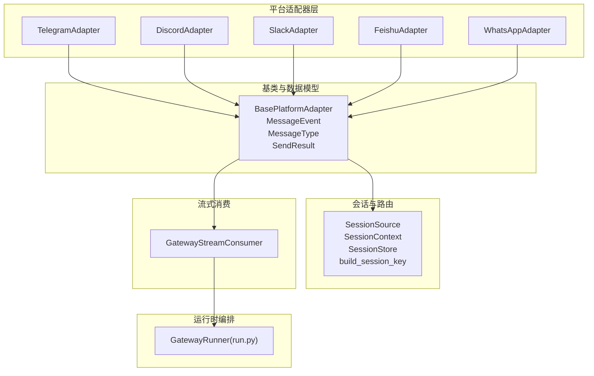
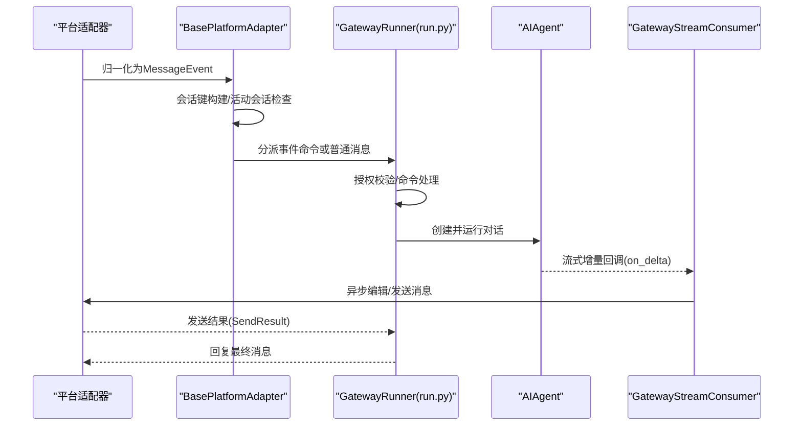
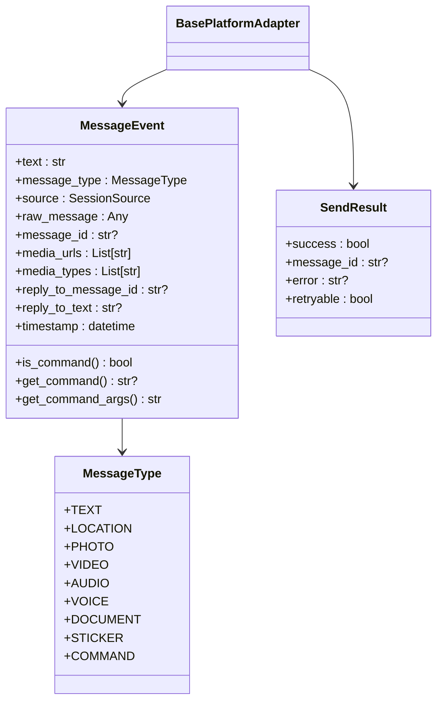
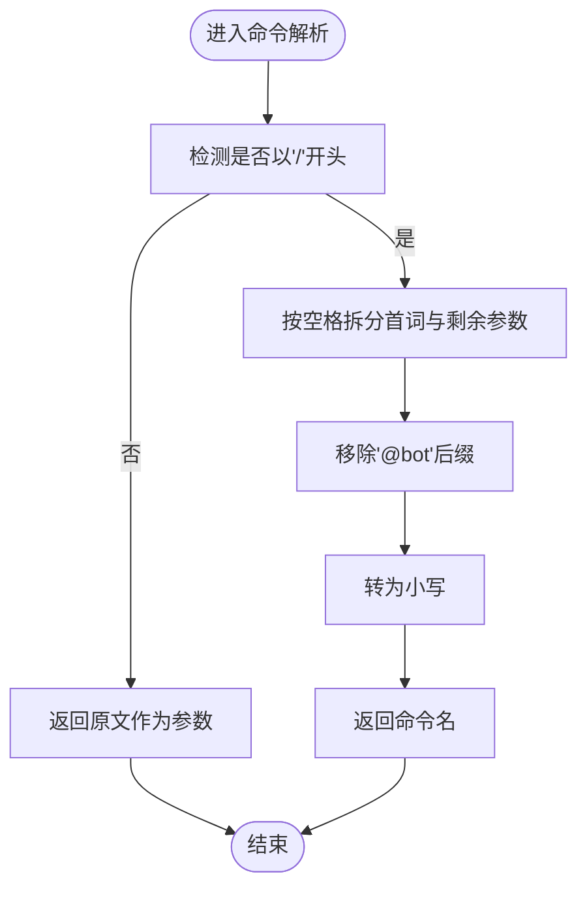
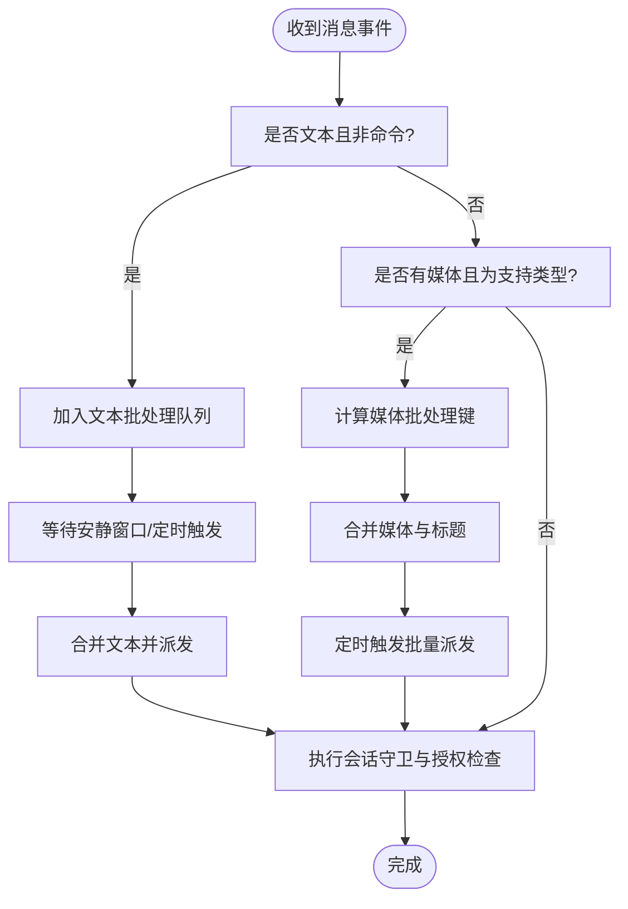
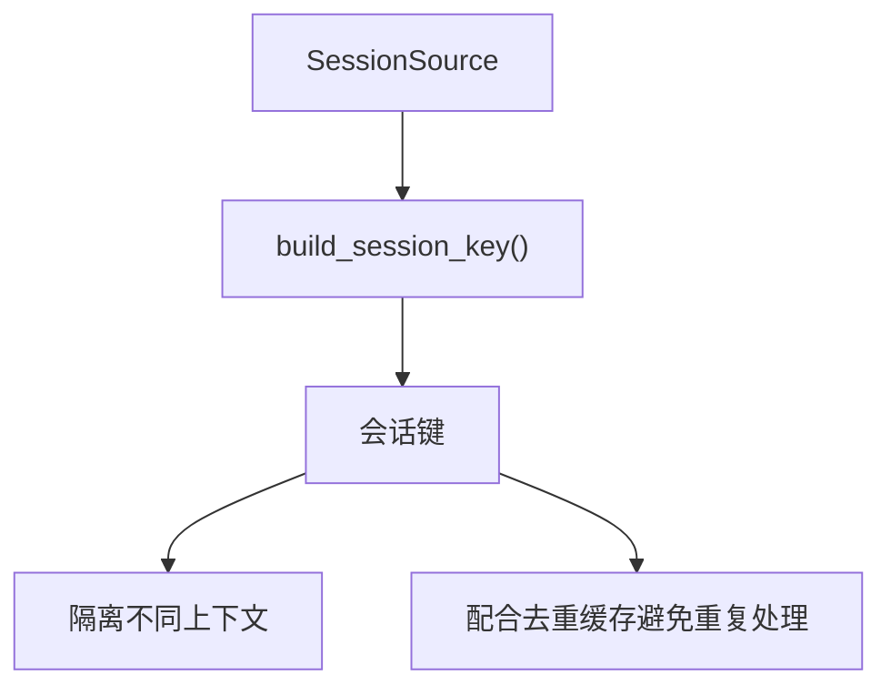
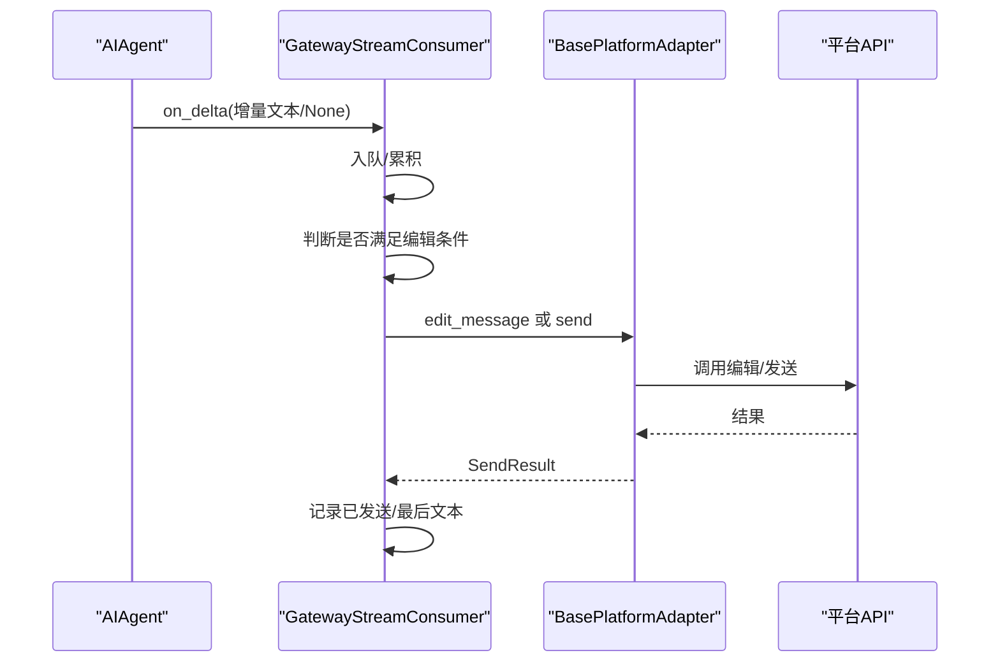
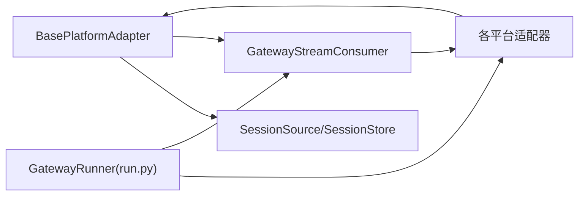

# 消息处理流程

<cite>
**本文引用的文件**
- [gateway/platforms/base.py](file://gateway/platforms/base.py)
- [gateway/platforms/telegram.py](file://gateway/platforms/telegram.py)
- [gateway/platforms/discord.py](file://gateway/platforms/discord.py)
- [gateway/platforms/slack.py](file://gateway/platforms/slack.py)
- [gateway/platforms/feishu.py](file://gateway/platforms/feishu.py)
- [gateway/platforms/whatsapp.py](file://gateway/platforms/whatsapp.py)
- [gateway/stream_consumer.py](file://gateway/stream_consumer.py)
- [gateway/session.py](file://gateway/session.py)
- [gateway/run.py](file://gateway/run.py)
- [website/docs/developer-guide/gateway-internals.md](file://website/docs/developer-guide/gateway-internals.md)
- [tests/gateway/test_telegram_text_batching.py](file://tests/gateway/test_telegram_text_batching.py)
- [tests/gateway/test_stream_consumer.py](file://tests/gateway/test_stream_consumer.py)
- [.plans/streaming-support.md](file://.plans/streaming-support.md)
</cite>

## 目录
1. [简介](#简介)
2. [项目结构](#项目结构)
3. [核心组件](#核心组件)
4. [架构总览](#架构总览)
5. [详细组件分析](#详细组件分析)
6. [依赖分析](#依赖分析)
7. [性能考虑](#性能考虑)
8. [故障排查指南](#故障排查指南)
9. [结论](#结论)
10. [附录](#附录)

## 简介
本文件面向Hermes Agent平台的适配器消息处理流程，系统性阐述从平台适配器接收原始事件到标准化MessageEvent、命令解析、附件处理、回复上下文构建、并发与批处理、以及流式输出与错误重试的完整链路。重点覆盖：
- 消息类型识别与标准化
- 命令解析机制（get_command、get_command_args）
- 消息类型枚举（MessageType）
- 文本与媒体批处理策略
- 去重与会话隔离
- 流式消费与编辑传输
- 错误处理与重试策略
- 性能监控与最佳实践

## 项目结构
Hermes Agent的消息处理以“平台适配器 + 基类 + 会话管理 + 流式消费”为核心分层：
- 平台适配器：Telegram、Discord、Slack、飞书、WhatsApp等，负责接入与事件归一化
- 基类与数据模型：统一的MessageEvent、MessageType、发送结果SendResult
- 会话管理：SessionSource、SessionContext、SessionStore与会话键构建
- 流式消费：GatewayStreamConsumer桥接同步回调与异步平台编辑
- 运行时编排：GatewayRunner在run.py中调度会话、工具调用与响应

图表来源
- [gateway/platforms/base.py](file://gateway/platforms/base.py)
- [gateway/platforms/telegram.py](file://gateway/platforms/telegram.py)
- [gateway/platforms/discord.py](file://gateway/platforms/discord.py)
- [gateway/platforms/slack.py](file://gateway/platforms/slack.py)
- [gateway/platforms/feishu.py](file://gateway/platforms/feishu.py)
- [gateway/platforms/whatsapp.py](file://gateway/platforms/whatsapp.py)
- [gateway/session.py](file://gateway/session.py)
- [gateway/stream_consumer.py](file://gateway/stream_consumer.py)
- [gateway/run.py](file://gateway/run.py)

章节来源
- [gateway/platforms/base.py](file://gateway/platforms/base.py)
- [gateway/session.py](file://gateway/session.py)
- [gateway/stream_consumer.py](file://gateway/stream_consumer.py)
- [gateway/run.py](file://gateway/run.py)

## 核心组件
- MessageEvent：标准化的入站消息载体，包含文本、类型、来源、原始消息、媒体列表、回复上下文、时间戳等，并提供命令检测与解析方法
- MessageType：统一的消息类型枚举，涵盖文本、位置、图片、视频、音频、语音、文档、贴纸、命令等
- BasePlatformAdapter：抽象适配器，定义连接、断开、发送、编辑、打字指示等接口；内置会话管理、活动任务跟踪、致命错误标记与通知
- SessionSource/SessionContext/SessionStore：描述消息来源、动态系统提示注入、会话键生成与持久化
- GatewayStreamConsumer：线程安全地接收同步回调的增量文本，缓冲并按阈值/间隔异步编辑平台消息

章节来源
- [gateway/platforms/base.py](file://gateway/platforms/base.py)
- [gateway/session.py](file://gateway/session.py)
- [gateway/stream_consumer.py](file://gateway/stream_consumer.py)

## 架构总览
下图展示了从平台适配器到运行时编排的关键交互路径，包括命令分流、批处理、流式编辑与会话隔离。

图表来源
- [gateway/platforms/base.py](file://gateway/platforms/base.py)
- [gateway/run.py](file://gateway/run.py)
- [gateway/stream_consumer.py](file://gateway/stream_consumer.py)

章节来源
- [website/docs/developer-guide/gateway-internals.md](file://website/docs/developer-guide/gateway-internals.md)
- [gateway/platforms/base.py](file://gateway/platforms/base.py)
- [gateway/run.py](file://gateway/run.py)

## 详细组件分析

### 组件A：消息类型与标准化（MessageEvent、MessageType）
- MessageType提供统一类型标识，便于上层逻辑分流处理
- MessageEvent提供：
  - 命令检测：is_command()
  - 命令解析：get_command()、get_command_args()
  - 媒体字段：media_urls、media_types
  - 回复上下文：reply_to_message_id、reply_to_text
  - 时间戳与原始消息保留，便于调试与审计

图表来源
- [gateway/platforms/base.py](file://gateway/platforms/base.py)

章节来源
- [gateway/platforms/base.py](file://gateway/platforms/base.py)

### 组件B：命令解析机制（get_command、get_command_args）
- is_command：判断是否以“/”开头
- get_command：提取首词并去除@bot后缀，统一转小写
- get_command_args：返回命令后的参数字符串，非命令时返回原文

图表来源
- [gateway/platforms/base.py](file://gateway/platforms/base.py)

章节来源
- [gateway/platforms/base.py](file://gateway/platforms/base.py)

### 组件C：文本与媒体批处理（Telegram、飞书）
- 文本批处理：对短时间内来自同一会话的文本消息进行合并，减少重复处理与中断
- 媒体批处理：对同类型媒体（图片/视频/文档/音频）且上下文一致的事件进行聚合，合并附件与标题
- 批处理键：基于会话键与消息类型组合，确保不同上下文不被错误合并

图表来源
- [gateway/platforms/telegram.py](file://gateway/platforms/telegram.py)
- [gateway/platforms/feishu.py](file://gateway/platforms/feishu.py)
- [tests/gateway/test_telegram_text_batching.py](file://tests/gateway/test_telegram_text_batching.py)

章节来源
- [gateway/platforms/telegram.py](file://gateway/platforms/telegram.py)
- [gateway/platforms/feishu.py](file://gateway/platforms/feishu.py)
- [tests/gateway/test_telegram_text_batching.py](file://tests/gateway/test_telegram_text_batching.py)

### 组件D：会话隔离与去重（SessionKey、去重缓存）
- 会话键构建：根据平台、聊天类型、聊天ID、线程ID、用户ID等生成唯一键，保证多用户/多线程场景下的上下文隔离
- 去重缓存：部分平台（如飞书）维护消息ID去重表，结合TTL避免重复处理

图表来源
- [gateway/session.py](file://gateway/session.py)
- [gateway/platforms/feishu.py](file://gateway/platforms/feishu.py)

章节来源
- [gateway/session.py](file://gateway/session.py)
- [gateway/platforms/feishu.py](file://gateway/platforms/feishu.py)

### 组件E：流式消费与编辑传输（GatewayStreamConsumer）
- 同步回调桥接：AIAgent在工作线程中同步回调on_delta，GatewayStreamConsumer通过线程安全队列接收
- 缓冲与节流：按时间间隔与字符阈值决定是否编辑；支持“工具边界”信号，强制换段落
- 编辑传输：优先使用平台支持的编辑能力，失败则回退至发送新消息
- 可视化清理：剥离MEDIA:与内部指令，仅显示可读文本

图表来源
- [gateway/stream_consumer.py](file://gateway/stream_consumer.py)
- [gateway/platforms/base.py](file://gateway/platforms/base.py)
- [tests/gateway/test_stream_consumer.py](file://tests/gateway/test_stream_consumer.py)
- [.plans/streaming-support.md](file://.plans/streaming-support.md)

章节来源
- [gateway/stream_consumer.py](file://gateway/stream_consumer.py)
- [gateway/platforms/base.py](file://gateway/platforms/base.py)
- [tests/gateway/test_stream_consumer.py](file://tests/gateway/test_stream_consumer.py)
- [.plans/streaming-support.md](file://.plans/streaming-support.md)

### 组件F：平台适配器差异（Telegram、Discord、Slack、飞书、WhatsApp）
- Telegram：支持论坛主题线程、媒体相册合并、文本批处理、回复模式配置
- Discord：支持语音接收（E2EE解密）、线程与频道上下文、提及过滤
- Slack：Socket Mode连接、多工作区、去重缓存、提及线程自动响应
- 飞书：Webhook防护、媒体下载缓存、媒体批处理、去重状态持久化
- WhatsApp：HTTP桥接模式，支持多种后端（whatsapp-web.js、Baileys、Business API）

章节来源
- [gateway/platforms/telegram.py](file://gateway/platforms/telegram.py)
- [gateway/platforms/discord.py](file://gateway/platforms/discord.py)
- [gateway/platforms/slack.py](file://gateway/platforms/slack.py)
- [gateway/platforms/feishu.py](file://gateway/platforms/feishu.py)
- [gateway/platforms/whatsapp.py](file://gateway/platforms/whatsapp.py)

## 依赖分析
- 适配器依赖基类：所有平台适配器继承BasePlatformAdapter，共享统一接口与通用能力（会话管理、活动任务、致命错误处理）
- 基类依赖会话模块：会话键构建与上下文注入
- 流式消费依赖适配器：通过send/edit接口实现渐进式更新
- 运行时编排依赖适配器与流式消费：在run.py中创建AIAgent并注册流式回调

图表来源
- [gateway/platforms/base.py](file://gateway/platforms/base.py)
- [gateway/session.py](file://gateway/session.py)
- [gateway/stream_consumer.py](file://gateway/stream_consumer.py)
- [gateway/run.py](file://gateway/run.py)

章节来源
- [gateway/platforms/base.py](file://gateway/platforms/base.py)
- [gateway/session.py](file://gateway/session.py)
- [gateway/stream_consumer.py](file://gateway/stream_consumer.py)
- [gateway/run.py](file://gateway/run.py)

## 性能考虑
- 批处理窗口：通过环境变量控制文本与媒体批处理延迟，平衡吞吐与实时性
- 缓冲阈值与编辑间隔：流式消费按字符数与时间间隔综合决策，避免频繁编辑
- 媒体缓存：图片/音频/文档本地缓存，降低平台URL过期与网络抖动影响
- 会话隔离：合理的会话键设计避免跨会话污染，提升prompt cache命中率
- 去重与幂等：消息ID去重与编辑失败回退，保障一致性与用户体验

## 故障排查指南
- 发送失败与重试
  - SendResult.retryable用于区分瞬时连接错误与不可重试错误
  - 基类内置错误模式匹配，必要时由平台适配器设置retryable
- 编辑失败降级
  - 流式消费在编辑失败时禁用渐进式编辑，改走最终发送路径
- 致命错误处理
  - 适配器可设置致命错误码与消息，并通过状态上报
- 超时与限流
  - 平台适配器对Webhook/网络请求设置超时与限流，避免阻塞

章节来源
- [gateway/platforms/base.py](file://gateway/platforms/base.py)
- [gateway/stream_consumer.py](file://gateway/stream_consumer.py)

## 结论
Hermes Agent的消息处理以“标准化事件 + 会话隔离 + 批处理 + 流式编辑”为核心，既保证了多平台的一致体验，又兼顾了性能与可靠性。通过清晰的命令解析、严格的去重与批处理策略、以及健壮的错误与重试机制，平台适配器能够稳定地承接各类消息场景。

## 附录
- 会话键格式参考：见开发者文档中的会话键规范
- 流式支持架构参考：见streaming-support计划文档

章节来源
- [website/docs/developer-guide/gateway-internals.md](file://website/docs/developer-guide/gateway-internals.md)
- [.plans/streaming-support.md](file://.plans/streaming-support.md)