# 适配器基类设计

<cite>
**本文档引用的文件**
- [gateway/platforms/base.py](file://gateway/platforms/base.py)
- [gateway/platforms/__init__.py](file://gateway/platforms/__init__.py)
- [gateway/platforms/telegram.py](file://gateway/platforms/telegram.py)
- [gateway/platforms/discord.py](file://gateway/platforms/discord.py)
- [gateway/session.py](file://gateway/session.py)
- [gateway/config.py](file://gateway/config.py)
</cite>

## 目录
1. [简介](#简介)
2. [项目结构](#项目结构)
3. [核心组件](#核心组件)
4. [架构概览](#架构概览)
5. [详细组件分析](#详细组件分析)
6. [依赖分析](#依赖分析)
7. [性能考虑](#性能考虑)
8. [故障排除指南](#故障排除指南)
9. [结论](#结论)
10. [附录](#附录)

## 简介

Hermes Agent平台适配器基类是整个消息平台集成系统的核心抽象层。该基类为所有具体平台适配器（如Telegram、Discord、WhatsApp等）提供了统一的接口规范和通用功能实现。

本设计的核心目标是：
- 提供统一的消息事件处理接口
- 实现连接管理和状态监控
- 支持媒体内容的本地缓存和传输
- 处理并发消息处理和中断机制
- 提供可扩展的生命周期钩子

## 项目结构

平台适配器系统采用分层架构设计：

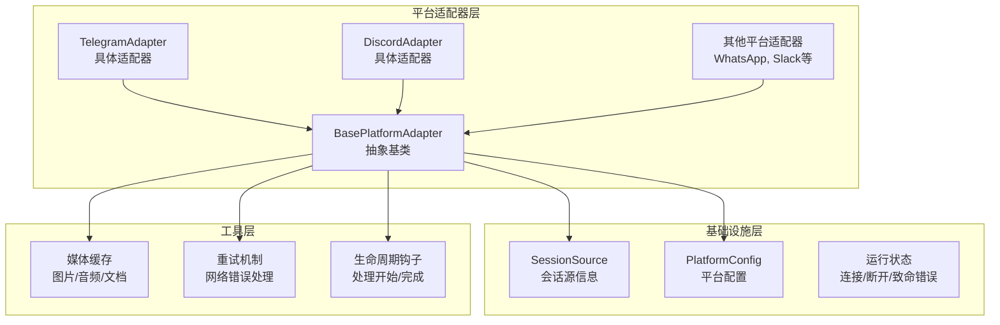

**图表来源**
- [gateway/platforms/base.py:470-520](file://gateway/platforms/base.py#L470-L520)
- [gateway/platforms/telegram.py:111-120](file://gateway/platforms/telegram.py#L111-L120)
- [gateway/platforms/discord.py:409-421](file://gateway/platforms/discord.py#L409-L421)

**章节来源**
- [gateway/platforms/base.py:1-80](file://gateway/platforms/base.py#L1-L80)
- [gateway/platforms/__init__.py:11-17](file://gateway/platforms/__init__.py#L11-L17)

## 核心组件

### 基础架构组件

#### 1. 消息类型枚举 (MessageType)
定义了平台支持的所有消息类型，确保跨平台的一致性：

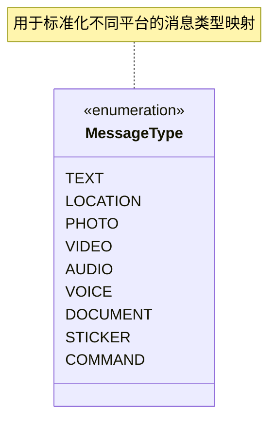

**图表来源**
- [gateway/platforms/base.py:367-378](file://gateway/platforms/base.py#L367-L378)

#### 2. 消息事件数据结构 (MessageEvent)
统一的消息事件表示，包含所有必要的元数据：

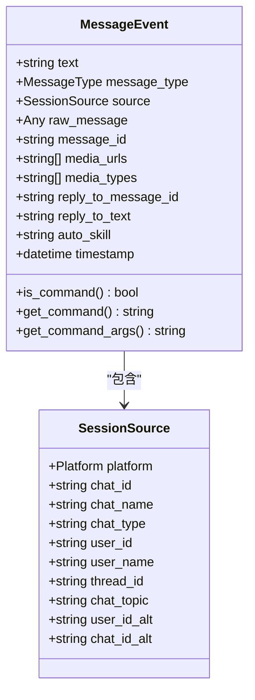

**图表来源**
- [gateway/platforms/base.py:380-434](file://gateway/platforms/base.py#L380-L434)
- [gateway/session.py:73-156](file://gateway/session.py#L73-L156)

#### 3. 发送结果数据结构 (SendResult)
标准化的发送操作结果：

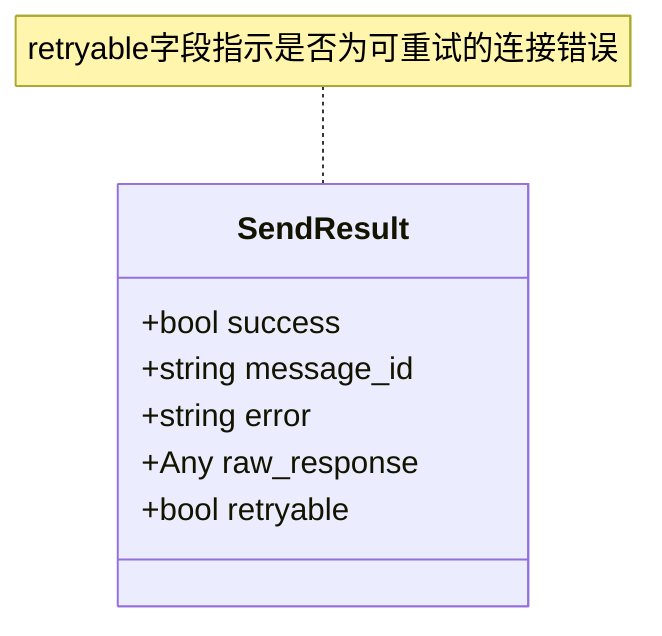

**图表来源**
- [gateway/platforms/base.py:436-444](file://gateway/platforms/base.py#L436-L444)

**章节来源**
- [gateway/platforms/base.py:367-444](file://gateway/platforms/base.py#L367-L444)
- [gateway/session.py:73-156](file://gateway/session.py#L73-L156)

## 架构概览

### 适配器基类设计模式

BasePlatformAdapter采用了抽象基类设计模式，定义了平台适配器的标准接口：

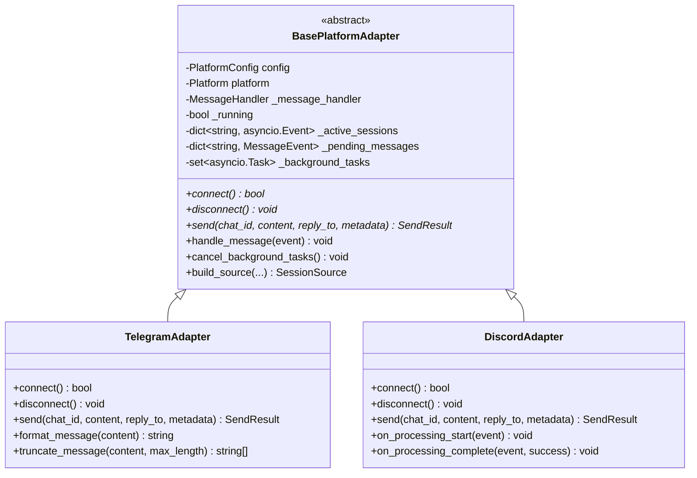

**图表来源**
- [gateway/platforms/base.py:470-632](file://gateway/platforms/base.py#L470-L632)
- [gateway/platforms/telegram.py:111-750](file://gateway/platforms/telegram.py#L111-L750)
- [gateway/platforms/discord.py:409-750](file://gateway/platforms/discord.py#L409-L750)

### 生命周期管理机制

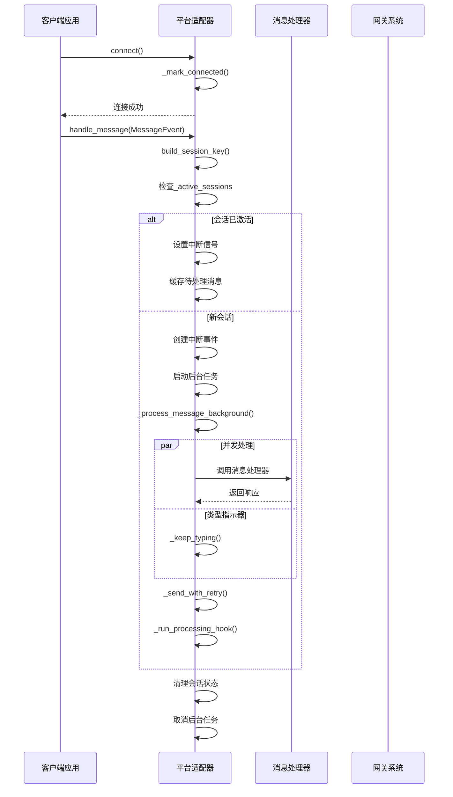

**图表来源**
- [gateway/platforms/base.py:1138-1525](file://gateway/platforms/base.py#L1138-L1525)

**章节来源**
- [gateway/platforms/base.py:470-632](file://gateway/platforms/base.py#L470-L632)
- [gateway/platforms/base.py:1138-1525](file://gateway/platforms/base.py#L1138-L1525)

## 详细组件分析

### 1. 消息事件处理系统

#### 1.1 会话键生成机制
会话键是消息路由和状态管理的核心标识符：

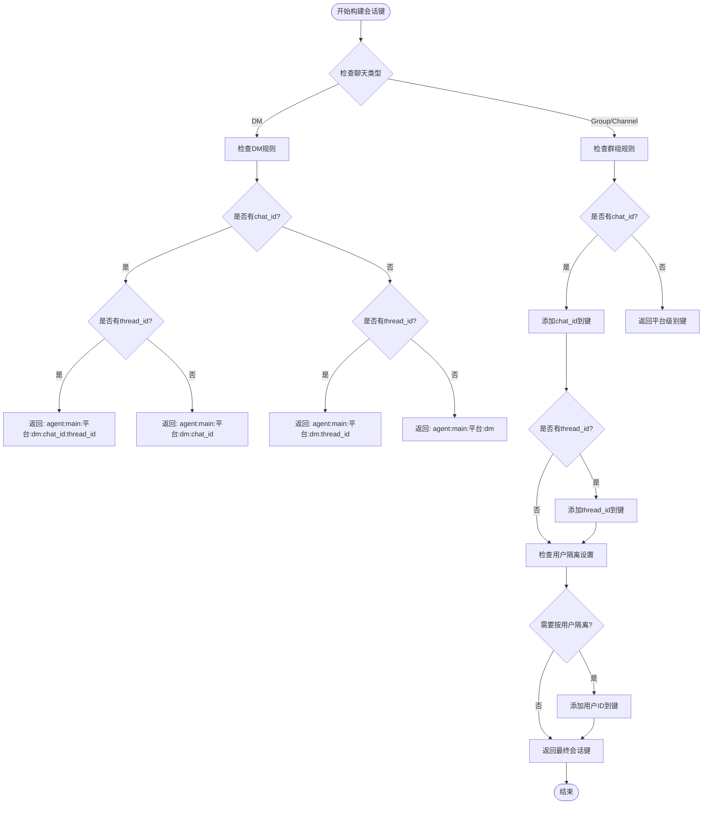

**图表来源**
- [gateway/session.py:444-500](file://gateway/session.py#L444-L500)

#### 1.2 并发处理和中断机制
系统支持多消息并发处理，同时提供中断能力：

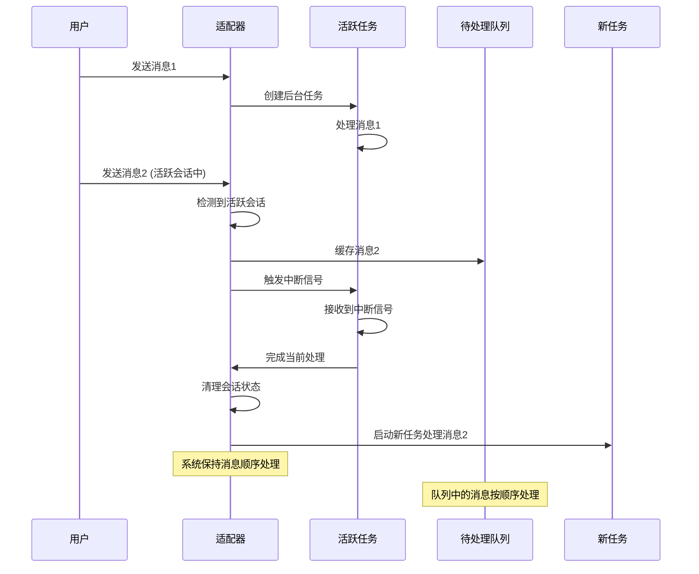

**图表来源**
- [gateway/platforms/base.py:1138-1226](file://gateway/platforms/base.py#L1138-L1226)

**章节来源**
- [gateway/session.py:444-500](file://gateway/session.py#L444-L500)
- [gateway/platforms/base.py:1138-1226](file://gateway/platforms/base.py#L1138-L1226)

### 2. 连接管理与状态监控

#### 2.1 运行状态管理
适配器实现了完整的运行状态监控：

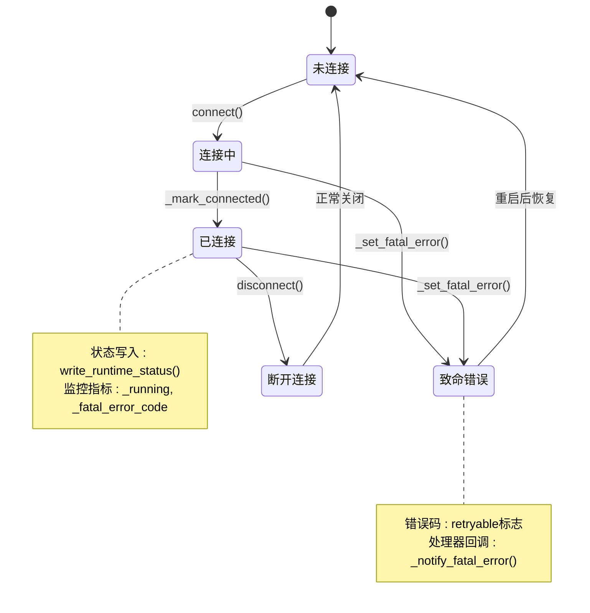

**图表来源**
- [gateway/platforms/base.py:524-568](file://gateway/platforms/base.py#L524-L568)

#### 2.2 网络错误重试机制
系统实现了智能的网络错误检测和重试策略：

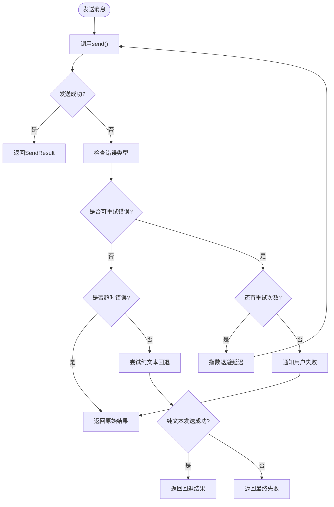

**图表来源**
- [gateway/platforms/base.py:1040-1121](file://gateway/platforms/base.py#L1040-L1121)

**章节来源**
- [gateway/platforms/base.py:524-568](file://gateway/platforms/base.py#L524-L568)
- [gateway/platforms/base.py:1040-1121](file://gateway/platforms/base.py#L1040-L1121)

### 3. 媒体处理和缓存系统

#### 3.1 媒体缓存架构
系统为不同类型的媒体内容提供了专门的缓存机制：

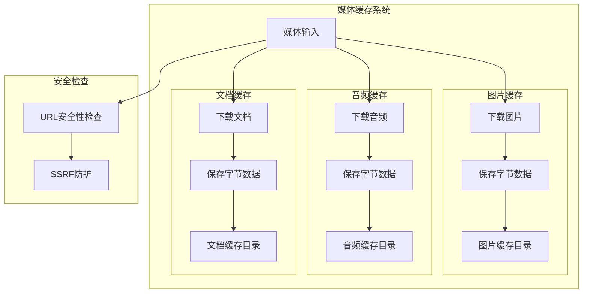

**图表来源**
- [gateway/platforms/base.py:85-192](file://gateway/platforms/base.py#L85-L192)
- [gateway/platforms/base.py:201-365](file://gateway/platforms/base.py#L201-L365)

#### 3.2 自动媒体提取和处理
系统能够自动从响应内容中提取媒体资源：

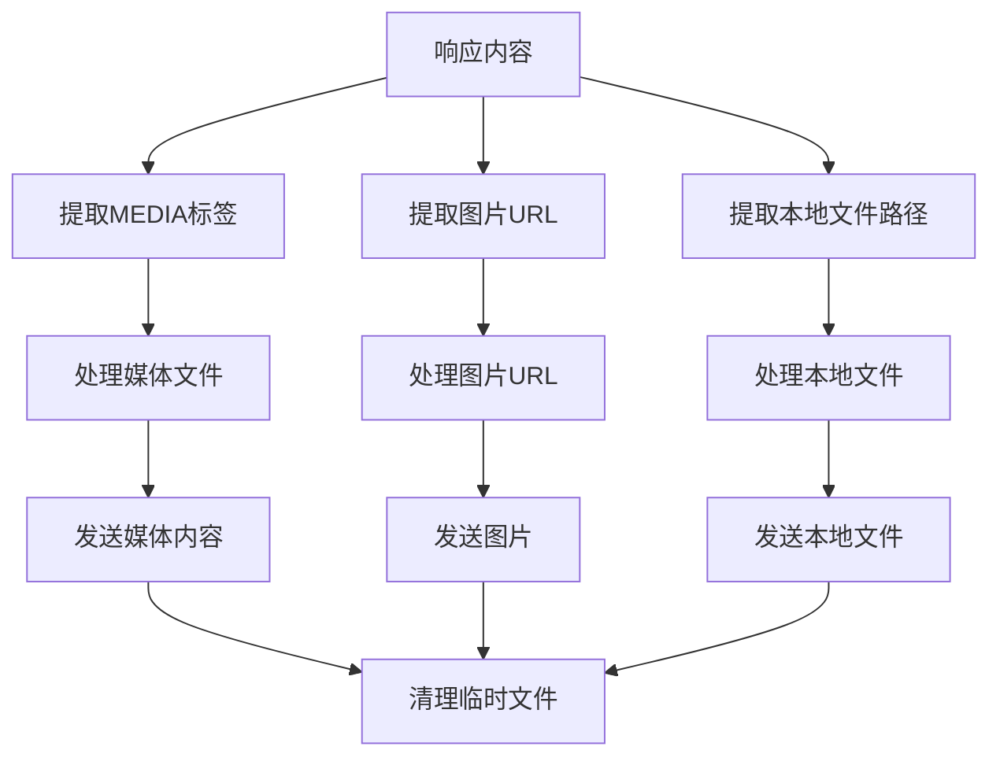

**图表来源**
- [gateway/platforms/base.py:848-956](file://gateway/platforms/base.py#L848-L956)

**章节来源**
- [gateway/platforms/base.py:85-192](file://gateway/platforms/base.py#L85-L192)
- [gateway/platforms/base.py:848-956](file://gateway/platforms/base.py#L848-L956)

### 4. 具体适配器实现示例

#### 4.1 Telegram适配器特性
Telegram适配器展示了如何扩展基类功能：

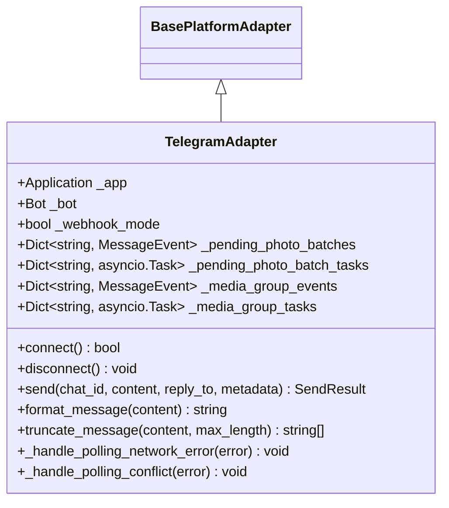

**图表来源**
- [gateway/platforms/telegram.py:111-158](file://gateway/platforms/telegram.py#L111-L158)

#### 4.2 Discord适配器特性
Discord适配器展示了高级功能的实现：

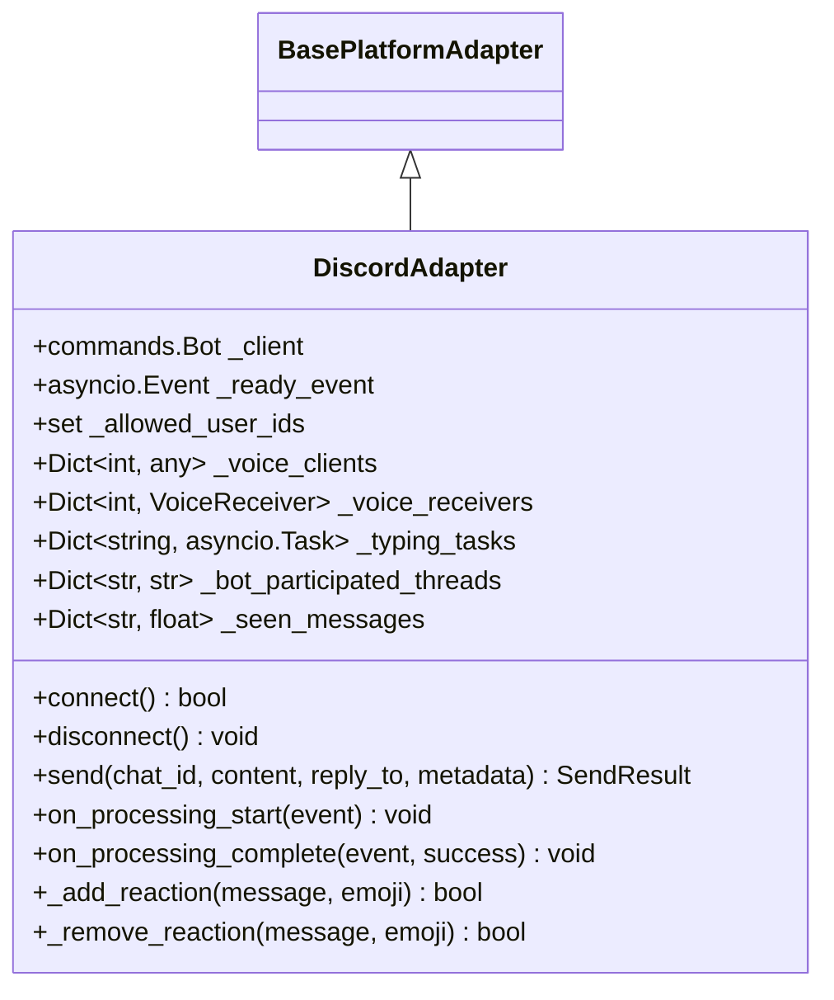

**图表来源**
- [gateway/platforms/discord.py:409-458](file://gateway/platforms/discord.py#L409-L458)

**章节来源**
- [gateway/platforms/telegram.py:111-158](file://gateway/platforms/telegram.py#L111-L158)
- [gateway/platforms/discord.py:409-458](file://gateway/platforms/discord.py#L409-L458)

## 依赖分析

### 组件耦合关系

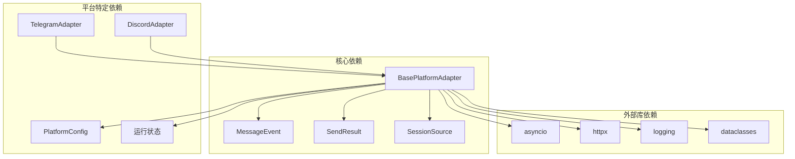

**图表来源**
- [gateway/platforms/base.py:14-31](file://gateway/platforms/base.py#L14-L31)
- [gateway/platforms/telegram.py:19-74](file://gateway/platforms/telegram.py#L19-L74)
- [gateway/platforms/discord.py:27-59](file://gateway/platforms/discord.py#L27-L59)

### 关键依赖关系

1. **配置系统依赖**: 适配器通过PlatformConfig获取平台特定配置
2. **会话管理依赖**: 使用SessionSource进行会话标识和路由
3. **状态监控依赖**: 通过运行状态接口监控连接状态
4. **媒体处理依赖**: 依赖HTTP客户端进行媒体下载和缓存

**章节来源**
- [gateway/platforms/base.py:14-31](file://gateway/platforms/base.py#L14-L31)
- [gateway/config.py:140-184](file://gateway/config.py#L140-L184)
- [gateway/session.py:73-156](file://gateway/session.py#L73-L156)

## 性能考虑

### 1. 并发处理优化
- 使用异步任务处理消息，避免阻塞主事件循环
- 实现会话级别的中断机制，支持快速响应用户命令
- 后台任务集合管理，便于优雅关闭和资源清理

### 2. 缓存策略优化
- 媒体文件本地缓存，减少重复下载
- 智能过期清理机制，控制磁盘空间使用
- 异步下载和处理，提高整体吞吐量

### 3. 网络重试优化
- 指数退避算法，避免对平台造成压力
- 错误分类处理，区分可重试和不可重试错误
- 最大重试次数限制，防止无限重试

## 故障排除指南

### 常见问题及解决方案

#### 1. 连接问题
**症状**: 适配器无法连接到平台
**可能原因**:
- 缺少或错误的认证凭据
- 网络连接不稳定
- 平台API限制

**解决步骤**:
1. 验证配置文件中的令牌设置
2. 检查网络连接和防火墙设置
3. 查看运行状态日志获取详细错误信息

#### 2. 消息处理延迟
**症状**: 消息响应时间过长
**可能原因**:
- 平台API限流
- 媒体文件下载缓慢
- 并发任务过多

**优化建议**:
1. 实施适当的速率限制
2. 使用媒体缓存减少下载
3. 调整并发处理参数

#### 3. 媒体传输失败
**症状**: 图片、音频或视频无法正确传输
**可能原因**:
- URL安全性检查失败
- 文件格式不受支持
- 磁盘空间不足

**处理方案**:
1. 检查URL是否符合安全要求
2. 验证文件格式兼容性
3. 清理缓存目录释放空间

**章节来源**
- [gateway/platforms/base.py:545-568](file://gateway/platforms/base.py#L545-L568)
- [gateway/platforms/base.py:1021-1039](file://gateway/platforms/base.py#L1021-L1039)

## 结论

Hermes Agent平台适配器基类设计体现了以下核心优势：

1. **高度抽象和可扩展性**: 通过抽象基类定义统一接口，支持多种平台的无缝集成
2. **强大的并发处理能力**: 实现了消息级别的并发处理和中断机制
3. **完善的错误处理**: 提供了智能的网络错误检测和重试策略
4. **灵活的媒体处理**: 支持多种媒体格式的本地缓存和传输
5. **健壮的状态管理**: 实现了完整的连接状态监控和生命周期管理

该设计为Hermes Agent平台提供了坚实的基础，使得开发者可以专注于具体平台的功能实现，而无需关心底层的通用逻辑。

## 附录

### 最佳实践指南

#### 1. 继承和扩展基类
- 在子类中实现必需的抽象方法
- 重写生命周期钩子以添加平台特定功能
- 正确处理异常和错误状态

#### 2. 配置管理
- 使用PlatformConfig进行平台配置
- 实现环境变量覆盖机制
- 验证配置的有效性和完整性

#### 3. 性能优化
- 合理使用异步编程模式
- 实施适当的缓存策略
- 监控和调整并发参数

#### 4. 错误处理
- 区分可重试和不可重试错误
- 实现优雅的降级策略
- 提供清晰的错误报告机制

### 常见陷阱避免

1. **忽略异常处理**: 确保所有异步操作都有适当的异常处理
2. **过度阻塞**: 避免在事件循环中执行长时间同步操作
3. **资源泄漏**: 确保正确清理会话状态和后台任务
4. **配置错误**: 验证所有配置参数的有效性
5. **竞态条件**: 注意多线程和异步操作中的竞态条件