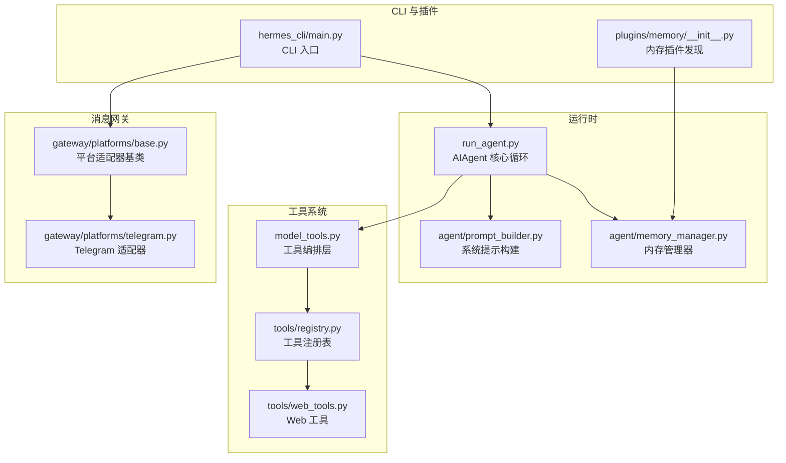
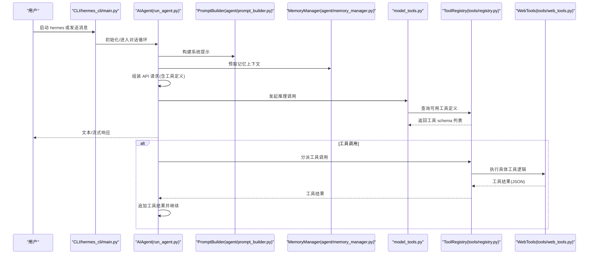
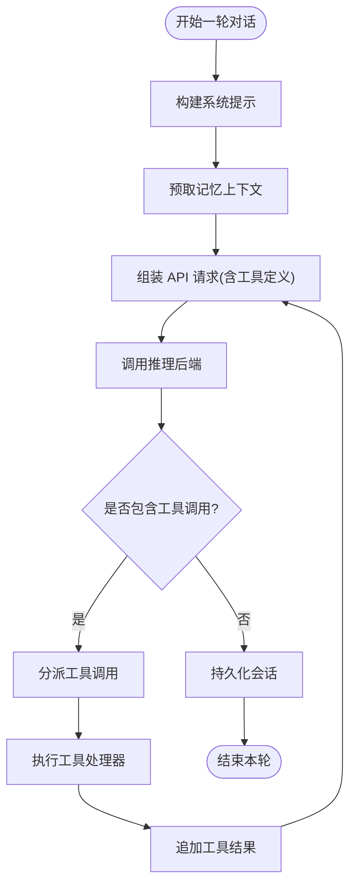
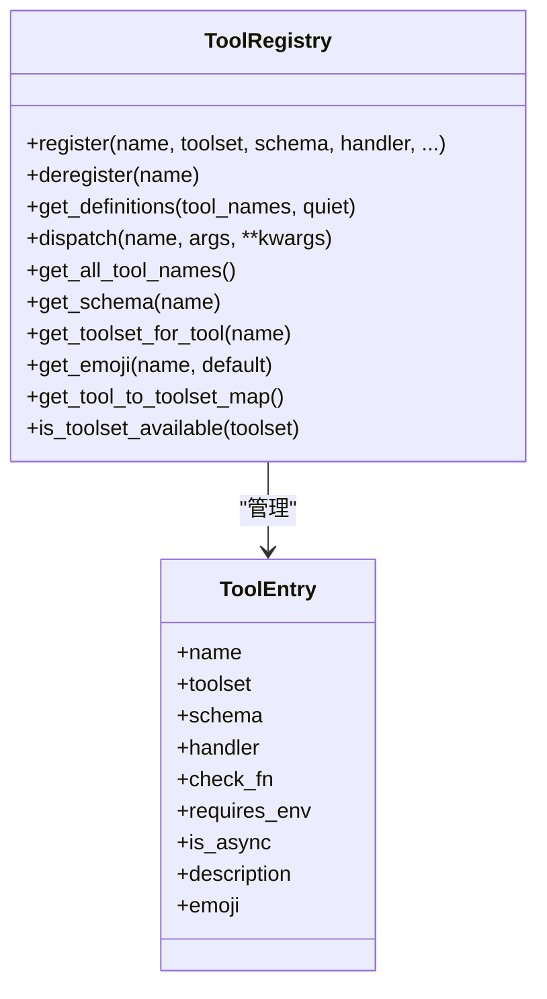
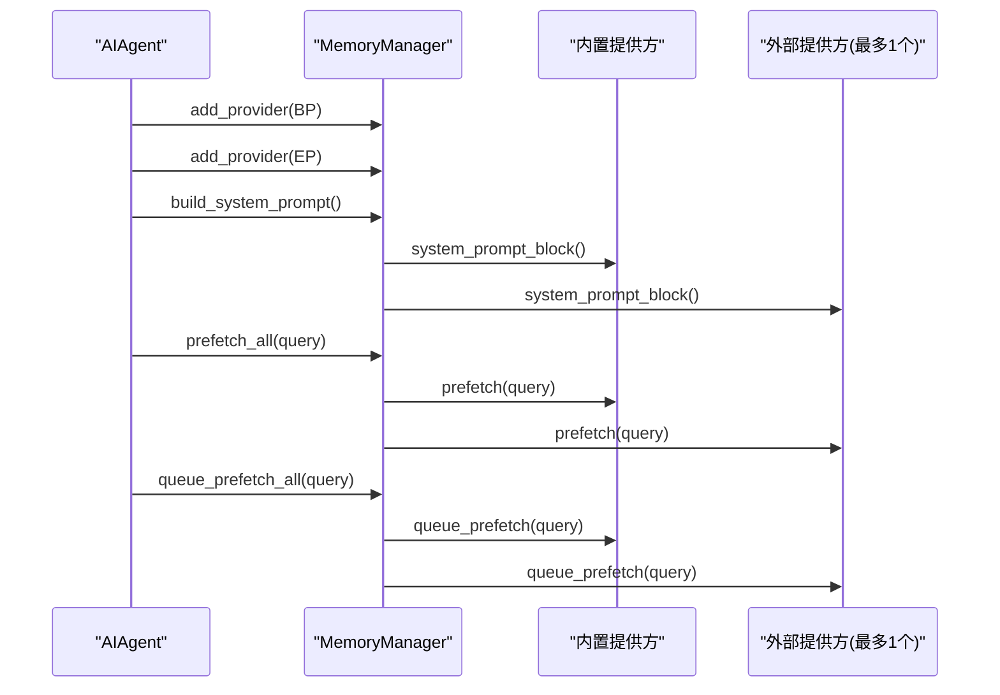
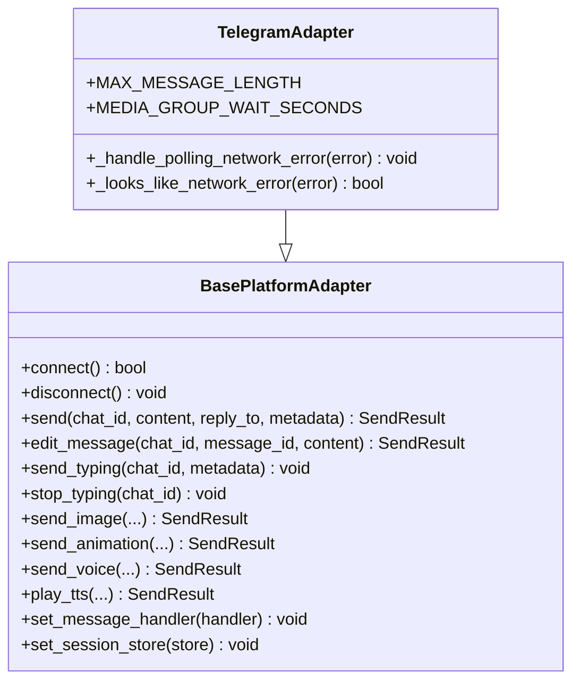
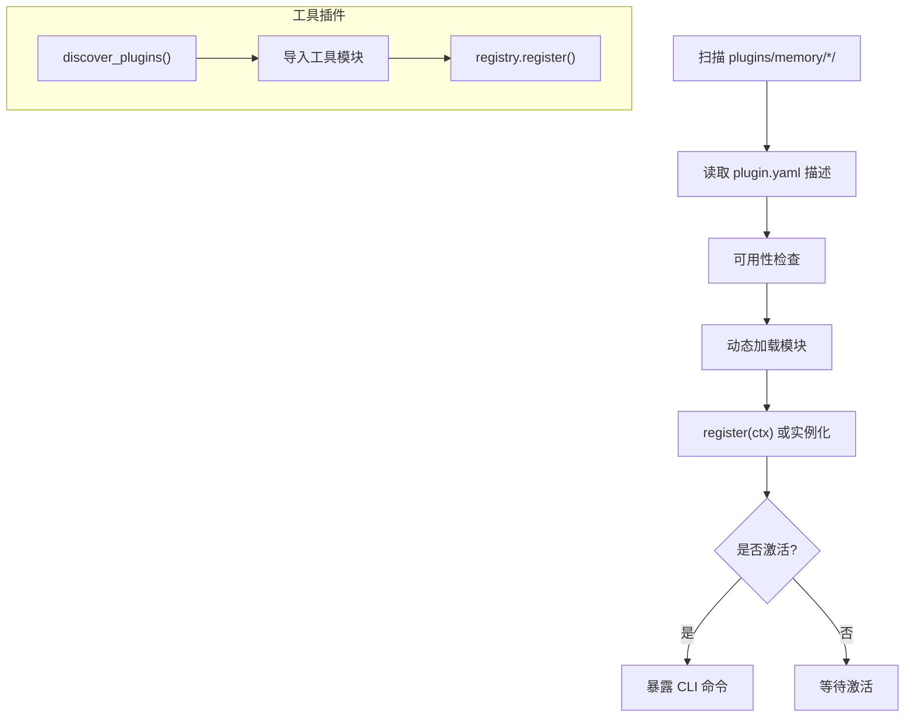
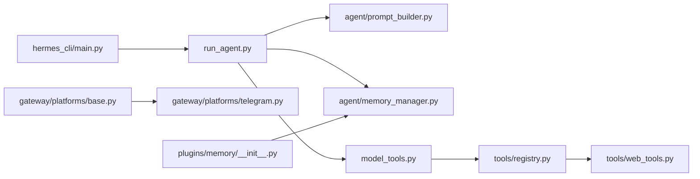

# 开发者指南

<cite>
**本文引用的文件**
- [README.md](file://README.md)
- [CONTRIBUTING.md](file://CONTRIBUTING.md)
- [run_agent.py](file://run_agent.py)
- [agent/memory_manager.py](file://agent/memory_manager.py)
- [agent/prompt_builder.py](file://agent/prompt_builder.py)
- [gateway/platforms/base.py](file://gateway/platforms/base.py)
- [gateway/platforms/telegram.py](file://gateway/platforms/telegram.py)
- [tools/registry.py](file://tools/registry.py)
- [model_tools.py](file://model_tools.py)
- [tools/web_tools.py](file://tools/web_tools.py)
- [plugins/memory/__init__.py](file://plugins/memory/__init__.py)
- [hermes_cli/main.py](file://hermes_cli/main.py)
- [gateway/__init__.py](file://gateway/__init__.py)
- [tools/__init__.py](file://tools/__init__.py)
</cite>

## 目录
1. [简介](#简介)
2. [项目结构](#项目结构)
3. [核心组件](#核心组件)
4. [架构总览](#架构总览)
5. [详细组件分析](#详细组件分析)
6. [依赖关系分析](#依赖关系分析)
7. [性能考量](#性能考量)
8. [故障排查指南](#故障排查指南)
9. [结论](#结论)
10. [附录](#附录)

## 简介
本指南面向希望参与 Hermes Agent 开发与扩展的工程师，系统性阐述代理引擎、消息网关、工具系统、内存管理等核心模块的设计理念与实现细节；提供平台适配器与工具开发最佳实践；说明插件扩展机制（内存插件、工具插件）；并给出代码贡献流程、测试与规范要求、API 参考与数据模型说明。

## 项目结构
Hermes Agent 采用分层清晰的模块化组织：运行时核心在 run_agent.py 中的 AIAgent 类，工具系统通过自注册的工具注册表集中管理，消息网关统一接入多平台，CLI 提供交互入口与配置管理，插件体系支持可选能力扩展。

图示来源
- [run_agent.py:1-200](file://run_agent.py#L1-L200)
- [agent/prompt_builder.py:1-200](file://agent/prompt_builder.py#L1-L200)
- [agent/memory_manager.py:1-200](file://agent/memory_manager.py#L1-L200)
- [model_tools.py:1-200](file://model_tools.py#L1-L200)
- [tools/registry.py:1-200](file://tools/registry.py#L1-L200)
- [tools/web_tools.py:1-200](file://tools/web_tools.py#L1-L200)
- [gateway/platforms/base.py:1-800](file://gateway/platforms/base.py#L1-L800)
- [gateway/platforms/telegram.py:1-200](file://gateway/platforms/telegram.py#L1-L200)
- [hermes_cli/main.py:1-200](file://hermes_cli/main.py#L1-L200)
- [plugins/memory/__init__.py:1-318](file://plugins/memory/__init__.py#L1-L318)

章节来源
- [README.md:1-176](file://README.md#L1-L176)
- [CONTRIBUTING.md:114-182](file://CONTRIBUTING.md#L114-L182)

## 核心组件
- 代理引擎（AIAgent）
  - 负责对话循环、系统提示构建、工具调用、上下文压缩与会话持久化。
  - 关键职责：构建系统提示、组装 API 请求参数、调用推理后端、处理工具调用结果、在接近上下文上限时进行自动压缩。
- 工具系统
  - 自注册工具注册表集中管理工具定义、处理器与可用性检查；model_tools 作为薄编排层触发发现并提供公共 API。
  - 支持同步与异步工具处理器，统一错误格式返回。
- 内存管理
  - MemoryManager 统一内置与外部（单个）内存插件，按需预取与合并上下文，失败不阻断其他提供方。
- 消息网关
  - 平台适配器基类定义通用接口与消息事件模型；Telegram 等具体适配器实现连接、发送、媒体缓存与命令解析。
- CLI 与插件
  - CLI 入口负责参数解析、日志初始化与组件状态展示；内存插件发现与加载仅限于内置插件目录，且同一时间仅允许一个外部插件生效。

章节来源
- [run_agent.py:108-200](file://run_agent.py#L108-L200)
- [tools/registry.py:24-200](file://tools/registry.py#L24-L200)
- [model_tools.py:128-200](file://model_tools.py#L128-L200)
- [agent/memory_manager.py:72-200](file://agent/memory_manager.py#L72-L200)
- [gateway/platforms/base.py:470-800](file://gateway/platforms/base.py#L470-L800)
- [hermes_cli/main.py:1-200](file://hermes_cli/main.py#L1-L200)
- [plugins/memory/__init__.py:1-318](file://plugins/memory/__init__.py#L1-L318)

## 架构总览
下图展示了从用户输入到工具执行与响应输出的端到端流程，以及各子系统之间的耦合关系。

图示来源
- [run_agent.py:108-200](file://run_agent.py#L108-L200)
- [agent/prompt_builder.py:1-200](file://agent/prompt_builder.py#L1-L200)
- [agent/memory_manager.py:170-200](file://agent/memory_manager.py#L170-L200)
- [model_tools.py:128-200](file://model_tools.py#L128-L200)
- [tools/registry.py:110-162](file://tools/registry.py#L110-L162)
- [tools/web_tools.py:1-200](file://tools/web_tools.py#L1-L200)

## 详细组件分析

### 代理引擎（AIAgent）
- 设计要点
  - 安全输出：对 stdout/stderr 进行包装以避免管道中断导致崩溃。
  - 迭代预算：线程安全的迭代次数限制，支持子代理回退额度。
  - 异步桥接：为同步上下文提供稳定的事件循环，避免“事件循环已关闭”问题。
- 数据流
  - 输入：用户消息、会话上下文、平台注入信息。
  - 处理：构建系统提示、选择工具、调用推理后端、执行工具、上下文压缩。
  - 输出：最终文本或流式工具输出。
- 错误处理
  - 工具执行异常统一捕获并返回标准错误格式。
  - 对不可恢复致命错误设置标记并通过状态上报。

图示来源
- [run_agent.py:108-200](file://run_agent.py#L108-L200)

章节来源
- [run_agent.py:108-200](file://run_agent.py#L108-L200)

### 工具系统（注册表与编排）
- 注册表（ToolRegistry）
  - 工具元数据：名称、工具集、Schema、处理器、可用性检查函数、环境变量需求、是否异步、描述与表情符号。
  - 查询与分派：根据启用集合过滤可用工具，异步处理器通过统一桥接执行。
- 编排层（model_tools）
  - 触发工具模块导入以完成自注册；提供工具定义查询、工具分派、工具集可用性检查等公共 API。
- Web 工具
  - 后端选择：支持 Exa、Firecrawl、Parallel、Tavily；优先级由配置与密钥存在情况决定。
  - LLM 辅助摘要：使用 OpenRouter/Gemini 对提取内容进行智能摘要以降低 token 使用。

图示来源
- [tools/registry.py:24-200](file://tools/registry.py#L24-L200)

章节来源
- [tools/registry.py:24-200](file://tools/registry.py#L24-L200)
- [model_tools.py:128-200](file://model_tools.py#L128-L200)
- [tools/web_tools.py:75-121](file://tools/web_tools.py#L75-L121)

### 内存管理（MemoryManager）
- 单一外部插件约束：仅允许一个非内置内存提供方，冲突时拒绝并告警。
- 上下文封装：对召回上下文进行围栏包裹，防止模型将其视为用户输入。
- 失败隔离：任一提供方失败不影响其他提供方；预取与后台队列预取均具备容错。

图示来源
- [agent/memory_manager.py:72-200](file://agent/memory_manager.py#L72-L200)

章节来源
- [agent/memory_manager.py:72-200](file://agent/memory_manager.py#L72-L200)

### 消息网关（平台适配器）
- 基类（BasePlatformAdapter）
  - 定义统一接口：连接、断开、发送、编辑、打字指示、媒体处理、致命错误上报。
  - 消息事件模型：标准化文本、图片、音频、文档、命令等类型，并保留回复上下文。
  - 缓存策略：图片、音频、文档本地缓存，避免平台 URL 过期与 SSRF 风险。
- Telegram 适配器
  - 支持论坛主题（线程）、媒体批处理、MarkdownV2 转义与清理、轮询网络错误重连策略、审批按钮状态管理等。

图示来源
- [gateway/platforms/base.py:470-800](file://gateway/platforms/base.py#L470-L800)
- [gateway/platforms/telegram.py:111-200](file://gateway/platforms/telegram.py#L111-L200)

章节来源
- [gateway/platforms/base.py:470-800](file://gateway/platforms/base.py#L470-L800)
- [gateway/platforms/telegram.py:111-200](file://gateway/platforms/telegram.py#L111-L200)

### 插件系统（内存插件与工具插件）
- 内存插件
  - 发现机制：扫描 plugins/memory/<name>/ 目录，读取 plugin.yaml 获取描述，轻量可用性检查。
  - 加载机制：支持 register(ctx) 模式或直接实例化 MemoryProvider 子类；仅允许一个外部插件激活。
  - CLI 命令：仅对当前激活的内存插件暴露 CLI 子命令。
- 工具插件
  - 通过 hermes_cli.plugins 发现并注册；工具模块导入时触发 registry.register() 完成自注册。
  - model_tools 在启动阶段集中导入工具模块并触发发现，随后提供统一 API。

图示来源
- [plugins/memory/__init__.py:32-318](file://plugins/memory/__init__.py#L32-L318)
- [model_tools.py:172-185](file://model_tools.py#L172-L185)

章节来源
- [plugins/memory/__init__.py:32-318](file://plugins/memory/__init__.py#L32-L318)
- [model_tools.py:172-185](file://model_tools.py#L172-L185)

### CLI 与运行入口
- hermes_cli/main.py
  - 参数解析与配置覆盖（支持 --profile/-p），环境变量加载，集中日志初始化。
  - 组件状态展示、服务安装/卸载、网关生命周期控制、诊断命令等。
- 包导出与懒加载
  - tools/__init__.py 明确最小导入副作用，避免在配置尚未就绪时加载完整工具栈。

章节来源
- [hermes_cli/main.py:1-200](file://hermes_cli/main.py#L1-L200)
- [tools/__init__.py:1-26](file://tools/__init__.py#L1-L26)

## 依赖关系分析
- 运行时核心
  - run_agent.py 依赖 prompt_builder、memory_manager、model_tools、tools.* 等模块。
- 工具系统
  - model_tools 依赖 tools/registry 与 toolsets；工具模块在导入时注册自身。
- 网关
  - 平台适配器依赖 gateway.config、gateway.session、hermes_constants；Telegram 适配器依赖 python-telegram-bot。
- 插件
  - 内存插件发现与加载独立于通用插件系统，仅限内置目录扫描与按需加载。

图示来源
- [run_agent.py:63-104](file://run_agent.py#L63-L104)
- [model_tools.py:29-32](file://model_tools.py#L29-L32)
- [tools/registry.py:1-22](file://tools/registry.py#L1-L22)
- [gateway/platforms/base.py:28-31](file://gateway/platforms/base.py#L28-L31)
- [plugins/memory/__init__.py:1-318](file://plugins/memory/__init__.py#L1-L318)

章节来源
- [run_agent.py:63-104](file://run_agent.py#L63-L104)
- [model_tools.py:29-32](file://model_tools.py#L29-L32)
- [tools/registry.py:1-22](file://tools/registry.py#L1-L22)
- [gateway/platforms/base.py:28-31](file://gateway/platforms/base.py#L28-L31)
- [plugins/memory/__init__.py:1-318](file://plugins/memory/__init__.py#L1-L318)

## 性能考量
- 事件循环复用
  - 通过持久化事件循环避免“事件循环已关闭”错误，减少异步客户端重建成本。
- 工具并发
  - 工具执行采用线程池与独立事件循环，避免主线程阻塞与资源竞争。
- 上下文压缩
  - 接近上下文上限时自动压缩，降低 token 使用与延迟。
- 缓存与重试
  - 平台媒体缓存与指数退避重试提升可靠性与吞吐。

## 故障排查指南
- 常见问题定位
  - 工具执行异常：查看工具分派日志与统一错误格式返回；确认 check_fn 与环境变量满足条件。
  - 网关连接失败：关注平台适配器的致命错误码与重试策略；Telegram 轮询网络错误有专门重连逻辑。
  - 内存插件冲突：仅允许一个外部内存插件，重复注册会告警并拒绝。
- 诊断命令
  - hermes doctor：检查配置与依赖；hermes status：查看组件状态；hermes gateway status：查看网关状态。
- 日志与调试
  - CLI 初始化集中日志；Web 工具支持调试模式输出详细调用与压缩指标。

章节来源
- [tools/registry.py:144-162](file://tools/registry.py#L144-L162)
- [gateway/platforms/base.py:545-568](file://gateway/platforms/base.py#L545-L568)
- [plugins/memory/__init__.py:88-96](file://plugins/memory/__init__.py#L88-L96)
- [CONTRIBUTING.md:584-637](file://CONTRIBUTING.md#L584-L637)

## 结论
Hermes Agent 通过模块化与自注册机制实现了高内聚低耦合的工具系统，借助 MemoryManager 与 PromptBuilder 将记忆与系统提示整合进推理循环，同时以平台适配器抽象实现多渠道接入。开发者可基于现有框架快速扩展工具、平台与内存插件，遵循贡献规范与安全准则即可稳定交付高质量功能。

## 附录

### 平台适配器开发指南
- 继承与实现
  - 继承 BasePlatformAdapter，实现 connect、disconnect、send 等抽象方法。
  - 使用 MessageEvent 标准化消息；必要时扩展媒体处理与命令解析。
- 健壮性
  - 实现致命错误上报与状态写入；对瞬时连接错误进行可重试判定。
- 示例参考
  - TelegramAdapter 的媒体批处理、MarkdownV2 转义与轮询网络错误处理策略。

章节来源
- [gateway/platforms/base.py:470-800](file://gateway/platforms/base.py#L470-L800)
- [gateway/platforms/telegram.py:111-200](file://gateway/platforms/telegram.py#L111-L200)

### 工具开发最佳实践
- 自注册流程
  - 在工具模块顶层注册工具：schema、handler、check_fn、requires_env、is_async、emoji 等。
  - 在 model_tools 的模块列表中加入该工具模块以触发发现。
- 参数与校验
  - 使用 OpenAI 函数调用格式定义参数；check_fn 返回可用性；错误统一返回 JSON 错误对象。
- 平台集成
  - 如涉及媒体或外部 API，参考平台适配器的缓存与安全策略（URL 安全检查、SSRF 防护）。

章节来源
- [CONTRIBUTING.md:239-300](file://CONTRIBUTING.md#L239-L300)
- [tools/registry.py:56-106](file://tools/registry.py#L56-L106)
- [model_tools.py:132-171](file://model_tools.py#L132-L171)
- [gateway/platforms/base.py:131-171](file://gateway/platforms/base.py#L131-L171)

### 插件扩展机制
- 内存插件
  - 在 plugins/memory/<name>/ 下实现 register(ctx) 或 MemoryProvider 子类；提供 plugin.yaml 描述与可用性检查。
  - 仅允许一个外部插件激活；CLI 命令仅对当前激活插件暴露。
- 工具插件
  - 通过 discover_plugins() 动态发现并注册；工具模块导入时完成 self-registration。

章节来源
- [plugins/memory/__init__.py:32-318](file://plugins/memory/__init__.py#L32-L318)
- [model_tools.py:172-185](file://model_tools.py#L172-L185)

### 代码贡献指南
- 开发环境
  - 使用 uv 创建 Python 3.11 虚拟环境；安装可选依赖与浏览器工具；准备 ~/.hermes 目录与配置文件。
- 测试
  - 使用 pytest 运行测试套件；建议跨平台验证文件路径、进程管理与终端处理差异。
- 规范
  - 遵循 PEP 8；注释解释非显而易见的权衡；错误处理捕获具体异常并记录日志；跨平台兼容注意 Unix 特性差异。

章节来源
- [CONTRIBUTING.md:52-111](file://CONTRIBUTING.md#L52-L111)
- [CONTRIBUTING.md:230-236](file://CONTRIBUTING.md#L230-L236)
- [CONTRIBUTING.md:516-553](file://CONTRIBUTING.md#L516-L553)

### API 参考与数据模型
- 工具注册表
  - ToolEntry：工具元数据字段集合。
  - ToolRegistry：注册、查询、分派与可用性检查。
- 系统提示构建
  - 提供默认身份、记忆指导、会话检索与技能使用指导常量；扫描上下文文件中的潜在注入风险。
- 网关消息模型
  - MessageEvent：标准化消息体、类型、媒体、回复上下文与命令解析。
  - SendResult：发送结果与可重试标记。

章节来源
- [tools/registry.py:24-200](file://tools/registry.py#L24-L200)
- [agent/prompt_builder.py:134-200](file://agent/prompt_builder.py#L134-L200)
- [gateway/platforms/base.py:380-434](file://gateway/platforms/base.py#L380-L434)