# 内存插件开发

<cite>
**本文档引用的文件**
- [plugins/memory/__init__.py](file://plugins/memory/__init__.py)
- [agent/memory_provider.py](file://agent/memory_provider.py)
- [agent/builtin_memory_provider.py](file://agent/builtin_memory_provider.py)
- [hermes_cli/memory_setup.py](file://hermes_cli/memory_setup.py)
- [plugins/memory/byterover/__init__.py](file://plugins/memory/byterover/__init__.py)
- [plugins/memory/holographic/__init__.py](file://plugins/memory/holographic/__init__.py)
- [plugins/memory/honcho/__init__.py](file://plugins/memory/honcho/__init__.py)
- [plugins/memory/mem0/__init__.py](file://plugins/memory/mem0/__init__.py)
- [plugins/memory/openviking/__init__.py](file://plugins/memory/openviking/__init__.py)
- [plugins/memory/supermemory/__init__.py](file://plugins/memory/supermemory/__init__.py)
- [plugins/memory/hindsight/__init__.py](file://plugins/memory/hindsight/__init__.py)
- [plugins/memory/retaindb/__init__.py](file://plugins/memory/retaindb/__init__.py)
</cite>

## 目录
1. [简介](#简介)
2. [项目结构](#项目结构)
3. [核心组件](#核心组件)
4. [架构概览](#架构概览)
5. [详细组件分析](#详细组件分析)
6. [依赖关系分析](#依赖关系分析)
7. [性能考虑](#性能考虑)
8. [故障排除指南](#故障排除指南)
9. [结论](#结论)
10. [附录](#附录)

## 简介

Hermes Agent 内存插件系统为智能体提供了可扩展的持久化记忆能力。该系统支持多种内存提供程序，包括本地文件存储、云端服务集成和第三方内存管理平台。

内存插件系统的核心特性包括：
- 统一的 MemoryProvider 接口规范
- 多种现成内存插件实现
- 灵活的配置管理系统
- 异步处理和后台队列
- 完整的生命周期管理

## 项目结构

内存插件系统采用模块化设计，主要包含以下组件：

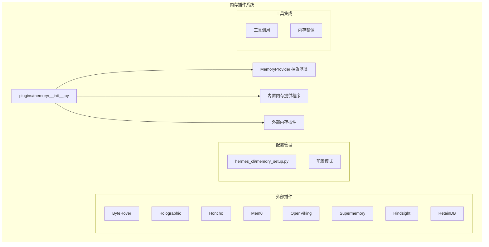

**图表来源**
- [plugins/memory/__init__.py:1-318](file://plugins/memory/__init__.py#L1-L318)
- [agent/memory_provider.py:1-232](file://agent/memory_provider.py#L1-L232)

**章节来源**
- [plugins/memory/__init__.py:1-318](file://plugins/memory/__init__.py#L1-L318)
- [agent/memory_provider.py:1-232](file://agent/memory_provider.py#L1-L232)

## 核心组件

### MemoryProvider 抽象基类

MemoryProvider 是所有内存插件的基础抽象，定义了统一的接口规范：

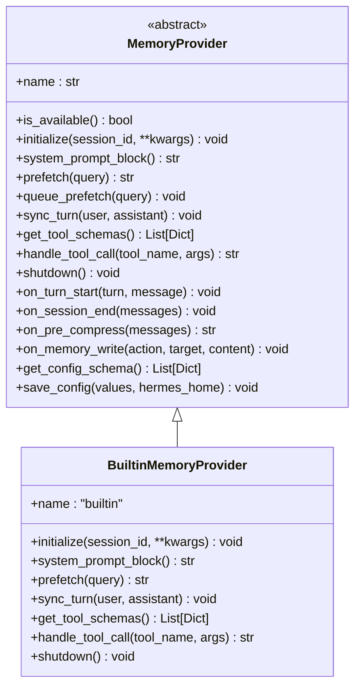

**图表来源**
- [agent/memory_provider.py:42-232](file://agent/memory_provider.py#L42-L232)
- [agent/builtin_memory_provider.py:24-115](file://agent/builtin_memory_provider.py#L24-L115)

### 插件发现和加载机制

内存插件系统通过自动发现机制扫描 `plugins/memory/` 目录中的插件：

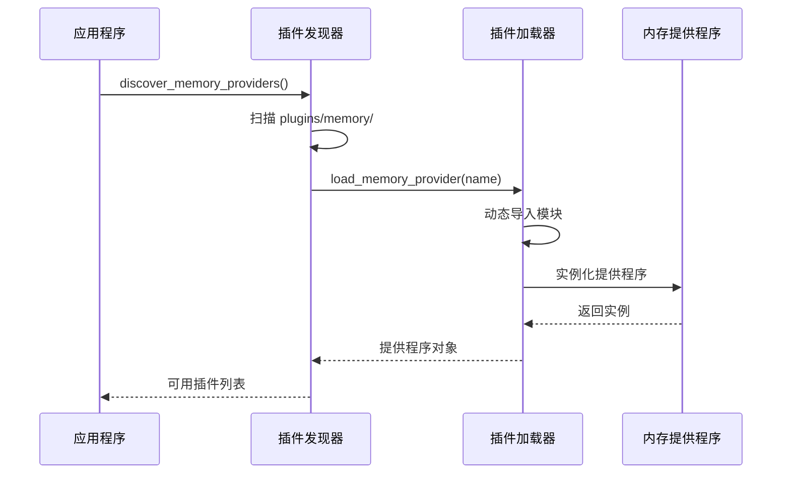

**图表来源**
- [plugins/memory/__init__.py:32-196](file://plugins/memory/__init__.py#L32-L196)

**章节来源**
- [plugins/memory/__init__.py:32-196](file://plugins/memory/__init__.py#L32-L196)
- [agent/memory_provider.py:42-232](file://agent/memory_provider.py#L42-L232)

## 架构概览

内存插件系统的整体架构采用分层设计：

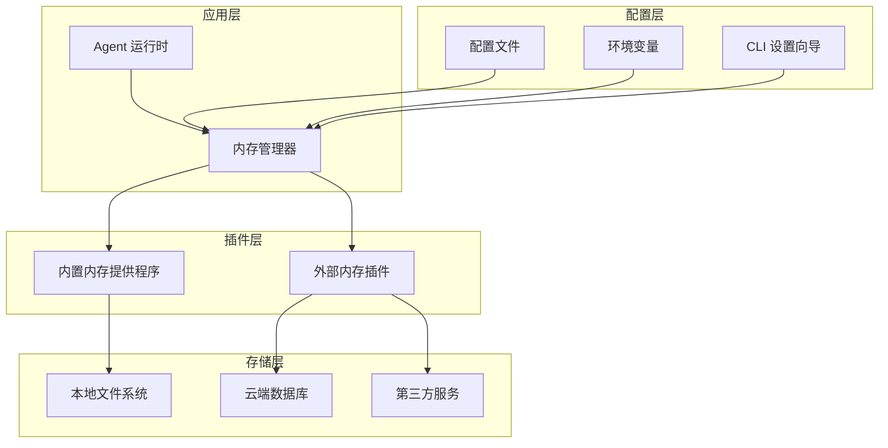

**图表来源**
- [agent/builtin_memory_provider.py:1-115](file://agent/builtin_memory_provider.py#L1-L115)
- [hermes_cli/memory_setup.py:1-524](file://hermes_cli/memory_setup.py#L1-L524)

## 详细组件分析

### ByteRover 内存插件

ByteRover 是基于本地 CLI 工具的内存管理系统：

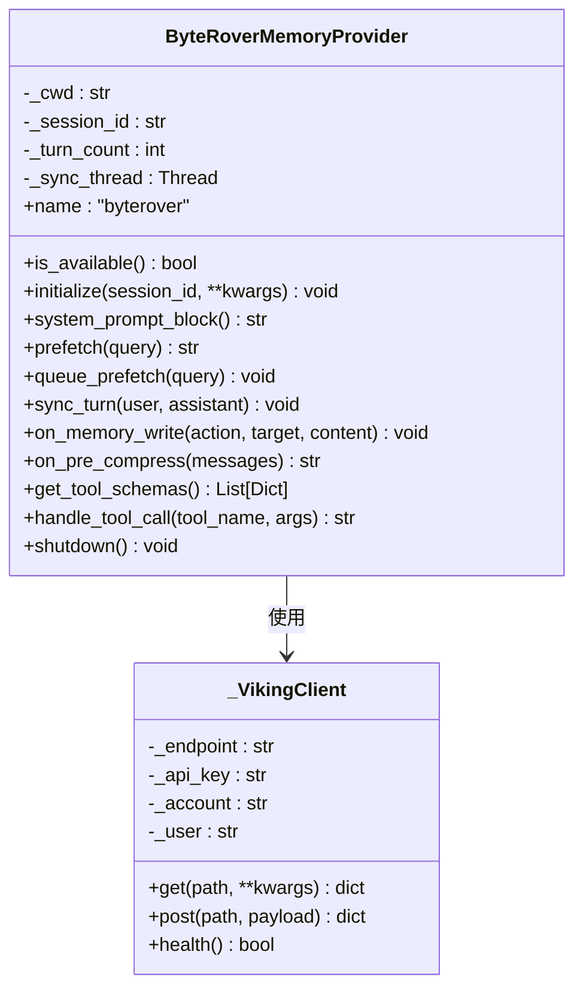

**图表来源**
- [plugins/memory/byterover/__init__.py:171-384](file://plugins/memory/byterover/__init__.py#L171-L384)

**章节来源**
- [plugins/memory/byterover/__init__.py:1-384](file://plugins/memory/byterover/__init__.py#L1-L384)

### Holographic 内存插件

Holographic 提供结构化事实存储和实体解析功能：

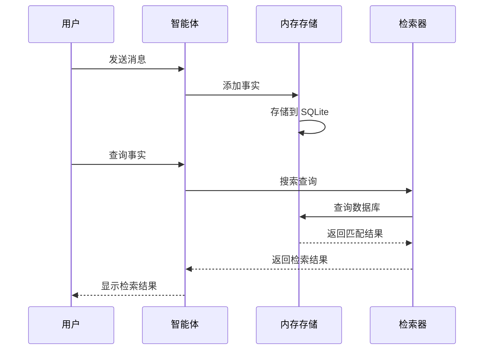

**图表来源**
- [plugins/memory/holographic/__init__.py:114-408](file://plugins/memory/holographic/__init__.py#L114-L408)

**章节来源**
- [plugins/memory/holographic/__init__.py:1-408](file://plugins/memory/holographic/__init__.py#L1-L408)

### Honcho 内存插件

Honcho 提供 AI 原生的跨会话用户建模：

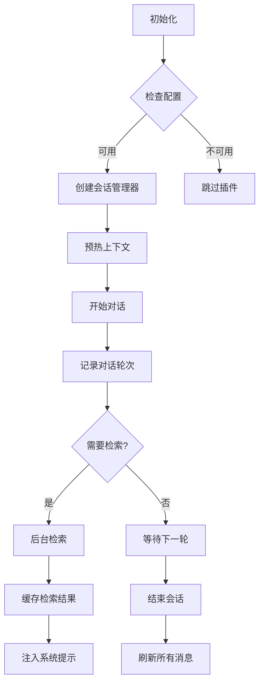

**图表来源**
- [plugins/memory/honcho/__init__.py:195-715](file://plugins/memory/honcho/__init__.py#L195-L715)

**章节来源**
- [plugins/memory/honcho/__init__.py:1-715](file://plugins/memory/honcho/__init__.py#L1-L715)

### Mem0 内存插件

Mem0 提供服务器端事实提取和语义搜索：

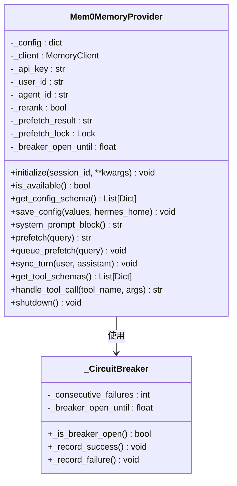

**图表来源**
- [plugins/memory/mem0/__init__.py:119-374](file://plugins/memory/mem0/__init__.py#L119-L374)

**章节来源**
- [plugins/memory/mem0/__init__.py:1-374](file://plugins/memory/mem0/__init__.py#L1-L374)

### OpenViking 内存插件

OpenViking 提供双向内存交互和资源管理：

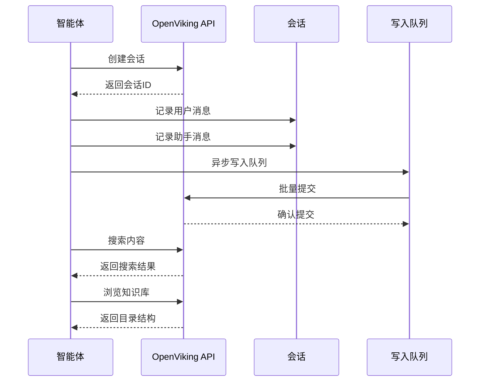

**图表来源**
- [plugins/memory/openviking/__init__.py:252-633](file://plugins/memory/openviking/__init__.py#L252-L633)

**章节来源**
- [plugins/memory/openviking/__init__.py:1-633](file://plugins/memory/openviking/__init__.py#L1-L633)

### Supermemory 内存插件

Supermemory 提供多容器支持和智能记忆管理：

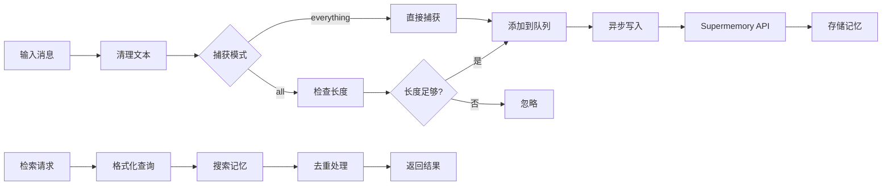

**图表来源**
- [plugins/memory/supermemory/__init__.py:420-792](file://plugins/memory/supermemory/__init__.py#L420-L792)

**章节来源**
- [plugins/memory/supermemory/__init__.py:1-792](file://plugins/memory/supermemory/__init__.py#L1-L792)

### Hindsight 内存插件

Hindsight 提供知识图谱和多策略检索：

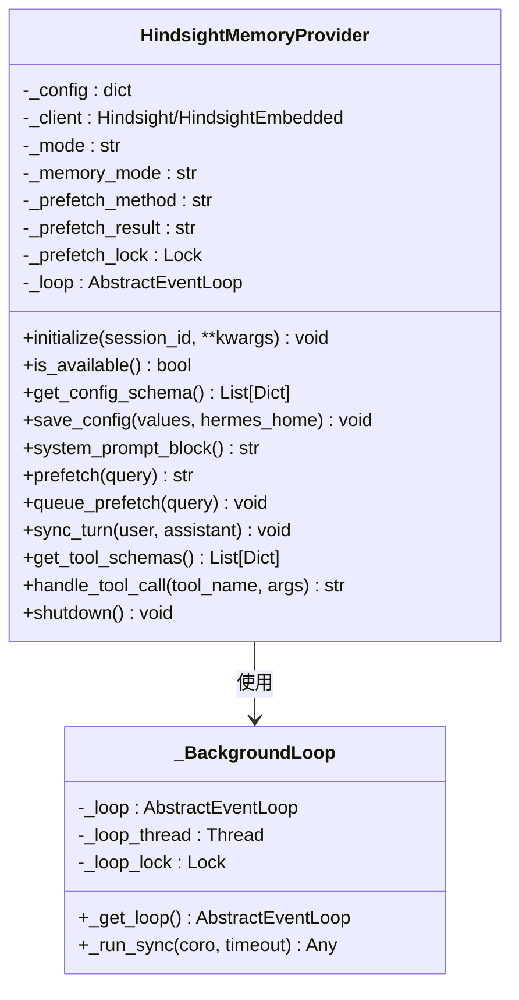

**图表来源**
- [plugins/memory/hindsight/__init__.py:180-516](file://plugins/memory/hindsight/__init__.py#L180-L516)

**章节来源**
- [plugins/memory/hindsight/__init__.py:1-516](file://plugins/memory/hindsight/__init__.py#L1-L516)

### RetainDB 内存插件

RetainDB 提供企业级内存管理和文件存储：

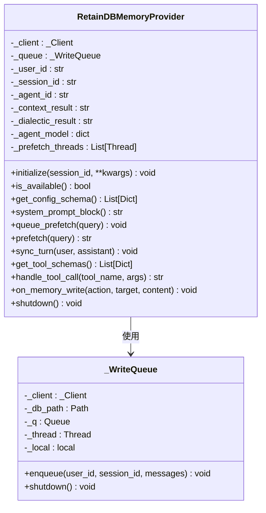

**图表来源**
- [plugins/memory/retaindb/__init__.py:452-767](file://plugins/memory/retaindb/__init__.py#L452-L767)

**章节来源**
- [plugins/memory/retaindb/__init__.py:1-767](file://plugins/memory/retaindb/__init__.py#L1-L767)

## 依赖关系分析

内存插件系统的依赖关系如下：

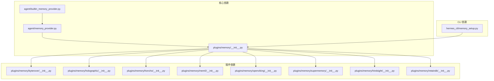

**图表来源**
- [agent/memory_provider.py:1-232](file://agent/memory_provider.py#L1-L232)
- [plugins/memory/__init__.py:1-318](file://plugins/memory/__init__.py#L1-L318)

**章节来源**
- [agent/memory_provider.py:1-232](file://agent/memory_provider.py#L1-L232)
- [plugins/memory/__init__.py:1-318](file://plugins/memory/__init__.py#L1-L318)

## 性能考虑

### 异步处理和线程管理

所有内存插件都实现了异步处理机制：

1. **后台线程池**：使用独立线程处理网络请求和数据库操作
2. **连接复用**：客户端连接在插件生命周期内复用
3. **队列机制**：写入操作通过队列异步处理
4. **超时控制**：所有网络请求都有明确的超时设置

### 缓存策略

- **预取缓存**：提前检索并缓存相关记忆
- **会话缓存**：保持会话期间的一致性
- **配置缓存**：避免重复的配置读取

### 资源管理

- **进程退出安全**：确保在异常情况下资源正确释放
- **内存泄漏防护**：定期清理临时对象和连接
- **并发安全**：使用锁和线程本地存储保证线程安全

## 故障排除指南

### 常见问题诊断

#### 插件加载失败
```bash
# 检查插件是否正确安装
hermes memory status

# 查看详细的错误信息
hermes memory status --verbose
```

#### 配置问题
```bash
# 重新运行设置向导
hermes memory setup

# 检查配置文件
cat ~/.hermes/config.yaml
```

#### 网络连接问题
```bash
# 测试 API 连接
curl -X GET https://api.example.com/health

# 检查代理设置
echo $HTTP_PROXY
echo $HTTPS_PROXY
```

### 性能优化建议

1. **合理配置缓存**：根据使用模式调整预取策略
2. **监控资源使用**：定期检查内存和 CPU 使用情况
3. **优化查询**：使用更精确的查询条件减少响应时间
4. **批量处理**：合并多个小操作为批量操作

**章节来源**
- [hermes_cli/memory_setup.py:454-509](file://hermes_cli/memory_setup.py#L454-L509)

## 结论

Hermes Agent 内存插件系统提供了一个强大而灵活的持久化记忆解决方案。通过统一的接口规范和丰富的插件生态，开发者可以轻松集成各种内存管理方案。

关键优势包括：
- **模块化设计**：易于扩展和维护
- **性能优化**：异步处理和缓存机制
- **配置灵活**：支持多种配置方式
- **错误处理**：完善的异常处理和恢复机制

对于新插件开发者，建议遵循现有的 MemoryProvider 接口规范，充分利用异步处理和缓存机制，确保插件的性能和可靠性。

## 附录

### 插件开发最佳实践

1. **接口实现**：严格遵循 MemoryProvider 接口规范
2. **错误处理**：提供清晰的错误信息和回退策略
3. **配置管理**：支持环境变量和配置文件两种方式
4. **文档编写**：提供详细的使用说明和配置示例
5. **测试覆盖**：包含单元测试和集成测试

### 支持的内存插件类型

| 插件名称 | 类型 | 特点 |
|---------|------|------|
| ByteRover | 本地 CLI | 本地优先，支持云同步 |
| Holographic | 结构化存储 | 实体解析，信任评分 |
| Honcho | 云端服务 | AI 原生用户建模 |
| Mem0 | 云端服务 | 服务器端提取，语义搜索 |
| OpenViking | 云端服务 | 文件系统式浏览 |
| Supermemory | 云端服务 | 多容器支持 |
| Hindsight | 云端/本地 | 知识图谱，多策略检索 |
| RetainDB | 云端服务 | 企业级功能，文件存储 |