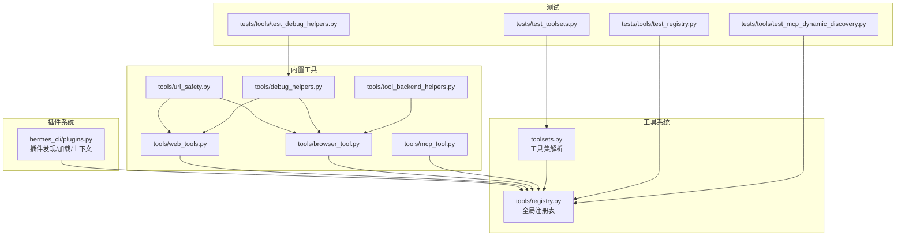
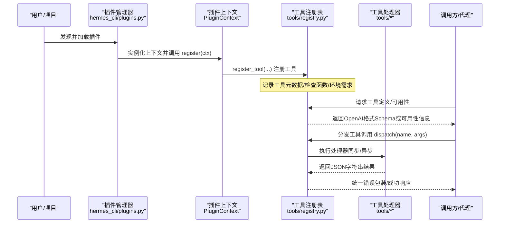
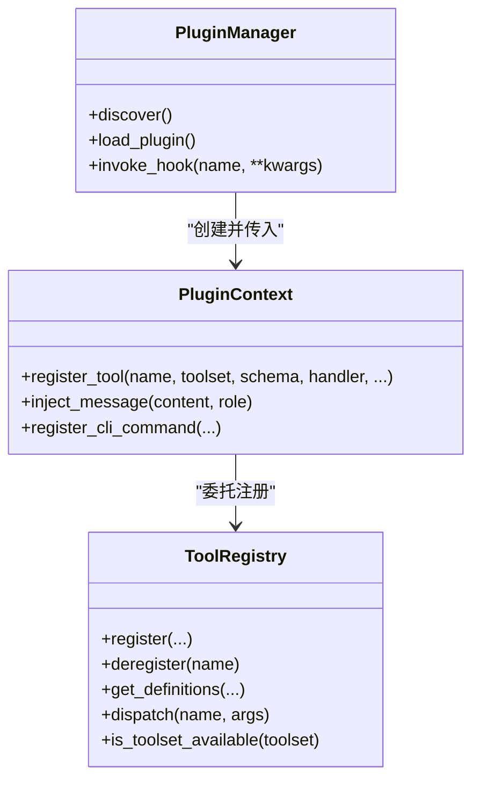
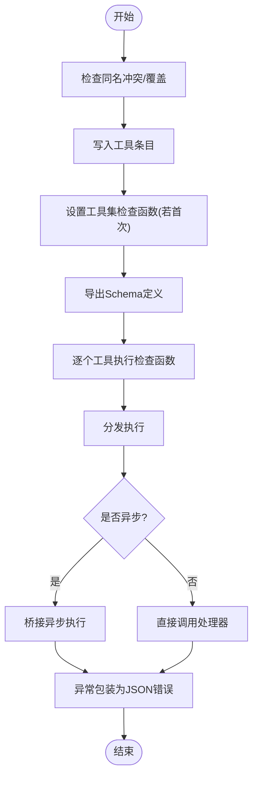
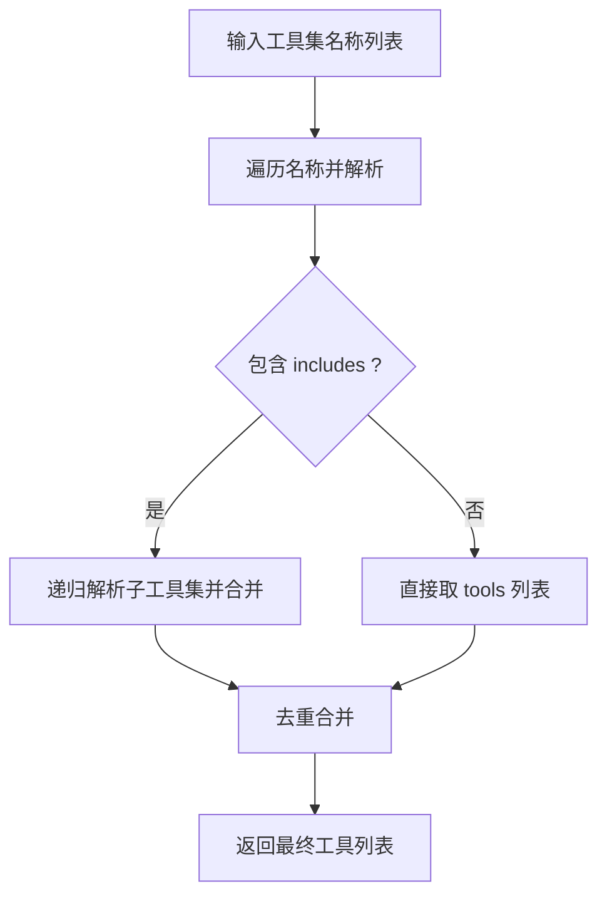
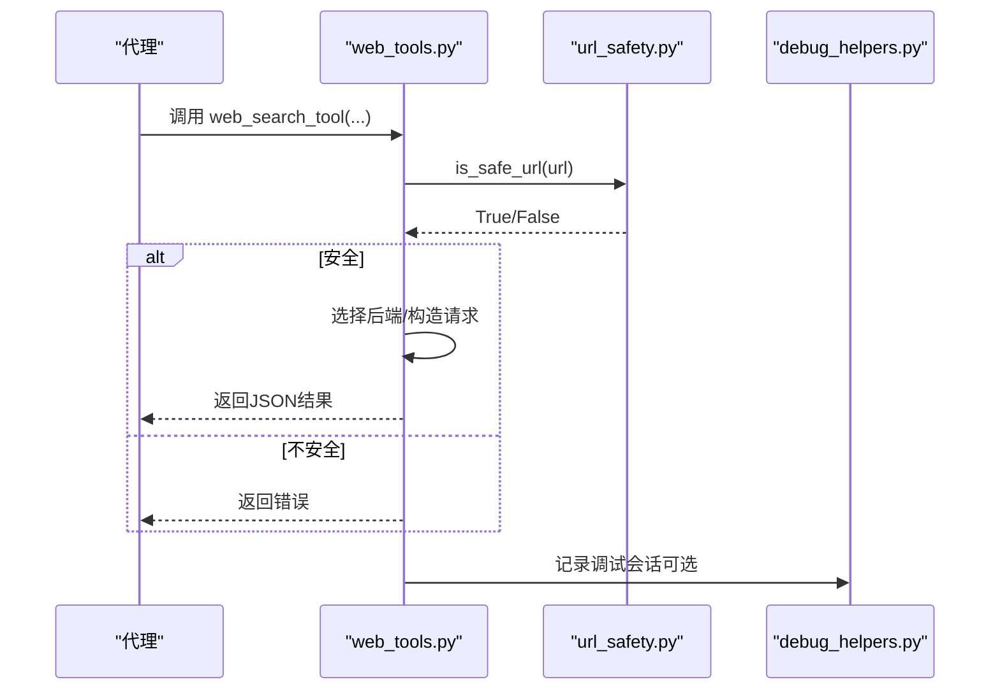
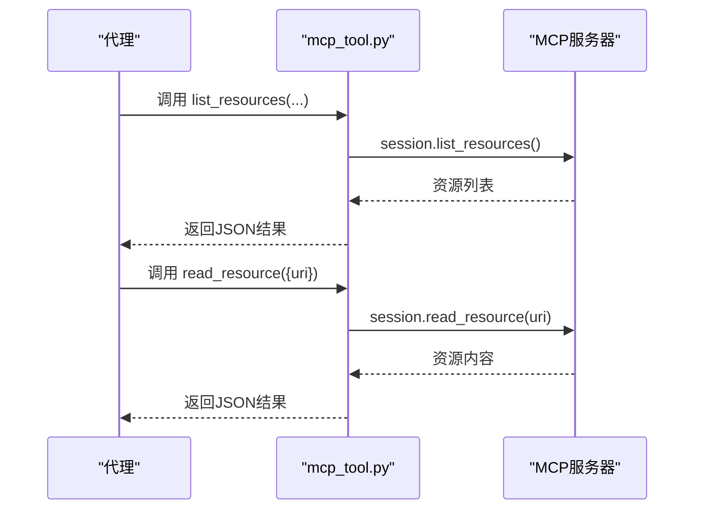
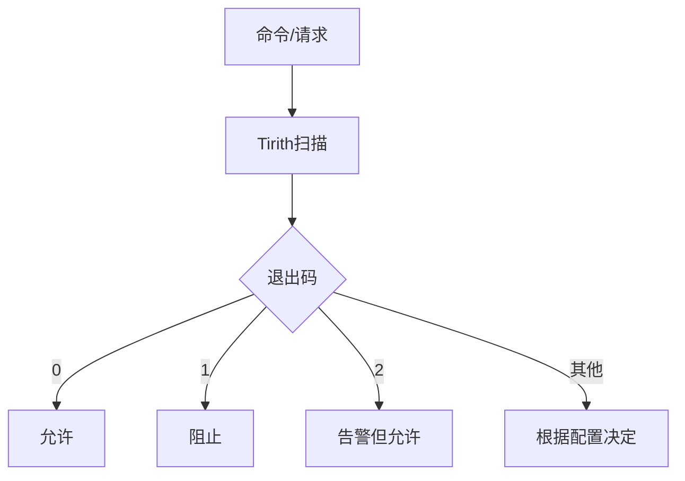
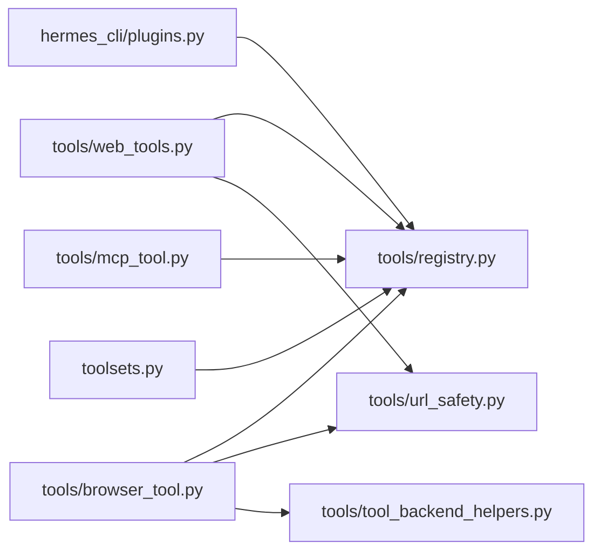

# 工具插件开发

<cite>
**本文引用的文件**
- [plugins.py](file://hermes_cli/plugins.py)
- [registry.py](file://tools/registry.py)
- [toolsets.py](file://toolsets.py)
- [web_tools.py](file://tools/web_tools.py)
- [browser_tool.py](file://tools/browser_tool.py)
- [url_safety.py](file://tools/url_safety.py)
- [tirith_security.py](file://tools/tirith_security.py)
- [mcp_tool.py](file://tools/mcp_tool.py)
- [debug_helpers.py](file://tools/debug_helpers.py)
- [tool_backend_helpers.py](file://tools/tool_backend_helpers.py)
- [__init__.py（tools包）](file://tools/__init__.py)
- [__init__.py（plugins包）](file://plugins/__init__.py)
- [test_registry.py](file://tests/tools/test_registry.py)
- [test_mcp_dynamic_discovery.py](file://tests/tools/test_mcp_dynamic_discovery.py)
- [test_debug_helpers.py](file://tests/tools/test_debug_helpers.py)
- [test_toolsets.py](file://tests/test_toolsets.py)
- [mcp.md（用户指南）](file://website/docs/user-guide/features/mcp.md)
- [architecture.md（开发者指南）](file://website/docs/developer-guide/architecture.md)
</cite>

## 目录
1. [简介](#简介)
2. [项目结构](#项目结构)
3. [核心组件](#核心组件)
4. [架构总览](#架构总览)
5. [详细组件分析](#详细组件分析)
6. [依赖分析](#依赖分析)
7. [性能考虑](#性能考虑)
8. [故障排查指南](#故障排查指南)
9. [结论](#结论)
10. [附录：开发示例与最佳实践](#附录开发示例与最佳实践)

## 简介
本文件面向希望在 Hermes Agent 中开发“工具插件”的工程师，系统性阐述工具插件的开发框架、扩展机制与集成方式，覆盖以下主题：
- 工具注册流程、参数校验与执行管理
- 插件与核心工具系统的集成（发现、加载、调用）
- 安全机制、权限控制与资源管理
- 调试方法、性能监控与版本管理策略
- 开发示例、最佳实践与常见问题

## 项目结构
围绕工具插件的关键目录与文件：
- hermes_cli/plugins.py：插件系统入口，负责插件发现、加载、生命周期钩子与工具注册桥接
- tools/registry.py：全局工具注册表，统一收集、查询与分发工具
- toolsets.py：工具集解析与组合，支持静态与动态工具集
- tools/*：内置工具模块（如 web_tools、browser_tool），均通过注册表暴露能力
- tools/url_safety.py、tools/tirith_security.py：URL安全与命令预执行扫描
- tools/mcp_tool.py：MCP服务器工具封装与动态发现
- tools/debug_helpers.py：调试会话记录与日志导出
- tools/tool_backend_helpers.py：后端选择与模式协商
- tests/tools、tests/test_toolsets.py：测试用例，验证注册、可用性、动态发现等行为

图示来源
- [plugins.py:1-200](file://hermes_cli/plugins.py#L1-L200)
- [registry.py:1-321](file://tools/registry.py#L1-L321)
- [toolsets.py:436-479](file://toolsets.py#L436-L479)
- [web_tools.py:1-200](file://tools/web_tools.py#L1-L200)
- [browser_tool.py:1-200](file://tools/browser_tool.py#L1-L200)
- [url_safety.py:1-97](file://tools/url_safety.py#L1-L97)
- [mcp_tool.py:1275-1344](file://tools/mcp_tool.py#L1275-L1344)
- [debug_helpers.py:1-105](file://tools/debug_helpers.py#L1-L105)
- [tool_backend_helpers.py:1-90](file://tools/tool_backend_helpers.py#L1-L90)
- [test_registry.py:87-251](file://tests/tools/test_registry.py#L87-L251)
- [test_mcp_dynamic_discovery.py:157-170](file://tests/tools/test_mcp_dynamic_discovery.py#L157-L170)
- [test_debug_helpers.py:1-117](file://tests/tools/test_debug_helpers.py#L1-L117)
- [test_toolsets.py:1-45](file://tests/test_toolsets.py#L1-L45)

章节来源
- [plugins.py:1-200](file://hermes_cli/plugins.py#L1-L200)
- [registry.py:1-321](file://tools/registry.py#L1-L321)
- [toolsets.py:436-479](file://toolsets.py#L436-L479)

## 核心组件
- 插件管理器与上下文
  - 插件管理器负责从三类来源（用户、项目、pip入口点）发现并加载插件；每个插件通过 PluginContext 注册工具与生命周期钩子
  - 插件上下文将工具注册委托给全局注册表，确保插件工具与内置工具一致地参与工具集解析与调度
- 全局工具注册表
  - 统一存储工具元数据（名称、Schema、处理器、检查函数、环境要求、异步标记等）
  - 提供工具定义导出、可用性检查、工具集可用性评估、分发执行与错误包装
- 工具集解析
  - 支持静态工具集与包含关系的递归解析，合并去重，兼容多工具集组合
- 内置工具与安全
  - 内置工具（如网页搜索、浏览器自动化）遵循统一注册与可用性检查机制
  - 安全层包括URL白名单/黑名单与私有地址阻断、命令预执行扫描（Tirith）、MCP权限与资源过滤

章节来源
- [plugins.py:122-160](file://hermes_cli/plugins.py#L122-L160)
- [registry.py:45-106](file://tools/registry.py#L45-L106)
- [toolsets.py:436-479](file://toolsets.py#L436-L479)
- [web_tools.py:1-200](file://tools/web_tools.py#L1-L200)
- [browser_tool.py:1-200](file://tools/browser_tool.py#L1-L200)
- [url_safety.py:1-97](file://tools/url_safety.py#L1-L97)
- [tirith_security.py:1-671](file://tools/tirith_security.py#L1-L671)

## 架构总览
下图展示了插件系统与工具系统的交互路径，以及工具注册、可用性检查与执行分发的主干流程。

图示来源
- [plugins.py:131-158](file://hermes_cli/plugins.py#L131-L158)
- [registry.py:144-162](file://tools/registry.py#L144-L162)

章节来源
- [plugins.py:1-200](file://hermes_cli/plugins.py#L1-L200)
- [registry.py:1-321](file://tools/registry.py#L1-L321)

## 详细组件分析

### 插件系统与工具注册
- 插件发现与加载
  - 支持用户级、项目级与pip入口点三类来源
  - 每个插件需提供 manifest 与 register(ctx) 函数
- 工具注册桥接
  - 插件通过 PluginContext.register_tool 将工具注册到全局注册表，并记录为“插件提供”
  - 注册时可指定工具集、Schema、处理器、检查函数、环境变量需求、是否异步、描述与表情符号
- 生命周期钩子
  - 插件可注册 pre/post 钩子，贯穿 LLM 调用、工具调用、API 请求与会话周期

图示来源
- [plugins.py:122-160](file://hermes_cli/plugins.py#L122-L160)
- [registry.py:56-106](file://tools/registry.py#L56-L106)

章节来源
- [plugins.py:1-200](file://hermes_cli/plugins.py#L1-L200)
- [registry.py:1-321](file://tools/registry.py#L1-L321)

### 工具注册表与执行管理
- 注册与去重
  - 同名工具若来自不同工具集，后者会覆盖前者并记录警告
  - 工具集检查函数仅保留首个对应工具集的检查器
- 可用性检查
  - 检查函数异常会被捕获并视为不可用，避免崩溃
  - 工具集可用性由其检查函数决定；未设置检查函数的工具集默认可用
- Schema导出与分发
  - 导出时自动补全名称字段，保证与工具名一致
  - 分发执行时对异步处理器进行桥接，统一异常包装为JSON错误
- 工具集元数据
  - 支持按工具集聚合工具列表、环境变量需求与可用性状态

图示来源
- [registry.py:56-106](file://tools/registry.py#L56-L106)
- [registry.py:111-138](file://tools/registry.py#L111-L138)
- [registry.py:144-162](file://tools/registry.py#L144-L162)
- [registry.py:194-212](file://tools/registry.py#L194-L212)

章节来源
- [registry.py:1-321](file://tools/registry.py#L1-L321)
- [test_registry.py:184-251](file://tests/tools/test_registry.py#L184-L251)

### 工具集解析与组合
- 递归解析 includes，共享已访问集合以避免重复与环检测
- 多工具集合并去重，支持复杂组合场景
- 插件动态注册的工具集可通过工具注册表识别并参与UI展示

图示来源
- [toolsets.py:436-479](file://toolsets.py#L436-L479)
- [test_toolsets.py:28-45](file://tests/test_toolsets.py#L28-L45)

章节来源
- [toolsets.py:436-479](file://toolsets.py#L436-L479)
- [test_toolsets.py:1-45](file://tests/test_toolsets.py#L1-L45)

### 内置工具示例：网页搜索与浏览器自动化
- 网页工具
  - 自动选择后端（Exa/Firecrawl/Parallel/Tavily），支持直连与托管网关
  - URL安全检查与网站策略校验，防止SSRF
  - 调试会话记录，便于问题定位
- 浏览器工具
  - 支持本地Chromium、Browserbase、Browser Use等多种后端
  - 基于可访问性树的文本表示，适合无视觉能力的代理
  - 会话隔离、超时配置与清理策略

图示来源
- [web_tools.py:1-200](file://tools/web_tools.py#L1-L200)
- [url_safety.py:50-97](file://tools/url_safety.py#L50-L97)
- [debug_helpers.py:36-105](file://tools/debug_helpers.py#L36-L105)

章节来源
- [web_tools.py:1-200](file://tools/web_tools.py#L1-L200)
- [browser_tool.py:1-200](file://tools/browser_tool.py#L1-L200)
- [url_safety.py:1-97](file://tools/url_safety.py#L1-L97)
- [debug_helpers.py:1-105](file://tools/debug_helpers.py#L1-L105)

### MCP工具与动态发现
- MCP工具封装
  - 提供连接、列出资源、读取资源等处理器，统一错误处理与超时控制
- 动态发现与清理
  - 注销工具时清理对应工具集检查函数，避免残留
  - 支持服务器通知触发的“核平再重建”式刷新

图示来源
- [mcp_tool.py:1275-1344](file://tools/mcp_tool.py#L1275-L1344)
- [test_mcp_dynamic_discovery.py:157-170](file://tests/tools/test_mcp_dynamic_discovery.py#L157-L170)

章节来源
- [mcp_tool.py:1275-1344](file://tools/mcp_tool.py#L1275-L1344)
- [test_mcp_dynamic_discovery.py:157-170](file://tests/tools/test_mcp_dynamic_discovery.py#L157-L170)

### 安全机制与权限控制
- URL安全
  - 基于主机名与IP范围阻断私有/内部网络地址，DNS失败即阻断
- 命令预执行扫描（Tirith）
  - 通过子进程扫描命令威胁（同源URL、管道注入等），支持失败开/关策略
  - 自动下载与校验（SHA-256、可选cosign供应链证明）
- MCP权限与资源过滤
  - 仅允许显式配置的工具与资源，最小暴露面
  - 过滤敏感环境变量透传，降低泄露风险

图示来源
- [tirith_security.py:600-671](file://tools/tirith_security.py#L600-L671)
- [mcp.md（用户指南）:312-375](file://website/docs/user-guide/features/mcp.md#L312-L375)

章节来源
- [url_safety.py:1-97](file://tools/url_safety.py#L1-L97)
- [tirith_security.py:1-671](file://tools/tirith_security.py#L1-L671)
- [mcp.md（用户指南）:312-375](file://website/docs/user-guide/features/mcp.md#L312-L375)

## 依赖分析
- 插件系统依赖工具注册表进行工具注册与查询
- 内置工具模块在导入时即向注册表注册自身，形成“导入即注册”的发现链
- 工具集解析依赖注册表中的工具集映射与检查函数
- 安全模块被工具模块间接使用，形成横切关注点

图示来源
- [plugins.py:1-200](file://hermes_cli/plugins.py#L1-L200)
- [registry.py:1-321](file://tools/registry.py#L1-L321)
- [toolsets.py:436-479](file://toolsets.py#L436-L479)
- [web_tools.py:1-200](file://tools/web_tools.py#L1-L200)
- [browser_tool.py:1-200](file://tools/browser_tool.py#L1-L200)
- [url_safety.py:1-97](file://tools/url_safety.py#L1-L97)
- [tool_backend_helpers.py:1-90](file://tools/tool_backend_helpers.py#L1-L90)

章节来源
- [plugins.py:1-200](file://hermes_cli/plugins.py#L1-L200)
- [registry.py:1-321](file://tools/registry.py#L1-L321)
- [toolsets.py:436-479](file://toolsets.py#L436-L479)
- [web_tools.py:1-200](file://tools/web_tools.py#L1-L200)
- [browser_tool.py:1-200](file://tools/browser_tool.py#L1-L200)
- [url_safety.py:1-97](file://tools/url_safety.py#L1-L97)
- [tool_backend_helpers.py:1-90](file://tools/tool_backend_helpers.py#L1-L90)

## 性能考虑
- 异步处理器桥接
  - 注册表对异步处理器进行统一桥接，避免调用方感知差异
- 工具集检查缓存
  - 检查函数结果按函数对象缓存，减少重复计算
- 调试日志与开销
  - 调试会话仅在启用时生效，避免生产环境额外开销
- 后端模式协商
  - 通过工具后端助手选择最优执行模式（直连/托管/自动），平衡延迟与稳定性

章节来源
- [registry.py:111-138](file://tools/registry.py#L111-L138)
- [registry.py:155-158](file://tools/registry.py#L155-L158)
- [debug_helpers.py:36-105](file://tools/debug_helpers.py#L36-L105)
- [tool_backend_helpers.py:27-81](file://tools/tool_backend_helpers.py#L27-L81)

## 故障排查指南
- 工具不可用
  - 使用注册表的可用性检查接口确认工具集状态与缺失的环境变量
  - 查看检查函数异常日志，定位依赖缺失或配置错误
- 工具调用失败
  - 检查处理器返回的JSON错误字符串，获取具体异常类型与消息
  - 对异步工具，确认事件循环与超时设置
- 插件加载失败
  - 检查插件目录结构与 manifest，确认 register(ctx) 存在且签名正确
  - 关注插件管理器的日志输出，定位导入或初始化异常
- 调试与可观测性
  - 启用工具特定调试环境变量，生成调试日志文件
  - 使用调试会话接口获取会话信息，辅助复盘

章节来源
- [registry.py:194-212](file://tools/registry.py#L194-L212)
- [registry.py:144-162](file://tools/registry.py#L144-L162)
- [plugins.py:380-412](file://hermes_cli/plugins.py#L380-L412)
- [debug_helpers.py:91-105](file://tools/debug_helpers.py#L91-L105)
- [test_debug_helpers.py:1-117](file://tests/tools/test_debug_helpers.py#L1-L117)

## 结论
Hermes 的工具插件体系以“导入即注册”的轻量机制为核心，结合插件管理器与全局注册表，实现了工具的统一发现、验证与执行。内置工具遵循一致的可用性检查与安全策略，MCP工具支持动态发现与权限控制，调试与性能优化贯穿设计。该架构既满足扩展灵活性，又保障了安全性与可观测性。

## 附录：开发示例与最佳实践

### 开发步骤（从零到一）
- 创建插件目录与清单
  - 在用户或项目插件目录中创建插件根目录与清单文件
  - 清单中声明工具集、提供的工具与钩子
- 编写插件入口
  - 在插件包中提供 register(ctx) 函数
  - 在其中调用 ctx.register_tool 注册工具
- 实现工具处理器
  - 处理器应返回JSON字符串（可使用注册表提供的工具结果/错误辅助）
  - 如为异步，确保返回协程并由注册表桥接
- 声明可用性检查
  - 提供检查函数，用于判断运行时环境是否满足依赖
  - 检查函数异常将被视为不可用，避免崩溃
- 集成与测试
  - 启动应用后，通过工具集解析与可用性检查验证
  - 使用测试用例覆盖注册、可用性、动态发现等关键路径

章节来源
- [plugins.py:1-200](file://hermes_cli/plugins.py#L1-L200)
- [registry.py:56-106](file://tools/registry.py#L56-L106)
- [test_registry.py:120-182](file://tests/tools/test_registry.py#L120-L182)
- [test_mcp_dynamic_discovery.py:157-170](file://tests/tools/test_mcp_dynamic_discovery.py#L157-L170)

### 安全与合规建议
- 最小暴露面
  - 仅在MCP配置中显式暴露必要工具与资源
  - 严格限制环境变量透传，避免敏感信息泄露
- 输入校验
  - 对外部输入进行URL安全检查与重定向目标二次校验
  - 对命令执行前进行预扫描，必要时采用失败开策略
- 权限与审计
  - 为MCP服务器配置鉴权头与只读/受限工具集
  - 记录调试会话，便于事后审计

章节来源
- [mcp.md（用户指南）:312-375](file://website/docs/user-guide/features/mcp.md#L312-L375)
- [url_safety.py:1-97](file://tools/url_safety.py#L1-L97)
- [tirith_security.py:600-671](file://tools/tirith_security.py#L600-L671)

### 调试与性能监控
- 调试
  - 通过工具特定环境变量启用调试会话，保存JSON日志
  - 使用调试会话接口获取会话信息，辅助问题定位
- 性能
  - 对耗时操作（网络/IO）使用异步处理器并合理设置超时
  - 利用注册表的检查函数缓存与工具集可用性批量查询

章节来源
- [debug_helpers.py:36-105](file://tools/debug_helpers.py#L36-L105)
- [registry.py:111-138](file://tools/registry.py#L111-L138)
- [registry.py:194-212](file://tools/registry.py#L194-L212)

### 版本管理策略
- 工具集演进
  - 使用 includes 组合工具集，避免硬编码变更
  - 通过检查函数与环境变量需求表达依赖版本
- 插件版本
  - 在清单中声明版本号，配合源类型（用户/项目/入口点）区分来源
- MCP动态发现
  - 服务器通知触发的注销与重建，确保工具集与服务器状态一致

章节来源
- [toolsets.py:436-479](file://toolsets.py#L436-L479)
- [plugins.py:91-104](file://hermes_cli/plugins.py#L91-L104)
- [test_mcp_dynamic_discovery.py:157-170](file://tests/tools/test_mcp_dynamic_discovery.py#L157-L170)