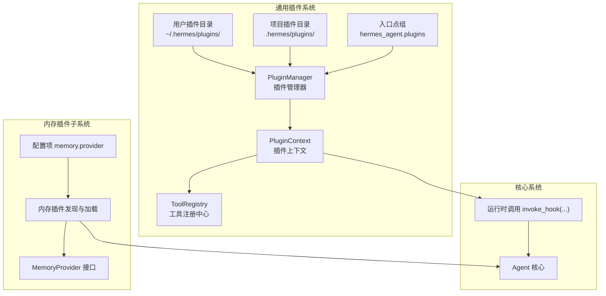
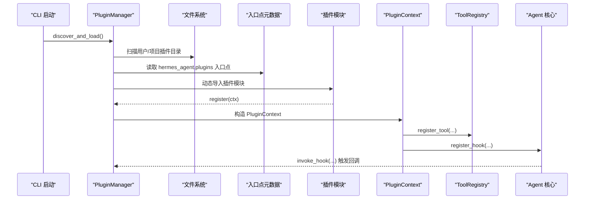
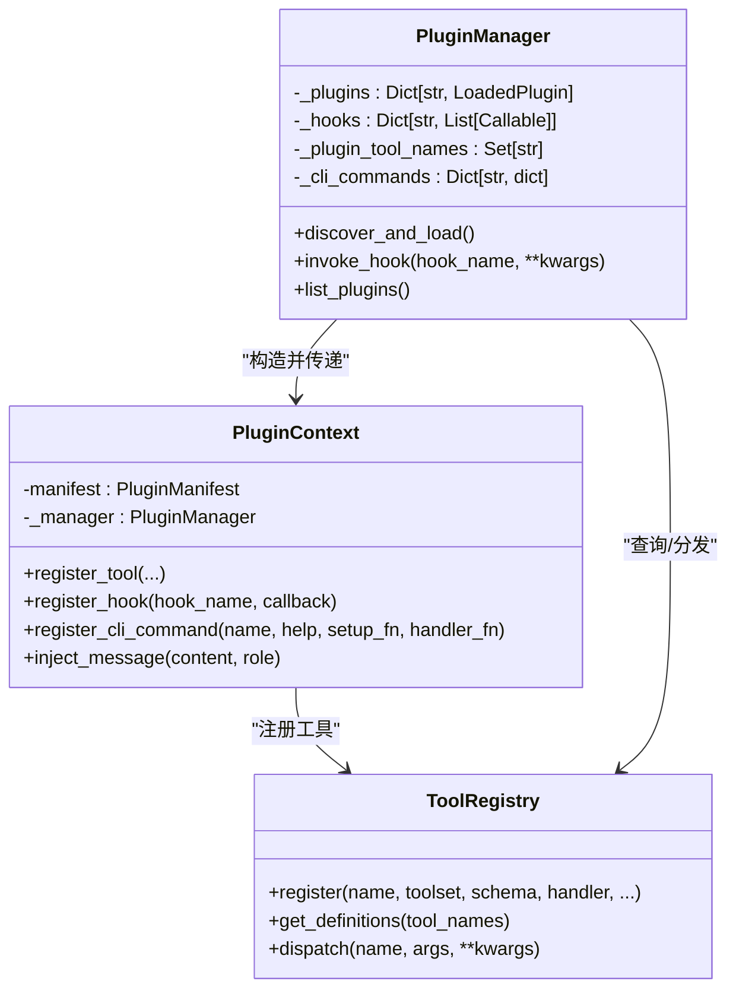
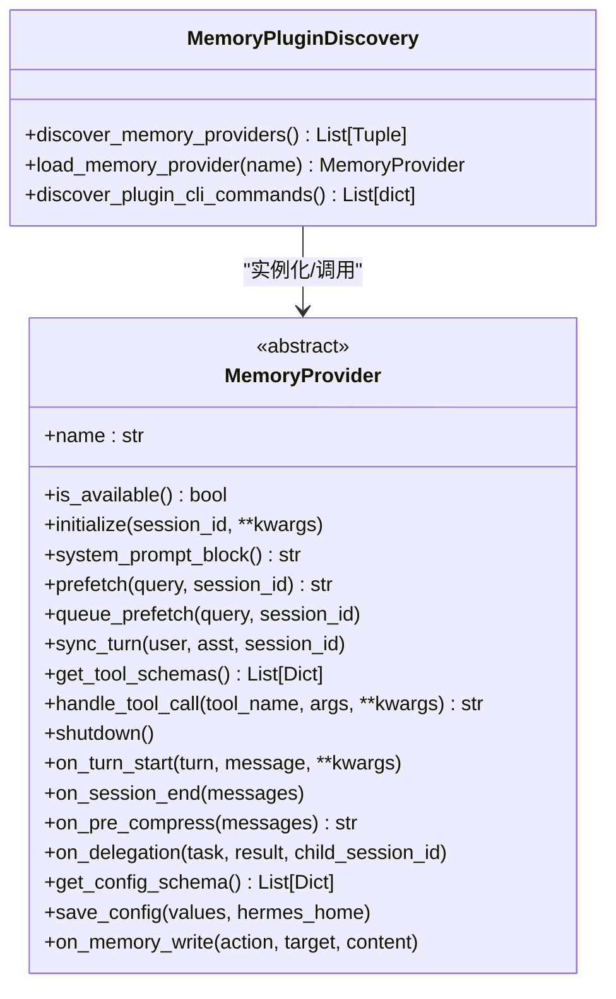
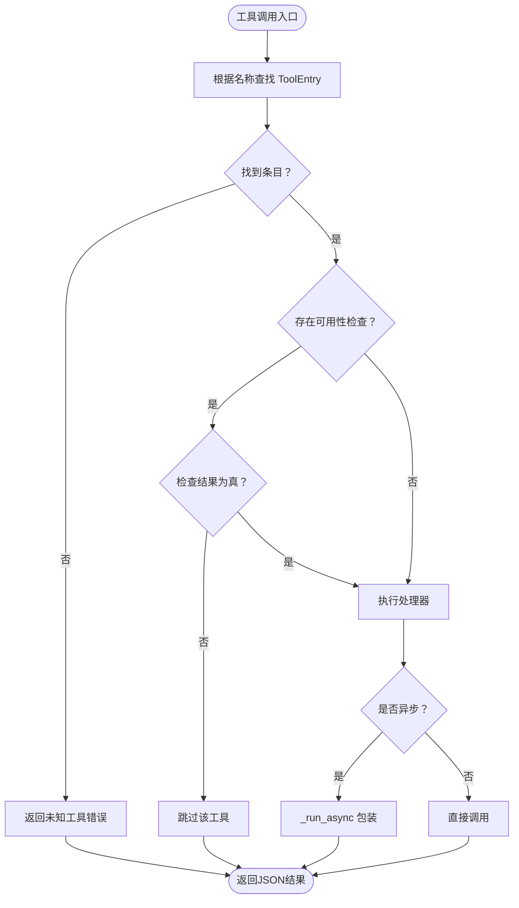
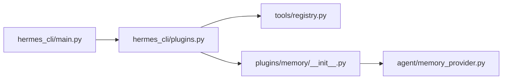

# 插件架构设计

<cite>
**本文档引用的文件**
- [plugins/__init__.py](file://plugins/__init__.py)
- [hermes_cli/plugins.py](file://hermes_cli/plugins.py)
- [hermes_cli/plugins_cmd.py](file://hermes_cli/plugins_cmd.py)
- [tools/registry.py](file://tools/registry.py)
- [agent/memory_provider.py](file://agent/memory_provider.py)
- [plugins/memory/__init__.py](file://plugins/memory/__init__.py)
- [hermes_cli/main.py](file://hermes_cli/main.py)
- [website/docs/guides/build-a-hermes-plugin.md](file://website/docs/guides/build-a-hermes-plugin.md)
- [website/docs/user-guide/features/hooks.md](file://website/docs/user-guide/features/hooks.md)
</cite>

## 目录
1. [简介](#简介)
2. [项目结构](#项目结构)
3. [核心组件](#核心组件)
4. [架构总览](#架构总览)
5. [详细组件分析](#详细组件分析)
6. [依赖关系分析](#依赖关系分析)
7. [性能考虑](#性能考虑)
8. [故障排除指南](#故障排除指南)
9. [结论](#结论)
10. [附录](#附录)

## 简介
本文件面向Hermes Agent插件架构设计，系统性阐述插件系统的整体原理与实现细节，包括插件发现与加载机制、注册流程与生命周期管理、接口规范与依赖注入、模块化设计原则、插件与核心系统的解耦方式与通信协议，并提供架构图与组件关系图，帮助开发者快速理解并高效扩展插件生态。

## 项目结构
Hermes Agent的插件体系由“通用插件系统”和“内存插件子系统”两部分组成：
- 通用插件系统：通过目录扫描、入口点扫描与动态导入，发现并加载用户自定义或第三方安装的插件；插件通过统一的注册接口向工具注册中心与生命周期钩子系统注册能力。
- 内存插件子系统：独立于通用插件系统，扫描内置的内存插件目录，按配置选择并激活单一外部内存提供者，同时支持其专属CLI命令。

图表来源
- [hermes_cli/plugins.py:238-538](file://hermes_cli/plugins.py#L238-L538)
- [plugins/memory/__init__.py:32-96](file://plugins/memory/__init__.py#L32-L96)
- [agent/memory_provider.py:42-232](file://agent/memory_provider.py#L42-L232)

章节来源
- [hermes_cli/plugins.py:1-610](file://hermes_cli/plugins.py#L1-L610)
- [plugins/memory/__init__.py:1-318](file://plugins/memory/__init__.py#L1-L318)
- [agent/memory_provider.py:1-232](file://agent/memory_provider.py#L1-L232)

## 核心组件
- 插件管理器（PluginManager）：负责扫描、加载与生命周期调度，维护插件清单、钩子回调集合与已注册工具集。
- 插件上下文（PluginContext）：向插件暴露注册接口（工具、钩子、CLI），并提供消息注入等能力。
- 工具注册中心（ToolRegistry）：集中管理所有工具的Schema与处理器，提供查询、分发与可用性检查。
- 内存提供者接口（MemoryProvider）：抽象外部可选内存后端，定义初始化、预取、同步、工具Schema与生命周期钩子等接口。
- 内存插件发现器（plugins.memory）：扫描内置内存插件目录，按配置加载单一外部提供者，并支持其CLI命令。

章节来源
- [hermes_cli/plugins.py:122-538](file://hermes_cli/plugins.py#L122-L538)
- [tools/registry.py:45-321](file://tools/registry.py#L45-L321)
- [agent/memory_provider.py:42-232](file://agent/memory_provider.py#L42-L232)
- [plugins/memory/__init__.py:32-318](file://plugins/memory/__init__.py#L32-L318)

## 架构总览
插件系统采用“声明式注册 + 运行时调度”的模式：
- 发现阶段：从用户目录、项目目录与pip入口点三类来源扫描插件清单，解析manifest并动态导入模块。
- 注册阶段：调用插件的register(ctx)函数，插件通过ctx注册工具Schema与处理器、生命周期钩子以及CLI命令。
- 调度阶段：核心系统在合适时机调用invoke_hook触发钩子回调，工具调用经由工具注册中心统一分发。

图表来源
- [hermes_cli/plugins.py:253-412](file://hermes_cli/plugins.py#L253-L412)
- [hermes_cli/plugins.py:466-500](file://hermes_cli/plugins.py#L466-L500)

章节来源
- [hermes_cli/plugins.py:253-412](file://hermes_cli/plugins.py#L253-L412)
- [hermes_cli/plugins.py:466-500](file://hermes_cli/plugins.py#L466-L500)

## 详细组件分析

### 组件A：通用插件系统（PluginManager/PluginContext）
- 插件发现与加载
  - 用户插件：扫描~/.hermes/plugins/下的子目录，要求存在plugin.yaml与__init__.py。
  - 项目插件：当启用环境变量开关时，扫描当前工作目录下的.hermes/plugins/。
  - Pip插件：通过importlib.metadata读取入口点组hermes_agent.plugins。
- 注册流程
  - 调用插件模块的register(ctx)函数，插件通过ctx注册工具、钩子与CLI命令。
  - 工具注册委托给工具注册中心，确保与内置工具一致的Schema与处理器模型。
- 生命周期钩子
  - 支持pre_tool_call、post_tool_call、pre_llm_call、post_llm_call、pre_api_request、post_api_request、on_session_start、on_session_end等。
  - 钩子回调被逐一调用，异常被捕获并记录，避免单个插件影响核心循环。
- 消息注入与CLI命令
  - 提供向会话注入消息的能力，用于远程控制或桥接场景。
  - 支持注册CLI子命令，便于在hermes命令下扩展功能。

图表来源
- [hermes_cli/plugins.py:238-538](file://hermes_cli/plugins.py#L238-L538)
- [tools/registry.py:45-162](file://tools/registry.py#L45-L162)

章节来源
- [hermes_cli/plugins.py:55-64](file://hermes_cli/plugins.py#L55-L64)
- [hermes_cli/plugins.py:122-232](file://hermes_cli/plugins.py#L122-L232)
- [hermes_cli/plugins.py:238-538](file://hermes_cli/plugins.py#L238-L538)
- [tools/registry.py:45-162](file://tools/registry.py#L45-L162)

### 组件B：内存插件子系统（MemoryProvider）
- 设计要点
  - 外部内存提供者作为“附加层”，与内置内存并存，但同一时间仅激活一个外部提供者。
  - 通过配置项memory.provider选择当前外部提供者，加载其模块并实例化。
- 生命周期接口
  - 初始化、系统提示块、预取、每回合同步、工具Schema与处理、关闭等。
  - 可选钩子：每回合开始、会话结束、压缩前提取、镜像内置写入、委托观察等。
- CLI集成
  - 仅对当前激活的内存插件注册CLI命令，避免多提供者冲突。

图表来源
- [agent/memory_provider.py:42-232](file://agent/memory_provider.py#L42-L232)
- [plugins/memory/__init__.py:32-318](file://plugins/memory/__init__.py#L32-L318)

章节来源
- [agent/memory_provider.py:1-232](file://agent/memory_provider.py#L1-L232)
- [plugins/memory/__init__.py:1-318](file://plugins/memory/__init__.py#L1-L318)

### 组件C：工具注册中心（ToolRegistry）
- 职责
  - 统一收集工具Schema与处理器，屏蔽具体工具模块的差异。
  - 提供Schema查询、工具分发（含异步桥接）、可用性检查与工具集元数据。
- 设计模式
  - 单例模式，避免循环导入问题，保证跨模块一致性。
  - 对工具处理器的异常进行捕获并返回标准化错误字符串，提升健壮性。

图表来源
- [tools/registry.py:144-162](file://tools/registry.py#L144-L162)

章节来源
- [tools/registry.py:45-321](file://tools/registry.py#L45-L321)

### 组件D：插件CLI命令（hermes plugins）
- 功能
  - 安装：从Git仓库克隆到用户插件目录，读取plugin.yaml，复制示例配置，提示缺失环境变量，显示安装后说明。
  - 更新：对已安装插件执行git pull，自动复制新增示例文件。
  - 移除：删除插件目录。
  - 列表/切换：列出已安装插件，交互式勾选启用/禁用。
  - 启用/禁用：基于配置文件维护禁用列表。
- 安全与兼容
  - 路径名校验防止路径穿越。
  - manifest_version版本兼容性检查，不满足时提示升级CLI。

章节来源
- [hermes_cli/plugins_cmd.py:284-468](file://hermes_cli/plugins_cmd.py#L284-L468)
- [hermes_cli/plugins_cmd.py:470-535](file://hermes_cli/plugins_cmd.py#L470-L535)
- [hermes_cli/plugins_cmd.py:537-666](file://hermes_cli/plugins_cmd.py#L537-L666)

## 依赖关系分析
- 插件管理器依赖
  - 文件系统：扫描用户/项目插件目录。
  - 入口点元数据：读取pip安装的插件。
  - 工具注册中心：转发工具注册请求。
  - 核心系统：通过invoke_hook触发生命周期事件。
- 内存插件发现器依赖
  - 配置系统：读取memory.provider确定当前激活提供者。
  - 内存提供者接口：实例化并调用其方法。
- CLI启动链路
  - hermes_cli/main.py在启动早期加载环境变量与日志配置，随后初始化插件系统，确保插件在核心逻辑之前完成注册。

图表来源
- [hermes_cli/main.py:1-200](file://hermes_cli/main.py#L1-L200)
- [hermes_cli/plugins.py:1-610](file://hermes_cli/plugins.py#L1-L610)
- [tools/registry.py:1-321](file://tools/registry.py#L1-L321)
- [plugins/memory/__init__.py:1-318](file://plugins/memory/__init__.py#L1-L318)
- [agent/memory_provider.py:1-232](file://agent/memory_provider.py#L1-L232)

章节来源
- [hermes_cli/main.py:1-200](file://hermes_cli/main.py#L1-L200)
- [hermes_cli/plugins.py:1-610](file://hermes_cli/plugins.py#L1-L610)
- [tools/registry.py:1-321](file://tools/registry.py#L1-L321)
- [plugins/memory/__init__.py:1-318](file://plugins/memory/__init__.py#L1-L318)
- [agent/memory_provider.py:1-232](file://agent/memory_provider.py#L1-L232)

## 性能考虑
- 插件加载
  - 使用命名空间包与动态spec导入，避免不必要的模块缓存污染。
  - 对入口点扫描与目录扫描分别处理，减少IO开销。
- 工具分发
  - 异步处理器通过统一桥接函数执行，避免在核心循环中阻塞。
  - 工具可用性检查结果缓存，降低重复检查成本。
- 生命周期钩子
  - 回调逐一执行并独立try/except，避免单个插件异常拖慢全局。

## 故障排除指南
- 插件未加载
  - 检查plugin.yaml是否存在且格式正确；确认__init__.py包含register(ctx)函数。
  - 查看插件管理器日志，关注“no register() function”“Failed to load plugin”等警告。
- 工具不可见
  - 确认工具Schema通过ToolRegistry.register注册；检查工具可用性检查函数返回值。
  - 若工具属于工具集，确认工具集check_fn返回True。
- 钩子无效
  - 确认钩子名称在有效集合内；检查回调签名与返回值（pre_llm_call除外）。
- 内存插件冲突
  - 确认仅有一个外部内存提供者被激活；检查配置项memory.provider设置。

章节来源
- [hermes_cli/plugins.py:366-412](file://hermes_cli/plugins.py#L366-L412)
- [tools/registry.py:111-138](file://tools/registry.py#L111-L138)
- [website/docs/user-guide/features/hooks.md:306-351](file://website/docs/user-guide/features/hooks.md#L306-L351)

## 结论
Hermes Agent插件架构以“声明式注册 + 运行时调度”为核心，通过统一的插件上下文与工具注册中心实现插件与核心系统的低耦合解耦；生命周期钩子与消息注入机制提供了强大的扩展点；内存插件子系统则在保持内置内存的同时，允许用户按需启用单一外部提供者。整体设计兼顾易用性、安全性与可维护性，适合构建丰富而稳定的插件生态。

## 附录
- 插件开发基础概念与设计模式
  - Manifest声明：通过plugin.yaml声明插件元信息、提供的工具与钩子。
  - Schema优先：为工具编写清晰描述与参数Schema，提升LLM决策质量。
  - 处理器契约：严格遵循“接收参数字典、返回JSON字符串”的约定。
  - 钩子使用：合理利用生命周期钩子进行日志、指标与状态管理。
  - 示例参考：参阅官方指南中的计算器插件示例，了解从Schema到Handler再到注册的完整流程。

章节来源
- [website/docs/guides/build-a-hermes-plugin.md:1-200](file://website/docs/guides/build-a-hermes-plugin.md#L1-L200)
- [website/docs/guides/build-a-hermes-plugin.md:240-307](file://website/docs/guides/build-a-hermes-plugin.md#L240-L307)